2004. október 15-én rendezte meg az Eötvös Loránd Fizikai Társulat az azévi Eötvös-versenyt. Budapesten 76, Pécsen 15, Szegeden, Veszprémben és Szekszárdon 10-10, Debrecenben 9, Győrben 6, Miskolcon 5, Békéscsabán, Egerben, Kecskeméten, Nagykanizsán, Nyíregyházán és Sopronban 3-3, Székesfehérváron 2, összesen tehát 161 dolgozatot adtak be a versenyen részt vett - idén érettségizett, illetve középiskolás - diákok. Közülük 1 volt külföldi (szlovákiai) állampolgár, ő Győrben versenyzett.

Ismertetjük a feladatokat és a feladatok helyes megoldását.

1. Egy habókos lakberendezó állófogast tervez, két változatban. Egy negyedkörív alakú, vékony, de erós rugalmas fémszálat egyik végénél szilárdan hozzáerốsít egy merev törzshöz, egyszer az a), másszor a b) elrendezésben (1. ábra). Meglepódve tapasztalja, hogy ha ugyanakkora terhet akaszt a fogasokra, a fémszálak végpontja nem ugyanannyival süllyed le a két esetben.

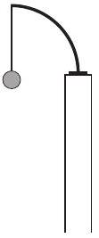
a)

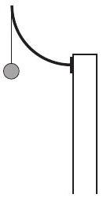
b)

1. ábra

Okoskodjuk ki egyszerũ megfontolásokkal, hogy melyik esetben nagyobb a végpont lesüllyedése!
Megoldás. Vegyük észre, hogy a külső erő hatására a negyedkörív alakú rugalmas fémszál alakja fog megváltozni, pontosabban az eró által kifejtett (pontról pontra változó) forgatónyomaték okozza a szál alakjának megváltozását. A szál hosszának megváltozása (megnyúlása) elhanyagolható a szál alakjának megváltozása (lehajlása) mellett.

Célszerú lesz a két fémszál alakváltozását úgy összehasonlítani, hogy kölcsönösen egyértelmüen megfeleltetjük egymásnak a két szál pontjait. A megfeleltetett pontokban fellépő deformációkat (elhajlásokat) hasonlítjuk össze, majd megvizsgáljuk, hogy ezek a deformációk milyen mértékben járulnak hozzá a végpontok lesüllyedéséhez.

Képzeljük - modellezzük - a rugalmas fémszálat nagyon kis szemekből álló láncnak, ahol az egyes (merev) láncszemeket piciny spirálrugók kapcsolják egymáshoz. A lánc (melynek saját súlyát elhanyagoljuk) terheletlen állapotában pontosan negyedkört formál.

Írjuk fel, hogy mekkora forgatónyomatékot gyakorol a teher függőleges irányú $G$ súlya a fémszálnak $\varphi$ szöggel jellemzett helyén az ottani „spirálrugóra” (2. ábra)! (Ezen rugó elfordulása nyomán kialakuló visszatérítő nyomaték fogja majd $G$-nek azon a helyen fellépő forgatónyomatékát kiegyenlíteni, kompenzálni.)

Amint az az ábráról is leolvasható, ugyanazon $\varphi$ szöghöz tartozó pontokban az $M$ forgatónyomaték az $a$ ) esetben sohasem lehet kisebb a $b$ ) esetben fellépőnél, mivel $\sin \varphi \geq 1 - \cos \varphi$. Az egyenlőség $\operatorname { csak } \varphi = 0$ és $\varphi = \frac { \pi } { 2 }$ esetben (vagyis a szál végpontjainál) áll fenn, közben $M _ { a }$ mindig határozottan nagyobb, mint $M _ { b }$.

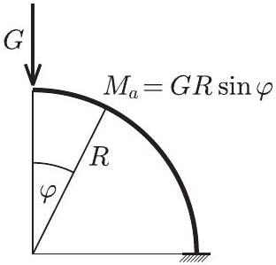
a)

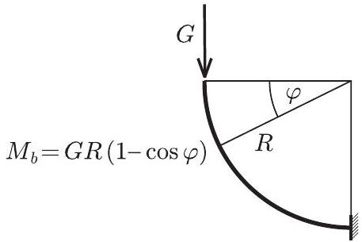
b)

2. ábra

Ebből már látszik, hogy a fémszál deformációja (görbültségének megváltozása) minden bizonnyal az $a$ ) esetben lesz nagyobb. Azt kell még megnéznünk, hogyan jelentkezik mindez a szál végpontjának lesüllyedésében. Sejtésünk az, hogy a nagyobb deformáció nagyobb lesüllyedést is eredményez.

Vizsgáljuk meg, hogy ha csupán a $\varphi$ szöggel megjelölt pontban jönne létre deformáció (ha csak az ottani kis spirálrugó csavarodna el), ez a végpontnak mekkora függőleges elmozdulását (lesüllyedését) eredményezné!

Az $a$ ) esetben a 3. ábrán látható $\widehat { P A }$ ív elhajlása $\left( \varepsilon _ { a } \right)$ az $M _ { a }$ forgatónyomatékkal, a $b$ ) esetben a $\widehat { P B }$ ív $\left( \varepsilon _ { b } \right)$ elhajlása az $M _ { b }$ forgatónyomatékkal arányos. Mondhatjuk, hogy az $A A ^ { \prime }$ szakasz hossza annyiszorosa a $B B ^ { \prime }$ szakasz hosszának, ahányszorosa az $M _ { a }$ nyomaték nagysága az $M _ { b }$ nagyságának.

3. ábra

Vegyük észre azt is, hogy az $A A ^ { \prime }$ irány közelebb áll a függőlegeshez, mint a $B B ^ { \prime }$ irány! Egyszerú geometriai megfontolásból következik, hogy a végpontok lesüllyedésének aránya

$$
\frac { \Delta h _ { b } } { \Delta h _ { a } } = \frac { \varepsilon _ { b } } { \varepsilon _ { a } } \frac { \sin \frac { \varphi } { 2 } } { \cos \frac { \varphi } { 2 } } = \frac { \varepsilon _ { b } } { \varepsilon _ { a } } \operatorname { tg } \frac { \varphi } { 2 } .
$$

Másrészt

$$
\frac { \varepsilon _ { b } } { \varepsilon _ { a } } = \frac { M _ { b } } { M _ { a } } = \frac { 1 - \cos \varphi } { \sin \varphi } = \operatorname { tg } \frac { \varphi } { 2 } ,
$$

ezért

$$
\frac { \Delta h _ { b } } { \Delta h _ { a } } = \operatorname { tg } ^ { 2 } \frac { \varphi } { 2 } \leq 1 , \quad \text { ha } \quad 0 \leq \varphi \leq \frac { \pi } { 2 } .
$$

Beláttuk tehát, hogy a két fémszál egymásnak megfeleltetett pontjai közül (a végpontoktól eltekintve) mindig az $a$ ) esetbeli pontoknál fellépő deformáció ad nagyobb járulékot a szál végének lesüllyedéséhez. Mivel a teljes alakváltozás összetehető az egyes spirálrugók deformációiból származó alakváltozásokból, kimondhatjuk: az a) esetben nagyobb a szál végpontjának lesüllyedése.

Megjegyzések. 1. Energetikai megfontolásokkal és integrálszámítással numerikusan is meg tudjuk határozni a kétféle lesüllyedés arányát, jóllehet a versenyen ez nem volt feladat.

Ha a fogas végére - óvatosan növelve a terhelést - maximálisan $G$ nagyságú erốt fejtünk ki, és ennek hatására a végpont $\Delta h$-val mélyebbre kerül, akkor összesen $W = \frac { 1 } { 2 } G \Delta h$ munkát végzünk. (Az $\frac { 1 } { 2 }$-es faktor onnan származik, hogy az erő átlagértéke a maximális érték fele.) Ez a munkavégzés a kicsit meghajlított szálban tárolt rugalmas energiával egyenlő, ami a szál egyes darabkáiban tárolt energiák összegeként számítható. Egy-egy darabka rugalmas energiája - a megfeszített egyenes rugó energiaképletének analógiájára - a darabka hosszával és a végein ható forgatónyomaték négyzetével arányos. Ezek szerint a kétféle ruhafogas energiaviszonyait összevetve:

$$
\frac { W _ { a } } { W _ { b } } = \frac { \Delta h _ { a } } { \Delta h _ { b } } = \frac { \int M _ { a } ^ { 2 } ( \varphi ) \mathrm { d } s } { \int M _ { b } ^ { 2 } ( \varphi ) \mathrm { d } s } = \frac { \int _ { 0 } ^ { \pi / 2 } \sin ^ { 2 } ( \varphi ) \mathrm { d } \varphi } { \int _ { 0 } ^ { \pi / 2 } ( 1 - \cos \varphi ) ^ { 2 } \mathrm {~d} \varphi } = \frac { \frac { 1 } { 2 } \frac { \pi } { 2 } } { \frac { \pi } { 2 } - 2 + \frac { 1 } { 2 } \frac { \pi } { 2 } } = \frac { \pi } { 3 \pi - 8 } \approx 2,2 .
$$

2. Természetesen más úton is eljuthatunk a helyes válaszhoz. Minden egyszerú megfontolás során a negyedkör alakú rugalmas fémszálat valamilyen egyszerú módon modellezzük. Az egymásnak megfeleltethető ívek, szakaszok deformációit hasonlítjuk össze, s ebből következtetünk a végpont lesüllyedésére. Tekinthetjük az eredeti negyedkörívek helyett akár a 4. ábrán látható derékszögeket is! Ebben a közelítésben a teljes alakváltozás két tag összegeként, a (kezdetben) vízszintes, illetve függőleges szárak deformációjából tehető össze.
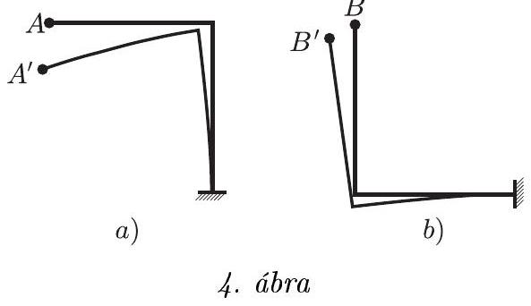

A vízszintes szakaszok lehajlása, ha a függőleges szárak nem tudnának elmozdulni, azonos terhelés esetén ugyanakkora lenne; eddig tehát még egyformán viselkedik a két ruhafogas. A függőleges szakaszok deformációjának hatása a végpont lesüllyedésére azonban a két változatnál már különböző lesz. Az $a$ ) esetben a derékszög függőleges szára is elgörbül (hiszen a vízszintes szár a sarokpontnál forgatónyomatékot fejt ki rá), s ez az $A ^ { \prime }$ végpont további függőleges elmozdulását eredményezi. A b) esetben viszont a függőleges szár alakja gyakorlatilag változatlan marad, mindössze elfordul (a vízszintes szár lehajlása miatt); ez az elfordulás azonban a $B$ végpont majdnem pontosan vízszintes irányú elmozdulását hozza létre, tehát nem járul hozzá annak függőleges irányú lesüllyedéséhez.

Látható, hogy ebben a durva modellben az $a$ ) esetbeli végpont lesüllyedése kb. kétszerese a $b$ ) esetének, és sejthető, hogy az eredeti, negyedkörív alakú szálakhoz visszatérve a lehajlások arányának számértéke ugyan más lesz, de az egyenlőtlenség iránya nem változik meg.
2. Nyílásával lefelé fordított, függốleges helyzetben rögzített kémcsó éppen hogy bemerül egy nagy tál vízbe (5. ábra). A víz és a környezet hốmérsékletét a kezdeti 0 °C-ról lassan megnöveljük. Egy idő után a melegítést abbahagyjuk, és engedjük, hogy a hómérséklet újra az eredeti értékre álljon vissza. Azt tapasztaljuk, hogy a kémcső fele magasságáig megtelt vízzel. A külső légnyomás mindvégig $10 ^ { 5 } \mathrm {~Pa}$ volt.

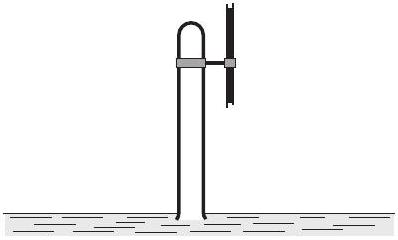
5. ábra

Körülbelül hány °C-ra melegítettük fel a rendszert?
Megoldás. Válasszuk ki a kémcsőben lévő gázok (levegő, vízgőz) három jellegzetes állapotát a fenti folyamat során, és vizsgáljuk meg az állapotjelzők között érvényes összefüggéseket!

1. A kezdóállapotban $\left( 0 ^ { \circ } \mathrm { C } \right)$ a vízgőz jelenlététól eltekinthetünk (nyomása $0,6 \mathrm { kPa }$, ami elhanyagolható a levegő 101 kPa-os nyomása mellett). A bezárt levegő térfogatát $V$-vel, nyomását $p _ { 0 }$-lal, hőmérsékletét $T _ { 0 }$-lal, a molekulák számát $N _ { 0 }$-lal jelölve felírhatjuk az ideális gáz termikus állapotegyenletét:

$$
p _ { 0 } V = N _ { 0 } k T _ { 0 } .
$$

2. A melegítés végén a $V$ térfogatban már $T$ hőmérsékletú gáz lesz, amely $N = N _ { \text {lev } } + N _ { \text {gôz } }$ számú molekulából áll, nyomása most is megegyezik a külső $p _ { 0 }$ nyomással, de ez a levegő $p _ { \text {lev } }$ és a vízgőz $p _ { \text {góz } }$ parciális nyomásából tevődik össze:

$$
p = p _ { \text {lev } } + p _ { \text {göz } } ,
$$

ahol külön a levegőre most is érvényes:

$$
p _ { \text {lev } } V = N _ { \text {lev } } k T .
$$

A vízgőzre most csak annyit mondhatunk, hogy nyomása egyedül a hőmérséklettől függ:

$$
p _ { \text {göz } } = f ( T ) .
$$

Ezt a függvényt (az ún. gőztenzió függvényt) táblázattal szokás megadni; a középiskolában használatos táblázatban 5 fokonként szerepelnek a (telített) vízgőzre érvényes nyomásértékek.
3. A végállapotban visszaáll a kezdeti $T _ { 0 }$ hőmérséklet. A kémcső félig megtelt vízzel, tehát $\frac { V } { 2 }$ térfogatban van csak gáz, ami a kezdőállapothoz hasonlóan újra csak levegő, a vízgőz elhanyagolható parciális nyomása miatt. A $T$ hőmérsékleten még meglévő vízgőz lecsapódott. A levegő nyomása picit kisebb, mint a külső légnyomás, de normál kémcső esetén a kémcső felét kitöltő víz hidrosztatikai nyomása elhanyagolható a külső légnyomás mellett. Írhatjuk tehát:

$$
p _ { 0 } \frac { V } { 2 } = N _ { \text {lev } } k T _ { 0 } .
$$

A kezdőállapotra felírt állapotegyenlettel összehasonlítva megállapíthatjuk:

$$
N _ { \mathrm { lev } } = \frac { N _ { 0 } } { 2 } ,
$$

vagyis a levegő fele a melegítés során „kibugyborékolt” a kémcsőből.
A melegítés végén így

$$
p _ { \mathrm { lev } } V = \frac { N _ { 0 } } { 2 } k T ,
$$

míg a kezdetén

$$
p _ { 0 } V = N _ { 0 } k T _ { 0 }
$$

volt az érvényes állapotegyenlet. Ezekből

$$
\frac { p _ { \text {lev } } } { p _ { 0 } } = \frac { 1 } { 2 } \frac { T } { T _ { 0 } }
$$

következik.

A vízgőz nyomására tehát kétféle összefüggést tudtunk felírni. Egyrészt a már említett $p _ { \text {gő } } = f ( T )$ gőztenzió függvényt, másrészt a mostani folyamatra érvényes

$$
p _ { \text {gőz } } = p _ { 0 } - p _ { \mathrm { lev } } = p _ { 0 } - p _ { 0 } \frac { T } { 2 T _ { 0 } }
$$

összefüggést. A melegítés során elért véghőmérséklet így az alábbi egyenletbő́l határozható meg:

$$
p _ { 0 } \cdot \left( 1 - \frac { T } { 2 T _ { 0 } } \right) = f ( T ) .
$$

Mivel az $f ( T )$ függvény táblázattal adott, a megfelelő $T$ érték interpolációval határozható meg (6. ábra). A kérdéses hőmérséklet (foknyi pontossággal) 347 K, azaz $74 ^ { \circ } \mathrm { C }$.

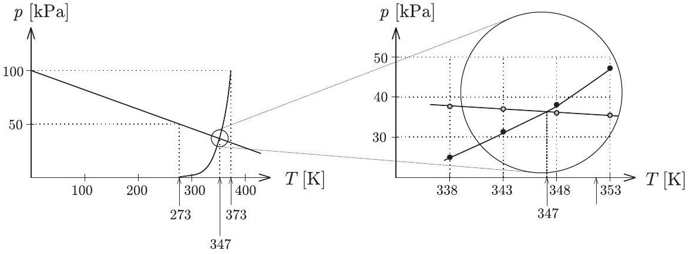
6. ábra

Megjegyzések. 1. A megoldás során alkalmazott jogos elhanyagolások miatt az interpolációt nem érdemes - nem is szabad - több tizedesjegy „pontossággal” végezni.
2. A magyar iskolákból jött versenyzőknek kézenfekvő volt, hogy a „Négyjegyü“-ben vagy a „Budó” könyvben található táblázatokat használják. Az $f ( T )$ tenziógörbe bizonyos közelítésben elméleti úton, az ún. Clausius-Clapeyronegyenlet felhasználásával is meghatározható, de mivel a hazai középiskolákban ez nem része a fizika tananyagnak, nem számítottunk ilyen közelítő megoldásra. Mégis adódott egy: Szlovákiából. Természetesen a Bizottság ezt a megoldást is elfogadta.
3. Ebben a feladatban elektronok mozgását vizsgáljuk homogén mágneses térben, az erốvonalakra merốleges síkban. (Az elektront klasszikus tömegpontnak tekintjük, melyre csak elektromos és mágneses erốk hatnak.)
a) Két, kezdetben nyugvó elektron egymástól elég messze, d távolságra helyezkedik el. Mekkora azonos nagyságú, egymással ellentétes irányú sebességgel indítsuk el az elektronokat úgy, hogy távolságuk a mozgás során ne változzék?
b) Állandó maradhat-e a d távolság akkor is, ha csak az egyik elektront lökjük meg? Milyen pályán mozog ekkor a rendszer tömegközéppontja? Mekkora az a minimális $d _ { \min }$ távolság, ami mellett ilyen mozgás még létrejöhet? Ábrázoljuk vázlatosan az elektronok pályáját ebben az esetben! Mikor áll meg először a meglökött elektron?

Megoldás. a) A mágneses térben mozgó elektronokra akkora Lorentz-erőnek kell hatnia, hogy legyőzze a köztük fellépő elektrosztatikus taszítóerőt, só́t biztosítsa még az egyenletes körmozgáshoz szükséges centripetális erốt is. A két elektron ugyanazon a körpályán, egymással szemben, ugyanakkora sebességgel fog mozogni, ezáltal nem változik a közöttük lévő $d ( = 2 R )$ távolság (7. ábra).

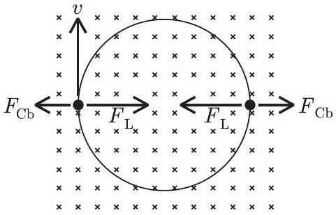
7. ábra

Írjuk fel egy elektron mozgásegyenletét! A $- e$ töltésú, $m$ tömegú és $v$ sebességgel mozgó részecskére

$$
F _ { \mathrm { L } } = e v B
$$

nagyságú Lorentz-eró és

$$
F _ { \mathrm { Cb } } = k \frac { e ^ { 2 } } { d ^ { 2 } }
$$

Coulomb-erő hat. Az előbbi (megfelelő irányú mozgás esetén) mindig a másik elektron felé mutató erố, az utóbbi azonban mindig taszító erő.

Megjegyzés. Elvben figyelembe kellene még vennünk a mozgó elektronok által keltett (pl. a Biot-Savart-törvényből számolható) mágneses teret, és az ebból származó

$$
F _ { \text {mágn. } } = e v \cdot \frac { \mu _ { 0 } } { 4 \pi } \cdot \frac { e v } { d ^ { 2 } } = \frac { v ^ { 2 } } { c ^ { 2 } } \cdot F _ { \mathrm { Cb } }
$$

mágneses erőhatást is ( $c$ a fénysebesség). Ez az eró azonban egy klasszikusan (nemrelativisztikusan) mozgó részecskére $v \ll c$ miatt elhanyagolható a Coulomb-erő mellett, tehát nem kell számolnunk vele.

A mozgásegyenlet $\sum F = m a$, vagyis az irányokat is figyelembe véve:

$$
e v B - k \frac { e ^ { 2 } } { d ^ { 2 } } = m \frac { v ^ { 2 } } { \left( \frac { d } { 2 } \right) } .
$$

Ez a kiszámítandó $v$ sebességre nézve másodfokú egyenlet, melynek megoldásai:

$$
v = \frac { e d B } { 4 m } \pm \sqrt { \left( \frac { e d B } { 4 m } \right) ^ { 2 } - \frac { k e ^ { 2 } } { 2 m d } } .
$$

Akkor oldható meg a feladat, ha $v$-re valós érték adódik, vagyis a diszkrimináns nemnegatív. Ebből $d$-re kapunk egy feltételt:

$$
d \geq 2 \cdot \sqrt [ 3 ] { \frac { k m } { B ^ { 2 } } } .
$$

(Ezért szerepelt a feladat szövegében az a kitétel, hogy a két elektron „elég messze” van egymástól, nem pedig azért, hogy elhanyagoljuk a köztük fellépő Coulomb-erőt - ahogyan ezt a versenyen néhányan tették.)
b) Ha csak az egyik elektront lökjük meg, a mozgás bonyolultabb lesz, még abban a speciális esetben is, amikor a távolságuk - a feladat kérdésének megfelelően - mindvégig ugyanakkora, $d$ nagyságú marad. (Egyáltalán nem nyilvánvaló, hogy ilyen mozgás kialakulhat; néhány versenyző éppen a feladat megoldhatatlanságát próbálta bebizonyítani.)

Közel jutunk a megoldáshoz, ha először a feltett - segítő - kérdésre („Milyen pályán mozog ekkor a rendszer tömegközéppontja?") keressük a választ. Írjuk fel - vektorosan, a szokásos jelöléseket használva - az elektronok mozgásegyenleteit!

$$
\begin{align*}
& m \boldsymbol { a } _ { 1 } = k \frac { e ^ { 2 } } { \left| \boldsymbol { r } _ { 1 } - \boldsymbol { r } _ { 2 } \right| ^ { 3 } } \left( \boldsymbol { r } _ { 1 } - \boldsymbol { r } _ { 2 } \right) - e \left( \boldsymbol { v } _ { 1 } \times \boldsymbol { B } \right) ,  \tag{1}\\
& m \boldsymbol { a } _ { 2 } = k \frac { e ^ { 2 } } { \left| \boldsymbol { r } _ { 1 } - \boldsymbol { r } _ { 2 } \right| ^ { 3 } } \left( \boldsymbol { r } _ { 2 } - \boldsymbol { r } _ { 1 } \right) - e \left( \boldsymbol { v } _ { 2 } \times \boldsymbol { B } \right) . \tag{2}
\end{align*}
$$

Tudjuk, hogy két egyforma tömegú részecske tömegközéppontjára

$$
\boldsymbol { r } _ { \mathrm { tkp } } = \frac { \boldsymbol { r } _ { 1 } + \boldsymbol { r } _ { 2 } } { 2 } , \quad \boldsymbol { v } _ { \mathrm { tkp } } = \frac { \boldsymbol { v } _ { 1 } + \boldsymbol { v } _ { 2 } } { 2 } , \quad \boldsymbol { a } _ { \mathrm { tkp } } = \frac { \boldsymbol { a } _ { 1 } + \boldsymbol { a } _ { 2 } } { 2 } .
$$

Annak érdekében, hogy ezek a mennyiségek megjelenjenek a képleteinkben, adjuk össze a két elektron mozgásegyenletét!

$$
m \left( \boldsymbol { a } _ { 1 } + \boldsymbol { a } _ { 2 } \right) = 0 - e \left[ \left( \boldsymbol { v } _ { 1 } + \boldsymbol { v } _ { 2 } \right) \times \boldsymbol { B } \right] ,
$$

amiből

$$
m \boldsymbol { a } _ { \mathrm { tkp } } = - e \left( \boldsymbol { v } _ { \mathrm { tkp } } \times \boldsymbol { B } \right)
$$

következik. (Látható, hogy a Coulomb-kölcsönhatás kiesett a tömegközéppont mozgásegyenletéből.)
Nagyon fontos felismeréshez jutottunk: a két elektronból álló rendszer tömegközéppontja úgy mozog, mint egyetlen elektron a $\boldsymbol { B }$ indukciójú mágneses térben! Az pedig körpályán mozog, egyenletesen.

A tömegközéppont tehát egyenletes körmozgást végez, miközben körülötte „kalimpál” a két elektron. A tömegközéppont mozgásának szögsebessége

$$
\omega _ { \mathrm { tkp } } = \frac { a _ { \mathrm { tkp } } } { v _ { \mathrm { tkp } } } = \frac { e } { m } B = \omega _ { \mathrm { c } } .
$$

(Ezt az értéket a fizikusok ciklotronfrekvenciának nevezik, mert adott erősségú mágneses térben - pl. egy részecskegyorsító ciklotronban - éppen ekkora körfrekvenciával keringenek a részecskék.)

A tömegközéppont körpályájának sugara

$$
R _ { \mathrm { tkp } } = \frac { v _ { \mathrm { tkp } } } { \omega _ { \mathrm { tkp } } } = \frac { v _ { \mathrm { tkp } } } { \omega _ { \mathrm { c } } } .
$$

Vajon hogyan mozognak az elektronok a tömegközéppont körül? Nyilván ennek a kérdésnek a megválaszolása vezet el a feladat hátralevő részének megoldásához. Írjuk fel az 1-es elektron helyvektorát $\boldsymbol { r } _ { 1 } = \boldsymbol { r } _ { \mathrm { tkp } } + \boldsymbol { R }$ alakban, vagyis jelöljük a tömegközépponttól az 1-es elektronhoz mutató vektort $\boldsymbol { R }$-rel. (Ekkor a másik elektronhoz a tömegközépponttól $\mathrm { a } - \boldsymbol { R }$ vektor mutat.) A tömegközéppontot megadó képlet felhasználásával adódik, hogy

$$
\boldsymbol { R } = \boldsymbol { r } _ { 1 } - \boldsymbol { r } _ { \mathrm { tkp } } = \boldsymbol { r } _ { 1 } - \frac { \boldsymbol { r } _ { 1 } + \boldsymbol { r } _ { 2 } } { 2 } = \frac { \boldsymbol { r } _ { 1 } - \boldsymbol { r } _ { 2 } } { 2 } .
$$

Ezen vektor időbeli változására úgy kaphatunk egyenletet, hogy képezzük az (1) és (2) mozgásegyenletek különbségét:

$$
\begin{equation*}
m \left( \boldsymbol { a } _ { 1 } - \boldsymbol { a } _ { 2 } \right) = 2 k \frac { e ^ { 2 } } { \left| \boldsymbol { r } _ { 1 } - \boldsymbol { r } _ { 2 } \right| ^ { 3 } } \left( \boldsymbol { r } _ { 1 } - \boldsymbol { r } _ { 2 } \right) - e \left[ \left( \boldsymbol { v } _ { 1 } - \boldsymbol { v } _ { 2 } \right) \times \boldsymbol { B } \right] . \tag{3}
\end{equation*}
$$

A helyvektorok különbsége a fentebb megadott $\boldsymbol { R }$ vektor kétszerese, a sebességvektorok különbsége tehát az $\boldsymbol { R }$ vektor időbeli változását megadó $\boldsymbol { V }$ vektor kétszerese, és hasonló igaz a gyorsulásokra is:

$$
\boldsymbol { r } _ { 1 } - \boldsymbol { r } _ { 2 } = 2 \boldsymbol { R } , \quad \boldsymbol { v } _ { 1 } - \boldsymbol { v } _ { 2 } = 2 \boldsymbol { V } , \quad \boldsymbol { a } _ { 1 } - \boldsymbol { a } _ { 2 } = 2 \boldsymbol { A } .
$$

Ezekkel a jelölésekkel a (3) egyenlet ilyen alakot ölt:

$$
\begin{equation*}
m \boldsymbol { A } = k \frac { e ^ { 2 } } { | 2 \boldsymbol { R } | ^ { 3 } } 2 \boldsymbol { R } - e ( \boldsymbol { V } \times \boldsymbol { B } ) . \tag{4}
\end{equation*}
$$

Ez az egyenlet lényegében ugyanolyan, mint ami a feladat elsó részére (az álló tömegközéppont esetére) kapott mozgásegyenlet, tehát - alkalmas kezdősebesség esetén - ennek is lehet egyenletes körmozgásos megoldása. Valóban, ha az $\boldsymbol { R } ( t )$ vektor nagysága időben állandó $R$ érték, és az iránya $\omega$ szögsebességgel forog körbe, akkor az egyenletes forgómozgás ismert képletei szerint $\boldsymbol { A } = - \omega ^ { 2 } \boldsymbol { R }$ és $\boldsymbol { V } \times \boldsymbol { B } = \boldsymbol { R } \omega B$, s így (4) szerint a tömegközéppont körül keringő elektronpár $\omega$ szögsebességére a következő másodfokú egyenlet adódik:

$$
\begin{equation*}
\omega ^ { 2 } - \frac { e } { m } B \omega + \frac { k } { m } \frac { e ^ { 2 } } { 4 R ^ { 3 } } = 0 . \tag{5}
\end{equation*}
$$

Ennek $\omega$-ra csak akkor van valós megoldása, ha a diszkrimináns nemnegatív, amiből

$$
R \geq \sqrt [ 3 ] { \frac { k m } { B ^ { 2 } } }
$$

következik. A minimális távolság, ami mellett ilyen mozgás létrejöhet:

$$
d _ { \min } = 2 R _ { \min } = 2 \cdot \sqrt [ 3 ] { \frac { k m } { B ^ { 2 } } } .
$$

(Ez a feltétel akkor is érvényes kell legyen, amikor a tömegközéppont áll, tehát nem meglepő, hogy a minimális távolság képlete megegyezik a feladat elsó részében kapott korláttal.)

Határozzuk meg a részecskék pályáját abban a speciális esetben, amikor $d = d _ { \text {min } }$, vagyis

$$
R = R _ { \min } = \sqrt [ 3 ] { \frac { k m } { B ^ { 2 } } } .
$$

Ezt az értéket (5)-be helyettesítve az elektronok tömegközéppont körüli keringésének szögsebességére

$$
\omega = \frac { 1 } { 2 } \cdot \frac { e } { m } B = \frac { 1 } { 2 } \cdot \omega _ { \mathrm { c } } ,
$$

vagyis a tömegközéppont szögsebességének fele adódik.
Indítsuk el a rendszert úgy, ahogy a $b$ ) kérdésben szerepelt, vagyis csak az egyik elektront lökjük meg valamekkora $v _ { 0 }$ sebességgel, a két részecskét összekötő egyenesre merőlegesen. (Ha a kezdősebesség iránya más lenne, akkor nyilván már a mozgás kezdetén megváltozna a két részecske távolsága.) A másik elektron áll, tehát a tömegközéppont $\frac { v _ { 0 } } { 2 }$ sebességgel indul el, és ugyanekkora nagyságú (de egymással ellentétes irányú) mindkét elektronnak a tömegközépponthoz viszonyított kezdősebessége.

A tömegközéppont körüli keringésre igaz, hogy

$$
\frac { v _ { 0 } } { 2 } = R \omega = R \frac { \omega _ { \mathrm { c } } } { 2 } .
$$

Ugyanekkor a tömegközéppont keringésére fennáll

$$
\frac { v _ { 0 } } { 2 } = R _ { \mathrm { tkp } } \omega _ { \mathrm { c } } , \quad \text { vagyis } \quad R _ { \mathrm { tkp } } = \frac { R } { 2 } .
$$

Ezek szerint a tömegközéppont feleakkora sugarú körpályán kering, mint körülötte az elektronok. Másrészt a tömegközéppont keringési ideje is fele akkora, mint a hozzá képest mozgó elektronoké.

Ábrázoljuk vázlatosan a részecskék pályáját! A 8. ábrán a szemléletesség kedvéert (szaggatott vonallal) berajzoltuk a tömegközéppont pályáját is. Miközben a meglökött elektron $\alpha$ szöggel elfordul a tömegközéppont körül, a tömegközéppont $2 \alpha$ szöggel fordul el saját, feleakkora sugarú körpályáján.

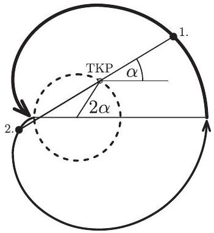
8. ábra

$T = \frac { 2 \pi } { \omega _ { \mathrm { c } } }$ idő alatt a tömegközéppont egy teljes kört tesz meg; a két elektron azonban csak egy-egy félkört fut be körülötte - éppen helyet cserélnek! Ekkor, tehát

$$
T = \frac { 2 \pi } { \frac { e } { m } B }
$$

idő múlva áll meg először a meglökött elektron.
Megjegyzések. 1. A két elektron megrajzolt pályagörbéje (melyet az alakja miatt szívgörbének, kardioidnak is neveznek) csak akkor ilyen egyszerú és áttekinthető, ha a távolságuk a már említett legkisebb távolság az adott erốsségú mágneses térben. Ha nagyobb távolság állandóságát követeljük meg, akkor már nehezebben áttekinthető (általában nem is zárt) pályák és mozgások jöhetnek létre (9. ábra). Még bonyolultabb lesz a helyzet akkor, ha a kezdősebesség nem teljesíti a távolság állandóságának megfeleló feltételt. Belátható, hogy még ebben az esetben sem tudnak a részecskék egymástól nagyon eltávolodni, vagy egymáshoz közel kerülni, a távolságuk mindig két szélsóérték között marad, azok között periodikusan ingadozik, amint azt Cserti József a megoldáshoz készített számítógépes programmal be is mutatta az ünnepélyes eredményhirdetésen (10. ábra).

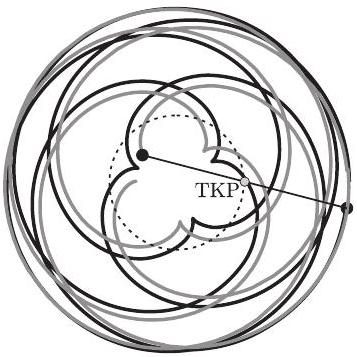
9. ábra

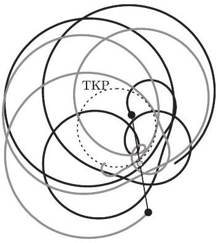
10. ábra

2. A versenyben szereplő feladatot inspiráló kutatási terület új fejezetet nyitott a modern szilárdtestfizikában. Ha például a félvezetőknél fellépő Hall-effektust nagyon alacsony hốmérsékleten vizsgáljuk, a klasszikus elektronmodell helyett a kvantumfizika törvényeivel tudjuk csak leírni az elektronok fura viselkedését. A mérések szerint az ellenállás erős mágneses térben nem folytonosan, hanem ugrásszerúen (kvantumosan) változik. Ez az „ellenállás-kvantum"

kifejezhető univerzális mikrofizikai állandókkal (elemi töltés, Planck-állandó). Az 1985-ben Klaus von Klitzing német fizikusnak ítélt Nobel-díj is a kvantumos Hall-effektus kutatásában elért eredmények fontosságát jelezte. Három - az USA-ban dolgozó - fizikus, Robert Laughlin, Daniel Tsui és Horst Störmer pedig azért kapott Nobel-díjat 1998-ban, mert felismerték, hogy erős mágneses térben az egymással is kölcsönható elektronok olyan „részecskét” képesek alkotni, amelynek töltése az „elemi töltés” tört része!

## A verseny eredménye

I. díjat, s vele a Társulat Eötvös-verseny érmét, ezen kívül 15 ezer forintos pénzjutalmat és 5 ezer forint értékú könyvutalványt kapott Sáfár Simon, a BMGE villamosmérnök hallgatója, aki a budaörsi Illyés Gyula Gimnáziumban érettségizett mint Péter László tanítványa, valamint Varjas Dániel, a dunaújvárosi Széchenyi István Gimnázium 12. évfolyamú tanulója, Kispál István tanítványa.
II. díjat, s vele 10 ezer forintos pénzjutalmat és 5 ezer forint értékú könyvutalványt kapott Rakyta Péter, az ELTE fizikus hallgatója, aki a szlovákiai Rév-Komárom magyar tannyelvú Selye János Gimnáziumában érettségizett mint Szabó Endre tanítványa.
III. díjat, s vele 5 ezer forintos pénzjutalmat és 5 ezer forint értékú könyvutalványt kapott Németh András, az ELTE fizikus hallgatója, aki a Fazekas Mihály Fóvárosi Gyakorló Gimnáziumban érettségizett mint Horváth Gábor tanítványa; Pálinkás András, a budapesti Piarista Gimnázium 12. évfolyamú tanulója, Futó Béla tanítványa és Szabó Attila, a BMGE villamosmérnök hallgatója, aki a veszprémi Lovassy László Gimnáziumban érettségizett mint Varga Vince tanítványa.

Kiemelt dicséretet kapott Mezei Márk, az ELTE fizikus hallgatója, aki az ELTE Radnóti Miklós Gyakorló Gimnáziumban érettségizett mint Rácz Mihály tanítványa.

Dicséretet kapott Halász Gábor, az ELTE Radnóti Miklós Gyakorló Gimnáziumának 11. évfolyamú tanulója, Honyek Gyula tanítványa; Kiss Péter, az ELTE Apáczai Csere János Gyakorló Gimnáziumának 12. évfolyamú tanulója, Zsigri Ferenc tanítványa; Kómár Péter, a Fazekas Mihály Fóvárosi Gyakorló Gimnázium 12. évfolyamú tanulója, Dvorák Cecília tanítványa; Rácz Béla András, az ELTE matematikus hallgatója, aki a Fazekas Mihály Fốvárosi Gyakorló Gimnáziumban érettségizett mint Horváth Gábor tanítványa és Vigh Máté, az ELTE fizikus hallgatója, aki a pécsi Babits Mihály Gyakorló Gimnáziumban érettségizett mint Koncz Károly és Kotek László tanítványa.

Mind a hat dicséretes versenyző megkapta Hraskó Péter Relativitáselmélet c. könyvét, a Typotex Kiadó kiadványát.
Az ünnepélyes eredményhirdetés 2004. november 19-én volt az ELTE lágymányosi épületének konferenciatermében. Meghívót kaptak erre az 50 és a 25 évvel ezelőtti Eötvös-versenyen díjazott versenyzők is.

1954-ben még nem volt a Középiskolai Matematikai Lapoknak fizika rovata, viszont a matematika feladatok megoldásában mindhárom későbbi nyertes jeleskedett. Közülük választottunk ki egyet-egyet, valamint egykori fényképeiket, amik megjelentek a Lapokban, így mutattuk be az 50 évvel ezelőtti nyerteseket. Néhány mondattal ók maguk is üdvözölték a mai nyerteseket, és saját életpályájukról is ejtettek pár szót. Vigassy József gépészmérnökként végzett és az atomenergetika elkötelezett tudósa lett; Siklósi Péter vegyészmérnökként végzett, és az alumíniumiparban vívott ki nemzetközi elismerést; Zawadowski Alfréd fizikusként végzett, a szilárdtestfizika ugyancsak nemzetközileg elismert tudósa lett, akadémikus.

A 25 évvel ezelőtt, 1979-ben díjazott versenyzők nevében Csordás András szólalt meg, felidézve néhány régi emlékét, köztük a Mikola-verseny megindításához kapcsolódókat is.

A Versenybizottság elnöke összehasonlításképpen kivetítette az 50 évvel ezelőtti Eötvös-verseny feladatait, mielőtt hozzáfogott a mostani feladatok megoldásának ismertetéséhez. Az elsó feladat megoldásához kapcsolódóan kísérleteket is bemutatott: hol hulahopp karikából kivágott negyedkörökkel, hol az írásvetító síkjában elhajló rugalmas fémszálakkal. A feladat megoldását Gnädig Péter egészítette ki energetikai megfontoláson alapuló számításokkal. A második feladat megoldását ugyanő egy kísérlettel színesítette: hogyan megy fel a víz egy felmelegített, majd ismét lehütött kémcsőben. A harmadik feladat megoldását Cserti József egészítette ki számítógépes prezentációval, melynek során még a probléma modern alkalmazásáról is szót ejtett.

A díjakat az Eötvös Loránd Fizikai Társulat elnöke, Németh Judit akadémikus adta át, meleg szavakkal köszöntve a nyerteseket és azokat a tanárokat, akik felkészítették óket a versenyre.

A díjakkal járó pénzjutalmakat és könyvutalványokat egy magánvállalkozó által erre a célra felajánlott összegből fedezte a Társulat. A Természet Világa folyóirat és a Typotex Könyvkiadó által felajánlott kiadványokból a nyertes versenyzők megjelent tanárai válogathattak.

Végül közös csoportkép készült az idei és az 50 évvel ezelőtti Eötvös-verseny nyertes versenyzőiről, ez is látható e számunk hátsó borítóján.
