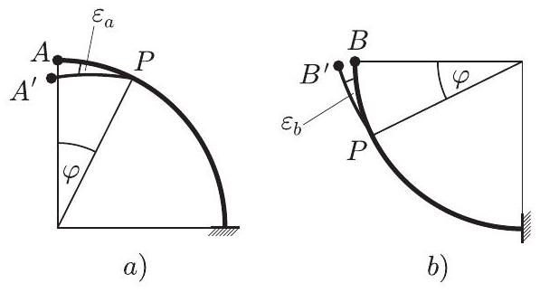

2. ábra

Ebből már látszik, hogy a fémszál deformációja (görbültségének megváltozása) minden bizonnyal az $a$ ) esetben lesz nagyobb. Azt kell még megnéznünk, hogyan jelentkezik mindez a szál végpontjának lesüllyedésében. Sejtésünk az, hogy a nagyobb deformáció nagyobb lesüllyedést is eredményez.

Vizsgáljuk meg, hogy ha csupán a $\varphi$ szöggel megjelölt pontban jönne létre deformáció (ha csak az ottani kis spirálrugó csavarodna el), ez a végpontnak mekkora függőleges elmozdulását (lesüllyedését) eredményezné!

Az $a$ ) esetben a 3. ábrán látható $\widehat { P A }$ ív elhajlása $\left( \varepsilon _ { a } \right)$ az $M _ { a }$ forgatónyomatékkal, a $b$ ) esetben a $\widehat { P B }$ ív $\left( \varepsilon _ { b } \right)$ elhajlása az $M _ { b }$ forgatónyomatékkal arányos. Mondhatjuk, hogy az $A A ^ { \prime }$ szakasz hossza annyiszorosa a $B B ^ { \prime }$ szakasz hosszának, ahányszorosa az $M _ { a }$ nyomaték nagysága az $M _ { b }$ nagyságának.

