2005. október 14-én délután az ország 16 városában rendezte meg az Eötvös Loránd Fizikai Társulat azévi Eötvösversenyét. Budapesten 50, Pécsett 12, Debrecenben és Szegeden 7-7, Miskolcon 6, Kecskeméten 5, Veszprémben és Székesfehérváron 4-4, Gyórött 1 hazai és 3 külföldi, Egerben, Szekszárdon és Szombathelyen 3-3, Békéscsabán, Nagykanizsán és Sopronban 1-1 versenyzó adott be dolgozatot. Nyíregyházán sajnos egyetlen fóiskolai vagy középiskolai diák se jelent meg a verseny színhelyén. Összesen 108 hazai és 4 külföldi versenyző dolgozatát kellett értékelnie a versenybizottságnak (elnök: Radnai Gyula, tagok: Gnädig Péter, Honyek Gyula és Károlyházy Frigyes).

Ismertetjük a feladatokat és a feladatok helyes megoldását.

1. Két rögzített, egymástól $l = 2 \mathrm {~m}$ távolságra levố csigán erốs, de nem nyúlékony fonalat vezetünk át, és a végeire egy-egy $M = 1 \mathrm {~kg}$ tömegữ testet erósítünk az 1.(a) ábra szerint. (A fonal néhányszor 10 N terhelést bér ki szakadás nélkül. A csigák és a fonal tömege elhanyagolható.) Ha ujjunkkal lehúzzuk a fonal közepét úgy, hogy a két test 1-1 méterrel megemelkedjék (1.(b) ábra), majd elengedjük, a fonal elpattan, amikor $A$ és $B$ között „kiegyenesedik”. Ha azonban úgy engedjük el, hogy előbb egy ugyancsak 1 kg tömegü testet erósítünk a fonal közepéhez, akkor a fonal a továbbiakban nem szakad el.

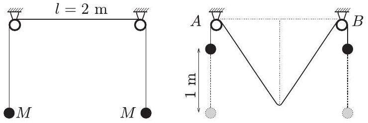
(a)

(b)

1. ábra
a) Magyarázzuk meg a jelenséget!
b) Mekkora erő feszíti a fonalat abban a pillanatban, amikor kiegyenesedik?

Megoldás. a) Azt kell észrevenni, hogy amikor a fonal kiegyenesedik, abban a pillanatban a fonalat két oldalról húzó testek már állnak. Rendkívül rövid idő alatt kell megállniuk, lefékeződniük arról a $v = \sqrt { 2 g h } \approx 16 \mathrm {~km} / \mathrm { h }$ sebességről, amire addigi mozgásuk (szabadesés) során felgyorsultak. (Itt és a továbbiakban $h = \frac { 1 } { 2 } l = 1 \mathrm {~m}$.) Ha a fékezést „pillanatszerúnek" gondolnánk, vagyis a fékezés ideje $\Delta t \rightarrow 0$ lenne, akkor a testek gyorsulása és a fonalat feszítő $F$ eró is minden határon túl nőne, ezért elpattanna a fonal.

A valóságban természetesen még a „nem nyúlékony” fonal sem abszolút nyújthatatlan, hanem egy kicsit deformálható. Ehhez az alakváltozáshoz egy kicsiny, de véges $\Delta t$ idő szükséges, így a testek gyorsulása és ezzel együtt a fonalat feszítő erő ha nem is végtelenné, de nagyon naggyá válik. Mivel a fonal nem bír ki nagy erốt, elszakad.
b) Ábrázoljuk a folyamat három jellemző állapotát! A 2.(a) ábrán a kezdőállapotot tüntettük fel, megjelölve közben a középső test egyensúlyi helyzetét is, amelyen maximális sebességgel átlendül. A 2.(b) ábrán a fonal középső része vízszintes, a középső test azonban még emelkedik fölfelé. A 2.(c) ábra azt a pillanatot mutatja, amikor a középső test éppen megáll. Ekkor ismét állnak a szélső testek is. (Persze elképzelhető, hogy a középső test fel se emelkedik a 2.(b) ábrán látható helyzetig, ezt a lehetőśéget majd számítással kell ellenőriznünk.)
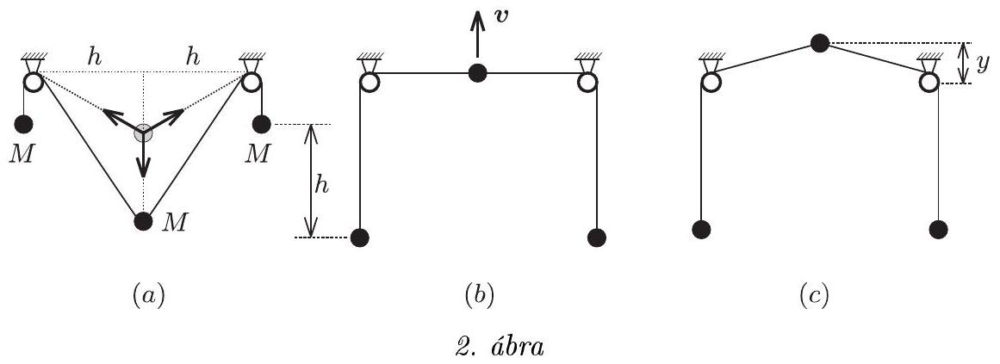

A b) kérdés megfogalmazása arra utal, hogy a fonal ki fog egyenesedni, tehát a középső test eljut a $2 . ( b )$ ábrán jelzett állapotba. Lesz-e ott sebessége? Ezt érdemes kiszámítanunk. Írjuk fel a munkatételt a 2.( $a$ ) helyzettől a 2.( $b$ )-ig jelzett folyamatra! A szélső testek $h$ utat süllyednek, a középső $h \sqrt { 3 }$ utat emelkedik, ezért

$$
M g h - M g h \sqrt { 3 } + M g h = \frac { 1 } { 2 } M v ^ { 2 } .
$$

Felhasználtuk, hogy a 2.( $b$ ) helyzetben a szélső testek egy pillanatra megállnak, ezért csak a középső testnek lehet ekkor mozgási energiája. A felírt egyenletből a középső test sebessége: $v = \sqrt { 2 g ( 2 - \sqrt { 3 } ) h } > 0$. Tehát valóban emelkedik még a középső test. Meddig emelkedik? Ezt is kiszámíthatjuk, ha a $2 . ( b )$ és a $2 . ( c )$ állapotot hasonlítjuk össze energetikailag:

$$
2 M g \left( \sqrt { h ^ { 2 } + y ^ { 2 } } - h \right) + M g y = \frac { 1 } { 2 } M v ^ { 2 } .
$$

Ez $y$-ra nézve másodfokú egyenletté alakítható, melynek megoldásai: $y _ { 1 } = - 1,73 h$ és $y _ { 2 } = + 0,22 h$. (Az első gyök nyilván a kezdőállapotot adja meg, a 2.(c) állapotnak $y _ { 2 }$ felel meg.)

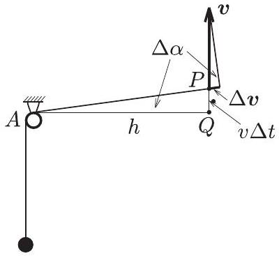
3. ábra

Hogy válaszolni tudjunk a feladat $b$ ) kérdésére, vizsgáljuk meg tüzetesen a $2 . ( b )$ ábrán látható helyzetet! Ebben a pillanatban a fonalat feszítő eró gyorsítja az éppen álló, de felfelé induló szélsớ testeket. Mekkora ez a gyorsulás? Tegyük fel, hogy a bal oldali csigától a középső testhez vezető $A P$ fonál $\Delta t$ idő alatt már egy kicsiny $\Delta \alpha$ szöggel túllendült a vízszintes helyzeten (3. ábra). Jelöljük a szélső testek sebességét $\Delta v$-vel! Ez a sebesség (a fonal nyújthatatlansága miatt) megegyezik a $P$ pontban levő középső test sebességének $A P$ irányú vetületével, vagyis

$$
\frac { \Delta v } { v } = \sin \Delta \alpha \approx \Delta \alpha .
$$

Másrészt a $P Q A$ derékszögü háromszögből

$$
\frac { v \Delta t } { h } = \operatorname { tg } \Delta \alpha \approx \Delta \alpha .
$$

A fenti két egyenlet összevetéséből

$$
\Delta v = \frac { v ^ { 2 } } { h } \Delta t ,
$$

vagyis a szélső testek gyorsulására

$$
a = \frac { \Delta v } { \Delta t } = \frac { v ^ { 2 } } { h }
$$

adódik.
Ugyanehhez a képlethez úgy is eljuthatunk, ha felírjuk, hogy a vízszinteshez közeli $A P$ szakasz hossza időben hogyan változik. Mivel $P Q \approx v t$ (ahol $t$ a 2.( $b$ ) ábrán látható állapottól mért idő), Pitagorasz tétele szerint

$$
A P = \sqrt { h ^ { 2 } + v ^ { 2 } t ^ { 2 } } = h \sqrt { 1 + \frac { v ^ { 2 } t ^ { 2 } } { h ^ { 2 } } } \approx h + \frac { v ^ { 2 } t ^ { 2 } } { 2 h } = h + \frac { a } { 2 } t ^ { 2 } .
$$

Ebből leolvashatjuk, hogy az $A P$ szakasz hossza $a = v ^ { 2 } / h$ gyorsulással növekszik, s a fonal nyújthatatlansága miatt a bal oldali test is ugyanekkora nagyságú, függőlegesen felfelé irányuló gyorsulással kell rendelkezzék.

A fonal által kifejtett erő a szélső testek mozgásegyenletéből kapható meg:

$$
F _ { \text {fonal } } - M g = M \frac { v ^ { 2 } } { h }
$$

azaz

$$
F _ { \text {fonal } } = M g [ 1 + 2 ( 2 - \sqrt { 3 } ) ] = 1,536 M g \approx 15 \mathrm {~N} .
$$

Így már érthető, miért nem szakad el ebben a helyzetben a „néhányszor 10 N terhelést kibíró” fonal.
Érdemes felfigyelni arra, hogy a szélső testek kétszer is emelkednek és kétszer is süllyednek egy-egy periódus során, hiszen a 2. ábrán feltüntetett mindhárom állapotban éppen állnak. Süllyedésük az idő függvényében nagyjából a 4. ábrán vázolt módon történik.

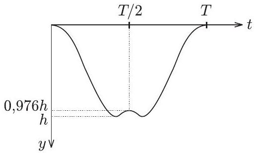
4. ábra

2. Egy átlátszatlan lapon kicsiny lyukak vannak az 5 . ábrán látható „háromszög-rács" elrendezésben. A lapot monokromatikus, $\lambda$ hullámhosszúságú lézerfénnyel világítjuk meg merôlegesen. A rácsállandó $d = 100 \lambda$.

5. ábra

Ábrázoljuk vázlatosan (a méretek, valamint a vízszintes és a függốleges irányok bejelölésével), hogy milyen elhajlási képet figyelhetünk meg a rácstól 3 m távolságra elhelyezett ernyốn!

Megoldás. Elevenítsük fel azokat az ismereteket, amelyek a síkbeli optikai rácson (párhuzamos, egymástól egyenló távolságra lévő rések rendszerén) áthaladó monokromatikus fény diffrakciójára vonatkoznak! Világítsuk meg az optikai rácsot a síkjára merőleges, keskeny lézersugárral. A ráccsal párhuzamosan elhelyezett ernyőn ekkor közelítőleg egyenlő távolságra elhelyezkedő fényes foltokat látunk. Jelöljük $D$-vel a rácsállandót, $\lambda$-val a hullámhosszat. Az intenzitás menetét az elhajlási (diffrakciós) szög szinuszának függvényében a 6. ábra mutatja.

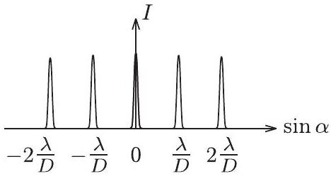
6. ábra

Az ábrán látható intenzitáseloszlást jól alátámasztja az a középiskolában tanult közelítés, amely szerint a rács rései olyan keskenyek, hogy egy-egy résen belül, az onnan kiinduló elemi hullámok azonos fázisban vannak (Huygens-Fresnel-elv). Ugyanakkor két egymás melletti résből induló elemi hullámok erősítésének feltétele:
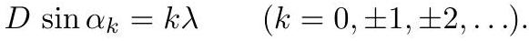

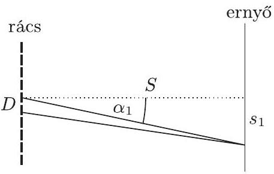
7. ábra

Ha az ernyő $S$ távolságra van az optikai rácstól (7. ábra), akkor az első fómaximum távolsága a centrumtól

$$
s _ { 1 } \approx S \cdot \sin \alpha _ { 1 } = S \frac { \lambda } { D } ,
$$

és általában, a $k$-adik főmaximum távolsága

$$
s _ { k } \approx k S \frac { \lambda } { D } .
$$

(Itt kihasználtuk, hogy $\lambda \ll d$ miatt $\alpha _ { k } \ll 1$, és így $\sin \alpha _ { k } \approx \alpha _ { k }$.)
Térjünk rá a feladatban szereplő háromszögrácsra! Mivel a háromszögrács síkjára merőlegesen érkezik a fény, ezért minden egyes lyukból azonos fázisú elemi hullámok indulnak ki. Ezek a rácsra meróleges irányban tovább haladva biztosan erósítik egymást, útkülönbség nélkül, $\alpha = 0$ irányban jelölik ki a keletkező diffrakciós kép centrumát az elég távol lévő ernyốn.

Hol lesz ehhez a centrumhoz legközelebb újra egy erósítési hely az ernyőn? Milyen irányban?
Válasszuk ki valamelyik kicsiny lyukat. Gondolatban húzzunk ezen a lyukon át egy olyan egyenest, amelyik átmegy valamelyik, hozzá legközelebb eső lyukon. Ez az egyenes még egy sorozat lyukon fog áthaladni, amelyek mind $d$ távolságra követik egymást. Most keressünk egy másik lyuksort, amelyen átmenő egyenes párhuzamos az előzóvel. Sok ilyen lyuksort találunk, ezek egymástól $D = d \frac { \sqrt { 3 } } { 2 }$ távolságra helyezkednek el (8. ábra). Figyeljük meg azt az irányt a térben, amely az elképzelt egyenesekre meróleges, de a már kijelölt centrum felé vezető iránnyal akkora $\alpha _ { 1 }$ szöget zár be, hogy teljesül a

$$
D \sin \alpha _ { 1 } = \lambda
$$

összefüggés.

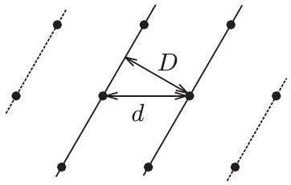
8. ábra

Ha az ilyen irányba haladó elemi hullámok eredőjét vizsgáljuk a messze lévő ernyőn, akkor azt látjuk, hogy a kiválasztott egyenesen elhelyezkedő lyukakból jövő elemi hullámok erősítik egymást, mert az ernyőhőz érve már szinte nincs is útkülönbség köztük. De a szomszédos egyenesen fekvő lyuksorból induló elemi hullámokkal is erősíteni fogják egymást, mert köztük az útkülönbség $\left( D \sin \alpha _ { 1 } \right)$ éppen $\lambda$-val egyenlő, és ugyanez igaz a többi egyenesen fekvő lyukakból induló hullámokra is. Tehát ebben az irányban az összes lyukon átjövő fény erősíteni fogja egymást!

Így az ernyő́n a centrumhoz legközelebbi (egyik) erősítési helynek a centrumtól való távolsága:

$$
s _ { 1 } = S \frac { \lambda } { D } = \frac { 2 } { \sqrt { 3 } } S \frac { \lambda } { d } = 2 \sqrt { 3 } \mathrm {~cm} \approx 3,4 \mathrm {~cm} .
$$

Hat ilyen pont lesz az ernyőn, amelyek egy - a centrum körüli - szabályos hatszög csúcsait jelölik ki. Ez azért van így, mert három, egymással 120-120°-os szöget bezáró egyenes-sereget (lyuksor-sereget) jelölhetünk ki a háromszögrácson.

Azt is észrevehetjük, hogy olyan helyen is lesz az ernyő́n erősítés, melynek távolsága a centrumtól $2 s _ { 1 } , 3 s _ { 1 } , \ldots$, hiszen ekkor az egymás melletti lyuksorokból érkező hullámok $2 \lambda , 3 \lambda , \ldots$ útkülönbséggel találkoznak az ernyőn. Ezek szerint a rácson felvett mindegyik egyenes-sereg az ernyőn egy pontsorozatot eredményez. Ha a rácson elképzelt lyuksorok pl. vízszintes egyenesek mentén helyezkednek el, akkor az ernyő́n keletkező pontsorozat egy függőleges egyenesre illeszkedik.

Hatágú „csillag" lesz tehát a kép? Nem egészen, bár ezek a most elképzelt pontok mind megjelennek az ernyőn, de nem csak ezek jelennek meg! Képzeljük el például a háromszögrácson azt az egyenes- (lyuksor)-sereget, amelyet a 9. ábra bal oldalán látunk.

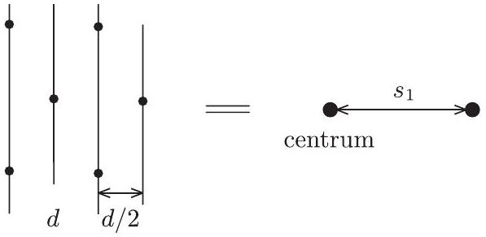
9. ábra

Ez egy $\frac { d } { 2 }$ rácsállandójú optikai rácsnak felel meg, ezért az ernyőn a megfelelő erősítési helyek

$$
s _ { 1 } ^ { \prime } = S \frac { \lambda } { \frac { d } { 2 } } = 6 \mathrm {~cm}
$$

távolságra követik egymást. Most is igaz, hogy minél sürúbb optikai rácsba rendeződve képzeljük el a lyukakat, annál messzebb kerülnek egymástól a megfelelő erősítési helyek az ernyőn.

Meg lehet mutatni, hogy a háromszögrács „képe” az ernyőn ugyancsak szabályos háromszögrács lesz, mert kölcsönösen egyértelmúen egymáshoz rendelhető a lyukakra illeszthető egyenessereg és az ernyőn megjelenő, interferencia eredményezte ponthalmaz. (Ennek belátásához legközelebb Varjas Dániel jutott el, aki díjnyertes dolgozatában a különböző módon felvehető elemi cellák területének egyenlőségét használta ki.) Mégis lesz valami eltérés a lyukak alkotta háromszögrács és a diffrakciós pontok alkotta háromszögrács között (a pontok távolságában mutatkozó eltérésen kívül is): az egyik pontrács 90°-os elforgatottja a másiknak. (Most akár 30°-os elforgatottat is mondhatnánk, de egy téglalaprács esetén nagyon jól látszik, hogy 90°-os elforgatásról van szó.)

Mindezt a 10. ábra szemlélteti, melynek alsó részén a lyukak rácsa, felül pedig az ernyốn látható elhajlási kép látható, természetesen eltérő méretarányban.

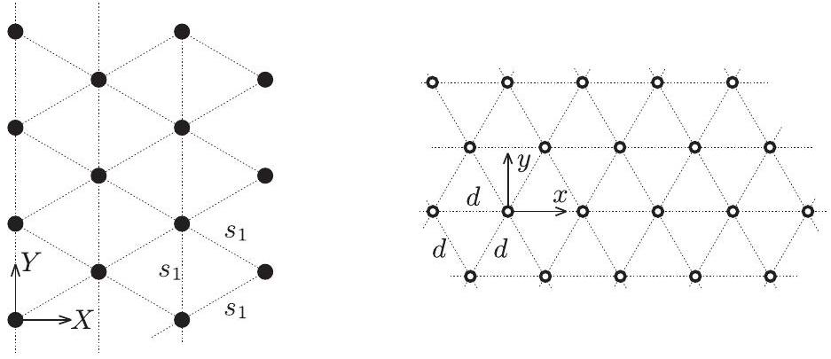
10. ábra

A feladatban szereplő háromszögrácsot úgy is előállíthatjuk, hogy három, egyenként $D$ állandójú, közönséges optikai rácsot egymásra fektetünk. A feltétel csak annyi, hogy mindegyik rács rései a másik rács réseivel 60°-os szöget zárjanak be. Az így keletkező lyukak ugyan nem kör, hanem hatszög alakúak lesznek, de ha a rések szélessége sokkal kisebb a rácsállandónál, akkor ennek nincs jelentősége. Sőt! Ha elhagyjuk a harmadik rácsot, és csupán két, egymással 60°-os szöget bezáró rács diffrakciós képét vizsgáljuk, ez is ugyanaz lesz, mint az előbbiek. Ebben az esetben ugyanis a lyukak ugyan rombusz alakúak, de ugyanabban a szabályos háromszögrácsban rendeződnek el, tehát jó közelítésben ugyanazt a diffrakciós képet eredményezik. Az eredményhirdetéskor Komlósi István egyetemi hallgató mutatta be ezt a kísérletet.
3. Egy jó minóségü transzformátor szekunder tekercsének menetszáma háromszorosa a primer tekercsének. Ezt a trafót a 11. ábra szerint hálózati váltóáramú feszültségforrásra kapcsoljuk a következő módon: A primer körbe egymással párhuzamosan iktatunk be öt egyforma, a hálózati feszültségre méretezett izzó közül négyet, az ötödiket a szekunder körbe kötjük. Mi történik a $K$ kapcsoló zárása után?

11. ábra

a) Mindegyik izzó tữrhetốen ég.
b) A primer körbeli négy izzó szépen ég, az ötödik legfeljebb pislákol.
c) A szekunder körbeli izzó egy pillanat alatt kiég, utána a primer körbeli izzók sem világítanak, mivel a primer tekercs fojtótekercsként hat.

Melyik a helyes válasz?
Megoldás. Ezt a feladatot is többféleképpen lehet megoldani. Eljuthatunk a helyes válaszhoz okoskodással, analógiák felhasználásával, úgy, ahogy például az előző feladat megoldásának bemutatásakor jártunk el. Most más utat választunk: bemutatjuk a lehető legrövidebb utat, ahogy a megoldást megkaphatjuk.

Ismert - szakkönyvekben, példatárakban megtalálható, így az Eötvös-versenyen szabadon felhasználható - a transzformátor helyettesítő kapcsolása, ami a 12. ábrán látható.

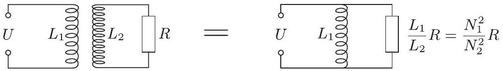
12. ábra

Első közelítésben tekintsünk el attól, hogy az izzók ellenállása függ a rajtuk áthaladó áramtól (erre még visszatérünk), és induljunk ki abból, hogy van öt egyforma ellenállásunk. Az eredő a szekunder oldalon $R$, primer oldalon $R / 4$, a párhuzamos kapcsolás miatt. Mivel a szekunder tekercs menetszáma háromszorosa a primer tekercsének, ezért a helyettesítő kapcsolásban ide $R / 9$ ellenállás kerül (13. ábra).

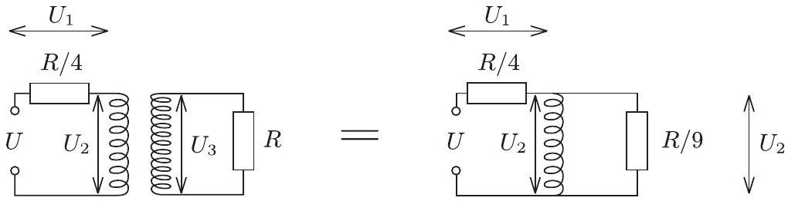
13. ábra

Egy jó minőségú transzformátor szekunder tekercsének váltóáramú ellenállása sokkal nagyobb, mint az izzó ellenállásának kilenced része, ezért jó közelítésben írhatjuk:

$$
U _ { 1 } : U _ { 2 } = \frac { R } { 4 } : \frac { R } { 9 } ,
$$

valamint $U _ { 1 } + U _ { 2 } = U$ és $U _ { 3 } = 3 U _ { 2 }$. Ezekból az összefüggésekből következik:

$$
U _ { 1 } = \frac { 9 } { 13 } U , \quad U _ { 2 } = \frac { 4 } { 13 } U , \quad U _ { 3 } = \frac { 12 } { 13 } U .
$$

A primer tagban egy-egy izzóra jutó teljesítmény:

$$
\frac { U _ { 1 } ^ { 2 } } { R } = \frac { 81 } { 169 } \frac { U ^ { 2 } } { R } = 0,48 \frac { U ^ { 2 } } { R } ,
$$

durván fele annak a teljesítménynek, amellyel a hálózati feszültségen világítanának. A szekunder körben az izzó teljesítménye:

$$
\frac { U _ { 3 } ^ { 2 } } { R } = \frac { 144 } { 169 } \frac { U ^ { 2 } } { R } = 0,85 \frac { U ^ { 2 } } { R } ,
$$

nincs nagyon messze attól a teljesítménytől, amellyel ez az izzó a hálózati feszültségen világítana.
Ha most figyelembe vesszük azt a tényt, hogy alacsonyabb feszültségen (tehát alacsonyabb hőmérsékleten) az izzó ellenállása is kisebb, azt mondhatjuk, hogy a primer ágban levó izzók ténylegesen nagyobb teljesítménnyel világítanak, mint amit most kiszámítottunk.

Bátran állíthatjuk, hogy mindegyik izzó tứrhetốen ég, vagyis az $a$ ) válasz a helyes.
Azok számára, akik járatosak a szinuszos váltóáramú hálózatok komplex számokat felhasználó számításaiban, megmutatjuk a 12. ábrán látható két kapcsolás egyenértékúségét, melyet a megoldásban felhasználtunk. A transzformátor primer és szekunder körére felírhatjuk:

$$
\begin{aligned}
& \widetilde { U } = j \omega L _ { 1 } \widetilde { I } _ { 1 } + j \omega M \widetilde { I _ { 2 } } , \\
& 0 = j \omega M \widetilde { I _ { 1 } } + j \omega L _ { 2 } \widetilde { I _ { 2 } } + R \widetilde { I _ { 2 } } ,
\end{aligned}
$$

ahol $\widetilde { I _ { 1 } }$ a primer-, $\widetilde { I _ { 2 } }$ a szekunder körben folyó áram komplex alakja, $M$ pedig a két tekercs kölcsönös indukciós együtthatója. A második egyenletből $\widetilde { I } _ { 2 }$-t kifejezve és az első egyenletbe helyettesítve, valamint felhasználva a szoros csatolás esetén érvényes $M ^ { 2 } = L _ { 1 } L _ { 2 }$ összefüggést, rendezés után kapjuk:

$$
\widetilde { U } = \frac { j \omega L _ { 1 } R } { j \omega L _ { 2 } + R } \widetilde { I } _ { 1 } = \widetilde { Z } \cdot \widetilde { I } _ { 1 } .
$$

A helyettesítő kapcsolásban $j \omega L _ { 1 }$ és $R \frac { L _ { 1 } } { L _ { 2 } }$ váltóáramú ellenállások párhuzamos eredőjét kell kiszámítanunk:

$$
\widetilde { Z ^ { \prime } } = \frac { j \omega L _ { 1 } \cdot R \frac { L _ { 1 } } { L _ { 2 } } } { j \omega L _ { 1 } + R \frac { L _ { 1 } } { L _ { 2 } } } = \frac { j \omega L _ { 1 } R } { j \omega L _ { 2 } + R } = \widetilde { Z } .
$$

Éppen ez az, amit be akartunk bizonyítani.

## A verseny eredménye

A verseny ünnepélyes eredményhirdetésére és a díjkiosztásra 2005. november 25-én délután került sor az ELTE Mogyoródi József termében.

Bevezetésként a versenybizottság elnöke emlékezett vissza az 50 évvel ezelőtti és a 25 évvel ezelőtti versenyre. Írásvetítőn kivetítette az 50 évvel korábbi feladatokat, valamint az akkori nyertesek egy-egy KöMaL feladatra adott egykori megoldását. A feladatokat Kárteszi Ferenc, illetve Prékopa András tǘzte ki (akkor még nem volt fizika rovat a KöMaL-ban). Aki a versenyt megnyerte, Bártfai Pál matematikus, ma a Kürschák-verseny zsürijének oszlopos tagja. Elfogadta meghívásunkat, személyesen (családosan!) megjelent az eredményhirdetésen, és néhány mondatban felelevenítette emlékeit. Nem csak a versenyról beszélt, hanem a felkészülésről is, Vermes tanár úr szakköréről, melynek oly sokat köszönhetett fizikából. Utána az elnök az 50 évvel ezelőtti második helyezett, az Egyesült Államokban élő Gutai László fizikus levelét olvasta fel. Ô is megemlékezett egykori tanáráról, Varga Zoltánról, aki ốt Újpesten tanította. A 25 évvel ezelőtti Eötvös-verseny nyertesek közül Szalontai Zoltán és Umann Gábor jelent meg, mindketten a KöMaL szorgalmas feladatmegoldói voltak, négy éven át jelent meg fényképük a legjobb megoldók között. Ezeket a képeket egymás mellé vetítve láthatták most a megjelentek.

Ezek után került sor a feladatok fent leírt megoldásának ismertetésére. Mindegyik feladathoz kapcsolódott kísérlet is: az elsőt Honyek Gyula, a másodikat és a harmadikat Gnädig Péter mutatta be.

Következtek az ünnepélyes eredményhirdetés legizgalmasabb pillanatai: az elnök Patkós András akadémikust, az Eötvös Loránd Fizikai Társulat elnökét kérte fel a díjak és az oklevelek átadására.
I. díjat, a vele járó Eötvös-verseny érmet és 20 ezer forintos jutalmat kapta Varjas Dániel, a BME mérnök-fizikus hallgatója, aki a dunaújvárosi Széchenyi István Gimnáziumban érettségizett mint Kispál István tanítványa. Varjas Dániel tavaly is első díjat kapott az Eötvös-versenyen, így hát ő az első az országban, aki két Eötvös-verseny éremmel is rendelkezik. Nehéz volt megmondani, hogy ó, vagy Kispál tanár úr hatódott-e meg jobban, amikor kiderült, hogy Dani nyert a versenyen.

A versenybizottság döntése értelmében hárman kaptak II. díjat és vele 14 ezer forint jutalmat, ketten III. díjat és vele 12 ezer forint jutalmat, valamint hat versenyzőt részesített a zsüri dicséretben:
II. díjasok: Halász Gábor, az ELTE Radnóti Miklós Gyakorló Gimnáziumának 12. osztályos tanulója, Honyek Gyula tanítványa; Kómár Péter, az ELTE fizikus hallgatója, aki a Fazekas Mihály Fővárosi Gyakorló Gimnáziumban érettségizett mint Dvorák Cecília tanítványa és Szolnoki Lénárd, a Debreceni Református Kollégium Dóczy Gimnáziumának 10. osztályos tanulója, Tófalusi Péter tanítványa.
III. díjasok: Kónya Gábor, a Fazekas Mihály Fốvárosi Gyakorló Gimnázium 11. osztályos tanulója, Horváth Gábor tanítványa és Széchenyi Gábor, a szolnoki Verseghy Ferenc Gimnázium 12. osztályos tanulója, Pécsi István tanítványa.

Dicséretet kapott Farkas Ádám László, a miskolci Földes Ferenc Gimnázium 11. osztályos tanulója, Zámborszky Ferenc tanítványa; Ferenczy Máté, a BME mérnök-fizikus hallgatója, aki a Fazekas Mihály Fóvárosi Gyakorló Gimnáziumban érettségizett mint Dvorák Cecília tanítványa; Németh Balázs, a székesfehérvári Tóparti Gimnázium 11. osztályos tanulója, Tóthné Rohovszky Katalin tanítványa; Pálinkás András, az ELTE fizikus hallgatója, aki a budapesti Piarista Gimnáziumban érettségizett mint Futó Béla tanítványa; Paulin Roland, a Fazekas Mihály Fốvárosi Gyakorló Gimnázium 12. osztályos tanulója, Horváth Gábor tanítványa és Végh Sándor, a Debreceni Egyetem Kossuth Lajos Gimnáziumának 12. osztályos tanulója, Kirsch Éva és Szegedi Ervin tanítványa.

A nyertes versenyzők tanárai, akik szintén meghívót kaptak az ünnepélyes díjkiosztásra, a Typotex Kiadó által erre a célra felajánlott könyvek közül válogathattak.

Végül Patkós András akadémikus elevenítette fel az Eötvös-versennyel kapcsolatos régebbi és legújabb emlékeit, benyomásait (lásd a hátsó belső borítón középen jobbra). Utána közös fényképezkedés következett, melyen az 50 és a 25 évvel ezelőtti nyertes fogta közre az idei első díjast, s egy jó hangulatú baráti beszélgetésben folytatódott az egymást eddig java részt csak hírből ismerő meghívottak társalgása. A Ramasoft Rt. jóvoltából üdítő és finom szendvicsek is jutottak a végig ott maradóknak.
