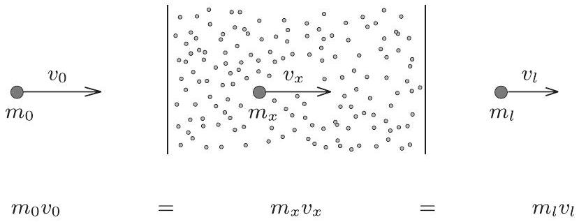
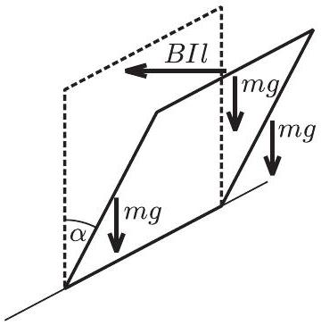

2006. október 20-án rendezte az Eötvös Loránd Fizikai Társulat azévi Eötvös-versenyét. Budapesten 50, Pécsett 19, Debrecenben 13, Nyíregyházán és Sopronban 4-4, Békéscsabán, Egerben, Miskolcon, Nagykanizsán, Szegeden és Szombathelyen 3-3, Győrött, Szekszárdon és Székesfehérváron 2-2 dolgozatot adtak be a versenyzők. Összesen 114 dolgozatot bírált el a feladatokat kitúző Versenybizottság (Radnai Gyula elnök, Gnädig Péter, Honyek Gyula és Károlyházy Frigyes). A legtöbb versenyzó idén is a Fazekas Mihály Fővárosi Gyakorló Gimnáziumból jött, de elég sok 12. osztályos versenyző érkezett az ELTE Apáczai Csere János Gyakorlógimnáziumából is. Vidékről a legtöbb versenyzőt kiállító gimnázium a Debreceni Egyetem Kossuth Lajos Gyakorló Gimnáziuma volt. Két versenyzó érkezett külföldről, a révkomáromi Selye János magyar tannyelvú gimnáziumból, ók Győrött írták meg dolgozatukat.

Ismertetjük a feladatokat és a feladatok helyes megoldását.

1. Fizika szakkörön egy példatárból az alábbi feladat kerül elő:
„Egy függőlegesen álló, henger alakú edényt kb. fele magasságáig megtöltünk vízzel, majd lezárjuk. Az alap- és fedólap jó hővezető, a henger oldalfala hőszigetelő. Az alaplapot -10 °C-ra hútjük, a fedőlapot 110 °C-ra melegítjük, s a továbbiakban ezen a hőmérsékleten tartjuk. Hosszú idő elteltével hogyan oszlanak meg magasság szerint a különböző halmazállapotok az edényben?"

A nebulók különbözö könyvekben kutakodnak. Tóni szerint a jég úszik a vízen, a folyékony víznek tehát alul kell lennie. Réka szerint középen kell lennie a víznek, hiszen forró gőzzel érintkezik. Bea, miközben adatokat keres, felfedezi, hogy a gázok hốvezetóképessége néhány táblázatban - feltehető̃en elírás folytán - nagyobbnak van feltüntetve a víz vagy a jég hốvezetố képességénél, más táblázatok és könyvek szerint azonban a gázok hốvezetố képessége sokszorosan kisebb. (Bea szerint is így logikus.)

Segítsünk nekik megtalálni a helyes választ a feladat kérdésére!
Megoldás. A hốvezetésre felírható legegyszerúbb összefüggés (ebben a különböző könyvek és táblázatok egyetértenek) a következő:

$$
\Phi = \frac { \Delta Q } { \Delta t } = - \lambda A \frac { \Delta T } { \Delta x } .
$$

Itt $\Phi$ jelenti a hőáramot, vagyis az $A$ keresztmetszeten a $T$ hőmérséklet növekedésének irányában másodpercenként áthaladó rendezetlen energiát. Minthogy ez az energia mindig a magasabb hőmérsékletú helyről halad az alacsonyabb hőmérsékletú hely felé, ezért negatív az arányossági tényező. A fenti összefüggéssel definiált pozitív $\lambda$ mennyiséget nevezik hốvezetési együtthatónak, ennek mértékegysége SI rendszerben $\frac { \mathrm { J } } { \mathrm { mK } \mathrm { s } }$.

A hốvezetési együttható jellemzi a hốvezetó képességet, ez az, ami néhány táblázatban - feltehetően elírás folytán - hibásan szerepel. A helyes értékek (lásd például a Nemzeti Tankönyvkiadó „Négyjegyü függvénytáblázatok, összefüggések és adatok" 2005-ös 2., javított kiadásának 216., 214. és 212. oldalát) a következők:

$$
\begin{aligned}
\text { vízgőzre ( } 18 ^ { \circ } \mathrm { C } \text {-on ) } & \lambda _ { \mathrm { g } } = 18,0 \cdot 10 ^ { - 3 } \frac { \mathrm {~J} } { \mathrm {~m} \mathrm {~K} \mathrm {~s} } , \\
\text { levegőre ( } 18 ^ { \circ } \mathrm { C } \text {-on) } & \lambda _ { \mathrm { l } } = 24,2 \cdot 10 ^ { - 3 } \frac { \mathrm {~J} } { \mathrm {~m} \mathrm {~K} \mathrm {~s} } , \\
\text { vízre ( } \left. 18 ^ { \circ } \mathrm { C } \text {-on } \right) & \lambda _ { \mathrm { v } } = 587 \cdot 10 ^ { - 3 } \frac { \mathrm {~J} } { \mathrm {~m} \mathrm {~K} \mathrm {~s} } , \\
\text { jégre } \left( 0 ^ { \circ } \mathrm { C } - \mathrm { on } \right) & \lambda _ { \mathrm { j } } = 2200 \cdot 10 ^ { - 3 } \frac { \mathrm {~J} } { \mathrm {~m} \mathrm {~K} \mathrm {~s} } .
\end{aligned}
$$

A jobb összehasonlíthatóság kedvéért emeltük ki mindegyik adatból a $10 ^ { - 3 }$ tényezőt.
Igaz, hogy a hóvezetési együtthatók függnek a hőmérséklettől, de nem változnak olyan erősen, hogy elfedjék azt a tényt, mely szerint a gázok hớvezető képessége sokkal-sokkal kisebb, mint a folyadékoké, illetve a szilárd anyagoké. A gázoknál csak a vákuum lehet jobb hőszigetelő. (A dupla ablak, vagy a réteges öltözködés előnye éppen a levegő rossz hốvezetésén alapul.)

Szemléletesen tehát azt mondhatjuk, hogy a feladatbeli henger felső felében hőszigetelő, alsó felében hốvezető réteg helyezkedik el, vagyis a két réteg közös határának hőmérséklete sokkal közelebb van a hóvezető réteg alsó hőmérsékletéhez, mint a hőszigetelő réteg felső hőmérsékletéhez. Jelen esetben, a hốvezetési tényezők konkrét adatait figyelembe véve $- 6 ^ { \circ } \mathrm { C }$ körüli hőmérséklet alakul ki a két réteg határán.

Van olyan víz, ami alul -10 °C-os, felül -6 °C-os? A víz túlhüthető, az igaz, de a túlhütött vízben aligha maradhat fenn ilyen hőmérsékletkülönbség, mert ez belsó áramlást indít, s e túlhütött víz pillanatok alatt kifagy: ilyen hőmérsékleteken a jég a stabil fázis.

A jég viszont még jobb hővezető, mint a víz, tehát a feladatban kérdezett végállapot a következő: alul jég, felette levegố és egy kevés vízgốz keveréke, víz pedig egyáltalán nem lesz a hengerben! A jég és a gáz határán a hốmérséklet $- 9 ^ { \circ } \mathrm { C }$ körül stabilizálódik.

Van ilyen alacsony hómérsékletú vízgőz? Van. Tekintsük a $\mathrm { H } _ { 2 } \mathrm { O } ( p , T )$ diagramját! Az 1. ábrán feltüntettük azt az $A$ állapotot, amely a jég-gőz határfelületén alakul ki. A telített vízgőz nyomása itt mintegy 300 Pa, ami a $10 ^ { 5 } \mathrm {~Pa}$ körüli nyomású levegőhöz képest nagyon kicsi, ezért lesz olyan kevés vízgőz a jég fölötti levegőben. ( $H$-val a $\mathrm { H } _ { 2 } \mathrm { O }$ hármaspontját jelöltük. Az ábra nem méretarányos.)

1. ábra

2. Egy bolygóközi pályán mozgó ứrszonda, pályájának bizonyos részén, egy ott elhelyezkedő kozmikus „porfelhốn” haladt át. Mindazon porszemcsék, amelyeknek nekiütközött, ráragadtak a szondára. Mire a szonda kiért a porfelhốból, tömege 2\%-kal megnótt.

Hány százalékkal nốtt meg a porfelhốn való áthaladás ideje ahhoz képest, amennyi idő alatt a porfelhő fékező hatása nélkül tette volna meg a szonda ugyanezt az utat?
(A porfelhốt állandó súrúségứ, határozott szélű objektumnak tekinthetjük.)
Megoldás. Külső́ erők hiányában a rendszer összes lendülete (impulzusa) állandó marad. Bolygóközi pályáról van szó, az úrszonda tehát legfeljebb a Nap gravitációs terét érzi, de elsó közelítésben ezt is elhanyagolhatjuk. A porfelhőt állandó sűrúségü, határozott szélü objektumnak tekintjük, így a folyamatot a 2. ábrával szemléltethetjük:

2. ábra

A porfelhő nem vesz át impulzust az úrszondától, mivel valamennyi porszem, amivel a szonda ütközik, ráragad a szondára. Másrészt $v _ { 0 } , v _ { x }$ és $v _ { l }$ a szondának a porfelhőhöz viszonyított (relatív) sebességét jelöli, vagyis a porfelhőt nyugvónak tekinthetjük.

A szonda tömege, miután $x$ utat megtett a porfelhőben:

$$
m _ { x } = m _ { 0 } + \varrho A x ,
$$

ahol $\varrho$ a porfelhó súrúsége, $A$ a szondának a sebességére meróleges keresztmetszet-területe. A szonda egész útját $l$-lel jelölve, a feladat feltétele szerint

$$
m _ { l } - m _ { 0 } = \varrho A l = 0,02 m _ { 0 } .
$$

A lendületmegmaradásból következőleg

$$
v _ { x } = \frac { m _ { 0 } v _ { 0 } } { m _ { x } } = \frac { m _ { 0 } v _ { 0 } } { m _ { 0 } + \varrho A x } .
$$

Itt $v _ { x }$ helyére $\frac { \Delta x } { \Delta t }$-t helyettesítve, majd $\Delta t$-t kifejezve

$$
\Delta t = \frac { m _ { 0 } + \varrho A x } { m _ { 0 } v _ { 0 } } \cdot \Delta x ,
$$

tehát az azonos nagyságú $\Delta x$ útszakaszok megtételéhez szükséges $\Delta t$ idő lineáris függvénye $x$-nek! Így a teljes áthaladási idő a számtani középből számolható:

$$
T = \sum \Delta t = \frac { 1 } { 2 } \left( \frac { 1 } { v _ { 0 } } + \frac { m _ { 0 } + \varrho A l } { m _ { 0 } v _ { 0 } } \right) \sum \Delta x = \frac { l } { v _ { 0 } } + \frac { \varrho A } { m _ { 0 } v _ { 0 } } \frac { l ^ { 2 } } { 2 } .
$$

Ezt a kifejezést kissé átalakíthatjuk:

$$
\begin{aligned}
T & = \frac { l } { v _ { 0 } } + \frac { \varrho A l } { m _ { 0 } v _ { 0 } } \frac { l } { 2 } = \frac { l } { v _ { 0 } } + \frac { 0,02 } { v _ { 0 } } \frac { l } { 2 } = \frac { l } { v _ { 0 } } ( 1 + 0,01 ) , \\
T & = 1,01 T _ { 0 } .
\end{aligned}
$$

Most kapott eredményünk szerint az áthaladási idő 1\%-kal lett nagyobb. Általánosítva azt mondhatjuk, hogy ha a szonda tömege $p \%$-kal megnőtt, akkor az áthaladási idő $p / 2 \%$-kal lett nagyobb, függetlenül attól, hogy $p$ értéke mekkora. Csak az a gondolatmenet fogadható el e feladat teljes értékú megoldásának, amibő́l ez is következik; más megfontolások (melyek $p$ kicsiny értékénél numerikusan jó eredményt szolgáltatnak, de általánosságban nem múködnek) csak részmegoldásnak tekinthetők.
3. Négyzet alakú, rövidre zárt lapos tekercs anyaga szupravezetó (ellenállása elhanyagolható). A négyzet oldalélei $l$ hosszúak, egy-egy oldalának tömege $m$. A tekercs, amelynek induktivitása $L$, súrlódásmentesen elfordulhat a négyzet alsó, vízszintes oldala körül.

Kezdetben a tekercs függốlegesen, labilis egyensúlyi helyzetben áll a földi nehézségi erốtérben. Ezután egy olyan homogén mágneses mezót alkalmazunk, hogy a tekercsre ható B mágneses indukció vektor nagysága állandó, iránya függőleges legyen. Ekkor a tekercsben nem folyik áram.

Ezután a tekercs felsó végét kicsiny $v _ { 0 }$ sebességgel meglökjük. Körbefordul-e a tekercs, vagy ha nem, akkor milyen határok között fog mozogni?

Megoldás. Az alapvető összefüggés, melyből ennek a feladatnak a megoldásánál kiindulhatunk, a dinamikának az az alaptörvénye, amely merev testeknek rögzített tengely körüli forgására vonatkozik:

$$
\Theta \beta = \sum M ,
$$

vagyis a test $\Theta$ tehetetlenségi nyomatékának és $\beta$ szöggyorsulásának szorzata a testre ható erők forgatónyomatékainak összegével egyenlő.

A feladat szempontjából lényegtelen, hogy a „lapos tekercs” hány menetes, ezért a továbbiakban azt egy keretnek (1 menetes tekercsnek) tekintjük (3. ábra). Az ábrán felrajzoltuk azokat az erőket, amelyek akkor hatnak a keretre, amikor az már $\alpha$ szögben kilendült eredeti függőleges helyzetéből. Az oldalakra ható $m g$ nehézségi erő tovább akarja forgatni a keretet, a felső oldalra ható BIl erő vízszintes irányú (a többi oldalon ható mágneses erőknek nincs forgatónyomatéka, így ezekkel nem kell törődnünk). Mivel a keretben folyó áram az elektromágneses indukció miatt lép fel, ezért - Lenz törvénye szerint - a felső oldalon ható erő visszafelé akarja forgatni a keretet. A hozzá tartozó erőkar $l \cos \alpha$ nagyságú, tehát:

$$
\Theta \beta = m g l \sin \alpha + 2 m g \frac { l } { 2 } \sin \alpha - B I l \cdot l \cos \alpha .
$$

Ebben az egyenletben

$$
\Theta = m l ^ { 2 } + 2 \cdot \frac { 1 } { 3 } m l ^ { 2 } = \frac { 5 } { 3 } m l ^ { 2 } .
$$

3. ábra

Hogyan határozhatjuk meg az $I$ indukált áram nagyságát? A tekercsben most kétféle okból lép fel indukált feszültség. Az egyik ok, hogy vezető mozog a mágneses térben. Ennek megfelelően az indukált feszültség nagysága Neumann törvénye szerint

$$
U _ { 1 } = B l v \cos \alpha .
$$

A másik ok az, hogy az $L$ induktivitású tekercsben változik az áram, ezért a fellépő önindukciós feszültség

$$
U _ { 2 } = - L \frac { \Delta I } { \Delta t } .
$$

A kettő előjeles összege adja $I R$-et a lassan változó áramokra is igaz Kirchhoff-féle huroktörvény szerint. Mivel a tekercs anyaga most szupravezető, ezért $R = 0$, tehát

$$
B l \frac { \Delta s } { \Delta t } \cos \alpha - L \frac { \Delta I } { \Delta t } = 0 .
$$

Ha ebből akarjuk $I$-t kifejezni, akkor ( $\Delta s = l \Delta \alpha$ behelyettesítése után) integrálnunk kell az egyenletet. Ennek a matematikai múveletnek a megkerülésével is eljuthatunk azonban a helyes összefüggéshez, ha azt vesszük figyelembe,

hogy a keret $A = l ^ { 2 }$ nagyságú keresztmetszetén áthaladó teljes fluxus (amely a külső mágneses tértől származó fluxus és az önindukciós fluxus összege) állandó kell maradjon:

$$
B A \sin \alpha - L I = \text { állandó. }
$$

Az állandó értéke $L I _ { 0 } = 0$, hiszen a kezdeti ( $\alpha = 0$-hoz tartozó) $I _ { 0 }$ áram nulla volt. A fenti egyenletből már kifejezhetjük $I$-t:

$$
I = \frac { B l ^ { 2 } } { L } \cdot \sin \alpha
$$

$B , l$ és $L$ adott állandók, $I$ tehát $\sin \alpha$-val arányos mennyiség. Erre a felismerésre még szükségünk lesz, de mielőtt diszkutálni kezdjük a feladatot, gondoljuk át, milyen fizikai törvényt, összefüggést használhatunk még fel a megoldás során!

Szükségünk lehet energetikai meggondolásra. Írjuk fel a munkatételt (a kinetikai energia tételét)! Eszerint

$$
\Delta E _ { \text {mozg. } } = \sum W ,
$$

vagyis

$$
\frac { 1 } { 2 } \Theta \omega ^ { 2 } - \frac { 1 } { 2 } \Theta \omega _ { 0 } ^ { 2 } = m g l ( 1 - \cos \alpha ) + 2 m g \frac { l } { 2 } ( 1 - \cos \alpha ) - \frac { 1 } { 2 } L I ^ { 2 } .
$$

(A jobb oldalon az utolsó tag az önindukcióból származó $U _ { \text {ind } } . = - L \cdot \Delta I / \Delta t$ feszültség $U _ { \text {ind } } . I \Delta t$ munkavégzését fejezi ki.) A fenti összefüggéshez „energiatételként” is eljuthatunk, amely szerint

$$
\sum E = \text { állandó } , \quad \text { vagyis } \quad \sum E _ { \text {kezdeti } } = \sum E _ { \alpha } ,
$$

tehát

$$
\frac { 1 } { 2 } \Theta \omega _ { 0 } ^ { 2 } = \frac { 1 } { 2 } \Theta \omega ^ { 2 } - 2 m g l ( 1 - \cos \alpha ) + \frac { 1 } { 2 } L I ^ { 2 } .
$$

Most kezdjünk a diszkusszióhoz! Vizsgáljuk meg először azt az esetet, amikor a meglökéssel adott $v _ { 0 }$ sebesség kicsi, és emiatt a kilendülési $\alpha$ szög is olyan kicsi, hogy megengedhetó a $\sin \alpha \approx \alpha$ és $\cos \alpha \approx 1$ közelítés. Ekkor a forgómozgás dinamikai egyenlete:

$$
\Theta \beta = 2 m g l \alpha - B I l ^ { 2 } ,
$$

az áram pedig így függ $\alpha$-tól:

$$
I = \frac { B l ^ { 2 } } { L } \alpha .
$$

Behelyettesítve $I$ kifejezését a dinamikai egyenletbe:

$$
\Theta \beta = 2 m g l \alpha - \frac { B ^ { 2 } l ^ { 4 } } { L } \alpha = - \left( \frac { B ^ { 2 } l ^ { 4 } } { L } - 2 m g l \right) \alpha .
$$

Látjuk, hogy a $\beta$ szöggyorsulás az $\alpha$ szögkitéréssel arányosnak adódik. Tudjuk, hogy a $\beta = - \Omega ^ { 2 } \alpha$ típusú összefüggés harmonikus rezgésre vezet, mégpedig olyanra, aminek $\Omega$ a körfrekvenciája, vagyis a feltételezett esetben olyan harmonikus rezgő „lengésbe” kezd a tekercs, amelynek periódusideje $T = \frac { 2 \pi } { \Omega }$ lesz. $\Theta = \frac { 5 } { 3 } m l ^ { 2 }$ behelyettesítése után kapjuk:

$$
T = 2 \pi \sqrt { \frac { 5 } { 3 \left( \frac { B ^ { 2 } l ^ { 2 } } { m L } - 2 \frac { g } { l } \right) } } .
$$

A kilendülés maximális szöge:

$$
\alpha _ { \max } = \frac { v _ { 0 } } { \Omega l } = \frac { v _ { 0 } T } { 2 \pi l } .
$$

A periódusidőre kapott kifejezést figyelmesen megvizsgálva felvetődik a kérdés: nem állhat ott a gyökjel alatt negatív szám? Mi van akkor, ha $\frac { B ^ { 2 } l ^ { 2 } } { m L } < 2 \frac { g } { l }$ ? Elég gyenge mágneses tér, kicsiny $B$ esetén ez bizonyára előfordulhat! Visszatérve a dinamikai egyenlethez, azt látjuk, hogy ilyenkor $\beta$ a $0 < \alpha < 180 ^ { \circ }$ intervallumon mindig pozitív marad, akármilyen kicsiny is a kezdeti $v _ { 0 }$ érték. Sejthető, hogy ilyenkor nem lesz maximális kilendülési szög, hanem a lebillenő tekercs egyre nagyobb szögsebességgel forog, s végül átlendül, átfordul a legalsó helyzetén és szépen visszatér a $v _ { 0 } / l$ szögsebességü kezdőállapotba. Vagyis folyton-folyvást forogni fog, sose áll meg, mert szupravezető, s így nem disszipálódhat az energia. (Persze még kisugárzódhat, ez további meggondolásokat igényel ...)

Vizsgáljuk meg most azt az esetet, amikor $v _ { 0 }$ akármekkora lehet! Vajon milyen feltételek teljesülése esetén áll meg és fordul vissza valahonnan a tekercs, és mikor fog folyamatosan egyirányban forogni?

Mi a megállás feltétele? Ehhez szükségünk lesz az energetikai meggondolásra:

$$
\frac { 1 } { 2 } \Theta \omega ^ { 2 } = \frac { 1 } { 2 } \Theta \omega _ { 0 } ^ { 2 } + 2 m g l ( 1 - \cos \alpha ) - \frac { 1 } { 2 } L I ^ { 2 } .
$$

Keressük a megálláshoz, $\omega = 0$-hoz tartozó $\alpha$ szöget:

$$
0 = \frac { 1 } { 2 } \Theta \omega _ { 0 } ^ { 2 } + 2 m g l ( 1 - \cos \alpha ) - \frac { 1 } { 2 } L I ^ { 2 } .
$$

Írjuk be ide is az áram szögfüggését:

$$
0 = \frac { 1 } { 2 } \Theta \omega _ { 0 } ^ { 2 } + 2 m g l ( 1 - \cos \alpha ) - \frac { 1 } { 2 } \frac { B ^ { 2 } l ^ { 4 } } { L } \sin ^ { 2 } \alpha
$$

Felhasználva, hogy $\sin ^ { 2 } \alpha = 1 - \cos ^ { 2 } \alpha$, jól látszik, hogy $\cos \alpha$-ra kaptunk egy másodfokú egyenletet, ami lényegében ilyen alakú: $a \cos ^ { 2 } \alpha + b \cos \alpha + c = 0$, és aminek megoldása:

$$
\cos \alpha = \frac { - b \pm \sqrt { b ^ { 2 } - 4 a c } } { 2 a } .
$$

A meglökött tekercs tehát akkor áll meg valahol, ha a fenti másodfokú egyenletnek van valós megoldása, és ez a megoldás abszolút értékben nem nagyobb 1-nél (hiszen egy szög koszinuszáról van szó).

Teljesülnie kell tehát a következő két feltételnek:

$$
\begin{gather*}
b ^ { 2 } - 4 a c \geq 0  \tag{1}\\
\left| \frac { - b \pm \sqrt { b ^ { 2 } - 4 a c } } { 2 a } \right| \leq 1 \tag{2}
\end{gather*}
$$

Mindez, átfordítva a feladat paramétereire, a következő feltételekhez vezet:

$$
\begin{gathered}
\frac { B ^ { 2 } l ^ { 2 } } { m L } \geq 2 \frac { g } { l } \\
v _ { 0 } \leq v _ { 0 \max } = \frac { 1 } { B } \sqrt { \frac { 3 } { 5 } m L } \left( \frac { B ^ { 2 } l ^ { 2 } } { m L } - 2 \frac { g } { L } \right) .
\end{gathered}
$$

Ezek teljesülése esetén áll meg valahol a tekercs. A megállási szög koszinuszára kapjuk:

$$
\cos \alpha _ { \max } = \frac { 2 m g L } { B ^ { 2 } l ^ { 3 } } + \sqrt { \left( 1 - \frac { 2 m g L } { B ^ { 2 } l ^ { 3 } } \right) ^ { 2 } - \frac { 5 m L } { 3 B ^ { 2 } l ^ { 4 } } v _ { 0 } ^ { 2 } } .
$$

(A gyökjel előtt azért választottuk a pozitív előjelet, mert az felel meg nagyobb $\cos \alpha$-nak, tehát kisebb $\alpha$ szögnek. A tekercs nyilván ott áll meg, ahol először teljesül a megállás $\omega = 0$ feltétele.) A megoldásból látszik, hogy minél nagyobb a meglökés $v _ { 0 }$ sebessége, annál kisebb lesz $\cos \alpha _ { \text {max } }$ értéke, vagyis annál nagyobb $\alpha _ { \text {max } }$ szögnél áll meg a tekercs, ahogy azt vártuk is.

## A verseny eredménye

A verseny ünnepélyes eredményhirdetésére 2006. november 24-én került sor az ELTE Eötvös-termében. Külön meghívást kaptak az eredményesen szereplő versenyzőkön és tanáraikon kívül a 25 és az 50 évvel ezelőtti Eötvösverseny díjazottjai, valamint az elmúlt húsz évben díjazott valamennyi versenyző, akiket csak az egyik internetes közösségi oldal listáján el lehetett érni.

Bevezetésként a versenybizottság elnöke bemutatta Bártfai Pál 51 évvel ezelőtt kapott értesítését az akkori Eötvösverseny megnyeréséről, majd ismertette a 25 évvel ezelőtti verseny díjazottjait. Kiderült, hogy jelentős részük ma külföldi egyetemeken, illetve kutatóintézetekben dolgozik, ezért nem lehettek itt. Az 50 évvel ezelőtti Eötvös-verseny díjazottjai viszont majdnem mind el tudtak jönni. Ôk azok, akik kalandvágyból itthon maradtak - jegyezte meg valaki, amikor kiderült, hogy 1956. október 20-án volt az akkori verseny. Egy héttel késóbb lett volna a Kürschák-verseny, az már elmaradt. Mint ahogy elmaradt az Eötvös-verseny akkori ünnepélyes eredményhirdetése is. Ezt pótlandó, kaptak most, Gyulai Zoltán és Vermes Miklós aláírásával, a Társulat és a Versenybizottság mai elnöke által hitelesített okleveleket.

A résztvevők derültsége kísérte Patkós Andrásnak, a Társulat mai elnökének bejelentését, amikor szólította Csiszár Imrét, a budapesti Petőfi Gimnázium érettségizett tanulóját, hogy vegye át az 1956-os Eötvös-verseny megnyerését tanusító oklevelet. Nagy taps kísérte, amikor a két akadémikus kezet fogott egymással. A jelenetet a Magyar Televízió forgatócsoportja is megörökítette. A második díjas Rázga Tamás, akkori villamosmérnök hallgató és a harmadik Geszti Tamás, akkori fizikus hallgató is átvehette oklevelét, és mindhárman felidézték emlékeiket az 50 évvel ezelőtti

eseményekról. Sốt, miután kivetítve látták az akkori feladatokat, Geszti Tamásnak még az is eszébe jutott, ahogy otthon rájött az egyik feladat egyszerú megoldására. A verseny után, persze.

Ekkor már mindenki türelmetlenül várta az idei feladatok megoldását, s a verseny eredményének kihirdetését, az ünnepélyes díjkiosztást. A feladatok megoldását a Versenybizottság elnöke ismertette, a díjakat a Társulat elnöke adta át.

A 2006. évi Eötvös-verseny elsó díját kapta a vele járó Eötvös-verseny éremmel Halász Gábor, az ELTE fizika szakos hallgatója, aki az ELTE Radnóti Miklós Gyakorló Gimnáziumában érettségizett Honyek Gyula tanítványaként.

Második díjat kapott Konczer József, aki a szlovákiai Révkomáromban múködő magyar tannyelvú Selye János Gimnázium utolsó éves tanulója, Hevesi Anikó és Szabó Endre tanítványa; Kónya Gábor, a Fazekas Mihály Fốvárosi Gyakorló Gimnázium 12. évf. tanulója, Horváth Gábor tanítványa; Meszéna Balázs, ugyancsak a Fazekas Mihály Fővárosi Gyakorló Gimnázium 12. évf. tanulója, Takács Lajos tanítványa, és Széchenyi Gábor, az ELTE fizika szakos hallgatója, aki a szolnoki Verseghy Ferenc Gimnáziumban érettségizett Pécsi István tanítványaként.

Harmadik díjat kapott Hasznos László, a szolnoki Varga Katalin Gimnázium 12. évf. tanulója, Balogh Béla tanítványa; Körösi Márton, a békéscsabai Szent-Györgyi Albert Gimnázium 12. évf. tanulója, Varga István tanítványa; Molnár András, a BME mérnökhallgatója, aki a Fazekas Mihály Fóvárosi Gyakorló Gimnáziumban érettségizett Horváth Gábor tanítványaként, valamint Szolnoki Lénárd, Debreceni Református Kollégium Dóczy Gimnáziumának 11. évf. tanulója, Tófalusi Péter tanítványa.

Dicséretet kapott Bohus Péter, a Fazekas M. Fốv. Gyak. Gimn. 12. évf. tanulója, Horváth Gábor tanítványa; Dücsõ Márton, szintén a Fazekas M. Fóv. Gyak. Gimn. 12. évf. tanulója, Horváth Gábor tanítványa; Farkas Ảdám László, a miskolci Földes F. Gimn. 12. évf. tanulója, Zámborszky Ferenc tanítványa; Mándi Gábor, a BME mérnökhallgatója, aki a karcagi Tóth Árpád Gimnáziumban érettségizett Kovács Miklós tanítványaként; Megyeri Balázs, az ELTE Apáczai Csere J. Gyak. Gimn. 12. évf. tanulója, Zsigri Ferenc tanítványa; Nagy Csaba, a Fazekas M. Főv. Gyak. Gimn. 12. évf. tanulója, Horváth Gábor tanítványa; Tanács Ferenc József, a szegedi Radnóti M. Gimn. 12. évf. tanulója, Mike János és Mezó Tamás tanítványa; Varga Bonbien, az ELTE Apáczai Csere J. Gyak. Gimn. 12. évf. tanulója, Flórik György tanítványa és Werner Miklós, ugyancsak az ELTE Apáczai Csere J. Gyak. Gimn. 12. évf. tanulója, Flórik György tanítványa.

A díjakkal és dicséretekkel pénzjutalmak és könyvutalványok is jártak, az I. díjjal 25000, a II. díjjal 15000, a III. díjjal 10 000, a dicséretekkel 8000 forint értékben. Ezeket részben az Eötvös Társulat, részben önkéntes adományozók (Gutai László professzor, USA; Indotek Zrt., Budapest) biztosították. A díjazott és dicséretet nyert diákok tanárai a Typotex, a Vince, az Akkord és a Nemzeti Tankönyvkiadó által felajánlott könyvekből válogathattak. Utána a Versenybizottság elnöke ismertette azokat a válaszokat, melyeket az elmúlt húsz évben az Eötvös-versenyen díjazott versenyzők adtak az alábbi körkérdésre: „Érdemes ma fizikusnak, matematikusnak, mérnöknek, tanárnak készülni az egyetemen?" A válaszok általában pozitívak voltak, ezeket egészítette ki Gefferth András szóban, a helyszínen. A BME oktatója elmondta, hogy épp most készül állást változtatni, pénzügyi területen próbálja ki képességeit, itt szeretné hasznosítani a Múegyetemen szerzett tudását.

A régi és mai Eötvös-verseny nyertesek végül közös fényképezésen vettek részt. Diákok és tanárok vidám beszélgetéssel oldották a még meglévő feszültséget, ismerkedtek egymással, kicserélték élményeiket. Mindehhez a Ramasoft Zrt. biztosított üdítőt, pogácsát, finom szendvicseket.

Általános volt a vélemény, hogy kellemes három órát töltött együtt a fizikát szeretők társasága. Néhány nap múlva az MTV „Válaszd a tudást!" músora tíz perces adásban számolt be az eseményről, melyért Montskó Éva és Gyenes Károly szerkesztőket illeti köszönet.
