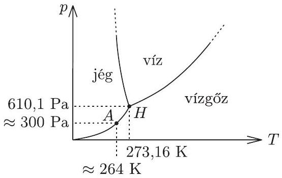

1. Fizika szakkörön egy példatárból az alábbi feladat kerül elő:
„Egy függőlegesen álló, henger alakú edényt kb. fele magasságáig megtöltünk vízzel, majd lezárjuk. Az alap- és fedólap jó hővezető, a henger oldalfala hőszigetelő. Az alaplapot -10 °C-ra hútjük, a fedőlapot 110 °C-ra melegítjük, s a továbbiakban ezen a hőmérsékleten tartjuk. Hosszú idő elteltével hogyan oszlanak meg magasság szerint a különböző halmazállapotok az edényben?"

A nebulók különbözö könyvekben kutakodnak. Tóni szerint a jég úszik a vízen, a folyékony víznek tehát alul kell lennie. Réka szerint középen kell lennie a víznek, hiszen forró gőzzel érintkezik. Bea, miközben adatokat keres, felfedezi, hogy a gázok hốvezetóképessége néhány táblázatban - feltehető̃en elírás folytán - nagyobbnak van feltüntetve a víz vagy a jég hốvezetố képességénél, más táblázatok és könyvek szerint azonban a gázok hốvezetố képessége sokszorosan kisebb. (Bea szerint is így logikus.)

Segítsünk nekik megtalálni a helyes választ a feladat kérdésére!
Megoldás. A hốvezetésre felírható legegyszerúbb összefüggés (ebben a különböző könyvek és táblázatok egyetértenek) a következő:

$$
\Phi = \frac { \Delta Q } { \Delta t } = - \lambda A \frac { \Delta T } { \Delta x } .
$$

Itt $\Phi$ jelenti a hőáramot, vagyis az $A$ keresztmetszeten a $T$ hőmérséklet növekedésének irányában másodpercenként áthaladó rendezetlen energiát. Minthogy ez az energia mindig a magasabb hőmérsékletú helyről halad az alacsonyabb hőmérsékletú hely felé, ezért negatív az arányossági tényező. A fenti összefüggéssel definiált pozitív $\lambda$ mennyiséget nevezik hốvezetési együtthatónak, ennek mértékegysége SI rendszerben $\frac { \mathrm { J } } { \mathrm { mK } \mathrm { s } }$.

A hốvezetési együttható jellemzi a hốvezetó képességet, ez az, ami néhány táblázatban - feltehetően elírás folytán - hibásan szerepel. A helyes értékek (lásd például a Nemzeti Tankönyvkiadó „Négyjegyü függvénytáblázatok, összefüggések és adatok" 2005-ös 2., javított kiadásának 216., 214. és 212. oldalát) a következők:

$$
\begin{aligned}
\text { vízgőzre ( } 18 ^ { \circ } \mathrm { C } \text {-on ) } & \lambda _ { \mathrm { g } } = 18,0 \cdot 10 ^ { - 3 } \frac { \mathrm {~J} } { \mathrm {~m} \mathrm {~K} \mathrm {~s} } , \\
\text { levegőre ( } 18 ^ { \circ } \mathrm { C } \text {-on) } & \lambda _ { \mathrm { l } } = 24,2 \cdot 10 ^ { - 3 } \frac { \mathrm {~J} } { \mathrm {~m} \mathrm {~K} \mathrm {~s} } , \\
\text { vízre ( } \left. 18 ^ { \circ } \mathrm { C } \text {-on } \right) & \lambda _ { \mathrm { v } } = 587 \cdot 10 ^ { - 3 } \frac { \mathrm {~J} } { \mathrm {~m} \mathrm {~K} \mathrm {~s} } , \\
\text { jégre } \left( 0 ^ { \circ } \mathrm { C } - \mathrm { on } \right) & \lambda _ { \mathrm { j } } = 2200 \cdot 10 ^ { - 3 } \frac { \mathrm {~J} } { \mathrm {~m} \mathrm {~K} \mathrm {~s} } .
\end{aligned}
$$

A jobb összehasonlíthatóság kedvéért emeltük ki mindegyik adatból a $10 ^ { - 3 }$ tényezőt.
Igaz, hogy a hóvezetési együtthatók függnek a hőmérséklettől, de nem változnak olyan erősen, hogy elfedjék azt a tényt, mely szerint a gázok hớvezető képessége sokkal-sokkal kisebb, mint a folyadékoké, illetve a szilárd anyagoké. A gázoknál csak a vákuum lehet jobb hőszigetelő. (A dupla ablak, vagy a réteges öltözködés előnye éppen a levegő rossz hốvezetésén alapul.)

Szemléletesen tehát azt mondhatjuk, hogy a feladatbeli henger felső felében hőszigetelő, alsó felében hốvezető réteg helyezkedik el, vagyis a két réteg közös határának hőmérséklete sokkal közelebb van a hóvezető réteg alsó hőmérsékletéhez, mint a hőszigetelő réteg felső hőmérsékletéhez. Jelen esetben, a hốvezetési tényezők konkrét adatait figyelembe véve $- 6 ^ { \circ } \mathrm { C }$ körüli hőmérséklet alakul ki a két réteg határán.

Van olyan víz, ami alul -10 °C-os, felül -6 °C-os? A víz túlhüthető, az igaz, de a túlhütött vízben aligha maradhat fenn ilyen hőmérsékletkülönbség, mert ez belsó áramlást indít, s e túlhütött víz pillanatok alatt kifagy: ilyen hőmérsékleteken a jég a stabil fázis.

A jég viszont még jobb hővezető, mint a víz, tehát a feladatban kérdezett végállapot a következő: alul jég, felette levegố és egy kevés vízgốz keveréke, víz pedig egyáltalán nem lesz a hengerben! A jég és a gáz határán a hốmérséklet $- 9 ^ { \circ } \mathrm { C }$ körül stabilizálódik.

Van ilyen alacsony hómérsékletú vízgőz? Van. Tekintsük a $\mathrm { H } _ { 2 } \mathrm { O } ( p , T )$ diagramját! Az 1. ábrán feltüntettük azt az $A$ állapotot, amely a jég-gőz határfelületén alakul ki. A telített vízgőz nyomása itt mintegy 300 Pa, ami a $10 ^ { 5 } \mathrm {~Pa}$ körüli nyomású levegőhöz képest nagyon kicsi, ezért lesz olyan kevés vízgőz a jég fölötti levegőben. ( $H$-val a $\mathrm { H } _ { 2 } \mathrm { O }$ hármaspontját jelöltük. Az ábra nem méretarányos.)

1. ábra
