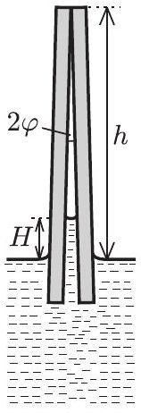
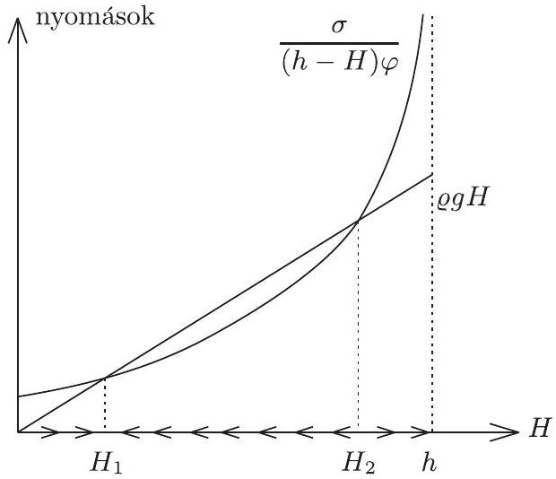

1. Két téglalap alakú üveglemezt egyik élük mentén egymáshoz támasztunk úgy, hogy $2 \varphi$ szöget zárjanak be egymással. Az így rögzített lemezeket lassan vízbe engedjük az ábrán látható módon. A víz, amely tökéletesen nedvesíti az üveget, a felületi feszültség hatására a két lemez között bizonyos $H$ magasságig felemelkedik.

1. ábra

Mekkora ez a $H$ magasság, ha a lemezek vízszintesen tartott érintkezési vonala

a) $h = 30 \mathrm {~mm}$,
b) $h = 15 \mathrm {~mm}$,

távolságra van a szabad vízfelszíntốl? Ábrázoljuk vázlatosan, hogyan változik $H$ a fokozatosan csökkenő $h$ függvényében!

Feltehetjük, hogy a lemezek egymással érintkezó éle sokkal hosszabb, mint $h$, továbbá a lemezek szimmetriasíkja mindvégig függőleges.

Adatok: $\sigma _ { \text {víz } } = 0,072 \mathrm {~N} / \mathrm { m } , \varrho _ { \text {víz } } = 1000 \mathrm {~kg} / \mathrm { m } ^ { 3 } , 2 \varphi = 6 ^ { \circ }$.
(Varga István feladata)

Megoldás. Mivel a két üveglemez elég kis szöget zár be egymással, a köztük felemelkedő víz felületét jó közelítéssel vehetjük félhenger alakúnak. Így felírhatjuk (a félhenger sugarát $r$-rel jelölve):

$$
\varphi \approx \operatorname { tg } \varphi = \frac { r } { h - H } .
$$

Mechanikai egyensúly esetén a víz felületi feszültségéből adódó görbületi nyomásnak és a felemelkedett vízoszlop $H$ magasságának megfelelő hidrosztatikai nyomásnak meg kell egyeznie, vagyis

$$
\frac { \sigma } { r } = H \varrho g .
$$

(Azért nem $\frac { 2 \sigma } { r }$ a görbületi nyomás, mert a felszín nem gömb, hanem henger alakú.)
Amíg $\frac { \sigma } { r } > H \varrho g$, addig a folyadékszint még emelkedik az üveglapok között. Ha pedig már túlfutott és $H \varrho g > \frac { \sigma } { r }$ lett, akkor a vízszint csökkenni kezd. A kialakuló állapot stabil egyensúlyi állapot kell, hogy legyen.

Vizsgáljuk meg, milyen $H$ értékre teljesül a

$$
\frac { \sigma } { ( h - H ) \varphi } = H \varrho g
$$

egyensúlyi feltétel! Átalakítva és az ismert adatokat behelyettesítve

$$
H ( h - H ) = \frac { \sigma } { \varrho g \varphi } = 1,4 \cdot 10 ^ { - 4 } \mathrm {~m} ^ { 2 } = 140 \mathrm {~mm} ^ { 2 }
$$

A magasságokat mm-ben mérve az alábbi másodfokú egyenletet kell megoldanunk:

$$
H ^ { 2 } - h H + 140 = 0 .
$$

Ennek $h = 30 \mathrm {~mm}$ esetén két megoldása lesz: $H _ { 1 } = 5,8 \mathrm {~mm}$ és $H _ { 2 } = 24,2 \mathrm {~mm}$. E kettő közül azonban csak az egyik, a kisebb érték a stabil, a másik instabil egyensúlyi állapotot határoz meg! A stabilitási viszonyokat is megvizsgálhatjuk, ha $H$ függvényében ábrázoljuk a $\varrho g H$ és a $\frac { \sigma } { ( h - H ) \varphi }$ kifejezéseket (2. ábra). Attól függően, hogy melyik kifejezés a nagyobb, a víz felszíne a bejelölt nyilacskáknak megfelelően fel- vagy lefelé mozog. Látható, hogy $H _ { 1 }$ a stabil, $H _ { 2 }$ pedig az instabil megoldás.

