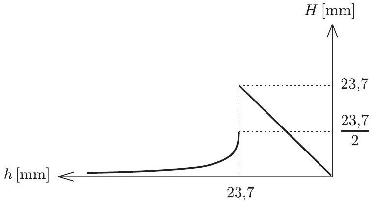

2. ábra

A fenti ábra addig helyes, amíg

$$
h > \sqrt { 4 \cdot 140 } = 23,7 \mathrm {~mm} ,
$$

ekkor pozitív ugyanis a fenti másodfokú egyenlet diszkriminánsa.
De mi történik akkor, amikor az üveglapok lassú leengedése közben elérjük a $h = 23,7 \mathrm {~mm}$ értéket, és még tovább süllyesztjük az üveglapokat? $h = 23,7 \mathrm {~mm}$ esetén $H = \frac { h } { 2 }$ magasan áll a vízszint, majd a következő pillanatban (amikor a 2. ábrán látható hiperbolának és az egyenesnek már nem lesz metszéspontja, tehát a görbületi nyomás minden helyzetben nagyobb lesz, mint a hidrosztatikai nyomás) a víz emelkedni kezd és egészen a két üveglap érintkezéséig felszalad! Ettől kezdve $H = h$ lesz végig.

Hogyan változik $H$ a fokozatosan csökkenő $h$ függvényében? A választ a 3. ábra mutatja, a kérdéses helyzetekben pedig a numerikus értékek:

a) $h = 30 \mathrm {~mm}$ esetén $H = 5,8 \mathrm {~mm}$;
b) $h = 15 \mathrm {~mm}$ esetén $H = 15 \mathrm {~mm}$.

