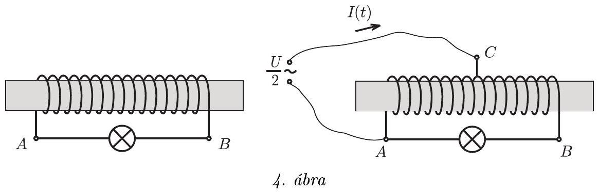
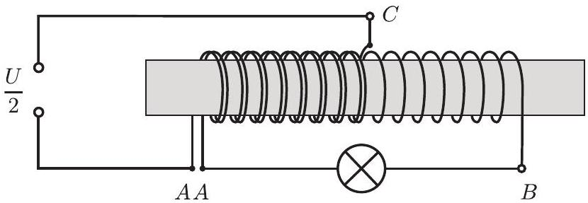
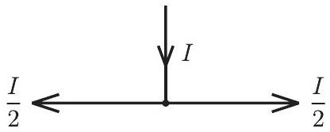
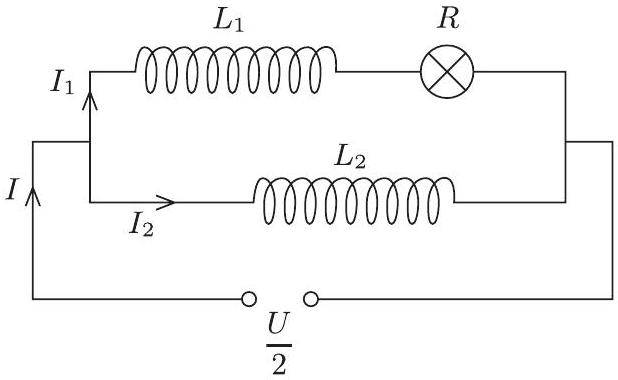
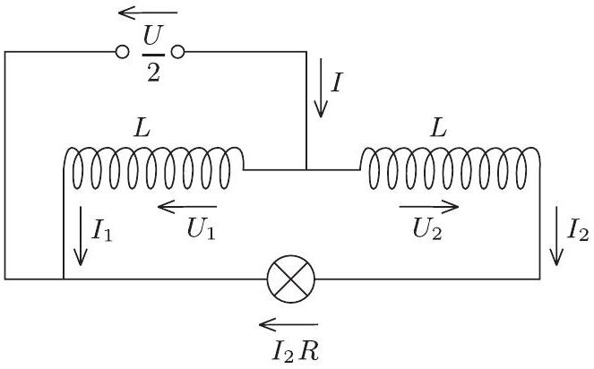
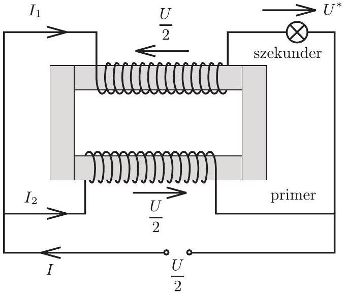
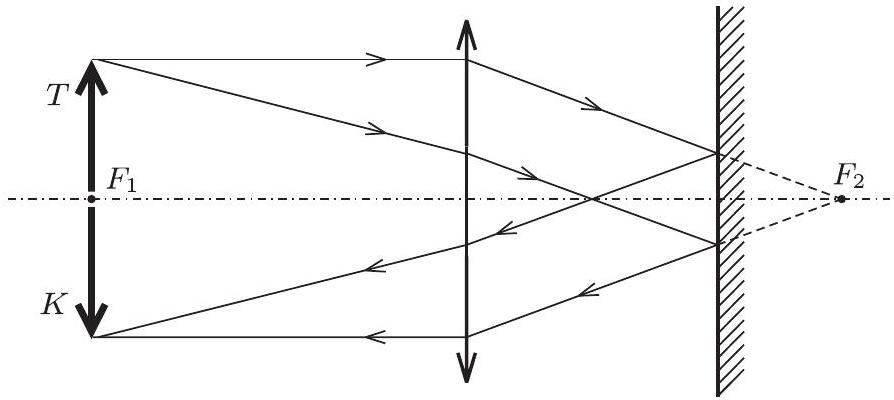
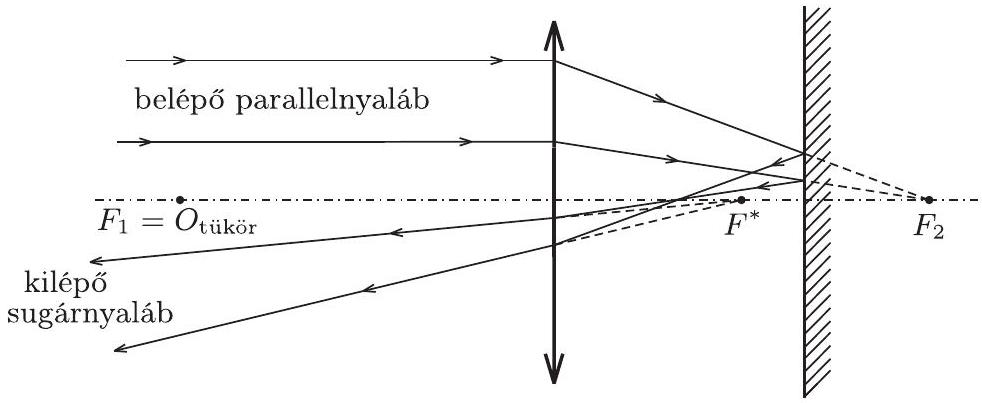
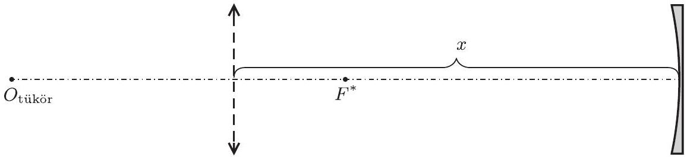

3. ábra

Megjegyzések: A feladatra adott hibás megoldások közül három tipikusat érdemes külön is megemlíteni.

1. Többen a körkeresztmetszetü, függőleges hajszálcsőben felemelkedő vízre érvényes képletet próbálták meg itt alkalmazni. (Ekkor jelenik meg a $\frac { 2 \sigma } { r }$ görbületi nyomás!) Nem kaphattak helyes eredményt.
2. Sokan a felemelkedett vízmennyiség súlyát tették egyenlővé a felületi feszültségből származó, felfelé húzó erốvel. Ez azért hibás, mert a ferde, nem függőleges üveglemezek által kifejtett nyomóerőnek is van függőleges összetevője, amit

az erőegyensúlynál figyelembe kellene venni. A probléma hasonló ahhoz, ami a jól ismert hidrosztatikai paradoxonnál jelentkezik.
3. Néhányan energetikailag próbálták megoldani a feladatot úgy, hogy a felemelkedett víz helyzeti energiáját tették egyenlővé a felületi feszültség $\sigma \cdot \Delta A$ munkájával. Ez ugyanúgy hibás, mintha egy rugóra függesztett test egyensúlyi helyzetének meghatározásához a nehézségi eró és a rugóeró munkájának egyenlőségét írnánk fel. Jól tudjuk, hogy ez az egyenlőség csak a rugón rezgő test mozgásának szélső helyzeteire teljesül, ahol éppenhogy nincs a test egyensúlyban. Egyensúlyi állapotban a mozgási energia nem hanyagolható el, sőt, éppen akkor maximális!
2. Egy terebélyes vasmaggal ellátott, nagy önindukciójú, de mégis elhanyagolható ohmikus ellenállású tekercs végeit $U$ feszültségre méretezett izzón keresztül kötjük össze. Ha az A és B pontok közé U/2 effektív értékü váltakozó feszültséget kapcsolunk, az izzó nagyon halványan világít.

Mivel a tekercs közepéról is van egy $C$ kivezetés, megpróbáljuk a feszültségforrás pólusait az $A$ és $C$ pontokhoz kötni. Megváltozik-e az izzón átfolyó áram erốssége, és ha igen, hogyan? Az ábrán bejelöltük a fốagban folyó $I ( t )$ pillanatnyi áram irányát. Hogyan folyik az áram ugyanekkor a tekercsben?
(Károlyházy Frigyes)

Megoldás. Három dolgot kell egymás után észrevennünk, hogy viszonylag gyorsan eljussunk a helyes válaszhoz.

1. Mivel a tekercs ohmikus ellenállása elhanyagolható, ezért $U _ { A C } \approx \frac { U } { 2 }$ kell legyen, hogy ne folyjék a generátoron végtelen nagy áram.
2. Mivel a fluxusváltozás mértéke a tekercs különböző részein ugyanakkora, ezért mindkét féltekercsen ugyanakkora az indukált feszültség, tehát $U _ { A C } = U _ { C B }$.
3. Mivel a lámpa párhuzamosan van kapcsolva a generátor plusz a tekercs jobb oldali felével, ezért

$$
U _ { \text {lámpa } } = U _ { \text {gen. } } + U _ { C B } = \frac { U } { 2 } + \frac { U } { 2 } , \quad \text { tehát } \quad U _ { \text {lámpa } } = U .
$$

Így a lámpa az „üzemi” feszültséget kapja, ezért jól ég!
Az áramirányok meghatározásához - Werner Miklós ötlete alapján - rajzoljuk át a megadott kapcsolást a következő módon: képzeljük el, hogy a tekercs bal oldali részét alkotó huzalt hosszában kettévágjuk, s így ezen az oldalon két, egymás mellett futó tekercshez jutunk (5. ábra).

5. ábra

Kaptunk egy $A C$ tekercset, amire a generátor feszültségét kapcsoljuk, és egy $A B$ tekercset, amire a lámpát kötöttük. Ez bizony egy transzformátor! A primer menetszám $\frac { N } { 2 }$, a primer áram (a feladatban alkalmazott jelölés szerint) $I$. A szekunder menetszám $N$, tehát a szekunder áram $\frac { I } { 2 }$ lesz.
$C$-től $B$ felé $\frac { I } { 2 } , C$-től $A$ felé ugyancsak $\frac { I } { 2 } \left( I - \frac { I } { 2 } = \frac { I } { 2 } \right)$ áram folyik (6. ábra).

6. ábra

Megjegyzések. Bemutatunk további három megoldást, amellyel a versenyzők eljutottak a helyes válaszhoz. Mindegyikük „ráérzett” a feladatban rejló transzformátorra (ténylegesen autotranszformátornak nevezik a feladatban megadott kapcsolást), és helyesen alkalmazták az általuk ismert összefüggéseket. Nem részletezzük, csak vázoljuk a megoldásnál követett gondolatmeneteket.

7. ábra

1. Konczer József a 7. ábrán látható módon rajzolta át a kapcsolást. Figyelembe véve a tekercsrészek közötti szoros csatolást, a kölcsönös indukciós együttható: $M = \sqrt { L _ { 1 } L _ { 2 } }$. Az indukált feszültségek:

$$
U _ { 1 } = - L _ { 1 } \frac { \Delta I _ { 1 } } { \Delta t } + M \frac { \Delta I _ { 2 } } { \Delta t } ,
$$

illetve

$$
U _ { 2 } = - L _ { 2 } \frac { \Delta I _ { 2 } } { \Delta t } + M \frac { \Delta I _ { 1 } } { \Delta t } .
$$

Mivel most $L _ { 1 } = L _ { 2 } = L = M$, ezért

$$
U _ { 1 } + U _ { 2 } = 0 .
$$

A generátor feszültsége:

$$
\frac { U } { 2 } = - U _ { 2 } = I _ { 1 } R - U _ { 1 } ,
$$

ebből pedig $I _ { 1 } R = U$ következik.

8. ábra

2. Kónya Gábor a 8. ábrán látható módon rajzolta át a kapcsolást. A szinuszos váltakozó áram tárgyalására kidolgozott komplex formalizmus ismeretében ő az alábbi egyenleteket tudta felírni:

$$
U _ { 1 } = j \omega L \left( I _ { 1 } - I _ { 2 } \right) ,
$$

illetve

$$
U _ { 2 } = j \omega L \left( I _ { 2 } - I _ { 1 } \right) .
$$

ezekből következik, hogy $U _ { 2 } = - U _ { 1 }$. Mivel

$$
U _ { 1 } = U _ { 2 } + I _ { 2 } R \quad \text { és } \quad U _ { 1 } = \frac { U } { 2 } ,
$$

ezért

$$
\frac { U } { 2 } = - \frac { U } { 2 } + I _ { 2 } R , \quad \text { vagyis } \quad U = I _ { 2 } R
$$

kell legyen. ( $j$-vel az ún. komplex egységgyököt, $\sqrt { - 1 }$-et jelöltük.)
3. Szolnoki Lénárd úgy rajzolta át a kapcsolást (9. ábra), hogy még jobban emlékeztessen egy veszteségmentes, zárt vasmagú transzformátorra. Mivel a transzformátor szekunder oldalán ellentétes „irányú“ a feszültség, mint a primer oldalon, ezért a felső hurokra felírva a második Kirchhoff-törvényt, kapjuk:

$$
\frac { U } { 2 } + \frac { U } { 2 } - U ^ { * } = 0 , \quad \text { tehát } \quad U ^ { * } = U \text {. }
$$

9. ábra

Mindhárom megoldó már a saját rajzán helyesen jelölte be az áramok irányát.
3. Egy tanár az alábbi problémát tữzi ki tehetséges diákjai számára: Vizsgáljátok meg elméletileg, hogy helyettesíthetốe egy vékony gyüjtốlencsébôl és egy vele párhuzamos síktükörból álló optikai rendszer egyetlen homorú tükörrel!

Anna megvizsgál egy olyan esetet, amikor a gyüjtốlencse $f$ fókusztávolsága 30 cm, és a lencse $\ell = 20 \mathrm {~cm}$-re helyezkedik el a tükör elốtt. Ügyesen megválasztott tárgytávolságok felhasználásával meg tudja határozni a keresett homorú tükör $f ^ { * }$ fókusztávolságát és e tükörnek a lencse helyétôl mért $x$ távolságát.

Balázs általánosan akarja megoldani a feladatot, és addig nem nyugszik, míg olyan összefüggéseket nem talál, melyek megadják $f ^ { * }$-ot és $x$-et $f$ és $\ell$ függvényében.

Cecília végül észreveszi, hogy nem minden $f$ és l értékpár esetén helyettesíthetố homorú tükörrel a fenti optikai rendszer, ezért átgondolja, hogy milyen feltétel teljesülése esetén érvényes Balázs megoldása.

Kövessük nyomon Anna, Balázs és Cecília munkáját! Hogyan oldják meg a maguk elé tüzött feladatokat?
(Honyek Gyula)
Megoldás. Elsó́ ránézésre is látszik, hogy ha helyettesíthető ez a lencse + síktükör együttes egyetlen homorú tükörrel, akkor annak geometriai középpontja ott lesz, ahol most a lencse egyik, $F _ { 1 }$ fókuszpontja van. Ha ugyanis ebbe a fókuszba helyezünk egy világító, pontszerú fényforrást, akkor az innen kiinduló fénysugarak a lencsén való áthaladás után az optikai tengellyel párhuzamosan haladnak, merőlegesen érik el a tükör síkját, utána önmagukba verődnek vissza. A síktükörről visszavert sugarak újra elérik a lencsét s azon megtörve a lencse előbbi, $F _ { 1 }$ fókuszpontja felé tartanak. Gömbtükör esetén pedig a gömb $O _ { \text {tükör } }$ középpontjából kiinduló fénysugarak verődnek úgy vissza, hogy ugyanezen pont felé tartanak.

Könnyen megszerkeszthetjük annak a tárgynak a képét, amelyet a lencse fókuszpontjába állítottunk (10. ábra).

10. ábra

Fordított állású, a tárggyal megegyező nagyságú, valódi kép keletkezik a tárgy „helyén”. $F _ { 1 } = O _ { \text {tükör } }$ tehát, és ez független attól, milyen $\ell$ távolságra van a síktükör a lencsétől.
a) Anna 20 cm-re helyezte el a tükröt az $f = 30 \mathrm {~cm}$ fókusztávolságú lencse mögé. Hogyan határoznánk meg Anna helyében legegyszerúbben a leképező rendszer $F ^ { * }$ fókuszpontjának a helyét? Úgy, hogy az optikai tengellyel párhuzamos fénynyalábot bocsátanánk a lencsére, és megnéznénk, hogy mi a „tartópontja” annak a sugárnyalábnak, amely ebbő́l a párhuzamos nyalábból keletkezik, miután megtörik a lencsén, visszaverődik a síktükrön, majd újta áthalad a lencsén (11. ábra). Biztosak lehetünk abban, hogy $F ^ { * }$ helye már nemcsak $f$-től, hanem $\ell$-től is függeni fog.

11. ábra

Kövessük Anna gondolatmenetét!
A belépő parallelnyaláb a lencse mögött 30 cm-re lévő $F _ { 2 }$ fókuszpont felé tart, miután megtörik a lencsén. Ráesik a lencsétól 20 cm-re lévő síktükörre, s mivel a tükör mögött 10 cm-re lévő $F _ { 2 }$ pont felé tartott, ezért a tükörről visszaverődve a tükör előtt 10 cm-re lévő ponton fog áthaladni. Ez a pont $t = 10 \mathrm {~cm}$-re van a lencsétől; keressük meg egy ilyen távol lévó tárgy képét!

$$
\frac { 1 } { 10 } + \frac { 1 } { k } = \frac { 1 } { 30 } ,
$$

amiből $k = - 15 \mathrm {~cm}$ adódik. Látszólagos kép keletkezik, ez azt jelenti, hogy a lencséből olyan sugárnyaláb fog kilépni, amelynek „tartópontja” egy, a lencse mögött 15 cm-re levő pont. Ez tehát a leképező rendszer $F ^ { * }$ fókuszpontja!

Annának tehát a helyettesítő homorú tükör egy újabb jellemző pontját sikerült megtalálnia. Mivel a homorú tükör fókuszpontja éppen a gömb sugarának közepén van, ezért a fókusztávolságot úgy is megkaphatja, hogy az $F ^ { * }$ fókuszpont és a korábban már megtalált $O _ { \text {tükör } }$ geometriai középpont távolságát határozza meg:

$$
f ^ { * } = F ^ { * } O _ { \text {tükör } } = 30 \mathrm {~cm} + 15 \mathrm {~cm} = 45 \mathrm {~cm} .
$$

Hová, a lencse hült helyétő́l mekkora $x$ távolságra kell tenni ezt a homorú gömbtükröt? Mivel $F ^ { * } 15$ cm-re van attól a ponttól, ahol a lencse állt, ezért a keresett távolság (12. ábra):

$$
x = 15 \mathrm {~cm} + 45 \mathrm {~cm} = 60 \mathrm {~cm} .
$$

12. ábra

b) Balázs is követi Anna gondolatmenetét, de paraméteresen határozza meg a kérdezett mennyiségeket.
$\mathrm { Az } F ^ { * }$ fókuszpont helyének meghatározása:

$$
\begin{gathered}
t = \ell - ( f - \ell ) = 2 \ell - f , \\
\frac { 1 } { 2 \ell - f } + \frac { 1 } { k } = \frac { 1 } { f } , \quad \text { ahonnan } \quad k = \frac { ( 2 \ell - f ) f } { 2 \ell - 2 f } < 0 .
\end{gathered}
$$

A keresett tükör fókusztávolsága:

$$
f ^ { * } = f + | k | = f - k = \ldots = \frac { f ^ { 2 } } { 2 ( f - \ell ) } > 0 .
$$

A homorú tükör távolsága a lencse helyétől:

$$
x = 2 f ^ { * } - f = \ldots = \frac { f \ell } { f - \ell } > 0 .
$$

c) Cecília felismerése: $f > \ell$ kell legyen, mert a feladatban azt kellett megvizsgálni, hogy homorú gömbtükörrel lehet-e helyettesíteni a (lencse + síktükör) leképező rendszert. Ezen kívül azt is Cecíliának kell észrevennie, hogy Anna és Balázs megoldása csak a tárgytér meghatározott tartományára érvényes. Jelen esetben azokra a tárgypontokra, amelyek a lencsének a síktükörrel ellentétes oldalán helyezkednek el. Dehát ez természetesen teljesül, ha valódi tárgyat képez le az optikai rendszer.

Megjegyzés. A lencse + síktükör rendszer leképezése úgy is vizsgálható, hogy a lencsének és a lencse tükörképének, mint két lencséből álló lencserendszernek a leképezését követjük végig, majd a kapott képet visszatükrözzük a síktükörrel. Ezért is meglepő, hogy a leképezés végülis egyetlen homorú tükörrel helyettesíthető, hiszen egymástól távol elhelyezkedő két lencse leképezése sohase helyettesíthető egyetlen lencse adta képpel. A vékonylencse síkja helyett két fősík jelenik meg, s csak az ezektől mért $t , k$ és $f$ távolságokra lehet felírni a leképezési törvényt.

Nos, a mi esetünkben a két lencse fókusztávolsága egyenlő, ilyenkor a fósíkok is szimmetrikusan helyezkednek el, s amikor a szerkesztés végén a képet (és a képoldali fósíkot is) visszatükrözzük, a két fósík egybe fog esni! Az ide, a fősíkok közös helyére elhelyezett gömbtükörrel ekkor már helyettesíthető lesz a lencséből és a síktükörből álló rendszer.

A fósíkokkal történő leképezés nem középiskolai, hanem föiskolai, egyetemi tananyag; ennek ellenére volt olyan versenyző, aki ezt a gondolatmenetet próbálta meg követni. Hasonlóképpen egyetemi tananyag az úgynevezett „mátrixoptika" is, amellyel Pálfalvi László mutatja meg e feladat megoldását a 179. oldalon.

## Az eredményhirdetés

2007. november 30-án került sor az ünnepélyes eredményhirdetésre az Eötvös Loránd Tudományegyetem Ortvay Rudolfról elnevezett előadótermében.

Bevezetésként a Versenybizottság elnöke emlékezett meg Tolnai Jenóről, aki 100 évvel ezelőtt nyerte meg a Társulat tanulóversenyét, Neukomm Gyuláról, a KöMaL egykori főszerkesztőjéről, aki ötven éve hunyt el, és ebben az évben sikerült a sírját védetté nyilvánítani, Boros Jánosról, a Versenybizottság volt tagjáról, akinek éppen ezen a napon lett volna a születésnapja és Varga Istvánról, a csak nemrég elhunyt fizikatanárról, aki sziporkázó ötleteivel támogatta a Versenybizottság munkáját.

Ezután az 50 évvel ezelőtt, 1957-ben rendezett Eötvös-versenyt elevenítette fel. Bemutatta az akkori feladatokat és a díjazottak egykori fényképét is a KöMaL képarchívumából. Papp Kálmánt, a verseny 50 évvel ezelốtti nyertesét sajnos nem sikerült elérnie, és nem tudott eljönni Cserteg István sem, aki akkor a második helyezett volt. Mindketten villamosmérnökök lettek később. Nem így Szatmáry Zoltán, a harmadik helyezett piarista diák, aki Neukomm Gyula hathatós támogatásával tudott bekerülni az ELTE fizikus szakára 1957-ben. A KFKI kutatója, a múegyetemi tanreaktor Kossuth-díjas igazgatója személyesen idézte fel egyetemre kerülésének izgalmas történetét.

A 25 évvel ezelőtt díjazottak közül is csak egyetlen versenyző tudott eljönni: Károlyi Gyula, aki ma már egyetemi oktató, a KöMaL matematika szerkesztő bizottságának tagja. Csörgő Tamás, Erdős László és Tóth Gábor, az akkori elsó́ díjasok valamennyien hazai és külföldi kutatóintézetek, egyetemek sikeres kutatói. A KöMaL tehetségfejlesztő munkáját dicséri, hogy az 50 évvel ezelőtt díjazott mindhárom versenyző, a 25 évvel ezelőtt díjazott hat versenyző közül pedig öten voltak a KöMaL feladatmegoldói, és fényképük is megjelent a Lapokban, melyet most kivetítve láthatott és tapsolhatott meg a hálás közönség.

Ezután került sor a 2007. évi feladatok bemutatására, a helyes megoldások ismertetésére. Mindegyik megoldást kísérleti bemutató követte: az első két feladathoz Honyek Gyula, a harmadikhoz Radnai Gyula mutatott be érdekes kísérleteket. Az üveglapok közé felfutó víz, a meglepóen jól égő kis izzó, valamint a lencse plusz síktükörrel és az ezeket helyettesítő gömbtükörrel egymás mellett előállított éles képek azokat is meggyőzték, akik esetleg kételkedtek volna a bemutatott megoldások helyességében. Szerencsére itt nem voltak ilyenek, - a közönség főleg a fizikát értő és szerető fiatalokból, tanáraikból és volt Eötvös-verseny nyertesekbő́l állt. Itt volt a Társulat egész „vezérkara”, Kádár György fótitkár, Pákó Gyula, a középiskolai szakcsoport elnöke és Sólyom Jenő akadémikus, a társulat elnöke is, aki ezek után mosolyogva adta át a díjakat a verseny győzteseinek.

Elsó́ díjat és az ezzel együtt járó Eötvös-verseny érmet kapta a verseny 1. helyezettje: Werner Miklós, a BME hallgatója, aki az ELTE Apáczai Csere János Gyakorló Gimnáziumában érettségizett Flórik György tanítványaként. Ugyancsak első díjat kapott a 2. helyezett Kónya Gábor, az ELTE hallgatója, aki a Fazekas Mihály Fóvárosi Gyakorló Gimnáziumban érettségizett Horváth Gábor tanítványaként.

Második díjat is két versenyző kapott: Eisenberger András, a Fazekas Mihály Fővárosi Gyakorló Gimnázium 12. évfolyamán Horváth Gábor tanítványa és Konczer József, a BME hallgatója, aki a szlovákiai Révkomárom Selye János Gimnáziumában érettségizett Hevesi Anikó és Szabó Endre tanítványaként.

Harmadik díjat nyert Szolnoki Lénárd, a Debreceni Református Kollégium Dóczy Gimnáziumának 12. osztályos tanulója, Tófalusi Péter tanítványa.

Dicséretet kapott a verseny 6-11. helyezettje, helyezésük szerinti sorrendben a következők: Körösi Márton, az ELTE hallgatója, aki a békéscsabai Szent-Györgyi Albert Gimnáziumban érettségizett Varga István tanítványaként; Almási Gábor, a pécsi Leöwey Klára Gimnázium 12. osztályos tanulója, Kotek László és Simon Péter tanítványa; Papp László, az ELTE hallgatója, aki a romániai Margitta O. Goga Nemzeti Kollégiumában érettségizett Bogdán Károly és Veres Zoltán tanítványaként; Roósz Gergõ, a Szegedi Tudományegyetem hallgatója, aki a szegedi Radnóti Miklós Gimnáziumban érettségizett Mezó Tamás és Mike János tanítványaként; Meszéna Balázs, az ELTE hallgatója, aki a Fazekas Mihály Fővárosi Gyakorló Gimnáziumban érettségizett és Takács Lajos tanítványa volt; Lovász László Miklós, aki ugyanennek a gimnáziumnak 12. osztályos diákja, Horváth Gábor tanítványa.

Az első díjjal 20 ezer forint, a másodikkal 15 ezer, a harmadikkal 10 ezer forint jutalom járt együtt, és még a dicséretet nyert versenyzők is kaptak 5 ezer forintos könyvutalványokat az ELFT, az INDOTEK Befektetési Zrt., valamint Gutai László (USA) által felajánlott támogatások jóvoltából. Mind a 11 kitüntetett versenyző megkapta Szatmáry Zoltán és Aszódi Attila Csernobil c. könyvét a Typotex Kiadótól. A versenyzők tanárai a Typotex, a Múszaki és a Vince kiadók könyveiból válogathattak a Matfund Alapítvány pártoló támogatásával.

Ezek után már csak a közös fénykép elkészítése volt hátra, amelyet Olvasóink a KöMaL hátsó borítóján tekinthetnek meg. A programot záró tapasztalatcsere-beszélgetéshez a Ramasoft Zrt. gondoskodott elegendő enni-innivalóról. A hangulat idén is jó volt: vidáman, felszabadultan tárgyalták a verseny tapasztalatait a régi és új versenyzők, tanárok az ország különböző részeiről, egyetemi tanárok Budapestról és Kolozsvárról. Gondolatban itt volt Béky Bence, nemrég még Eötvös-versenyen díjat nyert diák is, ma már tanulmányainak befejezéséhez közeledő mérnök-fizikus hallgató, aki Párizsból küldte üdvözletét egy beszédfelismerés témájú programról, amelyen a hazai egyetemi képzés keretében vesz részt. Aki pedig egyszer kedvet kapott a tanuláshoz, nem is tudja abbahagyni; ő most matematikából szeretne újabb diplomát szerezni. „Azt üzenem a versenyzőknek, tanuljanak, mert tanulni jó befektetés és tiszta öröm! Bár inkább nem is üzenek semmit, mert aki az Eötvös-verseny eredményhirdetésére bejutott, az ezt már úgyis tudja. Gratulálok nektek és további sok sikert kívánok!"

Ehhez csatlakozik a Versenybizottság is. Bízzunk a lendület megmaradásában...
