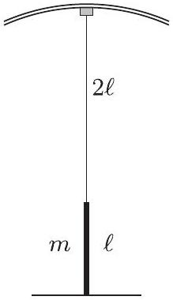
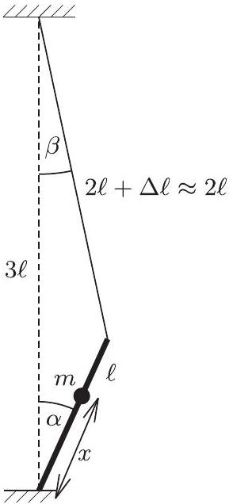
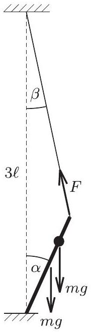
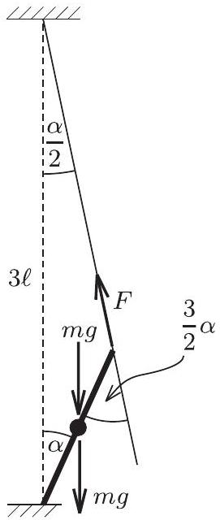

1. feladat. Egy cirkuszi egyensúlyozómữvész egy hosszú függóleges rúdra akar felmászni. A rúd hossza $\ell$, tömege $m$. A produkció kezdetekor a rudat az egyik végéhez erốsített, elhanyagolható súlyú rugalmas kötélen engedik le a cirkusz kupolájától. Amikor a rúd alja éppen a talajhoz ér, a kötél $2 \ell$ hosszú ( 1 . ábra). A kötél nyújtatlan hossza $\ell$, megnyúlása közben jól követi a Hooke-törvényt.

1. ábra

a) Milyen magasra mászhat fel a rúdra az ugyancsak $m$ tömegü artista anélkül, hogy a rúd függőleges egyensúlyi helyzete instabillá válna? (Az egyszerúség kedvéért tételezzük fel, hogy az artista mérete l-hez képest elhanyagolható.)
b) A rúd fele magasságánál az artista kicsit kibillen és a rúddal együtt oldalirányú lengésekbe kezd. Mekkora a lengés $T$ periódusideje? (A rúd alsó vége nem tud elmozdulni, de a rúd szabadon elfordulhat az alsó végpontja körül.)
(Balogh Péter)
Megoldás. Azoknak a versenyzőknek sikerült jól megoldaniuk ezt a feladatot, akik elég bátrak voltak, és már kezdetben figyelembe vették, hogy elegendő az artista kicsiny kibillenését vizsgálni. Ổk azután nem tévedtek el a tetszőleges szögekre érvényes, bonyolult összefüggések erdejében.

A 2. ábrán a hosszakat, a 3. ábrán az erőket ábrázoltuk az $\alpha$ szöggel kibillent rúd esetében. Ekkor a kötélnek a függőlegessel bezárt szöge $\beta$. Ha figyelembe vesszük, hogy kicsiny szögekről van szó, jó közelítéssel írhatjuk:

$$
\beta \approx \frac { \alpha } { 2 } .
$$

2. ábra

3. ábra

A kilendült rudat a rúdra és az artistára ható nehézségi eró tovább akarja lendíteni, a kötél rugalmassága pedig visszahúzza. A nehézségi erők forgatónyomatékának nagysága (a rúd alsó végpontjára):

$$
\begin{aligned}
M _ { 1 } & = m g \frac { \ell } { 2 } \sin \alpha + m g x \sin \alpha \approx \\
& \approx m g \left( \frac { \ell } { 2 } + x \right) \alpha ,
\end{aligned}
$$

a visszahúzó kötélerő forgatónyomatékának nagysága pedig

$$
M _ { 2 } = F \ell \sin ( \alpha + \beta ) \approx F \ell ( \alpha + \beta ) \approx F \ell \frac { 3 } { 2 } \alpha
$$

A stabilitás feltétele:

$$
M _ { 2 } > M _ { 1 } .
$$

Felhasználva, hogy kis szögekről van szó:

$$
F \ell \frac { 3 } { 2 } \alpha > m g \left( \frac { \ell } { 2 } + x \right) \alpha .
$$

Ha eltekintünk a kötél kicsiny, további megnyúlásától, $F$ továbbra is jó közelítéssel $m g$ nagyságú marad. ( $F$ kicsiny megváltozását az ugyancsak kicsiny $\alpha$-val szorozva másodrendűen kicsiny tagot kapunk, amit elhanyagolunk.) Ezt felhasználva a stabilitási feltétel:

$$
\begin{aligned}
m g \ell \frac { 3 } { 2 } \alpha & > m g \left( \frac { \ell } { 2 } + x \right) \alpha , \\
\frac { 3 } { 2 } \ell & > \frac { \ell } { 2 } + x , \\
x & < \ell .
\end{aligned}
$$

Tehát az artista felmászhat egészen a rúd tetejéig, amíg csak $x < \ell$ teljesül. Ezzel válaszoltunk az $a$ ) kérdésre, most foglalkozzunk a $b$ )-vel.

Tekintsük a 4. ábrát, amelyen már figyelembe vettük a $\beta \approx \frac { \alpha } { 2 }$ közelítést, mivel továbbra is kis szögkitérésü lengésekről lehet csak szó, továbbá azt, hogy most $x = \frac { \ell } { 2 }$. A visszatérítő forgatónyomaték:

$$
\begin{aligned}
M & = M _ { 2 } - M _ { 1 } = F \ell \frac { 3 } { 2 } \alpha - 2 m g \frac { \ell } { 2 } \alpha = \ell \alpha \left( \frac { 3 } { 2 } F - m g \right) = \\
& = \frac { 1 } { 2 } m g \ell \cdot \alpha
\end{aligned}
$$

4. ábra

Ez a visszatéró forgatónyomaték egyenesen arányos $\alpha$-val! Ebben az esetben harmonikus rezgés (lengés) jöhet létre, melynek periódusidejét az arányossági tényezőből olvashatjuk ki. A rúdból és az artistából álló rendszer teljes tehetetlenségi nyomatéka (a rúd legalsó pontjára vonatkoztatva):

$$
\Theta = \frac { 1 } { 3 } m \ell ^ { 2 } + m \left( \frac { \ell } { 2 } \right) ^ { 2 } = \frac { 7 } { 12 } m \ell ^ { 2 } .
$$

A harmonikus rezgőmozgásnál, ahol a visszahúzó erő nagysága $F = D x$, fennáll a következő összefüggés:

$$
\omega ^ { 2 } = \frac { D } { m } = \frac { F / x } { m } .
$$

Ezzel analóg módon a lengésekre (harmonikusan változó forgómozgásra)

$$
\omega ^ { 2 } = \frac { M / \alpha } { \Theta } = \frac { \frac { 1 } { 2 } m g \ell } { \frac { 7 } { 12 } m \ell ^ { 2 } } = \frac { 6 } { 7 } \frac { g } { \ell }
$$

érvényes. Ebbő́l a lengés periódusideje:

$$
T = 2 \pi \sqrt { \frac { 7 } { 6 } \frac { \ell } { g } } , \quad \text { mivel } \quad T = \frac { 2 \pi } { \omega } .
$$
