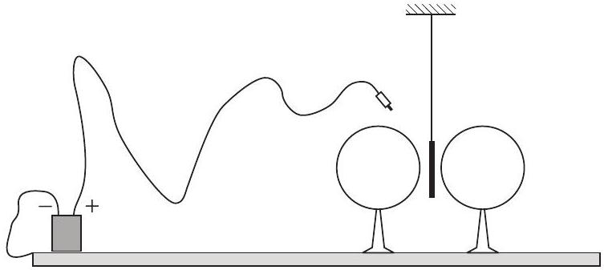

3. feladat. Egy fizikaszakkörön valaki demonstrálni szeretné, hogy ellentétes irányú elektromos térerősségvektorok leronthatják egymást. Elképzelése a következố. Szigetelố lábakon két egyforma fémgömböt állít egymás mellé és pontosan ugyanakkora potenciálra tölti fel óket. Ezután a kettejük közé középre belógatott próbatöltésre nem fog elektromos erö hatni.

A gyakorlati kivitelezéshez a kísérletezó egy néhány száz V feszültségü telep egyik sarkát „leföldeli”, vagyis az asztallapra tett nagy fémtálcához csatlakoztatja - ezt tekinthetjük zérus potenciálú helynek -, a másik pólushoz csatlakozó banándugóval pedig először a bal oldali, utána a jobb oldali gömböt, majd végül a szigetelő szálon közéjük lógatott alufólia csíkot érinti meg (5. ábra). Meglepốdve tapasztalja, hogy az alufólia igenis kitér a függőleges irányból, elmozdul az egyik gömb felé.

5. ábra

Mi lehet a kudarc magyarázata? (A levegó száraz, a lábak jól szigetelnek, a gömbök sokáig megtartják a rájuk vitt töltést.)

Melyik gömb felé tér ki az alufólia?
Hogyan lehetne a kudarcot elkerülni?
(Károlyházy Frigyes)
Megoldás. A feladat az 1992. évi Eötvös-verseny 3. problémájára emlékeztet, amelynek megoldása megtalálható „Az Eötvös-versenyek feladatai II. 1989-1997” c. Typotex kiadványban, és ma már az interneten is olvasható a Kempelen Farkas Digitális Tankönyvtárban. Két versenyző, akik később dicséretet kaptak, rá is talált az ott közölt megoldásra, melynek nyomán sikerült is megoldaniuk ezt a feladatot. Az Eötvös-versenyen bármely segédeszköz (könyvek, jegyzetek, zsebszámológép) használható (mobiltelefon és laptop kivételével), ezért megoldásukat természetesen elfogadta a Versenybizottság. Most viszont szándékosan más megoldást közlünk, olyat, amilyet az idei verseny győztesei adtak erre a feladatra.

Tekintsük először azt az esetet, amikor még csak a bal oldali gömböt töltöttük fel a telep feszültségére. Ekkor ez a gömb felvett valamennyi töltést. A jobb oldali gömb, ami ugyan töltetlen, most egy elektromos erőtérbe került, ennek hatására benne töltésszétválás történt és már nem zérus a feszültsége, hiába zérus a rajta lévő össztöltés.

Ezek után érintjük meg a jobb oldali gömböt a telep előbbi - pozitív - sarkából jövő vezetékkel. Ennek hatására ez a gömb is a telep feszültségére töltődik fel, viszont ehhez már kevesebb töltésnek kell felmennie rá, mint amennyi töltés a másik gömbre került! Söt, ha a második gömb feltöltése után megmérjük az első (a bal oldali) gömb feszültségét, az nagyobb lesz, mint a telep feszültsége, hiszen most már ez a gömb is erőtérbe, a jobb oldali gömb erőterébe került!

A helyzet annyira meglepó, hogy eredményhirdetéskor (technikai okokból egy 3000 V-os feszültségforrást használva) kísérletileg is bemutattuk. Amikor a bal oldali gömböt feltöltöttük 3000 V-ra, a jobb oldali gömbre kapcsolt elektrosztatikus voltmérő 800 V-ot mutatott. Amikor pedig a jobb oldali gömböt is feltöltöttük 3000 V-ra, a bal oldali gömb feszültsége 3800 V-ra nótt!

Mindenképpen több töltés került tehát a bal oldali gömbre, mint a jobb oldalira, ezért a közéjük középre lógatott és feltöltött alufólia csíkra a bal oldali gömb nagyobb taszítóerőt gyakorol, mint a másik gömb. A fóliacsík tehát jobbra fog kilendülni!

Az egyik győztes versenyző (Almási Gábor) még azt is megjegyezte, hogy ha túl közel van egymáshoz a két gömb, akkor a közéjük lógatott fémfólián már töltetlen állapotban is a két gömb potenciálja közötti, tehát a telepfeszültségnél nagyobb potenciál alakulhat ki. Ezért, amikor hozzáérünk a telepbő́l jövő vezetékkel, lehet, hogy leveszünk róla töltést, így áll be a fólia a telep feszültségére. Ebben az esetben azonban negatív töltése lesz, s a bal oldali gömb jobban fogja vonzani, mint a jobb oldali, vagyis ilyenkor a fólia balra lendül ki.

Hogyan lehetne elkerülni a kudarcot? Több mód is van rá. A legbiztosabb eljárás az, hogy egyszerre töltjük fel a két gömböt, de az is elég, ha kellő távolságra, viszonylag messze helyezzük őket egymástól. Igaz, ebben az esetben nem olyan látványos az a kísérlet, hogy közöttük középen nem hat erő a belógatott fóliára.

## A verseny eredménye

Két versenyzőnek sikerült mindhárom feladatot hibátlanul megoldania, ezért két első díjat adott ki a Versenybizottság.
I. díj: Almási Gábor, az ELTE fizika BSc szakos hallgatója, aki a pécsi Leóvey Klára Gimnáziumban érettségizett Simon Péter és Kotek László tanítványaként; és Szolnoki Lénárd, a BME fizika BSc szakos hallgatója, aki a Debreceni Református Kollégium Dóczy Gimnáziumában érettségizett Tófalusi Péter tanítványaként.
II. díj: Balogh Máté, a Fazekas Mihály Fővárosi Gyakorló Gimnázium 12. évf. tanulója, Horváth Gábor tanítványa; és Lovas Lia Izabella, a pécsi Leốvey Klára Gimnázium 12. évf. tanulója, Simon Péter tanítványa.
III. díj: Farkas Márton, a Fazekas Mihály Fővárosi Gyakorló Gimnázium 12. évf. tanulója, Horváth Gábor tanítványa.

Dicséretet kaptak: Aczél Gergely, a Pápai Református Kollégium Gimnáziumának 12. évf. tanulója, Somosi István tanítványa; Iván Dávid, a fonyódi Mátyás Király Gimnázium 12. évf. tanulója, Németh László tanítványa; Karsa Anita, a Fazekas Mihály Fóvárosi Gyakorló Gimnázium 12. évf. tanulója, Horváth Gábor tanítványa; Szilágyi Zsombor, az ELTE fizika BSc szakos hallgatója, aki a budapesti Karinthy Frigyes Gimnáziumban érettségizett Szilágyi

László tanítványaként; és Wang Daqian, a Fazekas Mihály Fóvárosi Gyakorló Gimnázium 11. évf. tanulója, Horváth Gábor tanítványa.
2008. november 21-én zajlott le az ünnepélyes eredményhirdetés. Először a Versenybizottság elnöke ismertette az 50, valamint a 25 évvel korábbi Eötvös-verseny feladatait, majd bemutatta az akkori díjazottak közül megjelent egykori versenyzőket.

Kovács Béla villamosmérnök, informatikus, aki 1958-ban érettségizett Sárospatakon, ma is gyakori látogatója egykori iskolájának. Ốt is, mint az utána megszólaló, 25 évvel fiatalabb nyerteseket ez a verseny indította el életpályájukon. Árkossy Ottó orvos, Fodor Gyula és Frei Zsolt fizikusok lettek. Erdős László, aki Árkossy Ottóval holtversenyben lett első, matematikus lett. Jelenleg Münchenben dolgozik, onnan küldött üdvözletét Honyek Gyula olvasta fel.

A 25 évvel ezelőtt díjazott versenyzők mind a KöMaL sikeres megoldói voltak, az akkori fotóikból készített tabló nagy tetszést aratott. Meghívást kaptak az ünnepélyes eredményhirdetésre a díjazott és dicséretet kapott diákok tanárai, az Eötvös Loránd Fizikai Társulat minden tisztségviselője, valamint az Eötvös-versenyek nyertesei. Sokan eljöttek, néhányan levelet írtak, melyben üdvözölték az idei nyerteseket.

A díjakat és okleveleket Sólyom Jenő́, az Eötvös Loránd Fizikai Társulat elnöke adta át. A két első díjas megkapta a Társulat Eötvös-verseny érmét és egyéves előfizetést a Fizikai Szemlére. Ezen kívül az első díjasok 20-20 ezer Ft, a második díjasok 15-15 ezer Ft, a harmadik díjas versenyző 10 ezer Ft, a dicséretes versenyzők pedig 5-5 ezer Ft pénzjutalomban részesültek, és mind a tízen megkapták Staar Gyula „Fizikusok az aranykorból” c. könyvét.

A nyertes diákok megjelent tanárai a Vince és a Typotex kiadók által felajánlott könyvekből válogathattak.
A díjkiosztás után a Versenybizottság elnöke értékelte az idei versenyt, majd állófogadással egybekötött beszélgetésre invitálta a résztvevóket, megköszönve a Matfund Alapítvány, az Indotek Zrt., a Ramasoft Zrt. és Gutai László (USA) anyagi támogatását, amely nélkül nem lehetett volna megrendezni ezt az ünnepélyes eredményhirdetést és meleg kézszorításon kívül nem lehetett volna mással honorálni a versenyzők és tanáraik szép teljesítményét.

Ehhez csatlakozik a Versenybizottság is. Bízzunk a lendület megmaradásában . . .
