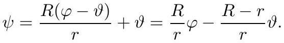
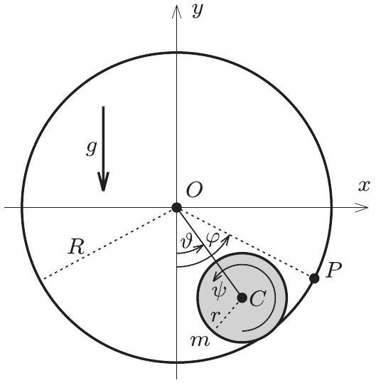
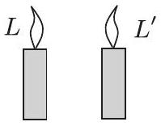
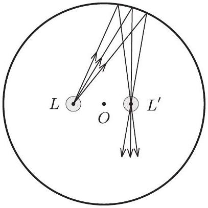
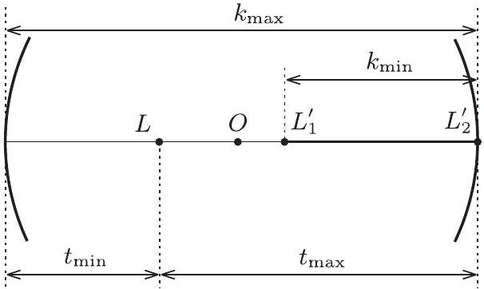
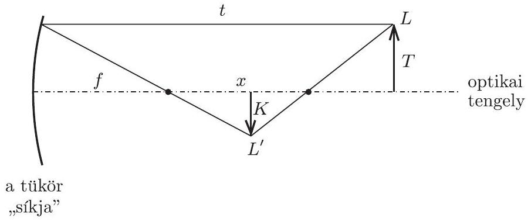
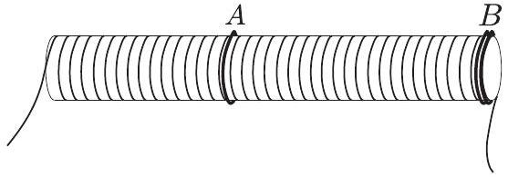

2009. október 16-án délután 3 órai kezdettel került sor a háború utáni 61. Eötvös-versenyre Budapesten és 15 vidéki városban. Budapesten 50 , vidéken összesen 43 dolgozatot adtak be a versenyzők. Egerben, Sopronban és Székesfehérváron sajnos egyetlen diák sem indult a versenyen, de Békéscsabán, Kecskeméten, Nyíregyházán és Szombathelyen is csupán 1-1 dolgozat született. A vidéki egyetemi városok közül Pécsett 8, Szegeden és Miskolcon 6-6, Debrecenben 4, Veszprémben 3, Győrben pedig 2 versenyző adott be dolgozatot. Közülük összesen hatan voltak egyetemisták, míg Budapestról a versenyzők mintegy fele érettségizett 2009-ben, 22-en a BME elsóéves hallgatói voltak.

A feladatokat az Eötvös-versenybizottság tüzte ki (tagjai Gnädig Péter, Honyek Gyula, Károlyházy Frigyes, elnök Radnai Gyula) és a versenyzők megoldásait is ugyanez a bizottság értékelte. A három kitúzött feladat megoldására hagyományosan 300 perc állt rendelkezésre.

Ismertetjük a feladatokat és azok megoldását.

1. feladat. $R$ sugarú, vékonyfalú plexigömb érdesített belsejében csúszásmentesen gördülve mozoghat egy r sugarú, tömör gumigolyó. A gömb a középpontján átmenó, vízszintes, rögzített tengely körül forgatható.
a) Mekkora periódusidejú, kis amplitúdójú mozgást végezhet a golyó a gömbben, ha a gömb áll, vagy ha a gömb egyenletesen forog? Hogyan fog mozogni a kezdetben nyugvó golyó abban a kísérletben, amikor a gömböt állandó, $g / R$ hez képest kicsiny szöggyorsulással egyre gyorsabban forgatjuk?
b) Ha a gömböt gyors forgásba hozzuk, majd hirtelen megállítjuk, a gömb alján addig egyhelyben forgó golyó igen rövid idő múlva ismét tisztán gördül, és felgurulhat akár a gömb tetejéig is. Legalább mekkora szögsebességgel kell forgatnunk ehhez a gömböt?

A golyó tömegközéppontja minden esetben függőleges síkban mozog.
(Honyek Gyula)

Megoldás. a) A megoldást érdemes az egyenletesen gyorsuló gömb esetével kezdenünk (hiszen ez speciális esetként tartalmazza az egyenletesen forgó és az álló gömb esetét is).

Tegyük fel, hogy a gömb $P$ pontja $\varphi$ szöggel fordul el a kiindulási, legalsó helyzetből (1. ábra). Eközben a golyó tiszta gördüléssel mozog, és a golyó $C$ középpontja $\vartheta$ szöggel fordul el. A golyónak a gömb egyes felületi pontjaihoz képesti összes elfordulása:

$$
\frac { R ( \varphi - \vartheta ) } { r } .
$$

A golyó teljes $\psi$ elfordulását úgy kaphatjuk meg, ha a gömb felszínéhez képesti elforduláshoz hozzáadjuk még a golyó $C$ középpontjának elfordulását is:

1. ábra

Jelöljük a plexigömb (állandó) szöggyorsulását $\beta$-val, a golyó tömegközéppontjának érintő irányú gyorsulás-összetevőjét $a$-val, a golyó saját középpontja körüli szöggyorsulását pedig $\beta _ { \text {golyó-val. } }$ Mivel a szögelfordulások és a szöggyorsulások (egy bizonyos rövid időtartam alatt) arányosak egymással, az (1) összefüggésből leolvasható a szöggyorsulásokra vonatkozó megszorítás, tehát a mozgás kényszerfeltétele is:

$$
\begin{equation*}
\beta _ { \text {golyó } } = \frac { R } { r } \beta - \frac { R - r } { r } \cdot \frac { a } { R - r } . \tag{2}
\end{equation*}
$$

Megjegyzés: (2)-t átrendezve $R \beta = a + r \beta _ { \text {golyó } }$ alakra hozhatjuk, ami azt fejezi ki, hogy a gömb felszínének érintóleges gyorsulása a golyó tömegközépponti és kerületi gyorsulásának összege. Kényszerfeltételek felírásában gyakorlottak ezt a kapcsolatot számolás nélkül, ránézésre is fel tudják írni.

A golyóra ható súrlódási erốt jelöljük $S$-sel, a golyó tömegközéppontjának szöggyorsulását pedig $\beta _ { \mathrm { t } }$-vel! Ez utóbbi nyilván kifejezhető a tömegközéppont érintőleges gyorsulásával:

$$
\begin{equation*}
\beta _ { \mathrm { t } } = \frac { a } { R - r } . \tag{3}
\end{equation*}
$$

A dinamikai egyenletek:

$$
\begin{gather*}
S - m g \sin \vartheta = m a = m ( R - r ) \beta _ { \mathrm { t } } ,  \tag{4}\\
S r = \frac { 2 } { 5 } m r ^ { 2 } \beta _ { \text {golyó } } . \tag{5}
\end{gather*}
$$

A (2)-(5) egyenletrendszerből kiküszöbölve az $S$, $a$ és $\beta _ { \text {golyó } }$ mennyiségeket, a golyó tömegközéppontjának szögkitérése és szöggyorsulása között a következő összefüggést kapjuk:

$$
\begin{equation*}
\beta _ { \mathrm { t } } = - \frac { 5 g } { 7 ( R - r ) } \left( \sin \vartheta - \frac { 2 R \beta } { 5 g } \right) . \tag{6}
\end{equation*}
$$

Innen leolvashatjuk, hogy általában létezik egy olyan

$$
\vartheta _ { 0 } = \arcsin \frac { 2 R \beta } { 5 g }
$$

szög, amelynek megfelelő helyzetben a golyó tömegközéppontja egyensúlyban van.
Megjegyzés: Ha ebből a helyzetből indítjuk a golyót, akkor a tömegközéppontja nyugalomban marad, a tömegközéppont körüli forgásának szögsebessége pedig (a csúszásmentes gördülés feltételének megfelelően)

$$
\omega _ { \text {golyó } } = \frac { R } { r } \cdot \beta t
$$

módon növekszik. Ehhez a megfelelóen nagy súrlódáson kívül a szöggyorsulás se lehet akármilyen nagy.
Mivel a feladat szövegében az szerepel, hogy a $\beta$ szöggyorsulás értéke kicsi, ezért jogos feltennünk, hogy a golyó tömegközéppontjának maximális elmozdulása is kicsi, vagyis indokolt a $\sin \vartheta \approx \vartheta$ közelítés használata. A (6) mozgásegyenlet ebben a közelítésben a

$$
\beta _ { \mathrm { t } } = - \frac { 5 g } { 7 ( R - r ) } \left( \vartheta - \frac { 2 R \beta } { 5 g } \right) = - \Omega ^ { 2 } \cdot \left( \vartheta - \vartheta _ { 0 } \right)
$$

alakú, amelybő́l látszik, hogy a golyó tömegközéppontja jó közelítéssel harmonikus rezgőmozgást végez a $\vartheta _ { 0 }$ szöghelyzet körül, és a rezgésideje:

$$
\begin{equation*}
T = \frac { 2 \pi } { \Omega } = 2 \pi \sqrt { \frac { 7 ( R - r ) } { 5 g } } . \tag{7}
\end{equation*}
$$

A rezgőmozgás szög-amplitúdója (mivel $\vartheta = 0$ helyzetbő́l indult a golyó) jó közelítéssel $\vartheta _ { 0 }$. Meglepő, hogy a rezgésidő akkor is a (7)-nek megfelelő érték, ha a gömb szöggyorsulása nulla, a gömb egyenletesen forog vagy áll, vagyis $a$ ) mindhárom kérdésére ugyanaz a válasz.
b) Legyen a plexigömb kezdeti állandó szögsebessége $\omega _ { \text {gömb } }$. A tiszta gördülés miatt a gumigolyó ugyanabba az irányba forog, és a golyó szögsebessége:

$$
\omega _ { \text {golyó } } = \frac { R } { r } \omega _ { \text {gömb } } .
$$

(Ezt pl. (1)-ból olvashatjuk le, $\vartheta \equiv 0$ helyettesítéssel.)
A plexigömb megállításának pillanatában változó nagyságú $F _ { \mathrm { s } } ( t )$ súrlódási erố kezd hatni a golyóra, ami valamekkora $\Delta t$ idő alatt tiszta gördülést eredményez. A súrlódási erő (melynek átlagértékét jelöljük $\bar { F }$-sal) a golyó tömegközéppontjának valamekkora $v _ { 0 }$ sebességet ad, míg a golyó szögsebességét $\omega _ { 0 }$ értékre csökkenti. A tiszta gördülési feltétel miatt: $v _ { 0 } = r \omega _ { 0 }$.

Írjuk fel a súrlódási erő sebességet, illetve szögsebességet változtató hatását kifejező dinamikai egyenleteket:

$$
\begin{gathered}
\bar { F } \Delta t = m v _ { 0 } = m r \omega _ { 0 } , \\
r \bar { F } \Delta t = \Theta \cdot \Delta \omega = \frac { 2 } { 5 } m r ^ { 2 } \cdot \left( \omega _ { \text {golyó } } - \omega _ { 0 } \right) = \frac { 2 } { 5 } m r ^ { 2 } \cdot \left( \frac { R } { r } \omega _ { \text {gömb } } - \omega _ { 0 } \right) .
\end{gathered}
$$

A fenti egyenletekből $\bar { F } \Delta t$-t kiküszöbölve a tisztán gördülő golyó adataira

$$
\begin{equation*}
\omega _ { 0 } = \frac { 2 R } { 7 r } \omega _ { \text {gömb } } \quad \text { és } \quad v _ { 0 } = \frac { 2 R } { 7 } \omega _ { \text {gömb } } \tag{8}
\end{equation*}
$$

adódik. Mivel ez az állapot (a plexigömb érdes felülete miatt) a gömb megállítása után igen rövid idővel bekövetkezik, feltehetjük, hogy az újra tiszta gördüléssel mozgó golyó lényegében a gömb legalján marad, elmozdulása a megcsúszás közben elhanyagolható.

Megjegyzés: Ugyanerre az eredményre juthatunk akkor is, ha a gömb megállítását követő rövid időre a golyó alatti felületet vízszintes, igen érdes síknak tekintjük. A rövid ideig ható súrlódási „erőlökés" megváltoztatja a golyó mechanikai energiáját és lendületét, de nem változtatja meg a golyónak a gömbbel érintkező pontjára vonatkoztatott perdületét:

$$
\frac { 2 } { 5 } m r ^ { 2 } \cdot \omega _ { \text {golyó } } = \frac { 2 } { 5 } m r ^ { 2 } \cdot \omega _ { 0 } + m v _ { 0 } \cdot r .
$$

Ez a feltétel $v _ { 0 } = r \omega _ { 0 }$ és $r \omega _ { \text {golyó } } = R \omega _ { \text {gömb } }$ miatt $( 8 )$-cal egyenértékú.
A golyó további (tisztán gördülő) mozgása során felhasználhatjuk az energiamegmaradás törvényét, és felírjuk a tömegközéppontra vonatkozó mozgásegyenletet a golyó pályájának bármelyik, például a legfelsó pontjára is:

$$
\begin{gathered}
m g - K = m \frac { v _ { 1 } ^ { 2 } } { R - r } , \\
\frac { 1 } { 2 } m v _ { 0 } ^ { 2 } + \frac { 1 } { 2 } \Theta \omega _ { 0 } ^ { 2 } = m g \cdot 2 ( R - r ) + \frac { 1 } { 2 } m v _ { 1 } ^ { 2 } + \frac { 1 } { 2 } \Theta \omega _ { 1 } ^ { 2 } ,
\end{gathered}
$$

ahol $v _ { 1 }$ és $\omega _ { 1 }$ a golyó sebessége, illetve szögsebessége a pálya legfelső́ pontjában $\left( v _ { 1 } = r \omega _ { 1 } \right) , K$ pedig a golyó és a plexigömb között fellépő nyomóerőt jelöli ebben a helyzetben.

A megfelelő mennyiségek behelyettesítése után a kényszererőt így fejezhetjük ki a plexigömb kezdeti szögsebességével:

$$
K = \frac { 4 } { 49 } \frac { m R ^ { 2 } \omega _ { \text {gömb } } ^ { 2 } } { R - r } - \frac { 27 } { 7 } m g .
$$

A gumigolyó akkor juthat fel a legfelső pontba, ha a $K$ kényszererő még a pálya legfelső pontjában sem negatív $( K \geq 0 )$, ami a következő feltételt adja a gömb kezdeti szögsebességére:

$$
\omega _ { \text {gömb } } \geq \frac { 3 } { 2 R } \sqrt { 21 ( R - r ) g } .
$$

2. feladat. Kör alakú asztal közepén áll egy nagyon vékony falú, hengeres üvegváza, amelyben egy gyertya ég. A henger átméróje 12 cm , tengelye függóleges, a láng közepe 2 cm -re van a váza tengelyétól.

Laci oldalról, a lánggal azonos magasságból nézi a vázát, és felfigyel arra, hogy a láng mellett a lángnak egy éles, határozott tükörképe is látszik a váza belsejében. Az asztalt körbejárva megállapítja, hogy a láng képének a szélessége és a vázához viszonyított helye folyamatosan változik.

a) Milyen irányból nézve látszik a láng képe ugyanolyan szélesnek, mint maga a láng?
b) Milyen pályán mozog a láng képének a közepe, miközben Laci körbejárja az asztalt?

A hengertükör leképezésére alkalmazhatjuk a gömbtükörre érvényes leképezési törvényt.
(Radnai Gyula)

Megoldás. A feladatot abban a középiskolai közelítésben oldjuk meg, amire a befejező mondat hatalmaz fel bennünket: alkalmazhatjuk a gömbtükörre érvényes leképezési törvényt. Tudjuk, hogy ez szigorúan véve csak az optikai tengellyel közel párhuzamos, ún. „paraxiális” sugarakkal történő leképezésre igaz, de a középiskolában - és a mindennapi gyakorlatban - számos esetben alkalmazzuk olyankor is, amikor a leképező sugarak akár 20°-os szögben hajlanak az optikai tengelyhez. A leképezési törvénynek erre az esetre módosított, de a középiskolában nem tanított alakját megtalálhatja az érdeklődő Olvasó lapunk 174. oldalán a „Lehet egy közelítéssel kevesebb?" címú cikkben.

Mindenekelőtt azt kell észrevennünk, hogy a láng képe a leírt kísérletben mindig valódi kép lesz, ami valahol a tükröző felület előtt, nem pedig mögötte keletkezik. (Most ugyanis a tárgytávolság legalább 4 cm , míg a fókusztávolság - a sugár fele -3 cm.) E valódi kép helye azonban attól függ, honnan nézünk rá a vázára. A láng képe mindig ugyanolyan magas, mint maga a láng, mert függőlegesen a hengertükör se nem nagyít, se nem kicsinyít.

A láng képének szélessége persze nagyobb és kisebb is lehet, mint maga a láng. Egyenlő vele csak akkor, amikor a láng éppen a kétszeres fókusztávolságban helyezkedik el, ekkor a nagyítás egységnyi. A kép fordított állású, a váza tengelyétól tehát ugyanúgy 2 cm-re keletkezik, mint ahol a láng van, éppen csak a másik oldalon.

Máris válaszolhatunk az $a$ ) kérdésre: olyan irányból kell nézni a vázára, hogy az egységnyi nagyítású, valódi képet létrehozó sugarak jussanak a megfigyelő szemébe. Feltételezve, hogy a hengertükör viszonylag nagy nyílásszögben is tökéletes leképezést valósít meg - ahogy ezt a gömbtükröknél a középiskolában feltételezzük -, a képet és a tárgyat

összekötő egyenesre (függőleges síkra) merőleges irányból is nézhetjük a jelenséget (2. ábra). Innen nézve, éppen egymás mellett látjuk a lángot $( L )$ és annak (vízszintes irányban fordított, függőleges irányban egyenes állású) valódi képét $\left( L ^ { \prime } \right)$.

„oldalnézet”

„felülnézet”

2. ábra

A b) kérdés megválaszolásához elég arra gondolnunk, hogy a gömbtükör esetén minden olyan fénysugár, amely a gömb középpontján halad át, önmagába verődik vissza. Akárhol is van a tárgypont, a belőle kiinduló olyan fénysugár, amelyik (vagy amelyiknek a meghosszabbítása) áthalad a gömb középpontján, önmagába verődik vissza, majd áthalad a valódi képponton. Tehát a tárgypontnak, a gömb középpontjának és a képpontnak egy egyenesbe kell esnie!

Hengertükörre alkalmazva ezt a gondolatmenetet, azt mondhatjuk, hogy az $L$ tárgy $L ^ { \prime }$ képének mindig rajta kell lennie az $L$ tárgypontot és az itteni $O$ pontot összekötő egyenesen. Ez az $O$ pont a henger tengelyének az a pontja, amelyik benne van a tárgyponton átmenő vízszintes síkban. Minthogy $O$ és $L$ pontok a feladatban rögzítettek, ezért $L ^ { \prime }$-nek végig ugyanazon az egyenes szakaszon kell mozognia. A szakasz két végpontját az a két tárgyhelyzet határozza meg, amikor a láng a legközelebb, illetve legtávolabb van a tükörtől. Esetünkben

$$
\begin{array} { r l l }
r = 6 \mathrm {~cm} & \Rightarrow & f = 3 \mathrm {~cm} ; \\
t _ { \min } = 4 \mathrm {~cm} & \Rightarrow & k _ { \max } = 12 \mathrm {~cm} ; \\
t _ { \max } = 8 \mathrm {~cm} & \Rightarrow & k _ { \min } = 4,8 \mathrm {~cm} .
\end{array}
$$

Az $L ^ { \prime }$ képnek a 3. ábrán látható $L _ { 1 } ^ { \prime } L _ { 2 } ^ { \prime }$ szakaszon kell lennie.

3. ábra

Érdemes megjegyezni, hogy a homorú gömbtükörnek a középiskolában tárgyalt lineáris leképezése esetén a tárgyés képpontot összekötő egyenes szükségképpen átmegy az optikai tengelynek azon pontján, ami a tükörtól kétszeres fókusztávolságra van. Ez például a 4. ábrán látható hasonló háromszögek segitségével látható be:

$$
\frac { x } { t } = \frac { K } { T + K } = \frac { k } { t + k } ,
$$

tehát

$$
x = \frac { t k } { t + k } = \frac { 1 } { \frac { 1 } { t } + \frac { 1 } { k } } = f .
$$

4. ábra

Ha az $\frac { 1 } { t } + \frac { 1 } { k } = \frac { 1 } { f }$ összefüggés helyett egy pontosabb közelítést alkalmazunk, amely már nemcsak a paraxiális sugarak - lineáris - képalkotását veszi figyelembe, akkor lehetővé válik a gömbi leképezés hibájának, az ún. szférikus aberrációnak a kvantitatív tárgyalása is.
3. feladat. Egy hosszú, keskeny szolenoidban egyenáramot tartunk fenn. Legyen például a tekercs hosszúsága $\ell =$ 60 cm, sugara $r = 2 \mathrm {~cm}$, menetszáma $N = 600$, az áramerősség $I _ { 0 } = 1 \mathrm {~mA}$.

A tekercset a közepe táján hézagmentesen körülvesszük egy egyszerü, zárt vezetö hurokkal (A), és egy ugyanekkora átmérójǘ, de kettốs hurkot (zárt, „kétmenetes tekercset”) (B) helyezünk el a tekercs szájánál is, az 5. ábra szerint. A és $B$ olyan anyagból készült, amely viszonylag könnyen szupravezetóvé tehetố, ohmikus ellenállása kellôképpen alacsony hốmérsékleten zérussá válik.

5. ábra

Kezdetben természetesen nem folyik áram $A$-ban és $B$-ben. De most lehütjük, szupravezetốvé tesszük óket, majd a szoleniod áramkörét megszakítjuk. Ekkor (mivel a mágneses fluxus, amely egy zárt szupravezetó áramkörön halad át, nem változhat meg) az $A$ hurokban valamekkora $I _ { A }$, a kettós hurokban $I _ { B }$ áram indukálódik, amely fenn is marad.

1. Hasonlítsa össze $I _ { A }$ és $I _ { B }$ nagyságát! Közelítốleg egyenlők-e, és ha nem, melyik nagyobb a másiknál és hányszor?
2. A szolenoidra vonatkozó adatok ismeretében adjon valamilyen ésszerũ becslést $I _ { A }$ értékére!
(Károlyházy Frigyes)

Megoldás. Az első kérdésre viszonylag könnyen válaszolhatunk, ha felismerjük, hogy amikor állandó erősségú áram folyik a szolenoidban, akkor a tekercs szájánál fele akkora mágneses fluxus alakul ki, mint a tekercs közepe táján. (Ennek legegyszerúbb igazolásához úgy juthatunk, hogy gondolatban hozzáillesztünk a szolenoidhoz egy ugyanolyan másikat. Azon a helyen, ahol a két tekercs találkozik, mindkét tekercsnek a szimmetriatengely irányában $B / 2$ nagyságú mágneses indukcióvektor-komponest kell létrehoznia ahhoz, hogy kialakuljon a tekercs belsejére jellemző, $B$ nagyságú indukcióvektor.)

A fele nagyságú mágneses fluxust két menettel kell létrehozni a tekercs végén, vagyis egy menetben itt negyedakkora áram is elég, mint amire a tekercs közepe táján lévő egyetlen menetben van szükség.

A feladat második kérdése az $A$ hurokban folyó $I _ { A }$ áram nagyságára vonatkozik. Egy körvezetőben folyó $I$ áram a körvezető középpontjában

$$
B = \mu _ { 0 } \frac { I } { 2 r }
$$

nagyságú mágneses teret hoz létre. Első közelítésben tegyük fel, hogy ez éppen akkora, mint amekkorát a szolenoidban folyó $I _ { 0 }$ áram hozott létre:

$$
B = \mu _ { 0 } \frac { I _ { 0 } N } { \ell } .
$$

Ebben a közelítésben tehát

$$
I = 2 r \frac { I _ { 0 } N } { \ell } .
$$

Behelyettesítve a megadott értékeket, a tekercs közepe táján levő hurokban indukálódó áramra $I = I _ { A } = 40 \mathrm {~mA}$ adódik. Figyelembe véve azonban azt, hogy a körvezető közepén a legkisebb a mágneses indukció értéke, vagyis a körlap pontjaira vonatkozó „átlagos" indukció ennél biztosan nagyobb, a 40 mA-nél biztosan kisebb áram indukálódik a szupravezető hurokban.

Felhasználva például a körvezető induktivitására a szakirodalomban található

$$
L = \mu _ { 0 } r \ln \frac { r } { r _ { \text {drót } } }
$$

közelítő képletet (és feltételezve, hogy mondjuk $r _ { \text {drót } } = r / 50$ ), a körvezetőben indukálódó áramra a fluxus változatlanságát kifejező

$$
\mu _ { 0 } \frac { I _ { 0 } N } { \ell } \cdot \left( r ^ { 2 } \pi \right) = L I _ { A }
$$

összefüggésből $I _ { A } = 16 \mathrm {~mA}$ adódik.
Megjegyzések: 1. A drót vastagságára vonatkozó adat nem szerepelt a feladat szövegében, de az eredmény - ésszerü határok között - nem is függ lényegesen ettől az adattól. Ha például a drót sugara $r / 10$ vagy $r / 100$, az indukálódó áramerősségre 27 mA , illetve 13 mA értékeket kapunk.
2. $I _ { A }$-ra a következő egyszerú megfontolással is adhatunk nagyságrendi becslést. A szolenoid közepe táján az átmenő fluxust nagyon sok menetben folyó áram együttes hatása hozza létre. A vizsgált helyen levő egyetlen menet (mint körvezető) fluxusa annyiszor kisebb az egymenetes szupravezető fluxusánál, ahányszor kisebb az $I$ áram $I _ { A }$-nál. Gyakorlatilag ugyanekkora fluxust hoz létre a szolenoid kiszemelt menete melletti egy-egy „körvezető“ menet is. A távolabbi (néhány $r$-nyi távolságnál jóval messzebb levő) menetek azonban már egyre kevésbé járulnak hozzá a középső rész fluxusához, hiszen a mágneses terük „szétszóródik”, eróvonalaiknak csak kis része halad át a kiszemelt körlapon. A szolenoid néhányszor (mondjuk 1 vagy 2-szer) $r$ hosszúságú szakaszán kb. 20-40 menet található. Ezek mágneses fluxusa akkor lesz ugyanakkora, mint az egyetlen szupravezető köráram fluxusa, ha $I _ { A }$ 20-40-szer erősebb, mint a szolenoid 1 mA-es árama.

A verseny ünnepélyes eredményhirdetésére és a díjak kiosztására 2009. november 27-én délután került sor az ELTE lágymányosi északi épületének konferenciatermében.

Mint az elmúlt években mindig, most is először az 50 és a 25 évvel ezelőtti Eötvös-verseny feladatok bemutatására került sor, majd e versenyek meghívott díjazottjai szólaltak meg, emlékeztek vissza az akkori versenyre.

Magos András 50 évvel ezelốtt érettségizett a budapesti II. Rákóczi Ferenc Gimnáziumban, Tusnády Gábor pedig a sátoraljaújhelyi Kossuth Lajos Gimnáziumban. Magos András villamosmérnök, majd a BME oktatója lett, Tusnády Gábor matematika-fizika szakos tanárként indult és matematikus lett. Ma már akadémikus, a Rényi Alfréd Matematikai Kutatóintézetben dolgozik. Mindketten hangsúlyozták a problémaérzékenység fontosságát az értelmiségi, kutatói pályán.

A 25 évvel ezelőtti nyertesek közül először Kós Géza szólalt meg és idézte fel az akkori feladatokra adott megoldásait. Matematikai érdeklődése és találékonysága segítette az általa még nem tanult tematikájú feladatok helyes megoldásához. Szükség is volt erre, hiszen még csak a III. osztályt kezdte el akkor Budapesten, a Berzsenyi Dániel Gimnáziumban. Utána Fáth Gábor, akkor a budapesti Fazekas Mihály Gyakorló Gimnázium érettségizett tanulója, majd Fodor Gyula következett, aki akkor a budapesti Móricz Zsigmond Gimnáziumot elvégezve kezdte meg az ELTE-n fizikusi tanulmányait. Fáth Gábor elmesélte, hogyan sikerült szabadságot kapnia a honvédségtől, ahol egyéves kötelező katonai szolgálatát töltötte. (A mai fiatalok már nem is ismerik az „előfelvételi” rendszer megpróbáltatásait.) Fodor Gyula a fizikusi kutatómunka vonzásában éli életét, Fáth Gábor pályát változtatott és gazdasági matematikával keresi kenyerét. Kós Géza is matematikusként dolgozik, emellett a KöMaL matematikai szerkesztőbizottságának a nehéz feladatokért felelős tagja, aki ma is szívesen foglalkozik egy-egy izgalmasabb fizikai problémával.

Mialatt a hallgatóság figyelmét a régi diákok visszaemlékezései kötötték le, a hátuk mögött kivetítve jelentek meg az egykori fényképeik a KöMaL archívumából. Az elmúlt 50 évben, amióta csak újra szerepelnek fizika feladatok a KöMaL-ban, egyszer se fordult elő, hogy az Eötvös-verseny díjazottai között ne lettek volna olyan diákok, akik a KöMaL sikeres megoldói voltak.

Ezután következtek a 2009. évi Eötvös-verseny feladatok. A megoldásokat a Versenybizottság elnöke mutatta be, aki a 2. feladat megoldásával kapcsolatos többféle kísérletet is előkészített az asztalon. Volt egy 12 cm átmérőjú és több kisebb hengeres üvegváza; jól lehetett látni a bennük égő gyertyalángok valódi képeit.

A Csodák Palotájából kölcsönzött kettős tükörrel szintén valódi képet lehetett varázsolni a levegőbe. A hátsó padokon állt egy gyönyörú nagy homorú tükör az egyetemi demonstrációs laboratóriumból, amellyel pedig virágcsokrot lehetett varázsolni egy vázába. Ez utóbbi két kísérlet azt illusztrálta, hogyan lehet három dimenziós, a tárgyhoz megtévesztésig hasonló valódi képeket előállítani.

Ezután került sor a díjak és a dicséretek átadására. Az Eötvös Loránd Fizikai Társulat elnöke nevében Kádár György fötitkár adta át az okleveleket, a Versenybizottság elnöke pedig a szponzorok által felajánlott pénzjutalmakat.
I. díjat és 30 ezer forint pénzjutalmat vehetett át Lovas Lia Izabella, a BME fizika szakos hallgatója, aki a pécsi Leốwey Klára Gimnáziumban érettségizett mint Simon Péter és Kotek László tanítványa.

Összevont II. és III. díjat és 15-15 ezer forintos pénzjutalmat kapott a következő három versenyző: Karsa Anita, a BME fizika szakos hallgatója, aki a Fazekas Mihály Fővárosi Gyakorló Gimnáziumban érettségizett mint Horváth Gábor tanítványa; Pálovics Péter, a zalaegerszegi Zrínyi Miklós Gimnázium 12. évf. tanulója, Orbán Edit tanítványa; Varga Ádám, a szegedi Ságvári Endre Gyakorló Gimnázium 11. évf. tanulója, Tóth Károly és Hilbert Margit tanítványa.

Dicséretet kaptak: Aczél Gergely, a BME fizika szakos hallgatója, aki a Pápai Református Kollégium Gimnáziumában érettségizett mint Somosi István tanítványa; Farkas Márton Bence, a BME fizika szakos hallgatója, aki a Fazekas Mihály Fốvárosi Gyakorló Gimnáziumban érettségizett mint Horváth Gábor tanítványa; Fülep Csilla, a Fazekas Mihály Fóvárosi Gyakorló Gimnázium 12. évf. tanulója, Horváth Gábor tanítványa; Lászlóffy András, a Pázmány P. Kat. Egyetem mérnök informatikus szakos hallgatója, aki a budapesti Piarista Gimnáziumban érettségizett Futó Béla tanítványaként; Wang Daqian, a Fazekas Mihály Fóvárosi Gyakorló Gimnázium 12. évf. tanulója, Horváth Gábor tanítványa.

Az I. díjas Lovas Lia Izabella a Társulattól Eötvös-verseny érmet, az Akadémiai Kiadótól pedig egy Holics László szerkesztette Fizika könyvet vehetett át. Holics Lászlónak, aki 60 évvel ezelőtt volt díjazott az akkori Eötvös-versenyen, a Társulat fótitkára Lánczos Kornél 6 kötetes összegyújtött múveit adta át. A díjazottak és dicséretet nyert diákok tanárai idén a Vince Kiadó, az Akadémiai Kiadó és a MATFUND Alapítvány által felajánlott könyvekből válogathattak.

Végül állófogadással zárult az ünnepi program, melyen az Eötvös-verseny régi és új nyertesei, a vendég tanárok és diákok élénk eszmecsere közben tanulmányozták a kitett kísérleteket, tárgyalták újra a feladatokat. Néhányukkal még a jövő évi Eötvös-versenyen is találkozhatunk. Az állófogadás költségeit és a nyertesek pénzjutalmait az Eötvös-verseny idei szponzorai fedezték: Ramasoft Zrt., Indotek Zrt. és Gutai László fizikus az Egyesült Államokból.

Köszönet érte.
