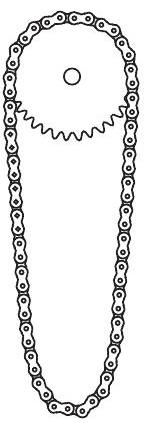

1. feladat. Egy fogaskerék tengelyét vízszintesen rögzítjük és ráhelyezünk egy kerékpárláncot az $1 / a$ ) ábrán látható módon, majd a fogaskereket a tengelye körül óvatosan forgatni kezdjük. Milyen alakot vesz fel a lánc, amikor a fogaskerék már állandó szögsebességgel sebesen forog?

1. ábra

Marci szerint a lánc alakja és helyzete ugyanolyan marad, mint volt, csupán annyi a változás, hogy a láncszemek körbeszáguldanak az eredeti alak mentén. Karcsi ezt nem hiszi, szerinte a lánc a forgás következtében kikerekedik, és közelítóleg kör alakú lesz a $1 / b$ ) ábra szerint. Marcinak vagy Karcsinak van igaza? (Bizonyítsuk be az egyik állítást, vagy legalább mutassuk meg, hogy a másik állítás nem lehet igaz!)
(Vigh Máté)

Megoldás (Vigh Máté): Tekintsük az álló láncot földi nehézségi erőtérben! Ebben az esetben a (minden pontban érintő irányú) feszítőerő a lánc mentén folyamatosan változik, éppen oly módon, hogy minden láncszem súlyát a szomszédai által kifejtett két erő eredője kiegyensúlyozza. Jelöljük ezt a feszítőerőt a lánc egy tetszőleges (mondjuk legfelső́) pontjától mért $s$ ívhossz függvényében $F _ { 1 } ( s )$-sel! (Természetesen $F _ { 1 } ( 0 ) = F _ { 1 } ( \ell )$, ahol $\ell$ a lánc teljes hossza.)

Tekintsünk most egy ugyanilyen alakú láncot, amit a súlytalanság állapotában (mondjuk egy ürállomáson) megpörgetünk úgy, hogy minden láncszem azonos, érintó irányú $v$ sebességgel mozogjon! A lánc kis darabkájára felírva a dinamika alapegyenletét könnyen belátható, hogy ekkor a láncot feszítő $F _ { 2 } ( s )$ eró nagysága független a lánc adott pontbeli görbületi sugarától, sőt, még az ívhossztól is, és nagysága $F _ { 2 } = \varrho v ^ { 2 }$, ahol $\varrho$ a lánc egységnyi hosszú darabjának tömege. Akármilyen alakú is tehát a lánc, ez a (térben és időben állandó) feszítőerő minden egyes láncszemre éppen a centripetális gyorsulásához szükséges (a lánc mentén a görbületi viszonyoktól függően helyről helyre változó) eredő erőt képes biztosítani.

Végül tekintsük a feladatunkban szereplő, a földi nehézségi erőtérben mozgó, az eredetivel azonos alakú láncot! Ha a feszítőeró a lánc mentén $F _ { 1 } ( s ) + F _ { 2 }$ módon változik, akkor minden láncszemre teljesül a Newton-féle mozgásegyenlet, hiszen az $F _ { 1 } ( s )$-ből adódó eredő eró és a gravitációs erő összege nulla, az $F _ { 2 }$-ből jövő járulék pedig a tömeg és a centripetális gyorsulás szorzatát adja.

Ezzel beláttuk, hogy az eredeti láncgörbe lehet a mozgó lánc alakja is, tehát Marcinak van igaza. (Az érvelésből az is látszik, hogy egy kikerekedett láncalaknál nem teljesülhetnek a Newton-egyenletek az egyes láncszemekre, ezért a mozgó lánc nem lehet kör alakú.)

Megjegyzések: 1. A fenti érvelést szemléltethetjük a következő gondolatkísérlettel: A fogaskerék álló állapotában varázsütésre „kapcsoljuk ki” a földi nehézségi erőteret! A lánc alakja ettől nem változik meg, csupán nem nyomja tovább a fogaskereket. Ahogy azt korábban beláttuk, ha ezután minden láncszemnek ugyanakkora, érintó irányú sebességet adunk, a lánc továbbra is megőrzi eredeti alakját. Végül kapcsoljuk vissza a földi gravitációt, amely (mint tudjuk) a megőrzött alakot már nem szeretné deformálni, tehát a mozgó lánc alakja a stacionárius helyzetben ugyanaz lesz, mint a kiindulási, nyugalmi állapotban.
2. Belátható, hogy ha láncszemek kiterjedését is figyelembe vesszük, arra az eredményre jutunk, hogy a fogaskerék egyre növekvő fordulatszáma esetén a lánc alakja fokozatosan eltér az eredeti alaktól, valóban elkezd kikerekedni. Életszerú adatokkal számolva azonban a lánc kikerekedéséhez szükséges fordulatszámra irreálisan nagy érték adódik, így valószínú, hogy a kerékpárlánc előbb szakad el, minthogy ez az effektus észrevehetóvé válna.
3. Ahogy azt az egyik versenyző a dolgozatában leírta, a megoldáshoz felsőbb matematikai ismeretekkel és a klasszikus mechanika egyik alappillérének, a Hamilton-féle legkisebb hatás elvének a stacionárius mozgásokra való alkalmazásával is eljuthatunk. Kiemelendő azonban, hogy ilyen, a középiskolai ismereteken messze túlmenő számítások nélkül is el lehetett jutni a helyes megoldáshoz.
