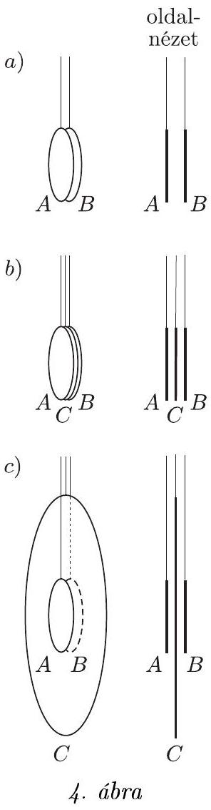
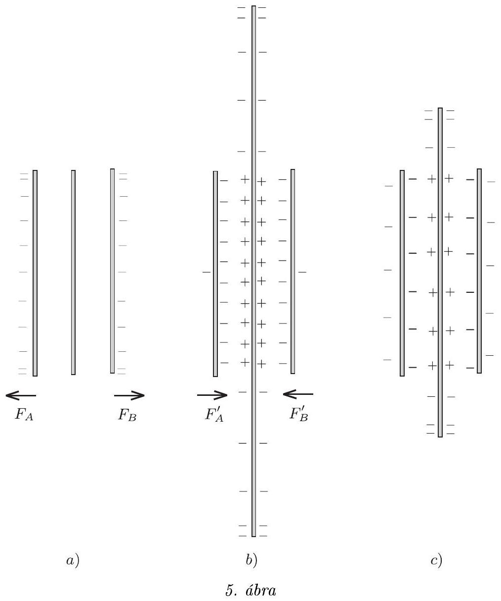

3. feladat. Két egyforma, mondjuk 5 cm átmérốjǘ, vékony lemezból készült fémkorong ( $A$ és $B$ ) szigeteló fonálon függ pontosan egymással szemben, párhuzamosan, egymáshoz közel, pl. 2 mm távolságban, az a) ábrán látható módon. Mindkét korongnak ugyanakkora, kellóképpen kicsiny $q$ elektromos töltést adunk. (Mivel $q$ kicsi, sem a korongok parányi elmozdulása, sem a levegốn át történó kisülések veszélye nem okoz bonyodalmat.) Kezdetben természetesen mindkét korongra hat a másik korong taszító ereje.

Fizika szakkörön az elektromos árnyékolás a téma.
A két korongot nézve Beának az az ötlete támad, hogy ha az A és B korong közé óvatosan (ügyelve, hogy egyikhez se érjen hozzá) egy ugyanolyan, de elektromosan semleges $C$ fémkorongot eresztünk be szigetelő fonálon a b) ábrának megfelelően, akkor az „leárnyékolja” mindkét eredeti korongnak a másikra gyakorolt hatását, ezért mind az $A$-ra, mind a $B$-re ható erő gyakorlatilag nullára csökken.

Gabi figyelmeztet rá, hogy az elektromos mezó nagyobb tartományra terjedhet ki, mint a töltött testek mérete, ezért Bea ötletét úgy módosítja, hogy a $C$ korong átmérốje legyen pl. 25 cm, ahogy a c) ábrán látható. (Az ábra nem méretarányos.) Gabi szerint csak ekkor csökken elhanyagolható értékre az $A$-ra, illetve $B$-re ható elektromos erố.
a) Mit tapasztalnánk, ha Bea ötletét követve $A$ és $B$ közé velük egyenló méretü, semleges $C$ fémkorongot engednénk, majd megmérnénk az $A$-ra, illetve $B$-re ható erốt?
b) Mi lenne az eredmény, ha Gabi javaslatát ellenóriznénk méréssel?
c) Elképzelhetố-e olyan méretứ semleges $C$ korong, amelynek alkalmazásával az $A$-ra, illetve a $B$-re ható eró pontosan zérussá válik?
(Károlyházy Frigyes)

Megoldás. a) A középre leengedett fémkorongon nem alakulhat ki töltésmegosztás, mert a korong (fém!) belsejében nem lehet szabad töltés, felületén pedig nem léphet fel kétféle előjelú töltés a szimmetrikusan, ugyanakkora korongokon elhelyezkedő, azonos előjelú töltések hatására. Ezért Bea ötlete nem jó, a két feltöltött korongra ható erő nem változhat meg. Ugyanúgy taszítanák egymást a semleges $C$ fémkorong leeresztése után, mint addig.
b) Itt, a nagyméretú $C$ korong esetén már érvényesülhet a töltésmegosztás. A középső korongnak a másik két koronggal szemközti részein $q$-val ellentétes töltés alakul ki mindkét oldalon. Ugyanakkora, $q$-val azonos előjelú töltés lép fel a nagy $C$ korong széle felé, úgyhogy az össztöltés továbbra is nulla marad. Viszont a töltött korongokra most a nagy korongon megosztott (influált), $q$-val ellentétes előjelú töltések vonzó erőt fejtenek ki, és ez nagyobb, mint a taszító erő. A két töltött korongra ható erő éppen ellentétes irányú lesz, mint addig, amíg nem volt közöttük a nagy korong.
c) Gondolatban fokozatosan növeljük a középső korong átmérójét 5 cm-ről 25 cm-re. A kezdeti taszító erő csökkenni kezd, míg végül - folytonosan változva - vonzó eróbe megy át. Közben, valamekkora átmérőnél tehát éppen zérus a töltött korongokra ható erő. Hogy ez mekkora átmérőnél következik be, azt egy kicsit bonyolultabb számítással lehet csak meghatározni; ezt azonban nem várta el a versenybizottság a megoldóktós ${ } ^ { 1 }$.

[^0]

Tájékozódásul vázoljuk a három esetben kialakuló töltéseloszlást (5. ábra), feltéve, hogy eredetileg negatív töltést adtunk a korongoknak. (Az ábrák nem méretarányosak.)

Kiegészítések (Kalina Kende ötlete alapján): a) eset: Vegyük a három korong burkolóhengerét. Képzeljük azt, hogy ez a „lapos" henger teljes egészében homogén vezető. Vigyünk fel rá $2 q$ töltést, ezek legnagyobb része henger véglapjain jelenik meg, csak egy kis része kerül a henger palástjára. Ha ezután eltávolítjuk a hengernek azt a részét, ami nem a három korong, akkor látszik, hogy a középső korongon nincs töltés, így nem befolyásolja az $A$ és $B$ korong közötti erőhatást.
b) eset: Ha a középső korong végtelen nagy lenne, akkor a tükörtöltés módszerét alkalmazva jól látszana, hogy $A$-ra és $B$-re is vonzóerőt fejt ki a középső fémsík, miközben az $A$ és $B$ közötti kölcsönhatás már nem is lép fel. Most ugyan nem végtelen nagy a középső korong, de területe a kis, töltött $A$ és $B$ korong területének 25-szöröse, távolsága a kis korongoktól 1-1 mm, ami átmérójének 250-ed része. Vagyis a $C$ korong közepén influált, az $A$ és $B$ töltésével ellenkező előjelũ töltés vonzó hatásának kell érvényesülnie ebben az esetben is.
*

A verseny ünnepélyes eredményhirdetésére és a díjak kiosztására 2010. november 26-án került sor az ELTE TTK Bolyai János termében. Meghívást kaptak erre az 50 és a 25 évvel ezelőtti Eötvös-versenyek nyertesei is, akik közül Dömölky (akkor még Elsner) Gábor, Grad János, Kós Géza, Pfeil Tamás és Tasnádi Tamás tudtak eljönni, és emlékeztek vissza néhány keresetlen mondatban saját versenyélményeikre. A megjelentek kivetítve láthatták az 50 és 25 évvel ezelőtti verseny feladatait és a 25 évvel ezelőtti nyerteseknek a KöMaL-ban akkor megjelent fényképeit.

Ezután következett az idei feladatok ismertetése, a megoldások bemutatása, melyben csaknem a teljes versenybizottság részt vett. Radnai Gyula ismertette a megoldásokat, ezeket az elsó feladatnál Vigh Máté, a másodiknál Honyek Gyula egészítette ki, az itt is olvasható módon. A második és a harmadik feladathoz kapcsolódóan kísérletek bemutatására is sor került, Honyek Gyula és Ajtay János jóvoltából. Megfigyelhettük a levegőből kicsapódó oxigént egy folyékony nitrogénnel töltött teáskanna oldalán, és lézeres fénymutató jelezte az egyik töltött fémkorong elmozdulását, amikor a korongok közé ereszkedett a töltetlen nagy korong.

A díjak és jutalmak kiosztására Kádár Györgyöt, az Eötvös Loránd Fizikai Társulat fótitkárát és Fekete Lászlót, a MOL magyarországi HR (humánerőforrás fejlesztési) igazgatóját kérte fel a versenybizottság elnöke. Utóbbit azért, mert a MOL jóvoltából idén nemcsak a legjobb versenyzők, hanem tanáraik is váratlan jutalomban részesültek: egyenként 25-25 ezer forint kedvezményt kaptak a Sárospatakon megrendezendő fizikatanári ankét részvételi díjából.

Első́ díjat, akárcsak 50 évvel ezelőtt, 2010-ben se adott ki a versenybizottság. (Ehhez mindhárom feladat tökéletes megoldására lett volna szükség, ilyen sajnos nem volt.)

Második díjat, vele 20 ezer forint pénzjutalmat öten kaptak: Backhausz Tibor, a Fazekas Mihály Főv. Gyak. Gimn. 12. évf. tanulója, Horváth Gábor tanítványa; Börcsök Bence, a szegedi Radnóti Miklós Kís. Gimn. 12. évf. tanulója, Mező Tamás tanítványa; Budai Ádám, a miskolci Földes Ferenc Gimn. 12. évf. tanulója, Bíró István és Zámborszky Ferenc tanítványa; Kalina Kende, a Fazekas Mihály Fóv. Gyak. Gimn. 12. évf. tanulója, Horváth Gábor és Csefkó Zoltán tanítványa; és Varga Ádám, a szegedi Ságvári Endre Gyak. Gimn. 12. évf. tanulója, Tóth Károly és Hilbert Margit tanítványa.

Harmadik díj kiadására sem került sor, viszont tizenegy versenyző kapott dicséretet, vele 10 ezer forint értékú könyvjutalmat: Almási Gergõ, az ELTE fizika szakos hallgatója, aki a budapesti Radnóti Miklós Gyak. Gimnáziumban érettségizett mint Szalóki Dezső és Markovits Tibor tanítványa; Ågoston Tamás, a Fazekas Mihály Főv. Gyak. Gimn. 11. évf. tanulója, Dvorák Cecilia tanítványa; Benedek Ádám, a nagykanizsai Batthyány Lajos Gimn. 11. évf. tanulója, Dénes Sándorné tanítványa; Béres Bertold, a budapesti Puskás Tivadar Távközlési Techn. 12. évf. tanulója, Beregszászi Zoltán és Alapiné Ecseri Éva tanítványa; Kéri Zsófia Nóra, az ELTE fizika szakos hallgatója, aki a budapesti Trefort Ágoston Gyak. Gimnáziumban érettségizett mint Kovács Géza tanítványa; Kószó Simon, a szegedi Radnóti Miklós Kís. Gimn. 12. évf. tanulója, Mező Tamás tanítványa; Major Attila, a szegedi Radnóti Miklós Kís. Gimn. 11. évf. tanulója, Mező Tamás tanítványa; Pácsonyi Imre, a zalaegerszegi Zrínyi Miklós Gimn. 13. évf. tanulója, Pálovics Róbert tanítványa; Szikszai Lőrinc, a miskolci Fráter György Kat. Gimn. 12. évf. tanulója, Edöcsény Levente tanítványa; Várnai Péter, a budapesti Apáczai Csere János Gyak. Gimn. 12. évf. tanulója, Pákó Gyula és Flórik György tanítványa; Vona István, a Fazekas Mihály Fóv. Gyak. Gimn. 11. évf. tanulója, Dvorák Cecilia tanítványa.

A nyertes diákok megjelent tanárai a Vince Kiadó és a MATFUND Alapítvány által felajánlott könyvekből válogathattak.

Végül a versenybizottság elnöke felolvasta Veres Gábor fizikus üzenetét, amelyet kérésére intézett a mai versenyzőkhöz Genfből, ahol a nagy hadronütköztetőben a nehézionok ütközésével kapcsolatos izgalmas kísérletekben vesz részt ${ } ^ { 2 }$

A hivatalos program lezajlása után a most már szokásosnak mondható állófogadás következett a RAMASOFT Zrt. jóvoltából. Köszönet minden támogatónknak!
(Radnai Gyula)

[^1]

[^0]:    ${ } ^ { 1 }$ A „kritikus" korongméret középiskolás eszközökkel történő kiszámítására a KöMaL egy későbbi számában még visszatérünk. - A Szerk.

[^1]:    ${ } ^ { 2 }$ A kísérletekről rövid tudósítást olvashattunk a KöMaL 2010/8. számában.
