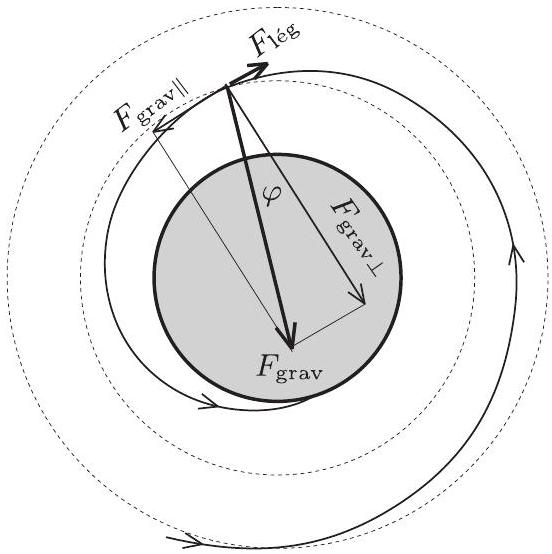

## Beszámoló a 2011. évi Eötvös-versenyről   Radnai Gyula

2011. október 14-én délután 3 órai kezdettel került sor a háború utáni 63. Eötvös-versenyre Budapesten és a terv szerint 15, valójában csak 9 vidéki városban. Sajnos Sopronban nem sikerült megrendezni a versenyt, Békéscsabán, Egerben, Nyíregyházán, Székesfehérváron és Szombathelyen pedig egyetlen versenyzó sem jelent meg a verseny meghirdetett helyszínén. Feltünő volt a vidéki diákok érdektelensége; még olyan egyetemi városban is, mint Debrecen, csupán egyetlen versenyző akadt. Az Eötvös-verseny rendezője az Eötvös Loránd Fizikai Társulat, amelynek helyi csoportjai adják a verseny helyi szervezőit. Az ő munkájuk veszett kárba az említett városokban. Szegeden és Pécsett 11-11 versenyző, Budapesten 67 versenyző indult, a többi helyszínen egyaránt 10-nél kevesebben voltak. Először fordult elő, hogy a vidéki helyszíneken együttvéve kevesebb versenyző (41) jelent meg, mint Budapesten.

Az összesen 108 versenyzőből 26-an voltak a két nagy budapesti egyetem (BME, ELTE) első́ves hallgatói, és pontosan ugyanennyi diák jött a Fővárosi Fazekas Mihály Gyakorló Gimnáziumból. Az egyetemisták közül öten érettségiztek a Fazekasban, négyen az ELTE Apáczai Csere János Gyakorló Gimnáziumban. Innen további hat diák indult a versenyen. A vidéki középiskolák közül a szegedi Radnóti Miklós Kísérleti Gimnáziumból jött a legtöbb (8) versenyző. Külföldi versenyző egyetlen akadt, az ELTE egyik első́eves hallgatója.

A feladatokat az Eötvös-versenybizottság túzte ki, és a versenyzők dolgozatait is ugyanez a bizottság értékelte. (Tagjai Honyek Gyula, Károlyházy Frigyes, Vigh Máté, elnöke Radnai Gyula.) A feladatok megoldására 300 perc állt rendelkezésre.

Ismertetjük a feladatokat és azok megoldását.

1. feladat. Pályafutásuk végén a sorsukra hagyott mữholdak a sebesség négyzetével arányos légellenállási erố hatására fokozatosan veszítenek mechanikai energiájukból, és végül a légkör sưrữb rétegeibe érve elégnek. Belátható, hogy az eredetileg körpályákon keringố műholdak a Föld felszínéhez közeledve mindvégig közelítóleg körpályákon haladnak, miközben a „körpályák” sugara lassan csökken.

Tegyük fel, hogy egy $m = 500 \mathrm {~kg}$ tömegü̃ müholdat, amely az Egyenlítő sikjában, $h = 400 \mathrm {~km}$-es magasságban körpályán kering, magára hagynak! A mữholdra ható légellenállási erốt az $F _ { \text {lég } } = K \varrho v ^ { 2 }$ alakban adhatjuk meg, ahol $K = 0,23 \mathrm {~m} ^ { 2 } , \varrho$ a levegố sữrứsége a mữhold magasságában, $v$ pedig a mû́hold sebessége.
a) Határozzuk meg a műhold sebességváltozását, miközben pályamagassága a felére csökken $( h \rightarrow h / 2 )$ !
b) A légellenállási erố, valamint a mű̌holdra ható két eró (gravitációs és légellenállási) eredójének pályamenti (érintốleges) összetevốje között egy egyszerü összefüggés állapítható meg. Hogy szól ez?
c) Mekkora a levegó súrữsége $h / 2 = 200 \mathrm {~km}$ magasságban, ha itt egy fordulat alatt a mữhold pályasugara 100 m -rel csökken?

A megoldáshoz szükséges további adatokat táblázatokból vehetjük.
(Honyek Gyula)
Megoldás. Adottak:

$$
\begin{aligned}
& m = 500 \mathrm {~kg} , \quad h = 400 \mathrm {~km} = 4 \cdot 10 ^ { 5 } \mathrm {~m} , \\
& r _ { 1 } = R + h , \quad r _ { 2 } = R + \frac { h } { 2 } , \\
& F _ { \text {lég } } = K \varrho v ^ { 2 } \left( \text { ahol } K = 0,23 \mathrm {~m} ^ { 2 } \right) , \quad \Delta r = - \varepsilon ( = - 100 \mathrm {~m} ) .
\end{aligned}
$$

Táblázatból vehető a Föld egyenlítői $R$ sugara, $M$ tömege és a gravitációs törvényben szereplő $\gamma$ állandó:

$$
\begin{aligned}
R & = 6378 \mathrm {~km} = 6,378 \cdot 10 ^ { 6 } \mathrm {~m} , \\
M & = 5,974 \cdot 10 ^ { 24 } \mathrm {~kg} , \\
\gamma & = 6,673 \cdot 10 ^ { - 11 } \mathrm {~m} ^ { 3 } / \left( \mathrm { kg } \cdot \mathrm {~s} ^ { 2 } \right) .
\end{aligned}
$$

a) A feladatban megfogalmazott feltételek szerint „a müholdak a Föld felszínéhez közeledve mindvégig közelítően körpályán haladnak", ezért jó közelítésben írhatjuk:

$$
F _ { \text {grav } } = m a _ { \mathrm { cp } } , \quad \gamma \frac { m M } { r ^ { 2 } } = m \frac { v ^ { 2 } } { r } .
$$

Ennek alapján

$$
v = \sqrt { \frac { \gamma M } { r } } ,
$$

amelybe behelyettesítve $r _ { 1 }$ és $r _ { 2 }$ értékeit, megkapjuk a két sebességet:

$$
v _ { 1 } = 7669,0 \frac { \mathrm {~m} } { \mathrm {~s} } , \quad v _ { 2 } = 7784,7 \frac { \mathrm {~m} } { \mathrm {~s} } .
$$

A mühold sebességváltozása tehát

$$
v _ { 2 } - v _ { 1 } = 115,7 \frac { \mathrm {~m} } { \mathrm {~s} } > 0 .
$$

A légellenállás következtében nőtt a mühold sebessége! Szokás ezt ürhajózási paradoxonnak is nevezni. A légellenállási, súrlódási erő munkája szükségképpen negatív, mégis nố a műhold mozgási energiája! Hogyan lehetséges ez? Erre kaphatunk választ a feladat $b$ ) és $c$ ) részének megoldása során. Érdemes lesz mindkét esetben abból indulunk ki, hogyan változik meg a műhold mechanikai összenergiája, vagyis a kinetikus és potenciális energia összege. Ez az, ami a légellenállási eró hatására csökkenhet.
b) A légellenállási erő teljesítménye:

$$
\vec { F } _ { \text {lég } } \cdot \vec { v } = - F _ { \text {lég } } \cdot v < 0 .
$$

Ez egyenló az összenergia változási sebességével:

$$
\begin{equation*}
- F _ { \text {lég } } \cdot v = \frac { \Delta E _ { \text {össz } } } { \Delta t } . \tag{1}
\end{equation*}
$$

Az összenergia kinetikus és potenciális részbő́l áll:

$$
E _ { \text {össz } } = E _ { \mathrm { kin } } + E _ { \mathrm { pot } } = \frac { 1 } { 2 } m v ^ { 2 } + \left( - \gamma \frac { m M } { r } \right) .
$$

E két rész azonban kifejezhető egymásból. Írjuk fel újra a dinamika alaptörvényét:

$$
\gamma \frac { m M } { r ^ { 2 } } = m \frac { v ^ { 2 } } { r } , \quad \text { azaz } \quad \gamma \frac { m M } { r } = m v ^ { 2 } ,
$$

amiből kapjuk:

$$
E _ { \mathrm { kin } } = \frac { 1 } { 2 } m v ^ { 2 } = \frac { 1 } { 2 } \gamma \frac { m M } { r } = \frac { 1 } { 2 } \left( - E _ { \mathrm { pot } } \right) .
$$

Az összenergiát tehát így is felírhatjuk:

$$
E _ { \text {össz } } = E _ { \text {kin } } + E _ { \text {pot } } = E _ { \text {kin } } - 2 E _ { \text {kin } } = - E _ { \text {kin } } < 0 .
$$

(Az, hogy az összenergia negatív, nem kell, hogy megijesszen senkit, az atomfizikában számos példát látunk erre.)
Most tehát (1) így írható:

$$
- F _ { \mathrm { lég } } \cdot v = - \frac { \Delta E _ { \mathrm { kin } } } { \Delta t } ,
$$

illetve

$$
F _ { \text {lég } } \cdot v = \frac { \Delta \left( \frac { 1 } { 2 } m v ^ { 2 } \right) } { \Delta t } = m v \frac { \Delta v } { \Delta t } = m v a _ { \mathrm { t } } .
$$

A légellenállásra egy érdekes kifejezést kaptunk:

$$
\begin{equation*}
F _ { \text {lég } } = m a _ { \mathrm { t } } . \tag{2}
\end{equation*}
$$

Az $m a _ { \mathrm { t } }$ kifejezés a tangenciális (pályamenti) eredő erốt adja, amely most a gravitációs erő pályamenti összetevőjének és a légellenállási erónek az eredője (1. ábra), tehát

$$
m a _ { \mathrm { t } } = F _ { \text {grav } \| } - F _ { \text {lég } } .
$$

Ezt vessük össze (2)-vel:

$$
F _ { \text {lég } } = F _ { \text {grav } \| } - F _ { \text {lég } } .
$$

1. ábra. A feladat számadataival: $F _ { \text {grav } } = 4,6 \mathrm { kN } , F _ { \text {lég } } = 5,6 \mathrm { mN }$, $\varphi = 1,2 \cdot 10 ^ { - 6 } \mathrm { rad } = 0,25 ^ { \prime \prime }$. A vázlatos ábra nem méretarányos

Az az egyszerú összefüggés tehát, amely a légellenállási erő, valamint a műholdra ható két eró (gravitációs és légellenállási) eredőjének pályamenti összetevője között fennáll az, hogy e kettő nagysága egyenló egymással.
c) Ismét az összenergia változásából érdemes kiindulnunk, de az összenergiát most ne a kinetikus, hanem a potenciális energiával fejezzük ki, felhasználva az $E _ { \text {kin } } = - E _ { \text {pot } } / 2$ összefüggést:

$$
\begin{gathered}
E _ { \text {össz } } = E _ { \mathrm { kin } } + E _ { \mathrm { pot } } = - \frac { E _ { \mathrm { pot } } } { 2 } + E _ { \mathrm { pot } } = \frac { E _ { \mathrm { pot } } } { 2 } . \\
\frac { \Delta E _ { \text {össz} } } { \Delta t } = \frac { 1 } { 2 } \frac { \Delta E _ { \mathrm { pot } } } { \Delta t } ,
\end{gathered}
$$

ami $\Delta r$-rel szorozva és osztva így is írható:

$$
\frac { \Delta E _ { \text {össz } } } { \Delta t } = \frac { 1 } { 2 } \frac { \Delta E _ { \mathrm { pot } } } { \Delta r } \frac { \Delta r } { \Delta t } .
$$

Mit mondhatunk a sugár változási sebességéről? Ismert adat, hogy egyetlen fordulat során a pályasugár $\varepsilon = 100$ méterrel csökken, tehát

$$
\frac { \Delta r } { \Delta t } = \frac { - \varepsilon } { T } = \frac { - \varepsilon } { \frac { 2 r \pi } { v } } .
$$

Határozzuk meg a potenciális energia és a pályasugár változásának viszonyát:

$$
\frac { \Delta E _ { \mathrm { pot } } } { \Delta r } = \frac { \Delta \left( - \gamma \frac { m M } { r } \right) } { \Delta r } = \gamma \frac { m M } { r ^ { 2 } } .
$$

Most már felírhatjuk az (1) egyenletet, amelyben az összenergiát a potenciális energiával fejezzük ki:

$$
\begin{aligned}
- F _ { \text {lég } } \cdot v & = \frac { \Delta E _ { \text {össz } } } { \Delta t } = \frac { 1 } { 2 } \frac { \Delta E _ { \mathrm { pot } } } { \Delta t } = \frac { 1 } { 2 } \frac { \Delta E _ { \mathrm { pot } } } { \Delta r } \frac { \Delta r } { \Delta t } , \\
- F _ { \text {lég } } \cdot v & = \frac { 1 } { 2 } \gamma \frac { m M } { r ^ { 2 } } \frac { - \varepsilon } { \frac { 2 r \pi } { v } } , \\
F _ { \text {lég } } & = \frac { 1 } { 4 \pi } \gamma \frac { m M } { r ^ { 3 } } \varepsilon , \\
K \varrho v ^ { 2 } & = \frac { 1 } { 4 \pi } \gamma \frac { m M } { r ^ { 3 } } \varepsilon .
\end{aligned}
$$

Ebben az egyenletben már csak $\varrho$ az egyetlen ismeretlen, éppen ezt kellett kiszámítanunk! De hogy még szebb, elegánsabb formulát kapjunk, használjuk fel újra a $v ^ { 2 } = \gamma M / r$ összefüggést, így a következőt kapjuk:

$$
\varrho = \frac { 1 } { 4 \pi K } \frac { m } { r ^ { 2 } } \varepsilon .
$$

$r = r _ { 2 }$, valamint $\varepsilon$ megadott értékét behelyettesítve

$$
\varrho = 4 \cdot 10 ^ { - 10 } \frac { \mathrm {~kg} } { \mathrm {~m} ^ { 3 } } .
$$

Kiegészítés: Az $a$ ) kérdésre $m g = m v ^ { 2 } / r$ felhasználásával is válaszolhatunk, ha figyelembe vesszük a gravitációs gyorsulás magasságfüggését: $g = g _ { 0 } \left( 1 - \frac { h } { r } \right) ^ { 2 }$. Ezzel

$$
v = \sqrt { g r } = \left( 1 - \frac { h } { r } \right) \sqrt { g _ { 0 } r } ,
$$

ahol $g _ { 0 }$ az egyenlítői gravitációs gyorsulás, amely azonban a táblázatban adott egyenlítői nehézségi gyorsulásnál nagyobb! A különbség a Föld forgásából adódó „centri" gyorsulás.
2. feladat. Egy függőlegesen álló, henger alakú zárt tartály magassága legyen mondjuk 20 cm ! Tegyük fel, hogy a tartály falának és belsố tartalmának hốmérséklete huzamos ideje $T = 1 ^ { \circ } \mathrm { C } !$ A tartalom pedig egy, a tartály alaplapját borító papírvékonyságú vízréteg és fölötte ennek a telített gốze, más semmi. Az oldalfalat hốszigetelőnek tekinthetjük, az alap- és fedốlap azonban igen jó hốvezetố vékony fémlemez, amelyeknek a hốmérsékletét kívülrốl szabályozhatjuk.

A lehetóséggel élve emeljük a fedólap hómérsékletét $T _ { f } = 100 ^ { \circ } \mathrm { C }$-ra, miközben az alaplap hốmérsékletét $T = 1 ^ { \circ } \mathrm { C }$-on tartjuk, és gondoskodjunk róla, hogy ezek az értékek elég sokáig így maradjanak! Várjuk meg, amíg az edényben kialakul a víz, illetve a góz új stacionárius állapota, amely már nem változik tovább!
a) A korábbi egyensúlyi állapothoz képest megváltozott-e említésre méltó mértékben a gőzállapotban lévố vízmolekulák száma, és ha igen, akkor nốtt vagy csökkent?
b) Vajon mi lenne a válasz, ha a kezdeti állapotban a vízréteg magassága 10 cm lenne?
(Károlyházy Frigyes)

Megoldás. Ha egy folyadék saját telített gőzével érintkezik, akkor a gőz nyomása csak közös hőmérsékletüktől függ. Az alul levő 1 °C-os víz felett a gőz nyomása tehát mindkét esetben ugyanannyi. (A táblázatból interpolációval leolvasható ennek aktuális értéke: 660 Pa .)

A gőznyomás az egész edényben ugyanakkora, de abban az esetben, ha a hőmérséklet felfelé emelkedik, a gőz súrúsége felfelé csökken. (Szintén a táblázatból olvasható ki, hogy az $1 ^ { \circ } \mathrm { C }$-os telített gőz sứrứsége $5,2 \mathrm {~g} / \mathrm { m } ^ { 3 }$, amiből egy átlagosan 50,5 °C-os gőz súrúśégére „ideális gáz közelítésben” $4,4 \mathrm {~g} / \mathrm { m } ^ { 3 }$ adódik.)

A gőz új stacionárius (időben állandó) állapotában tehát a gőz átlagos sürúsége kisebb lett, vagyis a gőzállapotban levő vízmolekulák száma csökkent (2. ábra)!

2. ábra

b) Ha a vízréteg magassága kezdetben 10 cm, a víz kitölti az edény felét. Felette azonban ugyanúgy 1 °C hőmérsékletú és 660 Pa nyomású telített gőz van, mint az $a$ ) esetben.

Amikor viszont a fedőlap hőmérsékletét $100 ^ { \circ } \mathrm { C }$-ra emeljük, már nem mondhatjuk, hogy az egész víz $1 ^ { \circ } \mathrm { C }$-os marad, ugyanúgy, mint amikor „papírvékonyságú" volt. Azt se állíthatjuk persze, hogy jelentősen felmelegszik a víz felső rétege, mivel a víz sokkal jobb hóvezető, mint a vízgő́z. Mennyire melegszik hát fel?

Táblázatból kiolvasható, hogy a vízgőz hóvezetési együtthatója

$$
\lambda _ { \text {gőz } } = 18,0 \cdot 10 ^ { - 3 } \frac { \mathrm {~J} } { \mathrm {~m} \mathrm {~K} \mathrm {~s} } ,
$$

míg a víz hóvezetési együtthatója

$$
\lambda _ { \text {víz } } = 0,587 \frac { \mathrm {~J} } { \mathrm {~m} \mathrm {~K} \mathrm {~s} } = 587 \cdot 10 ^ { - 3 } \frac { \mathrm {~J} } { \mathrm {~m} \mathrm {~K} \mathrm {~s} } .
$$

Mivel a vízréteg és felette a vízgőz ugyanolyan (10 cm) magas, és a kialakuló hőmérsékletkülönbségek fordítva arányosak a hóvezetési együtthatókkal, ezért a víz tetejének és a vele érintkezó vízgőznek a közös hómérsékletét $T _ { \mathrm { k } }$-val jelölve felírhatjuk:

$$
\frac { T _ { \mathrm { k } } - 1 ^ { \circ } \mathrm { C } } { 100 ^ { \circ } \mathrm { C } - T _ { \mathrm { k } } } = \frac { \lambda _ { \text {gőz } } } { \lambda _ { \text {víz } } } = \frac { 18 \cdot 10 ^ { - 3 } } { 587 \cdot 10 ^ { - 3 } } .
$$

Ennek alapján kapjuk $T _ { \mathrm { k } }$-ra a 4 °C-os értéket, amit már a 3. ábrán is feltüntettünk.

3. ábra

Ezek után a táblázatból extrapolációval kiolvashatjuk a 4 °C-hoz tartozó telítési gőznyomás nagyságát: 820 Pa. Ez is szerepel már az ábrán.

Hasonlóképpen kiolvashatjuk a telített vízgő́z súrúségének értékét $4 ^ { \circ } \mathrm { C }$-on, ez $6,4 \mathrm {~g} / \mathrm { m } ^ { 3 }$. A nyomás az egész gőztérben 820 Pa lesz, a gőz súrúsége azonban csak legalul $6,4 \mathrm {~g} / \mathrm { m } ^ { 3 }$, felfelé egyre kevesebb. Megbecsülhetjük az átlagos súrúséget, újra csak ideális gáznak tekintve a vízgőzt, amely átlagosan 50,5 °C hőmérsékletű:

$$
\varrho = \frac { 274 } { 323,5 } \cdot 6,4 \frac { \mathrm {~g} } { \mathrm {~m} ^ { 3 } } = 5,4 \frac { \mathrm {~g} } { \mathrm {~m} ^ { 3 } } .
$$

Ez viszont még mindig több, mint az $1 { } ^ { \circ } \mathrm { C }$-hoz tartozó $5,2 \mathrm {~g} / \mathrm { m } ^ { 3 }$ érték, vagyis ebben az esetben a gőzállapotban levő vízmolekulák száma nốtt!

Kiegészítés: Számításunkban eltekintettünk a víz sürúségváltozásától, amely persze elhanyagolható a vízgő́z sürúségváltozásához képest. Mégis okozhat egy kis galibát, ha figyelembe vesszük, hogy a 4 °C-os legfelső vízréteg súrúsége nagyobb, mint az alatta levőké. Ezáltal a víz mechanikailag instabillá válik az edényben, s az egyensúlynak kis megzavarása is áramlásokat idézhet elő. Ha valamelyik versenyző erre is utalt volna a dolgozatában, a versenybizottság plusz pontokkal jutalmazta volna, de senkinek se jutott ez akkor eszébe. Hasonlóképpen figyelmen kívül hagyta mindenki a 100 °C-os felső lap hősugárzásának hatását a vízréteg hőmérsékletére, azonban ez a hatás nem is olyan jelentős, hogy módosítaná a végső választ: az $a )$ esetben csökken, a $b$ ) esetben nő a vízgőz molekuláinak száma.
3. feladat. Egy toroid (úszógumi) alakú „sovány" vasmagra szimmetrikus elrendezésben három egyforma, „kövér” elektromágneses tekercs van felfũzve a 4. ábra szerint. Az elsó tekercsre váltóáramú feszültségforrást kapcsolunk, a második tekercs kivezetéseit szabadon hagyjuk, a harmadik tekercs csatlakozóira pedig voltmérốt kötünk. Ekkor a voltmérő a feszültségforrás effektív értékének a felét mutatja.

Ezután a második tekercs kivezetéseit a K kapcsolóval rövidre zárjuk. Mit mutat ebben az esetben a voltmérô?
Útmutatás: A tekercsek ohmos ellenállása elhanyagolható, a feszültségforrást és a voltmérốt ideálisnak tekinthetjük. A vasmag mágneses permeabilitása nem függ a mágneses fluxustól.
(Honyek Gyula)
Megoldás. A könnyebb áttekinthetőség végett a tekercseket már a feladat ábráján megszámoztuk.
A szimmetrikus elrendezés miatt (a középiskolai képlettár jelöléseit követve) a tekercsek önindukciós és kölcsönös indukciós együtthatói között az alábbi összefüggéseket írhatjuk fel:

$$
\begin{array} { l l }
L _ { 11 } = L _ { 22 } = L _ { 33 } , & \text { jelöljük } L \text {-lel; } \\
L _ { 12 } = L _ { 21 } = L _ { 13 } = L _ { 31 } = L _ { 23 } = L _ { 32 } , & \text { jelöljük } M \text {-mel. }
\end{array}
$$

Tekintsük az egyes tekercsekben indukált feszültségeket! Minthogy $I _ { 2 } = 0$, mert a kapcsoló nyitva van, valamint $I _ { 3 } \approx 0$, mert a voltmérő ellenállása nagyon nagy, csupán az $I _ { 1 }$ áram változása indukál feszültséget.

Az 1. tekercsben $U _ { 1 } = L \frac { \Delta I _ { 1 } } { \Delta t }$, a 3. tekercsben pedig $U _ { 3 } = M \frac { \Delta I _ { 1 } } { \Delta t }$. A feladat szövege szerint $U _ { 3 } = \frac { U _ { 1 } } { 2 }$, vagyis $M =$ $\frac { L } { 2 }$.

Zárjuk a kapcsolót! Ekkor már a 2. tekercsben is fog áram folyni, vagyis az egyes tekercsekben indukált feszültségek így írhatók fel:

$$
\begin{aligned}
& U _ { 1 } = L \frac { \Delta I _ { 1 } } { \Delta t } + M \frac { \Delta I _ { 2 } } { \Delta t } , \\
& U _ { 2 } = M \frac { \Delta I _ { 1 } } { \Delta t } + L \frac { \Delta I _ { 2 } } { \Delta t } , \\
& U _ { 3 } = M \frac { \Delta I _ { 1 } } { \Delta t } + M \frac { \Delta I _ { 2 } } { \Delta t } .
\end{aligned}
$$

Azt kell észrevennünk, hogy a rövidzár miatt $U _ { 2 } = 0$. Ezt felhasználva a két áramváltozási sebesség között adódik egy egyszerú összefüggés:

$$
\frac { \Delta I _ { 2 } } { \Delta t } = - \frac { M } { L } \frac { \Delta I _ { 1 } } { \Delta t } .
$$

Képezzük az $\frac { U _ { 3 } } { U _ { 1 } }$ hányadost:

$$
\frac { U _ { 3 } } { U _ { 1 } } = \frac { M - \frac { M ^ { 2 } } { L } } { L - \frac { M ^ { 2 } } { L } } = \frac { 1 } { 3 } .
$$

(Az utolsó lépésnél figyelembe vettük, hogy $M = L / 2$ ).
Tehát a kapcsoló zárása után a voltmérő a feszültségforrás effektív értékének harmadát fogja mutatni.
Kiegészítés: A vasmag permeabilitásának állandóságát akkor használtuk fel, amikor feltételeztük a tekercsek induktivitásának és a kölcsönös indukciós együtthatóknak az állandóságát, vagyis hogy pl. $M = L / 2$ akkor is fennáll, ha zárjuk a kapcsolót. Szokatlan volt a feladatban, hogy ebben a tipikusan transzformátoros összeállításban a feszültségek aránya lényegesen eltér a menetszámok arányától. A mindennapi gyakorlatban ez jól ismert jelenség, inkább az tekinthetó idealizációnak, hogy az említett két arány megegyezik. A mágneses mező „kiszóródása” a vasmagból általában elkerülhetetlen, ha nem is olyan jelentős mindig, mint most, ebben a feladatban.

## A verseny eredménye

Elsố díjat és 30 ezer forint pénzjutalmat vehetett át Budai Ádám, a BME fizika BSc szakos hallgatója, aki a miskolci Földes Ferenc Gimnáziumban érettségizett mint Bíró István tanítványa; olimpiai szakkörvezetője Zámborszky Ferenc volt.

Második díjat és 20 ezer forint pénzjutalmat hárman kaptak: Jéhn Zoltán, a BME fizika BSc szakos hallgatója, aki Pécsett, a PTE Babits Mihály Gyakorló Gimnáziumban érettségizett, tanára a gimnáziumban Koncz Károly, az olimpiai szakkörön Kotek László volt; Kalina Kende, a ELTE matematika BSc szakos hallgatója, aki a Fazekas Mihály Fốvárosi Gyakorló Gimnáziumban érettségizett Horváth Gábor, Csefkó Zoltán és Szokolai Tibor tanítványaként; Szabó Attila, a pécsi Leốwey Klára Gimnázium 11. évf. tanulója, tanára a gimnáziumban Simon Péter, az olimpiai szakkörön Kotek László.

Harmadik díjat és 15-15 ezer forint pénzjutalmat vehetett át két versenyző: Bolgár Dániel, a pécsi Leốwey Klára Gimnázium 12. évf. tanulója, tanárai Almási László és Simon Péter; Kovács Péter, az ELTE Apáczai Csere János Gyakorló Gimnáziumának 12. évf. tanulója, Pákó Gyula tanítványa.

Hárman kaptak dicséretet és 10-10 ezer forint értékú könyvjutalmat: Batki Bálint, a BME fizika BSc szakos hallgatója, aki az ELTE Apáczai Csere János Gyakorló Gimnáziumban érettségizett mint Zsigri Ferenc tanítványa; Forman Ferenc, az ELTE Radnóti Miklós Gyakorló Gimnáziumának 10. évf. tanulója, Honyek Gyula tanítványa; Jenei Márk, a Fazekas Mihály Fóvárosi Gyakorló Gimnázium 11. évf. tanulója, Dvorák Cecília és Csefkó Zoltán tanítványa.

## Ünnepélyes díjkiosztás

2011. november 25-én délután 3 órai kezdettel került sor az ünnepélyes eredményhirdetésre és díjkiosztásra. A már jól bevált hagyományt követve először az 50 , majd a 25 évvel ezelőtti Eötvös-verseny feladatainak felidézésére került sor. Az akkori nyertesek közül többen is eljöttek, szóltak néhány szót emlékeikről, azóta befutott pályájukról.

Zakariás László 1961-ben a piaristáknál érettségizett. Az Elektronikus Mérőkészülékek Gyárának dolgozójaként nyerte meg az Eötvös-versenyt, mivel a BME-re nem vették fel. Így emlékezett vissza a fél évszázaddal ezelőtt történtekre: „A Müszaki Egyetemre második próbálkozásra se vettek fel. Fellebbeztünk. A fellebbezést elutasították. A minisztériumi fellebbezéshez csatoltuk az Eötvös-verseny eredményét. Szeptember végén, a születésnapomon, levél érkezett a minisztériumból: Örömmel értesítjük, hogy felvételt nyert a Budapesti Müszaki Egyetem Villamosmérnöki Karára. Én voltam a világ legboldogabb embere. Tisztelettel és hálával gondolok Kovács Mihály tanár úrra." Fritz József Mosonmagyaróvárról fizikusnak jelentkezett az ELTE-re, Molnár Emil a győri Révai Gimnáziumból matematikafizika szakos tanárnak. Mindkettőjüket felvették. Fritz József ma már matematikus akadémikus, Molnár Emil a BME Geometria tanszékének vezető́jeként ment nyugdíjba. Mindhárman hálával emlékeztek vissza tanáraikra, akik megszerettették velük a fizikát, a matematikát, felkészítették őket a versenyre.

A 25 évvel ezelőtti Eötvös-versenynek két első helyezettje volt: Kaiser András és Kohári Zsolt. Mindketten eljöttek, szóltak is a mai nyertesekhez. A többi díjazott közül Drasny Gábor és Gyuris Viktor az Egyesült Államokból levélben üdvözölték a sikeres versenyzőket és dicsérték egykori fizikatanárukat, Horváth Gábort. Leveleiket a versenybizottság tagjai olvasták fel.

Az idei Eötvös-verseny díjait Kroó Norbert akadémikus, az Eötvös Loránd Fizikai Társulat elnöke, Kürti Jenő professzor, a Társulat fótitkára és a verseny lebonyolítását és díjait anyagilag támogató MOL képviseletében Csernik Kornél adta át.

A díjazott versenyzők tanárai a Vince Kiadó és a Typotex Kiadó könyvei közül válogathattak, és jelentős kedvezménnyel vehetnek majd részt a 2012. évi Fizikatanári Ankéton.

Az ünnepélyes díjkiosztást követő, a RAMOSOFT Zrt. támogatásával lebonyolított, jó hangulatú állófogadás résztvevői között ott voltak nemcsak az idei, a 25 és 50 évvel ezelőtti díjazottak, de megjelent a 49 évvel ezelőtti Eötvösverseny egyik nyertese is.

Remélhetőleg jövőre is találkozhatunk vele.
