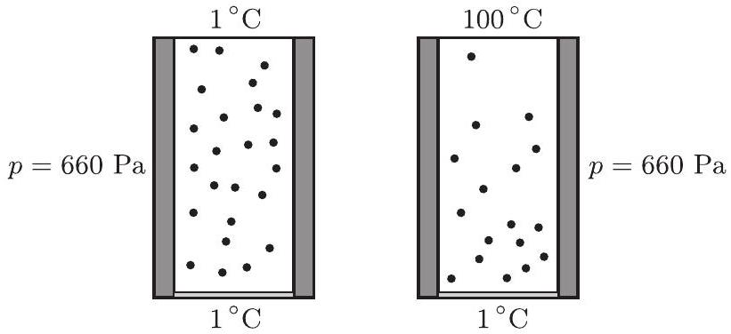
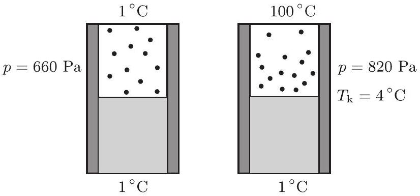

2. feladat. Egy függőlegesen álló, henger alakú zárt tartály magassága legyen mondjuk 20 cm ! Tegyük fel, hogy a tartály falának és belsố tartalmának hốmérséklete huzamos ideje $T = 1 ^ { \circ } \mathrm { C } !$ A tartalom pedig egy, a tartály alaplapját borító papírvékonyságú vízréteg és fölötte ennek a telített gốze, más semmi. Az oldalfalat hốszigetelőnek tekinthetjük, az alap- és fedốlap azonban igen jó hốvezetố vékony fémlemez, amelyeknek a hốmérsékletét kívülrốl szabályozhatjuk.

A lehetóséggel élve emeljük a fedólap hómérsékletét $T _ { f } = 100 ^ { \circ } \mathrm { C }$-ra, miközben az alaplap hốmérsékletét $T = 1 ^ { \circ } \mathrm { C }$-on tartjuk, és gondoskodjunk róla, hogy ezek az értékek elég sokáig így maradjanak! Várjuk meg, amíg az edényben kialakul a víz, illetve a góz új stacionárius állapota, amely már nem változik tovább!
a) A korábbi egyensúlyi állapothoz képest megváltozott-e említésre méltó mértékben a gőzállapotban lévố vízmolekulák száma, és ha igen, akkor nốtt vagy csökkent?
b) Vajon mi lenne a válasz, ha a kezdeti állapotban a vízréteg magassága 10 cm lenne?
(Károlyházy Frigyes)

Megoldás. Ha egy folyadék saját telített gőzével érintkezik, akkor a gőz nyomása csak közös hőmérsékletüktől függ. Az alul levő 1 °C-os víz felett a gőz nyomása tehát mindkét esetben ugyanannyi. (A táblázatból interpolációval leolvasható ennek aktuális értéke: 660 Pa .)

A gőznyomás az egész edényben ugyanakkora, de abban az esetben, ha a hőmérséklet felfelé emelkedik, a gőz súrúsége felfelé csökken. (Szintén a táblázatból olvasható ki, hogy az $1 ^ { \circ } \mathrm { C }$-os telített gőz sứrứsége $5,2 \mathrm {~g} / \mathrm { m } ^ { 3 }$, amiből egy átlagosan 50,5 °C-os gőz súrúśégére „ideális gáz közelítésben” $4,4 \mathrm {~g} / \mathrm { m } ^ { 3 }$ adódik.)

A gőz új stacionárius (időben állandó) állapotában tehát a gőz átlagos sürúsége kisebb lett, vagyis a gőzállapotban levő vízmolekulák száma csökkent (2. ábra)!

2. ábra

b) Ha a vízréteg magassága kezdetben 10 cm, a víz kitölti az edény felét. Felette azonban ugyanúgy 1 °C hőmérsékletú és 660 Pa nyomású telített gőz van, mint az $a$ ) esetben.

Amikor viszont a fedőlap hőmérsékletét $100 ^ { \circ } \mathrm { C }$-ra emeljük, már nem mondhatjuk, hogy az egész víz $1 ^ { \circ } \mathrm { C }$-os marad, ugyanúgy, mint amikor „papírvékonyságú" volt. Azt se állíthatjuk persze, hogy jelentősen felmelegszik a víz felső rétege, mivel a víz sokkal jobb hóvezető, mint a vízgő́z. Mennyire melegszik hát fel?

Táblázatból kiolvasható, hogy a vízgőz hóvezetési együtthatója

$$
\lambda _ { \text {gőz } } = 18,0 \cdot 10 ^ { - 3 } \frac { \mathrm {~J} } { \mathrm {~m} \mathrm {~K} \mathrm {~s} } ,
$$

míg a víz hóvezetési együtthatója

$$
\lambda _ { \text {víz } } = 0,587 \frac { \mathrm {~J} } { \mathrm {~m} \mathrm {~K} \mathrm {~s} } = 587 \cdot 10 ^ { - 3 } \frac { \mathrm {~J} } { \mathrm {~m} \mathrm {~K} \mathrm {~s} } .
$$

Mivel a vízréteg és felette a vízgőz ugyanolyan (10 cm) magas, és a kialakuló hőmérsékletkülönbségek fordítva arányosak a hóvezetési együtthatókkal, ezért a víz tetejének és a vele érintkezó vízgőznek a közös hómérsékletét $T _ { \mathrm { k } }$-val jelölve felírhatjuk:

$$
\frac { T _ { \mathrm { k } } - 1 ^ { \circ } \mathrm { C } } { 100 ^ { \circ } \mathrm { C } - T _ { \mathrm { k } } } = \frac { \lambda _ { \text {gőz } } } { \lambda _ { \text {víz } } } = \frac { 18 \cdot 10 ^ { - 3 } } { 587 \cdot 10 ^ { - 3 } } .
$$

Ennek alapján kapjuk $T _ { \mathrm { k } }$-ra a 4 °C-os értéket, amit már a 3. ábrán is feltüntettünk.

3. ábra

Ezek után a táblázatból extrapolációval kiolvashatjuk a 4 °C-hoz tartozó telítési gőznyomás nagyságát: 820 Pa. Ez is szerepel már az ábrán.

Hasonlóképpen kiolvashatjuk a telített vízgő́z súrúségének értékét $4 ^ { \circ } \mathrm { C }$-on, ez $6,4 \mathrm {~g} / \mathrm { m } ^ { 3 }$. A nyomás az egész gőztérben 820 Pa lesz, a gőz súrúsége azonban csak legalul $6,4 \mathrm {~g} / \mathrm { m } ^ { 3 }$, felfelé egyre kevesebb. Megbecsülhetjük az átlagos súrúséget, újra csak ideális gáznak tekintve a vízgőzt, amely átlagosan 50,5 °C hőmérsékletű:

$$
\varrho = \frac { 274 } { 323,5 } \cdot 6,4 \frac { \mathrm {~g} } { \mathrm {~m} ^ { 3 } } = 5,4 \frac { \mathrm {~g} } { \mathrm {~m} ^ { 3 } } .
$$

Ez viszont még mindig több, mint az $1 { } ^ { \circ } \mathrm { C }$-hoz tartozó $5,2 \mathrm {~g} / \mathrm { m } ^ { 3 }$ érték, vagyis ebben az esetben a gőzállapotban levő vízmolekulák száma nốtt!

Kiegészítés: Számításunkban eltekintettünk a víz sürúségváltozásától, amely persze elhanyagolható a vízgő́z sürúségváltozásához képest. Mégis okozhat egy kis galibát, ha figyelembe vesszük, hogy a 4 °C-os legfelső vízréteg súrúsége nagyobb, mint az alatta levőké. Ezáltal a víz mechanikailag instabillá válik az edényben, s az egyensúlynak kis megzavarása is áramlásokat idézhet elő. Ha valamelyik versenyző erre is utalt volna a dolgozatában, a versenybizottság plusz pontokkal jutalmazta volna, de senkinek se jutott ez akkor eszébe. Hasonlóképpen figyelmen kívül hagyta mindenki a 100 °C-os felső lap hősugárzásának hatását a vízréteg hőmérsékletére, azonban ez a hatás nem is olyan jelentős, hogy módosítaná a végső választ: az $a )$ esetben csökken, a $b$ ) esetben nő a vízgőz molekuláinak száma.
