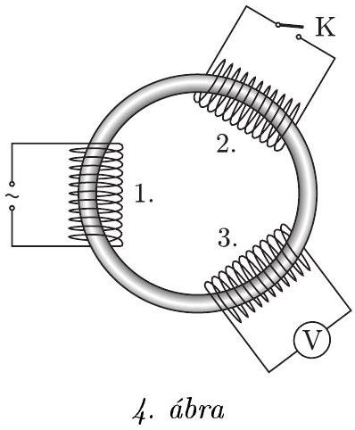

3. feladat. Egy toroid (úszógumi) alakú „sovány" vasmagra szimmetrikus elrendezésben három egyforma, „kövér” elektromágneses tekercs van felfũzve a 4. ábra szerint. Az elsó tekercsre váltóáramú feszültségforrást kapcsolunk, a második tekercs kivezetéseit szabadon hagyjuk, a harmadik tekercs csatlakozóira pedig voltmérốt kötünk. Ekkor a voltmérő a feszültségforrás effektív értékének a felét mutatja.

Ezután a második tekercs kivezetéseit a K kapcsolóval rövidre zárjuk. Mit mutat ebben az esetben a voltmérô?
Útmutatás: A tekercsek ohmos ellenállása elhanyagolható, a feszültségforrást és a voltmérốt ideálisnak tekinthetjük. A vasmag mágneses permeabilitása nem függ a mágneses fluxustól.
(Honyek Gyula)
Megoldás. A könnyebb áttekinthetőség végett a tekercseket már a feladat ábráján megszámoztuk.
A szimmetrikus elrendezés miatt (a középiskolai képlettár jelöléseit követve) a tekercsek önindukciós és kölcsönös indukciós együtthatói között az alábbi összefüggéseket írhatjuk fel:

$$
\begin{array} { l l }
L _ { 11 } = L _ { 22 } = L _ { 33 } , & \text { jelöljük } L \text {-lel; } \\
L _ { 12 } = L _ { 21 } = L _ { 13 } = L _ { 31 } = L _ { 23 } = L _ { 32 } , & \text { jelöljük } M \text {-mel. }
\end{array}
$$

Tekintsük az egyes tekercsekben indukált feszültségeket! Minthogy $I _ { 2 } = 0$, mert a kapcsoló nyitva van, valamint $I _ { 3 } \approx 0$, mert a voltmérő ellenállása nagyon nagy, csupán az $I _ { 1 }$ áram változása indukál feszültséget.

Az 1. tekercsben $U _ { 1 } = L \frac { \Delta I _ { 1 } } { \Delta t }$, a 3. tekercsben pedig $U _ { 3 } = M \frac { \Delta I _ { 1 } } { \Delta t }$. A feladat szövege szerint $U _ { 3 } = \frac { U _ { 1 } } { 2 }$, vagyis $M =$ $\frac { L } { 2 }$.

Zárjuk a kapcsolót! Ekkor már a 2. tekercsben is fog áram folyni, vagyis az egyes tekercsekben indukált feszültségek így írhatók fel:

$$
\begin{aligned}
& U _ { 1 } = L \frac { \Delta I _ { 1 } } { \Delta t } + M \frac { \Delta I _ { 2 } } { \Delta t } , \\
& U _ { 2 } = M \frac { \Delta I _ { 1 } } { \Delta t } + L \frac { \Delta I _ { 2 } } { \Delta t } , \\
& U _ { 3 } = M \frac { \Delta I _ { 1 } } { \Delta t } + M \frac { \Delta I _ { 2 } } { \Delta t } .
\end{aligned}
$$

Azt kell észrevennünk, hogy a rövidzár miatt $U _ { 2 } = 0$. Ezt felhasználva a két áramváltozási sebesség között adódik egy egyszerú összefüggés:

$$
\frac { \Delta I _ { 2 } } { \Delta t } = - \frac { M } { L } \frac { \Delta I _ { 1 } } { \Delta t } .
$$

Képezzük az $\frac { U _ { 3 } } { U _ { 1 } }$ hányadost:

$$
\frac { U _ { 3 } } { U _ { 1 } } = \frac { M - \frac { M ^ { 2 } } { L } } { L - \frac { M ^ { 2 } } { L } } = \frac { 1 } { 3 } .
$$

(Az utolsó lépésnél figyelembe vettük, hogy $M = L / 2$ ).
Tehát a kapcsoló zárása után a voltmérő a feszültségforrás effektív értékének harmadát fogja mutatni.
Kiegészítés: A vasmag permeabilitásának állandóságát akkor használtuk fel, amikor feltételeztük a tekercsek induktivitásának és a kölcsönös indukciós együtthatóknak az állandóságát, vagyis hogy pl. $M = L / 2$ akkor is fennáll, ha zárjuk a kapcsolót. Szokatlan volt a feladatban, hogy ebben a tipikusan transzformátoros összeállításban a feszültségek aránya lényegesen eltér a menetszámok arányától. A mindennapi gyakorlatban ez jól ismert jelenség, inkább az tekinthetó idealizációnak, hogy az említett két arány megegyezik. A mágneses mező „kiszóródása” a vasmagból általában elkerülhetetlen, ha nem is olyan jelentős mindig, mint most, ebben a feladatban.

## A verseny eredménye

Elsố díjat és 30 ezer forint pénzjutalmat vehetett át Budai Ádám, a BME fizika BSc szakos hallgatója, aki a miskolci Földes Ferenc Gimnáziumban érettségizett mint Bíró István tanítványa; olimpiai szakkörvezetője Zámborszky Ferenc volt.

Második díjat és 20 ezer forint pénzjutalmat hárman kaptak: Jéhn Zoltán, a BME fizika BSc szakos hallgatója, aki Pécsett, a PTE Babits Mihály Gyakorló Gimnáziumban érettségizett, tanára a gimnáziumban Koncz Károly, az olimpiai szakkörön Kotek László volt; Kalina Kende, a ELTE matematika BSc szakos hallgatója, aki a Fazekas Mihály Fốvárosi Gyakorló Gimnáziumban érettségizett Horváth Gábor, Csefkó Zoltán és Szokolai Tibor tanítványaként; Szabó Attila, a pécsi Leốwey Klára Gimnázium 11. évf. tanulója, tanára a gimnáziumban Simon Péter, az olimpiai szakkörön Kotek László.

Harmadik díjat és 15-15 ezer forint pénzjutalmat vehetett át két versenyző: Bolgár Dániel, a pécsi Leốwey Klára Gimnázium 12. évf. tanulója, tanárai Almási László és Simon Péter; Kovács Péter, az ELTE Apáczai Csere János Gyakorló Gimnáziumának 12. évf. tanulója, Pákó Gyula tanítványa.

Hárman kaptak dicséretet és 10-10 ezer forint értékú könyvjutalmat: Batki Bálint, a BME fizika BSc szakos hallgatója, aki az ELTE Apáczai Csere János Gyakorló Gimnáziumban érettségizett mint Zsigri Ferenc tanítványa; Forman Ferenc, az ELTE Radnóti Miklós Gyakorló Gimnáziumának 10. évf. tanulója, Honyek Gyula tanítványa; Jenei Márk, a Fazekas Mihály Fóvárosi Gyakorló Gimnázium 11. évf. tanulója, Dvorák Cecília és Csefkó Zoltán tanítványa.

## Ünnepélyes díjkiosztás

2011. november 25-én délután 3 órai kezdettel került sor az ünnepélyes eredményhirdetésre és díjkiosztásra. A már jól bevált hagyományt követve először az 50 , majd a 25 évvel ezelőtti Eötvös-verseny feladatainak felidézésére került sor. Az akkori nyertesek közül többen is eljöttek, szóltak néhány szót emlékeikről, azóta befutott pályájukról.

Zakariás László 1961-ben a piaristáknál érettségizett. Az Elektronikus Mérőkészülékek Gyárának dolgozójaként nyerte meg az Eötvös-versenyt, mivel a BME-re nem vették fel. Így emlékezett vissza a fél évszázaddal ezelőtt történtekre: „A Müszaki Egyetemre második próbálkozásra se vettek fel. Fellebbeztünk. A fellebbezést elutasították. A minisztériumi fellebbezéshez csatoltuk az Eötvös-verseny eredményét. Szeptember végén, a születésnapomon, levél érkezett a minisztériumból: Örömmel értesítjük, hogy felvételt nyert a Budapesti Müszaki Egyetem Villamosmérnöki Karára. Én voltam a világ legboldogabb embere. Tisztelettel és hálával gondolok Kovács Mihály tanár úrra." Fritz József Mosonmagyaróvárról fizikusnak jelentkezett az ELTE-re, Molnár Emil a győri Révai Gimnáziumból matematikafizika szakos tanárnak. Mindkettőjüket felvették. Fritz József ma már matematikus akadémikus, Molnár Emil a BME Geometria tanszékének vezető́jeként ment nyugdíjba. Mindhárman hálával emlékeztek vissza tanáraikra, akik megszerettették velük a fizikát, a matematikát, felkészítették őket a versenyre.

A 25 évvel ezelőtti Eötvös-versenynek két első helyezettje volt: Kaiser András és Kohári Zsolt. Mindketten eljöttek, szóltak is a mai nyertesekhez. A többi díjazott közül Drasny Gábor és Gyuris Viktor az Egyesült Államokból levélben üdvözölték a sikeres versenyzőket és dicsérték egykori fizikatanárukat, Horváth Gábort. Leveleiket a versenybizottság tagjai olvasták fel.

Az idei Eötvös-verseny díjait Kroó Norbert akadémikus, az Eötvös Loránd Fizikai Társulat elnöke, Kürti Jenő professzor, a Társulat fótitkára és a verseny lebonyolítását és díjait anyagilag támogató MOL képviseletében Csernik Kornél adta át.

A díjazott versenyzők tanárai a Vince Kiadó és a Typotex Kiadó könyvei közül válogathattak, és jelentős kedvezménnyel vehetnek majd részt a 2012. évi Fizikatanári Ankéton.

Az ünnepélyes díjkiosztást követő, a RAMOSOFT Zrt. támogatásával lebonyolított, jó hangulatú állófogadás résztvevői között ott voltak nemcsak az idei, a 25 és 50 évvel ezelőtti díjazottak, de megjelent a 49 évvel ezelőtti Eötvösverseny egyik nyertese is.

Remélhetőleg jövőre is találkozhatunk vele.
