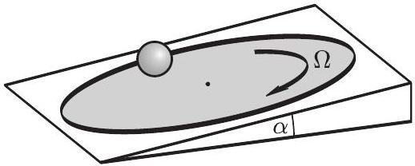
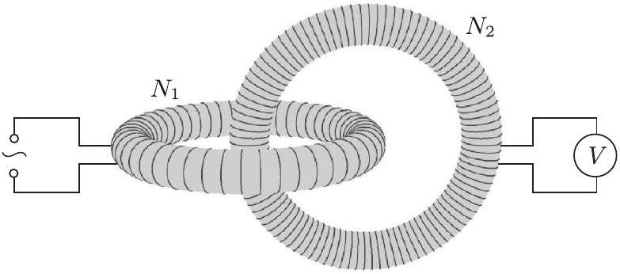

## Beszámoló a 2012. évi Eötvös-versenyről

## Radnai Gyula

2012. október 12-én délután 3 órai kezdettel került sor a háború utáni 64. Eötvös-versenyre. A versenyen részt vehetett bárki, aki 2012-ben fejezte be középiskolai tanulmányait, vagy ebben az évben is középiskolai tanuló volt. Az öt óra (300 perc) megoldási idő alatt mobiltelefon és laptop kivételével bármely magukkal hozott segédeszközt (könyvet, füzeteket, táblázatokat, zsebszámológépet) használhattak a versenyzők.

Budapesten 56, Pécsett 12, Debrecenben 11, Veszprémben 8, Nagykanizsán 6, Miskolcon, Szegeden és Szekszárdon 4-4, Egerben 3, Székesfehérváron 2, Kecskeméten 1 dolgozat született. Négy városban (Békéscsabán, Gyórben, Nyíregyházán és Szombathelyen) hiába várták a verseny rendezői a diákokat, egyetlen versenyzó́ se jelent meg a verseny meghirdetett helyszínén. A vidéki városokban - tavalyhoz hasonlóan idén is - összesen kevesebb versenyző volt, mint Budapesten.

A 111 versenyző közül 14-en voltak az ELTE, ugyancsak 14-en a BME elsőéves hallgatói. Egyikük az Amerikai Egyesült Államokban érettségizett. Hét versenyző járt Veszprémben a Pannon Egyetemre, Miskolcon két, Pécsett egy versenyző volt egyetemista. Sajnos sem debreceni, sem szegedi egyetemi hallgató nem volt a versenyzők között.

Középiskolai versenyzők legtöbben ebben az évben is a Fóvárosi Fazekas Mihály Gyakorlóiskolából jöttek. Közülük négyen voltak 12. osztályosok, heten 11.-esek, sőt volt négy 10. osztályos versenyző, akik közül hárman is szépen szerepeltek.

A feladatokat az Eötvös-versenybizottság túzte ki, és a versenyzők dolgozatait is ugyanez a bizottság értékelte. Tagjai Honyek Gyula és Vigh Máté, elnöke Radnai Gyula volt. Károlyházy Frigyes, aki több mint fél évszázadon át volt tagja a versenybizottságnak, már nem tudott részt venni a munkában, 2012. július 2-án, 83 éves korában elhunyt.

Ismertetjük a feladatokat és azok megoldását.

1. feladat. Egy sík, érdes felületǘ, a vízszinteshez képest $\alpha$ szögben döntött korong egyenletesen, $\Omega$ szögsebességgel forog. Egy bứvész a forgó korong közepére egy $R$ sugarú, tömör gumilabdát helyez, majd megfeleló irányban elgurítja. A közönség legnagyobb ámulatára a labda középpontja ezután egyenes vonalú, egyenletes mozgást végez, amit mindaddig folytat, amíg a labda a forgó korong peremére ér. (A labda mindvégig tisztán gördül, a korong szögsebessége nem változik.)

1. ábra

Adjunk fizikai magyarázatot a furcsa jelenségre! Milyen irányban és milyen kezdőfeltételekkel kell indítania a bữvésznek a labdát, hogy a mutatvány sikerüljön?
(Vigh Máté)

Megoldás. Ismert mennyiségek:
$\alpha$ a korong dólésszöge;
$\Omega$ a korong szögsebessége;
$R$ a labda sugara.
Szükség lehet még a következókre:
$m$ a labda tömege;
$\Theta = \frac { 2 } { 5 } m R ^ { 2 }$ a labda tehetetlenségi nyomatéka a középpontján átmenő tengelyre vonatkozólag;
$S$ a labdára ható súrlódási erő;
$N$ a labdára ható nyomóerő;
$v _ { 0 }$ a labda (tömeg)középpontjának kezdősebessége;
$\omega _ { 0 }$ a labda kezdeti szögsebessége.
A labda tömegközéppontja egyenes vonalú egyenletes mozgást végez, miközben a nyomóerő, a súrlódási erő és a nehézségi eró hat rá. Ezek eredője tehát zérus kell legyen. Ez csak úgy lehet, ha a nyomóerő nagysága $N = m g \cos \alpha$ és a súrlódási erő nagysága $S = m g \sin \alpha$. A súrlódási erőnek merőlegesnek kell lennie a sebességre, mert különben gyorsítaná vagy lassítaná azt. Ez pedig azt jelenti, hogy a labdának vízszintesen (felülről nézve balra) kell gurulnia, hiszen $\boldsymbol { S }$ a lejtő síkjában felfelé mutató vektor!

A megoldás kulcsa, hogy a labda forgását két, egymásra meróleges tengely körüli forgás eredőjeként fogjuk fel.

1. A korong síkjával párhuzamos, lejtés irányú tengely körül a labda egyenletesen forog:

$$
\omega _ { 1 } = \omega _ { 0 } = \frac { v _ { 0 } } { R }
$$

2. A korong síkjával párhuzamos, vízszintes tengely körül a labda gyorsulva forog:

$$
\omega _ { 2 } = \frac { r \Omega } { R } , \quad \text { ahol } \quad r = v _ { 0 } t
$$

A szöggyorsulás, mivel $\omega _ { 2 } ( t )$ lineáris függvénye az időnek:

$$
\beta = \frac { \omega _ { 2 } } { t } = \frac { v _ { 0 } \Omega } { R } .
$$

Erre a forgásra a dinamika alaptörvénye:

$$
\begin{aligned}
\sum M & = \Theta \beta , \\
S R & = \frac { 2 } { 5 } m R ^ { 2 } \frac { v _ { 0 } \Omega } { R } , \\
R m g \sin \alpha & = \frac { 2 } { 5 } m R ^ { 2 } \frac { v _ { 0 } \Omega } { R } .
\end{aligned}
$$

Ebből kifejezhető $v _ { 0 }$ és $\omega _ { 0 }$ is:

$$
\begin{aligned}
v _ { 0 } & = \frac { 5 } { 2 } \frac { g \sin \alpha } { \Omega } , \\
\omega _ { 0 } & = \frac { v _ { 0 } } { R } = \frac { 5 } { 2 } \frac { g \sin \alpha } { \Omega R } .
\end{aligned}
$$

Megkaptuk a szükséges kezdőfeltételeket. Érdekes, hogy sem $v _ { 0 }$, sem $\omega _ { 0 }$ nem függ a labda $m$ tömegétől, $v _ { 0 }$ pedig még a labda $R$ sugarától sem!

Megjegyzések. 1. Az a gondolat, hogy egy labda forgása két forgás eredójeként fogható fel, már szerepelt egyszer az Eötvösversenyen. 1972-ben ez volt a 3. feladat:
„Felfújt, könnyǘ müanyag labdát találomra megpörgetve sima vízfelületre ejtünk. Azt tapasztaljuk, hogy mielőtt megáll, rendszerint függốleges tengely körül forog. Mi a jelenség magyarázata?"

A megoldás az, hogy a labda bármely tengely körüli forgása egy függőleges és egy vízszintes tengely körüli forgás eredójeként tárgyalható. A vízszintes tengely körüli forgást a súrlódás sokkal jobban fékezi, ezért marad meg végül mindig a függőleges tengely körüli forgás.
2. Az eredményhirdetéskor Vigh Máté levetítette azt a videót, amely több variációban mutatta be a feladatban leírt jelenséget. A bemutatást a közönség élénk figyelemmel kísérte.
2. feladat. Egy 10 cm hosszú és 2 cm vastag, hengeres üvegrúd mindkét domború vége egy-egy félgömb. A rúd tengelye mentén, egyik végétốl mekkora távolságra helyezzünk el egy pontszerũ fényforrást a levegôben, ha azt akarjuk, hogy a rúd másik végétól a) ugyanakkora, b) kétszer akkora távolságra találkozzanak az onnan kilépő, a tengellyel kis szöget bezáró fénysugarak? Az üveg levegőre vonatkoztatott törésmutatója 1,5.

(Radnai Gyula)

Megoldás. a) Ha azt szeretnénk, hogy a rúd másik végétő̌l ugyanakkora távolságra találkozzanak az onnan kilépő fénysugarak, akkor egy nyilvánvaló megoldás erre az, hogy a rúd egyik külső fókuszába helyezzük el a pontszerú fényforrást. Az ebből kiinduló fénysugarak a rúd belsejében párhuzamosan haladnak, majd a másik végénél kilépve újra fókusztávolságnyira egyesülnek.

Tovább egyszerúsíti a megoldást, ha gondolatban levágjuk a rúd végeit. Ezáltal két vékony lencsét és közöttük egy „plánparalel” réteget kapunk (3. ábra).

3. ábra

A vékony, síkdomború lencse fókusztávolságára

$$
\frac { 1 } { f } = ( n - 1 ) \left( \frac { 1 } { R _ { 1 } } + \frac { 1 } { R _ { 2 } } \right) , \quad \operatorname { most } \quad R _ { 2 } \rightarrow \infty .
$$

Így

$$
f = \frac { R } { n - 1 } = \frac { 1 \mathrm {~cm} } { 1,5 - 1 } = 2 \mathrm {~cm} .
$$

Van azonban egy másik lehetséges megoldás is! Ekkor a fénysugarak nem párhuzamosan haladnak a rúd belsejében, hanem a rúd közepén találkoznak, majd ebből a pontból kiindulva érik el a rúd másik végét. Ott kilépve éppen olyan messze találkoznak, mint amilyen távolságra voltak a rúd elsó végétól, amikor elindultak. Ez is egy szimmetrikus sugármenet, de most már nem segít a megoldásban az előbbi „felszeletelés”.

Vizsgáljuk meg általánosan az első felület adta leképezést! Legyen a kiindulási $T$ tárgypont a rúdvégtől $t$ távolságra, keletkezzék ennek $K$ képe a rúd belsejében $k$ távolságra a leképező rúdvégtől. További jelölések a 4. ábrán láthatók.

4. ábra

Az ábráról leolvasható, hogy $\alpha = \varepsilon + \gamma$, valamint $\gamma = \beta + \delta$. Mindegyik szög külön-külön is kicsi, ezért a Snellius-Descartes-törvény felhasználásával

$$
n = \frac { \sin \alpha } { \sin \beta } \approx \frac { \alpha } { \beta } = \frac { \varepsilon + \gamma } { \gamma - \delta } .
$$

Ebből

$$
\begin{gathered}
n ( \gamma - \delta ) = \varepsilon + \gamma , \\
n \gamma - \gamma = \varepsilon + n \delta , \\
( n - 1 ) \frac { h } { R } = \frac { h } { t } + n \frac { h } { k } , \\
\frac { 1 } { t } + \frac { n } { k } = ( n - 1 ) \frac { 1 } { R } \quad \Rightarrow \quad \frac { 1 } { t } + \frac { 1,5 } { 5 \mathrm {~cm} } = \frac { 0,5 } { 1 \mathrm {~cm} } \quad \Rightarrow \quad t = 5 \mathrm {~cm} .
\end{gathered}
$$

A kétféle sugármenet tehát a következő:

5. ábra

b) Tekintsük a 6. ábrát!

6. ábra

Az előző gondolatmenethez hasonlóan most is meghatározhatnánk a kis szöget bezáró fénysugarakra érvényes leképezési törvényeket. Helykímélés céljából ezt itt nem tesszük meg, de bárki ellenőrizheti, hogy a két végnél a következóket kapjuk:

$$
\frac { 1 } { t _ { 1 } } + \frac { n } { k _ { 1 } } = \frac { n - 1 } { R } , \quad \text { illetve } \quad \frac { n } { t _ { 2 } } + \frac { 1 } { k _ { 2 } } = \frac { n - 1 } { R } .
$$

(Megjegyezni úgy lehet, hogy mindig azt a kép-, illetve tárgytávolságot kell osztani $n$-nel, amelyik az üvegben van.)
A keresett $t _ { 1 }$ távolságot $x$-szel jelölve:

$$
\frac { 1 } { x } + \frac { 1,5 } { k _ { 1 } } = \frac { 0,5 } { 1 \mathrm {~cm} } , \quad \text { illetve } \quad \frac { 1,5 } { 10 \mathrm {~cm} - k _ { 1 } } + \frac { 1 } { 2 x } = \frac { 0,5 } { 1 \mathrm {~cm} } .
$$

Ebből $x$-re másodfokú egyenlet adódik, megoldása:

$$
x _ { 1 } = 4 \mathrm {~cm} ; \quad x _ { 2 } = 1,25 \mathrm {~cm} .
$$

Ellenőrzésképpen kiszámíthatjuk az új képpontok helyzetét. Eredményünket a 7. ábra mutatja.

$$
\begin{aligned}
& K _ { 1 } = T _ { 2 } \\
& \quad - 5 \mathrm {~cm} \quad 1,25 \mathrm {~cm}
\end{aligned}
$$

7. ábra. $x = 4 \mathrm {~cm}$ esetén $k _ { 1 } = 6 \mathrm {~cm} , t _ { 2 } = 4 \mathrm {~cm} , k _ { 2 } = 8 \mathrm {~cm}$. $x = 1,25 \mathrm {~cm}$ esetén $k _ { 1 } = - 5 \mathrm {~cm} , t _ { 2 } = 15 \mathrm {~cm} , k _ { 2 } = 2,5 \mathrm {~cm}$

Megjegyzések. 1. További megoldásokat is kaphatnánk, ha nemcsak a második rúdvégen átmenő, hanem az innen visszaverődő fénysugarakat is vizsgálnánk. Ezek egy része az első felületről is visszaverődik, és újra a második felület felé halad. Itt egy részük kilép, másik részük visszaverődik. Vagyis páros számú visszaverődés után újabb és újabb, egyre halványabb képpontok keletkeznek a rúd másik végéról történő kilépés után a levegőben. Ennek vizsgálatát természetesen nem várta el a versenybizottság.
2. Több versenyző próbálkozott olyan megoldással, amikor az üveghenger oldala is részt vesz a leképezésben. Ez hibás gondolat, mivel a rúd tengelyén lévő pontból kiinduló és a tengellyel kis szöget bezáró fénysugarak az üvegben is a tengely közelében haladnak, nem érhetik el a henger oldalát.
3. feladat. Két ugyanolyan méretũ, csak a menetszámukban különbözö́, egyenletes tekercselésü, $N _ { 1 }$ és $N _ { 2 }$ ( $> N _ { 1 }$ ) menetes toroid tekercs egymásba van fữzve az ábra szerint. (A középkörök sikjai merốlegesek egymásra.)
a) Melyik tekercs kivezetései között indukálódik nagyobb feszültség, ha a másik tekercsben adott effektív áramerósségü és frekvenciájú váltakozó áram folyik?
b) $A z N _ { 1 }$ menetes tekercsre $U _ { \text {eff } }$ effektív értékű, hálózati váltakozó feszültséget kapcsolunk, a másik ( $N _ { 2 }$ menetes) tekercs kivezetéseire pedig ideálisnak tekinthetố voltmérốt kötünk. Mekkora effektív feszültséget jelez a müszer? Legyen mondjuk $N _ { 1 } = 100 , N _ { 2 } = 900 , U _ { \text {eff } } = 230 \mathrm {~V}$ !

8. ábra

Megoldás. Azt, hogy egy tekercsben folyó áram változása mekkora feszültséget kelt egy másik tekercsben, a két tekercs közötti $M$ kölcsönös indukciós együttható felhasználásával adhatjuk meg:

$$
U _ { 2 } = M \frac { \Delta I _ { 1 } } { \Delta t } .
$$

Vákuumban lévő tekercsek esetén - jó közelítéssel a légmagos tekercsek is ilyennek tekinthetők elektromos szempontból - a kölcsönös indukciós együtthatónak a két tekercsre vonatkozóan szimmetrikusnak kell lennie, vagyis fenn kell állnia a következő összefüggésnek is:

$$
U _ { 1 } = M \frac { \Delta I _ { 2 } } { \Delta t } .
$$

Most már válaszolhatunk az $a$ ) kérdésre: Bármelyik tekercsben folyik adott effektív áramerősségú és frekvenciájú váltakozó áram, a másik tekercsben mindig ugyanakkora feszültség indukálódik!

A b) kérdésre akkor tudunk válaszolni, ha meg tudjuk határozni a feladatban látható légmagos tekercspár kölcsönös indukciós együtthatóját. Ne felejtsük el: ennek ( $N _ { 1 } , N _ { 2 }$ )-ben szimmetrikus kifejezésnek kell lennie.

A megoldáshoz azt kell észrevennünk, hogy a feladatban a voltmérő által jelzett $U _ { 2 }$ feszültség fellépése két okra vezethető vissza.
I. Az (1) tekercs fluxusának változása hatással van a (2) tekercsre, ebben $U _ { 2 } ^ { ( \mathrm { I } ) }$ körfeszültséget indukál:

$$
U _ { 2 } ^ { ( \mathrm { I } ) } = \frac { \Delta \Phi _ { 1 } } { \Delta t } = \frac { \Delta \left( B A _ { 1 } \right) } { \Delta t } .
$$

Az (1) tekercsben létrejövő $B$ értékét a gerjesztési törvényből kaphatjuk meg, ha azt az (1) tekercs középkörére alkalmazzuk, figyelembe véve, hogy az $R _ { 1 }$ sugarú körlapot $N _ { 1 } I _ { 1 }$ áram metszi:

$$
B \cdot 2 \pi R _ { 1 } = \mu _ { 0 } N _ { 1 } I _ { 1 } , \quad \text { ebből } \quad B = \mu _ { 0 } \frac { N _ { 1 } I _ { 1 } } { 2 \pi R _ { 1 } } .
$$

Helyettesítsük be ezt $U _ { 2 } ^ { ( \mathrm { I } ) }$ kifejezésébe:

$$
U _ { 2 } ^ { ( \mathrm { I } ) } = \frac { \Delta \left( \mu _ { 0 } \frac { N _ { 1 } I _ { 1 } } { 2 \pi R _ { 1 } } A _ { 1 } \right) } { \Delta t } = \mu _ { 0 } \frac { N _ { 1 } A _ { 1 } } { 2 \pi R _ { 1 } } \frac { \Delta I _ { 1 } } { \Delta t } .
$$

Fontos összefüggéshez jutottunk, de itt a $\frac { \Delta I _ { 1 } } { \Delta t }$ előtt álló arányossági tényező még csak $N _ { 1 }$-től függ, ezért biztosan nem lehet a keresett kölcsönös indukciós együttható. Szükségünk van a már jelzett másik ok megvizsgálására is. Ez pedig a következő:
II. Az (1) tekercs szórt mágneses terének változása hatással van a (2) tekercsre, ebben

$$
U _ { 2 } ^ { ( \mathrm { II } ) } \left( = \sum _ { i } U _ { i 2 } ^ { ( \mathrm { II } ) } \right)
$$

körfeszültséget indukál.

$$
U _ { 2 } ^ { ( \mathrm { II } ) } = N _ { 2 } \frac { \Delta \left( \bar { B } _ { \mathrm { n } } A _ { 2 } \right) } { \Delta t } ,
$$

(ahol $\bar { B } _ { \mathrm { n } }$ a menetfelületre merőleges $B$ komponens nagyságának átlaga). Itt $U _ { i 2 } ^ { ( \mathrm { II } ) }$-vel jelöltük a második tekercs $i$ edik menetében indukálódó feszültséget, amely lehet, hogy kicsi a szórt mágneses tér gyengesége miatt, de összegezve az egész (2) tekercsre, már nem hanyagolható el. Ez a szórt mágneses fluxus a különböző menetekre más és más lehet, egy menetre vonatkozó átlagértékét jelöltük $\bar { B } _ { \mathrm { n } } A _ { 2 }$-vel.
$\bar { B } _ { \mathrm { n } }$ kiszámításához írjuk fel újra a gerjesztési törvényt, de most a (2) tekercs középkörére:

$$
\bar { B } _ { \mathrm { n } } \cdot 2 \pi R _ { 2 } = \mu _ { 0 } I _ { 1 }
$$

(mivel most az $R _ { 2 }$ sugarú körlapot egyetlen $I _ { 1 }$ áram metszi).
A II. ok miatt indukálódó körfeszültség tehát

$$
U _ { 2 } ^ { ( \mathrm { II } ) } = N _ { 2 } \frac { \Delta \left( \mu _ { 0 } \frac { I _ { 1 } } { 2 \pi R _ { 2 } } A _ { 2 } \right) } { \Delta t } = \mu _ { 0 } \frac { N _ { 2 } A _ { 2 } } { 2 \pi R _ { 2 } } \frac { \Delta I _ { 1 } } { \Delta t } .
$$

Most már felírhatjuk a voltmérőre jutó teljes feszültséget:

$$
U _ { 2 } = U _ { 2 } ^ { ( \mathrm { I } ) } + U _ { 2 } ^ { ( \mathrm { II } ) } .
$$

Használjuk ki, hogy a két tekercs csak menetszámában különbözik, vagyis $A _ { 1 } = A _ { 2 } = A$ és $R _ { 1 } = R _ { 2 } = R$, ekkor

$$
U _ { 2 } = \mu _ { 0 } \frac { \left( N _ { 1 } + N _ { 2 } \right) A } { 2 \pi R } \frac { \Delta I _ { 1 } } { \Delta t } .
$$

Megkaptuk a keresett kölcsönös indukciós együtthatót:

$$
M = \mu _ { 0 } \frac { \left( N _ { 1 } + N _ { 2 } \right) A } { 2 \pi R } ,
$$

és ez már valóban szimmetrikus $\left( N _ { 1 } , N _ { 2 } \right)$-ben!
Hogyan határozhatjuk meg $U _ { 2 }$ konkrét, numerikus értékét? Az ismert effektív értékú $U _ { 1 }$ feszültség és az (1) tekercsben folyó áram változási sebessége között az induktivitás, az (1) tekercs önindukciós együtthatója teremt kapcsolatot:

$$
U _ { 1 } = L _ { 1 } \frac { \Delta I _ { 1 } } { \Delta t } = \mu _ { 0 } \frac { N _ { 1 } ^ { 2 } A } { 2 \pi R } \frac { \Delta I _ { 1 } } { \Delta t } .
$$

Az előbb kaptuk:

$$
U _ { 2 } = M \frac { \Delta I _ { 1 } } { \Delta t } = \mu _ { 0 } \frac { \left( N _ { 1 } + N _ { 2 } \right) A } { 2 \pi R } \frac { \Delta I _ { 1 } } { \Delta t } .
$$

Ezek szerint

$$
\begin{aligned}
& \frac { U _ { 2 } } { U _ { 1 } } = \frac { M } { L _ { 1 } } = \frac { N _ { 1 } + N _ { 2 } } { N _ { 1 } ^ { 2 } } = \frac { 100 + 900 } { 100 ^ { 2 } } = \frac { 1 } { 10 } , \\
& U _ { 2 } = \frac { U _ { 1 } } { 10 } = \frac { 230 \mathrm {~V} } { 10 } = 23 \mathrm {~V} .
\end{aligned}
$$

Megjegyzések. 1. A megoldásban feltételeztük, hogy mindkét tekercsen ugyanolyan irányú (csavarodású) a tekercselés. Ha véletlenül nem ez a helyzet, akkor a voltméró által mutatott érték

$$
U _ { 2 } = \frac { N _ { 2 } - N _ { 1 } } { N _ { 1 } ^ { 2 } } U _ { 1 } = \frac { 800 } { 10000 } 230 \mathrm {~V} = 18,4 \mathrm {~V}
$$

lesz. Ennek felismerését - „észrevételét” - már nem várta el a versenybizottság.
2. Az eredményhirdetéskor Vankó Péter, az 1976-os Eötvös-verseny győztese, aki ma már a hazai fizikai diákolimpiai csapat vezetője, saját készítésú tekercsekkel és nagyfrekvenciás berendezéssel demonstrálta a feladatban leírt jelenséget. A kvantitatív kísérlet összeállításáért és bemutatásáért - melyben Vigh Máté segédkezett - külön köszönet illeti a BME docensét.
*
Az ünnepélyes eredményhirdetésre és díjkiosztásra 2012. november 16-án délután került sor az ELTE Konferenciatermében (ugyanott, ahol a budapesti versenyzők a dolgozatokat írták októberben.)

Mint az utóbbi években mindig, most is először az 50, illetve 25 évvel ezelőtti Eötvös-verseny feladatainak bemutatására került sor. A régi nyertesek közül elég sokan eleget tudtak tenni a meghívásnak, és szívesen emlékeztek vissza az akkori versenyre. 50 évvel ezelőtt két osztálytárs, Nagy Dénes Lajos és Szegi András a budapesti II. Rákóczi Ferenc Gimnáziumból holtversenyben nyerték el az I. díjat, III. díjat a szegedi Máté Eörs, dicséretet Góth László és Simonovits Miklós budapesti versenyzők kaptak. Mind az öten eljöttek, és jó hangulatban idézték fel 1962-es emlékeiket.

25 évvel ezelőtt a zsűri nem adott ki I. díjat, mivel nem volt olyan versenyző, aki mindhárom feladatot hibátlanul oldotta volna meg. Ráadásul az érettségizett versenyzők többsége „előfelvettként” 1 éves katonai kiképzésben kellett, hogy részt vegyen. Hódmezővásárhelyről vagy Lentiből a dolgozat megírására még csak elengedték óket, az eredményhirdetésre azonban már nem. A II. díjat nyert Gyuris Viktor, aki ma már az USA-ban él és dolgozik, hangulatos levélben számolt be a viszontagságos körülményekről. Levelét Honyek Gyula olvasta fel. A III. díjasok közül Cynolter Gábor, Fucskár Attila és Kiss Tamás jött el, a dicséretet kapott versenyzők közül Derényi Imre és Szokoly Gyula. Ök nemcsak emlékeiket elevenítették fel, de élvezettel kapcsolódtak be a mostani Eötvös-verseny feladatainak diszkussziójába is.

A versenybizottság elnöke ismertette a zsúri által elvárt megoldásokat, vezette a diszkussziót, majd a díjak és jutalmak átadására felkérte Kroó Norbertet, az Eötvös Loránd Fizikai Társulat elnökét és Kürti Jenót, a Társulat fótitkárát.

Első díjat nem adott ki a versenybizottság, sajnos a harmadik feladatot senkinek sem sikerült jól megoldania.
Második díjas lett Janzer Barnabás, a Fóvárosi Fazekas Mihály Gyakorlóiskola 10. évf. tanulója, Horváth Gábor tanítványa, és Szabó Attila, a pécsi Leówey Klára Gimnázium 12. évf. tanulója, Simon Péter és Kotek László tanítványa. Pénzjutalmuk 20-20 ezer forint.

Harmadik díjat, s vele 15-15 ezer forint jutalmat hárman vehettek át: Csősz Gábor, a Kecskeméti Református Gimnázium 12. évf. tanulója, Galambos Péter tanítványa; Juhász Péter, a Budapesti Piarista Gimnázium 11. évf. tanulója, Urbán János tanítványa; valamint Laczkó Zoltán, az ELTE fizika BSc szakos hallgatója, aki a szegedi Ságvári Endre Gimnáziumban érettségizett mint Gyốri István tanítványa.

Heten kaptak dicséretet: Béres Bertold, a BME fizika BSc szakos hallgatója, aki a budapesti Puskás Tivadar Távközlési Technikumban érettségizett mint Beregszászi Zoltán és Alapiné Ecseri Éva tanítványa; Fehér Zsombor, a Fóvárosi Fazekas Mihály Gyakorlóiskola 10. évf. tanulója, Horváth Gábor tanítványa; Homonnay Bálint, a Fốvárosi Fazekas Mihály Gyakorlóiskola 11. évf. tanulója, Horváth Gábor tanítványa; Kovács Péter, BME fizika BSc szakos hallgatója, aki az ELTE Apáczai Csere János Gyakorló Gimnáziumában érettségizett mint Zsigri Ferenc tanítványa; Olosz Balázs, a PTE Babits Mihály Gyakorló Gimnáziumának 10. évf. tanulója, Koncz Károly tanítványa; Öreg Botond, a Fóvárosi Fazekas Mihály Gyakorlóiskola 10. évf. tanulója, Horváth Gábor tanítványa, valamint Szigeti Bertalan György, a veszprémi Lovassy László Gimnázium 12. évf. tanulója, Varga Vince tanítványa.

Mind a díjazott, mind a dicséretes versenyzók 1-1 értékes könyvet is kaptak (Simonyi Károly: A fizika kultúrtörténete; J. D. Jackson: Klasszikus elektrodinamika; I. N. Bronstein: Matematikai kézikönyv). Az Eötvös-versenyre immár évek óta eredményesen felkészítő tanárt, Horváth Gábort, a versenybizottság javaslatára Lánczos Kornél hat kötetben összegyüjtött munkáival ajándékozta meg az Eötvös Loránd Fizikai Társulat.

A díjazott és dicséretet nyert diákok jelenlévő tanárai 1-1 múvészeti és 1-1 szakmai kiadványt választhattak a Vincze Kiadó, a Nemzeti Tankönyvkiadó, a Typotex Kiadó, valamint a MATFUND Alapítvány által felajánlott könyvek közül.

Befejezésül Kádár György és Kürti Jenố, a Társulat volt és jelenlegi fótitkára emlékezett meg néhány baráti szóval az elhunyt Károlyházy Frigyesről.

Zárszavában az elnök röviden értékelte az idei Eötvös-versenyt, és köszönetet mondott a verseny lebonyolítását anyagilag támogató MOL-nak, az ajándékkönyveket felajánló kiadóknak, valamint a záró állófogadást biztosító RA-MASOFT Zrt-nek. A nyertes diákokról készülő csoportképre ebben az évben öt 50 évvel ezelótti és öt 25 évvel ezelőtti nyertes is rákerült, hüen kifejezve a fizika szeretetének összetartó erejét.
