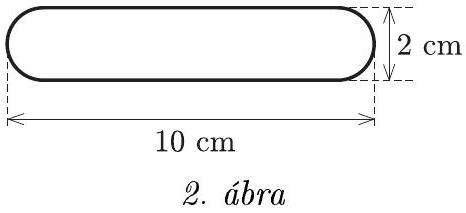
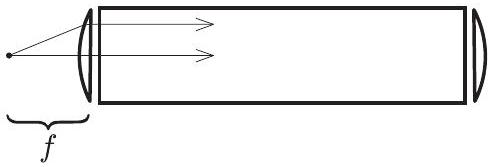
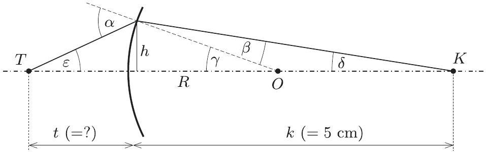
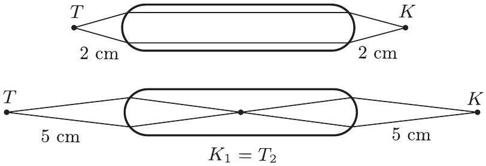
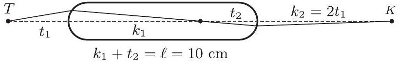
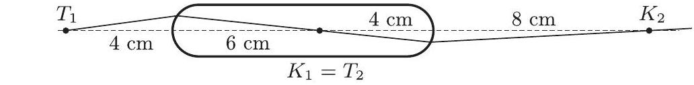

2. feladat. Egy 10 cm hosszú és 2 cm vastag, hengeres üvegrúd mindkét domború vége egy-egy félgömb. A rúd tengelye mentén, egyik végétốl mekkora távolságra helyezzünk el egy pontszerũ fényforrást a levegôben, ha azt akarjuk, hogy a rúd másik végétól a) ugyanakkora, b) kétszer akkora távolságra találkozzanak az onnan kilépő, a tengellyel kis szöget bezáró fénysugarak? Az üveg levegőre vonatkoztatott törésmutatója 1,5.

(Radnai Gyula)

Megoldás. a) Ha azt szeretnénk, hogy a rúd másik végétő̌l ugyanakkora távolságra találkozzanak az onnan kilépő fénysugarak, akkor egy nyilvánvaló megoldás erre az, hogy a rúd egyik külső fókuszába helyezzük el a pontszerú fényforrást. Az ebből kiinduló fénysugarak a rúd belsejében párhuzamosan haladnak, majd a másik végénél kilépve újra fókusztávolságnyira egyesülnek.

Tovább egyszerúsíti a megoldást, ha gondolatban levágjuk a rúd végeit. Ezáltal két vékony lencsét és közöttük egy „plánparalel” réteget kapunk (3. ábra).

3. ábra

A vékony, síkdomború lencse fókusztávolságára

$$
\frac { 1 } { f } = ( n - 1 ) \left( \frac { 1 } { R _ { 1 } } + \frac { 1 } { R _ { 2 } } \right) , \quad \operatorname { most } \quad R _ { 2 } \rightarrow \infty .
$$

Így

$$
f = \frac { R } { n - 1 } = \frac { 1 \mathrm {~cm} } { 1,5 - 1 } = 2 \mathrm {~cm} .
$$

Van azonban egy másik lehetséges megoldás is! Ekkor a fénysugarak nem párhuzamosan haladnak a rúd belsejében, hanem a rúd közepén találkoznak, majd ebből a pontból kiindulva érik el a rúd másik végét. Ott kilépve éppen olyan messze találkoznak, mint amilyen távolságra voltak a rúd elsó végétól, amikor elindultak. Ez is egy szimmetrikus sugármenet, de most már nem segít a megoldásban az előbbi „felszeletelés”.

Vizsgáljuk meg általánosan az első felület adta leképezést! Legyen a kiindulási $T$ tárgypont a rúdvégtől $t$ távolságra, keletkezzék ennek $K$ képe a rúd belsejében $k$ távolságra a leképező rúdvégtől. További jelölések a 4. ábrán láthatók.

4. ábra

Az ábráról leolvasható, hogy $\alpha = \varepsilon + \gamma$, valamint $\gamma = \beta + \delta$. Mindegyik szög külön-külön is kicsi, ezért a Snellius-Descartes-törvény felhasználásával

$$
n = \frac { \sin \alpha } { \sin \beta } \approx \frac { \alpha } { \beta } = \frac { \varepsilon + \gamma } { \gamma - \delta } .
$$

Ebből

$$
\begin{gathered}
n ( \gamma - \delta ) = \varepsilon + \gamma , \\
n \gamma - \gamma = \varepsilon + n \delta , \\
( n - 1 ) \frac { h } { R } = \frac { h } { t } + n \frac { h } { k } , \\
\frac { 1 } { t } + \frac { n } { k } = ( n - 1 ) \frac { 1 } { R } \quad \Rightarrow \quad \frac { 1 } { t } + \frac { 1,5 } { 5 \mathrm {~cm} } = \frac { 0,5 } { 1 \mathrm {~cm} } \quad \Rightarrow \quad t = 5 \mathrm {~cm} .
\end{gathered}
$$

A kétféle sugármenet tehát a következő:

5. ábra

b) Tekintsük a 6. ábrát!

6. ábra

Az előző gondolatmenethez hasonlóan most is meghatározhatnánk a kis szöget bezáró fénysugarakra érvényes leképezési törvényeket. Helykímélés céljából ezt itt nem tesszük meg, de bárki ellenőrizheti, hogy a két végnél a következóket kapjuk:

$$
\frac { 1 } { t _ { 1 } } + \frac { n } { k _ { 1 } } = \frac { n - 1 } { R } , \quad \text { illetve } \quad \frac { n } { t _ { 2 } } + \frac { 1 } { k _ { 2 } } = \frac { n - 1 } { R } .
$$

(Megjegyezni úgy lehet, hogy mindig azt a kép-, illetve tárgytávolságot kell osztani $n$-nel, amelyik az üvegben van.)
A keresett $t _ { 1 }$ távolságot $x$-szel jelölve:

$$
\frac { 1 } { x } + \frac { 1,5 } { k _ { 1 } } = \frac { 0,5 } { 1 \mathrm {~cm} } , \quad \text { illetve } \quad \frac { 1,5 } { 10 \mathrm {~cm} - k _ { 1 } } + \frac { 1 } { 2 x } = \frac { 0,5 } { 1 \mathrm {~cm} } .
$$

Ebből $x$-re másodfokú egyenlet adódik, megoldása:

$$
x _ { 1 } = 4 \mathrm {~cm} ; \quad x _ { 2 } = 1,25 \mathrm {~cm} .
$$

Ellenőrzésképpen kiszámíthatjuk az új képpontok helyzetét. Eredményünket a 7. ábra mutatja.

$$
\begin{aligned}
& K _ { 1 } = T _ { 2 } \\
& \quad - 5 \mathrm {~cm} \quad 1,25 \mathrm {~cm}
\end{aligned}
$$

7. ábra. $x = 4 \mathrm {~cm}$ esetén $k _ { 1 } = 6 \mathrm {~cm} , t _ { 2 } = 4 \mathrm {~cm} , k _ { 2 } = 8 \mathrm {~cm}$. $x = 1,25 \mathrm {~cm}$ esetén $k _ { 1 } = - 5 \mathrm {~cm} , t _ { 2 } = 15 \mathrm {~cm} , k _ { 2 } = 2,5 \mathrm {~cm}$

Megjegyzések. 1. További megoldásokat is kaphatnánk, ha nemcsak a második rúdvégen átmenő, hanem az innen visszaverődő fénysugarakat is vizsgálnánk. Ezek egy része az első felületről is visszaverődik, és újra a második felület felé halad. Itt egy részük kilép, másik részük visszaverődik. Vagyis páros számú visszaverődés után újabb és újabb, egyre halványabb képpontok keletkeznek a rúd másik végéról történő kilépés után a levegőben. Ennek vizsgálatát természetesen nem várta el a versenybizottság.
2. Több versenyző próbálkozott olyan megoldással, amikor az üveghenger oldala is részt vesz a leképezésben. Ez hibás gondolat, mivel a rúd tengelyén lévő pontból kiinduló és a tengellyel kis szöget bezáró fénysugarak az üvegben is a tengely közelében haladnak, nem érhetik el a henger oldalát.
