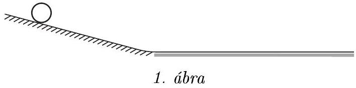
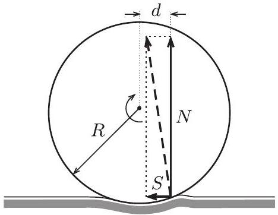
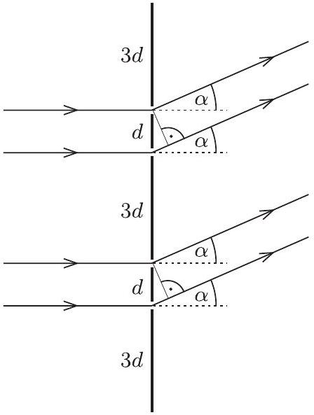
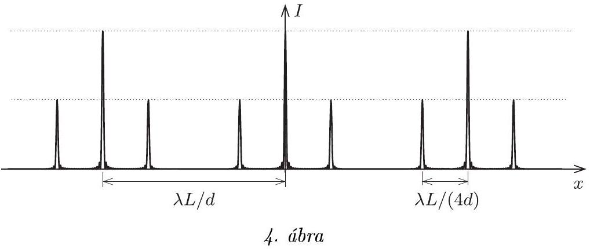
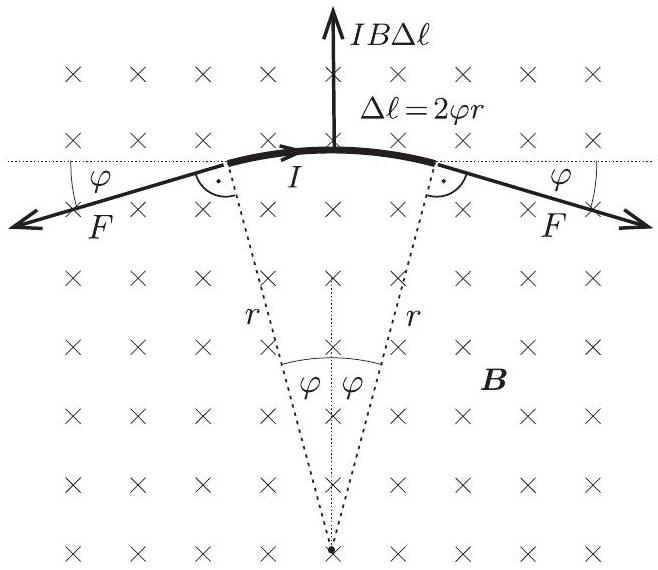
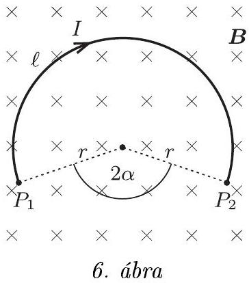
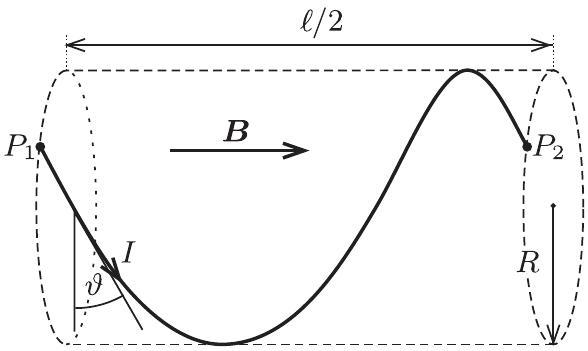

2013. október 18-án délután 3 órai kezdettel rendezte meg az Eötvös Loránd Fizikai Társulat 65. Eötvös-versenyét. A versenyen részt vehetett bárki, aki 2013-ban fejezte be középiskolai tanulmányait, vagy ebben az évben is középiskolába járt. Az öt óra (300 perc) megoldási idő alatt a versenyzők bármely magukkal hozott írott vagy nyomtatott segédeszközt használhattak a feladatok megoldásához, zsebszámológépen kívül azonban minden más elektronikus segédeszköz használata tilos volt.

Idén először az ország határain kívül, az angliai Cambridge-ben is megrendezésre került a verseny, az időeltolódás miatt ott délután 2 órai kezdettel. Itthon a szokásos helyszíneken készültek fel a Társulat munkatársai a versenyzők fogadására, sajnos azonban három városban egyetlen diák sem jelent meg a versenyen. Budapesten 62 , a többi helyszínen összesen 49 dolgozatot adtak be, melyeket a feladatokat kitúző Eötvös-versenybizottság bírált el. Tagjai Honyek Gyula, Vankó Péter és Vigh Máté voltak, elnöke pedig Radnai Gyula. Az összesen 111 dolgozat közül 27-et írtak elsőéves, javarészt a BME-re és az ELTE-re járó egyetemi hallgatók. A középiskolás versenyzők közül a legtöbben a budapesti Fazekas (16 fő), a szegedi Radnóti (12 fő) és a budapesti Radnóti (6 fő) gimnáziumból jöttek. Volt öt külföldi, nem magyar állampolgárságú versenyző is.

Ismertetjük a feladatokat és azok megoldását.

a) Milyen magasból kell elengednünk az egyes testeket, hogy 1 m/s haladási sebességgel érjék el a lejtố alját?

A lejtót 1 m/s sebességgel elhagyó testek lassulva gördülnek tovább egy puhább, hosszú, vízszintes felületen. A testek a felület kicsiny benyomódása miatt fékezódnek. Tételezzük fel, hogy a vízszintes felület által a testekre ható eredố erố pillanatnyi támadáspontja a hengerpalástokon mindkét esetben ugyanott helyezkedik el!
b) Az alumíniumhenger a vízszintes felületen 2 m út megtétele után áll meg. Hol áll meg a rézcsó?
Adatok: az alumínium sũrũsége $2,7 \mathrm {~g} / \mathrm { cm } ^ { 3 }$, a réz sữrũsége $8,9 \mathrm {~g} / \mathrm { cm } ^ { 3 }$.
(Honyek Gyula)
Megoldás. a) A $h$ magasságból elengedett testek gravitációs helyzeti energiája a lejtő alján mozgási energiává alakul:

$$
m g h = \frac { 1 } { 2 } m v ^ { 2 } + \frac { 1 } { 2 } \Theta \omega ^ { 2 } = \frac { 1 } { 2 } m v ^ { 2 } + \frac { 1 } { 2 } k m R ^ { 2 } \frac { v ^ { 2 } } { R ^ { 2 } } ,
$$

ahol $m$ a testek tömege, $R$ a sugaruk, a tehetetlenségi nyomatékot pedig $\Theta = k m R ^ { 2 }$ alakban írtuk fel. Felhasználtuk továbbá, hogy a tiszta gördülés miatt a testek tömegközéppontjának $v$ sebessége és a forgásuk $\omega$ szögsebessége között fennáll a $v = R \omega$ kényszerfeltétel. Ebből az indítási magasságra a következő adódik:

$$
h = \frac { v ^ { 2 } } { 2 g } ( 1 + k ) .
$$

A tömör alumíniumhenger esetében $k _ { \mathrm { Al } } = 1 / 2$, vagyis $h _ { \mathrm { Al } } = 3 v ^ { 2 } / ( 4 g ) = 7,6 \mathrm {~cm}$.
A rézcső tömege is, külső sugara is megegyezik az alumíniumhenger adataival. Így kifejezhetjük a rézcső belső $r$ sugarát $R$ segítségével:

$$
\frac { R ^ { 2 } } { R ^ { 2 } - r ^ { 2 } } = \frac { \varrho _ { \mathrm { Cu } } } { \varrho _ { \mathrm { Al } } } \quad \longrightarrow \quad r ^ { 2 } = \frac { \left( \varrho _ { \mathrm { Cu } } - \varrho _ { \mathrm { Al } } \right) } { \varrho _ { \mathrm { Cu } } } R ^ { 2 } .
$$

A rézcső tehetetlenségi nyomatékát

$$
\Theta _ { \mathrm { Cu } } = \frac { 1 } { 2 } \varrho _ { \mathrm { Cu } } \pi \ell \left( R ^ { 4 } - r ^ { 4 } \right)
$$

alakban írhatjuk fel, ahol $\ell$ a hengeres testek hosszúsága. Kihasználhatjuk, hogy tömegek megegyeznek, ennek alapján a rézcső tehetetlenségi nyomatékra a következőt kapjuk:

$$
\Theta _ { \mathrm { Cu } } = \frac { 1 } { 2 } m R ^ { 2 } \left( 1 + \frac { \varrho _ { \mathrm { Cu } } - \varrho _ { \mathrm { Al } } } { \varrho _ { \mathrm { Cu } } } \right) = \frac { 2 \varrho _ { \mathrm { Cu } } - \varrho _ { \mathrm { Al } } } { 2 \varrho _ { \mathrm { Cu } } } m R ^ { 2 } .
$$

A kapott eredményból leolvasható, hogy

$$
k _ { \mathrm { Cu } } = \frac { 1 } { 2 } \frac { 2 \varrho _ { \mathrm { Cu } } - \varrho _ { \mathrm { Al } } } { \varrho _ { \mathrm { Cu } } } = 0,85 ,
$$

tehát

$$
h _ { \mathrm { Cu } } = \frac { 2 \left( 1 + k _ { \mathrm { Cu } } \right) } { 3 } h _ { \mathrm { Al } } = 9,4 \mathrm {~cm} .
$$

b) A kissé puha felületen a hengeres testekre a nehézségi erő mellett a felület fejt ki erốt, melynek támadáspontja mindkét test esetén ugyanoda esik. A felület által kifejtett kényszererő (ezt szaggatott nyíl jelöli) két összetevőre bontható: a függőleges összetevő nagysága $m g$ (ezt szokás nyomóerőnek hívni), míg a vízszintes összetevőt jelöljük $S$-sel (ez felel meg a tapadási súrlódási erónek).

2. ábra

A kényszererő függőleges összetevője hatásvonalának és a hengeres test középpontjának a távolsága legyen $d$, a vízszintes felületen megtett utat pedig jelöljük $x$-szel. A testek tömegközéppontjának gyorsulását a dinamika alapegyenlete írja le:

$$
\sum \boldsymbol { F } = m \boldsymbol { a } .
$$

Az alumíniumhenger esetén a vízszintes irányú gyorsulást az $S _ { \mathrm { Al } }$ súrlódási erő okozza:

$$
S _ { \mathrm { Al } } = m a _ { \mathrm { Al } } = m \frac { v ^ { 2 } } { 2 x _ { \mathrm { Al } } } ,
$$

ahol $v = 1 \mathrm {~m} / \mathrm { s }$ és $x _ { \mathrm { Al } } = 2 \mathrm {~m}$.
A tiszta gördülés miatt a henger szöggyorsulása $\beta _ { \mathrm { Al } } = a _ { \mathrm { Al } } / R$. Ezt a szöggyorsulást a forgómozgás alapegyenlete értelmében a testre ható erők (tömegközéppontra vonatkoztatott) forgatónyomatékának eredője hozza létre:

$$
\sum M = \Theta \beta .
$$

Írjuk fel a forgómozgás alapegyenletét az alumíniumhengerre, majd fejezzük ki a $d$ távolságot:

$$
M = m g d - S _ { \mathrm { Al } } R = m g d - m \frac { v ^ { 2 } } { 2 x _ { \mathrm { Al } } } R = \Theta _ { \mathrm { Al } } \beta _ { \mathrm { Al } } = \frac { 1 } { 2 } m R ^ { 2 } \frac { a _ { \mathrm { Al } } } { R } = \frac { 1 } { 2 } m R ^ { 2 } \frac { v ^ { 2 } } { 2 x _ { \mathrm { Al } } R } ,
$$

amiből

$$
d = \frac { 3 v ^ { 2 } } { 4 g x _ { \mathrm { Al } } } R .
$$

A rézcső esetén a tapadási súrlódási erő más lesz (és természetesen a tehetetlenségi nyomaték is más), de a többi mennyiség ugyanaz marad. Újra fel kell írnunk a haladó mozgásra és a forgásra a dinamikai alapegyenleteket:

$$
\begin{aligned}
S _ { \mathrm { Cu } } & = m a _ { \mathrm { Cu } } = m \frac { v ^ { 2 } } { 2 x _ { \mathrm { Cu } } } \\
M & = m g d - S _ { \mathrm { Cu } } R = m g d - m \frac { v ^ { 2 } } { 2 x _ { \mathrm { Cu } } } R = \Theta _ { \mathrm { Cu } } \beta _ { \mathrm { Cu } } = \\
& = k _ { \mathrm { Cu } } m R ^ { 2 } \frac { a _ { \mathrm { Cu } } } { R } = k _ { \mathrm { Cu } } m R ^ { 2 } \frac { v ^ { 2 } } { 2 x _ { \mathrm { Cu } } R } ,
\end{aligned}
$$

amiből

$$
d = \frac { \left( 1 + k _ { \mathrm { Cu } } \right) v ^ { 2 } } { 2 g x _ { \mathrm { Cu } } } R .
$$

A kétféleképpen kifejezett $d$ távolság összevetéséből a rézcső útja a vízszintes felületen:

$$
x _ { \mathrm { Cu } } = \frac { 2 \left( 1 + k _ { \mathrm { Cu } } \right) } { 3 } x _ { \mathrm { Al } } = 2,46 \mathrm {~m} .
$$

Megjegyzések. 1. Vegyük észre, hogy ahányszor magasabbról indítottuk a rézcsövet, annyiszor messzebb áll meg a vízszintes felületen. Ezt úgy is interpretálhatjuk, hogy a teljes mechanikai energia a kezdeti magassággal arányos, és a mechanikai energia „hővé alakulása” (disszipációja) pedig a vízszintes szakaszon megtett úttal arányos. Azonban ez az energiadisszipáció nem írható fel a súrlódási erő és a megtett út szorzataként, hiszen ha így írnánk fel, akkor mindkét testre ugyanakkora súrlódási erốt kapnánk, ami nyilvánvalóan hamis következtetés lenne. Az energia nem a szokásos csúszási súrlódás formájában disszipálódik (gyakorlatilag tiszta gördülés történik, lényegében tapadó súrlódás lép fel), hanem a testek alatti felület nem tökéletesen rugalmas benyomódása okozza a mechanikai energiaveszteséget. Feltehetjük, hogy mindkét test esetén ugyanolyan széles és ugyanolyan mély a benyomódás, ezért tapasztalhatjuk azt, hogy a disszipáció a nyom hosszával arányos.
2. Érdemes észrevennünk azt is, hogy a felületre meróleges nyomóerő forgatónyomatéka lassítja a testek forgását, míg a súrlódási erő gyorsítja a forgást. A súrlódási eró kicsi, de az erókarja $( R )$ nagy (a benyomódás mértéke elhanyagolható a sugárhoz képest), míg a nyomóeró jelentős, de az erókarja $( d )$ kicsi. Az alumíniumhenger esetén a súrlódási eró a nyomóerőnek ( $m g$-nek) hozzávetőlegesen $1 / 40$ része, a rézcsőnél mindössze $1 / 50$ része. A $d$ távolság a sugárnak nagyjából $3 / 80$ része, tehát a nyomóeró forgatónyomatéka az alumíniumhenger esetén másfélszer akkora, mint a súrlódási erón nyomatéka (a rézcsőnél ez az arány másfélnél valamivel nagyobb). Ez azt mutatja, hogy a kétféle nyomaték összemérhető.
3. A számításokban a képletek leegyszerúsítése érdekében a gyorsulások és a szöggyorsulások abszolút értékével számoltunk, miközben természetesen nyilvánvaló, hogy a vízszintes felületen a testek gyorsulása is, szöggyorsulása is negatív.
4. Az eredményhirdetésen az elsó feladat megoldásának ismertetése után a hallgatóság egy valódi kísérletról készült videófelvételen láthatta, hogy egy tömör alumíniumhenger és egy ugyanolyan tömegü, illetve ugyanolyan külső méretü rézcső a példa megoldásának megfelelően nem egyforma úton lassul le vízszintes felületen, ha azonos kezdősebességgel, tisztán gördülve, egyszerre indítjuk őket. A puha felületet egy asztallapra leterített abrosz szolgáltatta, az azonos sebességü, egyidejü indítás egy hosszú vonalzóval történt.
2. feladat. Egy furcsa optikai rácson a rések nem egyenló közönként helyezkednek el: a szomszédos rések távolsága felváltva $30 \mu \mathrm {~m}$ és $90 \mu \mathrm {~m}$. Milyen elhajlási kép alakul ki a 2 m távolságra elhelyezett ernyốn, ha a rácsot (annak síkjára merốlegesen) 660 nm hullámhosszúságú lézerfénnyel világítjuk meg? Ábrázoljuk vázlatosan az ernyốn kialakuló intenzitáseloszlást! ( $A$ rések szélessége egyforma és sokkal kisebb a távolságuknál.)
(Vigh Máté)
Megoldás. Először képzeljük el, milyen lenne a diffrakciós kép, ha minden második rést (a másodikat, negyediket stb.) kitakarnánk! Ekkor a $4 d$ távolságra elhelyezkedő rések egy szokásos optikai rácsot alkotnának, az $n$-edik elhajlási maximum ernyőn mérhető $x _ { n }$ helyzetét pedig a

$$
\begin{aligned}
4 d \sin \alpha _ { n } & = n \lambda \\
\quad \sin \alpha _ { n } & \approx x _ { n } / L
\end{aligned}
$$

összefüggések alapján számíthatjuk:

$$
\begin{equation*}
x _ { n } = n \frac { \lambda L } { 4 d } . \tag{*}
\end{equation*}
$$

3. ábra

Ugyanilyen lenne az elhajlási kép, ha a másik réssort (azaz az első, harmadik stb. rést) takarnánk ki. A feladatban kérdezett esetre visszatérve meg kell vizsgálnunk, hogy a $( * )$ egyenlet által meghatározott irányokban hogyan adódik össze a két, $d$ távolsággal eltolt, $4 d$ periódusú réssoron áthaladó fény amplitúdója. Négy esetet kell megvizsgálnunk:

- Ha $n = 4 k + 1$, akkor a két réssoron áthaladó fény közötti útkülönbség $\lambda / 4$, ami $\pi / 2$ fáziskülönbségnek felel meg. Két, $\pi / 2$ fáziskülönbséggel találkozó, azonos amplitúdójú hullám összegének amplitúdója (rögzített helyen):
$$
\begin{aligned}
& E _ { 0 } \sin ( \omega t ) + E _ { 0 } \sin ( \omega t + \pi / 2 ) = E _ { 0 } \sin ( \omega t ) + E _ { 0 } \cos ( \omega t ) = \\
& = \sqrt { 2 } E _ { 0 } \left( \frac { 1 } { \sqrt { 2 } } \sin ( \omega t ) + \frac { 1 } { \sqrt { 2 } } \cos ( \omega t ) \right) = \sqrt { 2 } E _ { 0 } \sin ( \omega t + \pi / 4 ) .
\end{aligned}
$$
Az amplitúdó tehát az egy réssoron átjutó fény amplitúdójának $\sqrt { 2 }$-szerese, azaz az intenzitás az egy réssor esetében mérhetó intenzitás kétszerese.
- Ha $n = 4 k + 2$, akkor a két réssor közötti fáziskülönbség $\pi$, tehát ilyen irányokban tökéletes kioltást tapasztalunk.
- Ha $n = 4 k + 3$, a fáziskülönbség $3 \pi / 2$, így az amplitúdó (az első esethez hasonlóan) az egyetlen réssoron áthaladó fény amplitúdójának $\sqrt { 2 }$-szerese, az intenzitás pedig a kétszerese lesz.
- Ha $n = 4 k$, akkor minden sugár erősíti egymást, az amplitúdó tehát egyetlen réssoron áthaladó fény amplitúdójának kétszerese, az intenzitás pedig négyszerese lesz.

Összefoglalva: a 4. ábrán látható intenzitáseloszlás alakul ki, a nagy intenzitású maximumok közötti távolság $\lambda L / d$.

Megjegyzések. 1. Optikai ráccsal keltett diffrakciós (elhajlási) kép esetén az ernyőn kialakuló vonalak rendkívül keskenyek, ezek a vonalak meglehetősen „élesek”. A közepes vonalszélesség jó közelítésben annyiad része két egymás utáni vonal távolságának, ahány résből áll a rács. Ez pedig legalább száz, de akár sok ezer is lehet.
2. A második feladat megoldásának a bemutatását is kísérleti szemléltetés követte. A feladat szövegének megfelelő optikai rácsot Kis Lajos (Szeged) készítette el a következő módon. A rács (arányosan megnövelt méretü) mintázatát számítógépes rajzolóprogram segítségével egy A/3 méretú lapra nyomtatta, majd a lapot megfeleló távolságból elegendően finom szemcseméretü filmre fényképezte. A lapra nyomtatott vékony, sötét vonalak a filmnegatívon áteresztő résekként jelentek meg. Az eredményhirdetésen a lézerrel megvilágított rács elhajlási képe az elméleti számításokkal megegyezó módon, jól láthatóan jelent meg a terem vetítőernyőjén.
3. feladat. $B$ indukciójú, homogén, erốs mágneses térben egy $\ell$ hosszúságú, könnyứ, vékony, hajlékony vezetốhuzal végpontjait az egymástól $\ell / 2$ távolságra lévó $P _ { 1 }$ és $P _ { 2 }$ pontokban rögzítettük. A huzalon $I$ erốsségü egyenáramot vezetünk át. Milyen alakot vesz fel a vezeték, ha a mágneses indukcióvektor

a) meróleges a $P _ { 1 } P _ { 2 }$ szakaszra?
b) párhuzamos a $P _ { 1 } P _ { 2 }$ szakasszal?

Mekkora erốvel húzza a vezeték a rögzítési pontokat az egyes esetekben?
(Vigh Máté)
Megoldás. a) A vezetőhuzal a mágneses térerősségre meróleges síkban fog elhelyezkedni. Mivel a mágneses tér által a vezető darabkáira kifejtett erő mindenhol merőleges a huzalra, ezért a vezeték minden pontjában ugyanakkora eró ébred. A vezeték $r$ görbületi sugarú darabkájában $F = I B r$ nagyságú erő ébred. Ez könnyen belátható a vezeték kis darabkájára ható erők vizsgálatával (5. ábra).

5. ábra

Az erőegyensúly:

$$
2 F \sin \varphi = I B \Delta \ell .
$$

Geometriából:

$$
\Delta \ell = 2 \varphi r .
$$

A kis szögek miatt $\sin \varphi \approx \varphi$, ebből valóban az $F = I B r$ eredményre jutunk. Az eddigiekből következik, hogy a huzal körív alakot vesz fel. (Elvben a többmenetes „körtekercs" alak is egyensúlyi helyzet, ez azonban labilis, így nem is alakítható ki, ahogy egy ceruzát sem lehet a hegyére állítani.)

A körívre a következő geometriai összefüggéseknek kell teljesülniük (6. ábra):

$$
\begin{aligned}
2 r \sin \alpha & = \ell / 2 , \\
2 r ( \pi - \alpha ) & = \ell ,
\end{aligned}
$$

ezekből a $2 \sin \alpha = \pi - \alpha$ transzcendens egyenletre jutunk, melynek numerikus megoldása $\alpha \approx 1,246 \mathrm { rad } = 71,40 ^ { \circ }$. Ezt visszaírva a fenti egyenletekbe a kör sugarára $r \approx 0,26 \ell$, a vezetéket feszítő erőre pedig $F \approx 0,26 I B \ell$ értéket kapunk.

b) Ebben az esetben a vezetőhuzal darabkáira nem hat a mágneses térerősséggel párhuzamos irányú erố, ezért a vezetéket feszítő erő $B$-irányú komponense állandó. A mágneses mező által a vezető darabkáira kifejtett erő mindenhol meróleges a huzalra, ezért a vezeték minden pontjában ugyanakkora erő ébred. E két ténybő́l következik, hogy a vezetéket feszítő erő mágneses térerősségre merőleges komponense állandó kell legyen, azaz a mágneses térerősség irányából nézve a vezetékre egy kört fogunk látni, a huzal alakja pedig egyenletes menetemelkedésú, a mágneses térerósséggel párhuzamos tengelyú, egymenetes csavarvonal lesz (lásd a 7. ábrát). (Elvben a többmenetes csavarvonal alak is egyensúlyi helyzet, ez azonban könnyen beláthatóan labilis.)

7. ábra

A csavarvonal menetemelkedésének $\vartheta$ szögét (azaz a csavarvonal adott pontbeli érintője és az ugyanezen ponton átmenő, a $B$-térre merőleges sík által bezárt szöget) egyszerú geometriával számíthatjuk ki:

$$
\sin \vartheta = \frac { \ell } { 2 \ell } , \quad \text { ebből } \quad \vartheta = 30 ^ { \circ } .
$$

A csavarvonalra illeszkedő, képzeletbeli hengerpalást $R$ sugara:

$$
R = \frac { \ell \cos \vartheta } { 2 \pi } = \frac { \sqrt { 3 } \ell } { 4 \pi } \approx 0,138 \ell .
$$

Most térjünk rá az erő kiszámítására! A csavarvonal tengelyének irányából nézve azt látjuk, hogy az $R$ sugarú, teljes körnek látszó vezetéket a mágneses Lorentz-erő próbálja szétfeszíteni, ezt ellensúlyozza a vezetékben ébredő erónek a mágneses térerősségre meróleges $F \cos \vartheta$ nagyságú komponense: $I B R = F \cos \vartheta$. Felhasználva $R$ kifejezését megkapjuk a vezetéket feszítő erőt:

$$
F = \frac { I B \ell } { 2 \pi } \approx 0,159 I B \ell .
$$

Látszik, hogy a huzalban ébredő erő független a $P _ { 1 }$ és $P _ { 2 }$ pontok $d$ távolságától $( 0 < d < \ell )$.
Megjegyzés. A verseny eredményhirdetésén a 3. feladatban szereplő kísérleti elrendezés is bemutatásra került. A kísérlet megvalósítása egyszerú körülmények között nehéz, több gyakorlati nehézségbe is ütközik.

A feladat szövegében homogén, erós mágneses tér szerepel. Ezt a két feltételt nem könnyü egyszerre teljesíteni. Aránylag nagy térrészben homogén és erós mágneses teret csak nagyon nagy (és drága) eszközökkel lehet elóállítani. A kísérleti bemutatón a tér elóállítására Helmholtz-tekercset használtunk ${ } ^ { 1 }$, melynek tere a tekercsek közti tér közepén elég jó közelítéssel homogén - viszont nem túl erős. (A Föld mágneses terénél azért egy-két nagyságrenddel nagyobb.)

A feladat szövegében szereplő vezeték könnyü, vékony és hajlékony. A szövegben a „könnyü” azt jelenti, hogy a vezeték súlya elhanyagolható a mágneses tér által kifejtett erőhöz képest. (Az „erős mágneses tér” pedig arra utal, hogy a vezeték saját mágneses terének hatását is elhanyagolhatjuk.) A feltételek teljesítéséhez nagyon vékony vezetéket kellett használnunk: egy kb. 0,1 mm vastag vörösréz huzalt, amely olyan vékony, hogy alig látszik. A huzal vastagsága viszont korlátozza a vezetéken átfolyó áram nagyságát is, pedig a nem túl erốs mágneses tér mellett minél nagyobb áramra van szükség a jelenség bemutatásához. Az áramerősséggel elmentünk a határokig: a vezeték (miután leégett róla a szigetelő lakk) vörösen izzott - és így az elsötétített teremben láthatóvá is vált.

A bemutatón először egy, a feladathoz lazábban kapcsolódó kísérletet mutattunk be: egy kisnyomású héliummal töltött csőben figyeltük meg az elektronok mozgását. Az izzókatódból kilépő, felgyorsított elektronok a Helmholtz-tekercsben kör-, illetve csavarvonal alakú pályán mozognak, és pályájuk a gerjesztett héliumatomok zöld fényének köszönhetően láthatć ${ } ^ { 2 }$.

Ezután vizsgáltuk a vezeték alakját. Még egy ilyen vékony vezeték is aránylag merev (tehát a hajlékonyságot se könnyü biztosítani), de a feladat $a$ ) részének megfeleló elrendezésben az áram bekapcsolásakor jól láthatóan kör alakban kifeszült, az áramirány változtatásakor pedig a körív 180°-kal átfordult. A vezeték végeinek 90°-os elforgatásakor (a feladat $b$ ) részének megfeleló elrendezésben) jól megfigyelhetően kialakult a csavarvonal forma. (A feladatban kérdezett kicsiny erők mérésére ebben az egyszerú demonstrációban természetesen nem volt lehetőség.)

Az ünnepélyes eredményhirdetésre és díjkiosztásra 2013. november 15-én délután került sor az ELTE Konferenciatermében. Meghívást kaptak az 50 és a 25 évvel ezelőtti Eötvös-verseny nyertesei is. 50 évvel ezelőtt Tichy Géza nyerte meg a versenyt, Abos Imre lett a második, Major János a harmadik. Mindhárman itt voltak - Tichy Géza az ELTE-ről, Abos Imre a BME-ről, Major János Stuttgartból jött el. 25 évvel ezelőtt már nemcsak érettségizettek indulhattak az Eötvös-versenyen, s az első tíz helyezett felvételi nélkül kerülhetett be az egyetemre. Ennek megfelelően a résztvevők és a díjazottak száma is nagyobb volt. A két akkori első díjas közül Fucskár Attila eljött, Hauer Tamás levelet küldött mostani munkahelyéről, a CERN-ből. Volt tanárával, Tarnócziné Gedeon Melittával együtt jelent meg a második díjas Demeter Gábor, és eljött a harmadik díjas Keleti Tamás is, aki ma az ELTE Analízis Tanszékének vezetője. Felesége és két kisgyereke kísérte el Somfai Ellákot, aki akkor dicséretet kapott dolgozatára.

A versenybizottság elnöke megemlékezett Radó Tiborról, aki 100 éve, 1913-ban, és Hlucsil Károlyról, aki 1911-ben lett I. díjas ezen a versenyen. Ezután kivetítette az 1963. és az 1988. évi feladatokat, valamint az akkori nyertesek közül a KöMaL-ban is eredményesen szereplő diákok egykori fényképeit. Felkérésére mindannyian szóltak néhány szót emlékeikről, azóta befutott pályájukról. Ezután következett a 2013. évi feladatok ismertetése. A megoldásokat azok mutatták be, akik kitalálták ezeket a feladatokat. Honyek Gyula az 1. feladathoz kapcsolódó kísérletről videót is vetített. A 2. feladathoz kapcsolódó kísérletet Vigh Máté mutatta be egy olyan optikai ráccsal, amely erre az alkalomra készült. A 3. feladat megoldását is Vigh Máté ismertette, a hozzá kapcsolódó kísérletet azonban már Vankó Péter állította össze és mutatta be.

Ezután Radnai Gyula felkérte Zawadowski Alfréd akadémikust, az Eötvös Loránd Fizikai Társulat elnökét a 2013. évi Eötvös-verseny díjainak átadására.

Az elsố díjat mindhárom feladat hibátlan megoldásáért Szabó Attila nyerte, aki jelenleg Cambridge-ben természettudomány szakos egyetemi hallgató. Pécsett érettségizett a Leówey Klára Gimnáziumban, tanára Simon Péter,

[^0]
szakkörvezetője Kotek László volt. Ốk vették át az első díjat Attila helyett, akivel viszont sikerült Skype-on egyidejüleg kapcsolatba lépnünk, és akit így kivetítve láthattak és tapsolhattak meg a többiek.

Második díjat nyert egyenlő helyezésben Fehér Zsombor, a Budapesti Fazekas Mihály Általános Iskola és Gimnázium 11. évf. tanulója, Horváth Gábor tanítványa, valamint Kovács Áron Dániel, az Eötvös Loránd Tudományegyetem fizika szakos hallgatója, aki ugyancsak a Fazekas Gimnáziumban érettségizett mint Horváth Gábor és Csefkó Zoltán tanítványa.

Harmadik díjat nyert egyenló helyezésben Horicsányi Attila, az egri Dobó István Gimnázium 12. évf. tanulója, Hóbor Sándor tanítványa, Janzer Barnabás, a Budapesti Fazekas Mihály Általános Iskola és Gimnázium 11. évf. tanulója, Horváth Gábor tanítványa, valamint Takátsy János, a budapesti Városmajori Gimnázium 12. évf. tanulója, Ábrám László tanítványa.

Dicséretet kapott Holczer András, a pécsi Janus Pannonius Gimnázium 11. évf. tanulója, tanára a gimnáziumban Dombi Anna, szakkörvezető́je Kotek László, valamint Öreg Botond, a Budapesti Fazekas Mihály Általános Iskola és Gimnázium 11. évf. tanulója, akinek Horváth Gábor és Szokolai Tibor voltak a tanárai.

A MOL támogatásával az első díjjal 30 ezer, a második díjjal 20 ezer, a harmadik díjjal 15 ezer forint pénzjutalom járt, míg a dicséretesek Simonyi Károly $A$ fizika kultúrtörténete c. múvének legújabb kiadását kapták meg. A díjazottak megjelent tanárai és a megjelent 50, illetve 25 évvel ezelőtti nyertesek egy-egy értékes könyvet választhattak maguknak az ELFT, a MATFUND Alapítvány, a Nemzeti Tankönyvkiadó, a Typotex Kiadó és az Akkord Kiadó kiállított könyvei közül.

Befejezésül a Versenybizottság leköszönő elnöke értékelte az idei versenyt és felsorolta mindazokat az intézményeket, vállalatokat és magánszemélyeket, amelyek, illetve akik anyagi segítségével sikerült a Társulatnak az elmúlt 25 évben lebonyolítania a versenyt.

Zawadowski Alfréd megköszönte Radnai Gyulának a Versenybizottságban több mint 40 éve, elnökként pedig 25 éve végzett munkáját, és átnyújtott egy oklevelet, mely tanúsítja, hogy elnyerte „az Eötvös-verseny Versenybizottságának örökös tiszteletbeli elnöke" címet.

Az ünnepélyes díjkiosztást jó hangulatú állófogadás zárta a Ramasoft Zrt. jóvoltából.

[^0]:    ${ } ^ { 1 }$ http://fizipedia.bme.hu/images/a/a7/Helmholtz2.jpg
    ${ } ^ { 2 }$ http://fizipedia.bme.hu/images/9/90/Eperm5.jpg
