# BESZÁMOLÓ A 2014. ÉVI EÖTVÖS-VERSENYRŐL

Tichy Géza - ELTE Anyagfizikai tanszék Vankó Péter - BME Fizika tanszék Vigh Máté - ELTE Komplex Rendszerek Fizikája tanszék

Az Eötvös Loránd Fizikai Társulat 2014. évi Eötvösversenye október 17-én délután 3 órai kezdettel tizenöt magyarországi helyszínen ${ } ^ { 1 }$ került megrendezésre. A versenyen a három feladat megoldására 300 perc áll rendelkezésre, bármely írott vagy nyomtatott segédeszköz használható, de zsebszámológépen kívül minden elektronikus eszköz használata tilos. Az Eötvösversenyen azok vehetnek részt, akik vagy középiskolai tanulók, vagy a verseny évében fejezték be középiskolai tanulmányaikat. Összesen 93 versenyző adott be dolgozatot, 18 egyetemista és 75 középiskolás.

Az ünnepélyes eredményhirdetésre és díjkiosztásra 2014. november 21-én délután került sor az ELTE Konferenciatermében. Az idei díjazottakon kívül meghívást kaptak az 50 és a 25 évvel ezelőtti Eötvös-verseny nyertesei is. Elóször az akkori feladatokat mutattuk be.

## Az 1964. évi Eötvös-verseny feladatai

1. feladat
60°-os és 30°-os hajlásszögú lejtók egy élben találkoznak. Itt kicsiny, súrlódásmentes csigát helyezünk el. A csigán átvetett fonál végein $m _ { 1 }$ és $m _ { 2 }$ tömegú ládák függnek, amelyek csúszási súrlódási együtthatója $\mu = 0,2$. Milyen feltétel mellett maradnak a ládák nyugalomban?

## 2. feladat

Kilenc négyzetbő́l álló hálózat mindegyik éle $R$ ellenállású. A középső négyzetes mezó́ helyébe tökélete-

[^0]sen vezetó négyzetlapot helyezünk. Mennyi az eredó ellenállás a négyzet két átellenes csúcsa között?

## 3. feladat

Egy gyújtólencsét szemünkhöz közel helyezünk el úgy, hogy egy hengeres parafadugó homlokfelületét a tisztán látás távolságában élesen látjuk. A dugó és a lencse kölcsönös távolságát rögzítjük. Elhelyezhetjük-e szemünket úgy, hogy a dugó palástfelületét is lássuk? A henger hossztengelye és a szem tengelye mindig a lencse tengelyében legyen!

## Az 1989. évi Eötvös-verseny feladatai

1. feladat

Gergő gyakran segít a háztartásban. A zacskós tejet az ábrán látható módon a zacskónál valamivel szúkebb keresztmetszetú, levágott tetejú és alul kilyukasztott múanyag flakonban szokták tárolni. Gergő megfigyelése szerint a szájával lefelé fordított flakonból a még felbontatlan zacskós tej magától kiesik, viszont a tetejénél megfogott tejes zacskóról még akkor sem esik le a flakon, ha alulról egy másik zacskó tejet akasztunk rá.

## 2. feladat

Egy keskeny, hosszú cső́ben (kapillárisban) 30 mm magasra emelkedik a víz a csövön kívüli szinthez képest. A víz felszíne 30°-os szöget zár be a cső falával az érintkezési vonalnál. A csövet benyomjuk a vízbe

(így az teljesen megtelik), majd a felsó végén ujjunkkal befogva, függőleges helyzetben egészen kiemeljük a csövet a vízból. Ezután a befogott nyílást újra szabaddá tesszük, s ekkor a víz egy része kifolyik.

Lehet-e a függőleges helyzetú csóben maradó vízoszlop hossza
a) 123 mm; b) 62 mm; c) 41 mm; d) 20 mm?

## 3. feladat

Az iskolai 12 V-os, 50 Hz-es váltóáramú áramforrásra sorba kapcsoltunk egy 24 V, 10 W-os izzót és egy $101,3 \mu \mathrm {~F}$ kapacitású kondenzátort. Az izzó alig világít. Rendelkezésünkre áll még egy 0,1 H induktivitású tekercs is. Hogyan lehetne a kapcsolást úgy átalakítani, hogy az izzó szép fényesen világítson? (A tekercs ohmos ellenállása elhanyagolható. Csak a kapcsolást szabad átalakítani, az alkatrészeket nem.)

Az egykori díjazottak közül Corradi Gábor (ötven évvel ezelőtti győztes) és Somfai Ellák (huszonöt évvel ezelótti második díjas) jött el az alkalomra, akik a feladatok ismertetése után röviden beszéltek a versennyel kapcsolatos emlékeikrő́l és pályájukról.

Ezután következett a 2014. évi verseny feladatainak és megoldásainak bemutatása. Az elsó́ és a harmadik feladat megoldását Vigh Máté és Gnädig Péter (a feladatok kitúzói), míg a második feladatot a külföldi útja miatt távol maradó Tichy Géza helyett Vankó Péter ismertette.

## A 2014. évi verseny feladatai és megoldásuk

1. feladat Kitúzte: Vigh Máté Egy $M$ tömegú, $L$ hosszúságú, hajlékony futószónyeget szorosan felgöngyöltünk egy $R$ sugarú hengerré (1. ábra). Ha a felgöngyölt szőnyeget elengedjük, az magától kitekeredik. (A gördülési ellenállás elhanyagolható.)

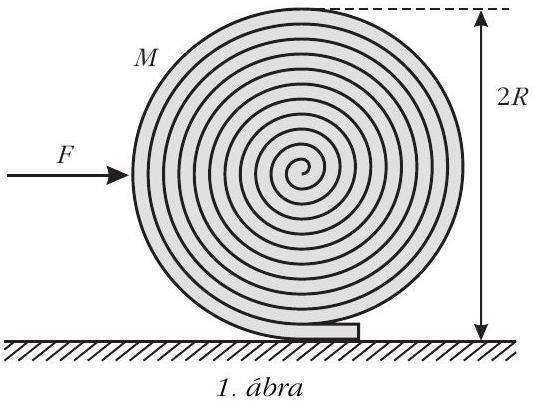
a) Milyen eróhatással magyarázható a jelenség?

b) Mekkora vízszintes eróvel akadályozható meg a szónyeg kitekeredése?

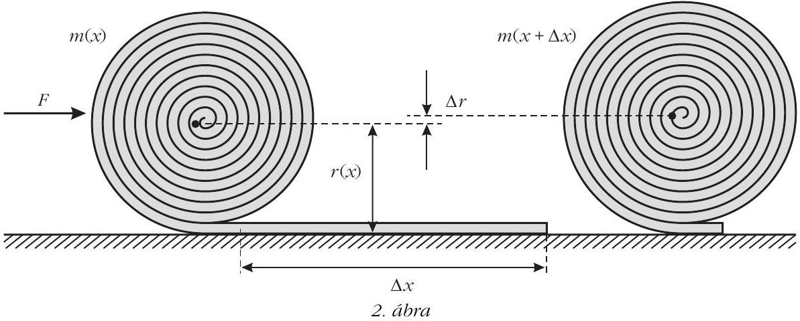
$\Delta m = \frac { m } { x } \Delta x$ és $m = \frac { M } { L } x$,
hiszen $x = L$ esetén a tömeg éppen $M$.

## Megoldás

a) A guriga tömegközéppontja nem esik az alátámasztási pont fölé, az így fellépó forgatónyomaték görgeti ki a sző́nyeget.
b) A guriga egyensúlyát biztosító vízszintes $F$ erốt a virtuális munka elvéból határozhatjuk meg. Ha a nem teljesen felgöngyölt gurigát kicsiny $\Delta x$ távolsággal feljebb görgetjük (2. ábra), az $F ( x )$ eró által végzett munka a szőnyeg helyzeti energiájának (kicsiny) megváltozását biztosítja:

$$
F ( x ) \Delta x = \Delta E _ { \mathrm { h } } .
$$

A szőnyeg helyzeti energiája

$$
E _ { \mathrm { h } } ( x ) = m ( x ) g r ( x ) ,
$$

amely a feltekeredés közben két okból is növekszik: egyrészt tömegközéppontja magasabbra kerül, másrészt feltekerés közben a szőnyeg „hízik” is. (A földön fekvő rész helyzeti energiája 0, azzal nem kell számolnunk.)

A helyzeti energia kicsiny megváltozása eszerint

$$
\Delta E _ { \mathrm { h } } = m g \Delta r + \Delta m g r .
$$

A szőnyeg $x$ hosszúságú darabjának feltekerésekor kialakuló szőnyegguriga $m$ tömege egyenesen arányos a felgöngyölt rész hosszával, így

$\Delta m = \frac { m } { x } \Delta x$ és $m = \frac { M } { L } x$,
hiszen $x = L$ esetén a tömeg éppen $M$.

A guriga keresztmetszetének területe is arányos $x$-szel, vagyis a guriga sugarára fennáll:

$$
r ^ { 2 } = \frac { R ^ { 2 } } { L } x .
$$

Ebből kifejezhetjük $\Delta r$-t is $\Delta x$ segítségével (felhasználva, hogy $\Delta r$ kicsi):

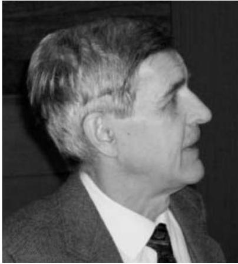
Corradi Gábor

Somfai Ellák

$$
\begin{gathered}
\frac { R ^ { 2 } } { L } \Delta x = ( r + \Delta r ) ^ { 2 } - r ^ { 2 } \approx 2 r \Delta r , \\
\Delta r = \frac { 1 } { 2 } \frac { r } { x } \Delta x .
\end{gathered}
$$

Mindezt behelyettesítve $\Delta E _ { \mathrm { h } }$ kifejezésébe:

$$
\Delta E _ { \mathrm { h } } = \frac { 3 } { 2 } \frac { m g r } { x } \Delta x .
$$

Ebból pedig az $x$ darabon feltekert guriga megtartásához szükséges eró:

$$
F ( x ) = \frac { 3 } { 2 } \frac { m g r } { x } = \frac { 3 } { 2 } \frac { M g R } { L } \sqrt { \frac { x } { L } } ,
$$

amelyból a keresett $F$ erő $x = L$ helyettesítéssel

$$
F = \frac { 3 } { 2 } \frac { R } { L } M g .
$$

Megjegyzések

1. Néhány versenyző próbálkozott a virtuális munka elvével, de a helyzeti energia megváltozásában elfelejtkeztek az egyik tagról. A fenti megoldásban az erốt a feladat kérdésénél kicsit általánosabban, $x$ függvényében egy tetszóleges helyzetben is megadtuk, ez lehetóséget ad a megoldás ellenórzésére. Az eró elmozdulás szerinti integrálásával meghatározzuk a feltekeréshez szükséges teljes munkát:

Szőlőssi Irén és Virágh Anna
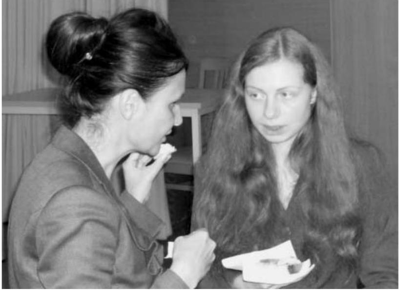

$$
\int _ { 0 } ^ { L } F ( x ) \mathrm { d } x = \int _ { 0 } ^ { L } \frac { 3 } { 2 } \frac { M g R } { L } \sqrt { \frac { x } { L } } \mathrm {~d} x = M g R
$$

ez valóban megegyezik a teljesen feltekert szőnyeg helyzeti energiájával.
2. A versenyzók többsége statikai megoldással próbálkozott. A feladat így is megoldható, azonban még könnyebb tévedni. A statikai megoldásban a forgatónyomatékok egyensúlyát írjuk fel a szőnyeg alátámasztási pontjára:

$$
F R = M g x _ { \mathrm { tkp } } ,
$$

ahol $x _ { \text {tkp } }$ a guriga tömegközéppontjának távolsága az alátámasztáson át húzott függőleges egyenestốl. A feladat ennek meghatározása.

A tömegközéppont két okból sem esik az alátámasztási pont fölé: egyrészt a guriga spirális alakja miatt a guriga érintóje nem meróleges a spirál középpontjából az érintési ponthoz húzott sugárra, másrészt a guriga tömegközéppontja nem a spirál középpontjába esik. (Mindkét okra rájöttek versenyzők, de senki se gondolt mindkettóre, így helyes megoldás nem született.)

A guriga „ferdesége”, és így a spirál középpontjának helye könnyen meghatározható a menetemelkedésból. A tömegközéppont ebból származó elmozdulása

$$
x _ { 1 } = \frac { 1 } { 2 } \frac { R ^ { 2 } } { L } .
$$

A guriga tömegközéppontjának a spirál középpontjához viszonyított helyét sokféleképp meg lehet határozni, erre sok helyes megoldás érkezett az integrálástól az ügyes trükkökig. Egy lehetóség például az, hogy a gurigát gondolatban kiegészítjük egy további fél menettel, amelynek tömegét és tömegközéppontjának helyét is ismerjük: ekkor a szimmetria (és a szőnyeg kis vastagsága) miatt a tömegközéppont ugyanolyan távolra kerül a spirál középpontjától, csak éppen a másik irányba - és ebbốl a keresett távolság már könnyen kiszámolható:

$$
x _ { 2 } = \frac { R ^ { 2 } } { L } .
$$

A két részeredményt összeadva

$$
x _ { \mathrm { tkp } } = x _ { 1 } + x _ { 2 } = \frac { 3 } { 2 } \frac { R ^ { 2 } } { L } ,
$$

amiból a keresett eróre valóban helyes eredményt kapunk.
3. Néhány versenyzó́ a szónyeg rugalmas tulajdonságaival próbálta magyarázni a jelenséget. A feladat szövegében viszont az áll, hogy a sző́nyeg hajlékony, ami arra utal, hogy ezt a hatást nem kell figyelembe venni. (Nem is voltak megadva olyan adatok, amikre ez esetben szükség lenne.)

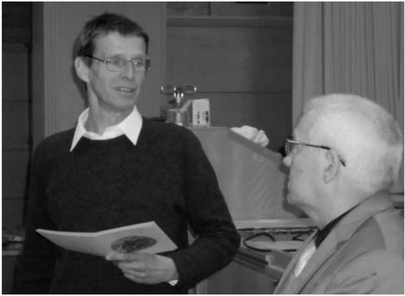
Vankó Péter és Kürti Jenó

2. feladat Kitúzte: Tichy Géza András, Bence és Csaba egyhetes biciklitúrán vesznek részt. A reggelihez minden nap teát isznak; a teavizet a saját fémbögréjükben forralják fel egy (nyomáscsökkentő szelep nélküli) butántöltésú gázpalack lángja fölött. A túra végéhez közeledve érdekes megfigyelést tesznek: a teavíz felforralásához feltúnóen több idóre van szükség, mint a túra elején.

András szerint ebben nincs semmi különös: ahogy csökken a palackban a gáz mennyisége, úgy csökken a nyomás, így a gázláng is gyengébben ég. Bence figyelmeztet rá, hogy a palackban folyadék is van, ezért a gáz nyomása a mennyiségtól függetlenül mindig a telítési góznyomással egyenlő. Szerinte azért csökkent le a nyomás, mert a folyadék már teljesen elfogyott a palackból. Csaba ekkor meglötyögteti a palackot, és meglepve tapasztalja, hogy még van benne valamennyi folyadék.

Mi lehet az oka a forralási idő meghosszabbodásának?

Megoldás
A gázpalack használata közben a palackból gáz áramlik ki, a kiáramló gázt a palackon belül a folyékony bután forrása pótolja. A folyadék elforralásához energiára van szükség, amelyet - legalább részben a folyékony butánból von el, és így a bután lehúl. Amikor a palackban már csak kevés bután van, akkor sokkal kisebb a hókapacitása, mint a teli palacknak, és így jobban lehúl. A folyadék-gáz rendszerekben kialakuló egyensúlyi gőznyomás viszont erósen hómérsékletfüggő, a hőmérséklet aránylag csekély csökkenése is a nyomás jelentős csökkenését, és ezzel a vízforralási idő jelentős meghosszabbodását okozza.

Megjegyzések

1. A forralási idón meghosszabbodását természetesen nagyon sok más tényezó is okozhatja: a levegő vagy a víz hómérsékletének csökkenése, a légnyomás növekedése (az idójárás vagy a tengerszint feletti magasság változása miatt), a fózós szelepének eldugulása, és így tovább. (A feladatban azonban ezekról nincsen szó, és a fiúk - akik láthatóan elég okosak szintén nem beszélnek róla.) Általában igaz, hogy egy jelenséget végtelen sok hatás befolyásol kisebbnagyobb mértékben. Így fel se sorolhatjuk azt a végtelen sok hatást, amit elhanyagolunk, nem veszünk figyelembe. A feladat azon nébány effektus felismerése és leírása, amelyek a jelenséget alapvetóen meghatározzák.

Erre a feladatra hat versenyzó adott hibátlan megoldást. Még többen rájöttek arra, hogy a palack lehúl, de nem elemezték a folyadék mennyisége és a lehúlés mértéke, illetve a lehúlés és az egyensúlyi gőznyomás csökkenése közti kapcsolatot.
2. A gyakorlatban használt gázpalackok jelentós részében nem tiszta bután, hanem propán-bután keverék található. A folyadékkeverékek góznyomását a Raoult-törvény írja le. Ilyenkor a két komponens nem egyforma sebességgel fogy a palackból, és ez is okozhatja a nyomás csökkenését. A feladatban ezért szerepel tiszta bután töltésú palack. Ilyen is kapható: fóleg nyáron elő́nyös, mert a bután gőznyomása jóval kisebb, mint a propáné, így nagy melegben se alakul ki túl nagy nyomás.
3. Az eredményhirdetés végén a jelenséget kísérlettel is demonstráltuk: egy már majdnem kiürült palack aljára platina ellenállás-hő́mérốt ragasztottunk, amelynek ellenállását egy multiméterrel mértük. A palack szelepének megnyitása után az ellenállás látványosan csökkent, ami a hómérséklet csökkenését igazolta.
3. feladat Kitúzte: Gnädig Péter Egy $R$ sugarú, rézbő́l készült, vékony falú gömbhéjat szigeteló́ állványra helyezünk. A gömb egyik pontjába hosszú, sugárirányú, egyenes vezetóvel $I$ erősségú áramot vezetünk, rá merólegesen (szintén sugárirányban) pedig elvezetjük azt (3. ábra).

Milyen mágneses mezó́ alakul ki a gömb belsejében, illetve a gömbön kívül? Mekkora például a mágneses indukcióvektor az áramok be- és kivezetési pontja között „félúton” lévó $P$ pontban, egy „hajszálnyival" a gömb felületén kívül?

Megoldás
Számítsuk ki először egyetlen félegyenes mentén befolyó, majd a gömb felületéról radiálisan, gömbszimmetrikusan távozó áram által létrehozott mágneses teret! (Ez az árameloszlás ténylegesen megvalósítható,
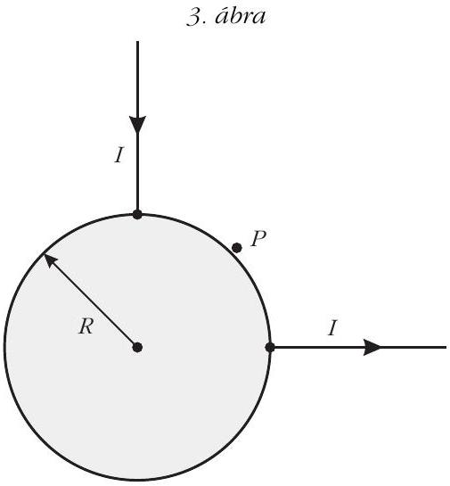

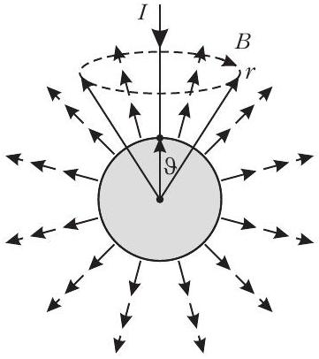
4. ábra

ha az igen jól vezetó gömböt valamekkora vezetóképességú „végtelen” közegbe helyezzük, és feszültséget kapcsolunk rá.)

Egyetlen áramvezetó esetén a mágneses mezó az egyenes vezetó által kijelölt „tengely” körül forgásszimmetrikus, és az indukcióvonalak, ahogy ezt meg fogjuk mutatni, kör alakúak.

A mágneses indukció nagyságát az Ampère-féle gerjesztési törvényból határozhatjuk meg. A gömb belsejében képzeletben felvett zárt görbe nem ölel körül áramot, ezért itt (amikor $r < R$ ) nincs mágneses tér. A gömbön kívül ( $r > R$ ) viszont a gerjesztési törvény így írható (lásd a 4. ábrát):

$$
2 \pi r \sin \vartheta B ( r , \vartheta ) = \mu _ { 0 } \left( I - \frac { 1 - \cos \vartheta } { 2 } I \right) .
$$

Felhasználtuk, hogy a 4. ábrán szaggatottan jelölt körvonallal határolt $r$ sugarú gömbsüveg felszíne $2 \pi r ^ { 2 } ( 1 - \cos \vartheta )$, az $r$ sugarú gömb felszíne pedig $4 \pi r ^ { 2 }$, emiatt a gömbszimmetrikusan kifolyó áram számításba vehetó része $I ( 1 - \cos \vartheta ) / 2$ erósségú. A mágneses indukció nagysága tehát

$$
B ( r , \vartheta ) = \frac { \mu _ { 0 } I } { 4 \pi } \frac { 1 + \cos \vartheta } { r \sin \vartheta } = \frac { \mu _ { 0 } I } { 4 \pi } \frac { \operatorname { ctg } ( \vartheta / 2 ) } { r } .
$$

Az áramvezetó közelében $( \vartheta \approx 0 )$ a kis szögekre érvényes $\operatorname { ctg } ( \vartheta / 2 ) \approx 2 / \vartheta$ összefüggés miatt éppen a végtelen egyenes vezetó́ körüli mágneses mezót kapjuk vissza; a bevezetett árammal ellentétes oldalon pedig ( $\vartheta \rightarrow 180 ^ { \circ }$ ) az indukció fokozatosan eltúnik.

Végezzük el ugyanezt a számítást a 90°-kal elforgatott egyenes vezetőn kivezetett és gömbszimmetrikusan bevezetett áramokra is, majd szuperponáljuk a két elrendezés mágneses terét (5. ábra). A gömb bel-

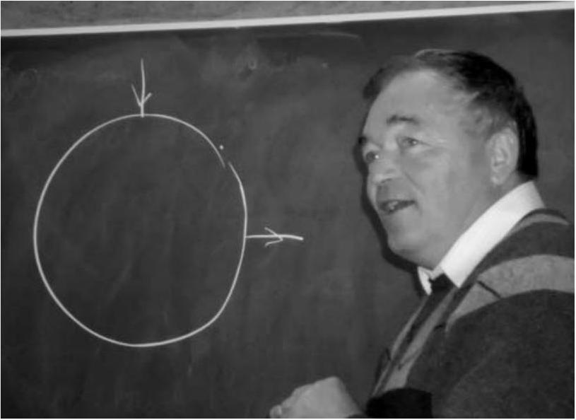
Gnädig Péter

sejében továbbra is mindenhol nulla lesz az indukció, a kérdéses $P$ pontban pedig (a gömbön kívül)

$$
B _ { P } = 2 B \left( R , 45 ^ { \circ } \right) = \frac { \mu _ { 0 } I } { 2 \pi R } \operatorname { ctg } 22,5 ^ { \circ } = \frac { \mu _ { 0 } I } { 2 \pi R } ( \sqrt { 2 } + 1 ) .
$$

Hátra van még annak igazolása, hogy a 4. ábrán látható hengerszimmetrikus elrendezésben mágneses indukcióvonalak csak kör alakúak lehetnek (bár ezt a bizonyítást a versenyzőktől nem vártuk el). A hengerszimmetria nem zárná ki, hogy az indukciónak radiális és a szimmetria tengelyével párhuzamos, „hosszanti" komponensei is legyenek. (Gondoljunk például a köráram szintén hengerszimmetrikus terére!)

Illesszünk az egyenes vezetóre és egy rajta kívül lévó $P$ pontra egy síkot, majd tükrözzük az egész elrendezést erre a síkra! A tükrözés után az árameloszlás pontosan olyan marad, amilyen eredetileg volt, tehát a tükrözés során a mágneses mező sem változhat meg.

A mágneses indukció - jóllehet vektorként szoktuk ábrázolni - nem egy irányított szakasz, a tér egyik pontjából egy másikba mutató nyíl (úgynevezett polárvektor, mint amilyen a helyvektor vagy az elektromos térerősség), hanem egy irányított körvonallal és egy nagysággal megadható mennyiség (mint például a szögsebesség vagy a forgatónyomaték). Az ilyen mennyiségeket axiálvektornak nevezik. A mágneses indukció körvonalát úgy kaphatjuk meg, ha megadjuk azt a síkot és körüljárási irányt, amely mentén egy megfeleló sebességgel mozgó töltött részecske (az adott pont közelében) körmozgást végezhet. A sík normálisa és a körmozgás körüljárási iránya biztosítja egyértelmúen az indukcióvektor irányítottságát.

Belátjuk, hogy a feladatban szereplő mágneses mezőnek nem lehet „radiális” (vagyis az áramvezetótól a $P$ pontba mutató vektorra meróleges síkú körvonallal szemléltethetó) komponense. Ez a komponens ugyanis az említett tük-

rözés során elójelet váltana, de ugyanakkor változatlannak is kell maradnia, ez a két feltétel pedig csak úgy teljesülhet egyszerre, ha a vizsgált indukciókomponens nagysága zérus (6.a ábra). Ugyanilyen okok miatt a mágneses indukciónak nem lehet „hoszszanti" (az egyenes vezetóre meróleges síkú körvonallal

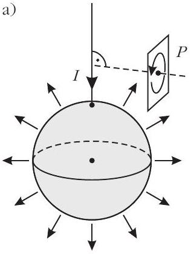
b)

megadható) komponense sem, hiszen az is elójelet váltana a tükrözés során, pedig értékének változatlannak kell maradnia (6.b ábra). A mágneses indukció harmadik, a tükrözés síkjába eső́ körvonallal megadható komponenséról semmit nem állíthatunk, hiszen azt a tükrözés múvelete változatlanul hagyja (6.c ábra).

Megjegyzés
A feladatra két teljesen hibátlan megoldás érkezett. Az egyik versenyzó́ bebizonyította, hogy a gömb felületén az áramvonalak körívek, és meghatározta az árameloszlást, majd ebból a keresett mágneses indukciót. A másik versenyzó́ azt mutatta meg, hogy a gömbön kívül az elrendezésnek ugyanolyan mágneses tere van, mint egy két félegyenesból összerakott L-alakú vezetéknek (amely viszont a Biot-Savart-törvénynyel könnyen meghatározható). Erre két további versenyzó is „ráérzett" (és így helyes eredményt kapott), de ezt nem igazolta.

A feladatok és megoldásaik ismertetése után került sor az eredményhirdetésre. A díjakat Kürti Jenố, az Eötvös Loránd Fizikai Társulat fótitkára adta át.

Egyetlen versenyzó sem oldotta meg az összes feladatot, így a versenybizottság nem adott ki elsố díjat.

Második díjat nyert és a verseny gyóztese Öreg Botond, a Budapesti Fazekas Mihály Gyakorló Általános Iskola és Gimnázium 12. osztályos tanulója, Horváth Gábor tanítványa.

Harmadik díjat nyert Fehér Zsombor és Janzer Barnabás, mindketten a Budapesti Fazekas Mihály

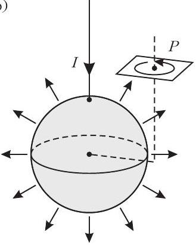
6. ábra

Gyakorló Általános Iskola és Gimnázium 12. osztályos tanulói és Horváth Gábor tanítványai.

Kiemelt dicséretben részesült Horicsányi Attila, az Egri Dobó István Gimnázium érettségizett tanulója, Hóbor Sándor tanítványa és Takátsy János, a budapesti Városmajori Gimnázium érettségizett tanulója, Ábrám László tanítványa - jelenleg mindketten az ELTE fizikus hallgatói.

Dicséretben részesült Morvay Bálint Géza, a pécsi Szent Mór Iskolaközpont érettségizett tanulója, Merényi Péter tanítványa - jelenleg a PTE fizikus hallgatója -; Olosz Balázs, a PTE Babits Mihály Gyakorló Gimnázium 12. osztályos tanulója, Koncz Károly tanítványa; Szántó András, a debreceni Mechwart András Gépipari és Informatikai Szakközépiskola 12. osztályos tanulója, Szõlõssi Irén tanítványa; Tari Balázs, a miskolci Földes Ferenc Gimnázium 12. osztályos tanulója, Bíró István és Zámborszky Ferenc tanítványa; valamint Virágh Anna, az Érdi Vörösmarty Mihály Gimnázium 12. osztályos tanulója, Varga László és Varga Zsolt tanítványa.

Minden díjazott és felkészítő tanáraik is megkapták az eredményhirdetés elốtt néhány nappal megjelent 333 furfangos feladat fizikából címú feladatgyújteményt, amelyet a szerzók - Gnädig Péter, Honyek Gyula és Vigh Máté, az Eötvös-versenybizottság egykori és mostani tagjai - dedikáltak. A MOL támogatásával a második díjjal 25 ezer, a harmadik díjjal 20 ezer, a kiemelt dicsérettel 10 ezer forint pénzjutalom járt, a dicséretesek pedig a Typotex Kiadó által felajánlott könyvet kaptak.

Az elsó sorban balról a második a verseny győztese: Öreg Botond.
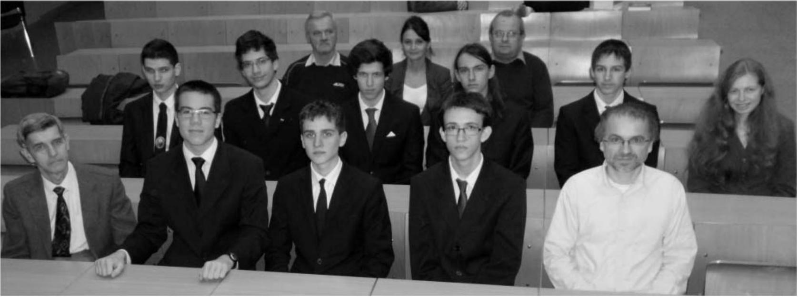

[^0]:    ${ } ^ { 1 }$ Részletek a verseny honlapján: http://mono.eik.bme.hu/~vanko/ fizika/eotvos.htm
