# BESZÁMOLÓ A 2015. ÉVI EÖTVÖS-VERSENYRŐL

Tichy Géza - ELTE Anyagfizikai Tanszék Vankó Péter - BME Fizika Tanszék Vigh Máté - ELTE Komplex Rendszerek Fizikája Tanszék

Az Eötvös Loránd Fizikai Társulat 2015. évi Eötvösversenye október 16-án délután 3 órai kezdettel tizenöt magyarországi helyszínen ${ } ^ { 1 }$ került megrendezésre. Ezért külön köszönettel tartozunk mindazoknak, akik ebben szervezéssel, felügyelettel a segítségünkre voltak. A versenyen a három feladat megoldására 300 perc áll rendelkezésre, bármely írott vagy nyomtatott segédeszköz használható, de zsebszámológépen kívül minden elektronikus eszköz használata tilos. Az Eötvös-versenyen azok vehetnek részt, akik vagy középiskolai tanulók, vagy a verseny évében fejezték be középiskolai tanulmányaikat. Összesen 84 versenyzó adott be dolgozatot, 21 egyetemista és 63 középiskolás.

Az ünnepélyes eredményhirdetésre és díjkiosztásra 2015. november 20-án délután került sor az ELTE TTK Harmónia termében. Az idei díjazottakon kívül meghívást kaptak az 50 és a 25 évvel ezelốtti Eötvösverseny nyertesei is. Először az akkori feladatokat mutattuk be.

## Az 1965. évi Eötvös-verseny feladatai

1. feladat
$S = 20$ méter hosszú, súlyos, hajlékony kötél egy kisméretú, súrlódás nélküli csigán van átvetve úgy, hogy hogy az egyik oldalon $s _ { 0 } = 12$ méter hosszú darabja lóg le. A kötelet elengedjük. Mennyi a kötél sebessége akkor, amikor az alsó kötélvég a) 16 méterre, b) 40 méterre van a csiga alatt? $g = 1000 \mathrm {~cm} / \mathrm { s } ^ { 2 }$.
2. feladat
Hat, kör alakú, vezetó fémlemezt helyezünk el egymás mellé, párhuzamosan. A szomszédok közötti $d$ távolság egyenló́ és kicsiny a lemezek sugarához képest. A lemezek sugara váltakozva $R$ és $2 R$. A lemezek középpontjai a síkjaikra meróleges egyenesen vannak. Kapcsoljuk össze a lemezeket úgy, hogy a keletkező kondenzátor kapacitása maximális legyen! Mekkora ez a kapacitás? Hogyan helyezkednek el a töltések a lemezeken?
3. feladat
Adva van egy negyedkörben meghajlított vastag üveglemez, amely egyenes részben folytatódik. Mi a feltétele annak, hogy az egyik véglapra merőlegesen beesó́ fénysugár
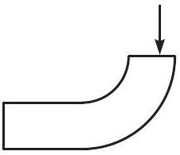
ne lépjen ki az üveglemez oldalfalain? (Csak a másik végén.) Csak a rajz síkjában haladó fénysugarakkal foglalkozzunk.

Az 1965-ös versenyen még csak érettségizett tanulók indulhattak (gimnazisták csak versenyen kívül). Ebben az évben két I. díjat osztottak ki (II. és III. díjat pedig egyet sem), a két díjazott: Gnädig Péter, a budapesti Táncsics Mihály Gimnázium érettségizett tanulója, tanára Henter Lászlóné, valamint Juvancz Gábor a budapesti Fazekas Mihály Gimnázium érettségizett tanulója, tanárai Fábián Zoltán és Wiedemann László.

## Az 1990. évi Eötvös-verseny feladatai

1. feladat
Lemezjátszó korongjának közepére helyezett tálban víz van. A vízen egy pingponglabda úszik. Mi történik a pingponglabdával, miután megindítottuk a lemezjátszót?
2. feladat
Vízszintes helyzetú körlemezekből álló síkkondenzátort feltöltünk. A kondenzátor közelében a lemezek közti távolságot felezó vízszintes síkban kis iránytút helyezünk el. Ezután a kondenzátort a függőleges szimmetriatengely körüli forgásba hozzuk. Megmozdul-e az iránytú, s ha igen, merre?
3. feladat
Vízben szuszpendált, $d = 0,5 \mu \mathrm {~m}$ átmérójú, gömb alakú részecskék termikus egyensúlyi eloszlását vizsgáljuk mikroszkópon keresztül. A mikroszkóp tubusa függőleges. A részecskék anyagának súrúsége $1040 \mathrm {~kg} / \mathrm { m } ^ { 3 }$, a hőmérséklet 23 °C. A mikroszkóp mélységélessége kicsi, mindig csak egy igen vékony vízrétegben lévó́ részecskék láthatók élesen. Mennyivel kell lejjebb sülylyeszteni a mikroszkóp tubusát, hogy kétszer annyi részecskét lássunk? A víz törésmutatója $n = 1,33$.

Az 1990-es verseny díjazottjai: I. díjat kapott Bodor András, az ELTE Apáczai Csere János Gyakorló Gimnáziumának IV. osztályos tanulója, tanára: Zsigri Ferenc; II. díjat kapott Horváth Tibor, a kecskeméti Katona József Gimnázium IV. osztályos tanulója, tanára: Kocsisné Domján Erzsébet, valamint Zóka Gábor, a nagyatádi Ady Endre Gimnázium érettségizett tanuló-

[^0]
ja, tanára Knapp Ottó; III. díjat kapott Egyedi Péter, a pécsi Leówey Klára Gimnázium IV. osztályos tanulója, tanára Csikós Istvánné, Maróti Miklós, a szegedi Radnóti Miklós Gimnázium IV. osztályos tanulója, tanára Dudás Zoltánné, valamint Tokodi Tamás, a JATE Ságvári Endre Gyakorló Gimnázium érettségizett tanulója, tanárai Kocsis Vilmos és Gyốri István.

Gnädig Péter, az 50 évvel ezelốtti egyik gyốztes külföldi útja miatt nem tudott eljönni, de üzenetét Vankó Péter felolvasta. A 25 évvel ezelótti díjazottak közül Horváth Tibor és Maróti Miklós jött el az alkalomra, utóbbi az akkori feladatok ismertetése után röviden beszélt a versennyel kapcsolatos emlékeiról és pályájáról.

Ezután következett a 2015. évi verseny feladatainak és megoldásainak bemutatása. Az 1. feladat megoldását Vigh Máté, a 2. feladatét Vankó Péter, a harmadik feladatét Tichy Géza ismertette.

## A 2015. évi Eötvös-verseny feladatai

1. feladat kitúzte: Vigh Máté Egy $L = 6 \mathrm {~m}$ hosszúságú, merev deszkalap síkja a vízszintessel állandó, $\alpha = 10 ^ { \circ }$-os szöget zár be. Az így kialakított lejtó́ tetejére egy kis hasábot helyezünk. A deszkát a lejtésvonalával párhuzamos irányban $A = 1 \mathrm {~mm}$ amplitúdóval és $\omega = 500 \mathrm {~s} ^ { - 1 }$ körfrekvenciával harmonikusan rezgetni kezdjük.
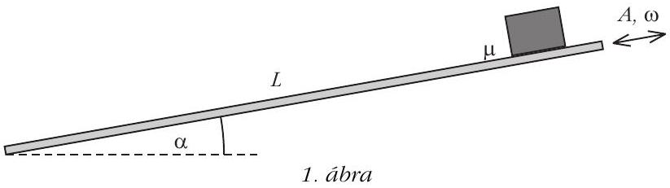

Mennyi idő alatt éri el a hasáb a lejtő alját? (A csúszási és tapadási súrlódási együttható értéke egyaránt $\mu = 0,4$, a hasáb a mozgás során nem borul fel.)

Megoldás
Az $m$ tömegú hasábra az $m g$ nehézségi erő, az $N$ kényszereró és az $F$ (csúszási vagy tapadási) súrlódási eró hat (utóbbi iránya a deszkalap rezgetése során változik). A test mozgásegyenletei a lejtóre meróleges, illetve azzal párhuzamos irányban:

$$
\begin{aligned}
N - m g \cos \alpha & = 0 , \\
F + m g \sin \alpha & = m a .
\end{aligned}
$$

A gyorsulásnál a lejtés irányát választottuk pozitívnak, lásd a 2. ábrát.
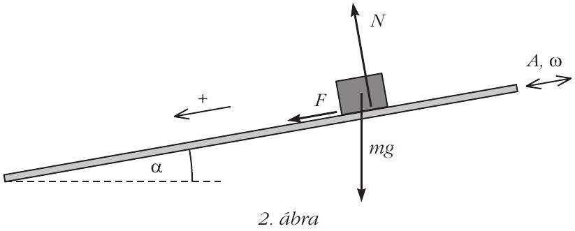

Tapadás esetén a kényszereró és a súrlódási eró között az $| F | \leq \mu N$ egyenlőtlenség áll fenn, míg csúszásnál $| F | = \mu N$. A hasáb gyorsulása akkor a lehetó legnagyobb, ha a hasáb csúszik, és a hasáb deszkáboz viszonyított (relatív) sebessége negatív irányba mutat. Ekkor

$$
a _ { \max } = g ( \sin \alpha + \mu \cos \alpha ) ,
$$

az adatok behelyettesítése után $a _ { \text {max } } \approx 5,6 \mathrm {~m} \mathrm {~s} ^ { - 2 }$ adódik. A deszkalap legnagyobb gyorsulása a harmonikus rezgés következtében $A \omega ^ { 2 } = 250 \mathrm {~m} \mathrm {~s} ^ { - 2 }$, amely több mint 40-szer akkora, mint $a _ { \text {max } }$ értéke, így a hasáb a rezgetés indításakor azonnal megcsúszik. Látni fogjuk, hogy további mozgása során a test sehol sem tapad meg, tehát mindvégig az (állandó nagyságú) csúszási súrlódási eró hat rá.

A hasáb gyorsulása a mozgás során tehát kétféle értéket vehet fel aszerint, hogy a súrlódási erố éppen a pozitív vagy negatív irányba mutat:

$$
a _ { \pm } = g ( \sin \alpha \pm \mu \cos \alpha ) ,
$$

és mivel a megadott számadatok szerint $\mu > \operatorname { tg } \alpha$, így $a _ { + }$elójele pozitív, $a _ { - }$elójele pedig negatív. Az $a _ { + }$ gyorsulású mozgásszakasz addig tart, amíg a deszka (elójeles) sebessége nagyobb a hasáb sebességénél, míg az $a _ { - }$gyorsulású mozgásszakaszban a helyzet éppen fordított. A 3. ábrán látható grafikonon ábrázoltuk a deszkalap és a hasáb sebességét az idó függvényében. Utóbbi egy olyan töröttvonallal ábrázolható, ahol az egyes szakaszok meredeksége $a _ { + }$és $a _ { - }$. Mivel $\left| a _ { + } \right| > \left| a _ { - } \right|$, így a hasáb egy periódusra vett átlagsebessége (a „sodródási sebesség”) egyre növekszik, miközben a test lefelé sodródik a deszkán.
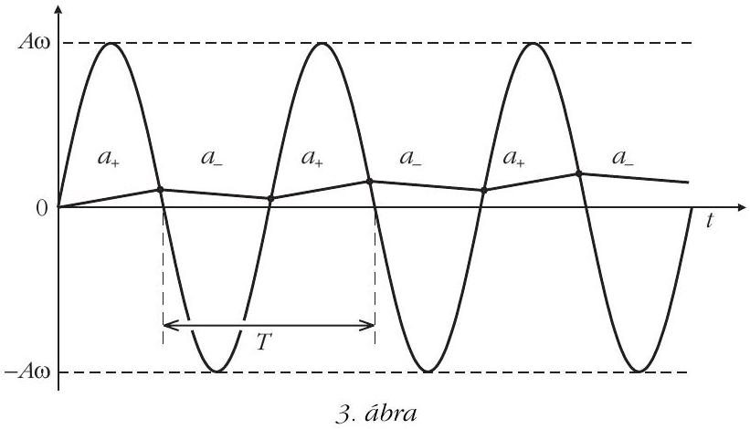

A sodródási sebesség növekedése addig tart, amíg a hasáb átlaggyorsulása zérussá nem válik. Ezután a hasáb sebessége egy állandó $v _ { \text {drift } }$ érték körül fluktuál (4. ábra). Ez az állandósult (stacionárius) mozgás a viszonylag nagy rezgetési frekvencia miatt hamar kialakul, így a teljes mozgási idő becslésekor a kezdeti felgyorsulás idószakát el is hanyagolhatjuk.

Az állandósult sodródás feltétele:

$$
\langle a \rangle \equiv \frac { a _ { + } t _ { + } + a _ { - } t _ { - } } { T } = 0 .
$$

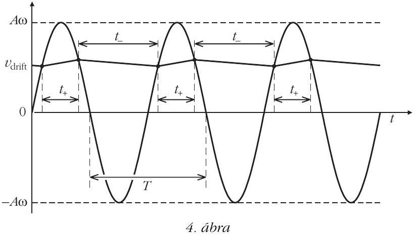
Természetesen fennáll a

$$
T = t _ { + } + t _ { - }
$$

egyenlóség is. Az egyenletekból megkaphatjuk a $t _ { + }$ idótartam hosszát:

$$
t _ { + } = \frac { a _ { - } } { a _ { - } - a _ { + } } T = \left( 1 - \frac { \operatorname { tg } \alpha } { \mu } \right) \frac { T } { 2 } .
$$

A sodródási sebességet pedig abból a feltételból határozhatjuk meg, hogy a hasáb gyorsulása akkor vált irányt, amikor a deszka és a hasáb sebessége megegyezik. A sebesség ( $v _ { \text {drift } }$ értékéhez képest kicsiny) fluktuációját elhanyagolva:

$$
v _ { \mathrm { drift } } \approx A \omega \cos \left( \omega \frac { t _ { + } } { 2 } \right) .
$$

Végül, behelyettesítve a $T _ { + }$-ra kapott eredményt:

$$
v _ { \mathrm { drift } } = A \omega \cos \left[ \left( 1 - \frac { \operatorname { tg } \alpha } { \mu } \right) \frac { \pi } { 2 } \right] = A \omega \sin \left( \frac { \pi \operatorname { tg } \alpha } { 2 \mu } \right) .
$$

A számszerú adatokat felhasználva $v _ { \text {drift } } \approx 0,32 \mathrm {~ms} ^ { - 1 }$ értéket kapunk, így a hasáb mozgásának becsült ideje

$$
t = \frac { L } { v _ { \mathrm { drift } } } \approx 18,8 \mathrm {~s} .
$$

Hátravan még annak belátása, hogy a hasáb valóban nem tapad meg soha a lejtőn. A megtapadásnak két feltétele van: az egyik, hogy egy adott pillanatban a test és a deszkalap sebessége megegyezzen; a másik, hogy ugyanebben a pillanatban a deszka gyorsulásának nagysága kisebb legyen $\left| a _ { + } \right|$-nál vagy $\left| a _ { - } \right|$-nál aszerint, hogy a deszka épp lefelé vagy felfelé gyorsul. A sebesség-idő grafikonról látszik, hogy ez a két feltétel csak akkor következhet be, amikor a deszka gyorsulása nagyon kicsi, azaz sebessége nagy ( $A \omega$-hoz közeli). Ekkora sebességre azonban a hasáb nem tud felgyorsulni, mert már elóbb beáll a nála jóval kisebb $v _ { \text {drift } }$. A hasáb tehát mindvégig csúszva halad a lejtón.

Megjegyzés
A megoldás során felhasználtuk, hogy a mozgás első, átmeneti szakasza (amely alatt a hasáb átlagsebessége eléri a $v _ { \text {drift } }$ értéket) rövid. Részletesebb számolással megmutatható, hogy ez az idótartam

$$
\tau \approx \frac { A \omega } { \mu g \cos \alpha } \approx 0,13 \mathrm {~s}
$$

nagyságrendú, tehát a becslésnél elkövetett hibánk valóban elhanyagolható (1-2\% körüli érték).
2. feladat kitúzte: Tichy Géza és Vankó Péter

A fényképen látható vékony lencse átméróje 4,00 cm, a lencse és a mérószalag távolsága 5,0 cm.

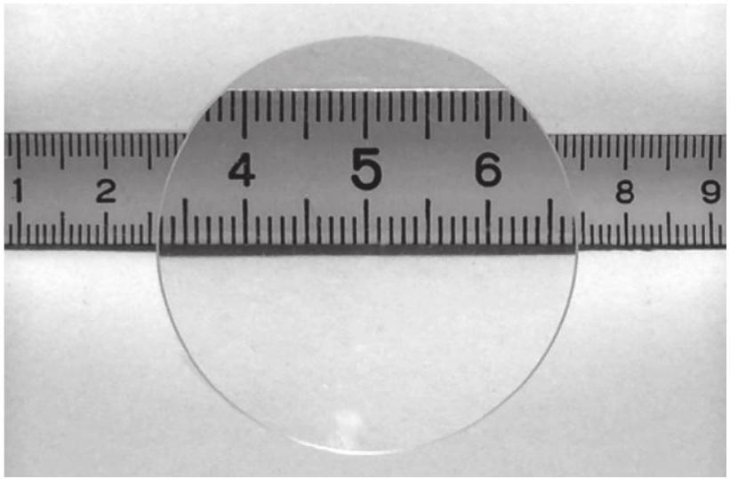
5. ábra

Mekkora a lencse fókusztávolsága?
Megoldás
A képen (5. ábra) látható, hogy a lencse a mérốszalagról egyenes állású, nagyított, látszólagos képet hoz létre. A képről két adat olvasható le: a lencsén belül (nagyítva) látható mérószalagszakasz hossza (ezt jelöljük $d _ { 1 }$-gyel) és az a távolság, amit a lencse kitakar a mérószalagból (ez legyen $d _ { 2 }$ ).

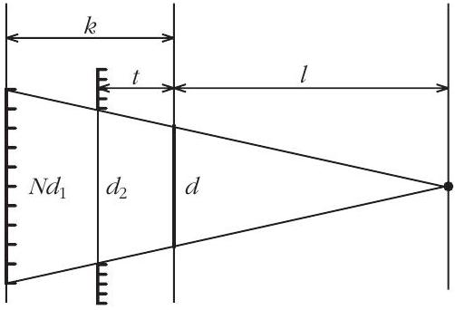
6. ábra

Készítsünk vázlatot az optikai elrendezésról (6. ábra)! A rajzon három sík látható: a lencse síkja, a mérószalag síkja és a látszólagos kép síkja. Az átmérók közül a lencse $d$ átméróje meg van adva, a $d _ { 2 }$ átmérőt leolvastuk a képről, a látszólagos kép átméróje pedig $N d _ { 1 }$, ahol $d _ { 1 }$ a képról leolvasott méret és $N$ a nagyítás. A távolságok közül a $t$ tárgytávolság (a lencse és a mérószalag távolsága) meg van adva, a $k$ képtávolság és az $l$ távolság (a lencse és a fényképezógép távolsága) egyelőre ismeretlen.

A rajzon ábrázolt mennyiségek között egyszerú összefüggéseket írhatunk fel. A lencsetörvény alapján:

$$
\frac { 1 } { f } = \frac { 1 } { t } - \frac { 1 } { k } ,
$$

ahol $f$ a keresett fókusztávolság (a látszólagos képtávolság negatív, de $k$-t pozitív távolságként jelöltük). A nagyítás:

$$
N = \frac { k } { t } ,
$$

a látószögek egyenlóségéból (hasonló háromszögek):

$$
\frac { N d _ { 1 } } { k + l } = \frac { d _ { 2 } } { t + l } = \frac { d } { l } .
$$

Az egyenletrendszert rendezve ( $k$-t, $l$-t és $N$-t kiejtve):

$$
f = \frac { t d } { d _ { 2 } - d _ { 1 } } .
$$

Mielốtt ebbe a kifejezésbe behelyettesítenénk a megadott és leolvasott adatokat, foglalkoznunk kell az adatok hibájával is! Nem véletlenül szerepel a szövegben 4,00 cm és 5,0 cm. A lencse átmérójét tolóméróvel meg lehet mérni, így az tizedmilliméter (századcentiméter) pontossággal megadható. A lencse és a mérószalag távolsága már nem mérhetó ilyen pontosan, hiszen a lencse vastagsága sem nulla - ezt az adatot már csak milliméter pontosan adja meg a feladat szövege. A legkritikusabb a $d _ { 1 }$ és $d _ { 2 }$ távolságok minél pontosabb leolvasása, mert a fókusztávolság képletében ezek különbsége szerepel. Gondos megfigyeléssel ezek az átmérók néhány tizedmilliméter pontossággal leolvashatók a képról.

A megadott és leolvasott adatok hibájából már a hibaszámítás ismert szabályai szerint meghatározható a fókusztávolság relatív hibája:

$$
\frac { \Delta f } { f } = \frac { \Delta t } { t } + \frac { \Delta d } { d } + \frac { \Delta d _ { 1 } + \Delta d _ { 2 } } { d _ { 2 } - d _ { 1 } } .
$$

A megadott és leolvasott adatok hibával:

$$
\begin{aligned}
t & = 5 \pm 0,05 \mathrm {~cm} , \\
d & = 4 \pm 0,005 \mathrm {~cm} , \\
d _ { 1 } & = 3,4 \pm 0,02 \mathrm {~cm} , \\
d _ { 2 } & = 4,9 \pm 0,02 \mathrm {~cm} .
\end{aligned}
$$

Ebból a numerikus eredmény: $f = 13,3 \pm 0,5 \mathrm {~cm}$.
Megjegyzések

1. A versenyzók egy része másképp gondolkozott, másféleképp oldotta meg a feladatot. E megoldások gondolatmenete a következő.

A megadott adatok ( 7. ábra) és a leolvasott $d _ { 2 }$

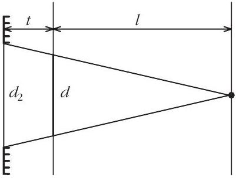
7. ábra

„külsó” átméró alapján
hasonló háromszögek segítségével kifejezhetó a lencse és a fényképezógép $l$ távolsága:

$$
l = \frac { t d } { d _ { 2 } - d }
$$

A 8. ábrán az látható, hogy a nagyított képen még éppen látható pontokból (a $d _ { 1 }$ „belső“ átméró két széléról) induló (és a lencsén megtörve a fény-
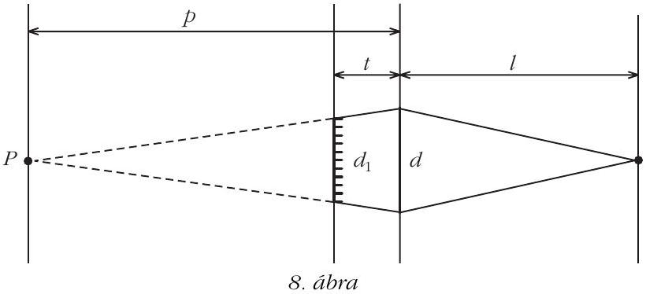
képezógépbe jutó) fénysugarak olyanok, mintha egy képzeletbeli $P$ pontból indulnának. A $P$ pont lencsétốl mért $p$ távolsága az elózőhöz hasonló módon kifejezhetố:

$$
p = \frac { t d } { d - d _ { 1 } } .
$$

A képzeletbeli $P$ pontból induló fénysugarak a lencsén megtörve éppen a fényképezógépbe jutnak, így a lencsetörvény alapján

$$
\frac { 1 } { f } = \frac { 1 } { p } + \frac { 1 } { l } ,
$$

amiból $l$ és $p$ behelyettesítésével és átrendezéssel a fókusztávolságra a már korábban levezetett eredményt kapjuk.
2. A versenyzők közül senki sem foglalkozott a hibákkal, és a leolvasást is „nagyvonalúan” végezték ( $\mathrm { a } d _ { 2 }$ átmérót legtöbben kereken 5 cm-nek, mások 4,8 cm-nek vették). Egy 1 mm-es leolvasási hiba 1 cm-es hibát okoz a fókusztávolságban - ennek ellenére az eredményt legtöbben 4-5 értékes jegy pontossággal adták meg. Így erre a feladatra - bár 16-an lényegében helyesen megoldották - senki se adott teljes értékú megoldást.
3. feladat Holics László feladata nyomán kitúzte: Gnädig Péter
Egy hosszú, vékony, egyenes tekercs (szolenoid) hossza $l = 1 \mathrm {~m}$, átméróje $D _ { 1 } = 2 \mathrm {~cm}$, meneteinek száma $N _ { 1 } = 2000$, ohmos ellenállása elhanyagolható. A tekercs kivezetéseire 100 V effektív feszültségú, 100 kHz frekvenciájú váltakozó feszültséget kapcsolunk. A szolenoid mellett, annak közvetlen közelében, a tengelyére meróleges felezósíkban egy $N _ { 2 } = 200$ menetszámú, lapos, $D _ { 2 } = 3 \mathrm {~cm}$ átmérójú tekercs helyezkedik el.

Mekkora effektív feszültséget mutat a lapos tekercsre kapcsolt (ideálisnak tekinthetó) voltméró?

Egy tanárlegenda, Holics László és a díjazott diákok.

1. megoldás

A hosszú tekercsben folyó áram hatására a tekercs belsejében valamekkora, idóben periodikusan változó $\boldsymbol { \Phi } ( t )$ mágneses fluxus jön létre. A változó mágneses fluxus a hosszú tekercs minden menetében feszültséget indukál, ezek összege minden pillanatban megegyezik a tekercsre kapcsolt váltakozó feszültséggel:

$$
U _ { 1 } ( t ) = N _ { 1 } \frac { \Delta \Phi ( t ) } { \Delta t } .
$$

A lapos tekercsben nem folyik áram (a voltméró ellenállása nagyon nagy), de a hosszú tekercs szórt mágneses tere feszültséget indukál benne. A feladat e szórt tér meghatározása.

A tekercsen kívüli mágneses mezó ( $l \gg D _ { 1 }$ miatt) jó közelítéssel olyan, mintha a tekercs egyik végén egy pontszerú forrásból összesen $\Phi ( t )$ mágneses fluxus indulna ki gömbszimmetrikusan, a tekercs másik végén pedig ugyanekkora fluxus nyelődne el (vagyis mintha egy $- \Phi ( t )$ erósségú forrás helyezkedne el ott).

A lapos tekercs a hosszú tekercs felezósíkjában, a hosszú tekercshez közel helyezkedik el, így ezen a helyen mindkét forrás külön-külön

$$
B ( t ) = \frac { \Phi ( t ) } { 4 \pi \left( \frac { l } { 2 } \right) ^ { 2 } }
$$

mágneses indukciót hoz létre (mert a $\boldsymbol { \Phi }$ fluxus egy $l / 2$ sugarú gömb felületén oszlik el egyenletesen). A lapos tekercs közel van a hosszú tekercshez, így $B$ közel meróleges a felületére. A lapos tekercsen áthaladó teljes (mindkét forrásból származó) fluxus emiatt:

$$
\Phi _ { 2 } ( t ) = 2 B ( t ) \pi \left( \frac { D _ { 2 } } { 2 } \right) ^ { 2 } = \frac { 1 } { 2 } \left( \frac { D _ { 2 } } { l } \right) ^ { 2 } \Phi ( t ) .
$$

Ez az idóben változó fluxus a lapos tekercsben

$$
\begin{aligned}
U _ { 2 } ( t ) & = N _ { 2 } \frac { \Delta \Phi _ { 2 } ( t ) } { \Delta t } = \frac { 1 } { 2 } N _ { 2 } \left( \frac { D _ { 2 } } { l } \right) ^ { 2 } \frac { \Delta \Phi ( t ) } { \Delta t } = \\
& = \frac { 1 } { 2 } \frac { N _ { 2 } } { N _ { 1 } } \left( \frac { D _ { 2 } } { l } \right) ^ { 2 } U _ { 1 } ( t )
\end{aligned}
$$

feszültséget indukál. (Felhasználtuk $U _ { 1 } ( t )$ korábban felírt kifejezését.)

Az $U _ { 1 } ( t )$ és $U _ { 2 } ( t )$ feszültségek minden pillanatban arányosak egymással, így az effektív értékek aránya is ugyanekkora. Ebbő́l a keresett feszültség:

$$
U _ { 2 } = \frac { 1 } { 2 } \frac { N _ { 2 } } { N _ { 1 } } \left( \frac { D _ { 2 } } { l } \right) ^ { 2 } U _ { 1 } \approx 4,5 \mathrm { mV } .
$$

2. megoldás Fehér Zsombor megoldása alapján

Egy hosszú, egyenes tekercs (szolenoid) belsejében kialakuló mágneses indukció nagyságára jól ismert a következő összefüggés:

$$
B _ { \infty } = \mu _ { 0 } \frac { N I } { l } ,
$$

ahol $N$ a tekercs menetszáma, $I$ a tekercsen átfolyó áramerósség és $l$ a tekercs hossza, valamint $\mu _ { 0 }$ értéke $4 \pi \cdot 10 ^ { - 7 } \mathrm { Vs } / \mathrm { Am }$.

Ez az összefüggés azonban véges hosszúságú tekercsre csak közelítôleg igaz! A véges hosszúságú tekercs terét helyesen a következó kifejezés adja meg:

$$
B = B _ { \infty } \cos \alpha = \mu _ { 0 } \frac { N I } { l } \cos \alpha ,
$$

ahol $\alpha$ a tekercs zárókörének fél látószöge a tekercs középpontjából nézve. Ez az összefüggés a Biot-Savart-törvény segítségével levezethető (lásd a 2. megjegyzésben).

Hosszú, vékony tekercsnél $\alpha \ll 1$, és így $\cos \alpha \approx 1$, tehát az ismert összefüggés általában jó közelítésként használható. Ebben a feladatban azonban pont ez a kicsi különbség lesz számunkra fontos!
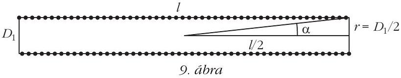

Elóször fejezzük ki cos $\alpha$-t a tekercs adataival ( 9. ábra, kihasználjuk, hogy $\alpha \ll 1$, sin $\alpha \ll 1$.):

$$
\cos \alpha = \sqrt { 1 - \sin ^ { 2 } \alpha } \approx 1 - \frac { 1 } { 2 } \sin ^ { 2 } \alpha \approx 1 - \frac { 1 } { 2 } \left( \frac { D _ { 1 } } { l } \right) ^ { 2 } .
$$

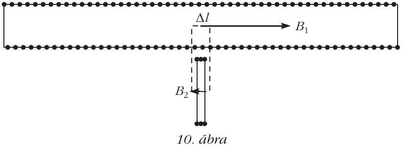

Írjuk fel a gerjesztési törvényt egy olyan kis téglalapra, amelynek két oldala a két tekercs tengelyén fekszik (10. ábra):

$$
B _ { 1 } \Delta l + B _ { 2 } \Delta l = \mu _ { 0 } n I = \mu _ { 0 } N _ { 1 } \frac { \Delta l } { l } I = \mu _ { 0 } \frac { N _ { 1 } I } { l } \Delta l ,
$$

ahol $B _ { 1 }$ és $B _ { 2 }$ a hosszú, illetve a rövid tekercsben lévó indukció nagysága, $n$ pedig a kis hurok által körülfogott menetek száma. (Felhasználtuk, hogy a tengelyre meróleges indukciókomponens a szolenoid tengelye tájékán elhanyagolható.)

A hosszú tekercsben a mágneses indukció

$$
B _ { 1 } = \mu _ { 0 } \frac { N _ { 1 } I } { l } \cos \alpha \approx \mu _ { 0 } \frac { N _ { 1 } I } { l } \left[ 1 - \frac { 1 } { 2 } \left( \frac { D _ { 1 } } { l } \right) ^ { 2 } \right] ,
$$

amit felhasználva

$$
B _ { 2 } = \mu _ { 0 } \frac { N _ { 1 } I } { l } - B _ { 1 } = \frac { 1 } { 2 } \left( \frac { D _ { 1 } } { l } \right) ^ { 2 } \mu _ { 0 } \frac { N _ { 1 } I } { l } \approx \frac { 1 } { 2 } \left( \frac { D _ { 1 } } { l } \right) ^ { 2 } B _ { 1 } .
$$

A tekercsekben indukált feszültség arányos a tekercsek menetszámával és az egy meneten áthaladó fluxussal, amiból a keresett feszültség:

$$
U _ { 2 } = \frac { N _ { 2 } B _ { 2 } \pi \left( \frac { D _ { 2 } } { 2 } \right) ^ { 2 } } { N _ { 1 } B _ { 1 } \pi \left( \frac { D _ { 1 } } { 2 } \right) ^ { 2 } } U _ { 1 } = \frac { 1 } { 2 } \frac { N _ { 2 } } { N _ { 1 } } \left( \frac { D _ { 2 } } { l } \right) ^ { 2 } U _ { 1 } ,
$$

az 1. megoldással megegyezóen.
Megjegyzések

1. A megoldásban nem használtuk fel a megadott adatok közül a hosszú tekercs $D _ { 1 }$ átméróje, valamint a rákapcsolt feszültség frekvenciájának számértékét. Ugyanakkor mindkét adat nagyságrendje fontos a megoldáshoz! Felhasználtuk, hogy $l \gg D _ { 1 }$, mert emiatt közelíthettük a külsó teret két pontforrás terével. A hosszú tekercs induktív ellenállása és így a tekercsen folyó áram nagysága függ a frekvenciától. Ha a frekvencia sokkal kisebb (például 50 Hz) lenne, akkor a tekercsen a rákapcsolt 100 V feszültség hatására olyan nagy áram indulna meg, amely a tekercset azonnal szétolvasztaná.
2. A véges hosszúságú tekercs terének levezetése. Egy $r$ sugarú körvezetóben folyó $\mathrm { d } I$ áram által keltett mágneses indukciót a kör síkjára meróleges szimmetriatengely mentén, a kör síkjától $b$ távolságra könynyen felírhatjuk a Biot-Savart-törvény segítségével:

$$
B ( b ) = \frac { \mu _ { 0 } \mathrm {~d} I } { 4 \pi } \frac { 2 r \pi } { r ^ { 2 } + b ^ { 2 } } \frac { r } { \sqrt { r ^ { 2 } + b ^ { 2 } } } = \frac { \mu _ { 0 } r ^ { 2 } \mathrm {~d} I } { 2 \left( r ^ { 2 } + b ^ { 2 } \right) ^ { \frac { 3 } { 2 } } } .
$$

Rakjuk össze az $l$ hosszúságú $N$ menetes tekercset $\mathrm { d } h$ vastagságú kis köráramokból. Ekkor egy ilyen kis körben

$$
\mathrm { d } I = \frac { N I } { l } \mathrm {~d} b
$$

áram folyik, ami a tengelye mentén, a síkjától $h$ távolságra

$$
\mathrm { d } B = \frac { \mu _ { 0 } N I r ^ { 2 } } { 2 l \left( r ^ { 2 } + h ^ { 2 } \right) ^ { \frac { 3 } { 2 } } } \mathrm {~d} h
$$

indukciót hoz létre.
A tekercs középpontjában lévố indukciót úgy kapjuk meg, hogy ezeket a kis indukciójárulékokat összegezzük $h = - l / 2$-tól $h = l / 2$-ig:

$$
\begin{aligned}
B & = \int _ { - \frac { l } { 2 } } ^ { \frac { l } { 2 } } \mathrm {~d} B = \frac { \mu _ { 0 } N I r ^ { 2 } } { 2 l } \int _ { - \frac { l } { 2 } } ^ { \frac { l } { 2 } } \frac { \mathrm {~d} b } { \left( r ^ { 2 } + h ^ { 2 } \right) ^ { \frac { 3 } { 2 } } } = \\
& = \frac { \mu _ { 0 } N I } { l } \frac { \frac { l } { 2 } } { \sqrt { \left( \frac { l } { 2 } \right) ^ { 2 } + r ^ { 2 } } } = \frac { \mu _ { 0 } N I } { l } \cos \alpha ,
\end{aligned}
$$

ahol $\alpha$ a tekercs zárókörének fél nyílásszöge a tekercs középpontjából nézve (lásd a 9. ábrát).

Ezután került sor az eredményhirdetésre. A díjakat Patkós András, az Eötvös Loránd Fizikai Társulat elnöke adta át.

Egyetlen versenyzó sem oldotta meg mindhárom feladatot, ezért a versenybizottság 2015-ben nem adott ki elsó díjat.

Egy feladat helyes és egy feladat lényegében helyes megoldásáért második díjat nyert Fehér Zsombor, a Budapesti Fazekas Mihály Gyakorló Általános Iskola és Gimnázium érettségizett tanulója, Horváth Gábor tanítványa - jelenleg az ELTE matematikus hallgatója; Holczer András, a Pécsi Janus Pannonius Gimnázium érettségizett tanulója, Dombi Anna és Kotek László tanítványa - jelenleg a BME villamosmérnök hallgatója; Juhász Dániel, a Szegedi Radnóti Miklós Kísérleti Gimnázium 12. osztályos tanulója, Csányi Sándor tanítványa; Sal Kristóf, a Budapesti Fazekas Mihály Gyakorló Általános Iskola és Gimnázium 12. osztályos tanulója, Kotek László és Horváth Gábor tanítványa, valamint Tompa Tamás Lajos, a miskolci Földes Ferenc Gimnázium 11. osztályos tanulója, Zámborszky Ferenc és Kovács Benedek tanítványa.

Egy feladat helyes megoldásáért és a hozzáfúzött diszkusszióért harmadik díjat nyert Balogh Menyhért,

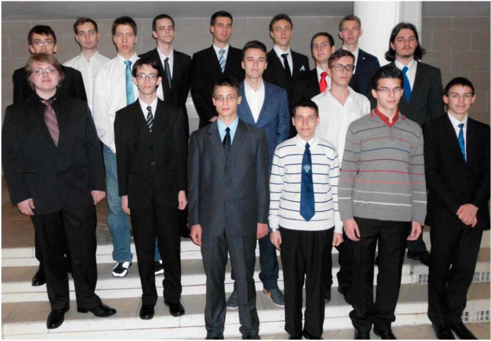
A 2015. évi Eötvös-versenyen legeredményesebben szereplő diákok. (Fotók: Tichy-Rács Ádám)

a budapesti Baár-Madas Református Gimnázium 12. osztályos tanulója, Horváth Norbert tanítványa.

Egy feladat lényegében helyes megoldásáért dicséretben részesült Bege Áron, a Budapesti Fazekas Mihály Gyakorló Általános Iskola és Gimnázium 11. osztályos tanulója, Horváth Gábor és Szokolai Tibor tanítványa; Bencsik Bálint, az Óbudai Árpád Gimnázium 12. osztályos tanulója, Nagy Attila tanítványa; Bugár Dávid, a komáromi Selye János Gimnázium érettségizett tanulója, Szabó Endre tanítványa - jelenleg az ELTE fizikus hallgatója; Forrai Botond, a budapesti Baár-Madas Református Gimnázium 12. osztályos tanulója, Horváth Norbert tanítványa; Frey Balázs, a Váci Szakképzési Centrum Boronkay György Múszaki Szakközépiskola és Gimnázium 12. osztályos tanulója, Tóth Eszter tanítványa; Gémes Antal, a hódmezóvásárhelyi Bethlen Gábor Református Gimnázium 11. osztályos tanulója, Lakatos-Tóth István és Nagy Tibor tanítványa; Kasza Bence, a Budai Ciszterci Szent Imre Gimnázium 12. osztályos tanulója, Ábrám László és Sarkadi Tamás tanítványa; Kovács Péter Tamás, a Zalaegerszegi Zrínyi Miklós Gimnázium 11. osztályos tanulója, Jubász Tibor és Pálovics Róbert tanítványa; Körmöczi Dávid, az Egri Szilágyi Erzsébet Gimnázium és Kollégium 12. osztályos tanulója, Szabó Miklós tanítványa; Olosz Balázs, a PTE Babits Mihály Gyakorló Gimnázium érettségizett tanulója, Koncz Károly tanítványa - jelenleg a BME villamosmérnök hallgatója; Szamosfalvi Benjámin Balázs, a Miskolci Herman Ottó Gimnázium 12. osztályos tanulója, Dudás Imre tanítványa; Szick Dániel, a Budapesti Fazekas Mihály Gyakorló Általános Iskola és Gimnázium 12. osztályos tanulója, Horváth Gábor tanítványa; Tomcsányi Gergely, a Váci Szakképzési Centrum Boronkay György Múszaki Szakközépiskola és Gimnázium 12. osztályos tanulója, Tóth Eszter tanítványa, valamint Török Péter, a Budapesti Fazekas Mihály Gyakorló Általános Iskola és Gimnázium 11. osztályos tanulója, Horváth Gábor és Szokolai Tibor tanítványa.

A MOL támogatásával a második díjjal nettó 25 ezer, a harmadik díjjal nettó 20 ezer forint pénzjutalom járt, a dicséretes versenyzók, valamint a díjazottak tanárai pedig a versenyt támogató Typotex Kiadó könyveit kapták.

[^0]:    ${ } ^ { 1 }$ Részletek: http://mono.eik.bme.hu/~vanko/fizika/eotvos.htm.
