3. feladat
Messzirốl nézzük a Hold vízben tükröződő képét és azt látjuk, hogy eredetileg 0,5°-os látószöge függőleges irányban megkétszerezódött. A víz felszínén 12 cm hullámhosszúságú hullámok futnak felénk. Mekkora ezek amplitúdója?

Az 1966-os versenyen még csak érettségizett tanulók indulhattak (gimnazisták csak versenyen kívül). Ebben az évben csak egy I. díjat osztottak ki (II. és III. díjat pedig egyet sem), a díjazott: Rácz Miklós, érettségizett a Veszprémi Vegyipari Technikumban, tanárai: Burger László és Pulai István.

## Az 1991. évi Eötvös-verseny feladatai

1. feladat
Egy rögzített $T$ tengely körül könnyen forgó $R$ sugarú mókuskerékbe $R$ hosszúságú létrát szereltünk. Egy olyan pillanatban, amikor a kerék éppen nyugalomban van és a létra vízszintes, a mókus elindul az $A$ pontból, és úgy fut át a létrán a $B$ pontba, hogy közben a kerék mozdulatlan marad (1. ábra).

Hogyan kell a mókusnak mozognia? Mennyi idó alatt futott át a létrán?
2. feladat
Egy zárt hengert könnyen mozgó, jól záró dugattyú oszt két részre. Kezdetben a dugattyú középen áll. Mindkét oldalon $1 \mathrm { dm } ^ { 3 }$ térfogatú, $10 ^ { 5 }$ Pa nyomású, 0 °C hómérsékletú levegő van, a bal oldali részben ezen kívül egy 2 g tömegú jégdarabka is található.

A rendszert lassan 100 °C-ra melegítjük. Hol fog elhelyezkedni a dugattyú?
3. feladat
Fémból készült, igen vékony falú, zárt gömbhéj belsejében fonálon egy kétrét hajtott alufóliacsík függ. A gömb két átellenes pontjára kívülról a 2. ábrán látható módon feszültséget kapcsolunk.

Megmozdul-e az alufóliacsík, és ha igen, hogyan?

Az 1991-es verseny díjazottjai: I. díjat kapott Bodor András, az ELTE fizikus hallgatója, érettségizett az ELTE Apáczai Csere János Gyakorló Gimnáziumban, tanára: Zsigri Ferenc és Káli Szabolcs, az ELTE fizikus hallgatója, érettségizett a budapesti Fazekas Mihály Gimnáziumban, tanára: Horváth Gábor. Összevont II- III. díjat kapott Egyedi Péter, a BME villamosmérnök hallgatója, érettségizett a pécsi Leówey Klára Gimnáziumban, tanárai: Csikós Istvánné és Kotek László; Gefferth András, a budapesti Fazekas Mihály Gimnázium III. osztályos tanulója, tanárai: Tóth László és Horváth Gábor; Katz Sándor, a bonyhádi Petófi Sándor Gimnázium III. osztályos tanulója, tanára: Erdélyesi János; Kõszegi Botond, a budapesti Fazekas Mihály Gimnázium IV. osztályos tanulója, tanára: Horváth Gábor; Miklós György, a BME villamosmérnök hallgatója, érettségizett a budapesti Szent István Gimnáziumban, tanára: Kovács István; Nagy Benedek, a KLTE fizikus hallgatója, érettségizett a KLTE Gyakorló Gimnáziumban, tanára: Dudics Pál; Rózsa Balázs, a budapesti Fazekas Mihály Gimnázium IV. osztályos tanulója, tanára: Horváthné Dvorák Cecília és Szendrõi Balázs, a budapesti Fazekas Mihály Gimnázium IV. osztályos tanulója, tanára: Horváth Gábor.

Az eredményhirdetésen jelen volt az 50 évvel ezelótti győztes Rácz Miklós és a 25 évvel ezelốtti díjazottak közül Gefferth András, Miklós György és Rózsa Balázs, utóbbi az akkori feladatok ismertetése után röviden beszélt a versennyel kapcsolatos emlékeiról és pályájáról.

Ezután következett a 2016. évi verseny feladatainak és megoldásainak bemutatása. Az 1. és 3. feladat megoldását Tichy Géza, a 2. feladatét Vankó Péter ismertette.

## A 2016. évi Eötvös-verseny feladatai

1. feladat kitúzte: Vigh Máté Vízszintes helyzetú, elegendően nagy méretú, téglalap alakú rajztáblán egy begrafitozott kicsiny pénzérme fekszik. A rajztáblát saját síkjában mozgatni kezdjük úgy, hogy középpontja $R$ sugarú körön haladjon $\omega$ szögsebességgel, miközben oldalai az eredeti helyzetükkel mindvégig párhuzamosak maradnak. Az érme és a rajztábla közötti súrlódási együttható $\mu$, amelynek értéke elég kicsi ahhoz, hogy az érme folyamatosan csússzon.

Hogyan mozog az érme hosszabb idó után? Milyen nyomot hagy eközben a rajztáblán?

Megoldás
Ha a rajztábla és a pénzérme között a súrlódási tényezó elegendóen nagy lenne $\left( \mu > R \omega ^ { 2 } / g \right)$, akkor a pénzérme nem csúszna meg, hanem a táblához tapadva követné annak mozgását. A feladat szövege szerint nem ez a helyzet, így a rajztábla indításakor a pénzérme azonnal megcsúszik. Sejthető, hogy néhány periódusidónyi átmeneti (tranziens) szakasz után az érme mozgása állandósul. Megmutatjuk, hogy az egyenletes körmozgást végző pénzérme kielégíti a Newton-féle mozgásegyenletet.

Az $m$ tömegú pénzérmére vízszintes irányban egyetlen eró́ hat: a $\mu m g$ nagyságú, de állandóan változó irányú csúszási súrlódási eró. Stacionárius kör-

mozgás esetén az érme sebességének nagysága állandó, ezért a súrlódási eró́ mindig meróleges a sebességvektorra. A pénzérme körmozgásának szögsebessége nem lehet más, mint a rajztábla mozgásának $\omega$ körfrekvenciája. A körpálya $r$ sugarát a mozgásegyenletból határozhatjuk meg:

$$
\begin{equation*}
\mu m g = m r \omega ^ { 2 } , \text { ebből } r = \frac { \mu g } { \omega ^ { 2 } } \tag{1}
\end{equation*}
$$

Érdekes, hogy $r$ nem függ a rajztábla pályájának $R$ sugarától.

Most térjünk rá arra a kérdésre, hogy milyen nyomot hagy az érme a rajztáblán! Ehhez a két test relatív mozgását kell elemezni. A 3. ábrán látható $r$ sugarú $k _ { 1 }$ kör a pénzérme pályáját mutatja az álló vonatkozta-

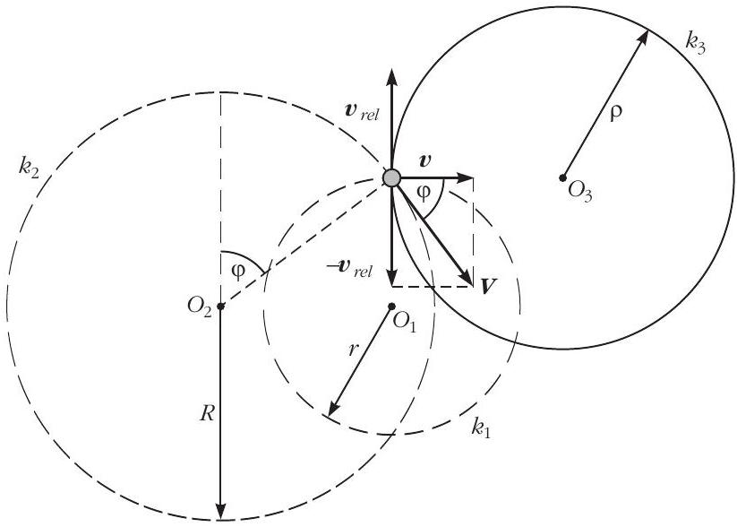
3. ábra

tási rendszerben, az $R$ sugarú $k _ { 2 }$ kör a rajztábla éppen az érmével érintkezó́ pontjának késóbbi pályáját jelzi, végül pedig a $\rho$ sugarú $k _ { 3 }$ kör a táblán hagyott grafitnyomnak felel meg. Az érmére ható csúszási súrlódási eró az $O _ { 1 }$ pont felé mutat, tehát az érme rajztáblához viszonyított $\boldsymbol { v } _ { \text {rel } }$ sebessége ezzel ellentétes. Az érme álló vonatkoztatási rendszerhez viszonyított $\boldsymbol { v }$ sebessége viszont erre meróleges, így a rajztábla érmével éppen érintkezó pontjának $\boldsymbol { V } = \boldsymbol { v } - \boldsymbol { v } _ { \text {rel } }$ sebességére fennáll a Pitagorasz-tétel:

$$
\begin{equation*}
\boldsymbol { V } ^ { 2 } = \boldsymbol { v } ^ { 2 } + \boldsymbol { v } _ { \mathrm { rel } } ^ { 2 } . \tag{2}
\end{equation*}
$$

Mivel az állandósult mozgásszakaszban mindhárom sebességvektor $\omega$ szögsebességgel forog az idóben, a nagyságukat kifejezhetjük a körpályák sugarával:

$$
| \boldsymbol { V } | = R \omega , \quad | \boldsymbol { v } | = r \omega , \quad \left| \boldsymbol { v } _ { \text {rel } } \right| = \rho \omega ,
$$

amit a (2) egyenletbe írva a sugarak között kapunk összefüggést:

$$
R ^ { 2 } = r ^ { 2 } + \rho ^ { 2 } .
$$

Ezt és az (1) eredményt felhasználva megkapjuk a pénzérme által a rajztáblán hagyott kör alakú grafitnyomok $\rho$ sugarát:

$$
\rho = \sqrt { R ^ { 2 } - \left( \frac { \mu g } { \omega ^ { 2 } } \right) ^ { 2 } } .
$$

Az érme megcsúszásának $\mu < R \omega ^ { 2 } / g$ feltétele miatt ez mindig valós.

Megjegyzés
Az ábráról leolvasható, hogy az érme mozgása nincs szinkronban a rajztábla mozgásával, hanem ahhoz képest folyamatosan „késik”. A fáziskésés $\varphi$ szögét is a sebességvektorok által kifeszített derékszögú háromszög segítségével határozhatjuk meg:

$$
\cos \varphi = \frac { | \boldsymbol { v } | } { | \boldsymbol { V } | } = \frac { r } { R } = \frac { \mu g } { R \omega ^ { 2 } } ,
$$

amely csúszó érme esetén biztosan kisebb 1-nél.
2. feladat kitúzték: Tichy Géza, Vankó Péter Két egyforma, fekete lapon kilenc-kilenc kicsi fehér pötty van. A szomszédos pöttyök középpontjának távolsága 5,8 mm. A lapokról egy fényképezógéppel képet készítettünk: a fényképezógép a távolabbi, a lencsétól 25 cm távolságra lévó lapról éles képet adott, a közelebbiról viszont elmosódott a kép. A 4. ábrán fölül a teljes kép látható, alul pedig a kép tete-

4. ábra
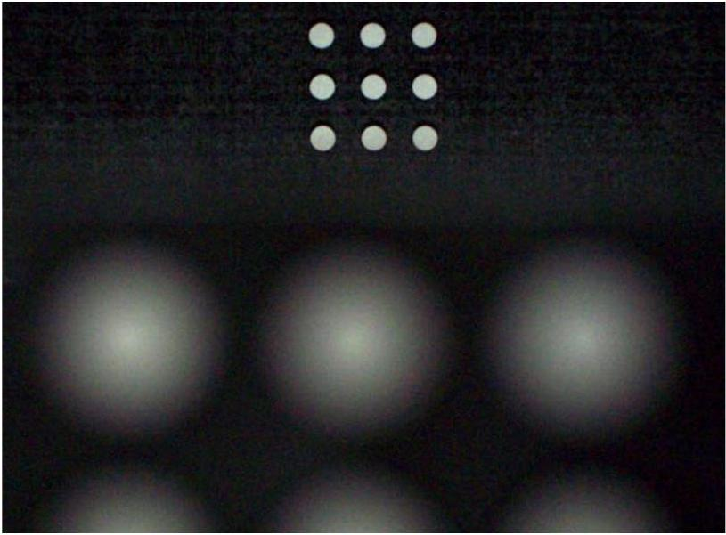

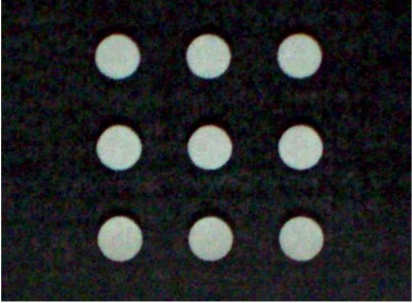

jének kinagyított részlete. A fényképezógép lencséjének fókusztávolsága 18 mm.

Becsüljük meg a megadott és a képekről lemért adatokból a közelebbi lap távolságát a lencsétól, valamint a fényképezógép lencséjének átmérójét!

## Megoldás

A feladat megoldásának lényege, hogy megértsük, miért lesz a közelebbi tárgy képe elmosódott. Az 5. ábrán két pontszerú tárgy képe látható. A távolabbiról a lencse pontosan a CCD érzékeló síkjában hoz
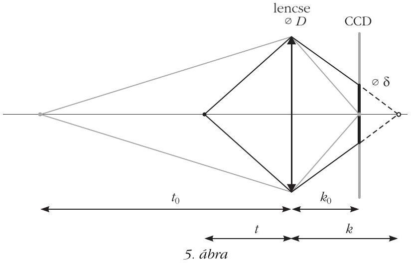
létre éles, pontszerú képet. A közelebbiról viszont távolabb keletkezne éles kép, így a CCD-n egy elmosódott, $\delta$ átmérójú folt keletkezik. Az ábra alapján:

$$
\frac { D } { \delta } = \frac { k } { k - k _ { 0 } } ,
$$

a leképzési törvény alapján pedig:

$$
\frac { 1 } { t _ { 0 } } + \frac { 1 } { k _ { 0 } } = \frac { 1 } { f } \text { és } \frac { 1 } { t } + \frac { 1 } { k } = \frac { 1 } { f } .
$$

A 6. ábra alapján a közelebbi tárgy távolsága a két kép nagyításának arányából határozható meg:

$$
\begin{aligned}
\frac { K _ { 0 } } { T } & = \frac { k _ { 0 } } { t _ { 0 } } , \\
\frac { K } { T } & = \frac { k _ { 0 } } { t } , \\
\lambda & = \frac { K } { K _ { 0 } } = \frac { t _ { 0 } } { t } .
\end{aligned}
$$

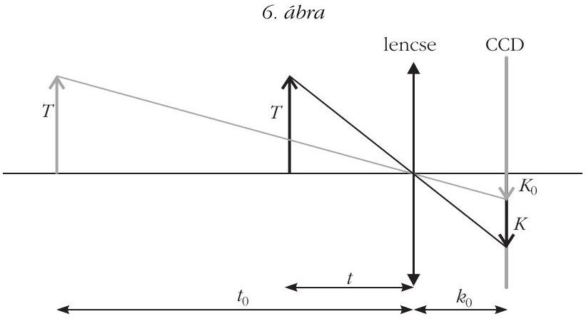
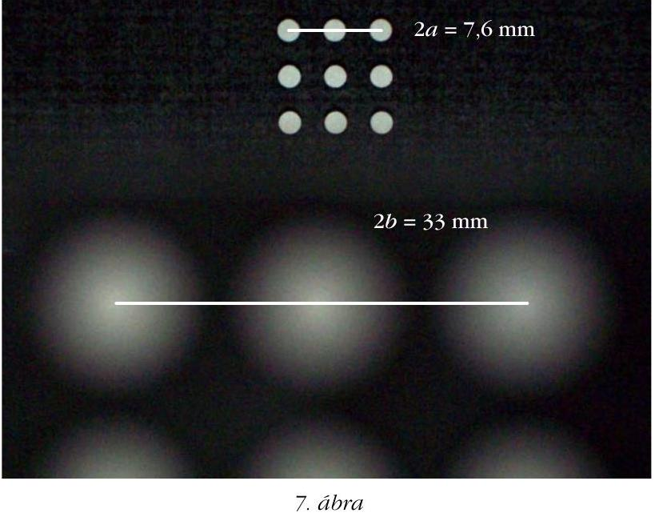
A felsó́ ábráról leolvasható a szélsó́ pöttyök középpontjának távolsága (a szomszédos pöttyök távolságának duplája) mindkét képen ( 7. ábra).

Ebból:

$$
\begin{aligned}
\lambda & = \frac { K } { K _ { 0 } } = \frac { 2 b } { 2 a } = \frac { 33 \mathrm {~mm} } { 7,6 \mathrm {~mm} } = 4,34 \text { és } \\
t & = \frac { t _ { 0 } } { \lambda } = \frac { 25 \mathrm {~cm} } { 4,34 } = 5,8 \mathrm {~cm} .
\end{aligned}
$$

Az alsó (nagyított) ábráról leolvasható a pöttyök átmérójének és távolságának aránya ( 8. ábra).

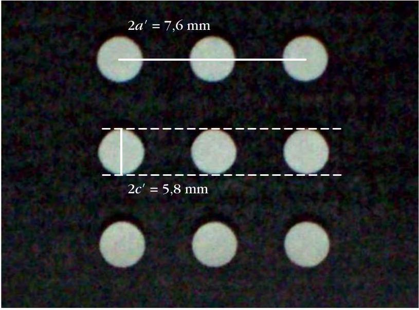
8. ábra

Ebból:

$$
\rho = \frac { c ^ { \prime } } { a ^ { \prime } } = 2 \frac { c ^ { \prime } } { 2 a ^ { \prime } } = 2 \cdot \frac { 5,8 \mathrm {~mm} } { 24 \mathrm {~mm} } = 0,48 .
$$

Ez alapján kiszámíthatjuk, hogy mekkora lenne a felsó́ ábrán a közelebbi pöttyök átméróje, ha nem lennének elmosódva:

$$
d = \rho b = \rho \frac { 2 b } { 2 } = 0,48 \cdot \frac { 33 \mathrm {~mm} } { 2 } = 8,0 \mathrm {~mm} .
$$

A 9. ábráról leolvasható az elmosódott kép átméróje: $d ^ { \prime \prime } = 15,5 \mathrm {~mm}$. A két átméró különbsége a kép elmosódottsága (ekkora lenne egy pontszerú tárgy elmosódott képe ezen a képen):

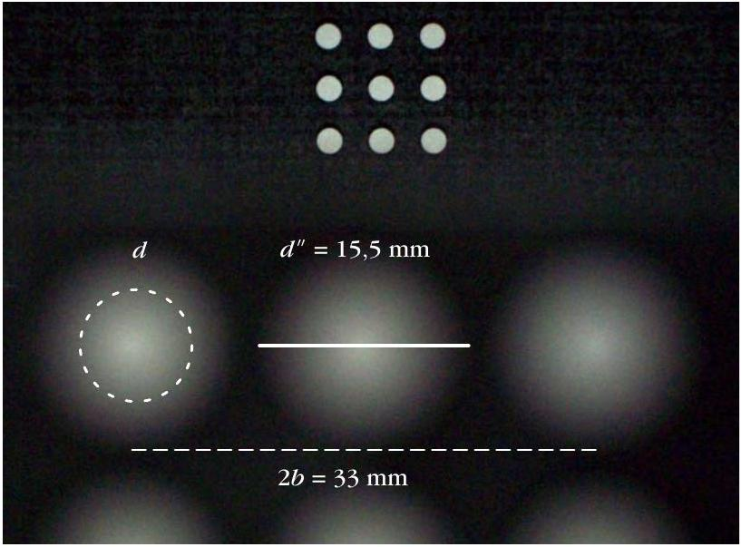
9. ábra

$$
e = d ^ { \prime \prime } - d = 7,5 \mathrm {~mm} .
$$

Ezután már csak néhány számítás van hátra. Az 5. ábrán jelölt képtávolságok:

$$
\begin{aligned}
k _ { 0 } & = \frac { t _ { 0 } f } { t _ { 0 } - f } = 19,4 \mathrm {~mm} , \\
k & = \frac { t f } { t - f } = 26,2 \mathrm {~mm} .
\end{aligned}
$$

Két pötty távolsága a fényképezógép CCD érzékelójén (e távolság a valóságban $a _ { 0 } = 5,8 \mathrm {~mm}$, meg van adva):

$$
a _ { \mathrm { CCD } } = \frac { k _ { 0 } } { t _ { 0 } } a _ { 0 } = \frac { 19,4 \mathrm {~mm} } { 250 \mathrm {~mm} } \cdot 5,8 \mathrm {~mm} = 0,45 \mathrm {~mm} ,
$$

amiból a felsó́ kép nagyítása a CCD-n kialakuló képhez viszonyítva:

$$
N = \frac { a } { a _ { \mathrm { CCD } } } = \frac { 2 a } { 2 a _ { \mathrm { CCD } } } = \frac { 7,6 \mathrm {~mm} } { 2 \cdot 0,45 \mathrm {~mm} } = 8,4 .
$$

Ebból az elmosódottság a CCD érzékelón:

$$
\delta = \frac { e } { N } = \frac { 7,5 \mathrm {~mm} } { 8,4 } = 0,9 \mathrm {~mm} ,
$$

amiból a keresett lencseátméró az 5. ábra alapján:

$$
D = \delta \frac { k } { k - k _ { 0 } } \approx 3,5 \mathrm {~mm} .
$$

Megjegyzések

1. A kérdezett mennyiségek hibájára csak becslést adunk. A lehetó legpontosabb (tized mm-es) leolvasás és egy kicsit „nagyvonalúbb” (fél mm pontos) leolvasás adataival is végigszámolva azt kapjuk, hogy a közelebbi tárgy távolságára kapott eredmény hibája 1-2\%, a lencseátméró hibája pedig 10-15\%.
2. A közelebbi tárgy távolságát azért kérdeztük, hogy segítsük a gondolatmenetet. Ezt több versenyzó is meghatározta, de nem tudtak továbblépni. A kép elmosódottságával - az egy helyes megoldón kívül - szinte senki nem tudott mit kezdeni. Néhányan - helytelenül - a fény elhajlásával próbálták magyarázni az elmosódottságot.
3. feladat kitúzte: Vigh Máté Egy $r$ sugarú, $d$ vastagságú ( $d \ll r$ ), $\rho$ fajlagos ellenállású fémkorong $A$ pontjába $I$ erốsségú áramot vezetünk, $B$ pontjából pedig elvezetjük azt.
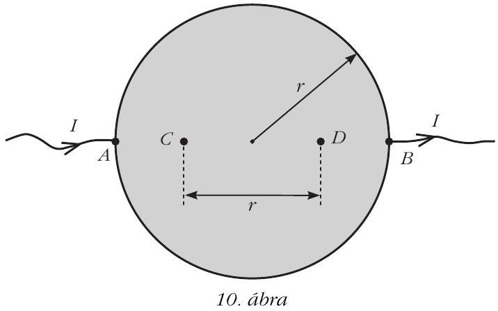

Mekkora feszültség mérhető a 10. ábrán látható $C$ és $D$ pontok között?

Megoldás
A fémkorong vizsgálata elốtt érdemes egy végtelen fémlemez esetéból kiindulni. Képzeljük el, hogy egy végtelen fémlap $A$ pontjába $2 I$ áramot vezetünk, a $B$ pontból pedig elvezetjük azt. Ha csak az $A$ jelú elektróda lenne jelen, a fémlemezben a bevezetett áram izotróp módon terjedne szét, így az $A$ ponttól $r _ { 1 }$ távolságra az áramsúrúség nagysága

$$
j _ { 1 } = \frac { 2 I } { 2 \pi r _ { 1 } d }
$$

lenne. A differenciális Ohm-törvény értelmében ezt az áramsúrúséget a lemezben megjelenó $E _ { 1 } = \rho j _ { 1 }$ térerósségú elektromos mezó tartja fenn, így az $A$ elektróda hatására a végtelen fémlemezben az $r _ { 1 }$ távolsággal fordítottan arányos erósségú, az $A$ ponttal ellentétes irányba mutató, „sugaras” elektromos mezó alakul ki. Hasonlóan, ha csak a $B$ jelú csatlakozó lenne jelen, akkor $r _ { 2 }$ távolságban

$$
E _ { 2 } = \frac { 2 \rho I } { 2 \pi r _ { 2 } d }
$$

térerósségú, a $B$ pont felé mutató elektromos tér jönne létre. Mivel mindkét elektróda jelen van, így a lemezben kialakuló elektromos tér (és áramsúrúség) az elóbbi két eset szuperpozíciójaként (vektori összegeként) számolható.

Tekintsük most a végtelen fémlemez tetszóleges $P$ pontját (lásd a 11. ábrát)! Itt az $A$ és $B$ elektródák hatására külön-külön $\boldsymbol { E } _ { 1 }$ és $\boldsymbol { E } _ { 2 }$ térerósség alakul ki, amelyek nagyságára az eddigiek szerint fennáll az

$$
\frac { \left| \boldsymbol { E } _ { 1 } \right| } { \left| \boldsymbol { E } _ { 2 } \right| } = \frac { r _ { 2 } } { r _ { 1 } }
$$

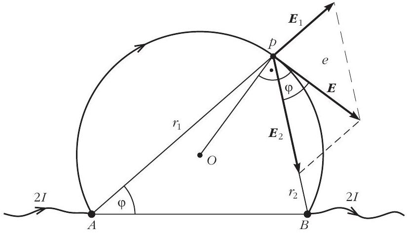
11. ábra

egyenlóség. Ebból és a váltószögek egyenlóségéból látszik, hogy az $A B P$ háromszög hasonló a térerősségvektorok által meghatározott háromszöghöz, ezért az eredó térerósségvektor a $P B$ szakasszal ugyanakkora szöget zár be, mint a PAB szög. Ez viszont azt jelenti, hogy az $A B P$ háromszög ( $O$ középpontú) köré írt körét a $P$ pontbeli eredó térerósség érinti, hiszen van két szögünk ( $P A B <$, illetve az $\boldsymbol { E }$ és $\boldsymbol { E } _ { 2 }$ vektorok által bezárt szög), amelyek egyenlóségük miatt a kör ugyanazon $P B$ ívéhez tartozó kerületi szögek.

A fentiekból következik, hogy az eredó́ térerósségvektor a fémsík tetszóleges pontjában érintóje az $A , B$ és a kiszemelt pontra illeszkedó körívnek, a lemezben kialakuló elektromos eróvonalak (és így az áramvonalak is) tehát körív alakúak, amelyek átmennek az $A$ és $B$ pontokon.

Most gondolatban vágjuk ki a végtelen fémlapból a 12. ábrán látható, korong alakú részt! A korong pereme mentén az áramok a kivágás elốtt is érintó irányban folytak, így az áramokra kirótt határfeltétel automatikusan teljesül. A korong kivágása tehát nem változtatja meg sem a külső, sem a belső árameloszlást, és így a feszültségviszonyokat sem. A végtelen fémlapban az áram be- és kivezetési pontjának közvetlen közelében az árameloszlás izotróp volt (itt a távolabbi elektróda hatása már nem érzódik), így a korong kivágása elốtt a fémlemezbe vezetett $2 I$ erósségú áramnak pontosan a fele jutott be a korongba (lásd az ábrát). A feladatbeli kérdés tehát egyenértékú azzal, hogy mekkora volt a feszültség a végtelen fémlap $C$ és $D$ pontjai között a korong kivágása elốtt?

Az $A$ pontban bevezetett $2 I$ áram hatására az elektródától $r$ távolságra a fémlap potenciálja (az $A$ és $B$ pontok között félúton, a korong középpontjában elhelyezkedő referenciaponthoz képest) a térerósség integrálásával kapható meg:
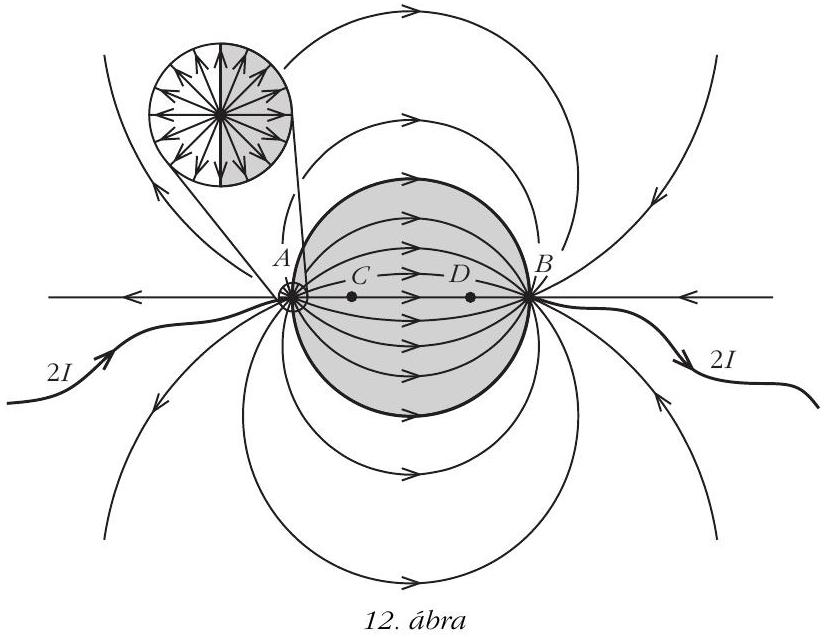

$$
\Phi \left( r _ { 1 } \right) = \int _ { r _ { 1 } } ^ { r _ { 0 } } E _ { 1 } \left( r ^ { \prime } \right) \mathrm { d } r ^ { \prime } = \frac { 2 \rho I } { 2 \pi d } \int _ { r _ { 1 } } ^ { r _ { 0 } } \frac { 1 } { r ^ { \prime } } \mathrm { d } r ^ { \prime } = - \frac { \rho I } { \pi d } \ln \frac { r _ { 1 } } { r _ { 0 } } ,
$$

ahol $r _ { 0 } = r$. Ennek felhasználásával az $A$ pontbeli elektróda által a $C$ és $D$ pontok között létrehozott feszültség nagysága

$$
U _ { C D } ^ { ( A ) } = \frac { \rho I } { \pi d } \left( - \ln \frac { r } { 2 r _ { 0 } } + \ln \frac { 3 r } { 2 r _ { 0 } } \right) = \frac { \rho I } { \pi d } \ln 3 .
$$

Ugyanekkora potenciálkülönbséget hoz létre a $B$ jelú elektróda is, így a szuperpozíció értelmében a $C$ és $D$ pontok között esó feszültség

$$
U _ { C D } = U _ { C D } ^ { ( A ) } + U _ { C D } ^ { ( B ) } = 2 U _ { C D } ^ { ( A ) } = \frac { 2 \rho I } { \pi d } \ln 3 .
$$

Ekkora tehát a kivágott fémkorong $C$ és $D$ pontjai közötti feszültség is.

Régi és új díjazottak, valamint tanáraik.
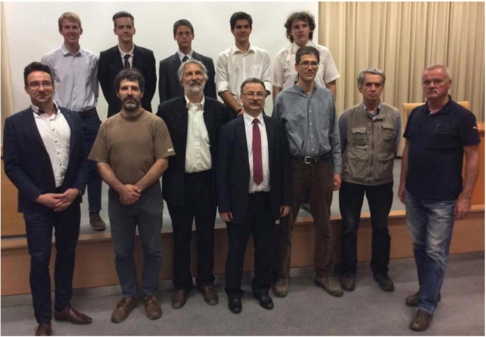

Az esemény végén került sor az eredményhirdetésre. A díjakat Patkós András, az Eötvös Loránd Fizikai Társulat elnöke adta át.

Egyetlen versenyzós sem oldotta meg mindhárom feladatot, így a versenybizottság elsó́ díjat nem adott ki.

Két feladat helyes megoldásáért második díjat nyert Kovács Péter Tamás, a Zalaegerszegi Zrínyi Miklós Gimnázium 12. osztályos tanulója, Juhász Tibor és Pálovics Róbert tanítványa, valamint Tompa Tamás Lajos, a miskolci Földes Ferenc Gimnázium 12. osztályos tanulója, Zámborszky Ferenc és Kovács Benedek tanítványa.

Egy feladat helyes megoldásáért harmadik díjat nyert Forrai Botond, a budapesti Baár-Madas Református Gimnázium érettségizett tanulója, Horváth Norbert tanítványa - a BME fizikus hallgatója; Lajkó Kálmán, a Szegedi Radnóti Miklós Kísérleti Gimnázium 12. osztályos tanulója, Mezó Tamás tanítványa, valamint Simon Dániel Gábor, a Kecskeméti Bányai Júlia Gimnázium 11. osztályos tanulója, Bakk János tanítványa.

A második díjjal Zimányi Gergely adományából nettó 40 ezer, a harmadik díjjal nettó 25 ezer forint pénzjutalom járt, a díjazottak tanárai pedig a Typotex Kiadó könyvutalványait kapták. A verseny megszervezését az Eötvös Loránd Fizikai Társulat a MOL támogatásából fedezte.

Mind a díjazottaknak, mind tanáraiknak gratulálunk a sikeres versenyzéshez. Köszönetünket fejezzük ki az összes versenyzőnek, hogy részvételükkel, és tanáraiknak, hogy a felkészítéssel, tanításukkal emelték a verseny, és ezzel a magyar oktatás színvonalát.

[^0]:    ${ } ^ { 1 }$ Részletek: http://mono.eik.bme.hu/~vanko/fizika/eotvos.htm
