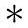
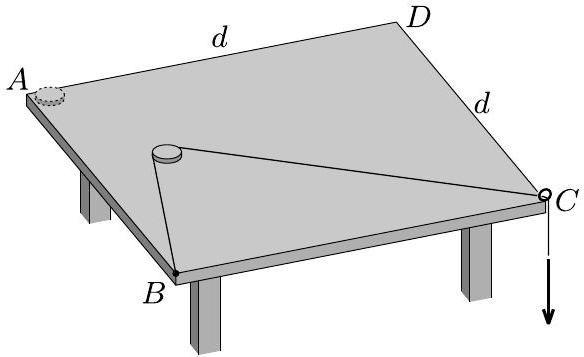
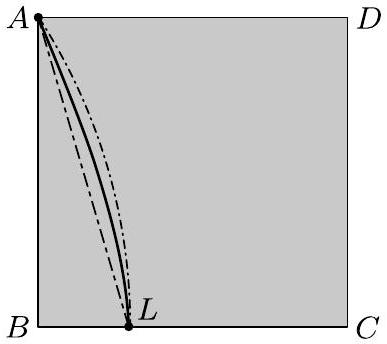
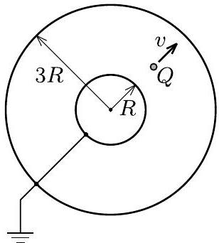
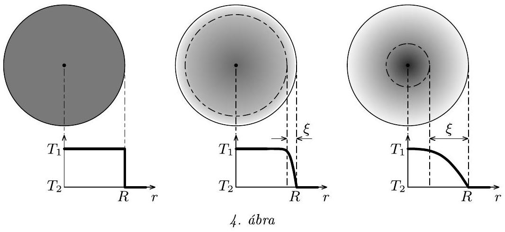
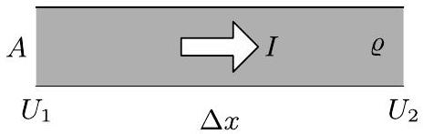
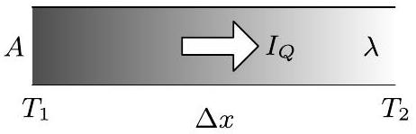
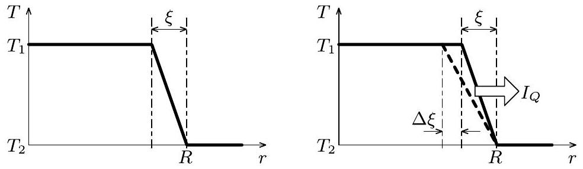

Az Eötvös Loránd Fizikai Társulat 2017. évi Eötvös-versenye október 13-án délután 3 órai kezdettel tizennégy magyarországi helyszínen ${ } ^ { 1 }$ került megrendezésre. Ezért külön köszönettel tartozunk mindazoknak, akik ebben szervezéssel, felügyelettel a segítségünkre voltak. A versenyen a három feladat megoldására 300 perc áll rendelkezésre, bármely írott vagy nyomtatott segédeszköz használható, de (nem programozható) zsebszámológépen kívül minden elektronikus eszköz használata tilos. Az Eötvös-versenyen azok vehetnek részt, akik vagy középiskolai tanulók, vagy a verseny évében fejezték be középiskolai tanulmányaikat. Összesen 42 versenyző adott be dolgozatot, 15 egyetemista és 27 középiskolás.

Ismertetjük a feladatokat és azok megoldását.

1. feladat. $A z 1$. ábrán látható, $d$ oldalhosszúságú, négyzet alakú asztallap $A$ sarkánál egy $m$ tömegü, kis pénzérme nyugszik. Az asztal $B$ sarkához egy horgászzsinór egyik végét rögzítjük, majd a zsinórt az érmén „átvetve“ az asztal $C$ sarkához rögzített szemescsavaron vezetjük át. A zsinór szabad végét igen lassan húzni kezdjük addig, amíg az érme végül leesik az asztalról. Az asztallap és az érme közötti csúszási súrlódási együttható $\mu$, máshol a súrlódás elhanyagolható.

1. ábra

a) Hol esik le az érme az asztalról?
b) Becsüljük meg, mennyi munkát végeztünk a folyamat közben!

Adatok: $m = 7,7 \mathrm {~g} , d = 1,0 \mathrm {~m} , \mu = 0,3$.
Megoldás. A pénzérmére három erő hat: a két zsinórszárban ható erő, valamint a pénzérme és az asztal között fellépő csúszási súrlódási erő. A pénzérmét lassan mozgatjuk, a gyorsulások elhanyagolhatók, így a három erő eredő́je jó közelítéssel nulla. A zsinór nem súrlódik a pénzérmén, így benne mindenhol azonos nagyságú eró hat. Ebbő́l következően a pénzérme mindig a zsinórszárak pillanatnyi szögfelező́jének irányába fog mozogni (hiszen a csúszási súrlódási erő mindig a sebességgel ellentétes irányú). Ennek a sebességvektornak mindkét zsinórszárra ugyanakkora a vetülete, így a két zsinórszár mindig azonos mértékben rövidül - tehát a hosszaik különbsége a mozgás során nem fog változni.
a) Ennek alapján:

$$
\sqrt { 2 } d - d = x _ { 2 } - x _ { 1 } \quad \text { és } \quad x _ { 1 } + x _ { 2 } = d ,
$$

ahol $x _ { 1 }$ és $x _ { 2 }$ a két zsinórdarab hossza, amikor a pénzérme eléri az asztal szélét.
Az egyenletrendszert megoldva megkapjuk, hogy a pénzérme az asztal $B$ sarkától

$$
x _ { 1 } = \left( 1 - \frac { \sqrt { 2 } } { 2 } \right) d \approx 0,293 \mathrm {~m}
$$

távolságra esik le az asztalról.
b) A munkavégzés megegyezik a súrlódási munka abszolút értékével. Mivel a súrlódási erő állandó, így a munka a súrlódási erố és a pénzérme által befutott $s$ út szorzata:

$$
W = \mu m g \cdot s .
$$

A két zsinórszár hosszának különbsége állandó, tehát a pénzérme egy hiperbolaíven fog mozogni. (A hiperbola fókuszai az asztal $B$ és $C$ sarkai.) A hiperbolaív hosszát elemi úton nem tudjuk meghatározni - ezért is kért a feladat becslést -, de alsó és felső közelítést adhatunk rá.

Alsó becslés az asztal $A$ sarkát és a leesés $L$ pontját összekötő egyenes szakasz hossza (2. ábra):

$$
s _ { \min } = \sqrt { d ^ { 2 } + x _ { 1 } ^ { 2 } } \approx 1,042 \mathrm {~m} ,
$$

felső becslés pedig az $A$ és $L$ pontokon átmenő és a $B C$ szakaszt merőlegesen metsző körvonal hossza. A kör sugara egyszerú geometriai megfontolások alapján:

$$
R = \frac { d ^ { 2 } + x _ { 1 } ^ { 2 } } { 2 x _ { 1 } } \approx 1,854 \mathrm {~m} ,
$$

[^0]
amiből a keresett ívhossz:

$$
s _ { \max } = R \arcsin \frac { d } { R } \approx 1,056 \mathrm {~m} .
$$

Láthatjuk, hogy a két érték elég közel van egymáshoz. (A hiperbolaív hosszát számítógéppel numerikusan is kiszámolhatjuk, akkor $s \approx 1,048$ m-t kapunk.)

2. ábra

Ezek alapján, valamint a megadott adatokkal és $g = 9,81 \mathrm {~m} / \mathrm { s } ^ { 2 }$-tel a keresett munkavégzés:

$$
0,0236 \mathrm {~J} < W < 0,0239 \mathrm {~J} .
$$

2. feladat. Egy gömbkondenzátor fegyverzeteinek sugara $R$ és $3 R$. A gömböket rövidre zárjuk, és a nagyobb gömböt leföldeljük. A két fémgömb között egy $Q$ ponttöltést mozgatunk állandó $v$ sebességgel sugárirányban kifelé (3. ábra).

3. ábra

Mekkora áram folyik a gömböket összekötő vezetékben, amikor a mozgó töltés éppen „félúton”, a gömbök középpontjától $2 R$ távolságban van? (A rövidrezáró vezeték elektrosztatikus terét ne vegyük figyelembe!)
I. megoldás. A feladat nehézsége abban rejlik, hogy a fémgömbök eredetileg fennálló gömbszimmetriáját elrontja a $Q$ ponttöltés jelenléte. Emiatt a gömbökön kialakuló töltéseloszlás erősen inhomogén lesz, és az elektromos mező szerkezete is meglehetősen bonyolult. Szerencsére a töltéseloszlás meghatározása elkerülhető, amint azt az alábbi megoldásban látni fogjuk.

Jelöljük a kis fémgömb pillanatnyi töltését $q _ { 1 }$-gyel, a nagyobb gömbét $q _ { 2 }$-vel, a ponttöltés pillanatnyi távolságát a gömbök középpontjától pedig $r$-rel! A kisebb fémgömb potenciálja a földelés miatt nulla, és mivel a fém ekvipotenciális, ugyanez a középpontjára is igaz. A gömbökön elhelyezkedó töltések azonos $( R$, illetve $3 R )$ távolságra helyezkednek el a gömbök közös középpontjától, ezért itt a potenciált könnyen felírhatjuk:

$$
\begin{equation*}
k \frac { q _ { 1 } } { R } + k \frac { Q } { r } + k \frac { q _ { 2 } } { 3 R } = 0 . \tag{1}
\end{equation*}
$$

A nagy gömbön kívül a földelés miatt nincs elektromos tér (a belsó töltések terét a nagy gömb teljesen leárnyékolja), így a Gauss-törvény értelmében a rendszer össztöltése nulla:

$$
\begin{equation*}
Q + q _ { 1 } + q _ { 2 } = 0 . \tag{2}
\end{equation*}
$$

A fenti két egyenletből a kisebb gömb töltésének abszolút értéke kifejezhető $r$ függvényében:

$$
\begin{equation*}
q _ { 1 } ( r ) = - \left( \frac { 3 R } { 2 r } - \frac { 1 } { 2 } \right) Q . \tag{3}
\end{equation*}
$$

Mivel a gömbök össztöltése állandó $( - Q )$, így a ponttöltés mozgása közben csak a gömbök közötti vezetékben folyik áram, a földbe jutó vezetékben nem. A kis gömbre vonatkozó kontinuitási egyenletből a gömbök között folyó áram deriválással (vagy a kis megváltozásokra érvényes formulák segítségével) meghatározható:

$$
I = \frac { \mathrm { d } q _ { 1 } } { \mathrm {~d} t } = \frac { \mathrm { d } r } { \mathrm {~d} t } \frac { \mathrm {~d} q _ { 1 } } { \mathrm {~d} r } = v \frac { \mathrm {~d} q _ { 1 } } { \mathrm {~d} r } = \frac { 3 } { 2 } \frac { Q v R } { r ^ { 2 } } ,
$$

az áram iránya pedig a kis gömb felé mutat. Tehát az áramerősség értéke, amikor a ponttöltés éppen $r = 2 R$ távolságra van a gömbök középpontjától:

$$
I = \frac { 3 } { 8 } \frac { Q v } { R } .
$$

II. megoldás. Az első megoldás kulcsa az volt, hogy észrevettük: a potenciál értéke könnyen kiszámítható a gömbök közös középpontjában. Az (1) és (2) egyenletekhez más módon, a szuperpozíciós elv segítségével is eljuthatunk.

Képzeljük el, hogy a gömbök középpontjától $r$ távolságra elhelyezkedő $Q$ ponttöltést gondolatban $N$-edrészére csökkentjük. Ekkor a gömbök $q _ { 1 }$ és $q _ { 2 }$ töltése is $N$-edrészére csökken. Forgassuk el ezt az elrendezést a gömbök középpontja körül egy kicsit, és szuperponáljuk rá az eredeti elrendezésre! Így már két $Q / N$ ponttöltés helyezkedik el a középponttól $r$ távolságra, a gömbök töltése pedig rendre $2 q _ { 1 } / N$ és $2 q _ { 2 } / N$. Ismételjük meg ezt az eljárást még $( N - 2 )$-ször úgy, hogy végül összesen $Q$ töltés legyen az $r$ sugarú gömbfelületen, a lehető legegyenletesebb elrendezódésben. Az $N \rightarrow \infty$ határesetben a ponttöltést ilyen módon végül „szétkenhetjük" egy $r$ sugarú, egyenletes felületi töltéssürüségü, $Q$ össztöltésú gömbhéjjá, miközben a fémgömbök $q _ { 1 }$ és $q _ { 2 }$ töltése változatlan marad. Ennek az az előnye, hogy az eredeti feladatot visszavezettük egy könnyebb, gömbszimmetrikus problémára.

Ismert, hogy egy egyenletesen töltött gömbhéj potenciálja kívül úgy számítható, mintha a gömb töltése a középpontjában összpontosulna, belül pedig ugyanakkora, mint a gömb felületén. A legkülső, földelt gömb felületén tehát a potenciált a három ( $q _ { 1 } , Q$ és $q _ { 2 }$ töltésú) gömbhéj potenciáljának összegeként kaphatjuk meg:

$$
k \frac { q _ { 1 } } { 3 R } + k \frac { Q } { 3 R } + k \frac { q _ { 2 } } { 3 R } = 0 ,
$$

ami ekvivalens a (2) egyenlettel. A kis gömb felületén a (szintén nulla) potenciált teljesen hasonlóan, három tag összegeként írhatjuk fel: a legkülső gömb járuléka $k q _ { 2 } / ( 3 R )$, a „szétkent” ponttöltésé $k Q / r$, míg a legbelső gömbé $k q _ { 1 } / R$. Ez végül az (1) egyenletre vezet. Az (1) és (2) egyenletek birtokában a végeredményhez az I. megoldással azonos módon juthatunk el.

Megjegyzés. Az egyik második díjat nyert versenyző, Marozsák Tóbiás egy harmadik úton oldotta meg a feladatot. Ismert, hogy ha egy földelt, vezető gömbhéj közelébe egy ponttöltést helyezünk, akkor a gömbön megosztott töltések helyettesíthetők egy, a gömbfelület ponttöltéssel átellenes oldalán elhelyezett tükörtöltéssel. Ennek a tükörtöltésnek a nagysága és helyzete kiszámolható abból a feltételből, hogy a gömb teljes felülete nulla potenciálú. A feladatban szereplő két, koncentrikus gömbhéj esetén a $Q$ töltést először „tükröznünk" kell mindkét gömbre, majd az így kapott tükörtöltésekkel is folytatni kell az eljárást. Végül váltakozó előjelú tükörtöltések végtelen sorát kapjuk a kis gömbön belül és a nagy gömbön kívül. A kis gömbön belüli tükörtöltések össztöltése (azaz $q _ { 1 }$ ) egy geometriai sor felösszegzésével kiszámítható, és így közvetlenül a (3) egyenlethez jutunk. Bár ez a módszer matematikailag sokkal nehezebb, mint a fenti két, részletesen ismertetett megoldás, elvben lehetőséget ad a gömbök között kialakuló elektromos tér (legalább numerikus) meghatározására is.
3. feladat. Egy 30 mm sugarú, homogén, tömör üveggolyó igen hosszú ideje forrásban lévó vízbe merül. A golyót hirtelen jeges vízzel telt edénybe merítjük 30 másodpercre, majd onnan kiemelve hốszigetelő edénybe helyezzük. (A vízcseppeket gyorsan letöröljük.) Becsüljük meg, mennyi lesz az üveggolyó egyensúlyi hốmérséklete hosszú idố elteltével!

További adatok: Az üveg sữrứsége $2500 \mathrm {~kg} / \mathrm { m } ^ { 3 }$, fajhốje $830 \mathrm {~J} / ( \mathrm { kg } \mathrm { K } )$, hốvezetési tényezóje $0,95 \mathrm {~W} / ( \mathrm { m } \mathrm { K } )$.
I. megoldás. A hosszú ideje lobogó vízbe merülő golyó belsejében a hőmérséklet mindenhol $T _ { 1 } = 100 ^ { \circ } \mathrm { C }$-os. Amikor a golyót a $T _ { 2 } = 0 { } ^ { \circ } \mathrm { C }$-os, jeges vízbe tesszük, akkor annak külső része kezd el először lehúlni, majd ez a „hidegfront” halad fokozatosan a golyó belseje felé. A hőszigetelő edénybe helyezve a golyó belső energiája már nem változik tovább, csak annyi történik, hogy a hőmérséklet a belsejében kiegyenlítődik. Vajon mekkora tipikus $\xi$ mélységig hatol be a hidegfront a golyóba 30 másodperc alatt? Elképzelhető, hogy csak a golyó legkülső, vékony „kérge” hül le a jeges vízben, de az is, hogy szinte az egész golyó lehúl, csak a közepe táján marad meleg (4. ábra).

A golyó belseje és a jeges vízzel érintkező ( $0 ^ { \circ } \mathrm { C }$-os) felülete közötti hóvezetést a Fourier-törvény írja le, amely analóg a fémek elektromos vezetését leíró Ohm-törvénnyel (5. ábra). Míg egy állandó $A$ keresztmetszetú, $\Delta x$ hosszúságú egyenes vezetékben folyó elektromos áram $( I )$ a vezeték végei közötti $\Delta U$ potenciálkülönbséggel arányos, addig

ugyanezen vezetékben terjedő hőáram $\left( I _ { Q } \right)$ a $\Delta T$ hőmérséklet-különbséggel arányos:

$$
I = - \frac { 1 } { \varrho } A \frac { \Delta U } { \Delta x } \quad \Longleftrightarrow \quad I _ { Q } = - \lambda A \frac { \Delta T } { \Delta x } ,
$$

ahol $1 / \varrho$ a vezeték anyagának elektromos vezetőképessége (a fajlagos ellenállás reciproka), $\lambda$ pedig a hővezetési tényező.

5. ábra

Sajnos golyó (gömbgeometria) esetén a Fourier-törvény matematikai alakja a fentinél bonyolultabb. További nehézség, hogy a feladatban a hőmérsékleteloszlás nem állandó (nem stacionárius), hanem a hőáram hatására időben változik. Ilyen körülmények között reménytelen a feladatra matematikailag egzakt választ adni. Megpróbálhatjuk azonban dimenzionális megfontolásokkal kitalálni, hogy hogyan függ a hidegfront $\xi$ behatolási mélysége az időtől.

Első lépésként vizsgáljuk meg, milyen mennyiségektő̌l függhet $\xi$. Természetesen függ az időtől, ezen kívül függ még a golyó $\lambda$ hővezetési tényezőjétől (rossz hốvezető esetén $\xi$ lassabban növekszik), az üveg $\varrho$ sürúségétől és $c$ fajhőjétől. A golyó $R$ sugara is fontos paraméter lehet, de ha $\xi \ll R$ (azaz a jeges vízbe merítés ideje viszonylag rövid), akkor a hidegfront terjedésére lényegében nincs hatással a golyó véges mérete. Mi a helyzet a golyó közepe és a felülete közötti hőmérséklet-különbséggel? A Fourier-törvény szerint kétszer akkora hőmérséklet-különbséghez kétszer akkora hőáram tartozik, de ekkor a golyó egyes rétegeinek lehütéséhez szükséges hőelvonás is megkétszereződik. Tehát a hidegfront időbeli terjedését nem, csupán a „magasságát” befolyásolja $\Delta T = T _ { 1 } - T _ { 2 }$ értéke.

Keressük tehát a $\xi$ behatolási mélységet a következő alakban:

$$
\xi \sim \lambda ^ { \alpha } \varrho ^ { \beta } c ^ { \gamma } t ^ { \delta } ,
$$

ahol $\alpha , \beta , \gamma$ és $\delta$ dimenziótlan konstans kitevők. A jobb oldalon álló mennyiségek mértékegységei:

$$
[ \lambda ] = \frac { \mathrm { kg } \cdot \mathrm {~m} } { \mathrm {~s} ^ { 3 } \mathrm {~K} } , \quad [ \varrho ] = \frac { \mathrm { kg } } { \mathrm {~m} ^ { 3 } } , \quad [ c ] = \frac { \mathrm { m } ^ { 2 } } { \mathrm {~s} ^ { 2 } \mathrm {~K} } , \quad [ t ] = \mathrm { s } .
$$

Ezekből csak egyféleképpen „keverhetünk ki” méter dimenziójú mennyiséget:

$$
\xi ( t ) \sim \sqrt { \frac { \lambda t } { c \varrho } } .
$$

Egy dimenziótlan faktor erejéig most már ismerjük a $\xi ( t )$ függvényt, de vajon mi az arányossági tényező? Nem tudjuk, de várhatóan egységnyi nagyságrendú, és mivel becslésról volt szó, vegyük 1-nek! A megadott adatok alapján tehát $t = 30 \mathrm {~s}$ alatt a „hidegfront” behatolási mélysége:

$$
\xi \approx \sqrt { \frac { \lambda t } { c \varrho } } \approx 3,7 \mathrm {~mm} ,
$$

ami majdnem egy nagyságrenddel kisebb a golyó $R = 30 \mathrm {~mm}$-es sugaránál. Előzetes feltevésünk, mely szerint $\xi$ sokkal kisebb $R$-nél, utólag beigazolódott.

A $T _ { \infty }$ egyensúlyi hómérsékletet becsüljük úgy, hogy a $\xi$ vastagságú kéreg hőmérséklete $T _ { 2 } = 0 ^ { \circ } \mathrm { C }$, azon belül pedig $T _ { 1 } = 100 ^ { \circ } \mathrm { C }$. A hőmérséklet kiegyenlítődését kifejező egyenlet:

$$
\frac { 4 } { 3 } \pi ( R - \xi ) ^ { 3 } T _ { 1 } + \frac { 4 } { 3 } \pi \left[ R ^ { 3 } - ( R - \xi ) ^ { 3 } \right] T _ { 2 } = \frac { 4 } { 3 } \pi R ^ { 3 } T _ { \infty } ,
$$

amibő̌l $\xi \ll R$ felhasználásával (csak a $\xi$-ben elsőfokú tagokat tartva meg) megkapjuk a golyó egyensúlyi hőmérsékletét:

$$
T _ { \infty } \approx T _ { 1 } - \frac { 3 \xi } { R } \left( T _ { 1 } - T _ { 2 } \right) \approx 63 { } ^ { \circ } \mathrm { C } .
$$

Mivel becslésről van szó, ezért az eredmény második értékes jegyét nem szabad nagyon komolyan vennünk.
II. megoldás. Használjuk a Fourier-törvényt, és közelítsük a hőmérsékletprofilt a 6. ábra bal oldalán látható, szakaszonként lineáris függvénnyel! (Könnyen belátható, hogy egy ilyen hőmérsékletprofil később nem marad szakaszonként lineáris, de ez a becslésünk érvényességét nem befolyásolja majd.)

6. ábra

A várhatóan kis $\xi$ behatolási mélység miatt a problémát kezelhetjük egydimenziósként (azaz golyó helyett egy végtelen féltér esetét vizsgáljuk). Tegyük fel, hogy $t$ idő után a „lineáris hidegfront” szélessége $\xi$. Ekkor a golyó belsejéből a jeges vízbe átmenő hőáram nagysága (teljesítmény):

$$
\begin{equation*}
I _ { Q } = \lambda A \frac { T _ { 1 } - T _ { 2 } } { \xi } . \tag{4}
\end{equation*}
$$

Ez a kiáramló teljesítmény okozza $\Delta t$ idő alatt a hidegfront $\Delta \xi$ szélesedését (6. ábra jobb oldala):

$$
I _ { Q } \Delta t = c \varrho A \left[ T _ { 1 } \Delta \xi + \frac { T _ { 1 } + T _ { 2 } } { 2 } \xi \right] - c \varrho A \frac { T _ { 1 } + T _ { 2 } } { 2 } ( \xi + \Delta \xi ) ,
$$

ahol a behatolási mélységnek megfeleló rész energiáját a szélein mért hőmérsékletek átlagának segítségével fejeztük ki. Ebből rendezés után adódik:

$$
\begin{equation*}
I _ { Q } = c \varrho A \frac { T _ { 1 } - T _ { 2 } } { 2 } \frac { \Delta \xi } { \Delta t } . \tag{5}
\end{equation*}
$$

A hőáramokra kapott (4) és (5) összefüggéseket egyenlővé téve kapjuk:

$$
\xi \Delta \xi = \frac { 2 \lambda } { c \varrho } \Delta t .
$$

Összegezzük fel ennek az egyenletnek mindkét oldalát! Ekkor a jobb oldalon a vízbe merítés $t$ ideje, a bal oldalon pedig $\xi ^ { 2 } / 2$ jelenik meg (ezt beláthatjuk pl. egy összenyomott rugóban tárolt energia analógiájával vagy integrálással). Tehát a „lineáris hidegfront” behatolási mélysége az idő függvényében:

$$
\xi ( t ) = 2 \sqrt { \frac { \lambda } { c \varrho } } t \sim \sqrt { t } ,
$$

ami egy 2-es faktor erejéig egyezik a dimenzióanalízis eredményével.
A hőmérséklet kiegyenlítődését kifejező egyenlet ( $\xi \ll R$ közelítésben):

$$
\frac { 4 } { 3 } \pi ( R - \xi ) ^ { 3 } T _ { 1 } + 4 \pi R ^ { 2 } \xi \frac { T _ { 1 } + T _ { 2 } } { 2 } \approx \frac { 4 } { 3 } \pi R ^ { 3 } T _ { \infty } ,
$$

ebből

$$
T _ { \infty } \approx T _ { 1 } - \frac { 3 \xi } { 2 R } \left( T _ { 1 } - T _ { 2 } \right) .
$$

Végül a szakaszosan lineáris hőmérsékletprofilra levezetett $\xi$ behatolási mélységet felhasználva kapjuk a becslés végső formuláját:

$$
T _ { \infty } = T _ { 1 } - \frac { 3 } { R } \sqrt { \frac { \lambda t } { c \varrho } } \left( T _ { 1 } - T _ { 2 } \right) .
$$

Az adatokat behelyettesítve $T _ { \infty } \approx 63 ^ { \circ } \mathrm { C }$ egyensúlyi hőmérséklet adódik, egyezésben a dimenzióanalízissel kapott értékkel.
*
Az ünnepélyes eredményhirdetésre és díjkiosztásra 2017. november 24-én délután került sor az ELTE TTK Konferenciatermében. Meghívást kaptak az 50 és 25 évvel ezelőtti Eötvös-verseny nyertesei is. Jelen volt a 25 évvel ezelőtti díjazottak közül Gefferth András, Maulis Ádám és Pálfalvi László, akik az akkori feladatok ismertetése után röviden beszéltek a versennyel kapcsolatos emlékeikről és pályájukról.

Ezután következett a 2017. évi verseny feladatainak és megoldásainak bemutatása. Az 1. feladat megoldását Tichy Géza, a 2. feladatét Vankó Péter, a 3. feladatét Vigh Máté ismertette.

Az esemény végén került sor az eredményhirdetésre. A díjakat Sólyom Jenő, az Eötvös Loránd Fizikai Társulat elnöke adta át.

Mindhárom feladat helyes megoldásáért elsó díjat és Eötvös-érmet nyert Kovács Péter Tamás, a Zalaegerszegi Zrínyi Miklós Gimnázium érettségizett tanulója, Pálovics Róbert és Juhász Tibor tanítványa, aki jelenleg a BME fizikus hallgatója.

Két feladat helyes megoldásáért második díjat nyert Marozsák Tóbiás, az Óbudai Árpád Gimnázium 12. osztályos tanulója, Gärtner István tanítványa.

Egy feladat helyes megoldásáért harmadik díjat nyert Németh Balázs, a Budapesti Fazekas Mihály Gyakorló Általános Iskola és Gimnázium 12. osztályos tanulója, Dvorák Cecilia és Csefkó Zoltán tanítványa, valamint Németh Róbert, a Budapesti Fazekas Mihály Gyakorló Általános Iskola és Gimnázium érettségizett tanulója, Horváth Gábor és Szokolai Tibor tanítványa - az ELTE fizikus hallgatója.

Egy feladat lényegében helyes megoldásáért dicséretet kapott Fajszi Bulcsú, a Budapesti Fazekas Mihály Gyakorló Általános Iskola és Gimnázium 10. osztályos tanulója, Horváth Gábor és Csefkó Zoltán tanítványa; Fehér Szilveszter, az Óbudai Gimnázium érettségizett tanulója, Fehér Gabriella tanítványa - az ELTE fizikus hallgatója; Gyulai Márton, a miskolci Földes Ferenc Gimnázium 11. osztályos tanulója, Pál Mihály és Zámborszky Ferenc tanítványa; Kürti Zoltán, az ELTE Apáczai Csere János Gyakorló Gimnázium és Kollégium érettségizett tanulója, Zsigri Ferenc tanítványa - az ELTE fizikus hallgatója; Mocskonyi Mirkó, a szentendrei Ferences Gimnázium érettségizett tanulója, Adolf Géza és Borbély Venczel tanítványa - az ELTE fizikus hallgatója; Olosz Adél, a PTE Gyakorló Általános Iskola, Gimnázium és Szakgimnázium 11. osztályos tanulója, Koncz Károly és Kotek László tanítványa; Simon Dániel Gábor, a Kecskeméti Bányai Júlia Gimnázium 12. osztályos tanulója, Bakk János tanítványa; Szakály Marcell, a Budapesti Fazekas Mihály Gyakorló Általános Iskola és Gimnázium 12. osztályos tanulója, Csefkó Zoltán és Dvorák Cecília tanítványa, valamint Tófalusi Ádám, a Debreceni Fazekas Mihály Gimnázium 11. osztályos tanulója, Tófalusi Péter és Zámborszky Ferenc tanítványa.

Az első díjjal Zimányi Gergely adományából 63 ezer, a második díjjal 45 ezer, a harmadik díjjal 25 ezer forint pénzjutalom járt, a dicséretesek könyv- és tárgyjutalmat, a díjazottak tanárai pedig a Typotex Kiadó könyveit kapták. A verseny megszervezését az Eötvös Loránd Fizikai Társulat a MOL támogatásából fedezte.

[^0]:    ${ } ^ { 1 }$ Részletek a verseny honlapján: http://eik.bme.hu/ ${ } ^ { \sim }$ vanko/fizika/eotvos.htm
