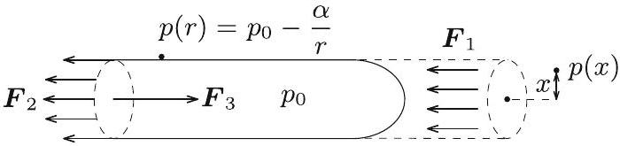
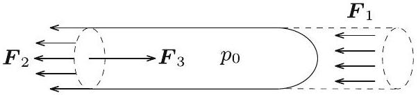

1. Egy zárt, hosszú, henger alakú, szobahốmérsékletű vízzel telt tartályban egy $V = 1 \mathrm {~cm} ^ { 3 }$ térfogatú, normál nyomású légbuborék található. A tartályt egy ứrállomáson, a súlytalanság állapotában óvatosan gyorsítva forgatni kezdjük a szimmetriatengelye körül, majd mikor a tartály eléri az $\omega = 300 \mathrm {~s} ^ { - 1 }$ szögsebességet, azt állandó értéken tartjuk. Milyen alakot vesz fel ekkor a légbuborék? Adjuk meg a buborék jellemző méreteit! A víz felületi feszültsége $\alpha = 0,07 \mathrm {~N} / \mathrm { m }$.
(Vigh Máté)
I. megoldás (energiaminimum). Ha nem forogna a henger, a buborék a felületi feszültség miatt gömb alakú lenne. Ha nem lenne felületi feszültség, akkor a forgó folyadékban a buborék egy nagyon hosszan elnyúló nagyon vékony szál lenne a henger szimmetriatengelyénél. Most a henger elég nagy szögsebességgel forog, de hat a felületi feszültség is, így egy hosszan elnyúlt „virsli” alakú buborékot feltételezünk, melynek alakját egy $r$ sugarú, $\ell$ hosszúságú hengerrel közelíthetjük. A térfogat állandósága miatt $\ell r ^ { 2 } \pi = V$.

A rendszer teljes energiája a buborék felületi energiájából és a buborék helyéről kiszoruló folyadék helyzeti energiájából adódik össze. Akkor lesz egyensúly, ha ez az energia minimális.

A forgó rendszerben egy $\mathrm { d } m$ tömegü folyadékdarabra a henger tengelyétől $x$ távolságra $\omega ^ { 2 } x \mathrm {~d} m$ centrifugális erő hat. Emiatt a henger tengelyétól $x$ távolságra lévő tömegdarab helyzeti energiája

$$
\mathrm { d } E = - \int _ { 0 } ^ { x } \omega ^ { 2 } x ^ { \prime } \mathrm { d } m \mathrm {~d} x ^ { \prime } = - \frac { 1 } { 2 } \omega ^ { 2 } x ^ { 2 } \mathrm {~d} m .
$$

A henger alakú buborékból kiszorul a víz, és a henger szimmetriatengelyéig „emelkedik”. A teljes helyzeti energia növekedése, felhasználva, hogy az $x$ sugarú, $\mathrm { d } x$ vastagságú „hengergyúrú" tömege $\mathrm { d } m = \varrho 2 x \pi \ell \mathrm {~d} x$,

$$
E _ { \mathrm { cf } } = \int _ { 0 } ^ { r } \frac { 1 } { 2 } \omega ^ { 2 } x ^ { 2 } \varrho \cdot 2 x \pi \ell \mathrm {~d} x = \frac { 1 } { 4 } \omega ^ { 2 } r ^ { 4 } \varrho \ell \pi = \frac { 1 } { 4 } \omega ^ { 2 } r ^ { 2 } \varrho V .
$$

A felületi energia (a henger ismeretlen alakú végeinek járulékát elhanyagolva)

$$
E _ { \mathrm { fel } } = 2 r \pi \ell \alpha = \frac { 2 V \alpha } { r } ,
$$

a teljes energia pedig

$$
E = E _ { \mathrm { cf } } + E _ { \mathrm { fel } } = \frac { 1 } { 4 } \omega ^ { 2 } r ^ { 2 } \varrho V + \frac { 2 V \alpha } { r } .
$$

A minimumot deriválással keressük meg:

$$
\frac { \mathrm { d } E } { \mathrm {~d} r } = \frac { 1 } { 2 } \omega ^ { 2 } r \varrho V - \frac { 2 V \alpha } { r ^ { 2 } } = 0 ,
$$

amiból

$$
r = \sqrt [ 3 ] { \frac { 4 \alpha } { \omega ^ { 2 } \varrho } } \approx 1,5 \mathrm {~mm} \quad \text { és } \quad \ell = \frac { V } { r ^ { 2 } \pi } \approx 15 \mathrm {~cm} .
$$

Valóban jogos volt tehát az a feltételezés, hogy a buborék alakja közelítőleg egy nyújtott henger.
II. megoldás (erõegyensúly). Vágjuk félbe a „virslit”, és írjuk fel az erók egyensúlyát (1. ábra)!

1. ábra

[^0]
A forgó folyadékban a tengelytől $x$ távolságra a nyomás:

$$
p ( x ) = \frac { 1 } { 2 } \varrho \omega ^ { 2 } x ^ { 2 } + C ,
$$

ahol $C$ később meghatározandó állandó. A buborékon belül mindenhol ugyanakkora $p _ { 0 }$ nyomás uralkodik. A henger falánál ez a nyomás a folyadék ottani $p ( r )$ nyomásának és a görbületi nyomásnak az összege:

$$
p _ { 0 } = p ( r ) + \frac { \alpha } { r } ,
$$

amiból

$$
p ( r ) = p _ { 0 } - \frac { \alpha } { r } .
$$

Ezt összevetve a folyadék nyomáseloszlására felírt összefüggéssel az abban megjelenő $C$ állandó meghatározható:

$$
C = p _ { 0 } - \frac { \alpha } { r } - \frac { 1 } { 2 } \varrho \omega ^ { 2 } r ^ { 2 } .
$$

A folyadék által a „virsli” egyik felére kifejtett tengelyirányú eró a folyadék nyomásának egy $r$ sugarú körlapra vett integráljaként számítható ki (2. ábra):

$$
\begin{aligned}
F _ { 1 } & = \int _ { 0 } ^ { r } p ( x ) \cdot 2 \pi x \mathrm {~d} x = \frac { 1 } { 2 } \varrho \omega ^ { 2 } \int _ { 0 } ^ { r } x ^ { 2 } \cdot 2 \pi x \mathrm {~d} x + \left( p _ { 0 } - \frac { \alpha } { r } - \frac { 1 } { 2 } \varrho \omega ^ { 2 } r ^ { 2 } \right) \cdot \pi r ^ { 2 } = \\
& = \frac { 1 } { 2 } \varrho \omega ^ { 2 } \cdot \frac { \pi } { 2 } r ^ { 4 } + p _ { 0 } \cdot \pi r ^ { 2 } - \alpha \cdot \pi r - \frac { \pi } { 2 } \varrho \omega ^ { 2 } r ^ { 4 } = p _ { 0 } \cdot \pi r ^ { 2 } - \alpha \cdot \pi r - \frac { \pi } { 4 } \varrho \omega ^ { 2 } r ^ { 4 }
\end{aligned}
$$

