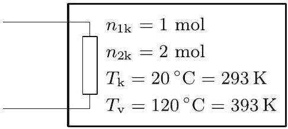

2. ábra

A virsli másik fele által kifejtett húzóerő (a felületi feszültség miatt): $F _ { 2 } = \alpha \cdot 2 \pi r$, míg a másik félben lévó levegő által kifejtett nyomóerő: $F _ { 3 } = p _ { 0 } \cdot \pi r ^ { 2 }$.

Az eróegyensúly tehát tengelyirányban így írható fel:

$$
\begin{aligned}
F _ { 1 } + F _ { 2 } & = F _ { 3 } \\
p _ { 0 } \cdot \pi r ^ { 2 } - \alpha \cdot \pi r - \frac { \pi } { 4 } \varrho \omega ^ { 2 } r ^ { 4 } + \alpha \cdot 2 \pi r & = p _ { 0 } \cdot \pi r ^ { 2 }
\end{aligned}
$$

amiból az I. megoldással összhangban a következő megoldás adódik:

$$
r = \sqrt [ 3 ] { \frac { 4 \alpha } { \varrho \omega ^ { 2 } } } .
$$

2. Egy tartályban 1 mólnyi egyatomos gáz és 2 mólnyi kétatomos gáz keveréke található. A tartály fala az egyatomos gáz atomjait átengedi, de a kétatomos gáz molekuláit nem. Kezdetben a tartály a 20 °C-os környezettel egyensúlyban van. A tartályban lévó gázkeveréket egy fữtốtest lassan 120 °C-kal felmelegíti.
a) Mennyivel változik meg a tartályban lévó gáz belsó energiája?
b) Mennyi hốt ad le a fữtốtest a gáznak? (A tartály melegedéséhez szükséges hốt és a tartály hốvezetését hagyjuk figyelmen kívül!)
(Tichy Géza)
Megoldás. a) Két gázkeverék akkor van egyensúlyban, ha azon komponensek parciális nyomása megegyezik, melyek a két tartály között áramolhatnak. Feladatunkban csak az egyatomos molekulák gázát engedi át a fal, ezért ha egyensúlyban a tartályban lévő egyatomos gáz parciális nyomása $p _ { 1 }$, akkor a környezetben ennek a gáznak a parciális nyomása is ugyanakkora. Ez az egyensúly a kétatomos gáz parciális nyomására nem jelent megszorítást.

Először vizsgáljuk az egyatomos gáz folyamatát! Mivel ennek parciális nyomását a környezet állítja be állandóra, ez egy izobár folyamat, de a mólok száma, amely kezdetben $n _ { 1 \mathrm { k } } = 1 \mathrm {~mol}$ nem állandó, hanem a folyamat közben állandóan változik, melegítés hatására gáz áramlik a tartályból a környezetbe. Az egyesített gáztörvény alapján $p _ { 1 } V = n _ { 1 } R T$, ahol $V$ a tartály térfogata. Mivel sem a parciális nyomás, sem a térfogat nem változik, a folyamatra az

$$
n _ { 1 } T = \text { állandó }
$$

összefüggés jellemző.

