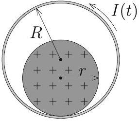
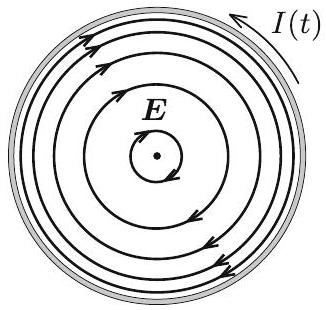
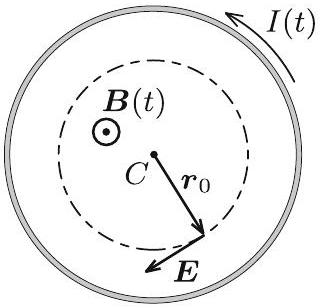
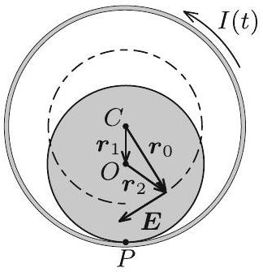
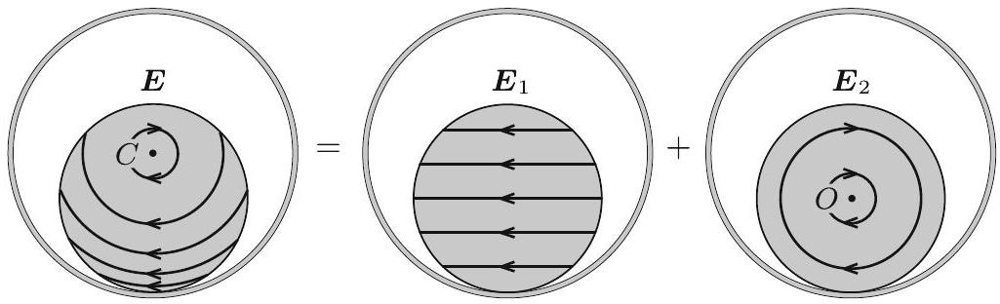
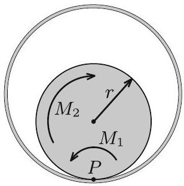

3. ábra

A kétatomos gázt a fal nem engedi át, ennélfogva térfogata állandó, a folyamat izochor. A fütőtest a gázt $20 ^ { \circ } \mathrm { C }$ ról melegíti 120 °C-ra, ezért mind az egyatomos gáz, mind a kétatomos gáz kezdeti és végső hőmérséklete kelvinben $T _ { \mathrm { k } } = 293 \mathrm {~K}$ és $T _ { \mathrm { v } } = 393 \mathrm {~K}$ (3. ábra).

Az egyatomos gáz szabadsági foka 3, ennek ismeretében a belsó energia kezdeti értéke:

$$
E _ { 1 \mathrm { k } } = \frac { 3 } { 2 } n _ { 1 \mathrm { k } } R T _ { \mathrm { k } } ,
$$

míg belső energiája a folyamat végén:

$$
E _ { 1 \mathrm { v } } = \frac { 3 } { 2 } n _ { 1 \mathrm { v } } R T _ { \mathrm { v } } = \frac { 3 } { 2 } n _ { 1 \mathrm { k } } R T _ { \mathrm { k } } ,
$$

ami a folyamatra jellemző

$$
n _ { 1 \mathrm { v } } T _ { \mathrm { v } } = n _ { 1 \mathrm { k } } T _ { \mathrm { k } }
$$

összefüggés miatt megegyezik a kezdeti energiával. Látjuk, hogy az egyatomos gáz belső energiája nem változik.
A kétatomos gáz öt szabadsági fokkal rendelkezik. A belső energiájának megváltozása:

$$
\Delta E _ { 1 } = \frac { 5 } { 2 } n _ { 2 } R \left( T _ { \mathrm { v } } - T _ { \mathrm { k } } \right) .
$$

A teljes rendszer belső energiájának megváltozása:

$$
\Delta E = \frac { 5 } { 2 } n _ { 2 } R \left( T _ { \mathrm { v } } - T _ { \mathrm { k } } \right) = 4,16 \mathrm {~kJ} .
$$

b) Most rátérünk annak a hőnek a kiszámítására, amit a fútőtest ad le. Az egyatomos gáz izobár folyamatában a részecskeszám állandóan változik, tehát az általa felvett hőt részfolyamatonként kell összeadni. Ezt integrállal lehet kifejezni:

$$
Q _ { 1 } = \int _ { T _ { \mathrm { k } } } ^ { T _ { \mathrm { v } } } \frac { 5 } { 2 } n _ { 1 } R \mathrm {~d} T ,
$$

ahol a folyamat során a mólszám az

$$
n _ { 1 } = \frac { n _ { 1 \mathrm { k } } T _ { \mathrm { k } } } { T }
$$

alapján függ a hőmérséklettől. Felhasználtuk, hogy az egyatomos gáz állandó nyomáson vett mólhő̈je $C _ { p 1 } = ( 5 / 2 ) R$. Az integrált elvégezve

$$
Q _ { 1 } = \int _ { T _ { \mathrm { k } } } ^ { T _ { \mathrm { v } } } \frac { 5 } { 2 } \frac { n _ { 1 \mathrm { k } } R T _ { \mathrm { k } } } { T } \mathrm {~d} T = \frac { 5 } { 2 } n _ { 1 \mathrm { k } } R T _ { \mathrm { k } } \ln \frac { T _ { \mathrm { v } } } { T _ { \mathrm { k } } } = 1,79 \mathrm {~kJ} .
$$

Az integrálás lépése több módon is elkerülhető, például úgy, hogy felhasználjuk a hasonlóságot az izoterm folyamat munkavégzésével, vagy egy közelítő összegzést alkalmazva számolunk numerikusan.

A kétatomos gáz izochor folyamatot végez, ezért az általa felvett hố megegyezik a belső energia megváltozásával:

$$
Q _ { 2 } = \frac { 5 } { 2 } n _ { 2 } R \left( T _ { \mathrm { v } } - T _ { \mathrm { k } } \right) = 4,16 \mathrm {~kJ} .
$$

A fútőtest a kettő hő összegét adja le:

$$
Q = Q _ { 1 } + Q _ { 2 } = 5,95 \mathrm {~kJ} .
$$

3. Egy rögzített, vízszintes tengelyú, légmagos, hosszú szolenoid keresztmetszete $R$ sugarú kör. A tekercs belsejében egy (nem-mágneses) szigeteló anyagból készült, $r$ sugarú tömör henger helyezkedik el. A szigeteló henger pozitívan töltött, egyenletes térfogati eloszlásban. A szolenoidba időben egyenletesen, gyorsan növekvő erósségũ áramot vezetünk az ábrán látható körüljárás szerint.

Milyen irányban indul el a szigeteló henger? Hogyan függ a válasz az $r / R$ aránytól? Mekkora $r / R$ arány esetén marad a töltött henger nyugalomban?

A tapadási súrlódás elegendóen nagy ahhoz, hogy a henger ne csússzon meg. A gördülési ellenállástól tekintsünk el! (Vigh Máté)

Megoldás. A változó (növekvő́) erősségú áram hatására a tekercs belsejében időben változó, homogén mágneses mező alakul ki. A változó mágneses mező a Faraday-törvény értelmében időben állandó, forrásmentes és örvényes elektromos mezőt kelt (4. ábra), amely eredő erőt és forgatónyomatékot fejt ki a töltött hengerre: ez mozdíthatja el a hengert egyik vagy másik irányban.

4. ábra

5. ábra

6. ábra

Vizsgáljuk az egész elrendezésnek a szolenoid tengelyére merőleges síkmetszetét! Jelöljük ezen a síkmetszeten a szolenoid középpontját $C$-vel, a szigetelő henger középpontját $O$-val, a henger és a szolenoid érintkezési pontját pedig $P$-vel! A szolenoid belsejében kialakuló indukált elektromos mező térerősségét a Faraday-törvényből határozhatjuk meg, ha azt egy $C$ középpontú, $r _ { 0 }$ sugarú körre alkalmazzuk (5. ábra):

$$
E \left( r _ { 0 } \right) \cdot 2 \pi r _ { 0 } = \underbrace { \pi r _ { 0 } ^ { 2 } \frac { \Delta B } { \Delta t } } _ { \frac { \Delta \Phi } { \Delta t } } , \quad \text { ahonnan } \quad E \left( r _ { 0 } \right) = \frac { 1 } { 2 } \frac { \Delta B } { \Delta t } r _ { 0 } .
$$

Ez az összefüggés a „balkéz-szabály" alapján vektoriálisan is felírható a $C$ pontból a vizsgált pontba mutató $\boldsymbol { r } _ { 0 }$ vektor segítségével:

$$
\boldsymbol { E } \left( \boldsymbol { r } _ { 0 } \right) = - \frac { 1 } { 2 } \frac { \Delta B } { \Delta t } \boldsymbol { e } _ { B } \times \boldsymbol { r } _ { 0 } ,
$$

ahol $\boldsymbol { e } _ { B } = \boldsymbol { B } / | \boldsymbol { B } |$ a mágneses indukcióvektorral azonos irányú egységvektor.
Vezessük be a 6. ábrán látható $\boldsymbol { r } _ { 1 }$ és $\boldsymbol { r } _ { 2 }$ vektorokat, ahol $\boldsymbol { r } _ { 1 } + \boldsymbol { r } _ { 2 } = \boldsymbol { r } _ { 0 }$. Ezek közül $\boldsymbol { r } _ { 1 } = \overrightarrow { C O }$ konstans vektor (melynek hossza $R - r$ ), míg $\boldsymbol { r } _ { 2 }$ az $O$ pontból abba a pontba mutat, ahol a térerősségre kíváncsiak vagyunk. Ennek felhasználásával a térerősség így írható:

$$
\boldsymbol { E } \left( \boldsymbol { r } _ { 0 } \right) = \underbrace { - \frac { 1 } { 2 } \frac { \Delta B } { \Delta t } \boldsymbol { e } _ { B } \times \boldsymbol { r } _ { 1 } } _ { \boldsymbol { E } _ { 1 } } \underbrace { - \frac { 1 } { 2 } \frac { \Delta B } { \Delta t } \boldsymbol { e } _ { B } \times \boldsymbol { r } _ { 2 } } _ { \boldsymbol { E } _ { 2 } } ,
$$

Ebben az összegben az $\boldsymbol { E } _ { 1 }$-gyel jelölt tag homogén, vízszintesen balra mutató elektromos mezőt, az $\boldsymbol { E } _ { 2 }$-vel jelölt tag pedig a töltött henger tengelye ( $O$ pont) körül „örvénylő” mezőt jelent. Az indukált elektromos teret tehát felbontottuk két mező szuperpozíciójára, ahogy az a 7. ábrán látható.

7. ábra

Azt, hogy a töltött henger jobbra vagy balra indul el az dönti el, hogy a henger legalsó $P$ pontjára vonatkoztatott eredő forgatónyomaték milyen irányba mutat (erre a pontra nézve ugyanis a súrlódási erőnek, a nyomóerőnek és a nehézségi erónek a forgatónyomatéka is nulla). Az elektromos mező 7. ábrán látható felbontásának az az előnye, hogy segítségével könnyen kiszámítható ez az eredó forgatónyomaték.

A homogén $\boldsymbol { E } _ { 1 }$ mező $\left| \boldsymbol { E } _ { 1 } \right| Q$ nagyságú, a henger $O$ középpontjában ébredő erőt fejt ki a hengerre, melynek forgatónyomatéka a $P$ pontra nézve:

$$
M _ { 1 } = \left| \boldsymbol { E } _ { 1 } \right| Q r = \frac { 1 } { 2 } \frac { \Delta B } { \Delta t } \left| \boldsymbol { e } _ { B } \times \boldsymbol { r } _ { 1 } \right| Q r = \frac { 1 } { 2 } \frac { \Delta B } { \Delta t } ( R - r ) Q r ,
$$

ahol $Q$ a henger össztöltése, $r$ pedig az erókar.
Az $O$ pont körül örvénylő $\boldsymbol { E } _ { 2 }$ mezó eredő erőt a szimmetria miatt nem eredményez. A forgatónyomatékhoz viszont ez a mező is ad járulékot, hiszen a henger $O$ pontra nézve átellenes darabkáira ható erők erőpárokat alkotnak. Az erőpárok eredő forgatónyomatéka bármely pontra, így a $P$ és $O$ pontokra számítva is ugyanakkora, de a számolás az $O$ pontra vonatkoztatva egyszerúbb. Az $O$ ponttól $\left| \boldsymbol { r } _ { 2 } \right|$ távolságra lévố, $\Delta Q$ töltésú kis darabkára $\left| \boldsymbol { E } _ { 2 } \right| \Delta Q$ erő hat, így az eredő forgatónyomaték:

$$
M _ { 2 } = \sum \left| \boldsymbol { E } _ { 2 } \right| \Delta Q \left| \boldsymbol { r } _ { 2 } \right| = \frac { 1 } { 2 } \frac { \Delta B } { \Delta t } \underbrace { \sum \Delta Q \left| \boldsymbol { r } _ { 2 } \right| ^ { 2 } } _ { \frac { 1 } { 2 } Q r ^ { 2 } } .
$$

Az összegzésben szereplő kifejezés éppen olyan alakú, mint a henger tehetetlenségi nyomatéka a szimmetriatengelyére vonatkoztatva (csak ott a darabkák $\Delta Q$ töltése helyett azok $\Delta m$ tömege szerepel). Ezt az analógiát felhasználva az összegzés eredménye $Q r ^ { 2 } / 2$, így

$$
M _ { 2 } = \frac { 1 } { 4 } \frac { \Delta B } { \Delta t } Q r ^ { 2 } .
$$

8. ábra

A $P$ pontra vonatkoztatott $M _ { 1 }$ forgatónyomaték balra szeretné kitéríteni a töltött hengert, míg az $M _ { 2 }$ forgatónyomaték jobbra (8. ábra). A henger tehát balra indul el, ha:

$$
\underbrace { \frac { 1 } { 2 } \frac { \Delta B } { \Delta t } Q ( R - r ) r } _ { M _ { 1 } } > \underbrace { \frac { 1 } { 4 } \frac { \Delta B } { \Delta t } Q r ^ { 2 } } _ { M _ { 2 } } ,
$$

azaz ha $r / R < 2 / 3$, ellenkező esetben pedig jobbra. Az $r = 2 R / 3$ egyenlőség fennállása esetén a henger egyáltalán nem indul el.

Megjegyzés. A hengerre ható, $P$ pontra vonatkoztatott eredő forgatónyomaték irányát a forgómozgással kapcsolatos analógia segítségével is meghatározhatjuk. Vegyük az óramutató járásával ellentétes körüljárási irányokat pozitívnak! Tekintsük a hengert egy $m$ tömegü, homogén tömegeloszlású, a $C$ pont körül $\omega < 0$ szögsebességgel forgó

merev testnek! Ezen test egy-egy darabkájának sebessége (és emiatt az egységnyi térfogatú kis részének lendülete) éppen olyan irányú és (egy pozitív arányossági tényezótól eltekintve) ugyanolyan nagyságú, mint az eredeti feladatban az elektromos erótér által kifejtett erő. Hasonlóan, a forgó merev test kis darabkájának $P$-re vonatkoztatott perdülete (impulzusmomentuma) egy arányossági tényezőtől eltekintve az eredeti feladatban szereplő erők $P$-re vonatkoztatott forgatónyomatékának felel meg. A kérdés tehát az, hogy milyen elójelú a $C$ pont körül negatív irányban forgó henger perdülete a $P$ pontra vonatkoztatva.

Egy merev test teljes perdülete a tömegközéppont körüli forgás „sajátperdületéből” és a tömegközéppontba képzelt, annak sebességével mozgó teljes anyagmennyiség „pályaperdületéből” tehető össze. Esetünkben az $O$ tömegközéppont (balra mutató) sebessége $v _ { O } = ( R - r ) \omega$ nagyságú, a pályaperdület tehát $+ m r ( R - r ) \omega$, a sajátperdület pedig $- ( 1 / 2 ) m r ^ { 2 } \omega$. A $P$ pontra vonatkoztatott teljes perdület tehát:

$$
N _ { P } = m r ( R - r ) \omega - \frac { 1 } { 2 } m r ^ { 2 } \omega = \frac { m r \omega } { 2 } ( 2 R - 3 r ) .
$$

Látható, hogy $r < \frac { 2 } { 3 } R$ esetén $N > 0$, tehát a henger balra indul el, $r > \frac { 2 } { 3 } R$ esetén $N < 0$, azaz a henger jobbra indul el, míg $r = \frac { 2 } { 3 } R$ esetén nem jön mozgásba.
(G. P.)

Az ünnepélyes eredményhirdetésre és díjkiosztásra 2018. november 23-án délután került sor az ELTE TTK Konferenciatermében. Meghívást kaptak az 50 és 25 évvel ezelőtti Eötvös-verseny nyertesei is. Jelen volt az 50 évvel ezelőtti díjazottak közül Vetier András, aki az akkori feladatok ismertetése után röviden beszélt a versenyhez kapcsolódó emlékeiről, és a 25 évvel ezelőtti díjazottak közül Kovács Krisztián.

Ezután következett a 2018. évi verseny feladatainak és megoldásainak bemutatása. Az 1. feladat megoldását Vankó Péter, a 2. feladatét Tichy Géza, a 3. feladatét Vigh Máté ismertette.

Az esemény végén került sor az eredményhirdetésre. A díjakat Sólyom Jenő, az Eötvös Loránd Fizikai Társulat elnöke adta át.

Első díjat a versenybizottság nem adott ki.
Az elsó feladat hibátlan megoldásáért második díjat nyert Fajszi Bulcsú, a Budapesti Fazekas Mihály Gyakorló Általános Iskola és Gimnázium 11. osztályos tanulója, Csefkó Zoltán és Horváth Gábor tanítványa.

A második feladat lényegében helyes megoldásáért harmadik díjat nyert Hajdú Csanád, a BME fizikus hallgatója, a budapesti Eötvös József Gimnázium érettségizett tanulója, Gulyás Erzsébet tanítványa, valamint Vavrik Márton, a BME fizikus hallgatója, a budapesti Berzsenyi Dániel Gimnázium érettségizett tanulója, Lendvai Dorottya és Izsa Éva tanítványa.

Az első feladat helyes közelítő megoldásáért dicséretben részesült Berke Martin, a BME fizikus hallgatója, a Zalaegerszegi Zrínyi Miklós Gimnázium érettségizett tanulója, Bóbics Lilla tanítványa.

A második díjjal Zimányi Gergely adományából 50 ezer, a harmadik díjjal 30 ezer, a dicsérettel 20 ezer forint pénzjutalom járt, a díjazottak tanárai pedig a Typotex Kiadó könyveit kapták. A verseny megszervezését az Eötvös Loránd Fizikai Társulat a MOL támogatásából fedezte.

Tichy Géza, Vankó Péter, Vigh Máté

[^0]:    ${ } ^ { 1 }$ Részletek a verseny honlapján: http://eik.bme.hu/~vanko/fizika/eotvos.htm.
