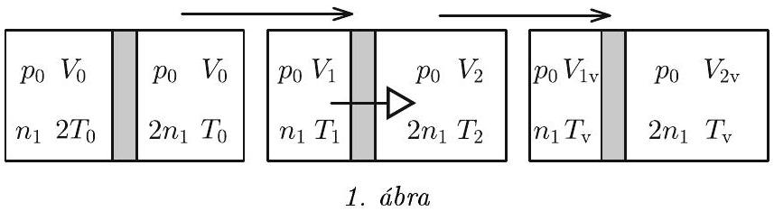
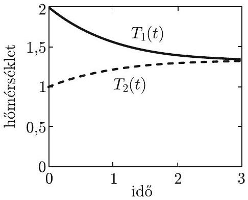

1. Egy könnyen mozgó dugattyú egy hószigetelt, vízszintes tengelyú hengert kezdetben két azonos, $V _ { 0 }$ térfogatú részre oszt. Mindkét részben $p _ { 0 }$ nyomású, egyatomos ideális gáz van. A bal oldali részben a kezdeti hốmérséklet $2 T _ { 0 }$, míg a jobb oldali részben $T _ { 0 } . A$ két részt elválasztó dugattyú mérsékelten hốvezetố, hốátadását az $\alpha$ paraméter jellemzi, azaz $\Delta T$ hốmérséklet-különbség esetén a dugattyún időegységenként átáramló hố $\alpha \Delta T$.
a) Mekkora lesz a két részben a gázok térfogata, hómérséklete és nyomása hosszú idő elteltével?
b) Adjuk meg az idő függvényében a két térrészben levố gáz $V _ { 1 } ( t )$ és $V _ { 2 } ( t )$ térfogatát!

(Tasnádi Tamás)
Megoldás. a) Amint a feladat szövege is mutatja, a kezdeti értékeket nulla indexszel, a bal oldali részt egyes, és a jobb oldali részt kettes indexszel jelöljük. A végső állapot mennyiségeit a „v" index mutatja. Az 1. ábra a folyamatot és az állapotjelzők értékeit foglalja össze.

Mivel mindkét részben egyatomos ideális gáz van, a szabadsági fok $f = 3$. A kezdeti állapotra felírt gáztörvényből,

$$
p _ { 0 } V _ { 0 } = n _ { 1 } R 2 T _ { 0 } , \quad p _ { 0 } V _ { 0 } = n _ { 2 } R T _ { 0 } ,
$$

megkapjuk, hogy a jobb oldalon a mólok száma kétszer annyi, mint a bal oldalon: $n _ { 2 } = 2 n _ { 1 }$.
A dugattyú hốátadása következtében a bal oldali gáz lassan lehül, és a jobb oldali melegszik, miközben a dugattyú balra tolódik. A folyamat lassúsága következtében a dugattyú két oldalán a nyomásnak meg kell egyeznie, azaz $p _ { 1 } = p _ { 2 }$. Továbbá a rendszerben az energia megmarad, tehát a belső energiák összege állandó:

$$
\frac { f } { 2 } n _ { 1 } R 2 T _ { 0 } + \frac { f } { 2 } 2 n _ { 1 } R T _ { 0 } = \frac { f } { 2 } n _ { 1 } R T _ { 1 } + \frac { f } { 2 } 2 n _ { 1 } R T _ { 2 } ,
$$

amely egyszerúsítések után, és a gáztörvényt felhasználva:

$$
p _ { 0 } V _ { 0 } + p _ { 0 } V _ { 0 } = p _ { 1 } V _ { 1 } + p _ { 1 } V _ { 2 } .
$$

A jobb és bal oldali térfogat összege nem változik, és így a fenti egyenletbő́l következik, hogy a nyomás végig mindkét oldalon állandó marad, azaz

$$
p _ { 1 } = p _ { 2 } = p _ { 0 } ,
$$

és a folyamat izobár.
Most rátérünk a végső állapot meghatározására. Már tudjuk, hogy a végső nyomás megegyezik a kezdetivel. A dugattyún történő hőátadás következtében a végső hőmérséklet a két oldalon ugyanakkora. Az energiamegmaradás

$$
\frac { f } { 2 } n _ { 1 } R 2 T _ { 0 } + \frac { f } { 2 } 2 n _ { 1 } R T _ { 0 } = \frac { f } { 2 } n _ { 1 } R T _ { \mathrm { v } } + \frac { f } { 2 } 2 n _ { 1 } R T _ { \mathrm { v } }
$$

egyenletéből

$$
T _ { \mathrm { v } } = \frac { 4 } { 3 } T _ { 0 } .
$$

Gay-Lussac első törvényéből

$$
V _ { 1 \mathrm { v } } = \frac { 2 } { 3 } V _ { 0 } \quad \text { és } \quad V _ { 2 \mathrm { v } } = \frac { 4 } { 3 } V _ { 0 } .
$$

[^0]
b) Most térjünk rá a folyamat vizsgálatára. A bal oldali rész lehül, a jobb oldali melegszik, azaz a bal oldal $\Delta t$ idő alatt bekövetkező kicsiny $\Delta T _ { 1 }$ hőmérséklet-változása negatív, míg a jobb oldalra $\Delta T _ { 2 } > 0$. A folyamat izobár, ezért a bal és jobb oldal egyenlete:

$$
\frac { f + 2 } { 2 } n _ { 1 } R \Delta T _ { 1 } = \alpha \left( T _ { 2 } - T _ { 1 } \right) \Delta t , \quad \text { illetve } \quad \frac { f + 2 } { 2 } 2 n _ { 1 } R \Delta T _ { 2 } = \alpha \left( T _ { 1 } - T _ { 2 } \right) \Delta t .
$$

Ezek az egyenletek az

$$
\frac { f + 2 } { 2 } n _ { 1 } R \frac { \mathrm {~d} T _ { 1 } } { \mathrm {~d} t } = \alpha \left( T _ { 2 } - T _ { 1 } \right) , \quad \text { illetve } \quad \frac { f + 2 } { 2 } 2 n _ { 1 } R \frac { \mathrm {~d} T _ { 2 } } { \mathrm {~d} t } = \alpha \left( T _ { 1 } - T _ { 2 } \right)
$$

differenciálegyenleteknek felelnek meg. Ezekből kifejezve a $\mathrm { d } T _ { 1 } / \mathrm { d } t$ és $\mathrm { d } T _ { 2 } / \mathrm { d } t$ hányadosokat, valamint bevezetve a $\Delta T =$ $T _ { 1 } - T _ { 2 }$ hómérséklet-különbséget

$$
\frac { \mathrm { d } \Delta T } { \mathrm {~d} t } = - \frac { 3 \alpha } { ( f + 2 ) n _ { 1 } R } \Delta T \quad \text { és } \quad \frac { \mathrm { d } \left( T _ { 1 } + 2 T _ { 2 } \right) } { \mathrm { d } t } = 0 .
$$

A második egyenletben a differenciálandó mennyiség nem változik, és kezdeti értékét ismerjük, tehát

$$
T _ { 1 } + 2 T _ { 2 } = 4 T _ { 0 } .
$$

Az elsố egyenletben található állandó a hőátadási folyamat lecsengési együtthatója:

$$
\lambda = \frac { 3 \alpha } { ( f + 2 ) n _ { 1 } R } = \frac { 6 \alpha T _ { 0 } } { 5 p _ { 0 } V _ { 0 } } .
$$

A fentihez hasonló differenciálegyenlet a tudományokban számos helyen előfordul. Ezek közül a legismertebb a radioaktív bomlás, amelynek a megoldása a $\lambda$ állandóval lecsengő exponenciális függvény. Mivel ismerjük ennek a függvénynek a kezdeti értékét, ennélfogva

$$
\Delta T = T _ { 0 } \mathrm { e } ^ { - \lambda t } ,
$$

és így

$$
T _ { 1 } ( t ) = \frac { 4 } { 3 } T _ { 0 } + \frac { 2 } { 3 } T _ { 0 } \mathrm { e } ^ { - \lambda t } , \quad T _ { 2 } ( t ) = \frac { 4 } { 3 } T _ { 0 } - \frac { 1 } { 3 } T _ { 0 } \mathrm { e } ^ { - \lambda t } .
$$

A térfogatok változását most is Gay-Lussac első törvénye adja:

$$
V _ { 1 } ( t ) = \frac { 2 } { 3 } V _ { 0 } + \frac { 1 } { 3 } V _ { 0 } \mathrm { e } ^ { - \lambda t } , \quad V _ { 2 } ( t ) = \frac { 4 } { 3 } V _ { 0 } - \frac { 1 } { 3 } V _ { 0 } \mathrm { e } ^ { - \lambda t } .
$$

Ezeket a függvényeket a 2. ábra grafikonjain is bemutatjuk, ahol a hőmérsékletet $T _ { 0 }$, a térfogatot $V _ { 0 }$, az időt pedig $1 / \lambda$ egységekben mértük.

