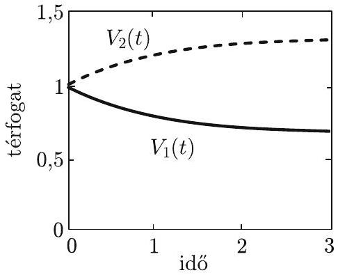
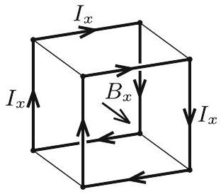
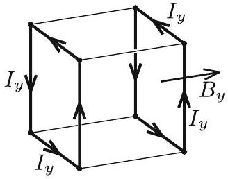

2. ábra

2. ábra

2. Egy a oldalélű kocka minden éle egyforma, $R$ ellenállású huzalból készült. A kocka homogén, kezdetben $B _ { 0 }$ indukciójú mágneses mezóbe merül, amit $\tau$ idő alatt egyenletesen nullára csökkentünk. Mekkora a folyamat közben keletkezó Joule-hó, ha a mágneses indukcióvektor a kocka egy csúcsban találkozó éleivel rendre $\alpha , \beta$ és $\gamma$ hegyesszöget zár be? $\left( \cos ^ { 2 } \alpha + \cos ^ { 2 } \beta + \cos ^ { 2 } \gamma = 1 \right.$.)
(Vigh Máté)

Megoldás. Képzeljük el egy pillanatra, hogy a mágneses térnek csak az $x$ irányú, időben

$$
B _ { x } ( t ) = B _ { x , 0 } ( 1 - t / \tau )
$$

szerint változó komponense létezik, a másik két komponens pedig zérus! Ekkor a szimmetria miatt a 3. ábra bal szélén látható árameloszlás jönne létre. A kocka 8 élében folyó, egyforma nagyságú $I _ { x }$ áramokat a Faraday-féle indukciótörvénybő̈l lehet meghatározni:

$$
U _ { \text {ind } } = - \frac { \mathrm { d } \Phi } { \mathrm {~d} t } \quad \longrightarrow \quad 4 R I _ { x } = a ^ { 2 } \frac { B _ { x , 0 } } { \tau } ,
$$

ahol felhasználtuk, hogy a mágneses tér irányára merőleges lapokon átmenő, kezdeti $a ^ { 2 } B _ { x , 0 }$ nagyságú fluxus $\tau$ idő alatt csökken nullára.

