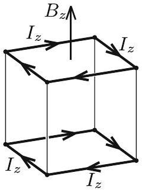
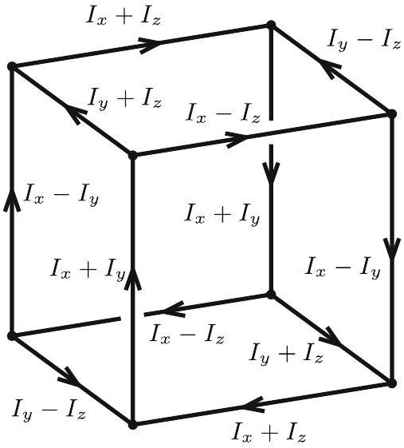
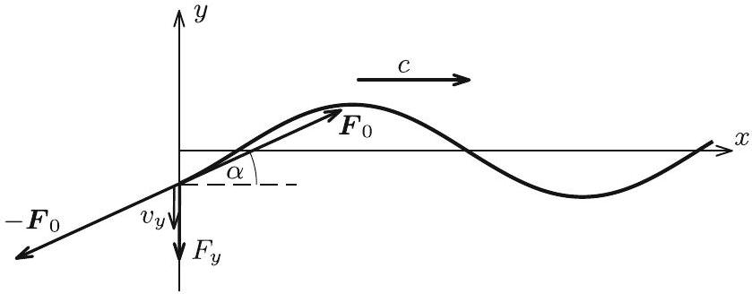
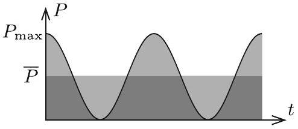
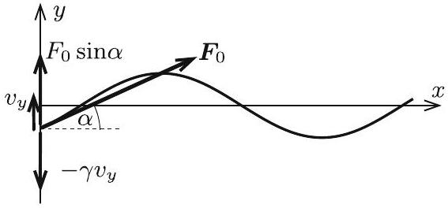

3. ábra

3. ábra

Hasonlóan kapjuk az élekben folyó áramerősségeket azokra az elképzelt esetekre, melyekben a mágneses mezőnek csak az $y$ - vagy $z$-komponense van jelen (3. ábra középső és jobb szélső rajza):

$$
I _ { x } = \frac { a ^ { 2 } } { 4 R } \frac { B _ { x , 0 } } { \tau } , \quad I _ { y } = \frac { a ^ { 2 } } { 4 R } \frac { B _ { y , 0 } } { \tau } , \quad I _ { z } = \frac { a ^ { 2 } } { 4 R } \frac { B _ { z , 0 } } { \tau } .
$$

Ha a mágneses térnek mindhárom komponense jelen van, akkor a kialakuló feszültség- és árameloszlást a fenti három eset szuperpozíciójaként kapjuk, ezt mutatja a 4. ábra.

A teljes Joule-hó teljesítménye az időben állandó erốsségú áramok miatt konstans, nagysága pedig az egyes élekben disszipálódó $R I ^ { 2 }$ teljesítmények összege:

$$
\begin{aligned}
P = & 2 R \left( I _ { x } + I _ { y } \right) ^ { 2 } + 2 R \left( I _ { x } - I _ { y } \right) ^ { 2 } + \\
& + 2 R \left( I _ { y } + I _ { z } \right) ^ { 2 } + 2 R \left( I _ { y } - I _ { z } \right) ^ { 2 } + \\
& + 2 R \left( I _ { x } + I _ { z } \right) ^ { 2 } + 2 R \left( I _ { x } - I _ { z } \right) ^ { 2 }
\end{aligned}
$$

4. ábra

Ha a zárójeleket felbontjuk, az $\left( I _ { x } + I _ { y } \right) ^ { 2 } + \left( I _ { x } - I _ { y } \right) ^ { 2 } = 2 I _ { x } ^ { 2 } + 2 I _ { y } ^ { 2 }$ összefüggés miatt a teljesítmény az alábbi alakra egyszerúsödik:

$$
P = 8 R \left( I _ { x } ^ { 2 } + I _ { y } ^ { 2 } + I _ { z } ^ { 2 } \right) .
$$

A keletkező Joule-hốt az előbb kiszámított teljesítmény és a $\tau$ idő szorzataként számolhatjuk. Az $I _ { x } , I _ { y } , I _ { z }$ áramerősségekre korábban levezetett eredmények felhasználásával kapjuk a következőt:

$$
Q = P \tau = \frac { a ^ { 4 } } { 2 R } \frac { B _ { x , 0 } ^ { 2 } + B _ { y , 0 } ^ { 2 } + B _ { z , 0 } ^ { 2 } } { \tau } = \frac { a ^ { 4 } } { 2 R } \frac { B _ { 0 } ^ { 2 } } { \tau } .
$$

Azt az érdekes eredményt kaptuk, hogy a Joule-hó független a mágneses tér irányától, csupán annak nagyságától függ. A feladatban megadott $\alpha , \beta$ és $\gamma$ szögekre tehát nem is volt szükség!

3. Egy nagyon hosszú kötelet vízszintes helyzetben, a súlyánál sokkal nagyobb $F _ { 0 }$ erốvel megfeszítünk. A kötél a pozitív $x$ tengelyen helyezkedik el, egyik vége pedig az origóban van.
a) Ha a kötél origóban lévố végét $A$ amplitúdójú, $f$ frekvenciájú harmonikus rezgómozgással az $x$ tengelyre merốleges, vízszintes y irányban mozgatjuk, a kötélben transzverzális hullámok jönnek létre, amelyek (a kötél hosszegységre esó tömegétól és a feszítettségétól függő) $c$ sebességgel terjednek. (A hullámok amplitúdója kicsi, vagyis $A \ll c / f$.) Adjuk meg a kötél $x$ koordinátájú pontjának $t$ időpillanatbeli $y ( x , t )$ kitérését!
b) Mekkora átlagos teljesítmény szükséges a kötél végének mozgatásához?
$c )$ Most a kötél origóban lévó vége y irányban szabadon elmozdulhat, de mozgását a kötél végének $v ( t )$ sebességével arányos, $- \gamma v ( t )$ erố fékezi. A kötélen egy $A$ amplitúdójú szinuszhullám érkezik az origó felé. Azt tapasztaljuk, hogy a hullám részben vagy esetleg teljesen visszaverốdik, melynek következtében egy, az origótól távolodó, $B$ amplitúdójú szinuszhullám is kialakul.

Mekkora a visszavert hullám amplitúdója? Adjuk meg a $B / A$ arányt! Vizsgáljuk a $\gamma \rightarrow \infty$ és $\gamma \rightarrow 0$ (nagyon erős és nagyon gyenge csillapítás) eseteket! Van-e olyan $\gamma$ csillapítási tényezố, amelynél egyáltalán nem verốdik vissza hullám a kötél végérôl?
(Gnädig Péter)
Megoldás. a) A kötél végpontjának rezgőmozgását az

$$
y ( t ) = A \sin \left( 2 \pi f t + \varphi _ { 0 } \right)
$$

függvénnyel írhatjuk le, ahol $\varphi _ { 0 }$ a rezgés fázisa a 0 időpillanatban, amely az időmérés kezdetének megfelelő megválasztásával nulla lehet.

A rezgés $c$ sebességgel terjed az $x$ tengely mentén, $x$ távolságra $\frac { x } { c }$ idő alatt ér el. Így az $x$ koordinátájú pontban a kitérés akkora, mint az origóban $\frac { x } { c }$ idővel korábban volt. Ez alapján a keresett hullámfüggvény:

$$
y ( x , t ) = A \sin \left[ 2 \pi f \left( t - \frac { x } { c } \right) \right] = A \sin \left( 2 \pi f t - \frac { 2 \pi f } { c } x \right) .
$$

b) A kötél alakját egy rögzített $t = t _ { 1 }$ pillanatban az

$$
y ( x ) = y \left( x , t = t _ { 1 } \right) = A \sin \left( 2 \pi f t _ { 1 } - \frac { 2 \pi f } { c } x \right)
$$

egyváltozós függvény adja meg, ahol $2 \pi f t _ { 1 }$ egy konstans.
Bármely $x$ pontban a kötél $x$ tengellyel bezárt szögének tangense éppen ennek a függvénynek a meredeksége, amit legegyszerúbben (az $x$ változó szerinti) deriválással határozhatunk meg:

$$
\operatorname { tg } \alpha \left( x , t = t _ { 1 } \right) = \frac { \mathrm { d } y } { \mathrm {~d} x } = - A \frac { 2 \pi f } { c } \cos \left( 2 \pi f t _ { 1 } - \frac { 2 \pi f } { c } x \right) .
$$

A kötél alakja azonban változik az idővel, így egy adott ponton a meredekség (és az $\alpha$ szög is) az idő függvénye lesz. Az origóban (az $x = 0$ helyen) a kötél iránytangense eszerint:

$$
\operatorname { tg } \alpha ( t ) = \operatorname { tg } \alpha ( x = 0 , t ) = - A \frac { 2 \pi f } { c } \cos \left( 2 \pi f t - \frac { 2 \pi f } { c } 0 \right) = - A \frac { 2 \pi f } { c } \cos ( 2 \pi f t ) .
$$

A kötél mozgatásához szükséges (időben változó) pillanatnyi teljesítményt a

$$
P ( t ) = F _ { y } ( t ) v _ { y } ( t )
$$

szorzat határozza meg, ahol $F _ { y } ( t )$ az általunk a kötél végére kifejtett $y$-irányú erő, $v _ { y } ( t )$ pedig a kötél origóban lévő végének ( $y$-irányú) sebessége (5. ábra).

5. ábra

Az $y$-irányú eró (felhasználva, hogy $\alpha \ll 1$ ):

$$
F _ { y } = - F _ { 0 } \sin \alpha \approx - F _ { 0 } \operatorname { tg } \alpha = F _ { 0 } A \frac { 2 \pi f } { c } \cos ( 2 \pi f t ) .
$$

A kötél végének sebessége a rezgőmozgását leíró $y ( t ) = y ( x = 0 , t )$ egyváltozós függvény ( $t$ szerinti, jól ismert) deriváltja:

$$
v _ { y } = \frac { \mathrm { d } y } { \mathrm {~d} t } = 2 \pi f A \cos ( 2 \pi f t ) .
$$

A pillanatnyi teljesítmény ezek alapján:

$$
P ( t ) = F _ { y } ( t ) v _ { y } ( t ) = \frac { 4 \pi ^ { 2 } f ^ { 2 } A ^ { 2 } F _ { 0 } } { c } \cos ^ { 2 } ( 2 \pi f t ) .
$$

6. ábra

A keresett átlagos teljesítmény - a $\cos ^ { 2 } ( 2 \pi f t )$ függvény 6. ábráról leolvasható, jól ismert átlagértéke alapján - a maximális teljesítmény fele:

$$
\bar { P } = \frac { P _ { \max } } { 2 } = \frac { 2 \pi ^ { 2 } f ^ { 2 } A ^ { 2 } F _ { 0 } } { c } .
$$

c) Ebben a részben az origó felé érkezik egy hullám. Ennek hullámfüggvénye az ellenkezó irányú terjedés miatt:
$$
y _ { \leftarrow } ( x , t ) = A \sin \left( 2 \pi f t + \frac { 2 \pi f } { c } x \right) .
$$

A visszaverődő hullám ismét a pozitív irányban halad:

$$
y _ { \rightarrow } ( x , t ) = B \sin \left( 2 \pi f t - \frac { 2 \pi f } { c } x + \varphi \right) ,
$$

itt fel kell vennünk egy egyelőre ismeretlen $\varphi$ fáziskülönbséget is. A kötélen kialakuló hullám ennek a két hullámnak a szuperpozíciója:

$$
y ( x , t ) = y _ { \leftarrow } ( x , t ) + y _ { \rightarrow } ( x , t ) .
$$

7. ábra

A kötél vége $y$ irányban szabadon mozoghat, így a rá ható $y$-irányú erők eredőjének minden pillanatban nullának kell lennie:

$$
F _ { 0 } \sin \alpha - \gamma v _ { y } \approx F _ { 0 } \frac { \mathrm {~d} y } { \mathrm {~d} x } - \gamma \frac { \mathrm { d } y } { \mathrm {~d} t } = 0 .
$$

A hullámfüggvény és a deriváltak:

$$
\begin{aligned}
y & = y _ { \leftarrow } + y _ { \rightarrow } = A \sin \left( 2 \pi f t + \frac { 2 \pi f } { c } x \right) + B \sin \left( 2 \pi f t - \frac { 2 \pi f } { c } x + \varphi \right) , \\
\frac { \mathrm { d } y } { \mathrm {~d} x } & = \frac { 2 \pi f } { c } A \cos \left( 2 \pi f t + \frac { 2 \pi f } { c } x \right) - \frac { 2 \pi f } { c } B \cos \left( 2 \pi f t - \frac { 2 \pi f } { c } x + \varphi \right) , \\
\frac { \mathrm { d } y } { \mathrm {~d} t } & = 2 \pi f A \cos \left( 2 \pi f t + \frac { 2 \pi f } { c } x \right) + 2 \pi f B \cos \left( 2 \pi f t - \frac { 2 \pi f } { c } x + \varphi \right) .
\end{aligned}
$$

Ezeket behelyettesítve az erőegyensúly képletébe, és rendezve:

$$
\begin{gathered}
\left. F _ { 0 } \frac { \mathrm {~d} y } { \mathrm {~d} x } \right| _ { x = 0 } = \left. \gamma \frac { \mathrm { d } y } { \mathrm {~d} t } \right| _ { x = 0 } , \\
F _ { 0 } \frac { 2 \pi f } { c } A \cos ( 2 \pi f t ) - F _ { 0 } \frac { 2 \pi f } { c } B \cos ( 2 \pi f t + \varphi ) = \\
= \gamma 2 \pi f A \cos ( 2 \pi f t ) + \gamma 2 \pi f B \cos ( 2 \pi f t + \varphi ) , \\
F _ { 0 } A \cos ( 2 \pi f t ) - F _ { 0 } B \cos ( 2 \pi f t ) \cos \varphi + F _ { 0 } B \sin ( 2 \pi f t ) \sin \varphi = \\
\gamma c A \cos ( 2 \pi f t ) + \gamma c B \cos ( 2 \pi f t ) \cos \varphi - \gamma c B \sin ( 2 \pi f t ) \sin \varphi .
\end{gathered}
$$

Ezeknek az egyenleteknek minden időpontban teljesülnie kell, így a $\cos ( 2 \pi f t )$-s és a $\sin ( 2 \pi f t )$-s tagokra külön-külön is:

$$
\begin{aligned}
F _ { 0 } A - F _ { 0 } B \cos \varphi & = \gamma c A + \gamma c B \cos \varphi , \\
F _ { 0 } B \sin \varphi & = - \gamma c B \sin \varphi .
\end{aligned}
$$

A második egyenlet alapján $\sin \varphi = 0 , \varphi = 0$ (vagy $\varphi = \pi$ ) és így $\cos \varphi = 1$ (vagy $\cos \varphi = - 1$ ). Ezt felhasználva az első egyenlet alapján:

$$
B = \frac { F _ { 0 } - \gamma c } { F _ { 0 } + \gamma c } A .
$$

Ha $\gamma \rightarrow \infty$ (rögzítjük a kötél végét), akkor $B = - A$, tehát a hullám azonos amplitúdóval, de ellentétes fázisban ( $\pi$ fázisugrással) verődik vissza.

Ha $\gamma \rightarrow 0$ (a kötél vége teljesen szabadon mozog), akkor $B = A$, azaz a hullám szintén azonos amplitúdóval, de most azonos fázisban verődik vissza.
$B = 0$-t akkor kapunk, ha $\gamma = F _ { 0 } / c$, ilyenkor tehát egyáltalán nincs visszaverődés.
Megjegyzés. A b) és c) kérdésekre válaszolhatunk energetikai megfontolásokkal is. Ehhez a hullám - mozgási és rugalmas helyzeti energiából származó - energiasürúségét kell meghatározni.

Az ünnepélyes eredményhirdetésre és díjkiosztásra 2019. november 22-én délután került sor az ELTE TTK Konferenciatermében. Jelen volt a 70 évvel ezelőtti, háború utáni elsó Eötvös-verseny győztese, Holics László, aki pár szóban visszaemlékezett erre a versenyre. Meghívást kaptak az 50 és 25 évvel ezelőtti Eötvös-verseny nyertesei is. Az 50 évvel ezelőtti díjazottak közül Láz József volt jelen, a 25 évvel ezelőtti díjazottak közül pedig Horváth Péter, Kovács Krisztián, Tóth Gábor Zsolt és Varga Dezsó́ jött el - ők pár mondatban beszéltek a pályafutásukról.

Ezután következett a 2019. évi verseny feladatainak és megoldásainak bemutatása. Az 1. feladat megoldását Tichy Géza, a 2. feladatét Vigh Máté, a 3. feladatét Vankó Péter ismertette.

Az esemény végén került sor az eredményhirdetésre. A díjakat Sólyom Jenő, az Eötvös Loránd Fizikai Társulat elnöke adta át.

Mindhárom feladat helyes megoldásáért I. díjban részesült Elek Péter, a BME fizika BSc. szakos hallgatója, a Debreceni Református Kollégium Dóczy Gimnáziumának érettségizett tanulója, Tófalusi Péter tanítványa.

Két feladat hibátlan megoldásáért, illetve mindhárom feladat kisebb hibákkal való megoldásáért II. díjban részesült Bokor Endre, a Budapesti Fazekas Mihály Gyakorló Általános Iskola és Gimnázium 11. osztályos tanulója, Schramek Anikó tanítványa, Fajszi Bulcsú, a Budapesti Fazekas Mihály Gyakorló Általános Iskola és Gimnázium 12. osztályos tanulója, Horváth Gábor tanítványa, valamint Fitos Bence, a BME fizika BSc. szakos hallgatója, a Budapesti Németh László Gimnázium érettségizett tanulója, Szászvári Irén és Dégen Csaba tanítványa.

Két feladat lényegében helyes megoldásáért III. díjban részesült Csépányi István, a BME fizika BSc. szakos hallgatója, az Egri Szilágyi Erzsébet Gimnázium érettségizett tanulója, Szabó Miklós tanítványa, Máth Benedek Huba, a BME fizika BSc. szakos hallgatója, a Budapesti Fazekas Mihály Gyakorló Általános Iskola és Gimnázium érettségizett tanulója, Horváth Gábor és Nagy Piroska Mária tanítványa, Olosz Adél, a BME építőmérnöki BSc. szakos hallgatója, a PTE Gyakorló Általános Iskola és Gimnázium érettségizett tanulója, Koncz Károly tanítványa, valamint Svastits Domonkos, a BME fizika BSc. szakos hallgatója, a budapesti Piarista Gimnázium érettségizett tanulója, Chikán Éva tanítványa.

Egy feladat hibátlan megoldásáért dicséretben részesült Kondákor Márk, a BME fizika BSc. szakos hallgatója, a Budapesti Fazekas Mihály Gyakorló Általános Iskola és Gimnázium érettségizett tanulója, Horváth Gábor és Nagy Piroska Mária tanítványa, Magyar Róbert Attila, a BME fizika BSc. szakos hallgatója, az Egri Dobó István Gimnázium érettségizett tanulója, Hóbor Sándor tanítványa, valamint Pácsonyi Péter, a Zalaegerszegi Zrínyi Miklós Gimnázium 12. osztályos tanulója, Pálovics Róbert tanítványa.

Az elsố díjjal a verseny plakettjén kívül az NKFI Hivatal által nyújtott támogatásból 70 ezer, a második díjjal 50 ezer, a harmadik díjjal 30 ezer, a dicsérettel 20 ezer forint pénzjutalom járt, a díjazottak tanárai és az országos verseny szervezői pedig a Typotex Kiadó könyveit kapták. A verseny megszervezését az Eötvös Loránd Fizikai Társulat ebben az évben szintén az NKFI Hivatal által az Eötvös 100 emlékév alkalmából nyújtott támogatásból fedezte.

[^0]:    ${ } ^ { 1 }$ Részletek a verseny honlapján: http://eik.bme.hu/~vanko/fizika/eotvos.htm
