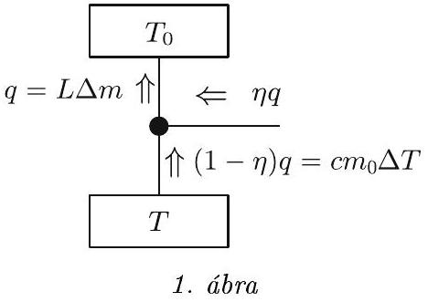
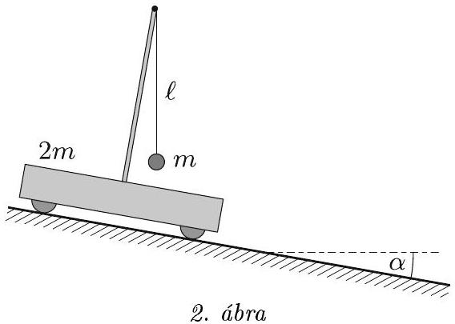
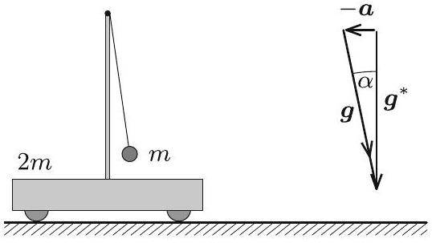
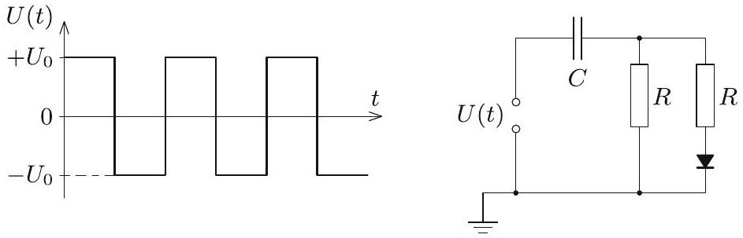

## Beszámoló a 2020. évi Eötvös-versenyről

Az Eötvös Loránd Fizikai Társulat 2020. évi Eötvös-versenye október 9-én délután 3 órai kezdettel tizennégy magyarországi helyszínen ${ } ^ { 1 }$ került megrendezésre. Ezért külön köszönettel tartozunk mindazoknak, akik ebben szervezéssel, felügyelettel a segítségünkre voltak. A versenyen a három feladat megoldására 300 perc áll rendelkezésre, bármely írott vagy nyomtatott segédeszköz használható, de (nem programozható) zsebszámológépen kívül minden elektronikus eszköz használata tilos. Az Eötvös-versenyen azok vehetnek részt, akik vagy középiskolai tanulók, vagy a verseny évében fejezték be középiskolai tanulmányaikat. Összesen 48 versenyző adott be dolgozatot, 11 egyetemista és 37 középiskolás.

Ismertetjük a feladatokat és azok megoldását.

1. feladat. Egy $m _ { 0 }$ tömegǘ, állandó $c$ fajhöjü minta hőmérséklete kicsivel a nitrogén $T _ { 0 }$ forráspontja alatt van. Rendelkezésünkre áll $m$ tömegữ, forrásban lévó folyékony nitrogén és egy hốszivattyú. Mekkora minimális hốmérsékletre lehet lehúteni a mintát, mire elforr az összes nitrogén? A nitrogén forráshöje L.

Megoldás. Egy $\eta = \frac { T _ { 2 } - T _ { 1 } } { T _ { 2 } }$ hatásfokú, hőerőépként üzemeltetett Carnot-féle körfolyamat esetén a felső hốtartályból kivett hő $\eta$-ad része mint munkavégzés jelenik meg, $( 1 - \eta )$-ad része pedig az alsó hốtartályba kerül. Hőszivattyúként üzemeltetve munkát kell befektetnünk, az alsó hőtartályból szivattyúzzuk át az energiát a felsőbe, azaz a hő előjele változik ellenkezőre.

A Carnot-körfolyamattal általában úgy találkozunk, hogy a gép két állandó hőmérsékletű hốtartály között müködik. Feladatunkban a Carnot-gép felső hốtartálya a forrásban lévő nitrogén, amelynek hốmérséklete végig $T _ { 0 }$, az alsó hőtartály pedig a minta, amely viszont lassan húl, $T$ hőmérséklete nem állandó. Egy ciklus során azonban a minta hőmérséklete állandónak tekinthető.

Ebből a lassan változó hőmérsékletű hốtartályból vonunk el egy kis lépésben $c m _ { 0 } \Delta T$ hốt. Ez a hő a felsố hốtartályba érkező $q$ hőnek

$$
1 - \eta = 1 - \frac { T _ { 0 } - T } { T _ { 0 } } = \frac { T } { T _ { 0 } } \text {-szorosa, }
$$

ahogy az 1. ábrán is látható.

Ha $\Delta m$ mennyiségű nitrogén forrt el, akkor a felső hőtartálynak $L \Delta m$ hốt kellett kapnia. Ebből a

$$
c m _ { 0 } \Delta T = \frac { T } { T _ { 0 } } L \Delta m
$$

összefüggéshez jutunk. Ez a

$$
\frac { c m _ { 0 } \mathrm {~d} T } { T } = \frac { L \mathrm {~d} m } { T _ { 0 } }
$$

differenciális összefüggéséhez vezet. Ezt kell integrálni a kezdeti állapottól a végső állapotig. Az alsó hốtartály $T$ hőmérséklete $T _ { 0 }$-ról $T _ { \text {min } }$-re csökken, és közben a folyékony nitrogén tömege $m$-ről nullára csökken. Tehát

$$
c m _ { 0 } \ln \frac { T _ { 0 } } { T _ { \min } } = \frac { L m } { T _ { 0 } } ,
$$

amiből a keresett minimális hőmérséklet

$$
T _ { \min } = T _ { 0 } e ^ { - \frac { L m } { T _ { 0 } c m _ { 0 } } } .
$$

Megjegyzés. Aki tudja, hogy a Carnot-körfolyamat közben az entrópia állandó, és ismeri az entrópia kifejezéseit, az azonnal megkapja az integrálásból kapott összefüggést.
2. feladat. Könnyen gördülö, $2 m$ tömegü kiskocsira egy árbóc van rögzítve, aminek felsó végére l hosszúságú fonállal egy $m$ tömegữ kis golyót függesztettünk. A kiskocsit egy nem túl meredek, $\alpha$ hajlásszögü lejtóre helyezzük, majd megvárjuk az inga lengéseinek lecsillapodását, és végül a kocsit elengedjük (2. ábra).

[^0]

a) A mozgás során mennyire tér ki a fonál a függőlegestól?
b) Mekkora utat tesz meg a kiskocsi, amíg a fonál újra függólegessé válik?

Megoldás. Az ingából és kiskocsiból álló rendszerre lényegében csak a nehézségi eró és a lejtőre meróleges irányú kényszererók hatnak, hiszen a kerekek gyorsuló forgásához szükséges tapadási súrlódási erốt a „könnyen gördüló" kifejezés miatt elhanyagolhatjuk. Lejtőirányú komponense csak a nehézségi erőnek van, ezért a rendszer tömegközéppontja a lejtóvel párhuzamos irányban állandó, $g \sin \alpha$ gyorsulással mozog. A tömegközéppont a mozgás során a lejtőre merộleges irányban is gyorsul, ez azonban a további gondolatmenet szempontjából nem lényeges.

Uljünk bele a zérus kezdősebességú, a lejtővel párhuzamosan $| \boldsymbol { a } | = g \sin \alpha$ nagyságú gyorsulással mozgó vonatkoztatási rendszerbe! Egy gyorsuló rendszerben bármely $m ^ { \prime }$ tömegü testre a Newton-törvények csak úgy maradnak érvényben, ha a valójában rá ható (kölcsönhatásból származó) erők mellett bevezetjük a rendszer $\boldsymbol { a }$ gyorsulásával ellentétes irányú, $- m ^ { \prime } \boldsymbol { a }$ tehetetlenségi erốt is. A $- m ^ { \prime } \boldsymbol { a }$ tehetetlenségi erő és az $m ^ { \prime } \boldsymbol { g }$ nehézségi erő vektori összege $m ^ { \prime } \boldsymbol { g } ^ { * }$ alakban is felírható, ahol $\boldsymbol { g } ^ { * } = \boldsymbol { g } - \boldsymbol { a }$. A gyorsuló rendszerben tehát minden test úgy mozog, mintha egy $\boldsymbol { g } ^ { * }$ effektív nehézségi gyorsulású erótérben helyezkedne el. Esetünkben a vonatkoztatási rendszer $\boldsymbol { a }$ gyorsulása éppen megegyezik a $\boldsymbol { g }$ nehézségi gyorsulás lejtőirányú összetevőjével, ezért az effektív $\boldsymbol { g } ^ { * }$ nehézségi gyorsulás a lejtőre merốleges irányú, nagysága pedig $g \cos \alpha$. Mivel a gyorsuló rendszerben $\boldsymbol { g } ^ { * }$ határozza meg a függőleges irányt, célszerú a feladat ábráját elforgatni, ahogy az a 3. ábrán is látható.

3. ábra

A mozgást a gyorsuló vonatkoztatási rendszerünkben elemezve azt látjuk, hogy a kiskocsi és az ingatest nyugalomból indul, az inga kezdeti szögkitérése $\boldsymbol { g } ^ { * }$ irányától mérve jobbra éppen $\alpha$. Az inga lengése során a rendszer tömegközéppontja külső lejtőirányú erő hiányában nem mozdul el, így mind a kiskocsi, mind pedig az ingatest mozgásba jön. A mechanikai energia megmaradásából és a tömegközéppont-tételből következik, hogy az inga szögkitérésének legnagyobb értéke $\boldsymbol { g } ^ { * }$-hoz viszonyítva a túlsó oldalon szintén $\alpha$ lesz, ami akkor következik be, amikor a kiskocsi és az ingatest először áll meg. Ez azt jelenti, hogy az eredeti vonatkoztatási rendszerben az inga a kezdeti helyzetéhez képest (azaz $\boldsymbol { g }$-hez viszonyítva) maximálisan $2 \alpha$ szöggel tér ki. Ezzel a feladat $a$ ) kérdésére válaszoltunk.

Térjünk most rá a $b$ ) részre. A gyorsuló rendszerben az ingatest és a kiskocsi is periodikus mozgást végez az egyensúlyi helyzet körül, amelyben az inga fonala éppen párhuzamos $\boldsymbol { g } ^ { * }$-gal. Az inga legkorábban $T$ periódusidő múlva érkezik vissza a kiindulási helyzetbe. Ebben a pillanatban a tömegközéppont elmozdulása

$$
s = \frac { 1 } { 2 } g \sin \alpha \cdot T ^ { 2 } ,
$$

és ugyanekkora a kocsi elmozdulása is, hiszen a kocsi relatív helyzete a tömegközépponthoz viszonyítva éppen ugyanaz, mint az indítási állapotban volt. Feladatunk tehát a rezgés $T$ periódusidejének meghatározása.

A gyorsuló rendszerben a tömegközéppont megmaradása miatt a kocsi kitérése minden pillanatban feleakkora és ellentétes irányú, mint az ingatest lejtóvel párhuzamos irányú kitérése. Ezért a fonál felsó́ harmadolópontja lényegében nem mozdul el (valójában a lejtőre merőleges irányban mégis, de elhanyagolható mértékben). Az ingatest tehát úgy mozog a $\left| \boldsymbol { g } ^ { * } \right| = g \cos \alpha$ nehézségi gyorsulású erőtérben, mintha egy $2 \ell / 3$ hosszúságú fonálra lenne felfüggesztve. Egy ilyen inga lengésideje kis kitérések esetén:

$$
T = 2 \pi \sqrt { \frac { 2 \ell } { 3 g \cos \alpha } } .
$$

Vajon alkalmazható-e most ez az összefüggés? A feladat szövege szerint a lejtő nem túl meredek. Egy 45°-os lejtő már elég meredeknek számít, de az ekkora szögben kitérített inga lengésideje is csak kb. 4\%-kal nagyobb a fenti képlettel számolt lengésidőnél. Ha a lejtő csak 30 -os, az eltérés $2 \%$-nál is kisebb. Jó közelítéssel tehát azt mondhatjuk, hogy a kocsi elmozdulása addig a pillanatig, amíg az inga újra függőlegessé válik

$$
s \approx \frac { 1 } { 2 } g \sin \alpha \cdot 4 \pi ^ { 2 } \frac { 2 \ell } { 3 g \cos \alpha } = \frac { 4 \pi ^ { 2 } } { 3 } \ell \operatorname { tg } \alpha
$$

3. feladat. Egy ideális diódából, két $R = 2 k \Omega$ nagyságú ellenállásból, egy kezdetben töltetlen, $C = 100 \mu F$ kapacitású kondenzátorból és egy feszültséggenerátorból a 4. ábrán látható kapcsolást állítottuk össze. A feszültséggenerátoron $f = 5 \mathrm { kHz }$ frekvenciájú, $+ U _ { 0 }$ és $- U _ { 0 }$ között változó szimmetrikus négyszögjelet állítunk be, ahol $U _ { 0 } = 3,6 \mathrm {~V}$.

4. ábra

a) Mekkora maximális feszültségre töltödik fel a kondenzátor?
b) A kondenzátor töltetlen állapotától számítva körülbelül mennyi idő után éri el a kondenzátor feszültsége a maximális érték felét?

Megoldás. A kapcsolásban félperiódusonként felváltva $+ U _ { 0 }$ és $- U _ { 0 }$ feszültséget kapcsolunk egy soros $R C$ kapcsolásra, ahol a kondenzátor kapacitása mindvégig $C$, az ellenállás pedig az áramiránytól függően $R _ { 1 } = \frac { R } { 2 }$, illetve $R _ { 2 } = R$. Jól ismert, hogy ha egy töltetlen, $C$ kapacitású kondenzátorból és egy $R$ ellenállásból álló soros $R C$ kapcsolásra $U _ { 0 }$ feszültséget kapcsolunk, akkor a kondenzátor feszültsége az

$$
U ( t ) = U _ { 0 } \left( 1 - e ^ { - \frac { t } { \tau } } \right)
$$

függvény szerint változik, ahol az időállandó $\tau = R C$.
Vegyük észre, hogy a mi esetünkben az (egyik) időállandó $\tau = R C = 0,2 \mathrm {~s}$ (a másik ennek fele), a négyszögjel periódusideje pedig $T = \frac { 1 } { f } = 0,2 \mathrm {~ms}$, és így $T \ll \tau$. Emiatt egy fél periódusnyi idő alatt a töltődő kondenzátor feszültsége nagyon jó közelítéssel lineárisan változik.

Legyen a kondenzátor feszültsége egy adott időpillanatban $U _ { \mathrm { C } } ( t )$, a kondenzátoron átfolyó áram pedig $I ( t )$. A négyszögjel első fél periódusában (amikor a dióda nyitva van, és mindkét ellenálláson folyik áram)

$$
U _ { 0 } - U _ { \mathrm { C } } = R _ { 1 } I _ { 1 } ( t ) = \frac { R } { 2 } I _ { 1 } ( t ) , \quad \text { amiből } \quad I _ { 1 } ( t ) = \frac { 2 } { R } \left[ U _ { 0 } - U _ { \mathrm { C } } ( t ) \right] .
$$

Egy fél periódus alatt ez az áram $I _ { 1 } ( t ) \frac { T } { 2 }$ töltést szállít a kondenzátorra, így a kondenzátor feszültségének megváltozása

$$
\Delta U _ { \mathrm { C } } ( t ) = \frac { 1 } { C } I _ { 1 } ( t ) \frac { T } { 2 } = \frac { T } { R C } \left[ U _ { 0 } - U _ { \mathrm { C } } ( t ) \right] = \frac { T } { \tau } \left[ U _ { 0 } - U _ { \mathrm { C } } ( t ) \right] .
$$

A másik fél periódusban (amikor a dióda lezár, és csak az egyik ellenálláson folyhat áram)

$$
- U _ { 0 } - U _ { \mathrm { C } } = R _ { 2 } I _ { 2 } ( t ) = R I _ { 2 } ( t ) , \quad \text { amiből } \quad I _ { 2 } ( t ) = \frac { 1 } { R } \left[ - U _ { 0 } - U _ { \mathrm { C } } ( t ) \right] ,
$$

és a fél periódus alatt a kondenzátor feszültségének megváltozása

$$
\Delta U _ { \mathrm { C } } ( t ) = \frac { 1 } { C } I _ { 2 } ( t ) \frac { T } { 2 } = \frac { T } { 2 R C } \left[ - U _ { 0 } - U _ { \mathrm { C } } ( t ) \right] = \frac { T } { 2 \tau } \left[ - U _ { 0 } - U _ { \mathrm { C } } ( t ) \right] .
$$

Egy teljes periódus alatt a feszültség teljes megváltozása a két fél periódus alatti változás összege:

$$
\Delta U _ { \mathrm { C } } ( t ) = \frac { T } { 2 \tau } \left[ U _ { 0 } - 3 U _ { \mathrm { C } } ( t ) \right] = \frac { 3 T } { 2 \tau } \left[ \frac { U _ { 0 } } { 3 } - U _ { \mathrm { C } } ( t ) \right] .
$$

A kondenzátor feszültsége akkor nem nő tovább, ha $\Delta U _ { \mathrm { C } } ( t ) = 0$, azaz ha $U _ { \mathrm { C } } ( t ) = \frac { U _ { 0 } } { 3 }$, tehát a kondenzátor hosszú idő után $U _ { \mathrm { C } } ( \infty ) = \frac { U _ { 0 } } { 3 } = 1,2 \mathrm {~V}$ feszültségre töltődik fel.

Ezután áttérünk a $b$ ) kérdés megválaszolására. Mivel a periódusidő sokkal kisebb az időállandónál, az egy periódus alatti feszültségváltozás nagyon kicsi, a kondenzátor sok perióduson át töltődik. Ezen az időskálán a félperiódusok alatti töltődések és kisülések kis ingadozása nem is látszik. Egy olyan folyamatot kapunk, ahol a kondenzátor feszültsége lényegében folyamatosan nő a kezdeti $U _ { \mathrm { C } } ( 0 ) = 0$ értéktő̌l az $U _ { \mathrm { C } } ( \infty )$ értékig.

Az utolsó egyenletünk alapján

$$
\frac { \mathrm { d } \left[ U _ { \mathrm { C } } ( \infty ) - U _ { \mathrm { C } } ( t ) \right] } { \mathrm { d } t } \approx \frac { \Delta \left[ U _ { \mathrm { C } } ( \infty ) - U _ { \mathrm { C } } ( t ) \right] } { T } = - \frac { 3 } { 2 \tau } \left[ U _ { \mathrm { C } } ( \infty ) - U _ { \mathrm { C } } ( t ) \right] .
$$

Ez pedig egy ugyanolyan differenciálegyenlet, mint amely leírja egy kondenzátor feltöltődését (és amely jól ismert a radioaktív bomlástörvényből is), megoldása:

$$
\left[ U _ { \mathrm { C } } ( \infty ) - U _ { \mathrm { C } } ( t ) \right] = \left[ U _ { \mathrm { C } } ( \infty ) - U _ { \mathrm { C } } ( 0 ) \right] e ^ { - \frac { 3 t } { 2 \tau } } ,
$$

amiből látható, hogy a kondenzátor akkor töltődik fel a maximális érték felére, ha

$$
e ^ { - \frac { 3 t } { 2 \tau } } = \frac { 1 } { 2 } , \quad \text { azaz } \quad t = \frac { 2 } { 3 } \tau \ln 2 = 0,0924 \mathrm {~s} .
$$

*

Az ünnepélyes eredményhirdetés és díjkiosztás a járványhelyzet miatt elmaradt. Helyette az eredetileg meghirdetett időpontban, 2020. november 20-án délután 3 órakor a verseny honlapjára került fel mindaz, ami az eredményhirdetésen elhangzott volna. Ismertetésre kerültek az 50 és 25 évvel ezelőtti Eötvös-verseny feladatai, és az akkori díjazottak egy részének visszaemlékezései: az 50 évvel ezelőttiek közül Horváth Péter és Tichy-Rács Ádám, a 25 évvel ezelőttiek közül Lovas Rezsó́, Tóth Gábor Zsolt és Varga Dezső̌ küldött üzenetet.

Ezt követte a 2020. évi verseny feladatainak és megoldásainak bemutatása (az 1. feladat megoldását Tichy Géza, a 2. feladatét Vigh Máté, a 3. feladatét Vankó Péter írta le), majd az eredmények közlése:

Egyetlen versenyző sem oldotta meg mindhárom feladatot, így a versenybizottság nem adott ki első díjat.
Az elsó feladat helyes és a harmadik feladat lényegében helyes megoldásáért, valamint a második feladatban elért részeredményekért második díjat nyert Bonifert Balázs, a budapesti Baár-Madas Református Gimnázium 12. osztályos tanulója, Horváth Norbert tanítványa és Pácsonyi Péter, a BME mechatronikai mérnök alapszakos hallgatója, aki a Zalaegerszegi Zrínyi Miklós Gimnáziumban érettségizett Pálovics Róbert tanítványaként.

A második és a harmadik feladat kicsit hiányos megoldásáért harmadik díjat nyert Molnár Szabolcs, a BME fizika BSc szakos hallgatója, aki a Kecskeméti Katona József Gimnáziumban érettségizett Sáróné Jéga-Szabó Irén tanítványaként.

Az elsó feladat hibátlan megoldásáért dicséretet kapott Fekete Dezsõ Domonkos, a BME fizika BSc szakos hallgatója, aki a Kecskeméti Katona József Gimnáziumban érettségizett Sáróné Jéga-Szabó Irén tanítványaként, Selmi Bálint, a Pécsi Leốwey Klára Gimnázium 12. osztályos tanulója, Simon Péter, Kotek László és Pálfalvi László tanítványa, valamit Sepsi Csombor Márton, a Zalaegerszegi Zrínyi Miklós Gimnázium 12. osztályos tanulója, Kovács Tibor tanítványa.

A második díjjal Zimányi Gergely adományából 75 ezer, a harmadik díjjal 55 ezer, a dicsérettel 35 ezer forint pénzjutalom jár. A díjazottak tanárai az Eötvös Loránd emlékalbumot kapják. Az Eötvös Loránd Fizikai Társulatot a Nanorobot Vagyonkezelő Kft. és az Andersen Adótanácsadó Zrt. támogatja. Köszönjük az adományozók önzetlen támogatását!

Tichy Géza, Vankó Péter, Vigh Máté

[^0]:    ${ } ^ { 1 }$ Részletek a verseny honlapján: http://eik.bme.hu/~vanko/fizika/eotvos.htm.
