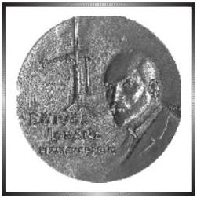
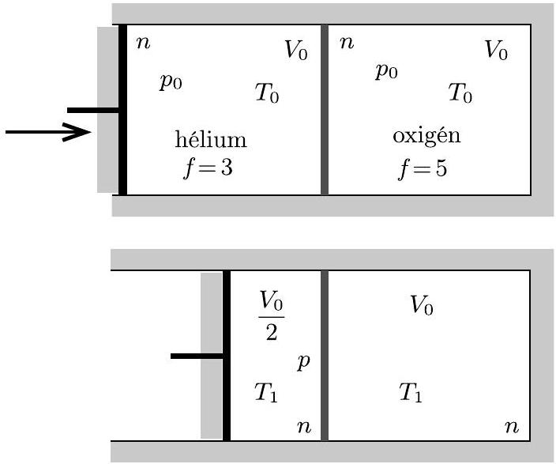
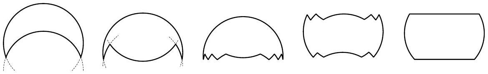
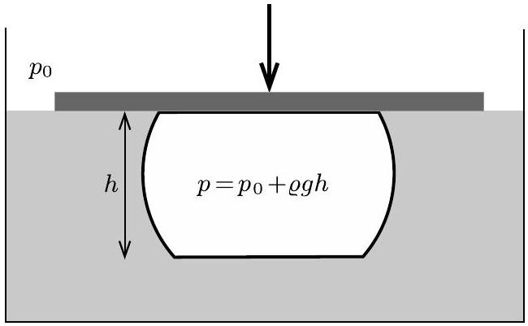
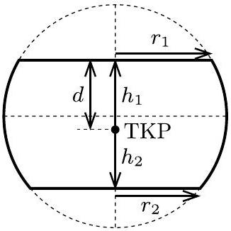

## Beszámoló a 2021. évi Eötvös-versenyről

Az Eötvös Loránd Fizikai Társulat 2021. évi Eötvös-versenye október 15-én délután 3 órai kezdettel tíz magyarországi helyszínen ${ } ^ { 1 }$ került megrendezésre. Ezért külön köszönettel tartozunk mindazoknak, akik ebben szervezéssel, felügyelettel a segítségünkre voltak. A versenyen a három feladat megoldására 300 perc áll rendelkezésre, bármely írott vagy nyomtatott segédeszköz használható, de (nem programozható) zsebszámológépen kívül minden elektronikus eszköz használata tilos. Az Eötvös-versenyen azok vehetnek részt, akik vagy középiskolai tanulók, vagy a verseny évében fejezték be középiskolai tanulmányaikat. Összesen 69 versenyző adott be dolgozatot, 14 egyetemista és 55 középiskolás.

Ismertetjük a feladatokat és azok megoldását.

1. feladat. Egy hőszigetelt, hengeres tartályt egy jó hővezető, rögzített fal oszt két egyforma henger alakú térrészre. Az egyik térfélben héliumgáz, a másikban azzal megegyező anyagmennyiségü oxigéngáz található, mindkét gáz kezdeti hőmérséklete $T _ { 0 }$, kezdeti térfogata pedig $V _ { 0 }$. A tartály egyik végét könnyen mozgó, hőszigetelő dugattyú zárja le, amellyel a héliummal töltött térrész térfogata változtatható. Határozzuk meg a hengerben lévő gázok végső hőmérsékletét, miután a dugattyú lassú mozgatásával a héliumgáz térfogatát $V _ { 0 } / 2$-re csökkentettük!
(Vigh Máté)
Megoldás. Az 1. ábra a kezdeti állapotot és a végállapotot mutatja.

1. ábra

[^0]
Feladatunk a $T _ { 1 }$ hőmérséklet meghatározása. Ezt többféle módszerrel is megtehetjük.
I. megoldás. Legyen a héliumgáz lassan változó pillanatnyi hőmérséklete $T$, térfogata $V$. Az elválasztó fal jó hővezetése miatt az oxigéngáz hőmérséklete is $T$. Ha a dugattyú elmozdulása miatt a hőmérséklet $\Delta T$ értékkel nő, a héliumgáz térfogata pedig $\Delta V$ értékkel változik meg $( \Delta V < 0 )$, akkor az egész rendszer belső energiájának változása

$$
\begin{equation*}
\Delta E = \frac { 3 } { 2 } n R \Delta T + \frac { 5 } { 2 } n R \Delta T = 4 n R \Delta T . \tag{1}
\end{equation*}
$$

A héliumgáz nyomása:

$$
p = n R \frac { T } { V } .
$$

Az egész rendszerre alkalmazott első főtétel szerint

$$
- p \Delta V = \Delta E ,
$$

vagyis

$$
\begin{equation*}
\frac { \Delta V } { V } + 4 \frac { \Delta T } { T } = 0 . \tag{2}
\end{equation*}
$$

Szorozzuk meg (2)-t $T ^ { 4 } V$-vel, és használjuk ki, hogy a megváltozások kicsik (ezért a négyzetüket és a magasabb hatványaikat elhanyagolhatjuk):

$$
T ^ { 4 } \Delta V + 4 T ^ { 3 } V \Delta T = \Delta \left( T ^ { 4 } V \right) = 0 ,
$$

tehát $T ^ { 4 } V$ a folyamat során állandó marad. A héliumgáz kezdeti és végállapotát összehasonlítva kapjuk, hogy

$$
T _ { 0 } ^ { 4 } V _ { 0 } = T _ { 1 } ^ { 4 } \frac { V _ { 0 } } { 2 } , \quad \text { vagyis } \quad T _ { 1 } = \sqrt [ 4 ] { 2 } T _ { 0 } \approx 1,2 T _ { 0 } .
$$

Ugyanezt az eredményt az (1)-ben szereplő kicsiny változások összegzésével (integrálással) is megkaphatjuk:

$$
\int _ { V _ { 0 } } ^ { V _ { 0 } / 2 } \frac { 1 } { V } \mathrm {~d} V + 4 \int _ { T _ { 0 } } ^ { T _ { 1 } } \frac { 1 } { T } \mathrm {~d} T = - \ln 2 + 4 \ln \frac { T _ { 1 } } { T _ { 0 } } = 0
$$

vagyis

$$
T _ { 1 } = \sqrt [ 4 ] { 2 } T _ { 0 } .
$$

II. megoldás. Az (1) egyenlet szerint a folyamat tekinthető egy $f = 8$ szabadsági fokú gáz adiabatikus összenyomásának. Erre a folyamatra a fajhőhányados $\kappa = \frac { f + 2 } { f } = \frac { 5 } { 4 }$, tehát az adiabatikus állapotváltozás egyenlete:

$$
T V ^ { \kappa - 1 } = T V ^ { 1 / 4 } = \text { állandó, }
$$

ahonnan $T _ { 1 } = \sqrt [ 4 ] { 2 } T _ { 0 }$.

III. megoldás. Kézikönyvekben ${ } ^ { 2 }$ és képletgyüjteményekben megtalálható, hogy $n$ mol anyagmennyiségű, $f$ szabadsági fokú molekulákból álló, $T$ hőmérsékletű és $V$ térfogatú ideális gáz entrópiája

$$
S ( T , V ) = \frac { f } { 2 } n R \ln \frac { T } { T _ { 0 } } + n R \ln \frac { V } { V _ { 0 } } .
$$

Az entrópia nullpontja önkényesen választható, a fenti képletben például

$$
S \left( T _ { 0 } , V _ { 0 } \right) = 0
$$

(ahol $T _ { 0 }$ és $V _ { 0 }$ lehet a feladatban szereplő kezdeti hőmérséklet és térfogat).
A vizsgált folyamatban nincs hőcsere a rendszer és a környezete között, továbbá (a dugattyú lassú mozgatása esetén) a folyamat reverzibilis, így a rendszer entrópiája változatlan marad:

$$
\left( \frac { f _ { \mathrm { He } } } { 2 } n R \ln \frac { T _ { 1 } } { T _ { 0 } } + n R \ln \frac { V _ { 0 } / 2 } { V _ { 0 } } \right) + \left( \frac { f _ { \mathrm { O } _ { 2 } } } { 2 } n R \ln \frac { T _ { 1 } } { T _ { 0 } } + n R \ln \frac { V _ { 0 } } { V _ { 0 } } \right) = 0 ,
$$

vagyis (tudva, hogy $f _ { \mathrm { He } } = 3$ és $f _ { \mathrm { O } _ { 2 } } = 5$ )

$$
4 \ln \frac { T _ { 1 } } { T _ { 0 } } + \ln \frac { 1 } { 2 } = 0 ,
$$

azaz a $T _ { 1 } = \sqrt [ 4 ] { 2 } T _ { 0 }$ eredmény adódik.
Megjegyzés. Ha a héliumgáz térfogatát olyan gyorsan csökkentjük a felére, hogy az oxigéngáz nem tud azonnal felmelegedni, akkor a folyamat irreverzibilissé válik, vagyis az entrópia nőni fog. Mivel adott térfogat esetén a magasabb hőmérséklethez tartozik nagyobb entrópia, a dugattyú hirtelen elmozdítása után a két gáz végül (a hőmérséklet kiegyenlítődése után) jobban felmelegszik, mint a feladatban szereplő lassú összenyomásnál.
2. feladat. Egy henger alakú, l hosszúságú és $R \ll \ell$ sugarú, légmagos szolenoid meneteinek száma $N$. A tekercs belsejébe egy $r \ll R$ sugarú, a szolenoid szimmetriatengelyére merőleges síkú, $L$ induktivitású szupravezető gyűrűt helyezünk (a gyűrü és a szolenoid középpontja egybeesik).
a) Növekszik vagy csökken a szolenoid induktivitása a gyűrü behelyezése következtében?
b) Határozzuk meg az induktivitás megváltozásának nagyságát!
(Széchenyi Gábor)
Megoldás. a) A szupravezető fázisban lévő anyagoknak az az egyik különleges tulajdonságuk, hogy az elektromos ellenállásuk nulla. Ha egy szupravezető gyűrűben feszültség indukálódna, akkor az Ohm-törvény alapján végtelen nagy áramnak kellene benne folynia. Ennek a fizikai képtelenségnek a feloldása az, hogy a szupravezető gyűrűben nem indukálódhat feszültség, azaz a gyűrűn áthaladó mágneses fluxus értéke nem változhat meg.

[^1]
Az egyszerűség kedvéért tételezzük fel, hogy kezdetben, amikor a szolenoidban nulla az áramerősség, akkor a szupravezető gyűrüben sem folyik áram, így a rajta áthaladó mágneses fluxus értéke nulla. Ez az érték akkor sem változhat meg, ha a tekercsben áram folyik. Hogyan lehetséges ez, hiszen a szolenoid mágneses tere miatt meg kellene jelennie egy véges fluxusnak a gyűrűben. Úgy, hogy a gyűrüben olyan áram indukálódik, mely azonos nagyságú, de ellentétes előjelű fluxust hoz létre a gyűrűn. Ennek az áramnak a hatására a tekercsen áthaladó mágneses fluxus értéke és így a tekercs induktivitása is kisebb lesz, mint a szupravezető gyűrű nélküli esetben.
b) Vizsgáljuk az előbb leírt jelenséget kvantitatívan. Legyen a szolenoid árama $I$. A szolenoid közepén elhelyezett szupravezető gyűrűn áthaladó mágneses fluxus értéke

$$
\Phi _ { \text {gyürü } } = L \cdot i + M \cdot I ,
$$

ahol $L$ a gyűrű öninduktivitása, $i$ a gyűrű árama, $M$ a szolenoid és a gyűrű kölcsönös indukciós együtthatója, ami megadja, hogy az egyikben folyó egységnyi erősségű áram hatására mekkora mágneses fluxus jön létre a másikban. (Belátható, hogy $M$ nagysága a szereplők felcserélésekor nem változik, tehát mindegy, hogy a gyűrű árama által a szolenoidban keltett mágneses fluxust számítjuk ki, vagy a szolenoid árama által a gyűrüben keltett fluxust vizsgáljuk. Ez utóbbi nyilván könnyebb feladat.) $M$ értékét a feladatban megadott geometriára könnyen kiszámolhatjuk. Az $I$ erősségű árammal átjárt szolenoidban a homogén mágneses tér indukcióvektorának nagysága $\frac { \mu _ { 0 } N I } { \ell }$. Mivel a gyűrű síkja merőleges a mágneses tér irányára, a gyűrűn áthaladó mágneses fluxus $\frac { \mu _ { 0 } N I } { \ell } r ^ { 2 } \pi$. Innen kiolvashatjuk a kölcsönös indukciós együttható értékét:

$$
M = \frac { \mu _ { 0 } N } { \ell } r ^ { 2 } \pi .
$$

A gyűrú fluxusa nem változik meg, ha a szolenoid áramát nulláról $I$-re növeljük, így $\Phi _ { \text {gyürü } } = 0$, ahonnan a gyürűben folyó áram értéke

$$
i = - \frac { M I } { L } .
$$

A szolenoidon áthaladó mágneses fluxus értéke:

$$
\Phi _ { \text {szolenoid } } = L _ { 0 } \cdot I + M \cdot i ,
$$

ahol $L _ { 0 }$ a szolenoid öninduktivitása. Behelyettesítve a gyűrű áramát, a következőt kapjuk:

$$
\Phi _ { \text {szolenoid } } = \left( L _ { 0 } - \frac { M ^ { 2 } } { L } \right) I .
$$

Láthatjuk, hogy a szolenoidon áthaladó mágneses fluxus arányos a szolenoid áramával. Az arányossági tényező a szupravezető gyűrűt tartalmazó szolenoid induktivitása, mely

$$
\Delta L _ { 0 } \equiv \frac { M ^ { 2 } } { L } = \frac { \mu _ { 0 } ^ { 2 } N ^ { 2 } r ^ { 4 } \pi ^ { 2 } } { \ell ^ { 2 } L }
$$

értékkel kisebb, mint a gyűrű nélküli szolenoid öninduktivitása.

Ugyanezt az eredményt kaptuk volna, ha a számolás során nem tételezzük fel, hogy kezdetben a szupravezető gyűrűben nulla áram folyik. A leírt levezetés kis módosítással használható a szupravezető tetszőleges előélete esetén is. Ekkor $i$, $\Phi _ { \text {gyűrü } }$ és $\Phi _ { \text {szolenoid } }$ azt adja meg, hogy mennyivel változott meg a gyűrű árama, valamint a gyűrűn és a szolenoidon áthaladó mágneses fluxus értéke, miközben a tekercs áramát nulláról $I$-re növeltük.
3. feladat. Egy felfújható strandlabda könnyü, vékony, igen hajlékony, de nem nyújtható műanyagból készült. Felfújt állapotában a labda majdnem pontosan gömb alakú, sugara 20 cm. Egy kísérletben a labdát űrtartalmának feléig felfújjuk levegővel, majd egy vízszintesen tartott, nagy kiterjedésű síklap segítségével fokozatosan víz alá nyomjuk, míg az teljesen el nem merül a vízben. Vázoljuk fel, milyen alakot vesz fel a víz alá nyomott labda! Ha tudjuk, határozzuk meg az alak releváns méreteinek számszerű értékeit is!
(Vigh Máté)
Megoldás. A feladat szövege szerint a labda anyaga „igen hajlékony, de nem nyújtható". Ezért az egyetlen lehetséges módszer a labda térfogatának csökkentésére, ha a labdát „behorpasztjuk” (első rajz a 2. ábrán), ekkor a felület két (ugyanolyan $r$ sugarú) gömbfelületdarabból áll. A behorpadt gömbfelületen azonban újabb horpadás is lehetséges - ezúttal kifele -, ahogy az ábra második rajzán látszik. Ezt tetszőleges számban megismételhetjük, így akár közel síklapot is kialakíthatunk, amely azonban a valóságban egy kicsit „ráncos”, vékony, ki-behajló gömbfelszíndarabokból áll (középső rajz).

Látni fogjuk, hogy fizikai feltételek miatt a labda alsó és felső része is így fog deformálódni (negyedik rajz). A „ráncokat” (amelyek elvileg tetszőlegesen finomak lehetnek, de egy valódi kísérletben azért látszanak) már nem ábrázolva egy gömbövet kapunk (utolsó rajz a 2. ábrán).

2. ábra

Eddig csak a geometria által lehetséges deformációkról beszéltünk. Ezután meg kell vizsgálnunk, hogy az adott kísérletben a fizikai feltételek következtében milyen alak jön létre. A labda tetejét a síklap nyomja le a víz alá, így ott a labda rásimul a felületre. Érdekesebb kérdés a labda aljának alakja: mivel a labda „igen hajlékony", a gyűrt felületen olyan alakot vesz fel, hogy a belső és a külső nyomás mindenhol azonos legyen. A labdán belül mindenhol azonos a légnyomás (a levegő csekély aerosztatikus nyomását elhanyagoljuk), a víz nyomása viszont a mélységgel változik $\left( p = p _ { 0 } + \varrho g h \right)$, így a labda aljának is vízszintes síklapnak kell lennie (3. ábra).

A labda alakja tehát egy vízszintes síklapokkal határolt gömböv.

3. ábra

A feladat második részében meg kell határoznunk a gömböv méreteit. A jelölések a 4. ábrán láthatók.

Vizsgáljuk először a geometriai feltételt: a gömböv térfogata a gömb térfogatának fele. (A gömböv térfogata képletgyüjteményekből kikereshető, vagy integrálással könnyen kiszámítható.)

$$
\pi r ^ { 2 } \left( h _ { 1 } + h _ { 2 } \right) - \frac { \pi } { 3 } \left( h _ { 1 } ^ { 3 } + h _ { 2 } ^ { 3 } \right) = \frac { 2 \pi } { 3 } r ^ { 3 } .
$$

A numerikus megoldáshoz érdemes bevezetni az $x _ { 1 } = \frac { h _ { 1 } } { r }$ és $x _ { 2 } = \frac { h _ { 2 } } { r }$ dimenziótlan változókat, így áttekinthetőbbé válik az egyenlet.

$$
\begin{equation*}
x _ { 1 } ^ { 3 } + x _ { 2 } ^ { 3 } - 3 \left( x _ { 1 } + x _ { 2 } \right) + 2 = 0 . \tag{3}
\end{equation*}
$$

Ez egy kétismeretlenes (harmadfokú) egyenlet. A másik egyenletet a fizikai feltétel matematikai megfogalmazásával kapjuk meg. Erre két lehetséges utat mutatunk meg.
I. megoldás. Az erőegyensúly alapján: a lapra kifejtett nyomóerő megegyezik a labdára ható felhajtóerővel.

$$
\left( p - p _ { 0 } \right) r _ { 1 } ^ { 2 } \pi = \frac { 2 r ^ { 3 } \pi } { 3 } \varrho g ,
$$

ahol $p$ a labdában lévő nyomás, $p _ { 0 }$ a külső légnyomás, $r _ { 1 }$ a gömböv felső lapjának sugara, $\varrho$ pedig a víz sűrűsége.

Ahogy a 3. ábrán is látható, a labda belsejében a levegő nyomása a külső légnyomás és a $h$ magasságú vízoszlop hidrosztatikai nyomásának összegével egyenlő:

$$
p = p _ { 0 } + \varrho g h = p _ { 0 } + \varrho g \left( h _ { 1 } + h _ { 2 } \right) .
$$

Ezt beírva az előző egyenletbe, és kihasználva, hogy $r _ { 1 } ^ { 2 } = r ^ { 2 } - h _ { 1 } ^ { 2 }$, megkapjuk a fizikai feltételt:

$$
\varrho g \left( h _ { 1 } + h _ { 2 } \right) \left( r ^ { 2 } - h _ { 1 } ^ { 2 } \right) \pi = \frac { 2 r ^ { 3 } \pi } { 3 } \varrho g ,
$$

amelyet a korábban bevezetett dimenziótlan változókkal ismét áttekinthetőbb alakra hozhatunk:

$$
\begin{equation*}
\left( x _ { 1 } + x _ { 2 } \right) \left( 1 - x _ { 1 } ^ { 2 } \right) = \frac { 2 } { 3 } . \tag{4}
\end{equation*}
$$

Ezután a kétismeretlenes (3)-(4) egyenletrendszert kell megoldanunk.
Az egyenletrendszert legegyszerübb numerikusan, „próbálgatással” megoldani. $x _ { 1 }$ és $x _ { 2 }$ értéke 0 és 1 között lehet, értéküket durván megbecsülve behelyettesíthetjük az egyenletekbe, majd az értékeket úgy finomítjuk, hogy az egyenletek minél inkább teljesüljenek. Az egyenletrendszer megoldása (itt 3 értékes jegyre, de természetesen a versenyen kevésbé pontos megoldás is elég lett volna) és az összenyomott labda 4. ábrán látható geometriai paraméterei:

$$
\begin{array} { c c }
x _ { 1 } = 0,235 , & x _ { 2 } = 0,470 \\
h _ { 1 } = 4,7 \mathrm {~cm} , & h _ { 2 } = 9,4 \mathrm {~cm} \\
h = h _ { 1 } + h _ { 2 } = 14,1 \mathrm {~cm} \\
r _ { 1 } = 19,4 \mathrm {~cm} , & r _ { 2 } = 17,6 \mathrm {~cm} .
\end{array}
$$

II. megoldás. Energetikai megfontolás alapján: a kiszorított víz tömegközéppontja a lehető legmagasabban legyen.

A gömböv tömegközéppontjának távolsága a laptól (a gömböv tömegközéppontjának helye képletgyüjteményekből kikereshető, vagy integrálással könnyen meghatározható):

$$
d = \frac { 3 \left( h _ { 2 } ^ { 2 } - h _ { 1 } ^ { 2 } \right) } { 4 r } - \frac { 3 \left( h _ { 2 } ^ { 4 } - h _ { 1 } ^ { 4 } \right) } { 8 r ^ { 3 } } ,
$$

a korábbi módon dimenziótlanítva

$$
\delta = \frac { d } { r } = \frac { 3 \left( x _ { 2 } ^ { 2 } - x _ { 1 } ^ { 2 } \right) } { 4 } - \frac { 3 \left( x _ { 2 } ^ { 4 } - x _ { 1 } ^ { 4 } \right) } { 8 } .
$$

Ezután $\delta$ minimumát keressük, figyelembe véve a korábban felírt

$$
x _ { 1 } ^ { 3 } + x _ { 2 } ^ { 3 } - 3 \left( x _ { 1 } + x _ { 2 } \right) + 2 = 0
$$

geometriai feltételt is.
Legegyszerübben ismét „próbálgatással” oldhatjuk meg a feladatot. Eszerint

$$
\delta _ { \min } = 0,343 , \quad \text { ha } \quad x _ { 1 } = 0,235 \quad \text { és } \quad x _ { 2 } = 0,470 ,
$$

az előző megoldással összhangban.

5. ábra

A tömegközéppont minimális távolsága a laptól $d _ { \text {min } } = r \delta _ { \text {min } } = 6,9 \mathrm {~cm}$.

Megjegyzés. Több versenyző is észrevette, hogy a feladat ekvivalens azzal, hogy a labdát félig megtöltjük vízzel, és egy sima, vízszintes felületre helyezzük. Ilyenkor értelemszerűen a víz tömegközéppontjának a lehető legalacsonyabban kell lennie.

Az ünnepélyes eredményhirdetésre és díjkiosztásra 2021. november 26-án délután került sor az ELTE TTK Eötvös-termében. Meghívást kaptak az 50 és 25 évvel ezelőtti Eötvös-verseny nyertesei is. A 25 évvel ezelőtti díjazottak közül Tóth Gábor Zsolt jött el - ő pár mondatban beszélt a pályafutásáról.

Ezután következett a 2021. évi verseny feladatainak és megoldásainak bemutatása. Az 1. feladat megoldását Gnädig Péter, a 2. feladatét Széchenyi Gábor, a 3. feladatét Vankó Péter ismertette.

Az esemény végén került sor az eredményhirdetésre. A díjakat Ormos Pál, az Eötvös Loránd Fizikai Társulat elnöke adta át.

Egyetlen versenyző sem oldotta meg mindhárom feladatot, így a versenybizottság nem adott ki első díjat.

Az első feladat helyes megoldásáért, valamint a második és harmadik feladatban elért lényeges eredményekért második díjat nyert Tóth Ábel, az ELTE fizika BSc szakos hallgatója, aki a Budapesti Fazekas Mihály Gyakorló Általános Iskola és Gimnáziumban érettségizett Schramek Anikó tanítványaként.

Az első feladat helyes, vagy lényegében helyes megoldásáért, valamint a második vagy a harmadik feladatban elért lényeges eredményekért harmadik díjat nyert Kertész Balázs Zoltán, a Debreceni Református Kollégium Dóczy Gimnáziumának 12. osztályos tanulója, Tófalusi Péter tanítványa; Szépvölgyi Gergely, a Békásmegyeri Veres Péter Gimnázium 12. osztályos tanulója, Székely György és Rakovszky Andorás tanítványa, valamint Takács Bendegúz, a Budapesti Fazekas Mihály Gyakorló Általános Iskola és Gimnázium 12. osztályos tanulója, Nagy Piroska Mária és Csefkó Zoltán tanítványa.

Az első feladat helyes, vagy lényegében helyes megoldásáért, valamint a második feladatban elért részeredményekért dicséretet kapott Bonifert Balázs, az ELTE fizika BSc szakos hallgatója, aki a Baár-Madas Református Gimnázium, Általános Iskola és Diákotthonban érettségizett Horváth Norbert tanítványaként; Csordás Kevin, a Bajai III. Béla Gimnázium 12. osztályos tanulója, Lakner Attila és Pálfalvi László tanítványa; Dékány Csaba, a győri Révai Miklós Gimnázium és Kollégium 12. osztályos tanulója, Juhász Zoltán tanítványa; Fonyi Máté Sándor, a BME fizika BSc szakos hallgatója, aki a szolnoki Verseghy Ferenc Gimnáziumban érettségizett Veres Dénes tanítványaként; Gurzó József, a Budapesti Fazekas Mihály Gyakorló Általános Iskola és Gimnázium 12. osztályos tanulója, Nagy Piroska Mária tanítványa, valamint Toronyi András, a Baár-Madas Református Gimnázium, Általános Iskola és Diákotthon 12. osztályos tanulója, Horváth Norbert tanítványa.

[^0]:    ${ } ^ { 1 }$ Részletek a verseny honlapján: http://eik.bme.hu/~vanko/fizika/eotvos.htm.

[^1]:    ${ } ^ { 2 }$ Lásd pl. a 333+ Furfangos Feladat Fizikából 194. feladatának megoldását.
