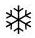
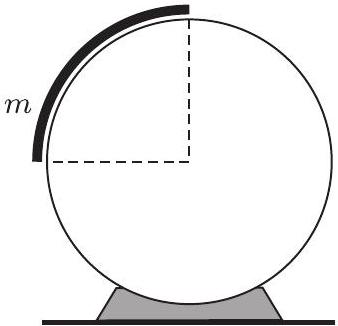
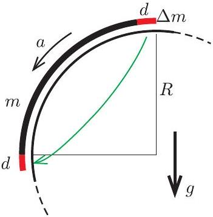
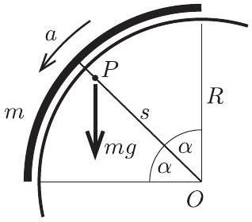
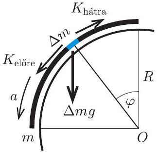
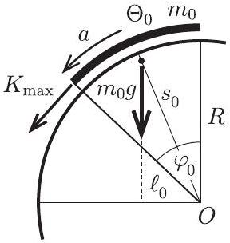
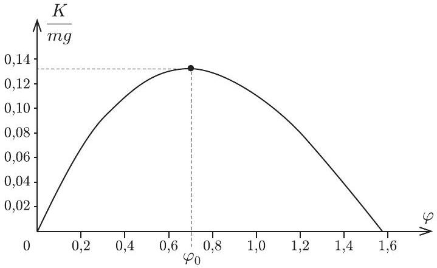
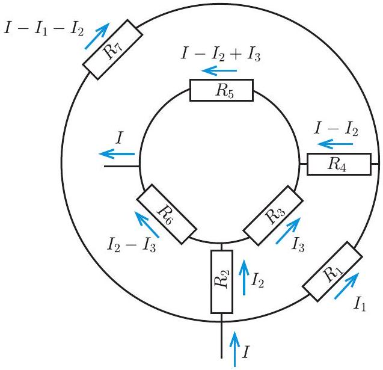
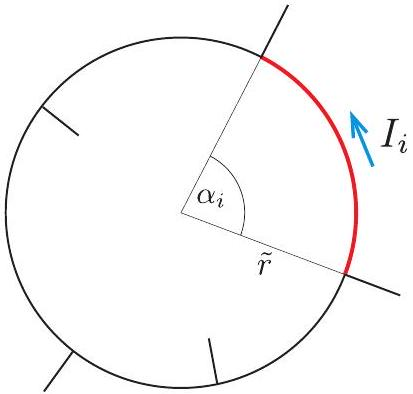

## Beszámoló a 2022. évi Eötvös-versenyről

Az Eötvös Loránd Fizikai Társulat 2022. évi Eötvös-versenye október 14-én délután 3 órai kezdettel tíz magyarországi helyszínen ${ } ^ { 1 }$ került megrendezésre. Ezért külön köszönettel tartozunk mindazoknak, akik ebben szervezéssel, felügyelettel a segítségünkre voltak. A versenyen a három feladat megoldására 300 perc áll rendelkezésre, bármely írott vagy nyomtatott segédeszköz használható, de (nem programozható) zsebszámológépen kívül minden elektronikus eszköz használata tilos. Az Eötvös-versenyen azok vehetnek részt, akik vagy középiskolai tanulók, vagy a verseny évében fejezték be középiskolai tanulmányaikat. Összesen 60 versenyző adott be dolgozatot, 21 egyetemista és 39 középiskolás.

Ismertetjük a feladatokat és azok megoldását.

1. feladat. Vízszintes tengelyű, rögzített hengerre egy vékony, hajlékony, m tömegü láncot helyezünk az ábrán látható módon, és nyugalomban tartjuk. A henger és a lánc közötti súrlódás elhanyagolható.
a) Mekkora gyorsulással indul el a lánc, ha szabadon engedjük?
b) Mekkora a láncot feszítő erő legnagyobb értéke az elengedés utáni pillanatban?

(Gelencsér Jenő)

Megoldás. a) Számítsuk ki a lánc gyorsulását az indulás pillanatában. Ezt többféle módszerrel is megtehetjük.
I. módszer. Ha a lánc a gyorsulással indul, akkor egy nagyon rövid $t$ időtartam alatt az elmozdulása $d = \frac { a } { 2 } t ^ { 2 }$, a sebessége pedig $v = a t$ lesz. Alkalmazzuk a mechanikai energiamegmaradás törvényét erre a mozgásra (1. ábra).

A lánc mozgási energiája (annak megváltozása)

$$
\Delta E _ { \text {mozgási } } = \frac { 1 } { 2 } m v ^ { 2 } = \frac { 1 } { 2 } m a ^ { 2 } t ^ { 2 } .
$$

1. ábra

A helyzeti energia változását legegyszerűbben úgy kaphatjuk meg, hogy gondolatban levágunk a lánc felső végéről egy $d$ hosszúságú darabot, és azt a lánc alsó

[^0]
végéhez „ragasztjuk”. Ennek a darabkának a tömege

$$
\Delta m = \frac { m } { \frac { 1 } { 2 } R \pi } d ,
$$

és mivel $R$ távolsággal mélyebbre kerül,

$$
\Delta E _ { \text {helyzeti } } = - \Delta m g R = - \frac { 2 m g } { \pi } d = - \frac { m g } { \pi } a t ^ { 2 } .
$$

Az energiamegmaradás tétele szerint

$$
\Delta E _ { \text {mozgási } } + \Delta E _ { \text {helyzeti } } = 0 ,
$$

ahonnan

$$
\frac { 1 } { 2 } m a t ^ { 2 } \left( a - \frac { 2 } { \pi } g \right) = 0
$$

Mivel $m a t ^ { 2 } \neq 0$, a keresett gyorsulás:

$$
a = \frac { 2 } { \pi } g .
$$

2. ábra

II. módszer. Ismert (vagy táblázatokban megtalálható), hogy az $R$ sugarú, $2 \alpha$ nyílásszögű homogén körív $P$ tömegközéppontja a kör $O$ középponttól

$$
s = \frac { \sin \alpha } { \alpha } R
$$

távolságra van (2. ábra). Esetünkben $\alpha = \pi / 4$, így

$$
s = \frac { \sqrt { 8 } } { \pi } R \approx 0,9 R .
$$

Az éppen meginduló láncot tekinthetjük merev testnek, amelynek az $O$ pontra vonatkoztatott tehetetlenségi nyomatéka $\Theta = m R ^ { 2 }$. A láncra (merev testre) ható külső erők forgatónyomatéka csak a nehézségi erőből származik, nagysága

$$
M = m g s \sin \frac { \pi } { 4 } = m g R \frac { \sqrt { 8 } } { \pi } \frac { \sqrt { 2 } } { 2 } = \frac { 2 } { \pi } m g R .
$$

(A láncra hatnak még a henger által kifejtett, helyről helyre változó kényszererők is, ezen erők azonban - súrlódásmentes esetben - mindenhol sugárirányúak, tehát az $O$ pontra vonatkoztatott forgatónyomatékuk nulla.)

A forgómozgás alaptörvénye szerint a test szöggyorsulása

$$
\beta = \frac { M } { \Theta } = \frac { 2 } { \pi } \frac { m g R } { m R ^ { 2 } } = \frac { 2 } { \pi } \frac { g } { R } ,
$$

a lánc „kerületi” gyorsulása pedig

$$
a = R \beta = \frac { 2 } { \pi } g .
$$

b) A láncot feszítő $K$ erő a lánc végeinél nulla, közöttük pedig valahol maximuma van. Ezt a helyet, valamint a maximális feszítőerő nagyságát keressük. A lánc egyegy kicsiny, $\varphi$ szöggel jellemezhető helyen lévő darabkájára ható nehézségi erő önmagában (éppen úgy, mint egy $\varphi$ hajlásszögű lejtőn) $g \sin \varphi$ gyorsulást hozna létre, ami a lánc felső részén kisebb, az aljának közelében nagyobb, mint az egész lánc a gyorsulása (3. ábra).

Emiatt a felső részeken a láncszemekre ható feszítő-

3. ábra

erők különbsége általában nullától különböző, hiszen egy $\Delta m$ tömegü, kicsiny láncdarabka mozgásegyenlete

$$
K _ { \text {elöre } } - K _ { \text {hátra } } + \Delta m g \sin \varphi = \Delta m a = \Delta m g \frac { 2 } { \pi } ,
$$

vagyis

$$
K _ { \text {elöre } } = K _ { \text {hátra } } + \Delta m \cdot g \left( \frac { 2 } { \pi } - \sin \varphi \right) \text {. }
$$

Látható, hogy a lánc felső végétől ( $\varphi = 0$ helytől) elindulva mindaddig, amíg

$$
\sin \varphi < \frac { 2 } { \pi } , \quad \text { addig } \quad K _ { \text {elöre } } > K _ { \text {hátra } } ,
$$

vagyis a $K ( \varphi )$ kényszererő (a láncot feszítő erő) $\varphi$ növekvő függvénye. Ha viszont

$$
\sin \varphi > \frac { 2 } { \pi } , \quad \text { akkor } \quad K _ { \text {előre } } < K _ { \text {hátra } } ,
$$

tehát ebben a tartományban a $K ( \varphi )$ kényszererő $\varphi$ csökkenő függvénye. Ezek szerint a kényszererő

$$
\varphi _ { 0 } = \arcsin \frac { 2 } { \pi } \approx 0,69 \text { radián } \approx 39,5 ^ { \circ }
$$

szögnél a legnagyobb. Itt

$$
K _ { \text {elöre } } = K _ { \text {hátra } } = K _ { \max } .
$$

Kérdés, hogy mekkora $K _ { \text {max } }$ értéke. Ezt a lánc felső $\left( \varphi \leqslant \varphi _ { 0 } \right.$ szögekkel jellemzett) darabjának forgási mozgásegyenletéből kaphatjuk meg (4. ábra).

A kérdéses láncdarab tömege

4. ábra

$$
m _ { 0 } = \frac { m } { \frac { 1 } { 2 } \pi } \varphi _ { 0 }
$$

a tehetetlenségi nyomatéka

$$
\Theta _ { 0 } = m _ { 0 } R ^ { 2 } ,
$$

tömegközéppontjának az $O$ ponttól mért távolsága

$$
s _ { 0 } = \frac { \sin \left( \frac { 1 } { 2 } \varphi _ { 0 } \right) } { \frac { 1 } { 2 } \varphi _ { 0 } } R
$$

és a tömegközéppont távolsága az $O$ ponton átmenő függőleges egyenestől

$$
\ell _ { 0 } = s _ { 0 } \sin \left( \frac { 1 } { 2 } \varphi _ { 0 } \right) .
$$

A forgómozgás alapegyenlete szerint

$$
K _ { \max } R + m _ { 0 } g \ell _ { 0 } = \Theta _ { 0 } \frac { a } { R } ,
$$

ahonnan a fentebb kiszámított értékek behelyettesítése után kapjuk, hogy

$$
K _ { \max } = m g \left( \frac { 4 } { \pi ^ { 2 } } \varphi _ { 0 } - \frac { 4 } { \pi } \sin ^ { 2 } \frac { \varphi _ { 0 } } { 2 } \right) \approx 0,13 m g .
$$

Ugyanezt az eredményt megkaphatjuk a munkatételből is, ha felírjuk, hogy egy nagyon rövid időtartam alatt a nehézségi erő munkájának és a $K$ kényszererő munkájának összege a kezdetben álló láncdarab mozgási energiájával lesz egyenlő.

A láncot feszítő erőt a fentiek mintájára tetszőleges pontban (tetszőleges $\varphi$ szögre) kiszámíthatjuk:

$$
K ( \varphi ) = m g \left( \frac { 4 } { \pi ^ { 2 } } \varphi - \frac { 4 } { \pi } \sin ^ { 2 } \frac { \varphi } { 2 } \right) ,
$$

és ábrázolhatjuk is (5. ábra).

5. ábra

2. feladat. Egy téglatest alakú gáztartályt egy kétrétegű, finom szövésű fémháló oszt két részre; a két térrész térfogatának aránya $1 : 2$. A fémháló két rétege a közöttük lévö, igen keskeny rés miatt nem ér össze. A tartályban egyszeresen pozitív töltésű ionokból álló gáz található. A hőmérsékletet mindkét térrészben állandó, 1200 K értéken tartjuk. Milyen polaritású és mekkora egyenfeszültséget kell

kapcsolni a fémháló rétegei közé ahhoz, hogy hosszú idő után a két térrészben található ionok száma megegyezzen? (A gáz elég ritka ahhoz, hogy a részecskék közötti kölcsönhatás elhanyagolható legyen, az átlagos szabad úthossz pedig jóval nagyobb a fémháló rétegeinek távolságánál. Az ionok töltése állandó.)
(Vigh Máté)
I. megoldás. Ez a gondolatmenet a kinetikus gázelméleten alapul. Elöljáróban összefoglalunk néhány fontosabb tudnivalót, amit a megoldás során fel fogunk használni ${ } ^ { 2 }$.

Ismert, hogy adott $T$ hőmérsékletű gázban a részecskék sebességének egy adott (például $x$ ) irányba eső vetülete nem mutat egyenletes eloszlást: kisebb sebességértékek előfordulása gyakoribb, míg a nagy értékek kevésbé valószínűek. Ezt az előfordulási gyakoriságot az $f \left( v _ { x } \right)$ Maxwell-Boltzmann-féle eloszlásfüggvénnyel lehet jellemezni, amely megadja, hogy a részecskék mekkora hányada rendelkezik egy adott $\left( v _ { x } , v _ { x } + \mathrm { d } v _ { x } \right)$ intervallumba eső sebességkomponenssel:

$$
\frac { \text { a } \left( v _ { x } , v _ { x } + \mathrm { d } v _ { x } \right) \text { tartománynak megfelelő részecskék száma } } { \text { összes részecske száma } } = f \left( v _ { x } \right) \mathrm { d } v _ { x } .
$$

Ebből a meghatározásból következik, hogy az $f \left( v _ { x } \right)$ függvény görbe alatti területe tetszőleges (tehát nem csak infinitezimálisan kicsiny) sebességintervallumon megadja az abba a tartományba eső részecskék számának arányát a teljes részecskeszámhoz viszonyítva (lásd a 6. ábrát). Ennek értelmében az $f \left( v _ { x } \right)$ eloszlásfüggvény teljes görbe alatti területe szükségszerűen 1 (más szóval a függvény normált).

Az $f \left( v _ { x } \right)$ függvény alakját egy $\mathcal { C }$ normálá-

6. ábra

$$
f \left( v _ { x } \right) = \mathcal { C } \mathrm { e } ^ { - \frac { m v _ { x } ^ { 2 } } { 2 k T } } ,
$$

amelyet normáleloszlásnak vagy Gauss-eloszlásnak neveznek.
Ezután térjünk rá a konkrét feladat megoldására. A koordináta-rendszerünk $x$ tengelyét válasszuk a fémháló síkjára merőlegesen, a kisebb térrész felől a nagyobb felé mutató irányban. A kisebb térrészre vonatkozó fizikai mennyiségeket jelöljük 1-es indexszel, míg a nagyobb térrészhez tartozó mennyiségeket 2-es indexszel.

Ha a fémháló két rétege közé nem kapcsolunk feszültséget, a gáz egyenletesen tölti ki az egész tartályt, azaz a két térrészben a részecskeszám-sűrűség $( n )$ megegyezik, az ionok számának aránya pedig a térfogatok arányával egyezik meg. A kívánt végállapotban azonban a két térrész részecskeszáma egyenlő, így a részecskeszámsűrűségek viszonya:

$$
n _ { 1 } = 2 n _ { 2 } .
$$

[^1]
Ez az inhomogén elrendeződés olyan polaritású elektromos térrel tartható fenn, amelyben a térerősség akadályozza a pozitív töltésű ionok áramlását a kisebb térrészből a nagyobb térrész irányába. A síkkondenzátornak tekinthető fémhálónak tehát a kisebb térrész felőli oldala lesz negatív töltésű, a nagyobb térrész felé eső oldala pedig pozitív polaritású.

A feladat szövege szerint a részecskék átlagos szabad úthossza jóval nagyobb a fémháló rétegeinek távolságánál, ezért a „kondenzátor” belsejében az ionok egymással nem (pontosabban elhanyagolhatóan kis eséllyel) ütköznek, kizárólag az itt uralkodó elektromos mező hatása alatt állnak. A nagyobb térrészből a fémháló rétegei közé belépő ionok az elektromos tér hatására felgyorsulnak, majd a kisebb térrészbe érve az ott lévő részecskékkel ütközve termalizálódnak. Ebben az irányban tehát az ionok akadály nélkül áthaladnak a hálón. A kisebb térrész felől belépő ionok azonban csak akkor tudnak áthaladni a fémhálón, ha az $x$ irányú sebességkomponensük nagyobb egy bizonyos $v ^ { * }$ értéknél, ellenkező esetben az elektromos tér visszafordítja őket. Az ilyen irányú áthaladáshoz szükséges határsebességet a munkatételből kaphatjuk meg:

$$
- e U = 0 - \frac { 1 } { 2 } m v ^ { * 2 } \quad \longrightarrow \quad v ^ { * } = \sqrt { \frac { 2 e U } { m } } ,
$$

ahol $e$ az elemi töltés, $U$ pedig a fémhálóra kapcsolt feszültség. Itt is igaz, hogy a $v _ { x } > v ^ { * }$ feltételt teljesítő ionok a nagyobb térrészbe érve termalizálódnak. Hogy pontosan mekkora az a $v ^ { * }$ sebesség (és mekkora az ehhez tartozó $U$ feszültség), amelynél a két térfélben a részecskék száma azonos marad, azt vizsgáljuk meg részletesebben!

Tekintsük a kisebb térrészben lévő részecskék közül azokat, melyeknek $x$ irányú sebességkomponense a rács felé mutat és a $\left( v _ { x } , v _ { x } + \mathrm { d } v _ { x } \right)$ tartományba esik. Ezek az ionok az eloszlásfüggvény definíciója alapján $n _ { 1 } f \left( v _ { x } \right) \mathrm { d } v _ { x }$ térfogati sűrűségben helyezkednek el a kisebb térrészben. Kicsiny $\Delta t$ időtartam alatt a részecskék ezen csoportjából csak azok az ionok érnek el a fémhálóig, melyek legfeljebb $v _ { x } \Delta t$ távolságra vannak attól. A fémháló teljes $A$ területére tehát $\Delta t$ idő alatt a megadott sebességtartományban

$$
n _ { 1 } f \left( v _ { x } \right) \mathrm { d } v _ { x } \cdot A v _ { x } \Delta t
$$

7. ábra

számú ion érkezik be a kisebbik térrész felől. A fémhálóra kapcsolt feszültség miatt csak a $v _ { x } > v ^ { * }$ feltételt teljesítő részecskék jutnak át a nagyobb térrészbe (7. ábra), ezért az átjutó ionok számát a sebesség szerinti integrálként a következőképp fejezhetjük ki:

$$
\Delta N _ { 1 } = \int _ { v ^ { * } } ^ { \infty } n _ { 1 } f \left( v _ { x } \right) \cdot A v _ { x } \Delta t \mathrm {~d} v _ { x }
$$

Ha ezt a mennyiséget elosztjuk az $A$ területtel és a $\Delta t$ időtartammal, akkor megkapjuk a kisebb térrészből a nagyobb térrészbe belépő részecskeáram-sűrűséget:

$$
j _ { 1 } = \frac { \Delta N _ { 1 } } { A \Delta t } = n _ { 1 } \int _ { v ^ { * } } ^ { \infty } f \left( v _ { x } \right) v _ { x } \mathrm {~d} v _ { x }
$$

Teljesen hasonlóan számolhatjuk ki a nagyobb térrészből a kisebbe átlépő részecskék áramsűrűségét, azzal a különbséggel, hogy ilyen irányban minden olyan részecske átjut a fémhálón, amelynek $x$ irányú sebességkomponense negatív:

$$
j _ { 2 } = n _ { 2 } \int _ { - \infty } ^ { 0 } f \left( v _ { x } \right) v _ { x } \mathrm {~d} v _ { x } .
$$

Látható, hogy $j _ { 2 }$ negatív, hiszen a negatív $x$ tengely irányába történő részecskeáramlást ír le. Allandósult állapotban (lásd a 8. ábrát) a nagyobb térrészbe belépő és onnan kilépő részecskék áramsűrűségének előjeles összege zérus:

$$
j _ { 1 } + j _ { 2 } = 0 .
$$

8. ábra

Felhasználva $f \left( v _ { x } \right)$ korábban felírt alakját:

$$
n _ { 1 } \int _ { v ^ { * } } ^ { \infty } \mathcal { C } \mathrm { e } ^ { - \frac { m v _ { x } ^ { 2 } } { 2 k T } } v _ { x } \mathrm {~d} v _ { x } + n _ { 2 } \int _ { - \infty } ^ { 0 } \mathcal { C } \mathrm { e } ^ { - \frac { m v _ { x } ^ { 2 } } { 2 k T } } v _ { x } \mathrm {~d} v _ { x } = 0
$$

Az integrálok kiszámításához érdemes áttérni a $w = m v _ { x } ^ { 2 } / ( 2 k T )$ változóra. Ennek segítségével

$$
\mathrm { d } w = \frac { m } { k T } v _ { x } \mathrm {~d} v _ { x } ,
$$

így a fenti egyenlet egyszerűsítések és az integrálási határok megváltoztatása után így írható:

$$
n _ { 1 } \int _ { \frac { e U } { k T } } ^ { \infty } \mathrm { e } ^ { - w } \mathrm {~d} w + n _ { 2 } \int _ { \infty } ^ { 0 } \mathrm { e } ^ { - w } \mathrm {~d} w = 0
$$

Az integrálokat most már elvégezhetjük:

$$
n _ { 1 } \left[ - \mathrm { e } ^ { - w } \right] _ { \frac { e U } { k T } } ^ { \infty } + n _ { 2 } \left[ - \mathrm { e } ^ { - w } \right] _ { \infty } ^ { 0 } = 0 .
$$

A primitív függvényeket a határokon kiértékelve kapjuk:

$$
n _ { 1 } \mathrm { e } ^ { - \frac { e U } { k T } } - n _ { 2 } = 0 ,
$$

ahonnan a keresett $U$ feszültség:

$$
U = \frac { k T } { e } \ln \left( \frac { n _ { 1 } } { n _ { 2 } } \right) = \frac { k T } { e } \ln 2 \approx 72 \mathrm { mV } .
$$

Megjegyzés. Voltak versenyzők, akik a fizikai jelenséget részletesen átlátták, az áramsűrűségekre felírt integrálokat azonban nem számolták ki, ehelyett észszerű becsléseket végeztek. A Versenybizottság ezeket a közelítéseket is értékelte.
II. megoldás. Az állandósult állapot kialakulása után a kisebb térrészben kétszer akkora lesz a nyomás, mint a nagyobb térrészben, hiszen a hőmérséklet és részecskeszám ugyanakkora, a térfogatok aránya viszont 1 : 2:

$$
p _ { 1 } = 2 p _ { 2 } .
$$

Végezzük el a következő gondolatkísérletet. A kisebb térrészben vegyünk körbe $\Delta N$ számú iont egy könnyü ballonnal, ahol $\Delta N$ sokkal kisebb a teljes gázmennyiség részecskeszámánál. Jelölje a ballon kezdeti térfo-

9. ábra

gatát $\Delta V _ { 1 }$. Vigyük át gondolatban ezt a ballont a másik térrészbe, majd engedjük ott izotermikusan kitágulni akkora $\Delta V _ { 2 }$ térfogatig, ameddig a bezárt gáz nyomása $p _ { 1 }$ értékről $p _ { 2 }$-re csökken (9. ábra). Számítsuk ki, mekkora munkát kell vé-
geznünk a folyamat közben!

Amikor a $\Delta V _ { 1 }$ térfogatú ballont a kisebb térrészből eltávolítjuk, a térrészben lévő $p _ { 1 }$ nyomású gáz igyekszik a ballont „kilökni” onnan. Ennek megakadályozására nekünk negatív,

$$
W _ { 1 } = - p _ { 1 } \Delta V _ { 1 }
$$

munkát kell végeznünk. Ezután a fémháló elektromos mezőjén a térerősséggel ellentétes irányban kell elmozdítani az $e \Delta N$ össztöltésű gázmennyiséget, ez további

$$
W _ { 2 } = e \Delta N \cdot U
$$

munkát igényel. Amikor a ballont izotermikusan kitágítjuk a végső $\Delta V _ { 2 }$ térfogatra, az általunk végzett munka negatív, értéke

$$
W _ { 3 } = - \Delta N k T \ln \frac { \Delta V _ { 2 } } { \Delta V _ { 1 } } .
$$

Nem szabad megfeledkeznünk arról sem, hogy a nagyobb térrészben $\Delta V _ { 2 }$ térfogatú helyet kell szorítani az oda átvitt gázmennyiségnek, ehhez

$$
W _ { 4 } = p _ { 2 } \Delta V _ { 2 }
$$

munka szükséges. A képzeletbeli folyamat során tehát összesen

$$
W _ { \text {teljes } } = - p _ { 1 } \Delta V _ { 1 } + e \Delta N \cdot U - \Delta N k T \ln \frac { \Delta V _ { 2 } } { \Delta V _ { 1 } } + p _ { 2 } \Delta V _ { 2 }
$$

munkát végeztünk. Vegyük észre, hogy az első és az utolsó tag kiejti egymást, hiszen az ideális gázok állapotegyenlete szerint

$$
p _ { 1 } \Delta V _ { 1 } = \Delta N k T , \quad p _ { 2 } \Delta V _ { 2 } = \Delta N k T .
$$

Szintén ebből következik, hogy a ballon végső és kezdeti térfogatának aránya kifejezhető a nyomások arányával:

$$
\frac { \Delta V _ { 2 } } { \Delta V _ { 1 } } = \frac { p _ { 1 } } { p _ { 2 } } .
$$

A teljes munkavégzés tehát így írható:

$$
W _ { \text {teljes } } = e \Delta N \cdot U - \Delta N k T \ln \frac { p _ { 1 } } { p _ { 2 } } .
$$

Ha ez a munka negatív lenne, akkor a folyamat magától végbemenne, azaz a kis gázmennyiség átjutna a kisebb térrészből a nagyobb térrészbe. Ellenkező esetben, ha a munka előjele pozitív lenne, a folyamat az ellentétes irányban menne végbe spontán módon. Mivel stacionárius állapotban egyik sem történik meg, $W _ { \text {teljes } }$ szükségképpen zérus:

$$
e \Delta N \cdot U - \Delta N k T \ln \frac { p _ { 1 } } { p _ { 2 } } = 0 .
$$

A mozgatott gázmennyiség $\Delta N$ részecskeszámával leoszthatunk, majd közvetlenül megkapjuk az

$$
U = \frac { k T } { e } \ln \left( \frac { p _ { 1 } } { p _ { 2 } } \right) = \frac { k T } { e } \ln 2
$$

eredményt, amely megegyezik az I. megoldás eredményével.
III. megoldás. Vegyük észre, hogy a megoldás, amit kaptunk, átrendezhető a következő alakba:

$$
\frac { n _ { 2 } } { n _ { 1 } } = \frac { p _ { 2 } } { p _ { 1 } } = \mathrm { e } ^ { - \frac { e U } { k T } } = \mathrm { e } ^ { - \frac { \Delta E } { k T } } ,
$$

ahol $\Delta E$ a két térrész közötti (elektrosztatikus) potenciális energia különbsége. Ugyanerre az eredményre jutunk, ha átrendezzük a jól ismert „barometrikus magasságformula" képletét:

$$
\frac { p _ { 2 } } { p _ { 1 } } = \mathrm { e } ^ { - \frac { \varrho g \Delta h } { p _ { 1 } } } = \mathrm { e } ^ { - \frac { m g \Delta h } { k T } } = \mathrm { e } ^ { - \frac { \Delta E } { k T } } ,
$$

ahol $\varrho$ a gáz sűrűsége, $g$ a nehézségi gyorsulás, $\Delta h$ a magasságkülönbség, $m$ a részecskék tömege, és $\Delta E$ itt is a két helyzet közötti (gravitációs) potenciális energia különbsége.

Ha nem a „nagy szabad úthossz" közelítését vizsgálnánk, a két fémháló között a nyomás ugyanúgy változna, mint a „barometrikus magasságformula” izotermikus légoszlopában. Az $m g$ nehézségi erő helyére az $e E$ elektromos erő kerülne.

Mindkét esetben megjelenik az $\mathrm { e } ^ { - \frac { \Delta E } { k T } }$ Boltzmann-tényező. Ennek magyarázata az, hogy a gázrészecskéket energetikai szempontból jellemző $\left( v _ { x } , v _ { y } , v _ { z } \right)$ sebességkomponensek mellett a feladatbeli rendszerben megjelenik még egy „szabadsági fok” is: az, hogy a részecske melyik térfélben helyezkedik el. A nagyobb (2-es számú) térrészben az ionok potenciális energiája $\Delta E = e U$ értékkel magasabb, mint a kisebb (1-es számú) térrészben, ezért az ionok megtalálási valószínűség-sűrűségének (vagy az azzal arányos részecskesűrűségek) aránya $e ^ { - \frac { e U } { k T } }$.

Ezzel a gondolatmenettel a megoldás - megfelelő indoklással - egyetlen sorban megkapható.

3. feladat. Egyenletes vastagságú ellenálláshuzalból $r$ és $2 r$ sugarú karikákat készítünk, és azokat egy síkban, koncentrikusan helyezzük el. A karikákat két helyen, ugyanabból az ellenálláshuzalból készült, sugárirányú „küllőkkel” kötjük össze, az ábrán látható módon. Az elrendezés $A$ pontjánál (sugárirányban) I erősségű áramot vezetünk be, a $B$ pontjából pedig (szintén sugárirányban) elvezetjük azt. Mekkora a mágneses indukcióvektor nagysága a karikák $O$ középpontjában?
(Cserti József)
I. megoldás. A feladat megoldása során először a Kirchhoff-törvények segítségével meghatározzuk az egyes vezetékekben folyó áramokat, majd kiszámoljuk az ezek által keltett mágneses teret a karikák közös $O$ középpontjában.

Jelölje $R$ az $r$ hosszúságú vezetékdarab ellenállását! Így az egyes körívek, illetve a küllők ellenállása, az ábrán megadott jelöléseket használva, az alábbiak szerint adódik: $R _ { 1 } = \pi R , R _ { 2 } = R _ { 4 } = R , R _ { 3 } = R _ { 6 } = \frac { \pi } { 2 } R , R _ { 5 } = \pi R , R _ { 7 } = 3 \pi R$.
$\mathrm { Az } A$ pontban bevezetünk, a $B$ pontban kivezetünk $I$ áramot. Az egyes vezetékdarabokon folyó áramokat a 10. ábra alapján vesszük fel, ahol már kielégítettük a Kirchhoff-féle csomóponti törvényeket, azaz bármely csomópontra a bemenő és kimenő áramok összege megegyezik. Láthatjuk, hogy összesen három ismeretlen paraméterünk van: $I _ { 1 } , I _ { 2 }$ és $I _ { 3 }$, melyeket a huroktörvényekből határozhatunk meg. Írjuk fel a huroktörvényeket a külső karikára, a belső karikára, valamint a jobb alsó

10. ábra

negyed körgyürü határára:

$$
\begin{gather*}
R _ { 1 } I _ { 1 } - R _ { 7 } \left( I - I _ { 1 } - I _ { 2 } \right) = 0 \quad \rightarrow \quad \pi R \left[ I _ { 1 } - 3 \left( I - I _ { 1 } - I _ { 2 } \right) \right] = 0 ,  \tag{1}\\
R _ { 3 } I _ { 3 } + R _ { 5 } \left( I - I _ { 2 } + I _ { 3 } \right) - R _ { 6 } \left( I _ { 2 } - I _ { 3 } \right) = 0 ,
\end{gather*}
$$

amiből

$$
\begin{equation*}
\frac { \pi R } { 2 } \left[ I _ { 3 } + 2 \left( I - I _ { 2 } + I _ { 3 } \right) - \left( I _ { 2 } - I _ { 3 } \right) \right] = 0 , \tag{2}
\end{equation*}
$$

adódik, és végül

$$
\begin{equation*}
R _ { 2 } I _ { 2 } + R _ { 3 } I _ { 3 } - R _ { 4 } \left( I - I _ { 2 } \right) - R _ { 1 } I _ { 1 } = R \left[ I _ { 2 } + \frac { \pi } { 2 } I _ { 3 } - \left( I - I _ { 2 } \right) - \pi I _ { 1 } \right] = 0 . \tag{3}
\end{equation*}
$$

Az ismeretlen paraméterek ( $I _ { 1 } , I _ { 2 }$ és $I _ { 3 }$ ) egy háromismeretlenes, lineáris egyenletrendszer megoldásaként adódnak. Tényleg szükség van ezek kiszámolására? Próbáljuk megoldani a feladatot enélkül!

A sugárirányú bevezetések, kivezetések és küllők a Biot-Savart törvény értelmében nem adnak járulékot a középpontban mért mágneses tér értékéhez. A mágneses indukció nagysága egy $r$ sugarú, $I$ áramjárta körvezető középpontjában $B = \frac { \mu _ { 0 } } { 2 } \frac { I } { r }$. Ha csak egy $\alpha$ középponti szöggel leírható körív járulékát tekintjük a középpontban, az $B = \frac { \mu _ { 0 } \alpha } { 4 \pi } \frac { I } { r }$ alakban adódik. Ezek alapján már kiszámíthatjuk a külső, majd a belső karika által keltett mágneses teret. A külső karika esetén:

$$
B = \frac { \mu _ { 0 } } { 8 } \frac { I _ { 1 } } { 2 r } - \frac { 3 \mu _ { 0 } } { 8 } \frac { I - I _ { 1 } - I _ { 2 } } { 2 r } = \frac { \mu _ { 0 } } { 16 r } \left[ I _ { 1 } - 3 \left( I - I _ { 1 } - I _ { 2 } \right) \right] = 0 ,
$$

azaz a mágneses indukció értéke nulla a középpontban. A levezetés utolsó lépésében felhasználtuk az (1) egyenletet. A belső karika esetében:

$$
B = \frac { \mu _ { 0 } } { 8 } \frac { I _ { 3 } } { r } + \frac { 2 \mu _ { 0 } } { 8 } \frac { I - I _ { 2 } + I _ { 3 } } { r } - \frac { \mu _ { 0 } } { 8 } \frac { I _ { 2 } - I _ { 3 } } { r } = \frac { \mu _ { 0 } } { 8 r } \left[ I _ { 3 } + 2 \left( I - I _ { 2 } + I _ { 3 } \right) - \left( I _ { 2 } - I _ { 3 } \right) \right] = 0 ,
$$

itt is nullának adódik a mágneses indukció nagysága. Az utolsó lépésben a (2) egyenletet használtuk fel. Összegezve, a teljes rendszer esetében is nulla a mágneses indukcióvektor a középpontban. Mi a mélyebb fizikai oka ennek az eredménynek? Nézzük át a probléma általánosított megoldását!

11. ábra

II. (általános) megoldás. A felrajzolt 11. ábra csak sugárirányú küllőkből és koncentrikus karikákból áll. A sugárirányú szakaszok által keltett mágneses tér a középpontban nulla. Tekintsünk egy $\tilde { r }$ sugarú karikát, melyet a befutó sugárirányú vezetékek körívekre bontanak. Az $i$. körív középponti szöge legyen $\alpha _ { i }$, hossza $\ell _ { i }$, rajta átfolyó áram $I _ { i }$, ellenállása $R _ { i }$, ezen ellenálláson eső feszültség $U _ { i }$.

Az $i$. körív által keltett mágneses tér a középpontban

$$
B _ { i } = \frac { \mu _ { 0 } \alpha _ { i } } { 4 \pi } \frac { I _ { i } } { \tilde { r } } = \frac { \mu _ { 0 } } { 4 \pi } \frac { \ell _ { i } I _ { i } } { \tilde { r } ^ { 2 } } = \frac { \mu _ { 0 } } { 4 \pi } \frac { r R _ { i } I _ { i } } { R \tilde { r } ^ { 2 } } = \frac { \mu _ { 0 } } { 4 \pi } \frac { r U _ { i } } { R \tilde { r } ^ { 2 } } ,
$$

ami arányos a köríven eső feszültséggel. Összegezve az összes körív járulékát:

$$
B = \sum _ { i } B _ { i } = \frac { \mu _ { 0 } } { 4 \pi } \frac { r } { R \tilde { r } ^ { 2 } } \sum _ { i } U _ { i } = 0 .
$$

A huroktörvény alapján a feszültségesések összege a zárt karikára nulla, így a karika által keltett mágneses tér is nulla a középpontban. Az általános megoldás alapján akárhány koncentrikus kör és sugárirányú vezetékből összeállított elrendezés esetén nulla a mágneses tér a középpontban.

Az ünnepélyes eredményhirdetésre és díjkiosztásra 2022. november 25-én délután került sor az ELTE TTK Konferenciatermében. Meghívást kaptak az 50 és 25 évvel ezelőtti Eötvös-verseny nyertesei is. A 25 évvel ezelőtti díjazottak közül Egri Győző, Koncz Imre és Várkonyi Péter jöttek el - ők pár mondatban beszéltek a pályafutásukról.

Ezután következett a 2022. évi verseny feladatainak és megoldásainak bemutatása. Az 1. feladat megoldását Gnädig Péter, a 2. feladatét Vankó Péter, a 3. feladatét Széchenyi Gábor ismertette.

Az esemény végén került sor az eredményhirdetésre. A díjakat Ormos Pál, az Eötvös Loránd Fizikai Társulat elnöke adta át.

Mindhárom feladat helyes megoldásáért első díjat nyert Kovács Balázs Csaba, az ELTE fizika BSc szakos hallgatója, aki a Hatvani Bajza József Gimnáziumban érettségizett Maruzsiné Sevella Judit tanítványaként.

Az első feladat helyes, valamint a második és harmadik feladat lényegében helyes megoldásáért második díjat nyert Kincses Ábel, a BME fizika BSc szakos hallgatója, aki a Deák téri Evangélikus Gimnáziumban érettségizett Horváth Gabriella és Szőkéné Mezősi Tímea tanítványaként.

Az első és a harmadik feladat helyes megoldásáért harmadik díjat nyert Gurzó József, az ELTE fizika BSc szakos hallgatója, aki a Budapesti Fazekas Mihály Gyakorló Általános Iskola és Gimnáziumban érettségizett Nagy Piroska Mária tanítványaként.

A harmadik feladat helyes, valamint az első vagy a második feladat lényegében helyes megoldásáért kiemelt dicséretet kapott Bognár András Károly, a Budapesti Fazekas Mihály Gyakorló Általános Iskola és Gimnázium 12. osztályos tanulója, Nagy Piroska Mária tanítványa; Csonka Illés, a Ciszteri Rend Nagy Lajos Gimnáziuma 11. osztályos tanulója, Jéhn János és Pálfalvi László tanítványa; valamint Hajós Balázs, az ELTE Apáczai Csere János Gyakorló Gimnázium és Kollégium 12. osztályos tanulója, Gyertyán Attila tanítványa.

Az első vagy a harmadik feladat helyes, vagy a második feladat lényegében helyes megoldásáért dicséretet kapott Bencz Benedek, a Baár-Madas Református Gimnázium, Általános Iskola és Diákotthon 10. osztályos tanulója, Horváth Norbert tanítványa; Blázsik Árpád, az ELTE fizika BSc szakos hallgatója, aki a Békásmegyeri Veres Péter Gimnáziumban érettségizett Rakovszki Andorás és Székely György tanítványaként; Gábriel Tamás, a Budapesti Fazekas Mihály Gyakorló Altalános Iskola és Gimnázium 12. osztályos tanulója, Nagy Piroska Mária tanítványa; Halász Henrik Kristóf, a Szegedi Radnóti Miklós Kísérleti Gimnázium 12. osztályos tanulója, Gutai Árpád és Csányi Sándor tanítványa; Horváth Ákos Zsolt, a BME fizika BSc szakos hallgatója, aki a Kempelen Farkas Gimnáziumban érettségizett Bakosné Novák Andrea és Horváth Eszter tanítványaként; Kohut Márk Balázs, a Kecskeméti Katona József Gimnázium 12. osztályos tanulója, Sáróné Jéga-Szabó Irén tanítványa, Köpenczei Csanád, a Bonyhádi Petőfi Sándor Evangélikus Gimnázium és Kollégium 12. osztályos tanulója, Wiandt Péter tanítványa; Molnár Barnabás, a Budapesti Fazekas Mihály Gyakorló Általános Iskola és Gimnázium 12. osztályos tanulója, Nagy Piroska Mária tanítványa; Molnár-Szabó Vilmos, a Budapesti Fazekas Mihály Gyakorló Általános Iskola és Gimnázium 12. osztályos tanulója, Nagy Piroska Mária tanítványa; Schäffer Donát, a Pécsi Janus Pannonius Gimnázium 11. osztályos tanulója, Lehőcz Mária és Lányi Veronika tanítványa; valamint Toronyi András, az ELTE fizika BSc szakos hallgatója, aki a Baár-Madas Református Gimnázium, Általános Iskola és Diákotthonban érettségizett Horváth Norbert tanítványaként.

Az első díjjal a verseny plakettjén kívül az Andersen Adótanácsadó Zrt. és a Nanorobot Vagyonkezelő Kft. adományából 80 ezer forint, a második díjjal 65 ezer, a harmadik díjjal 50 ezer, a kiemelt dicsérettel 30 ezer, a dicsérettel 15 ezer forint pénzjutalom járt. A díjazottak tanárai könyveket kaptak az Eötvös Loránd Fizikai Társulat ajándékaként. Köszönjük az adományozók önzetlen támogatását!

Gnädig Péter, Széchenyi Gábor, Vankó Péter, Vigh Máté

[^0]:    ${ } ^ { 1 }$ Részletek a verseny honlapján: http://eik.bme.hu/~vanko/fizika/eotvos.htm

[^1]:    ${ } ^ { 2 }$ Az Eötvös-versenyen bármely nyomtatott szakirodalom szabadon használható.
