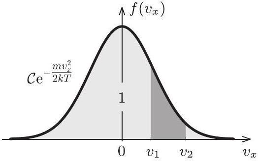
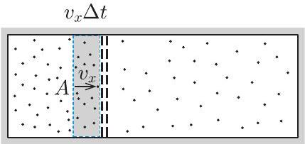
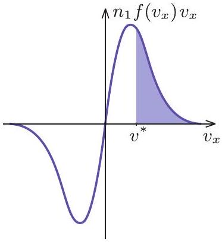
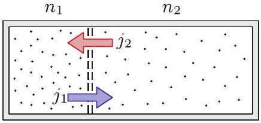
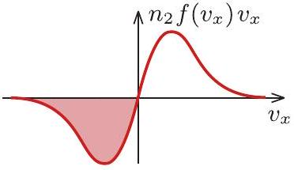
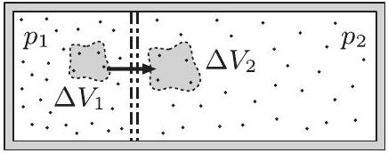
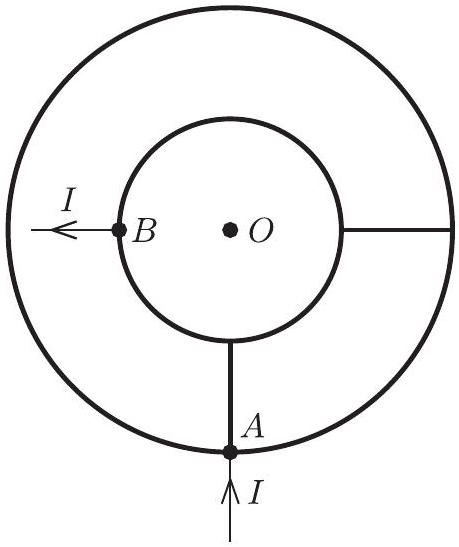

2. feladat. Egy téglatest alakú gáztartályt egy kétrétegű, finom szövésű fémháló oszt két részre; a két térrész térfogatának aránya $1 : 2$. A fémháló két rétege a közöttük lévö, igen keskeny rés miatt nem ér össze. A tartályban egyszeresen pozitív töltésű ionokból álló gáz található. A hőmérsékletet mindkét térrészben állandó, 1200 K értéken tartjuk. Milyen polaritású és mekkora egyenfeszültséget kell

kapcsolni a fémháló rétegei közé ahhoz, hogy hosszú idő után a két térrészben található ionok száma megegyezzen? (A gáz elég ritka ahhoz, hogy a részecskék közötti kölcsönhatás elhanyagolható legyen, az átlagos szabad úthossz pedig jóval nagyobb a fémháló rétegeinek távolságánál. Az ionok töltése állandó.)
(Vigh Máté)
I. megoldás. Ez a gondolatmenet a kinetikus gázelméleten alapul. Elöljáróban összefoglalunk néhány fontosabb tudnivalót, amit a megoldás során fel fogunk használni ${ } ^ { 2 }$.

Ismert, hogy adott $T$ hőmérsékletű gázban a részecskék sebességének egy adott (például $x$ ) irányba eső vetülete nem mutat egyenletes eloszlást: kisebb sebességértékek előfordulása gyakoribb, míg a nagy értékek kevésbé valószínűek. Ezt az előfordulási gyakoriságot az $f \left( v _ { x } \right)$ Maxwell-Boltzmann-féle eloszlásfüggvénnyel lehet jellemezni, amely megadja, hogy a részecskék mekkora hányada rendelkezik egy adott $\left( v _ { x } , v _ { x } + \mathrm { d } v _ { x } \right)$ intervallumba eső sebességkomponenssel:

$$
\frac { \text { a } \left( v _ { x } , v _ { x } + \mathrm { d } v _ { x } \right) \text { tartománynak megfelelő részecskék száma } } { \text { összes részecske száma } } = f \left( v _ { x } \right) \mathrm { d } v _ { x } .
$$

Ebből a meghatározásból következik, hogy az $f \left( v _ { x } \right)$ függvény görbe alatti területe tetszőleges (tehát nem csak infinitezimálisan kicsiny) sebességintervallumon megadja az abba a tartományba eső részecskék számának arányát a teljes részecskeszámhoz viszonyítva (lásd a 6. ábrát). Ennek értelmében az $f \left( v _ { x } \right)$ eloszlásfüggvény teljes görbe alatti területe szükségszerűen 1 (más szóval a függvény normált).

Az $f \left( v _ { x } \right)$ függvény alakját egy $\mathcal { C }$ normálá-

6. ábra

$$
f \left( v _ { x } \right) = \mathcal { C } \mathrm { e } ^ { - \frac { m v _ { x } ^ { 2 } } { 2 k T } } ,
$$

amelyet normáleloszlásnak vagy Gauss-eloszlásnak neveznek.
Ezután térjünk rá a konkrét feladat megoldására. A koordináta-rendszerünk $x$ tengelyét válasszuk a fémháló síkjára merőlegesen, a kisebb térrész felől a nagyobb felé mutató irányban. A kisebb térrészre vonatkozó fizikai mennyiségeket jelöljük 1-es indexszel, míg a nagyobb térrészhez tartozó mennyiségeket 2-es indexszel.

Ha a fémháló két rétege közé nem kapcsolunk feszültséget, a gáz egyenletesen tölti ki az egész tartályt, azaz a két térrészben a részecskeszám-sűrűség $( n )$ megegyezik, az ionok számának aránya pedig a térfogatok arányával egyezik meg. A kívánt végállapotban azonban a két térrész részecskeszáma egyenlő, így a részecskeszámsűrűségek viszonya:

$$
n _ { 1 } = 2 n _ { 2 } .
$$

[^1]
Ez az inhomogén elrendeződés olyan polaritású elektromos térrel tartható fenn, amelyben a térerősség akadályozza a pozitív töltésű ionok áramlását a kisebb térrészből a nagyobb térrész irányába. A síkkondenzátornak tekinthető fémhálónak tehát a kisebb térrész felőli oldala lesz negatív töltésű, a nagyobb térrész felé eső oldala pedig pozitív polaritású.

A feladat szövege szerint a részecskék átlagos szabad úthossza jóval nagyobb a fémháló rétegeinek távolságánál, ezért a „kondenzátor” belsejében az ionok egymással nem (pontosabban elhanyagolhatóan kis eséllyel) ütköznek, kizárólag az itt uralkodó elektromos mező hatása alatt állnak. A nagyobb térrészből a fémháló rétegei közé belépő ionok az elektromos tér hatására felgyorsulnak, majd a kisebb térrészbe érve az ott lévő részecskékkel ütközve termalizálódnak. Ebben az irányban tehát az ionok akadály nélkül áthaladnak a hálón. A kisebb térrész felől belépő ionok azonban csak akkor tudnak áthaladni a fémhálón, ha az $x$ irányú sebességkomponensük nagyobb egy bizonyos $v ^ { * }$ értéknél, ellenkező esetben az elektromos tér visszafordítja őket. Az ilyen irányú áthaladáshoz szükséges határsebességet a munkatételből kaphatjuk meg:

$$
- e U = 0 - \frac { 1 } { 2 } m v ^ { * 2 } \quad \longrightarrow \quad v ^ { * } = \sqrt { \frac { 2 e U } { m } } ,
$$

ahol $e$ az elemi töltés, $U$ pedig a fémhálóra kapcsolt feszültség. Itt is igaz, hogy a $v _ { x } > v ^ { * }$ feltételt teljesítő ionok a nagyobb térrészbe érve termalizálódnak. Hogy pontosan mekkora az a $v ^ { * }$ sebesség (és mekkora az ehhez tartozó $U$ feszültség), amelynél a két térfélben a részecskék száma azonos marad, azt vizsgáljuk meg részletesebben!

Tekintsük a kisebb térrészben lévő részecskék közül azokat, melyeknek $x$ irányú sebességkomponense a rács felé mutat és a $\left( v _ { x } , v _ { x } + \mathrm { d } v _ { x } \right)$ tartományba esik. Ezek az ionok az eloszlásfüggvény definíciója alapján $n _ { 1 } f \left( v _ { x } \right) \mathrm { d } v _ { x }$ térfogati sűrűségben helyezkednek el a kisebb térrészben. Kicsiny $\Delta t$ időtartam alatt a részecskék ezen csoportjából csak azok az ionok érnek el a fémhálóig, melyek legfeljebb $v _ { x } \Delta t$ távolságra vannak attól. A fémháló teljes $A$ területére tehát $\Delta t$ idő alatt a megadott sebességtartományban

$$
n _ { 1 } f \left( v _ { x } \right) \mathrm { d } v _ { x } \cdot A v _ { x } \Delta t
$$

7. ábra

számú ion érkezik be a kisebbik térrész felől. A fémhálóra kapcsolt feszültség miatt csak a $v _ { x } > v ^ { * }$ feltételt teljesítő részecskék jutnak át a nagyobb térrészbe (7. ábra), ezért az átjutó ionok számát a sebesség szerinti integrálként a következőképp fejezhetjük ki:

$$
\Delta N _ { 1 } = \int _ { v ^ { * } } ^ { \infty } n _ { 1 } f \left( v _ { x } \right) \cdot A v _ { x } \Delta t \mathrm {~d} v _ { x }
$$

Ha ezt a mennyiséget elosztjuk az $A$ területtel és a $\Delta t$ időtartammal, akkor megkapjuk a kisebb térrészből a nagyobb térrészbe belépő részecskeáram-sűrűséget:

$$
j _ { 1 } = \frac { \Delta N _ { 1 } } { A \Delta t } = n _ { 1 } \int _ { v ^ { * } } ^ { \infty } f \left( v _ { x } \right) v _ { x } \mathrm {~d} v _ { x }
$$

Teljesen hasonlóan számolhatjuk ki a nagyobb térrészből a kisebbe átlépő részecskék áramsűrűségét, azzal a különbséggel, hogy ilyen irányban minden olyan részecske átjut a fémhálón, amelynek $x$ irányú sebességkomponense negatív:

$$
j _ { 2 } = n _ { 2 } \int _ { - \infty } ^ { 0 } f \left( v _ { x } \right) v _ { x } \mathrm {~d} v _ { x } .
$$

Látható, hogy $j _ { 2 }$ negatív, hiszen a negatív $x$ tengely irányába történő részecskeáramlást ír le. Allandósult állapotban (lásd a 8. ábrát) a nagyobb térrészbe belépő és onnan kilépő részecskék áramsűrűségének előjeles összege zérus:

$$
j _ { 1 } + j _ { 2 } = 0 .
$$

8. ábra

Felhasználva $f \left( v _ { x } \right)$ korábban felírt alakját:

$$
n _ { 1 } \int _ { v ^ { * } } ^ { \infty } \mathcal { C } \mathrm { e } ^ { - \frac { m v _ { x } ^ { 2 } } { 2 k T } } v _ { x } \mathrm {~d} v _ { x } + n _ { 2 } \int _ { - \infty } ^ { 0 } \mathcal { C } \mathrm { e } ^ { - \frac { m v _ { x } ^ { 2 } } { 2 k T } } v _ { x } \mathrm {~d} v _ { x } = 0
$$

Az integrálok kiszámításához érdemes áttérni a $w = m v _ { x } ^ { 2 } / ( 2 k T )$ változóra. Ennek segítségével

$$
\mathrm { d } w = \frac { m } { k T } v _ { x } \mathrm {~d} v _ { x } ,
$$

így a fenti egyenlet egyszerűsítések és az integrálási határok megváltoztatása után így írható:

$$
n _ { 1 } \int _ { \frac { e U } { k T } } ^ { \infty } \mathrm { e } ^ { - w } \mathrm {~d} w + n _ { 2 } \int _ { \infty } ^ { 0 } \mathrm { e } ^ { - w } \mathrm {~d} w = 0
$$

Az integrálokat most már elvégezhetjük:

$$
n _ { 1 } \left[ - \mathrm { e } ^ { - w } \right] _ { \frac { e U } { k T } } ^ { \infty } + n _ { 2 } \left[ - \mathrm { e } ^ { - w } \right] _ { \infty } ^ { 0 } = 0 .
$$

A primitív függvényeket a határokon kiértékelve kapjuk:

$$
n _ { 1 } \mathrm { e } ^ { - \frac { e U } { k T } } - n _ { 2 } = 0 ,
$$

ahonnan a keresett $U$ feszültség:

$$
U = \frac { k T } { e } \ln \left( \frac { n _ { 1 } } { n _ { 2 } } \right) = \frac { k T } { e } \ln 2 \approx 72 \mathrm { mV } .
$$

Megjegyzés. Voltak versenyzők, akik a fizikai jelenséget részletesen átlátták, az áramsűrűségekre felírt integrálokat azonban nem számolták ki, ehelyett észszerű becsléseket végeztek. A Versenybizottság ezeket a közelítéseket is értékelte.
II. megoldás. Az állandósult állapot kialakulása után a kisebb térrészben kétszer akkora lesz a nyomás, mint a nagyobb térrészben, hiszen a hőmérséklet és részecskeszám ugyanakkora, a térfogatok aránya viszont 1 : 2:

$$
p _ { 1 } = 2 p _ { 2 } .
$$

Végezzük el a következő gondolatkísérletet. A kisebb térrészben vegyünk körbe $\Delta N$ számú iont egy könnyü ballonnal, ahol $\Delta N$ sokkal kisebb a teljes gázmennyiség részecskeszámánál. Jelölje a ballon kezdeti térfo-

9. ábra

gatát $\Delta V _ { 1 }$. Vigyük át gondolatban ezt a ballont a másik térrészbe, majd engedjük ott izotermikusan kitágulni akkora $\Delta V _ { 2 }$ térfogatig, ameddig a bezárt gáz nyomása $p _ { 1 }$ értékről $p _ { 2 }$-re csökken (9. ábra). Számítsuk ki, mekkora munkát kell vé-
geznünk a folyamat közben!

Amikor a $\Delta V _ { 1 }$ térfogatú ballont a kisebb térrészből eltávolítjuk, a térrészben lévő $p _ { 1 }$ nyomású gáz igyekszik a ballont „kilökni” onnan. Ennek megakadályozására nekünk negatív,

$$
W _ { 1 } = - p _ { 1 } \Delta V _ { 1 }
$$

munkát kell végeznünk. Ezután a fémháló elektromos mezőjén a térerősséggel ellentétes irányban kell elmozdítani az $e \Delta N$ össztöltésű gázmennyiséget, ez további

$$
W _ { 2 } = e \Delta N \cdot U
$$

munkát igényel. Amikor a ballont izotermikusan kitágítjuk a végső $\Delta V _ { 2 }$ térfogatra, az általunk végzett munka negatív, értéke

$$
W _ { 3 } = - \Delta N k T \ln \frac { \Delta V _ { 2 } } { \Delta V _ { 1 } } .
$$

Nem szabad megfeledkeznünk arról sem, hogy a nagyobb térrészben $\Delta V _ { 2 }$ térfogatú helyet kell szorítani az oda átvitt gázmennyiségnek, ehhez

$$
W _ { 4 } = p _ { 2 } \Delta V _ { 2 }
$$

munka szükséges. A képzeletbeli folyamat során tehát összesen

$$
W _ { \text {teljes } } = - p _ { 1 } \Delta V _ { 1 } + e \Delta N \cdot U - \Delta N k T \ln \frac { \Delta V _ { 2 } } { \Delta V _ { 1 } } + p _ { 2 } \Delta V _ { 2 }
$$

munkát végeztünk. Vegyük észre, hogy az első és az utolsó tag kiejti egymást, hiszen az ideális gázok állapotegyenlete szerint

$$
p _ { 1 } \Delta V _ { 1 } = \Delta N k T , \quad p _ { 2 } \Delta V _ { 2 } = \Delta N k T .
$$

Szintén ebből következik, hogy a ballon végső és kezdeti térfogatának aránya kifejezhető a nyomások arányával:

$$
\frac { \Delta V _ { 2 } } { \Delta V _ { 1 } } = \frac { p _ { 1 } } { p _ { 2 } } .
$$

A teljes munkavégzés tehát így írható:

$$
W _ { \text {teljes } } = e \Delta N \cdot U - \Delta N k T \ln \frac { p _ { 1 } } { p _ { 2 } } .
$$

Ha ez a munka negatív lenne, akkor a folyamat magától végbemenne, azaz a kis gázmennyiség átjutna a kisebb térrészből a nagyobb térrészbe. Ellenkező esetben, ha a munka előjele pozitív lenne, a folyamat az ellentétes irányban menne végbe spontán módon. Mivel stacionárius állapotban egyik sem történik meg, $W _ { \text {teljes } }$ szükségképpen zérus:

$$
e \Delta N \cdot U - \Delta N k T \ln \frac { p _ { 1 } } { p _ { 2 } } = 0 .
$$

A mozgatott gázmennyiség $\Delta N$ részecskeszámával leoszthatunk, majd közvetlenül megkapjuk az

$$
U = \frac { k T } { e } \ln \left( \frac { p _ { 1 } } { p _ { 2 } } \right) = \frac { k T } { e } \ln 2
$$

eredményt, amely megegyezik az I. megoldás eredményével.
III. megoldás. Vegyük észre, hogy a megoldás, amit kaptunk, átrendezhető a következő alakba:

$$
\frac { n _ { 2 } } { n _ { 1 } } = \frac { p _ { 2 } } { p _ { 1 } } = \mathrm { e } ^ { - \frac { e U } { k T } } = \mathrm { e } ^ { - \frac { \Delta E } { k T } } ,
$$

ahol $\Delta E$ a két térrész közötti (elektrosztatikus) potenciális energia különbsége. Ugyanerre az eredményre jutunk, ha átrendezzük a jól ismert „barometrikus magasságformula" képletét:

$$
\frac { p _ { 2 } } { p _ { 1 } } = \mathrm { e } ^ { - \frac { \varrho g \Delta h } { p _ { 1 } } } = \mathrm { e } ^ { - \frac { m g \Delta h } { k T } } = \mathrm { e } ^ { - \frac { \Delta E } { k T } } ,
$$

ahol $\varrho$ a gáz sűrűsége, $g$ a nehézségi gyorsulás, $\Delta h$ a magasságkülönbség, $m$ a részecskék tömege, és $\Delta E$ itt is a két helyzet közötti (gravitációs) potenciális energia különbsége.

Ha nem a „nagy szabad úthossz" közelítését vizsgálnánk, a két fémháló között a nyomás ugyanúgy változna, mint a „barometrikus magasságformula” izotermikus légoszlopában. Az $m g$ nehézségi erő helyére az $e E$ elektromos erő kerülne.

Mindkét esetben megjelenik az $\mathrm { e } ^ { - \frac { \Delta E } { k T } }$ Boltzmann-tényező. Ennek magyarázata az, hogy a gázrészecskéket energetikai szempontból jellemző $\left( v _ { x } , v _ { y } , v _ { z } \right)$ sebességkomponensek mellett a feladatbeli rendszerben megjelenik még egy „szabadsági fok” is: az, hogy a részecske melyik térfélben helyezkedik el. A nagyobb (2-es számú) térrészben az ionok potenciális energiája $\Delta E = e U$ értékkel magasabb, mint a kisebb (1-es számú) térrészben, ezért az ionok megtalálási valószínűség-sűrűségének (vagy az azzal arányos részecskesűrűségek) aránya $e ^ { - \frac { e U } { k T } }$.

Ezzel a gondolatmenettel a megoldás - megfelelő indoklással - egyetlen sorban megkapható.

