## Beszámoló a 2023. évi Eötvös-versenyről

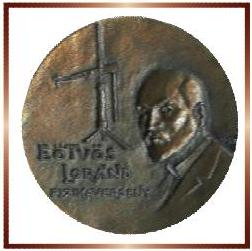

Az Eötvös Loránd Fizikai Társulat 2023. évi Eötvös-versenye október 13-án délután 3 órai kezdettel tíz magyarországi helyszínen ${ } ^ { 3 }$ került megrendezésre. Ezért külön köszönettel tartozunk mindazoknak, akik ebben szervezéssel, felügyelettel a segítségünkre voltak. A versenyen a három feladat megoldására 300 perc áll rendelkezésre, bármely írott vagy nyomtatott segédeszköz használható, de (nem programozható) zsebszámológépen kívül minden elektronikus eszköz használata tilos. Az Eötvös-versenyen azok vehetnek részt, akik vagy középiskolai tanulók, vagy a verseny évében fejezték be középiskolai tanulmányaikat. Összesen 64 versenyző adott be dolgozatot, 16 egyetemista és 48 középiskolás.

Ismertetjük a feladatokat és azok megoldását.

1. A Vénusz 2023. szeptember 12-én 2 óra 20 perccel a Nap előtt kelt fel, szinte egyszerre a Holddal. A Hold ekkor egy vékony C alakot formázott, a Vénuszt viszont szabad szemmel egy fényes „csillag”-nak, pontszerünek láthattuk.
a) Milyen alakúnak láttuk volna ezen a hajnalon a Vénuszt távcsővel, ha tudjuk, hogy másnap néhány perccel hamarabb kelt fel a Naphoz viszonyítva? Mekkora volt a fázisa (a korong hányad része volt látható)?
b) Hogyan változik a Vénusz alakja és látszólagos mérete az ezt következő hónapokban? Mikor fog legközelebb újra 2 óra 20 perccel a Nap előtt kelni? Ábrázoljuk méretarányosan a szeptemberben, valamint a kérdéses időpontban látható Vénuszt!

Az egyszerüség kedvéért a pályák excentricitását és ferdeségét, valamint a Föld tengelyferdeségét ne vegyük figyelembe. (A megadott adatok is ennek megfelelően módosítottak a valósághoz képest, és az eredményt is ebben a közelítésben keressük.) A Vénusz pályasugara 0,723-szerese a Földének.
(Vankó Péter)
Megoldás. Vizsgáljuk a bolygók mozgását a Föld keringésével együtt forgó vonatkoztatási rendszerben. Készítsünk vázlatot a bolygókról. Az 1. ábrán a Nap és a Föld középpontja áll, a Vénusz (egy később meghatározandó relatív szögsebességgel) kering a Nap körül, a Föld pedig 24 óránként körbefordul a tengelye körül.
a) A feladat szövege szerint a Vénusz 2 óra 20 perccel (2,33 órával) kel a Nap előtt. Mivel a Föld óránként $360 ^ { \circ } / 24 = 15 ^ { \circ }$-ot fordul el a tengelye körül, ez azt jelenti, hogy a Vénusz a Földről $\varphi = 2,33 \cdot 15 ^ { \circ } = 35 ^ { \circ }$-os szögben látszik a Naphoz képest.

[^0]
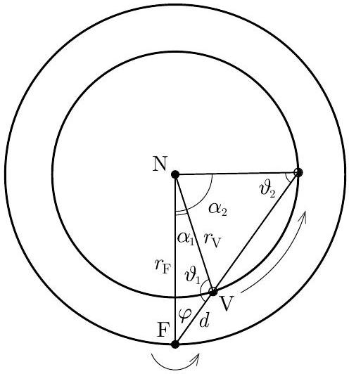
1. ábra

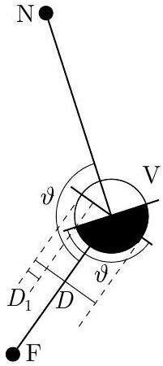
2. ábra

Látható, hogy ehhez a Vénusz két lehetséges helyzete tartozik, amelyeket az $\alpha _ { 1 }$, illetve az $\alpha _ { 2 }$ Föld-Nap-Vénusz szög jellemez. A feladat szövege szerint a Vénusz másnap néhány perccel korábban kel a Naphoz képest, ami azt jelenti, hogy $\varphi$ növekedni fog. Ez az 1-es helyzetben valósul meg.

Már az 1. ábra alapján is láthatjuk, hogy ekkor a Vénusz a Holdhoz hasonlóan vékony C alakú sarlónak látszik a távcsövön.

A fázist a 2. ábra alapján határozhatjuk meg. Könnyen belátható, hogy a korong megvilágított és teljes területének aránya megegyezik a $D _ { 1 } / D$ aránnyal, ugyanis a világos sarlót úgy kaphatjuk meg, ha gondolatban a sötét félkört a 2. ábra jobb oldalán bejelölt tengelye mentén összenyomjuk. Ez a transzformáció a tengelyirányú méreteket és a területet azonos arányban csökkenti. Eszerint a fázis

$$
f = \frac { D _ { 1 } } { D } = \frac { 1 + \cos \vartheta } { 2 } ,
$$

ahol $\vartheta$ a Nap-Vénusz-Föld szög. A szinusztétel alapján

$$
\frac { \sin \vartheta } { \sin \varphi } = \frac { r _ { \mathrm { F } } } { r _ { \mathrm { V } } } = \frac { 1 } { 0,723 } ,
$$

amiből

$$
\sin \vartheta = \frac { \sin \varphi } { 0,723 } = 0,793
$$

és $\vartheta _ { 1 } = 127,5 ^ { \circ }$. (Az ábra alapján a két lehetséges értékből ekkor a tompaszög a helyes.) Ebből a fázis

$$
f _ { 1 } = \frac { 1 + \cos \vartheta _ { 1 } } { 2 } \approx 0,20 .
$$

b) 2023. szeptember 12-én a Föld-Nap-Vénusz szög $\alpha _ { 1 } = 180 ^ { \circ } - \varphi - \vartheta _ { 1 } = 17,5 ^ { \circ }$. Az $\alpha$ szög ezután folyamatosan növekszik, és ezzel kezdetben $\varphi$ is növekszik, azaz a Vénusz a Naphoz viszonyítva egyre korábban kel. Ezzel együtt $\vartheta$ csökken, a fázis pedig folyamatosan növekszik. Ugyanakkor a $d$ Föld-Vénusz távolság folyamatosan nő, így a Vénusz látszólagos átmérője csökken.

A Vénusz akkor kel a Naphoz képest legkorábban, azaz $\varphi$ értéke akkor lesz maximális, amikor $\vartheta = 90 ^ { \circ }$ (és így a fázis 0,5 , azaz „félvénusz” látható).

Ezután $\varphi$ értéke már csökken, a Vénusz egyre kevesebb idővel kel a Nap előtt. Ugyanakkor $\vartheta$ értéke továbbra is csökken, a Vénusz fázisa pedig tovább növekszik, látszólagos átmérője viszont a növekvő távolság miatt tovább csökken.

A feladatban szereplő állapotot, amikor a Vénusz újra 2 óra 20 perccel kel a Nap előtt, az $\alpha _ { 2 }$ Föld-Nap-Vénusz szögnél érjük el. Ebben az esetben ismét $\varphi = 35 ^ { \circ } , \vartheta _ { 2 } = 180 ^ { \circ } - \vartheta _ { 1 } = 52,5 ^ { \circ } , \alpha _ { 2 } = 180 ^ { \circ } - \varphi - \vartheta _ { 2 } = 92,5 ^ { \circ }$. A Vénusz fázisa ekkor

$$
f _ { 2 } = \frac { 1 + \cos \vartheta _ { 2 } } { 2 } \approx 0,80 .
$$

Mikor fog ez bekövetkezni? A Vénusz sziderikus (csillagokhoz viszonyított) keringési ideje Kepler 3. törvénye alapján:

$$
T _ { \mathrm { V } } = \left( \frac { r _ { \mathrm { V } } } { r _ { \mathrm { F } } } \right) ^ { \frac { 3 } { 2 } } T _ { \mathrm { F } } = 224,5 \text { nap. }
$$

( $T _ { \mathrm { F } } = 365,25$ nap.) A szinodikus (Földhöz viszonyított) keringési ideje

$$
T _ { \mathrm { V } } ^ { \prime } = \left( \frac { 1 } { T _ { \mathrm { V } } } - \frac { 1 } { T _ { \mathrm { F } } } \right) ^ { - 1 } \approx 583 \text { nap } ,
$$

hiszen az általunk vizsgált koordináta-rendszerben a Vénusz keringésének szögsebessége $\Omega _ { \mathrm { V } } ^ { \prime } = \Omega _ { \mathrm { V } } - \Omega _ { \mathrm { F } }$.

A két vizsgált helyzet között $\Delta \alpha = \alpha _ { 2 } - \alpha _ { 1 } = 75 ^ { \circ }$-kal fordul el a Naptól a Vénuszhoz húzott sugár az általunk használt vonatkoztatási rendszerben. Ehhez

$$
t = \frac { \Delta \alpha } { 360 ^ { \circ } } T _ { \mathrm { V } } ^ { \prime } \approx 121 \mathrm { nap }
$$

időre van szükség. Eszerint a Vénusz - ebben a közelítésben számolva - legközelebb körülbelül négy hónappal később, 2024. január 11-én fog ismét 2 óra 20 perccel a Nap előtt kelni.

Vizsgáljuk a Vénusz látszólagos átmérőjét!
Legnagyobbnak Föld-közelben látnánk, ekkor $d _ { \text {min } } = r _ { \mathrm { F } } - r _ { \mathrm { V } } = 0,277 r _ { \mathrm { F } }$ (de ekkor persze „újvénusz" van, és a Vénusz a Nappal együtt kel, a Földről nem látható ${ } ^ { 4 ) }$ ). A változó Föld-Vénusz távolságot az 1. ábra szerint a szinusztétel alapján számolhatjuk ki:

$$
\frac { \sin \alpha } { \sin \vartheta } = \frac { d } { r _ { \mathrm { F } } } ,
$$

amiből

$$
d = \frac { \sin \alpha } { \sin \vartheta } r _ { \mathrm { F } } .
$$

[^1]
A Vénusz látszólagos $D$ átmérője fordítottan arányos a Föld-Vénusz távolsággal:

$$
D = \frac { d _ { \min } } { d } D _ { \max } .
$$

Ez alapján az 1-es és 2-es helyzetben

$$
D _ { 1 } = \frac { 0,277 \sin \vartheta _ { 1 } } { \sin \alpha _ { 1 } } D _ { \max } = 0,73 D _ { \max } ,
$$

illetve

$$
D _ { 2 } = \frac { 0,277 \sin \vartheta _ { 2 } } { \sin \alpha _ { 2 } } D _ { \max } = 0,22 D _ { \max } ,
$$

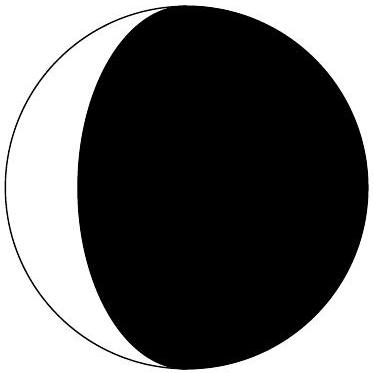
3. ábra

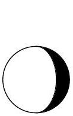

$$
\frac { D _ { 2 } } { D _ { 1 } } = 0,30 .
$$

A kiszámított fázisok és relatív látszólagos átmérők alapján a feladatban kért rajz a 3. ábrán látható.

Megjegyzés. A Föld tengelyferdesége és a Vénusz pályájának ekliptikához viszonyított dőlése miatt a valódi kelési idők jelentősen eltérnek az itteniektől, azonban a delelési idők közötti különbségek (amelyeket sokkal kevésbé befolyásolnak ezek a tényezők) a valóságban elfogadhatóan egyeznek az itt számoltakkal. A két bolygó pályájának excentricitása csak nagyon kis eltéréseket okoz.

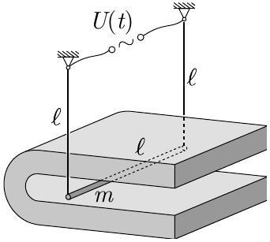
4. ábra

2. Egy $m = 50 g$ tömegü, $\ell = 20 c m$ hosszúságú fémrudat két, ugyancsak $\ell$ hosszúságú fémszállal vízszintes helyzetben felfüggesztünk. A rudat egy széles patkómágnes pólusai közé helyezzük, így a rúd teljes egészében $B = 0,50 T$ indukciójú, jó közelítéssel homogén mágneses mezőbe merül. A fémszálak és a rúd együttes elektromos ellenállása $r = 0,10 \Omega$. A fémszálak felső végei közé $U _ { 0 } = 10 m V$ amplitúdójú, $f = 1,0 H z$ frekvenciájú szinuszos váltófeszültséget kapcsolunk.

Hogyan mozog a rúd hosszabb idő után? A közegellenállást hanyagoljuk el!
(Vigh Máté)

Megoldás. Az ingán keresztül $I ( t )$ áram folyik, így mozgása közben a nehézségi erőn kívül az $F _ { \mathrm { L } } = B I \ell$ nagyságú Lorentz-erő is hat rá.

A forgómozgás alapegyenlete:

$$
m \ell ^ { 2 } \ddot { \varphi } = I B \ell ^ { 2 } \cos \varphi - m g \ell \sin \varphi ,
$$

ahol $m \ell ^ { 2 }$ az inga tehetetlenségi nyomatéka a forgástengelyre vonatkoztatva. Kis $\varphi$ szögkitérést feltételezve $\cos \varphi \approx 1$ és $\sin \varphi \approx \varphi$, ezt felhasználva:

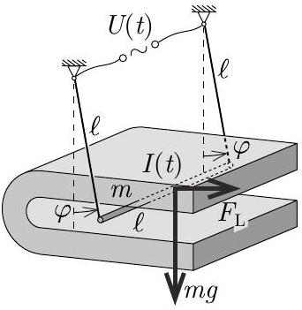
5. ábra

$$
I ( t ) = \frac { m } { B } \ddot { \varphi } + \frac { m g } { B \ell } \varphi .
$$

A mozgó rúdban a mágneses tér hatására $U _ { \mathrm { i } } ( t ) = B \ell ^ { 2 } \dot { \varphi }$ feszültség indukálódik. Az áramkörre a huroktörvényt felírva

$$
U ( t ) = r I ( t ) + U _ { \mathrm { i } } ( t ) ,
$$

és abba $I ( t )$ és $U _ { \mathrm { i } } ( t )$ kifejezését behelyettesítve az

$$
U ( t ) = \frac { m r } { B } \ddot { \varphi } + B \ell ^ { 2 } \dot { \varphi } + \frac { m g r } { B \ell } \varphi
$$

egyenletet kapjuk, ahol $U ( t ) = U _ { 0 } \sin ( \omega t )$ és $\omega = 2 \pi f$.
Ennek megoldására két lehetséges utat is ismertetünk.
I. megoldás. Felismerhetjük, hogy ez egy csillapított kényszerrezgés mozgásegyenlete:

$$
\ddot { \varphi } + \frac { B ^ { 2 } \ell ^ { 2 } } { m r } \dot { \varphi } + \frac { g } { \ell } \varphi = \frac { B U _ { 0 } } { m r } \sin ( \omega t ) ,
$$

amelynek állandósult megoldását

$$
\varphi ( t ) = \varphi _ { \max } \sin ( \omega t - \phi )
$$

alakban kereshetjük. Vezessük be a következő, kényszerrezgéseknél szokásosan alkalmazott jelöléseket:

$$
\frac { B ^ { 2 } \ell ^ { 2 } } { m r } = 2 \beta , \quad \frac { g } { \ell } = \omega _ { 0 } ^ { 2 } \quad \text { és } \quad \frac { B U _ { 0 } } { m r } = f _ { 0 } .
$$

A próbafüggvényt behelyettesítve a mozgásegyenletbe (vagy a megoldást az irodalomból kikeresve) adódik, hogy

$$
\varphi _ { \max } = \frac { f _ { 0 } } { \sqrt { \left( \omega _ { 0 } ^ { 2 } - \omega ^ { 2 } \right) ^ { 2 } + 4 \beta ^ { 2 } \omega ^ { 2 } } } = \frac { \frac { B U _ { 0 } } { m r } } { \sqrt { \left( \frac { g } { \ell } - \omega ^ { 2 } \right) ^ { 2 } + \frac { B ^ { 4 } \ell ^ { 4 } \omega ^ { 2 } } { m ^ { 2 } r ^ { 2 } } } } \approx 3,6 ^ { \circ } ,
$$

és

$$
\phi = \operatorname { arctg } \frac { 2 \beta \omega } { \omega _ { 0 } ^ { 2 } - \omega ^ { 2 } } = \operatorname { arctg } \frac { \frac { B ^ { 2 } \ell ^ { 2 } \omega } { m r } } { \frac { g } { \ell } - \omega ^ { 2 } } \approx 52,7 ^ { \circ } .
$$

Az inga tehát hosszabb idő után a rákapcsolt feszültséggel azonos, 1 Hz-es frekvenciával, de attól 52,7°-os fázissal lemaradva, 3,6°-os amplitúdóval leng.

A kitérés valóban kis szögű, így a közelítések jogosak voltak.
Bár a feladat nem kérdezte, a szögkitérés ismeretében érdekes meghatároznunk a rúdban folyó áramerősséget:

$$
\begin{aligned}
& I ( t ) = \frac { m } { B } \ddot { \varphi } + \frac { m g } { B \ell } \varphi = \frac { m } { B } \left( - \omega ^ { 2 } + \frac { g } { \ell } \right) \varphi _ { \max } \sin ( \omega t - \phi ) = \\
& = \frac { U _ { 0 } } { r } \frac { \frac { g } { \ell } - \omega ^ { 2 } } { \sqrt { \left( \frac { g } { \ell } - \omega ^ { 2 } \right) ^ { 2 } + \frac { B ^ { 4 } \ell ^ { 4 } \omega ^ { 2 } } { m ^ { 2 } r ^ { 2 } } } } \sin ( \omega t - \phi ) = I _ { 0 } \sin ( \omega t - \phi ) ,
\end{aligned}
$$

ahol $I _ { 0 } \approx 61 \mathrm {~mA}$.
Fontos megjegyezni, hogy (az indukált feszültség miatt)

$$
I ( t ) \neq \frac { U _ { 0 } \sin ( \omega t ) } { r } ,
$$

tehát az áramerősség nincs fázisban a rákapcsolt feszültséggel.
Ellenőrzésként kiszámolhatjuk a feszültségforrást terhelő (bemenő) és az ellenálláson disszipálódó teljesítményeket:

$$
P _ { \text {átl } } = \frac { U _ { 0 } I _ { 0 } \cos \phi } { 2 } = \frac { I _ { 0 } ^ { 2 } r } { 2 } \approx 18 \mathrm {~mW} .
$$

Ezek a várakozásunknak megfelelően egyenlők.
A 6., 7. és 8. ábrán a $\varphi _ { \text {max } }$ maximális szögkitérést, a $\phi$ fáziskülönbséget és az $I _ { 0 }$ maximális áramerősséget ábrázoltuk a gerjesztő frekvencia függvényében. Látható, hogy a feladatban szereplő gerjesztés a rezonanciához közeli (az inga sajátfrekvenciája $f _ { 0 } = \frac { 1 } { 2 \pi } \sqrt { \frac { g } { \ell } } \approx 1,1 \mathrm {~Hz}$ ).

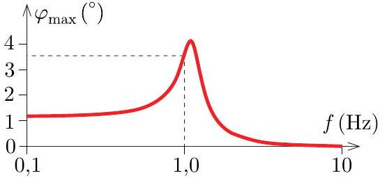
6. ábra

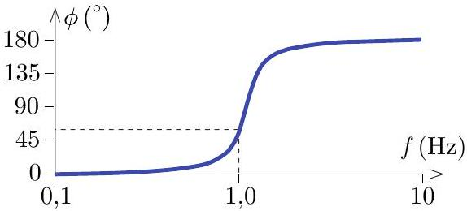
7. ábra

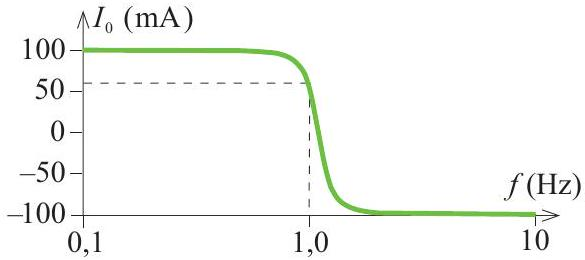
8. ábra

II. megoldás. Vessük össze a mozgásegyenletet a soros $R L C$-körre felírt huroktörvénnyel (a szokásos jelölésekkel):

$$
U ( t ) = L \ddot { Q } + R \dot { Q } + \frac { 1 } { C } Q .
$$

A két rendszer között tehát az alábbi megfeleltetés állítható fel:

$$
Q \rightarrow \varphi , \quad L \rightarrow \frac { m r } { B } , \quad R \rightarrow B \ell ^ { 2 } , \quad \frac { 1 } { C } \rightarrow \frac { m g r } { B \ell } .
$$

Az áramkörös analógiában ismert, hogy az áramerősség az idő függvényében $I ^ { \star } ( t ) = I _ { 0 } ^ { \star } \sin \left( \omega t - \phi ^ { \star } \right)$ módon változik, ahol az amplitúdó és a fázisszög:

$$
I _ { 0 } ^ { \star } = \frac { U _ { 0 } } { \sqrt { R ^ { 2 } + \left( L \omega - \frac { 1 } { C \omega } \right) ^ { 2 } } } ,
$$

és

$$
\phi ^ { \star } = \operatorname { arctg } \frac { L \omega - \frac { 1 } { C \omega } } { R } .
$$

A töltés az idő függvényében (vagy integrálással vagy a harmonikus rezgőmozgás analógiájával):

$$
Q ( t ) = - \frac { I _ { 0 } ^ { \star } } { \omega } \cos \left( \omega t - \phi ^ { \star } \right) .
$$

Megjegyzés. Az $I ^ { \star }$ és $\phi ^ { \star }$ jelöléseket azért használjuk, hogy megkülönböztessük az áramkörös analógiában szereplő és a valódi ingában folyó áramerősséget, valamint az analógiában az áram és a feszültség, illetve a valóságban az inga szögkitérése és a feszültség közötti fázisszögeket.

Az áramkörös hasonlatot felhasználva most már megadhatjuk a felfüggesztett rúd szögkitérését az idő függvényében:

$$
\varphi ( t ) = - \varphi _ { \max } \cos \left( \omega t - \phi ^ { \star } \right) = \varphi _ { \max } \sin ( \omega t - \phi ) ,
$$

ahol

$$
\varphi _ { \max } = \frac { I _ { 0 } ^ { \star } } { \omega } = \frac { \frac { U _ { 0 } } { \omega } } { \sqrt { B ^ { 2 } \ell ^ { 4 } + \left( \frac { m r \omega } { B } - \frac { m g r \omega } { B \ell } \right) ^ { 2 } } } \approx 3,6 ^ { \circ } ,
$$

és

$$
\phi = \phi ^ { \star } + 90 ^ { \circ } = \operatorname { arctg } \frac { \frac { m r \omega } { B } - \frac { m g r } { B \ell \omega } } { B \ell ^ { 2 } } + 90 ^ { \circ } = - 37,3 ^ { \circ } + 90 ^ { \circ } = 52,7 ^ { \circ } ,
$$

a korábbi eredményekkel egyezően.
3 Egy átlátszatlan lapon egyforma, kicsiny lyukak találhatóak szabályos négyzetrács elrendezésben. Ha a lapot monokromatikus, a rácsállandónál jóval nagyobb hullámhosszúságú lézerfénnyel merőlegesen megvilágítjuk, akkor a távoli ernyőn szabályos négyzetrács elrendezésű, $I _ { 0 }$ intenzitású fénypöttyöket láthatunk.

Hogyan változik meg az elhajlási kép, ha a lapon minden második sor minden második nyílását eltakarjuk az ábrán látható módon? Mekkora lesz az egyes fénypöttyök intenzitása?

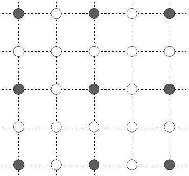
9. ábra

(Széchenyi Gábor)

Megoldás. Sajnálatos módon a feladat szövegében maradt egy hiba: a lézerfényről szóló „a rácsállandónál jóval nagyobb hullámhosszúságú" félmondat ellentmond annak, hogy a távoli ernyőn szabályos négyzetrács elrendezésű diffrakciós kép keletkezik. Helyesen „a rácsállandónál kisebb hullámhosszúságú"-t kellett volna írni (a nagyon kicsi hullámhossz esetén a diffrakciós ábra nagyon apró lenne, vagy nagyon messze kellene helyezni az ernyőt). A megoldásban, ahogy látni fogjuk, nincs szükség a hullámhosszra, ezért kerülhette el a hiba sokszori átolvasás után is a szemünket. Elnézést kérünk érte!

A Huygens-Fresnel-elv alapján a nyílások mindegyikéből azonos fázisú gömbhullámok indulnak ki. Az eredeti rács diffrakciós ábráján ott jelennek meg fénylő pontok, ahol a nyílásokból kiinduló gömbhullámok konstruktívan interferálnak. Ha a nyílások egynegyedét letakarjuk, akkor a korábbi fénylő pontok helyére csak háromnegyed annyi nyílásból érkeznek be a gömbhullámok, így a tér amplitúdója is háromnegyedére csökken. Az intenzitás az amplitúdónégyzettel arányos, így ezen fénypöttyök intenzitása $9 / 16 I _ { 0 }$ lesz. Továbbiakban azt a kérdést vizsgáljuk, hogy megjelennek-e további intenzitásmaximumok az ernyőn.

A feladatban szereplő hiányos rács (H rács) felfogható úgy mint az eredeti négyzetrács (E rács) és egy ritkább négyzetrács (R rács) különbsége. Mivel a diffrakciót leíró Maxwell-egyenletek lineárisak, így az E rács és R rács esetében kialakuló tér különbségének a H rács által keltett térrel kell megegyeznie. Érdemes megjegyezni, hogy ilyenkor a hullámok fázishelyes különbségét kell képezni, nem lehet közvetlenül az intenzitásokat kivonni.

Az E rács esetében a diffrakciós mintázatot ismerjük, ez négyzetrács elrendezésű fénypöttyök összessége. A diffrakciós ábra rácsállandója legyen $a$, a fénypöttyök helyén a tér amplitúdója pedig $A$.

Az R rács egy kétszer akkora rácsállandójú négyzetrács, így a megjelenő diffrakciós képet szintén négyzetrács elrendezésű fénypöttyök alkotják, de a rácsállandó $a / 2$, azaz a diffrakciós ábra sűrúbb, mint az eredeti esetben. (Ez az inverziós tulajdonság már a hagyományos optikai rácsnál is megmutatható. Ha az optikai rácsot kétszeresére megnyújtjuk, akkor a diffrakciós ábrát a felére kell összenyomni.) Az R rács esetében a fénypöttyök helyén a tér amplitúdója $A / 4$, mivel csak negyedannyi nyílás van az apertúrán, így a hullámok eredő amplitúdója 4-szer kisebb.

Következőkben az E és az R rács esetében kialakuló téreloszlások különbségét kell képezni. Azokban a pontokban, ahol az E és R rács esetében is nem nulla a tér, ott az első bekezdésben leírt gondolatmenetet megismételve $A - A / 4 = 3 / 4 A$ lesz az amplitúdó értéke, így az intenzitás $9 / 16 I _ { 0 }$-nak adódik. Azokban a pontokban,
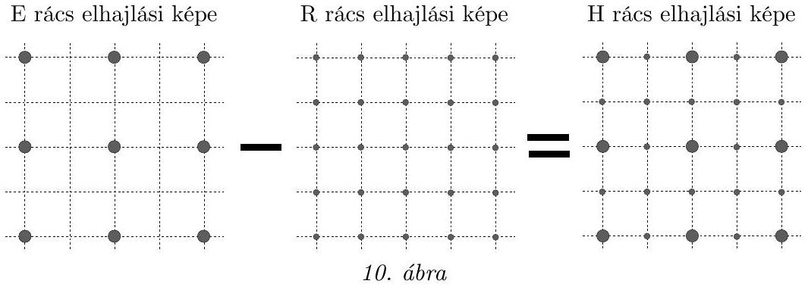

ahol csak az R rács esetében nem nulla a tér, ott a különbség $- A / 4$-nek adódik. A negatív előjel ara utal, hogy a H rács ezen a pontjaiban éppen ellentétes a fázis. Az intenzitás ismételten az amplitúdónégyzettel arányos, így ezekben a pontokban $1 / 16 I _ { 0 }$ intenzitású fénypöttyöket láthatunk.

A letakart rács elhajlási képe egy kétszer sűrübb négyzetrács, ahol az eredeti fénypöttyök helyén az intenzitás $9 / 16 I _ { 0 }$, az újonnan megjelenő pontok intenzitása pedig $1 / 16 I _ { 0 }$. A megoldás elsőre kissé meglepő. Letakartunk néhány pontot az apertúrán, melynek hatására nem eltűntek a pontok az elhajlási ábráról, hanem újabbak jelentek meg.

Ellenőrzésképpen számítsuk ki, hogyan változott meg az ernyőn mérhető összintenzitás a letakarás nyomán. Kezdetben $I _ { 0 }$ intenzitású fénypöttyeink voltak, melyek intenzitása lecsökkent $9 / 16 I _ { 0 }$-ra. Ellenben megjelentek kisebb intenzitású pontok is, minden nagy intenzitású pontra három kis intenzitású pont jut. Szebben megfogalmazva, a H rács elhajlási képének elemi cellájában egy $9 / 16 I _ { 0 }$ és három $1 / 16 I _ { 0 }$ fénypötty található. Az elemi cellában így az összintenzitás $3 / 4 I _ { 0 }$. Az ernyőn mérhető összintenzitás a 3/4-edére csökkent, ami megegyezik az előzetes elvárásunkkal, miszerint a nyílások 1/4-ét takartuk el, így a kezdeti esethez képest csak a fény intenzitásának 3/4-e jut át.

Az ünnepélyes eredményhirdetésre és díjkiosztásra 2023. november 24-én délután került sor az ELTE TTK Konferenciatermében. Megemlékeztünk az 50 és 25 évvel ezelőtti Eötvös-versenyről, ismertettük az akkori feladatokat és a győztesek nevét. Ezután következett a 2023. évi verseny feladatainak és megoldásainak bemutatása. Az 1. és 2. feladat megoldását Vankó Péter, a 3. feladatét Széchenyi Gábor ismertette.

Az esemény végén került sor az eredményhirdetésre. A díjakat Ormos Pál, az Eötvös Loránd Fizikai Társulat elnöke adta át.
I. díjat a versenybizottság nem adott ki.

A harmadik feladat helyes, valamint az első és második feladat hiányos megoldásáért második díjat nyert Fey Dávid, az ELTE fizika BSc szakos hallgatója, aki a Budapesti Fazekas Mihály Gyakorló Altalános Iskola és Gimnáziumban érettségizett Nagy Piroska Mária tanítványaként.

A második feladat helyes megoldásáért és a másik két feladatban elért részeredményekért, illetve az első feladat hiányos megoldásáért és a második feladatban elért részeredményekért harmadik díjat nyert Molnár Barnabás, az ELTE fizika BSc szakos hallgatója, aki a Budapesti Fazekas Mihály Gyakorló Általános Iskola és Gimnáziumban érettségizett Nagy Piroska Mária tanítványaként ( 2 . helyezett) és Seprődi Barnabás, az Óbudai Árpád Gimnázium 12. osztályos tanulója, Gärtner István tanítványa (3. helyezett).

Az első feladat hiányos megoldásáért dicséretet kapott Beke Bálint, a BME fizikus-mérnök BSc szakos hallgatója, aki az ELTE Apáczai Csere János Gyakorló Gimnázium és Kollégiumban érettségizett Zsigri Ferenc tanítványaként (4. helyezett), Sarkadi Sándor István, az ELTE fizika BSc szakos hallgatója, aki a nyíregyházi Szent Imre Katolikus Gimnáziumban érettségizett Bartáné Cserny Katalin

[^0]:    ${ } ^ { 3 }$ Részletek a verseny honlapján: http://eik.bme.hu/~vanko/fizika/eotvos.htm

[^1]:    ${ } ^ { 4 }$ A pályaferdeségek miatt a Vénusz általában nem halad el a Nap előtt, de 120 évente 8 év különbséggel kétszer igen. Legutóbb 2004-ben és 2012-ben figyelhettünk meg Vénusz-átvonulást a Nap korongja előtt. http://eik.bme.hu/~vanko/fizika/erdekes/venusz_teto.htm
