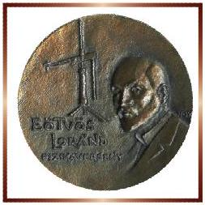
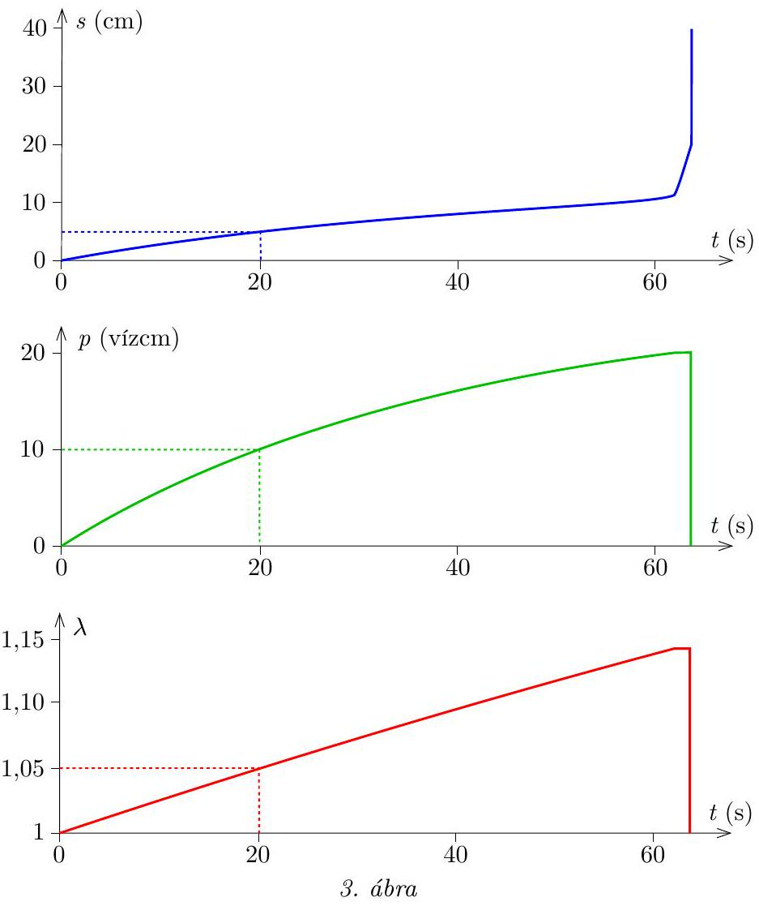
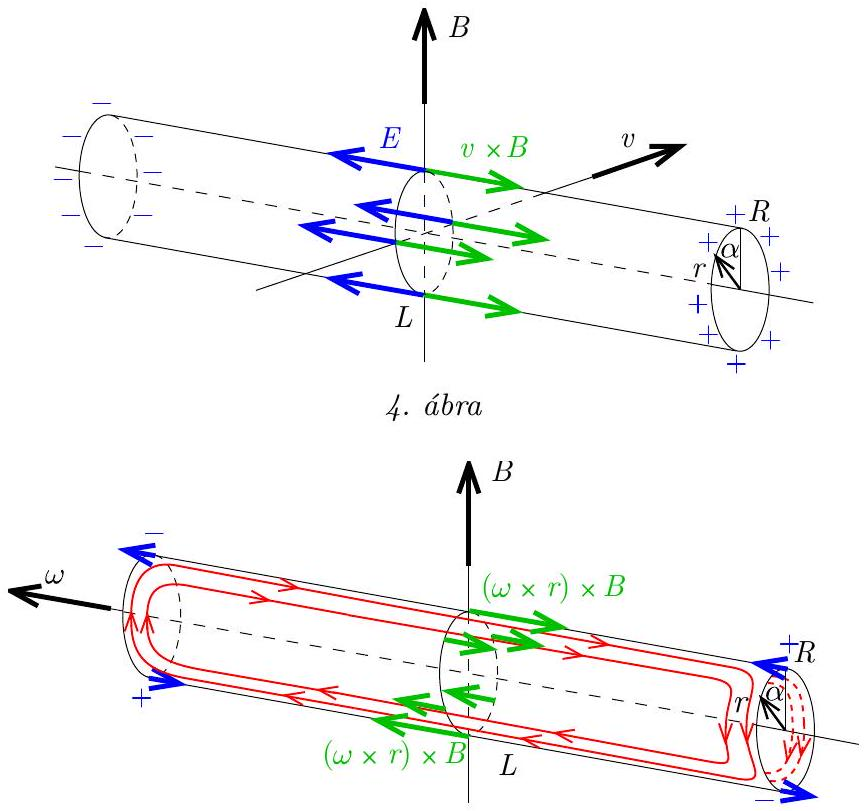
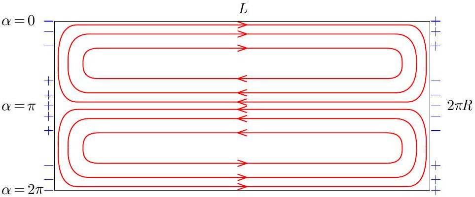

## Beszámoló a 2024. évi Eötvös-versenyröl

Az Eötvös Loránd Fizikai Társulat 2024. évi Eötvös-versenye október 11-én délután 3 órai kezdettel tíz magyarországi helyszínen ${ } ^ { 1 }$ került megrendezésre. Ezért külön köszönettel tartozunk mindazoknak, akik ebben szervezéssel, felügyelettel a segítségünkre voltak. A versenyen a három feladat megoldására 300 perc áll rendelkezésre, bármely írott vagy nyomtatott segédeszköz használható, de (nem programozható) zsebszámológépen kívül minden elektronikus eszköz használata tilos. Az Eötvös-versenyen azok vehetnek részt, akik vagy középiskolai tanulók, vagy a verseny évében fejezték be középiskolai tanulmányaikat. Összesen 54 versenyző adott be dolgozatot, 24 egyetemista és 30 középiskolás.

Ismertetjük a feladatokat és azok megoldását.

1. Egy léggömb elasztikus viselkedése a fal rugalmas energiája segítségével jellemezhető. Ha a jó közelítéssel mindvégig gömb alakú lufi mérete a feszítetlen méret $\lambda$-szorosára változik, akkor a léggömb rugalmas energiája a $2 \lambda ^ { 2 } + \lambda ^ { - 4 } - 3$ kifejezéssel egyenes arányban növekszik egészen addig, míg végül $\lambda \approx 3$ érték körül a lufi kidurran.

A kezdetben ernyedt állapotú léggömböt egy kompresszorhoz csatlakoztatott T-alakú elosztó egyik kivezetésére kötjük, a másik kivezetésre pedig egy vékony üvegcsőből készült vizes manométert rögzítünk az 1. ábrán látható módon. A víz a cső 20 cm hosszú szakaszát foglalja el. A kompresszor elindítása után azt tapasztaljuk, hogy a folyadékszintek az eredeti helyzetükhöz képest lassan 5 cm-rel mozdulnak el, mialatt a léggömb átmérője 5\%-kal növekszik. Mi fog történni ezután?

(Vigh Máté)

[^0]
Megoldás. A lufi rugalmas energiája egy alkalmas $E _ { 0 }$ konstans bevezetésével így írható:

$$
E = E _ { 0 } \left( 2 \lambda ^ { 2 } + \lambda ^ { - 4 } - 3 \right) .
$$

Meggyőződhetünk róla, hogy nyújtatlan állapotban (azaz $\lambda = 1$ esetén) a rugalmas energia a várakozásnak megfelelően zérus, $\lambda > 1$ értékekre pedig $E ( \lambda )$ monoton növekvő függvény. Vajon hogyan határozható meg ebből az összefüggésből a lufiban uralkodó $p$ túlnyomás értéke? Alkalmazzuk a virtuális munka elvét: ha a léggömb térfogatát kis $\Delta V$ értékkel megnöveljük, a bezárt és a külső levegő együttes munkavégzése éppen egyenlő a rugalmas energia növekedésével:

$$
p \Delta V = \Delta E .
$$

A lufi pillanatnyi térfogata a kezdeti $V _ { 0 }$ térfogattal $V = V _ { 0 } \lambda ^ { 3 }$ módon fejezhető ki. Ennek kicsiny megváltozása a magasabb rendű tagok elhanyagolásával a következőképpen közelíthető:

$$
\Delta V \approx 3 V _ { 0 } \lambda ^ { 2 } \Delta \lambda .
$$

Ehhez hasonlóan a rugalmas energia kifejezése is sorba fejthető:

$$
\Delta E \approx E _ { 0 } \left( 4 \lambda - 4 \lambda ^ { - 5 } \right) \Delta \lambda .
$$

Az eddigiek felhasználásával a túlnyomás kiszámítható:

$$
p = \frac { \Delta E } { \Delta V } = \frac { 4 E _ { 0 } \left( \lambda - \lambda ^ { - 5 } \right) \Delta \lambda } { 3 V _ { 0 } \lambda ^ { 2 } \Delta \lambda } = p _ { 0 } \left( \frac { 1 } { \lambda } - \frac { 1 } { \lambda ^ { 7 } } \right) ,
$$

ahol a rövidség kedvéért bevezettük a $p _ { 0 } = \frac { 4 E _ { 0 } } { 3 V _ { 0 } }$ jelölést (ami nem azonos a külső légnyomással).

A feladat szövegéből tudjuk, hogy $p ( \lambda = 1,05 ) = 10$ vízcm, hiszen ha a vízszintek 5 cm-rel mozdulnak el, akkor a folyadékszintek különbsége 10 cm lesz. Ebből:

$$
p _ { 0 } = \frac { 10 \text { vízcm } } { 1,05 ^ { - 1 } - 1,05 ^ { - 7 } } = 41,4 \text { vízcm. }
$$

Érdemes kiszámítani a nyomás értékét a következő két speciális esetben:
$\lambda = 1$ esetén (ernyedt állapotban) $p$ valóban nulla, ahogy várjuk.
$\lambda = 3$ esetén (azaz a kidurranás határán) $p = 13,8$ vízcm.
Ekkora túlnyomást a manométerben lévő 20 cm hosszú vízoszlop ki tud fejteni. Ebből azt a hibás következtetést vonhatjuk le, hogy a lufi felfújódása egészen addig folytatódik, míg a vízszintek elmozdulása $\frac { 13,8 } { 2 } = 6,9 \mathrm {~cm}$-re nő, majd ekkor a lufi kidurran.

Vajon hol a hiba ebben a gondolatmenetben? Ehhez vizsgáljuk meg részletesebben a $p ( \lambda )$ függvényt (2. ábra)! Numerikus értékek behelyettesítésével észrevehetjük, hogy a nyomásnak $\lambda = 1$ és $\lambda = 3$ között maximuma van. (A jelenséget tapasztalatból is ismerjük: egy lufit kezdetben nehezebb, majd egy bizonyos méret felett könnyebb felfújni.)

A maximum pontos helye deriválással határozható meg:

$$
\frac { \mathrm { d } p } { \mathrm {~d} \lambda } = p _ { 0 } \left( - \lambda ^ { - 2 } + 7 \lambda ^ { - 8 } \right) .
$$

Ez a derivált zérus, ha

$$
\lambda = \lambda ^ { * } = \sqrt [ 6 ] { 7 } = 1,38 , \quad \text { ahol } \quad p \left( \lambda ^ { * } \right) = 25,7 \text { vízcm. }
$$

Mi fog tehát történni? Ahogy az a 2. ábráról látszik, a lufi tovább növekszik egészen addig, amíg a túlnyomás eléri a 20 vízcm-es értéket, azaz a folyadékoszlop már ekkor teljes egészében a jobb oldali csőszár függőleges részébe kerül. Innentől a nyomás nem növekszik tovább, és így a lufi mérete is egy ideig állandó marad, a kompresszor pedig immár gyorsabban emeli a vízoszlopot a csőben (hiszen a lufiba már nem kell levegőt fújnia). Amikor a víz elkezd kifolyni a csőből, akkor a nyomás, és így a lufi mérete is csökkenni kezd. Innentől a kompresszorból és a leeresztő lufiból kiáramló levegő is az egyre kisebb tömegű vízoszlopot nyomja ki, amely így egyre gyorsulva „kilövell” a csőből. Amikor minden víz kifolyt a csőből, a lufi visszakerül a teljesen felfújatlan állapotba (a kompresszor pedig ekkortól a szabadba fújja a levegőt).

A lufi maximális méretéhez tartozó $\lambda$ értéket a $p ( \lambda ) = 20$ vízcm egyenlet megoldása adja, amelyet iterálással vagy grafikusan (2. ábrán zöld vonal) kaphatunk meg: $\lambda _ { \text {max } } \approx 1,145$, azaz a lufi átmérője a folyamat során mindössze $14,5 \%$-kal növekszik meg az eredeti méretéhez képest.

Megjegyzések. 1. A folyamatok időbeliségének kvantitatív vizsgálatához további numerikus adatok szükségesek. A 3. ábrán látható grafikonok a következő feltevésekkel készültek: a lufi kezdeti sugara 2,5 cm, a manométer csövének belső keresztmetszete $0,1 \mathrm {~cm} ^ { 2 }$, az alsó ívének hossza 4 cm, a kompresszor térfogatárama $0,54 \mathrm {~cm} ^ { 3 }$, amivel a feladatban szereplő $\lambda = 1,05$ érték és $s = 5 \mathrm {~cm}$ folyadékszál-elmozdulás épp 20 s alatt történik meg. A grafikonokon a folyadékszál $s$ elmozdulása, a bezárt levegő $p$ túlnyomása és a lufi méretét leíró $\lambda$ paraméter látható az idő függvényében.
2. Ha a folyadékszál hossza nagyobb lenne, mint a maximális nyomáshoz tartozó 25,65 cm, akkor a nyomás elérné a maximális értéket, majd csökkenni kezdene, de a lufi tovább fújódna, míg $\lambda \approx 3$ értéknél kipukkadna.

2. A súlytalanság állapotában egy $R$ sugarú, $L \gg R$ hosszúságú és $d \ll R$ falvastagságú alumíniumcső a szimmetriatengelyére merőleges, homogén, $B$ indukciójú mágneses mezőben helyezkedik el. A csövet tengelye körül $\omega _ { 0 }$ szögsebességgel megforgatjuk, majd magára hagyjuk.
a) Vázoljuk fel a cső kiterített palástjáról készült rajzon a csőben kialakuló áramvonalakat!
b) Írjuk le a cső mozgását az idő függvényében!
(Vigh Máté)
Megoldás. a) Ha a cső a mágneses térre merőleges irányban mozogna (de nem forogna), akkor a Lorentz-erő a töltéseket szétválasztaná, és az így kialakuló elektrosztatikus tér kiegyenlítené a Lorentz-erőt, egyensúlyi állapot alakulna ki, és áram nem folyna (4. ábra).

Esetünkben viszont a cső palástjának két átellenes része ellenkező irányban mozog, így a Lorentz-erő is ellentétes irányú lesz, aminek következtében a cső végeinél záródhatnak az áramvonalak, és így nem lesz jelentős töltésfelhalmozódás, hanem az 5. ábrán látható módon zárt áramkör jöhet létre.

5. ábra

Az $L \gg R$ feltétel miatt a cső végeitől eltekintve az elektrosztatikus tér elhanyagolható, és így a cső falában

$$
\begin{aligned}
& \boldsymbol { j } = \sigma ( \boldsymbol { \omega } \times \boldsymbol { r } ) \times \boldsymbol { B } , \\
& j ( \alpha ) = \sigma \omega B R \cos \alpha
\end{aligned}
$$

áramsűrűség alakul ki, ahol $\omega$ a cső pillanatnyi szögsebessége, $\sigma$ az alumínium fajlagos vezetőképessége (a fajlagos ellenállás reciproka), $0 \leqslant \alpha < 2 \pi$ pedig a tengelytől a palást adott pontjához mutató $\boldsymbol { r }$ sugár és a mágneses indukció $\boldsymbol { B }$ vektora által bezárt szög. A cső végein felhalmozódik valamennyi töltés: ezek „térítik el” a cső végén az áramvonalakat. A kialakuló áramvonalakat a 6. ábra mutatja.

6. ábra

b) I. módszer. Az $L \gg R$ feltétel miatt a cső végével, mint "széleffektussal" nem foglalkozunk, csak a csőben a cső tengelyével párhuzamosan folyó áramokkal.

Ezekre a mágneses tér erőt fejt ki, egy $\mathrm { d } V$ kicsiny térfogatra ható erő:

$$
\mathrm { d } \boldsymbol { F } = \boldsymbol { j } \times \boldsymbol { B } \mathrm { d } V .
$$

Az erők és a tengelyre merőleges forgatónyomaték-komponensek vektori eredője a szimmetria miatt nulla, így a cső tömegközéppontja nem mozdul el, és tengelye nem fordul el. Ugyanakkor a tengellyel párhuzamos forgatónyomaték-komponensek eredője nem nulla, a cső forgása így lassulni fog. (Az áramok miatt hő disszipálódik, így a cső energiája biztosan csökkenni fog. Ezt mondja ki a Lenz-törvény is.) A cső kicsiny $d R \mathrm {~d} \alpha$ keresztmetszetű, $L$ hosszúságú, $\mathrm { d } V = L d R \mathrm {~d} \alpha$ térfogatú keskeny csíkjára ható tengellyel párhuzamos forgatónyomaték-komponens:

$$
\begin{gathered}
\mathrm { d } \boldsymbol { M } = \boldsymbol { r } \times \mathrm { d } \boldsymbol { F } = \boldsymbol { r } \times ( \boldsymbol { j } \times \boldsymbol { B } ) L d R \mathrm {~d} \alpha , \\
\mathrm {~d} M = - R j B \cos \alpha \cdot L d R \mathrm {~d} \alpha = - \sigma \omega B ^ { 2 } L d R ^ { 3 } \cos ^ { 2 } \alpha \mathrm {~d} \alpha .
\end{gathered}
$$

(A negatív előjel azt fejezi ki, hogy a forgatónyomaték-komponens a szögsebességvektorral ellentétes irányú.) Ennek összegzése a teljes csőre

$$
M = - \sigma \omega B ^ { 2 } L d R ^ { 3 } \int _ { 0 } ^ { 2 \pi } \cos ^ { 2 } \alpha \mathrm {~d} \alpha = - \sigma \omega B ^ { 2 } L d R ^ { 3 } \pi
$$

(Ezt az eredményt a szinuszos jel effektív értéke alapján is ismerhetjük: az átlagos érték $\frac { 1 } { 2 }$ és $\frac { 1 } { 2 } \cdot 2 \pi = \pi$, vagy a $\cos ^ { 2 } \alpha = \frac { 1 } { 2 } ( 1 - \cos 2 \alpha )$ átalakítás után szemléletesen is láthatjuk.) A vékony falú cső tehetetlenségi nyomatéka

$$
\Theta = m R ^ { 2 } = 2 \pi \varrho L d R ^ { 3 } ,
$$

ahol $\varrho$ az alumínium sűrűsége. A cső tengely körüli forgását leíró mozgásegyenlet:

$$
\frac { \mathrm { d } \omega } { \mathrm {~d} t } = \frac { M } { \Theta } = - \frac { \sigma \omega B ^ { 2 } L d R ^ { 3 } \pi } { 2 \pi \varrho L d R ^ { 3 } } = - \frac { \sigma B ^ { 2 } } { 2 \varrho } \omega .
$$

A differenciálegyenlet ugyanolyan alakú, mint a jól ismert radioaktív bomlási törvény, így megoldása:

$$
\omega ( t ) = \omega _ { 0 } \mathrm { e } ^ { - \frac { t } { \tau } } ,
$$

ahol a $\tau$ időállandó:

$$
\tau = \frac { 2 \varrho } { \sigma B ^ { 2 } } .
$$

A cső tehát exponenciálisan lassulva fog forogni.
Megjegyzés. Az időállandó nem függ a cső méreteitől (mindössze annyit használtunk fel, hogy $d \ll R \ll L$ ), csak a cső anyagának sűrűségétől és fajlagos vezetőképességétől, valamint a mágneses mező erősségétől. Alumínium esetében 1 mT mágneses indukció esetén az időállandóra két és fél percet kapunk.

II. módszer. A cső egészében időegységenként

$$
P = \frac { 1 } { \sigma } j _ { \mathrm { eff } } ^ { 2 } V
$$

energia disszipálódik, ahol (a koszinuszos helyfüggés miatt)

$$
j _ { \mathrm { eff } } = \frac { 1 } { \sqrt { 2 } } j _ { \max } = \frac { 1 } { \sqrt { 2 } } \sigma \omega B R ,
$$

és $V = 2 \pi L d R$ a cső térfogata. Ezt a disszipálódó energiát a cső mozgási energiájának csökkenése fedezi:

$$
P = - \frac { \mathrm { d } E _ { \mathrm { m } } } { \mathrm {~d} t } ,
$$

ahol

$$
E _ { \mathrm { m } } = \frac { 1 } { 2 } \Theta \omega ^ { 2 } = \frac { 1 } { 2 } \varrho V R ^ { 2 } \omega ^ { 2 } .
$$

Behelyettesítés és a deriválás elvégzése után:

$$
\frac { 1 } { 2 } \sigma \omega ^ { 2 } B ^ { 2 } R ^ { 2 } V = - \frac { 1 } { 2 } \varrho V R ^ { 2 } \cdot \frac { \mathrm {~d} \left( \omega ^ { 2 } \right) } { \mathrm { d } t } = - \frac { 1 } { 2 } \varrho V R ^ { 2 } \cdot 2 \omega \frac { \mathrm {~d} \omega } { \mathrm {~d} t } ,
$$

egyszerűsítve és rendezve:

$$
\frac { \mathrm { d } \omega } { \mathrm {~d} t } = - \frac { \sigma B ^ { 2 } } { 2 \varrho } \omega ,
$$

az előző módszer eredményével összhangban.
3. Egy tubusban szimmetrikusan elhelyeztünk két $f _ { 1 } = 50 \mathrm {~cm}$ és két $f _ { 2 } = 10 \mathrm {~cm}$ fókusztávolságú gyűjtőlencsét a 7. ábrán látható módon. Sikerült a lencséket úgy beállítani, hogy az optikai rendszeren átnézve a tárgyakat éppen olyannak látjuk, mintha egy üres tubuson át néznénk azokat.

7. ábra

8. ábra

a) Mekkorák a lencsék közötti $d$ és $s$ távolságok?

b) Ha az előző optikai rendszert tubus nélkül megépítjük, és a kezünket megfelelő helyen a lencsék közé helyezzük, akkor a 8. ábrán látható módon a kezünk egy részét el tudjuk „tüntetni”. Magyarázzuk meg a jelenséget!
(Széchenyi Gábor)

Megoldás. a) I. módszer. A tárgyakat éppen olyannak látjuk, mintha „semmi” nem lenne ott, vagyis egy jobb oldalról érkező fénysugár a lencserendszeren áthaladva éppen a beérkező fénysugár meghosszabbításán fog továbbhaladni. Első lépésként tekintsünk egy olyan fénysugarat, melynek belépő és így kilépő része is párhuzamos az optikai tengellyel. Ekkor - ahogy azt a 9. ábrán is látjuk - a lencserendszer, valamint a sugármenet is tükörszimmetrikus. Ilyenkor a két belső lencse között haladó fénysugár is párhuzamos az optikai tengellyel. Egy, a végtelenből érkező párhuzamos nyalábot a két jobb oldali lencse párhuzamos nyalábbá képez, azaz ez a két lencse konfokális, fókuszpontjaik egybeesnek:

$$
s = f _ { 1 } + f _ { 2 } .
$$

9. ábra

Ezután többféle módon megkaphatjuk a $d$ távolság értékét, lássunk erre két különféle utat!

1. út. Vegyünk fel egy tetszőleges helyen egy tárgyat, és határozzuk meg sorban egymás után a négy lencse által alkotott képeit. A negyedik lencsén történő leképezés után egy azonos állású és nagyítású, virtuális képet kell kapnunk az eredeti tárgy helyén. A leképzési törvény szokásos alakját használva a képletekkel nehézkesebb a számolás, ezért inkább használjuk a Newton-féle alakot (amely az $x$ tárgy és $y$ képtávolságot a fókuszponttól méri, lásd a G. 855. gyakorlatot a KöMaL 2024. májusi számában). Eszerint $x y = f ^ { 2 }$.

Helyezzük a tárgyunkat az első lencse fókuszpontjától $x _ { 1 }$ távolságra. A következőkben jelölje $x _ { i } \left( y _ { i } \right)$ a jobb oldalról számított $i$. lencsén történő leképezéshez tartozó, jobb (bal) oldali fókuszponttól mért tárgytávolságot (képtávolságot). A 10. ábrán piros ponttal a képek helyeit, fekete ponttal a fókuszpontokat jelöltük.

Az első lencsén történő leképezés:

$$
x _ { 1 } y _ { 1 } = f _ { 1 } ^ { 2 } \quad \Rightarrow \quad y _ { 1 } = \frac { f _ { 1 } ^ { 2 } } { x _ { 1 } } .
$$

Mivel $s = f _ { 1 } + f _ { 2 }$, a két lencse fókusza egybeesik, így

$$
x _ { 2 } = - y _ { 1 } ,
$$

A második lencsén történő leképezés:

$$
x _ { 2 } y _ { 2 } = f _ { 2 } ^ { 2 } \quad \Rightarrow \quad y _ { 2 } = \frac { f _ { 2 } ^ { 2 } } { x _ { 2 } } = - \frac { f _ { 2 } ^ { 2 } } { f _ { 1 } ^ { 2 } } x _ { 1 } .
$$

A 10. ábra alapján:

$$
x _ { 3 } = d - 2 f _ { 2 } - y _ { 2 } .
$$

Tovább folytatva a harmadik lencsén történő leképezéssel:

$$
\begin{aligned}
x _ { 3 } y _ { 3 } = f _ { 2 } ^ { 2 } \quad & \Rightarrow \quad y _ { 3 } = \frac { f _ { 2 } ^ { 2 } } { d - 2 f _ { 2 } - y _ { 2 } } \\
& x _ { 4 } = - y _ { 3 }
\end{aligned}
$$

Végül a negyedik lencsén történő leképezés:

$$
\begin{aligned}
x _ { 4 } y _ { 4 } = & f _ { 1 } ^ { 2 } \quad \Rightarrow \quad y _ { 4 } = \frac { f _ { 1 } ^ { 2 } } { x _ { 4 } } = - \frac { f _ { 1 } ^ { 2 } } { y _ { 3 } } = - \frac { f _ { 1 } ^ { 2 } } { f _ { 2 } ^ { 2 } } \left( d - 2 f _ { 2 } - y _ { 2 } \right) = \\
& = - \frac { f _ { 1 } ^ { 2 } } { f _ { 2 } ^ { 2 } } \left( d - 2 f _ { 2 } + \frac { f _ { 2 } ^ { 2 } } { f _ { 1 } ^ { 2 } } x _ { 1 } \right) = - \frac { f _ { 1 } ^ { 2 } } { f _ { 2 } ^ { 2 } } \left( d - 2 f _ { 2 } \right) - x _ { 1 }
\end{aligned}
$$

Ismét a 10. ábra alapján, ahhoz hogy a negyedik kép az első tárgy helyén legyen a következő geometriai feltételnek kell teljesülnie:

$$
- y _ { 4 } = 4 f _ { 1 } + 2 f _ { 2 } + d + x _ { 1 } .
$$

Ebből

$$
\frac { f _ { 1 } ^ { 2 } } { f _ { 2 } ^ { 2 } } \left( d - 2 f _ { 2 } \right) + x _ { 1 } = 4 f _ { 1 } + 2 f _ { 2 } + d + x _ { 1 }
$$

Látható, hogy az egyenletből kiesik az $x _ { 1 }$ változó, azaz tetszőleges helyre helyezve a tárgyat, annak képe a négy lencsén történő leképezés után éppen a tárgy helyén lesz. Az egyenletet tovább alakítva:

$$
\begin{aligned}
& \left( \frac { f _ { 1 } ^ { 2 } } { f _ { 2 } ^ { 2 } } - 1 \right) d = 2 f _ { 2 } \frac { f _ { 1 } ^ { 2 } } { f _ { 2 } ^ { 2 } } + 4 f _ { 1 } + 2 f _ { 2 } \\
& \left( f _ { 1 } ^ { 2 } - f _ { 2 } ^ { 2 } \right) d = 2 f _ { 2 } \left( f _ { 1 } ^ { 2 } + 2 f _ { 1 } f _ { 2 } + f _ { 2 } ^ { 2 } \right)
\end{aligned}
$$

A két középső lencse közötti távolságra az alábbi kifejezés adódik:

$$
d = 2 f _ { 2 } \frac { \left( f _ { 1 } + f _ { 2 } \right) ^ { 2 } } { f _ { 1 } ^ { 2 } - f _ { 2 } ^ { 2 } } = 2 f _ { 2 } \frac { f _ { 1 } + f _ { 2 } } { f _ { 1 } - f _ { 2 } } .
$$

2. út. A lencserendszer középpontosan is szimmetrikus. Ha a beérkező fénysugár meghosszabbítása a középponton menne át, akkor a kimenő fénysugár meghosszabbítása is átmegy a középponton. Ilyenkor a fénysugárnak is középpontosan

szimmetrikusnak kell lennie, azaz annak fizikailag is át kell haladnia a rendszer középpontján (lásd a 11. ábrát). Ennek következményeként egy, a középpontban elhelyezett tárgyat a két bal oldali lencse a középpontba képez le mint virtuális képet.

11. ábra

Szerkesszük meg a középpontba helyezett $h$ magasságú tárgy képét! Tekintsünk egy, az optikai tengellyel párhuzamos, illetve egy, az $f _ { 2 }$ fókusztávolságú lencse fókuszán áthaladó sugármenetet, ezeket zölddel, illetve kékkel rajzoltuk meg a 12. ábrán.

12. ábra

A két lencse konfokális, így a zöld sugármenetet követve a kép méretére

$$
O H = \frac { f _ { 1 } } { f _ { 2 } } h
$$

adódik. Az FGO és FED háromszögek hasonlóak, valamint

$$
D F = f _ { 2 } \quad \text { és } \quad F O = \frac { d } { 2 } - f _ { 2 } ,
$$

ahonnan

$$
D E = B C = \frac { f _ { 2 } } { \frac { d } { 2 } - f _ { 2 } } h .
$$

Az $A B C$ és $A O H$ háromszögek is hasonlóak, amiből következik, hogy

$$
\frac { B C } { A B } = \frac { O H } { A O } \quad \Rightarrow \quad \frac { \frac { f _ { 2 } } { \frac { d } { 2 } - f _ { 2 } } h } { f _ { 1 } } = \frac { \frac { f _ { 1 } } { f _ { 2 } } h } { 2 f _ { 1 } + f _ { 2 } + \frac { d } { 2 } } .
$$

Az egyenletet $d$-re megoldva a korábban megkapott végeredményre jutunk.

A megadott fókusztávolságok behelyettesítése után:

$$
s = f _ { 1 } + f _ { 2 } = 60 \mathrm {~cm} \quad \text { és } \quad d = 2 f _ { 2 } \frac { f _ { 1 } + f _ { 2 } } { f _ { 1 } - f _ { 2 } } = 30 \mathrm {~cm} .
$$

II. módszer. Vegyük fel a koordinátatengelyt az optikai tengelyen, középpontját helyezzük az elrendezés közepére! A tárgy legyen a tengely $x$ pontjában, amit a jobb szélső lencse a $z$ pontba képez le, ezt az első képet pedig a második lencse az $y$ pontba. A lencsék helyére is bevezetünk két új paramétert: az origótól mért távolságukat (hogy rövidebbek legyenek a képletek, 13. ábra):

$$
d _ { 2 } = \frac { 1 } { 2 } d , \quad d _ { 1 } = \frac { 1 } { 2 } d + s .
$$

13. ábra

A harmadik és negyedik lencse az első kettőnek a tükörképe, ezért számukra az $x$ és $y$ pont a $- x , - y$ párnak felel meg. A fényút megfordíthatóságát is kihasználva arra jutunk, hogy a bal oldali két lencse a második képet akkor képezi pontosan vissza az $x$ pontba, ha az $y = L ( x )$ páratlan függvény.

Írjuk fel az első két lencsére a leképezési törvényt a $( k - f ) ( t - f ) = f ^ { 2 }$ Newtonféle alakot használva:

$$
\begin{aligned}
& \left( x - d _ { 1 } - f _ { 1 } \right) \left( d _ { 1 } - z - f _ { 1 } \right) = f _ { 1 } ^ { 2 } \\
& \left( z - d _ { 2 } - f _ { 2 } \right) \left( d _ { 2 } - y - f _ { 2 } \right) = f _ { 2 } ^ { 2 } .
\end{aligned}
$$

Ejtsük ki a $z$ ismeretlent úgy, hogy mindkét egyenletet elosztjuk a bal oldal $z$-t nem tartalmazó tényezőjével, majd összeadjuk ezeket:

$$
d _ { 1 } - d _ { 2 } - f _ { 1 } - f _ { 2 } = \frac { f _ { 1 } ^ { 2 } } { x - d _ { 1 } - f _ { 1 } } + \frac { f _ { 2 } ^ { 2 } } { d _ { 2 } - y - f _ { 2 } } .
$$

A nevezőkkel beszorozva:

$$
\left( d _ { 1 } - d _ { 2 } - f _ { 1 } - f _ { 2 } \right) \left( x - d _ { 1 } - f _ { 1 } \right) \left( d _ { 2 } - y - f _ { 2 } \right) = f _ { 1 } ^ { 2 } \left( d _ { 2 } - y - f _ { 2 } \right) + f _ { 2 } ^ { 2 } \left( x - d _ { 1 } - f _ { 1 } \right) .
$$

Mielőtt elvégeznénk az összes szorzást, nézzük meg, melyik tagokra van szükségünk. A fenti egyenlet egy

$$
A x y + B x + C y + D = 0
$$

implicit alakra vezet, ahol

$$
\begin{equation*}
A = d _ { 1 } - d _ { 2 } - f _ { 1 } - f _ { 2 } , \tag{1}
\end{equation*}
$$

$$
\begin{align*}
& B = f _ { 2 } ^ { 2 } + A \left( f _ { 2 } - d _ { 2 } \right)  \tag{2}\\
& C = - f _ { 1 } ^ { 2 } - A \left( d _ { 1 } + f _ { 1 } \right)  \tag{3}\\
& D = f _ { 1 } ^ { 2 } \left( d _ { 2 } - f _ { 2 } \right) - f _ { 2 } ^ { 2 } \left( d _ { 1 } + f _ { 1 } \right) + A \left( d _ { 1 } + f _ { 1 } \right) \left( d _ { 2 } - f _ { 2 } \right) = \frac { B C + f _ { 1 } ^ { 2 } f _ { 2 } ^ { 2 } } { A } . \tag{4}
\end{align*}
$$

A keresett $L$ függvény:

$$
y = - \frac { B x + D } { A x + C } .
$$

Ez akkor páratlan, ha $\alpha$ ) $A = D = 0$, vagy $\beta$ ) $B = C = 0$.
Az $\alpha$ ) esetben az (1) egyenletből $A = 0$ feltétellel:

$$
\begin{equation*}
s = d _ { 1 } - d _ { 2 } = f _ { 1 } + f _ { 2 } . \tag{5}
\end{equation*}
$$

Ez a távolság ugyanakkora, mint a Kepler-féle távcsőben, vagyis eszközünk nem más, mint két kifelé fordított Kepler-távcső. A $d$ középső távolság meghatározásához nézzük a $D$ együtthatóra vonatkozó egyenletet. A (4) egyenletből $D = 0$ feltétellel:

$$
\begin{equation*}
f _ { 1 } ^ { 2 } \left( d _ { 2 } - f _ { 2 } \right) - f _ { 2 } ^ { 2 } \left( d _ { 1 } + f _ { 1 } \right) = 0 . \tag{6}
\end{equation*}
$$

Helyettesítsük be (5)-ből $d _ { 1 } = d _ { 2 } + f _ { 1 } + f _ { 2 }$-t, és oldjuk meg $d _ { 2 }$-re:

$$
\begin{gathered}
f _ { 1 } ^ { 2 } \left( d _ { 2 } - f _ { 2 } \right) - f _ { 2 } ^ { 2 } \left( d _ { 2 } + 2 f _ { 1 } + f _ { 2 } \right) = 0 \\
d _ { 2 } = f _ { 2 } \frac { f _ { 1 } ^ { 2 } + 2 f _ { 1 } f _ { 2 } + f _ { 2 } ^ { 2 } } { f _ { 1 } ^ { 2 } - f _ { 2 } ^ { 2 } } = f _ { 2 } \frac { f _ { 1 } + f _ { 2 } } { f _ { 1 } - f _ { 2 } } \quad \Rightarrow \quad d = 2 f _ { 2 } \frac { f _ { 1 } + f _ { 2 } } { f _ { 1 } - f _ { 2 } } .
\end{gathered}
$$

Az eredményen látszik, hogy a megoldhatósághoz teljesülnie kell az $f _ { 1 } > f _ { 2 }$ egyenlőtlenségnek. A második kép helye végül:

$$
\begin{equation*}
y = - \frac { B } { C } x = \left( \frac { f _ { 2 } } { f _ { 1 } } \right) ^ { 2 } x . \tag{7}
\end{equation*}
$$

A $\beta$ ) megoldásról megmutatjuk, hogy fordított képet ad, ezért nem felel meg a feladat leírásának. A kép annyiszor fordul meg az eszközben, ahány valódi, ernyőn felfogható kép létrejön. Az $\alpha$ ) megoldásban például a párhuzamos fénynyaláb (végtelen távoli tárgy) a középső tartományban szintén párhuzamos, a két szélsőben a lencsék közös fókuszpontjában valódi kép jön létre, így a kétszer megfordított kép egyenes állású lesz. A $\beta$ ) megoldásnál a második kép az

$$
y = - \frac { D } { A x }
$$

helyre kerül, a végtelen távol levő tárgy második képe tehát az origóban lesz. Mivel a sugármenet szimmetrikus, ez mindenképpen páratlan számú képfordítást jelent, a végső kép így fordított állású lesz.

A feladat $a$ ) kérdésére tehát a válasz (a korábbi eredményekkel összhangban):

$$
s = f _ { 1 } + f _ { 2 } = 60 \mathrm {~cm} \quad \text { és } \quad d = 2 f _ { 2 } \frac { f _ { 1 } + f _ { 2 } } { f _ { 1 } - f _ { 2 } } = 30 \mathrm {~cm} .
$$

Megjegyzések. 1. A kép és a tárgy összetett optikai eszközöknél is felcserélhető - ez a fénysugár megfordíthatóságából következik. Ha a kettő ugyanott van, akkor a felcserélhetőség az eszköz nagyítására az

$$
N ^ { * } = \frac { K } { T } = \frac { T } { K } = \frac { 1 } { N ^ { * } }
$$

feltételt adja, amiből

$$
N ^ { * 2 } = 1 \quad \text { és } \quad N ^ { * } = \pm 1 ,
$$

vagyis a kép ugyanakkora, de lehet egyenes vagy fordított állású.
Ellenőrizzük, hogy a nagyítás az $\alpha$ ) megoldásban minden tárgytávolságra + 1 . Egy lencse nagyítása (amit fordított állású kép esetén negatívnak tekintünk):

$$
N = \frac { K } { T } = - \frac { k } { t } = \frac { f } { f - t } = \frac { f - k } { f } .
$$

A teljes nagyítás a négy lencse nagyításának szorzata. Az első és harmadik kép helyét nem számoltuk ki, de az egyes lencsék nagyításának felírásánál szerencsére két-két lehetőségünk van:

$$
N ^ { * } = \frac { f _ { 1 } } { f _ { 1 } + d _ { 1 } - x } \cdot \frac { f _ { 2 } - d _ { 2 } + y } { f _ { 2 } } \cdot \frac { f _ { 2 } } { f _ { 2 } - d _ { 2 } - y } \cdot \frac { f _ { 1 } + d _ { 1 } + x } { f _ { 1 } } .
$$

A szorzások elvégzésekor vegyük észre, hogy a számláló és a nevező egyforma tagokat tartalmaz, csak némelyiket eltérő előjellel:

$$
\begin{equation*}
N ^ { * } = \frac { \left[ \left( f _ { 1 } + d _ { 1 } \right) \left( f _ { 2 } - d _ { 2 } \right) + x y \right] + \left[ x \left( f _ { 2 } - d _ { 2 } \right) + y \left( f _ { 1 } + d _ { 1 } \right) \right] } { \left[ \left( f _ { 1 } + d _ { 1 } \right) \left( f _ { 2 } - d _ { 2 } \right) + x y \right] - \left[ x \left( f _ { 2 } - d _ { 2 } \right) + y \left( f _ { 1 } + d _ { 1 } \right) \right] } . \tag{8}
\end{equation*}
$$

A számláló és nevező eltérő előjelű részéről megmutatjuk, hogy zérus:

$$
x \left( f _ { 2 } - d _ { 2 } \right) + y \left( f _ { 1 } + d _ { 1 } \right) = \frac { x } { f _ { 1 } ^ { 2 } } \left[ f _ { 1 } ^ { 2 } \left( f _ { 2 } - d _ { 2 } \right) + f _ { 2 } ^ { 2 } \left( f _ { 1 } + d _ { 1 } \right) \right] = 0 .
$$

(Ehhez használtuk a (7) eredményt, a szögletes zárójelben levő rész pedig (6) alapján zérus.) Tehát $N ^ { * } = 1$, bárhol is van a tárgy.
2. A $\beta$ ) megoldás a következő:

$$
s = \sqrt { 2 f _ { 1 } f _ { 2 } } , \quad d = 2 f _ { 2 } \frac { f _ { 1 } - \sqrt { 2 f _ { 1 } f _ { 2 } } } { f _ { 1 } + f _ { 2 } - \sqrt { 2 f _ { 1 } f _ { 2 } } } , \quad f _ { 1 } > 2 f _ { 2 } .
$$

A nagyítás (8) kifejezésében most az azonos előjelű rész, a számláló és nevező első tagja tűnik el:

$$
\left( f _ { 1 } + d _ { 1 } \right) \left( f _ { 2 } - d _ { 2 } \right) - \frac { D } { A } = \left( f _ { 1 } + d _ { 1 } \right) \left( f _ { 2 } - d _ { 2 } \right) - \frac { f _ { 1 } ^ { 2 } f _ { 2 } ^ { 2 } } { A ^ { 2 } } = 0 ,
$$

ahol előbb behelyettesítettük (4) egyenletből $D$-t, majd pedig az

$$
\frac { f _ { 1 } ^ { 2 } } { A } = - \left( d _ { 1 } + f _ { 1 } \right) , \quad \frac { f _ { 2 } ^ { 2 } } { A } = d _ { 2 } - f _ { 2 }
$$

értékeket, amik a $B = C = 0$ feltétellel a (2) és (3) egyenletből adódnak. A nagyítás tehát ebben az esetben $N ^ { * } = - 1$, bárhol van a tárgy.
b) Ha megnézzük a 9. ábrán a párhuzamos nyalábot, láthatjuk, hogy a két belső lencse között $\frac { f _ { 2 } } { f _ { 1 } }$ arányban, esetünkben $\frac { 1 } { 5 }$-öd részére szűkül össze. Ha a kezünket úgy rakjuk be a két belső lencse közé, hogy ez a szűk nyaláb a széttartott ujjaink

között át tud menni, akkor nem fog kitakarni semmit, és a teljes lencserendszeren át a hátteret látjuk. A 14. ábrán nemcsak a párhuzamos, hanem kis szögben érkező nyalábokat is tekintettünk, és szürkével rajzoltuk be azokat a tartományokat, ahová helyezett tárgyak nem fognak semmit kitakarni.

14. ábra

棌
Az ünnepélyes eredményhirdetésre és díjkiosztásra 2024. november 22-én délután került sor az ELTE TTK Eötvös termében. Megemlékeztünk az 50 és 25 évvel ezelőtti Eötvös-versenyről, ismertettük az akkori feladatokat és a győztesek nevét. Az 50 évvel ezelőtt díjazottak közül Vladár Károly - aki az idei évtől a versenybizottság tagja - volt jelen, a 25 évvel ezelőttiek közül Hegedüs Ákos, Gáspár Merse Előd és Terpai Tamás - ők pár mondatban beszéltek a versennyel kapcsolatos emlékeikről és a pályafutásukról. A 75 évvel ezelőtti győztes Holics László és az 50 évvel ezelőtti II. díjas Szép Jenő néhány soros üdvözletet küldött. Ezután következett a 2024. évi verseny feladatainak és megoldásainak bemutatása. Az 1. feladat megoldását Vigh Máté, a 2. feladatét Vankó Péter, a 3. feladatét Széchenyi Gábor ismertette.

Az esemény végén került sor az eredményhirdetésre. A díjakat Ormos Pál, az Eötvös Loránd Fizikai Társulat elnöke adta át.
I. díjat a versenybizottság nem adott ki.

Az első feladat helyes, a második feladat lényegében helyes megoldásáért és a harmadik feladatban elért részeredményért második díjat nyert Bencz Benedek, a Baár-Madas Református Gimnázium, Általános Iskola és Kollégium 12. osztályos tanulója, Horváth Norbert tanítványa.

A második feladat helyes megoldásáért és a másik két feladatban elért részeredményekért harmadik díjat nyert Téti Miklós, a Budapesti Fazekas Mihály Gyakorló Általános Iskola és Gimnázium 11. osztályos tanulója, Schramek Anikó tanítványa.

Egy feladat lényegében helyes megoldásáért és kisebb részeredményekért dicséretet kapott Iliás Gergely, az ELTE fizika BSc szakos hallgatója, aki a Jedlik Ányos Gimnáziumban érettségizett Radnai Tamás tanítványaként, Masa Barnabás, a Szegedi Radnóti Miklós Kísérleti Gimnázium 12. osztályos tanulója, Csányi Sándor tanítványa, valamint Tóth Kolos Barnabás, a Budapest V. Kerületi Eötvös József Gimnázium 11. osztályos tanulója, Varga Balázs tanítványa.

A második díjjal az Andersen Adótanácsadó Zrt. és a Nanorobot Vagyonkezelő Kft. adományából 90 ezer forint, a harmadik díjjal 60 ezer, a dicsérettel 40 ezer

[^0]:    ${ } ^ { 1 }$ Részletek a verseny honlapján: http://eik.bme.hu/~vanko/fizika/eotvos.htm
