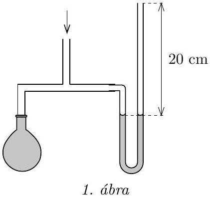
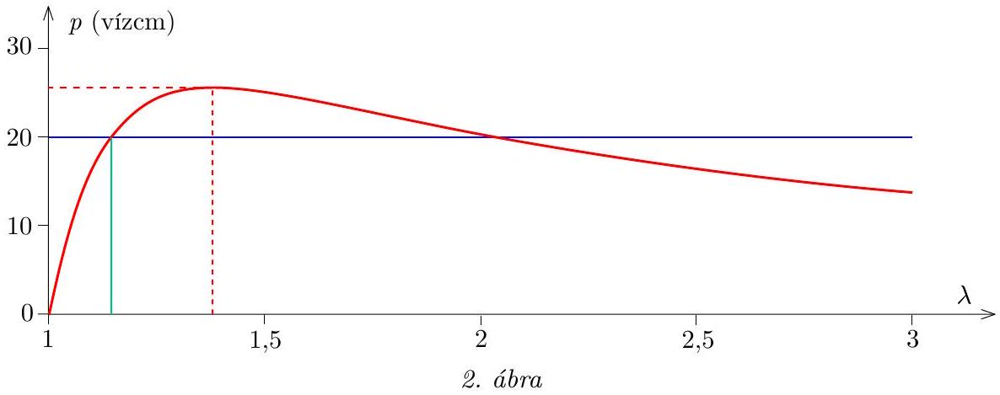

1. Egy léggömb elasztikus viselkedése a fal rugalmas energiája segítségével jellemezhető. Ha a jó közelítéssel mindvégig gömb alakú lufi mérete a feszítetlen méret $\lambda$-szorosára változik, akkor a léggömb rugalmas energiája a $2 \lambda ^ { 2 } + \lambda ^ { - 4 } - 3$ kifejezéssel egyenes arányban növekszik egészen addig, míg végül $\lambda \approx 3$ érték körül a lufi kidurran.

A kezdetben ernyedt állapotú léggömböt egy kompresszorhoz csatlakoztatott T-alakú elosztó egyik kivezetésére kötjük, a másik kivezetésre pedig egy vékony üvegcsőből készült vizes manométert rögzítünk az 1. ábrán látható módon. A víz a cső 20 cm hosszú szakaszát foglalja el. A kompresszor elindítása után azt tapasztaljuk, hogy a folyadékszintek az eredeti helyzetükhöz képest lassan 5 cm-rel mozdulnak el, mialatt a léggömb átmérője 5\%-kal növekszik. Mi fog történni ezután?

(Vigh Máté)

[^0]
Megoldás. A lufi rugalmas energiája egy alkalmas $E _ { 0 }$ konstans bevezetésével így írható:

$$
E = E _ { 0 } \left( 2 \lambda ^ { 2 } + \lambda ^ { - 4 } - 3 \right) .
$$

Meggyőződhetünk róla, hogy nyújtatlan állapotban (azaz $\lambda = 1$ esetén) a rugalmas energia a várakozásnak megfelelően zérus, $\lambda > 1$ értékekre pedig $E ( \lambda )$ monoton növekvő függvény. Vajon hogyan határozható meg ebből az összefüggésből a lufiban uralkodó $p$ túlnyomás értéke? Alkalmazzuk a virtuális munka elvét: ha a léggömb térfogatát kis $\Delta V$ értékkel megnöveljük, a bezárt és a külső levegő együttes munkavégzése éppen egyenlő a rugalmas energia növekedésével:

$$
p \Delta V = \Delta E .
$$

A lufi pillanatnyi térfogata a kezdeti $V _ { 0 }$ térfogattal $V = V _ { 0 } \lambda ^ { 3 }$ módon fejezhető ki. Ennek kicsiny megváltozása a magasabb rendű tagok elhanyagolásával a következőképpen közelíthető:

$$
\Delta V \approx 3 V _ { 0 } \lambda ^ { 2 } \Delta \lambda .
$$

Ehhez hasonlóan a rugalmas energia kifejezése is sorba fejthető:

$$
\Delta E \approx E _ { 0 } \left( 4 \lambda - 4 \lambda ^ { - 5 } \right) \Delta \lambda .
$$

Az eddigiek felhasználásával a túlnyomás kiszámítható:

$$
p = \frac { \Delta E } { \Delta V } = \frac { 4 E _ { 0 } \left( \lambda - \lambda ^ { - 5 } \right) \Delta \lambda } { 3 V _ { 0 } \lambda ^ { 2 } \Delta \lambda } = p _ { 0 } \left( \frac { 1 } { \lambda } - \frac { 1 } { \lambda ^ { 7 } } \right) ,
$$

ahol a rövidség kedvéért bevezettük a $p _ { 0 } = \frac { 4 E _ { 0 } } { 3 V _ { 0 } }$ jelölést (ami nem azonos a külső légnyomással).

A feladat szövegéből tudjuk, hogy $p ( \lambda = 1,05 ) = 10$ vízcm, hiszen ha a vízszintek 5 cm-rel mozdulnak el, akkor a folyadékszintek különbsége 10 cm lesz. Ebből:

$$
p _ { 0 } = \frac { 10 \text { vízcm } } { 1,05 ^ { - 1 } - 1,05 ^ { - 7 } } = 41,4 \text { vízcm. }
$$

Érdemes kiszámítani a nyomás értékét a következő két speciális esetben:
$\lambda = 1$ esetén (ernyedt állapotban) $p$ valóban nulla, ahogy várjuk.
$\lambda = 3$ esetén (azaz a kidurranás határán) $p = 13,8$ vízcm.
Ekkora túlnyomást a manométerben lévő 20 cm hosszú vízoszlop ki tud fejteni. Ebből azt a hibás következtetést vonhatjuk le, hogy a lufi felfújódása egészen addig folytatódik, míg a vízszintek elmozdulása $\frac { 13,8 } { 2 } = 6,9 \mathrm {~cm}$-re nő, majd ekkor a lufi kidurran.

Vajon hol a hiba ebben a gondolatmenetben? Ehhez vizsgáljuk meg részletesebben a $p ( \lambda )$ függvényt (2. ábra)! Numerikus értékek behelyettesítésével észrevehetjük, hogy a nyomásnak $\lambda = 1$ és $\lambda = 3$ között maximuma van. (A jelenséget tapasztalatból is ismerjük: egy lufit kezdetben nehezebb, majd egy bizonyos méret felett könnyebb felfújni.)

A maximum pontos helye deriválással határozható meg:

$$
\frac { \mathrm { d } p } { \mathrm {~d} \lambda } = p _ { 0 } \left( - \lambda ^ { - 2 } + 7 \lambda ^ { - 8 } \right) .
$$

Ez a derivált zérus, ha

$$
\lambda = \lambda ^ { * } = \sqrt [ 6 ] { 7 } = 1,38 , \quad \text { ahol } \quad p \left( \lambda ^ { * } \right) = 25,7 \text { vízcm. }
$$

Mi fog tehát történni? Ahogy az a 2. ábráról látszik, a lufi tovább növekszik egészen addig, amíg a túlnyomás eléri a 20 vízcm-es értéket, azaz a folyadékoszlop már ekkor teljes egészében a jobb oldali csőszár függőleges részébe kerül. Innentől a nyomás nem növekszik tovább, és így a lufi mérete is egy ideig állandó marad, a kompresszor pedig immár gyorsabban emeli a vízoszlopot a csőben (hiszen a lufiba már nem kell levegőt fújnia). Amikor a víz elkezd kifolyni a csőből, akkor a nyomás, és így a lufi mérete is csökkenni kezd. Innentől a kompresszorból és a leeresztő lufiból kiáramló levegő is az egyre kisebb tömegű vízoszlopot nyomja ki, amely így egyre gyorsulva „kilövell” a csőből. Amikor minden víz kifolyt a csőből, a lufi visszakerül a teljesen felfújatlan állapotba (a kompresszor pedig ekkortól a szabadba fújja a levegőt).

A lufi maximális méretéhez tartozó $\lambda$ értéket a $p ( \lambda ) = 20$ vízcm egyenlet megoldása adja, amelyet iterálással vagy grafikusan (2. ábrán zöld vonal) kaphatunk meg: $\lambda _ { \text {max } } \approx 1,145$, azaz a lufi átmérője a folyamat során mindössze $14,5 \%$-kal növekszik meg az eredeti méretéhez képest.

Megjegyzések. 1. A folyamatok időbeliségének kvantitatív vizsgálatához további numerikus adatok szükségesek. A 3. ábrán látható grafikonok a következő feltevésekkel készültek: a lufi kezdeti sugara 2,5 cm, a manométer csövének belső keresztmetszete $0,1 \mathrm {~cm} ^ { 2 }$, az alsó ívének hossza 4 cm, a kompresszor térfogatárama $0,54 \mathrm {~cm} ^ { 3 }$, amivel a feladatban szereplő $\lambda = 1,05$ érték és $s = 5 \mathrm {~cm}$ folyadékszál-elmozdulás épp 20 s alatt történik meg. A grafikonokon a folyadékszál $s$ elmozdulása, a bezárt levegő $p$ túlnyomása és a lufi méretét leíró $\lambda$ paraméter látható az idő függvényében.
