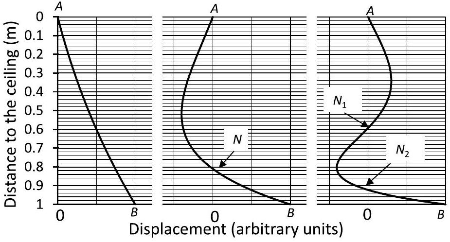

## 1 Oscillating rope

A) It is evident from the figure that the curvature of the rope in the fundamental vibration is very small. It infers for a possibility to model the fundamental vibration as a swinging of a rigid uniform rod of length $L$ about a pivot point at its end. The moment of inertia of the rod is:

$$
I = m L ^ { 2 } / 3
$$

and the distance from the center-of-mass to the pivot point is:

$$
b = L / 2
$$

Therefore, the frequency of the fundamental vibration is approximated as:

$$
f _ { 1 } = \frac { 1 } { 2 \pi } \sqrt { m g b / I } = \frac { 1 } { 2 \pi } \sqrt { 3 g / 2 L } \approx 0.61 \mathrm {~Hz}
$$

Correspondingly, the period of the fundamental vibration is:

$$
T _ { 1 } = 2 \pi \sqrt { I / m g b } = 2 \pi \sqrt { 2 L / 3 g } \approx 1.6 \mathrm {~s}
$$

B) Whatever model for estimating of $f _ { 1 }$ is being used, one may deduce on the basis of dimensionality arguments that the k-th natural frequency of the rope is:

$$
f _ { k } = c _ { k } \sqrt { g / L }
$$

where $c _ { k }$ is a dimensionless numeric coefficient depending on the consecutive mode number $k$ only. Let $A$ and $B$ be the suspension point and the free end of the rope respectively, and $N$ be the node on the rope for the second natural vibration (see the figure).

Since the node point is at rest (in the small-amplitude approximation), the vibration of the part $N B$ could be considered as a fundamental vibration of a rope of length $L N A$ about a suspension point $N$. Therefore:

$$
f _ { 2 } ( L ) \equiv f _ { 1 } ( L - N A )
$$

Hence one may write:

$$
\frac { f _ { 2 } ( L ) } { f _ { 1 } ( L ) } = \frac { f _ { 1 } ( L - N A ) } { f _ { 1 } ( L ) } = \sqrt { \frac { L } { L - N A } }
$$

Since the absolute displacement is much smaller than the length of the rope, the distances could be measured in a vertical direction, to the ceiling, instead along the rope. Therefore, by taking $L = 1 \mathrm {~m}$, and $N A \approx 0.8 \mathrm {~m}$, we obtain:

$$
\frac { f _ { 2 } } { f _ { 1 } } \approx 2.2
$$

Similarly, the vibration of the part $N _ { 1 } B$ in the third eigenmode is equivalent to the second natural vibration of a rope of length $L - N _ { 1 } A \approx 0.4 \mathrm {~m}$. In analogy to the first case:

$$
f _ { 3 } ( L ) \equiv f _ { 2 } \left( L - N _ { 1 } A \right)
$$

and

$$
\frac { f _ { 2 } ( L ) } { f _ { 1 } ( L ) } = \frac { f _ { 2 } \left( L - N _ { 1 } A \right) } { f _ { 2 } ( L ) } = \sqrt { \frac { L } { L - N _ { 1 } A } } \approx 1.6
$$

Therefore:

$$
f _ { 3 } / f _ { 1 } = f _ { 2 } / f _ { 1 } \times f _ { 3 } / f _ { 2 } \approx 3.5
$$

Finally:

$$
f _ { 1 } : f _ { 2 } : f _ { 3 } \approx 1 : 2.2 : 3.5
$$

| Part | Marking scheme | Points |
| :--- | :--- | :--- |
| A | States explicitly or realizes (proper drawing or notattions) the physical pendulum analogy | 1.0 |
|  | Correct expression for the moment of unertia | 1.0 |
|  | Determination of the position of the center of mass | 0.5 |
|  | Correct formula for the period/frequency of a physical pendulum | 1.0 |
|  | Calculates $\mathrm { f } _ { 1 } = 0.61 \mathrm {~Hz}$ with two significant digits | 0.5 |
|  | Subtotal on A | 4.0 |
| B | States or realizes (proper graph or formula) that the vibration of the rope below a node point is similar to a lower order vibration of a shorter rope. | 1.0 |
|  | Uses dimensionality arguments to argue that $\mathrm { f } _ { \mathrm { k } } = \mathrm { c } _ { \mathrm { k } } ( \mathrm { g } / \mathrm { L } ) ^ { 1 / 2 }$ | 1.0 |
|  | Applies similarity arguments to $\mathrm { f } _ { 1 }$ and $\mathrm { f } _ { 2 }$ and derives $\mathrm { f } _ { 2 } / \mathrm { f } _ { 1 } = ( \mathrm { L } / \mathrm { L }$ NA) ${ } ^ { 1 / 2 }$ | 1.0 |
|  | Reads correctly NA from the graph | 0.5 |
|  | Calculates $\mathrm { f } _ { 2 } / \mathrm { f } _ { 1 } = 2.2$ to a precision of 2 significant digits | 0.5 |
|  | Applies similarity arguments to $f _ { 3 }$ and $f _ { 2 }$ (or $f _ { 1 }$ ) and derives $f _ { 3 } / f _ { 2 } = \left( \mathrm { L } / \mathrm { L } - \mathrm { N } _ { 1 } \mathrm {~A} \right) ^ { 1 / 2 }$ or $\mathrm { f } _ { 3 } / \mathrm { f } _ { 1 } = \left( \mathrm { L } / \mathrm { L } - \mathrm { N } _ { 2 } \mathrm {~A} \right) ^ { 1 / 2 }$ | 1.0 |
|  | Reads correctly $\mathrm { N } _ { 1 } \mathrm {~A} \left( \mathrm {~N} _ { 2 } \mathrm {~A} \right)$ from the graph. | 0.5 |
|  | Calculates $\mathrm { f } _ { 3 } / \mathrm { f } _ { 1 } = 3.5$ to a precision of 2 significant digits. | 0.5 |
|  | Subtotal on B | 6.0 |
