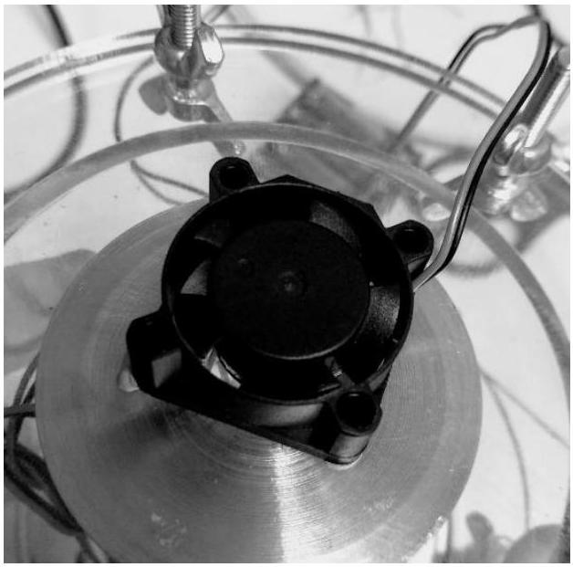
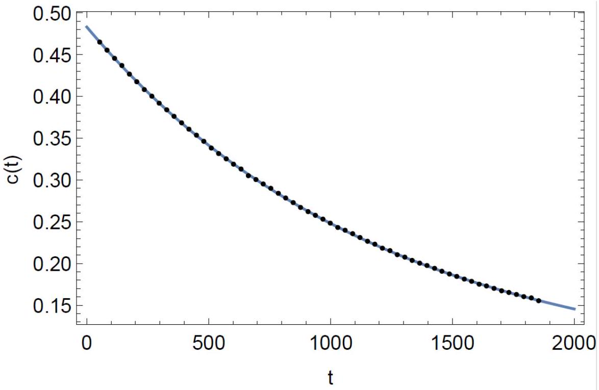
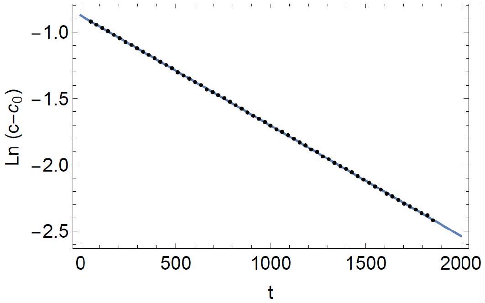
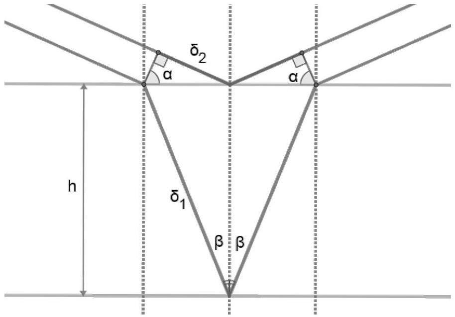
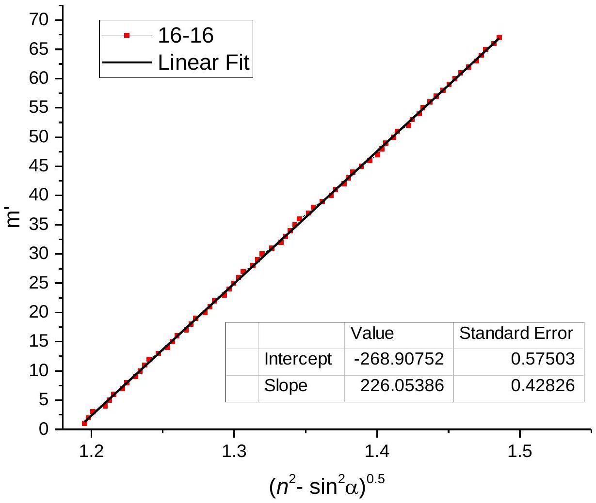
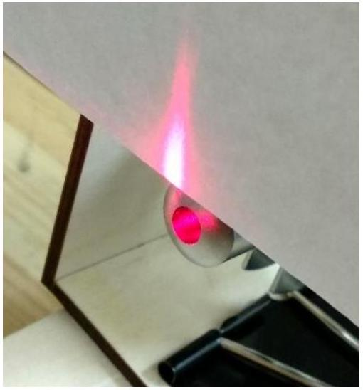
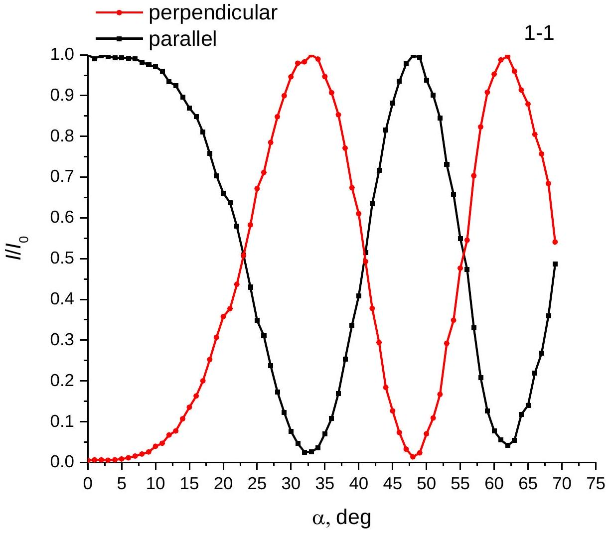
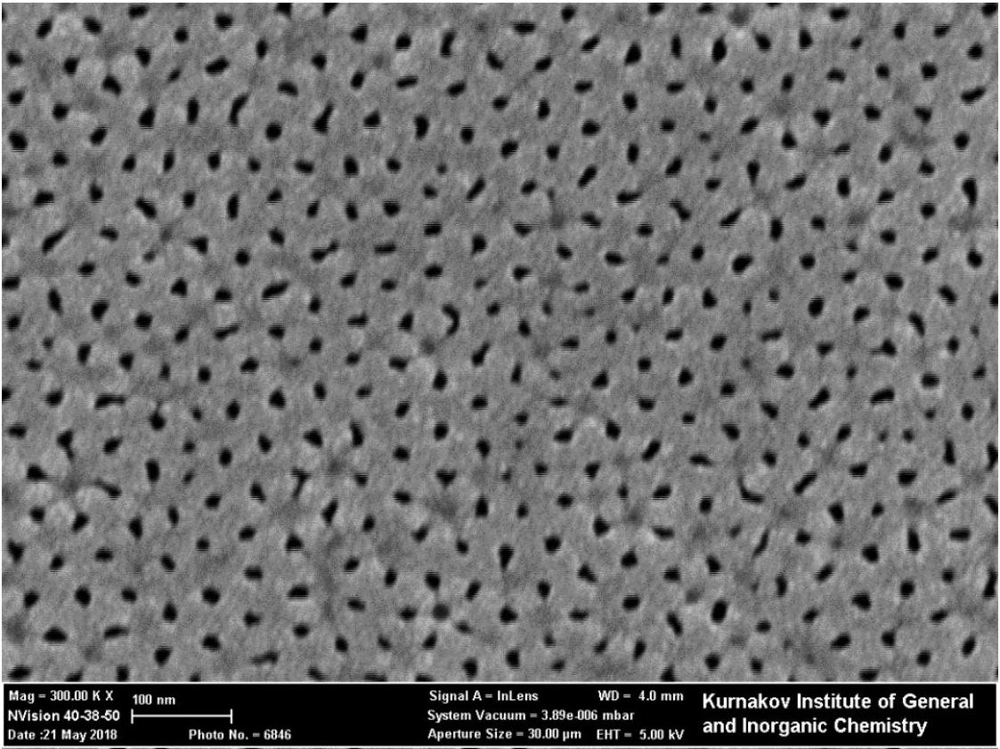

Part A.
Turn the $C O _ { 2 }$ sensor on. It takes 2-3 minutes for the sensor self-calibration, after that the measurement starts.

Before the main experiment concentration of $\mathrm { CO } _ { 2 }$ in the vessel is equal to the concentration $c _ { 0 }$ of $\mathrm { CO } _ { 2 }$ in the atmosphere, let us determine it

$$
c _ { 0 } = ( 0.050 \pm 0,005 ) \% .
$$

Now let us consider the diffusion process theoretically and express typical diffusion time $\tau$ via the membrane geometrical parameters.

The change of $C O _ { 2 }$ molecules number inside the vessel per unit time is equal

$$
\frac { d } { d t } ( c V ) = - j p S _ { 0 }
$$

where $p S _ { 0 }$ is the net area of channels. The flow through the channels is

$$
j = D \frac { c - c _ { 0 } } { h }
$$

and we get differential equation for concentration $c ( t )$

$$
\frac { d c } { d t } = - \frac { D p S _ { 0 } } { V h } \left( c - c _ { 0 } \right)
$$

The solution is

$$
c ( t ) = c _ { 0 } + C \exp \left( - \frac { t } { \tau } \right)
$$

where

$$
\tau = \frac { V h } { p S _ { 0 } D }
$$

According to the problem text the Knudsen flow takes place in the membrane channels. In this case the diffusion coefficient D is determined by the collisions of molecules with the walls of the channel

$$
D = \frac { 1 } { 3 } v d .
$$

Knowing the molar mass of carbon dioxide $\mu = 44 \frac { g } { m o l }$, we calculate the thermal velocity of $\mathrm { CO } _ { 2 }$ molecules for room temperature $T = 295 \mathrm {~K}$ :

$$
v = \sqrt { \frac { 8 R T } { \pi \mu } } = 376 \mathrm {~m} / \mathrm { s }
$$

Finally we have

$$
\tau = \frac { 3 V h } { p S _ { 0 } v d }
$$

Calculate the full membrane area $S _ { 0 } = \frac { \pi } { 4 } d _ { w } ^ { 2 } = 1.33 s m ^ { 2 }$. We measure the length and the inner diameter of the vessel:

$$
\begin{gathered}
L = 5.0 \mathrm { sm } \\
D _ { \text {in } } = 7.4 \mathrm { sm }
\end{gathered}
$$

and calculate its inner volume $V = 215 \mathrm { sm } ^ { 3 }$. The volume of fan, sensor and tubes way be neglected.

Now let's procced with the experiment. We will use our own lungs as a source of carbon dioxide. Let's take a breath and exhale the air into the cylinder through the tube, then close both tubes with clips. A second tube is needed in order for the air to better circulate in the vessel during the exhalation.

To ensure that the concentration of $C O _ { 2 }$ in the vessel is the same at each moment, turn on the internal fan, it mixes the air in the vessel. To ensure that the concentration of $C O _ { 2 }$ outside the membrane is equal to $c _ { 0 }$, turn on the second fan to blow on the membrane outside.

Measure the dependence $c ( t )$,where the concentration is measured in \%, and the time in seconds. The results are shown on the plot.

Let's plot a linearized graph in the coordinates $t , L n \left( c - c _ { 0 } \right)$.

From its slope we calculate the required time

$$
\tau = 1204 \pm 10 \mathrm { sec }
$$

Slope and its uncertainty were calculated with OLS.

Notes.

1. The $C O _ { 2 }$ concentration in the exhaled air is 4\% and the sensor's working limit is 0.5\%. Therefore, if you blow into the installation strongly, the sensor is off scale. Participants can wait until the $\mathrm { CO } _ { 2 }$ concentration in the vessel drops below 0.5\% and then start the measurements. There are also two other ways to reduce the $\mathrm { CO } _ { 2 }$ concentration in the vessel. You can unscrew the cover of the installation (with tubes, not with the sample!) and utilizing the fan blow the installation with atmospheric air. Another way is to open both tubes and suck the air out through one of them. The atmospheric air comes inside the vessel through the second tube. This method is the fastest and easiest.
2. The equipment setups for parts B,C are independent on equipment for part A, so the optical measurements can be performed simultaneously with the diffusional. Moreover, the sensor stores the data.
3. If the participant does not use the second (external) fan, the measured value $\tau$ will be about 2 times larger, which will give incorrect answer for the pore diameter.

Part B.
Optical path difference between beams reflected from top and bottom sides of the membrane:

$$
\delta = 2 \delta _ { 1 } - 2 \delta _ { 2 } + \frac { \lambda } { 2 }
$$

$\frac { \lambda } { 2 }$ appears because of phase change in case of reflection from the surface with higher refractive index.

$$
\frac { \sin \alpha } { \sin \beta } = n
$$

$$
\begin{gather*}
\delta _ { 1 } = n \frac { h } { \cos \beta } \\
\delta _ { 2 } = \frac { h } { \cos \beta } \sin \beta \sin \alpha \\
\delta - \frac { \lambda } { 2 } = \frac { 2 h } { \cos \beta } ( n - \sin \beta \sin \alpha ) = \frac { 2 h } { \cos \beta } \left( n - n \sin ^ { 2 } \beta \right) = \frac { 2 n h } { \cos \beta } \cos ^ { 2 } \beta = 2 n h \cos \beta = 2 n h \sqrt { 1 - \sin ^ { 2 } \beta } \\
= 2 n h \sqrt { 1 - \frac { \sin ^ { 2 } \alpha } { n ^ { 2 } } } = 2 h \sqrt { n ^ { 2 } - \sin ^ { 2 } \alpha } \\
\delta = 2 h \sqrt { n ^ { 2 } - \sin ^ { 2 } \alpha } + \frac { \lambda } { 2 } \tag{1}
\end{gather*}
$$

Reflectance maximums can be observed if $\delta = m \lambda$, where $m$ is integer. Reflectance maximums can be observed if $\delta = ( m + 1 / 2 ) \lambda$.

Rotating the sample, we can see dozens of minimums and maximums. $\sqrt { n ^ { 2 } - \sin ^ { 2 } \alpha }$ depending on the number of minimum is linear according to the equation (1), as shown on the graph. Slope is equal $2 h / \lambda$.

Slope and its uncertainty were calculated with OLS.

$$
h = 74.6 \pm 0.2 \mu m
$$

This data is shown for demonstration. During the competition, students were not supposed to measure positions of that much number of minimums and plot a graph, because this does not improve accuracy. The best solution is to rotate the sample and calculate number of minimums between two angles $\alpha$. The more is number of minimums $N$, the better is accuracy. In this case, uncertainty $\varepsilon _ { h }$ may be estimated as $\varepsilon _ { h } = 1 / N$.

The sample is not fixed on the rotating table. Before the measurement, one should set a zero using the reflected laser beam.

Part C.
In calculations me denote $\Delta n ^ { * } \equiv n _ { 2 } - n _ { 1 } , \Delta \beta \equiv \beta _ { 1 } - \beta _ { 2 }$.

From Snell's law

$$
n _ { 1 } \sin \beta _ { 1 } = n _ { 2 } \sin \beta _ { 2 }
$$

Optical path between beams is $\delta = h \left( n _ { 1 } \cos \beta _ { 1 } - n _ { 2 } \cos \beta _ { 2 } \right)$. Taking condition $n _ { 2 } - n _ { 1 } \ll n _ { 1 }$ into account, we should derive $\delta$ in terms of $n$ and $\Delta n ^ { * }$.

$$
\begin{gather*}
\delta = h \left( n _ { 1 } \cos \beta _ { 1 } - n _ { 2 } \cos \beta _ { 2 } \right) = h \left( n _ { 1 } \cos \beta _ { 1 } - n _ { 1 } \frac { \sin \beta _ { 1 } } { \sin \beta _ { 2 } } \cos \beta _ { 2 } \right) = n _ { 1 } h \sin \beta _ { 1 } \left( \frac { \cos \beta _ { 1 } } { \sin \beta _ { 1 } } - \frac { \cos \beta _ { 2 } } { \sin \beta _ { 2 } } \right) \\
= n h \sin \beta \left( \cot \beta _ { 1 } - \cot \beta _ { 2 } \right) \\
\frac { \cos \beta _ { 1 } - \cos \beta _ { 2 } } { \beta _ { 1 } - \beta _ { 2 } } \simeq ( \cot \beta ) ^ { \prime } = - \frac { 1 } { \sin ^ { 2 } \beta } \\
\delta = - \frac { n h } { \sin \beta } \Delta \beta \tag{C1}
\end{gather*}
$$

Now we will derive $\Delta \beta$ in terms of $\Delta n ^ { * }$.

$$
\begin{gather*}
\frac { n _ { 1 } } { n _ { 2 } } = \frac { \sin \beta _ { 1 } } { \sin \beta _ { 2 } } \\
\frac { n _ { 2 } - \Delta n ^ { * } } { n _ { 2 } } = \frac { \sin \left( \beta _ { 2 } + \Delta \beta \right) } { \sin \beta _ { 2 } } \simeq \frac { \sin \beta _ { 2 } + \cos \beta _ { 2 } \Delta \beta } { \sin \beta _ { 2 } } \\
\Delta \beta = - \frac { \Delta n ^ { * } } { n } \frac { \sin \beta } { \cos \beta } \tag{C2}
\end{gather*}
$$

Combining (C1) and (C2), we obtain the equation:

$$
\begin{equation*}
\delta = \frac { h } { \cos \beta } \Delta n ^ { * } \tag{C3}
\end{equation*}
$$

Relation between $\Delta n$ and $\Delta n ^ { * }$ may be found from formulae given in the task:

$$
\frac { 1 } { n _ { 2 } ^ { 2 } } = \frac { \cos ^ { 2 } \beta _ { 2 } } { n _ { 0 } ^ { 2 } } + \frac { \sin ^ { 2 } \beta _ { 2 } } { n _ { e } ^ { 2 } }
$$

$$
\begin{equation*}
\frac { 1 } { n _ { 1 } ^ { 2 } } = \frac { 1 } { n _ { 0 } ^ { 2 } } \tag{C4}
\end{equation*}
$$

(C4)-(C5):

$$
\begin{gathered}
\frac { 1 } { n _ { 2 } ^ { 2 } } - \frac { 1 } { n _ { 1 } ^ { 2 } } = \frac { \cos ^ { 2 } \beta _ { 2 } } { n _ { 0 } ^ { 2 } } - \frac { 1 } { n _ { 0 } ^ { 2 } } + \frac { \sin ^ { 2 } \beta _ { 2 } } { n _ { e } ^ { 2 } } \\
\frac { n _ { 1 } ^ { 2 } - n _ { 2 } ^ { 2 } } { n _ { 1 } ^ { 2 } n _ { 2 } ^ { 2 } } = \sin ^ { 2 } \beta _ { 2 } \frac { n _ { 0 } ^ { 2 } - n _ { e } ^ { 2 } } { n _ { 0 } ^ { 2 } n _ { e } ^ { 2 } }
\end{gathered}
$$

$$
\begin{align*}
\frac { n _ { 1 } + n _ { 2 } } { n _ { 1 } ^ { 2 } n _ { 2 } ^ { 2 } } \Delta n ^ { * } & = \frac { n _ { 0 } + n _ { e } } { n _ { 0 } ^ { 2 } n _ { e } ^ { 2 } } \sin ^ { 2 } \beta _ { 2 } \Delta n \\
\Delta n ^ { * } & = \sin ^ { 2 } \beta \Delta n \tag{C6}
\end{align*}
$$

Taking account of (C3), it yields:

$$
\begin{equation*}
\delta = \frac { h } { \cos \beta } \sin ^ { 2 } \beta \Delta n \tag{C7}
\end{equation*}
$$

Polarized waves may interfere in projections. We should use 2 polarizers with polarization axes pointed at 45° with membrane rotation axis.

First polarizer let beams 1 and 2 have equal intensity. Second polarizer projects waves on its polarization axis, so they can interfere. Polarization axes of polarizers may be perpendicular or parallel. Using the described setup, one can observe minimums with zero intensity and bright maximums.

Over setups me be used to observe the main effect. One can arrange the setup without second polarizer (laser beam is polarized itself), or place polarizers at angles differs from 45°.

In any case, when we rotate the membrane, we can find three transmittance extrema. If we use the setup described above, optical paths in these points will be: $\delta _ { 1 } = \lambda / 2 , \delta _ { 2 } = \lambda , \delta _ { 3 } = 3 / 2 \lambda$.

Transmittance depending on the angle of incidence is shown on the graph. To obtain this perfect data, we also measured transmittance without the second polarizer to take account of reflectance rising at big angles.

Students were not supposed to take a lot of measurements or plot the graph, this isn't necessary to complete the task. To calculate $\Delta n$ with best possible accuracy, we just need to determine angles of three transmittance extrema by any way.

$\Delta n$ values are calculated according to the equation (C7).

| $\delta$ | $\alpha , { } ^ { \circ }$ | $\beta , ^ { \circ }$ | $\Delta n$ |
| :--- | :--- | :--- | :--- |
| $1 / 2 \lambda$ | 32.5 | 20.1 | 0.0352 |
| $\lambda$ | 48 | 27.2 | 0.0375 |
| $3 / 2 \lambda$ | 62 | 31.8 | 0.0405 |

$$
\begin{gathered}
\varepsilon _ { \Delta n } = \frac { 1 } { \Delta n } \sqrt { \sum _ { i } ^ { N } \frac { \left( \Delta n _ { \mathrm { i } } - \Delta n \right) ^ { 2 } } { N ( N - 1 ) } } \\
\Delta n = 0.0378 \pm 0.0015
\end{gathered}
$$

Using the plot $\Delta n ( p )$, we determine the porosity of the sample.

$$
p = 13.5 \pm 0.5 \%
$$

Coda
In this part, we can determine diameter of pores, using results, obtained in previous parts:

$$
\begin{gathered}
\tau = 1204 \pm 10 \\
h = 74.6 \pm 0.2 \text { мКМ } \\
p = 13.5 \pm 0.5 \%
\end{gathered}
$$

In part A we deriver the equation

$$
\tau = \frac { 3 V h } { p S _ { 0 } v d }
$$

It yields

$$
d = \frac { 3 V h } { p S _ { 0 } v \tau }
$$

Where $v$ is thermal velocity of $C O _ { 2 }$ ( $T \simeq 300 \mathrm {~K}$, more accuracy isn't needed):

$$
v = \sqrt { \frac { 8 R T } { \pi \mu } } = 376 \mathrm {~m} / \mathrm { s }
$$

$V$ is volume of the cylindrical vessel, it can be measured ruler:

$$
\begin{gathered}
V = \pi \frac { D _ { i n } ^ { 2 } } { 4 } L \\
L = 5.0 \mathrm {~cm} \\
D _ { i n } = 7.4 \mathrm {~cm} \\
V = 215 \mathrm {~cm} ^ { 3 }
\end{gathered}
$$

Numerical answer is:

$$
d = 6.0 \pm 0.5 \mathrm {~nm}
$$

Here you can see the surface image of the membrane studied in this experimental problem. This image was obtained with scanning electron microscope (SEM). Average diameter of channels is about $15 n m$. The reason of difference between these experimental results is that diffusion inside pores is not the only limiting stage even with two fans are turned on. Moreover, some fraction of channels is branched and terminated (A.A. Noyan et al. / Electrochimica Acta 226 (2017) 60-68).

This problem was developed and designed by Alexey Noyan, Alexander Kiselev and Fedor Tsybrov. Samples of anodic aluminum oxide were fabricated in MSU by Kirill Napolskii, Alexey Leontiev, Ilya Roslyakov and Sergey Kushnir.

If you have any questions about this experimental problem, please don't hesitate to contact the author noyan@phystech.edu.
