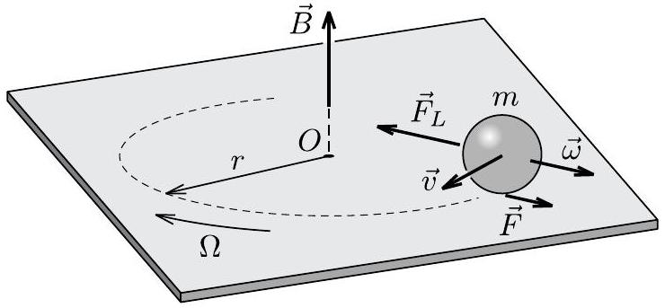
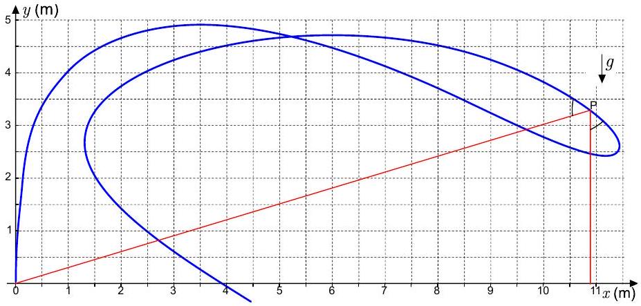

## 1 Ice pellets

a. With the given assumptions of constant droplet size and constant atmospheric density the drag force leads to a constant velocity $v$ for the fall of the droplet through the atmosphere.
We can assume that the droplet temperature $T _ { \mathrm { d } }$ above $h _ { \mathrm { A } }$ follows the atmosphere temperature profile (also see below) and remains constant and equal to $T _ { 0 } = 0 ^ { \circ } \mathrm { C }$ during the melting below that height.
For small temperature differences $\Delta T = T - T _ { \mathrm { d } }$ the heat exchange rate is proportional to this difference $\mathrm { d } Q / \mathrm { d } t = \kappa \Delta T$. The factor $\kappa$ depends on the droplet geometry and its velocity, as well as on the air density. Since these are constant $\kappa = \mathrm { const }$.
In the region between $h _ { \mathrm { A } }$ and $h _ { \mathrm { B } }$ the droplet is therefore heated at a rate
$$
\begin{equation*}
\mathrm { d } Q = \kappa \left( T - T _ { 0 } \right) \mathrm { d } t = - \kappa \left( T - T _ { 0 } \right) \frac { \mathrm { d } h } { v } , \tag{1}
\end{equation*}
$$
The total heat transfer between $h _ { \mathrm { A } }$ and $h _ { \mathrm { B } }$ is
$$
\begin{equation*}
Q = \frac { \kappa A } { v } = m L , \tag{2}
\end{equation*}
$$
where $A = 5.0$ km °C is the area between the temperature curve and the height-axis in the region between heights $h _ { \mathrm { A } }$ and $h _ { \mathrm { B } }$. The right hand side equates the heat with the latent heat necessary to completely melt the ice droplet of mass $m$.
In the region below $h _ { \mathrm { B } }$ the liquid droplet partially freezes again. During this process the temperature is again constant. The mass fraction $\eta$ of liquid freezing before reaching the ground can again be derived from the area $A ^ { \prime } = 4.0 \mathrm {~km} { } ^ { \circ } \mathrm { C }$ between the curve and the height-axis.
$$
\begin{equation*}
Q ^ { \prime } = - \frac { \kappa A ^ { \prime } } { v } = - \eta m L , \tag{3}
\end{equation*}
$$
Dividing (3) by (2) gives the mass fraction
$$
\begin{equation*}
\eta = \frac { A ^ { \prime } } { A } = \frac { 4 } { 5 } = 0.80 . \tag{4}
\end{equation*}
$$
b. If the temperature profile follows the dashed line the droplet will completely melt and the heat transferred from the atmosphere will heat it up. Since the latent heat of melting is much bigger than the specific heat of water times some degrees of temperature variation the temperature of the liquid droplet will closely follow the temperature of the atmosphere eventually. Its temperature at ground level should therefore be close to 8 °C.
For a better estimate let us introduce a new coordinate $x$ whose origin is at the height, where the droplet is completely molten (somewhat higher than $h _ { \mathrm { B } }$ ), and which is oriented downwards. For the change in temperature of the droplet we then have
$$
\begin{equation*}
m c _ { \text {water } } \frac { \mathrm { d } T _ { \mathrm { d } } } { \mathrm {~d} t } = m c _ { \text {water } } v \frac { \mathrm {~d} T _ { \mathrm { d } } } { \mathrm {~d} x } = \kappa \left( T - T _ { \mathrm { d } } \right) , \tag{5}
\end{equation*}
$$
where the temperature of the atmosphere is given by $T ( x ) = T ( x = 0 ) + 2.0 ^ { \circ } \mathrm { C } \mathrm { km } ^ { - 1 } x = : T ( x = 0 ) + b x$.

For the difference $\Delta T = T - T _ { \mathrm { d } }$ between the atmospheric temperature and the droplet temperature we have:

$$
\begin{equation*}
\frac { \mathrm { d } \Delta T } { \mathrm {~d} x } = b - \frac { \mathrm { d } T _ { \mathrm { d } } } { \mathrm {~d} x } = b - \frac { \kappa } { m c _ { \text {water } } v } \Delta T . \tag{6}
\end{equation*}
$$

This differential equation is solved by

$$
\begin{equation*}
\Delta T = b x _ { 0 } + \text { const } \cdot \exp \left( - x / x _ { 0 } \right) , \tag{7}
\end{equation*}
$$

where $x _ { 0 } = m c _ { \text {water } } v / \kappa$. From equation (2) we find that $\frac { m v } { \kappa } = \frac { A } { L }$ such that $x _ { 0 } = \frac { c _ { \text {water } } } { L } A \approx 0.063 \mathrm {~km}$. Therefore the exponential factor in the above equation is negligible at ground level (the constant is close to 4°C) and we arrive at a temperature difference between the droplet temperature and the atmospheric temperature at ground level of

$$
\begin{equation*}
\Delta T \approx 0.13 ^ { \circ } \mathrm { C } , \quad \text { and therefore } \quad T _ { \mathrm { d } } \approx 7.9 ^ { \circ } \mathrm { C } . \tag{8}
\end{equation*}
$$

Another phenomenon, which effectively shifts atmosphere temperature as it is "felt" by the droplet is due to viscous dissipation. It can be estimated by equating the droplet potential energy loss rate $m g v$ to thermal power carried away by the circumfluent air $\kappa \Delta T ^ { * }$. This gives $\Delta T ^ { * } \sim m g v / \kappa = g A / L = 0.17 ^ { \circ } \mathrm { C }$. If both corrections were taken into account, then the droplet temperature before hitting the ground would again be $T _ { \mathrm { d } } \approx 8.0 ^ { \circ } \mathrm { C }$.

## 2 Motion of a charged ball

The forces acting on the ball are the static frictional force $\vec { F }$, the gravitational force, the normal force, and the Lorentz force $\vec { F } _ { L }$ caused by the magnetic field. None of these forces perform mechanical work on the ball, so the total kinetic energy of the ball is conserved. Due to the condition of pure rolling, the speed of the center of the ball $v$ is proportional to the angular speed $\omega$ of the rolling motion, i.e. the total kinetic energy can be expressed in terms of $v ^ { 2 }$. As a result, the speed of the center of the ball remains constant, but the direction of velocity may change.

The net Lorentz force acting on the ball can be expressed with the help of the velocity of the center of the ball $\vec { v }$ :

$$
\begin{equation*}
\vec { F } _ { L } = Q \vec { v } \times \vec { B } , \tag{1}
\end{equation*}
$$

which can be proven by summing up the magnetic forces acting on the small pieces of the ball.

Proof 1. Let us denote the charge of the $i$ th small piece by $\Delta Q _ { i }$, the position vector directed from the center of the ball to the small piece by $\vec { x } _ { i }$. The velocity of this small piece is given by

$$
\vec { v } _ { i } = \vec { v } + \vec { \omega } \times \vec { x } _ { i }
$$

so the net Lorentz force can be written as

$$
\vec { F } _ { L } = \sum _ { i } \Delta Q _ { i } \vec { v } _ { i } \times \vec { B } = \sum _ { i } \Delta Q _ { i } \vec { v } \times \vec { B } + \sum _ { i } \Delta Q _ { i } \left( \vec { \omega } \times \vec { x } _ { i } \right) \times \vec { B }
$$

The second sum gives zero, because terms containing $\vec { x } _ { i }$ and $- \vec { x } _ { i }$ cancel each other pairwise. From the first sum $\vec { v } \times \vec { B }$ can be taken out,

so at the end the net force is the same as the Lorentz force acting on a point charge moving with the velocity of center of mass

The speed of the center of the ball does not change, i.e. the net force (which is horizontal) should be perpendicular to the velocity $\vec { v }$ of the center. Since the Lorentz force is always perpendicular to $\vec { v }$, so should be the static frictional force $\vec { F }$, as well. The magnitude of $\vec { F }$ cannot depend on the position, only on the speed of the ball, so $| \vec { F } |$ must remain constant during the motion. As a result, the net force (i.e. the acceleration of the center of the ball) is constant in magnitude, so the ball's center will perform a uniform circular motion with speed $| \vec { v } | = v _ { 0 }$ (see the Figure).

Now we can write down the equation of motion of the ball. The acceleration of the center of mass is horizontal, which is caused by the static frictional force and the net Lorentz force, so with the help of equation (1) Newton's 2nd law in the radial direction can be written as

$$
\begin{equation*}
Q v B - F = m r \Omega ^ { 2 } , \tag{2}
\end{equation*}
$$

where $r$ is the radius of the circular trajectory of the center of mass and $\Omega$ is the angular speed of the circular motion. We can obtain a relationship between the two angular speeds from the condition of pure rolling:

$$
\begin{equation*}
v _ { 0 } = R \omega = r \Omega \text {. } \tag{3}
\end{equation*}
$$

The magnetic field also exerts a net torque on the charged ball. The torque is given by

$$
\vec { \tau } _ { L } = \frac { Q } { 2 m } \vec { L } \times \vec { B } ,
$$

where $\vec { L }$ is the angular momentum of the ball with respect to the center.

Proof 2. As the ball rolls on the surface, moving charges form loop currents which represent a net magnetic moment. A small piece of charge $\Delta Q _ { i }$ corresponds to current

$$
I _ { i } = \frac { | \vec { \omega } | } { 2 \pi } \Delta Q _ { i } ,
$$

so the contribution of this piece to the net magnetic moment $\vec { \mu }$ has magnitude $I _ { i } \pi x _ { i , \perp } ^ { 2 }$, where $x _ { i , \perp }$ is the distance of the small piece from the rotation axis of the ball. The direction of the net magnetic moment is parallel with the vector $\vec { \omega }$, and its magnitude can be written as the sum

$$
\vec { \mu } = \frac { 1 } { 2 } \vec { \omega } \sum _ { i } \Delta Q _ { i } x _ { i , \perp } ^ { 2 }
$$

Here we don't need to evaluate the sum (integral), if we use the analogy with the moment of inertia:

$$
\sum _ { i } \Delta m _ { i } x _ { i , \perp } ^ { 2 } = \frac { 2 } { 5 } m R ^ { 2 } \quad \longrightarrow \quad \sum _ { i } \Delta Q _ { i } x _ { i , \perp } ^ { 2 } = \frac { 2 } { 5 } Q R ^ { 2 }
$$

So the net magnetic torque acting on the ball (in the form of couples) is given by

$$
\vec { \tau } _ { L } = \vec { \mu } \times \vec { B } = \frac { 1 } { 5 } Q R ^ { 2 } \vec { \omega } \times \vec { B } = \frac { Q } { 2 m } \vec { L } \times \vec { B }
$$

The angular acceleration of the ball is caused by the frictional torque and the magnetic torque. As it can be seen from the Figure, both torques have the same direction, which is perpendicular to the ball's angular velocity. As a result, the axis of rotation of the ball precesses in the horizontal plane. To satisfy the condition of pure rolling, the angular speed of the precession must be $\Omega$. During precession the rate of change of the angular momentum is given by $| \vec { L } | \Omega$, so the equation of rotational motion for the center of the ball is

$$
\underbrace { \frac { 1 } { 5 } Q R ^ { 2 } \omega B } _ { \left| \vec { \tau } _ { L } \right| } + R F = \underbrace { \frac { 2 } { 5 } m R ^ { 2 } \omega \Omega } _ { | \vec { L } | } .
$$

From equations (2), (3) and (4) the radius and the angular velocity of the circular motion can be expressed:

$$
r = \frac { 7 } { 6 } \frac { m v _ { 0 } } { Q B } \quad \text { and } \quad \Omega = \frac { 6 } { 7 } \frac { Q B } { m } .
$$

## 3 Water hose

To begin with, let us notice that the envelope of the trajectories of balls thrown from the origin with the same launching speed $v$ at different launching angles is a parabola (1 pt), and the focus of the parabola is the launching point (1 pt).

This fact can be proved as follows (the proof is not required from the contestants). The trajectory of the ball can be expressed parametrically as $x = v \cos \alpha t , y = v \sin \alpha t - \frac { 1 } { 2 } g t ^ { 2 }$. Upon eliminating $t$ we obtain

$$
y = x \tan \alpha - \frac { g } { 2 v ^ { 2 } } x ^ { 2 } \left( 1 + \tan ^ { 2 } \alpha \right) .
$$

We can consider this as an equation for finding the angle $\alpha$ to reach the point $( x , y )$ :

$$
g x ^ { 2 } \tan ^ { 2 } \alpha - 2 v ^ { 2 } x \tan \alpha + 2 v ^ { 2 } y + g x ^ { 2 } = 0 .
$$

The points at the envelope separate the points for which the solution to this equation does exist from the points for which the solution does not exist, hence for the envelope points the discriminant of the equation must be zero,

$$
v ^ { 4 } x ^ { 2 } = g x ^ { 2 } \left( 2 v ^ { 2 } y + g x ^ { 2 } \right) \Rightarrow y = \frac { v ^ { 2 } } { 2 g } - \frac { g x ^ { 2 } } { 2 v ^ { 2 } } .
$$

What we got is a parabola, and the position of the focus can be deduced from this formula. Alternatively, the position of the focus can be deduced from the fact that light rays parallel to the axis of a parabola converge after reflection from the parabolic shape into its focus. Indeed, the touching point of the envelope with a trajectory of a ball launched at $\alpha = 45 ^ { \circ }$ must lie at $y = 0$ as this launching angle is known to provide the longest flight distance. Hence, the envelope and the $x$-axis meet at 45°, so that a vertical beam hitting the envelope at $y = 0$ is reflected by the envelope into a horizontal line. The focus must lie on that reflected beam, i.e. at $y = 0$.

The parabolic trajectory of each water parcel must touch the envelope (1 pts). Using the knowledge that the launching angles of the water parcels were never less than 45°, we conclude that the touching point must lie at $y \geq 0$ (1 pt). This can be seen from the fact that a parcel launched at 45° will meet the envelope at $y = 0$,

and increasing the launching angle will raise the touching point.

There are many ways of proving it more rigorously. For instance, one can use the fact (proved below) that the launching velocity and the tangent to the envelope at the point $A$ where the trajectory and the envelope meet are perpendicular to each other: with $\alpha + \beta = 90 ^ { \circ }$ ( $\beta$ denotes the angle between the tangent and the horizon) we conclude that increasing $\alpha$ means decreasing $\beta$, hence raising $A$. To prove that $\alpha + \beta = 90 ^ { \circ }$, let a vertically up-directed beam be reflected from the trajectory at $A$ : it will go through the focus of the trajectory which means that if we continue it through the focus and let it be reflected a second time from the same trajectory, it will propagate vertically down. The trajectory and the envelope are tangent at $A$, so the first reflection was also a reflection from the envelope and the reflected beam must go through the focus of the envelope, i.e. the launching point $O$. Point $O$ lies on the trajectory, so the second reflection point must be $O$. As a result of the two reflections, the beam was diverted by 180° which means that the double sum of the incidence angles must have been 180°, and hence $2 \alpha + 2 \beta = 180 ^ { \circ }$.

The water parcels close to the origin are clearly yet to reach the envelope, and those parcels below the ground level have clearly passed the point where they touched the envelope. Since the parcels form a continuous curve, there must be at least one point $P$ which is exactly at the envelope 1 pts).

There are two ways of finding the position of the point $P$. The first approach is as follows. Notice that at $P$, the water curve is tangent to the envelope (1 pt). Hence, vertical line drawn through $P$ will be reflected by the water curve so that it will go through the focus $O$ (1 pt). So, we need to find by trial and error such a point $P$ on the upper segment of the water curve that the line $O P$ and a vertical line drawn through $P$ will form equal angles with the water curve at $P$ (finding the position of $P$ with a reasonable accuracy: 1 pt), see the figure below.

Alternatively, we can use the fact that for any point on a parabola, its distance from the focus plus its distance from a horizontal line is constant. So, for an arbitrary point $Q = ( x , y )$ on the envelope, $y + \sqrt { x ^ { 2 } + y ^ { 2 } } = 2 H$, where $H$ is a constant, and for any point beneath it, $y +$ $\sqrt { x ^ { 2 } + y ^ { 2 } } < 2 H$. Hence, among all the points at the water curve, the point $P$ has the largest value of $y + \sqrt { x ^ { 2 } + y ^ { 2 } }$ (2 pts). We can evaluate $y + \sqrt { x ^ { 2 } + y ^ { 2 } }$ for a series of points at the water curve and find the one with the largest value (finding the position of $P$ with a reasonable accuracy: 1 pt).

Once we have found the point $P$, we can easily find the height of the topmost point of the envelope due to the equality $y + \sqrt { x ^ { 2 } + y ^ { 2 } } = 2 H _ { P }$ : for the topmost point, $x = 0$ so that its $y$-coordinate $2 y = 2 H _ { P }$, hence $y = H _ { P }$; The topmost point of the envelope would be reached by a water parcel launched vertically, so $v ^ { 2 } = 2 g H _ { P }$, and $v = \sqrt { 2 g H _ { P } }$ (1 pt). From the figure we can find $2 H _ { P } =$ $\left( 3.3 + \sqrt { 10.8 ^ { 2 } + 3.3 ^ { 2 } } \right) \mathrm { m } \approx 14.6 \mathrm {~m}$ so that $v \approx 12 \mathrm {~m} / \mathrm { s } ( \mathbf { 1 } \mathbf { p t } )$.
