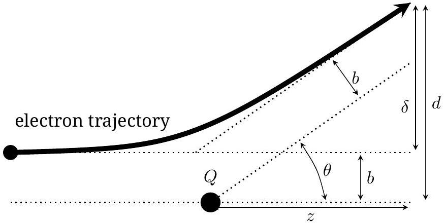

## 1 Hidden Charge

### 1.1 Finding $x _ { Q }$ and $y _ { Q }$

The first step is to locate the $x$ and $y$ coordinates of the test charge. Two approaches are illustrated here.

### 1.1.1 Method 1

Select any initial launch point, and keep it fixed. $\left( x _ { i } , y _ { i } \right) =$ $( 0,0 )$ is a good choice. Vary the accelerating voltage in order to obtain several screen hits; plot these on a graph. Draw a line through the points, extended in both directions. The target charge must lie on this line.

Repeat with a different launch point. $\left( x _ { i } , y _ { i } \right) = ( 0,10 )$ is a good choice. The two lines will intersect, this is likely the location of the target charge.

Select a third launch point, one that would be located approximately perpendicular to either of the first two lines. $\left( x _ { i } , y _ { i } \right) = ( 0 , - 10 )$ is a good choice. All three lines should intersect at a single point; that's the location of the target charge, $\left( x _ { Q } , y _ { Q } \right)$

### 1.1.2 Method 2

This method is much less accurate. Select a fixed value for $x _ { i }$, and vary $y _ { i }$. Observe $y _ { f }$. There will be a value of $y _ { i }$ such that $y _ { f }$ is almost the same, while on either side of it, $y _ { f }$ will shift away from $y _ { i }$. This special value such that $y _ { i } \approx y _ { f }$ is the location $y _ { Q }$. Repeat the process with a fixed $y _ { i }$ and a varying $x _ { i }$. Not that this technique won't work if the target charge is outside the bounds of the screen!

A student using this method cannot get full marks for the problem.

### 1.2 Determining $Q$ and $z _ { Q }$

Focus on the Rutherford equation. It is convenient to write it in the form

$$
\tan \frac { \theta } { 2 } = \frac { k q Q } { 2 E b }
$$

One choice is to try and keep $\theta$ fixed, and vary $E$ and $b$. The other choice is to keep $b$ fixed and small, and vary $E$. Each approach has benefits and drawbacks.

The Rutherford scattering equation diagram can also be drawn as below

### 1.2.1 Method 1: keep $\theta$ fixed

The screen distance $d$ is given by the relation

$$
d \cos \theta = z \sin \theta + b
$$

This is only strictly true if the electron has reached the scattered asymptote, otherwise, the measured value of $d$ will be larger than the true value.

For a fixed value of $\theta$, which will happen if the product $b E$ is kept constant, graph $b$ vertically against $d$ horizontally. The slope of the graph will yield the value of $\cos \theta$, the intercept will yield $z \sin \theta$. The sign of $z$ is unimportant, as it was implied that it is behind the screen. Return to Rutherford's equation to find $Q$.

One can improve the results by selecting values of $b$ that are small, as this forces the electron to be closer to the scattered asymptote.

## Method 1A: focus on $\delta$

One might think that it is easier to focus on the quantity $\delta$, as it is directly measurable. The problem is that the intercept between the two asymptotes of the trajectory is not a distance $z$ from the screen, it is farther by an amount $b / \tan ( \theta / 2 )$. Neglecting this correction will lead to $\delta = z \tan \theta$ from which the student can only find the product $z Q$.

Including the correction yields a really ugly looking expression

$$
\frac { \delta } { \tan \theta } = z + \frac { b } { \tan ( \theta / 2 ) }
$$

Most efforts to reduce this expression will return the student to some equivalent of the previous paragraph, with only a value of $z Q$ obtainable.

### 1.2.2 Method 2: keep $b$ fixed and small

A second approach is to use the twice angle formula for the tangent:

$$
\tan 2 \alpha = \frac { 2 \tan \alpha } { 1 - \tan ^ { 2 } \alpha }
$$

Let $2 \alpha = \theta$, and then combining with the Rutherford equation,

$$
\tan \theta = \frac { 2 \gamma E } { \gamma ^ { 2 } E ^ { 2 } - 1 }
$$

where $\gamma = 2 b / k q Q$. If $b$ is small compared to $d$, then $\tan \theta \approx d / z$. Combining, one gets the linear equation

$$
\frac { 2 E } { d } = \frac { \gamma } { z } E ^ { 2 } - \frac { 1 } { z \gamma }
$$

Plotting $2 E / d$ vertically against $E ^ { 2 }$ horizontally ought yield a straight line with a slope $\gamma / z$ and an intercept $1 / z \gamma$. The challenge here is the Gaussian error in the initial beam location; as $b$ gets smaller that relative error becomes more significant. If there were no initial beam spread, then this approach would be exact in the limit $b \rightarrow 0$.

## Method 2A: focus on $\delta$

As before, this approach has the disadvantage that the intercept point of the trajectory asymptotes is a function of $b$ and $\theta$. Neglecting this error, a student could graph $2 E / \delta$ vertically against $E ^ { 2 }$ horizontally. The student has gained some in that the error of $b / \cos \theta$ has been removed from the expression for $d$, but an error of $b / \tan ( \theta / 2 )$ has been added to the expression for $z$. In this case, small angles are bad.

Still, if there were no initial beam spread, this approach would be exact in the limit $b \rightarrow 0$.

### 1.2.3 Method 3: finding only the product $z Q$

It is tempting to start with the approximation $\tan ( \theta / 2 ) =$ $\delta / 2 z$. Doing so reduces Rutherford's formula to

$$
\delta = \frac { k q Q z } { E b }
$$

A student could keep $\delta$ fixed (though that's hard!), $E$ fixed, or $b$ fixed, and plot the appropriate combinations of the remaining two variables to get a straight line. From this they can deduce the product $Q z$.

A student would also arrive at this point by neglecting the intercept of method 2. In fact, since that intercept is extrapolated and sensitive to error, it is likely to have the wrong sign, and in that case the student has effectively ended up here.

### 1.3 Grading Schemes

### 1.3.1 Part 1 (1 p)

Attempting to locate $x _ { Q }$ and $y _ { Q }$

| Finding $x$ and $y$ : Method 1 |  |
| :--- | :--- |
| At least 3 lines (0.5p), only 2 lines (0.3p), only 1 line (0.1p) | 0.5 p |
| At least 4 data points on each line (0.3p); at least 3 points each line (0.2p); at least 2 points on each line (0.1p). The initial point can be one the data points. | 0.3 p |
| Points spread to fill $\approx 1 / 3$ the plot on each line (0.2p); fill $\approx 1 / 5$ on each line (0.1p) | 0.2 p |
| Total possible for part 1: | 1.0 p |

If a student elects to solve the intersection of two (or more) lines, when each line has only two data points, then they get (0.4p) for two lines, (0.6p) for three, (0.7p) for four, and (0.8p) for five or more. Then assess the spread condition.

| Finding $x$ and $y$ : Method 2 |  |
| :--- | :--- |
| Using method 2 | 0.4 p |
| Total possible for part 1: | 0.4 p |

| Finding $x$ and $y$ : Both Methods |  |
| :--- | :--- |
| $x$ in range $5.3 \rightarrow 5.5 \mathrm {~cm} ( 1.0 \mathrm { p } )$; in range $5.2 \rightarrow 5.6 \mathrm {~cm} ( 0.7 \mathrm { p } )$; in range $5.1 \rightarrow 5.7$ cm (0.4p); in range 5.0 → 5.8 cm (0.1p) | 1.0 p |
| $y$ in range $- 2.5 \rightarrow - 2.7 \mathrm {~cm}$ (1.0p); in range $- 2.4 \rightarrow - 2.8 \mathrm {~cm} ( 0.7 \mathrm { p } )$; in range $- 2.3 \rightarrow - 2.9 \mathrm {~cm} ( 0.4 \mathrm { p } )$; in range $- 2.2 \rightarrow - 3.0 \mathrm {~cm}$ (0.1p) | 1.0 p |
| $x$ and $y$ values each within one student stated error of (5.4, -2.6) (0.5p); within one stated error for one value, and within two stated errors for the other (0.3p); within two stated errors for both values (0.2p); within two stated errors for one value (0.1p) | 0.5 p |
| Statement of error for both $x$ and $y$ clearly reflected and consistent in graphical picture or math (0.5p); statement of error only concerned with 1mm screen resolution or 1 mm beam resolution (0.1 p) for each | 0.5 p |
| Total possible for part 2: | 3.0 p |

### 1.3.3 Part 3 (1 p)

Collection of data and preliminary computations for variables

| Finding $z$ and $Q$ : Both Methods |  |
| :--- | :--- |
| student has collected a dataset that could be used to find $b$ and $d$ | 0.1 p |
| data set shows $E$ | 0.1 p |
| data set shows initial and final $x$ and $y$ | 0.2 p |
| data set correctly computes $b$ | 0.1 p |
| data set correctly computes $d$ or $\delta$ | 0.1 p |
| data set has at least 8 measurements (0.4p); data set has at least 4 measurements (0.3p) | 0.4 p |
| Total possible for part 3: | 1.0 p |

Notes: $E$ can be measured in Joules or eV; if a student only records voltage and uses it throughout the problem in place if $E$, there is no penalty. If a student fails to properly record both the initial and final values for $x$ and $y$ in each measurement, then they do not get the 0.2 p above. If they do a set of measurements where $x$ or $y$ initial is held constant, they only need to record it once, but they must make it clear where it applies. Results of "miss" should be recorded, but do not count toward the measurement count of 8 or 4. There is no penalty for failing to record "miss".

### 1.3.4 Part 4 (2.5 p)

Selection of an approach to solve, deriving the math and physics; and developing a plot. This section is not concerned with the accuracy of the $z _ { Q }$ and $Q$ results; that will be assessed in part 5.

### 1.3.2 Part 2 (3 p)

Accuracy of result for $X _ { Q }$ and $y _ { Q }$

| Finding $z$ and $Q$ : Method 1 or 1a |  |
| :--- | :--- |
| derive correct relationship between $d$ (or $\delta$ ) and $b ( 1.0 \mathrm { p } )$; if there is exactly one math/geometry error (0.6p); if there are exactly two such errors (0.2p); if there are no such errors but exactly one physics error (0.4p); neglecting the correction in method 1a is a (-0.5p) deduction | 1.0 p |
| recognise that $b E$ must be constant | 0.3 p |
| a plot exists of $b$ versus $d$ (or $\delta$ ) | 0.6 p |
| Use slope of plot to find $\cos \theta$. Don't worry about accuracy here; only that they try. | 0.3 p |
| Use intercept of plot to find $z$. Don't worry about accuracy here; only that they try. | 0.3 p |
| Total for part 4: | 2.5 p |

| Finding $z$ and $Q$ : Method 2 or 2a |  |
| :--- | :--- |
| derive correct relationship between $E$ and $d$ or $\delta ( 1.3 \mathrm { p } )$; if there is exactly one math/geometry error (1.0p); if there are exactly two such errors (0.4p); if there are no such errors but exactly one physics error (0.7p) | 1.3 p |
| a plot exists of $2 E / d$ (or $2 E / \delta$ ) versus $E ^ { 2 }$ | 0.6 p |
| Use slope and intercept of plot to find $\gamma$ (or equivalent). Don't worry about accuracy here; only that they try. | 0.3 p |
| Use slope and intercept of plot to find $z$ (or equivalent). Don't worry about accuracy here; only that they try. | 0.3 p |
| Total for part 4: | 2.5 p |

| Finding only the product $z Q$ : Method 3 |  |
| :--- | :--- |
| derive correct relationship between $E$ and $\delta$ (1.3p); if there is exactly one math/geometry error (1.0p); if there are exactly two such errors (0.4p); if there are no such errors but exactly one physics error (0.7p) | 1.3 p |
| a plot exists of $\delta$ versus $1 / E$, or $\delta$ versus $1 / b$, or $E$ versus $1 / b$; the remaining variable being held constant. | 0.6 p |
| Use slope of plot to find $Q z$ (or equivalent). Don't worry about accuracy here; only that they try. | 0.3 p |
| Total for part 4: | 2.2 p |

For the plots, worth up to 0.6p, deduct -0.1p for each axis without a label, -0.1p for each axis without a scale or scale done incorrectly, -0.1p for each incorrectly plotted point, -0.1p for best fit line not being straight, but the total plot score cannot go negative.

For students who solve the linear equation algebraically and don't show a plot: there needs to be a clear indication that they used linear regression (0.2p); a computed correlation coefficient or equivalent to assess the goodness/accuracy of fit (0.2p); a clear assessment that a linear fit (as opposed to a quadratic, or exponential, or other) was indeed merited (0.2p).

A student attempting only method 3 cannot get full marks for this part.

Student who attempt more than one method will ordinarily only receive the marks for the method that yields them the higher score.

### 1.3.5 Part 5 (2.5 p)

Assessing the accuracy of the result for $z _ { Q }$ and $Q$

| Finding $z$ and $Q$ : Methods 1 or 2 |  |
| :--- | :--- |
| $\| z \|$ in range $11 \rightarrow 12 \mathrm {~cm} ( 1.0 \mathrm { p } )$; in range $10 \rightarrow 13 \mathrm {~cm} ( 0.7 \mathrm { p } )$; in range 8 → 14 cm (0.4p); in range 6 → 20 cm (0.1p) | 1.0 p |
| $Q$ is negative! | 0.1 p |
| $\| Q \|$ in range $70 \rightarrow 100 \mathrm { pC } ( 0.9 \mathrm { p } )$; in range $50 \rightarrow 150 \mathrm { pC } ( 0.7 \mathrm { p } )$; in range $10 \rightarrow 500$ pC (0.4p); in range $1 \rightarrow 1000 \mathrm { pC } ( 0.1 \mathrm { p } )$ | 0.9 p |
| $z$ and $Q$ values each within two student stated error of $\| z \| = 11.5 \mathrm {~cm}$ and $\| Q \| =$ 86 pC (0.3p); within two stated errors for one value (0.2p); error stated, but out of bounds for both (0.1p) | 0.3 p |
| Statement of error for both $z$ and $Q$ clearly reflected and consistent in graphical picture or math, addresses or comments on both random error and systematic error of approxmation (0.2p); statement of error only concerned with random or systematic, but not both (0.1p) | 0.2 p |
| Total possible for part 5: | 2.5 p |

| Finding only $z Q$ : any method |  |
| :--- | :--- |
| $Q$ is negative! | 0.1 p |
| $\| z Q \|$ in range $9.7 \rightarrow 10.1 \mathrm { pCm } ( 0.9 \mathrm { p } )$; in range $9.5 \rightarrow 10.3 \mathrm { pCm } ( 0.7 \mathrm { p } )$; in range $9 \rightarrow$ 11 pCm (0.4p); in range 5 → 20 pCm (0.1p) | 0.9 p |
| $z Q$ values within one student stated error of $\| z Q \| = 9.9 \mathrm { pCm }$ (0.3p); within two stated errors (0.2p); error stated, but out of bounds more than twice (0.1p) | 0.3 p |
| Statement of error for $z Q$ clearly reflected and consistent in graphical picture or math, addresses or comments on both random error and systematic error of approximation (0.2p); statement of error only concerned with random or systematic, but not both (0.1p) | 0.2 p |
| Total possible for part 5: | 1.5 p |

The sources for error are (1) beam spread of 0.5 mm , (2) pixel resolution of 1mm, (3) approximations for defining the tangent, (4) approximations for final trajectory approaching the asymptote, (5) approximations for intersections of the asymptote. The first two are random error; the last three are systematic.

A student that computes $z , Q$, and $z Q$ should be assessed for each of the three (1.0p each) for accuracy against expected value, but will only receive the highest two results.
