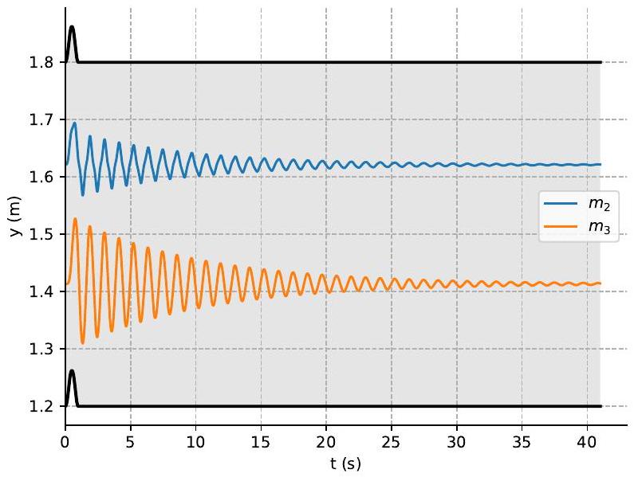
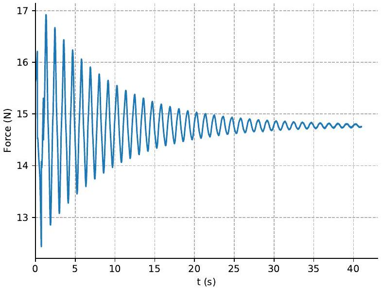
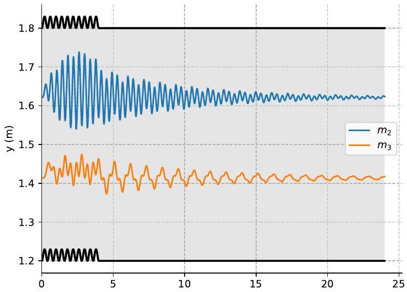
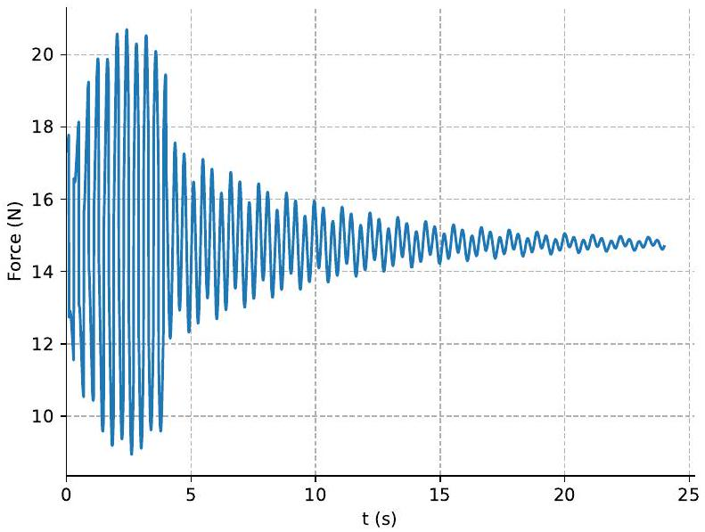

## 2 Black box

Let the tension forces in the two springs be $F _ { 1 }$ and $F _ { 2 }$, respectively. Let the height of the ceiling of the box be $y _ { 1 }$ and let the heights of the masses be $y _ { 2 }$ and $y _ { 3 }$ (we will assume for simplicity that the masses have zero height). Let $a _ { 1 } , a _ { 2 } , a _ { 3 }$ be the respective accelerations. We get the following equations of motion (ignoring all drag forces):

$$
\begin{gathered}
m _ { 1 } a _ { 1 } = F - F _ { 1 } - m _ { 1 } g \\
m _ { 2 } a _ { 2 } = F _ { 1 } - F _ { 2 } - m _ { 2 } g \\
m _ { 3 } a _ { 3 } = F _ { 2 } - m _ { 3 } g
\end{gathered}
$$

Since the springs are nonlinear, $F _ { 1 } \neq k _ { 1 } \left( y _ { 1 } - y _ { 2 } \right)$ and $F _ { 2 } \neq k _ { 2 } \left( y _ { 2 } - y _ { 3 } \right)$ in general, but we know that for small displacements near equilibrium $k _ { 1 } = \frac { \Delta F _ { 1 } } { \Delta \left( y _ { 1 } - y _ { 2 } \right) }$ and $k _ { 2 } =$ $\frac { \Delta F _ { 2 } } { \Delta \left( y _ { 2 } - y _ { 3 } \right) }$.

### 2.1 Finding $m _ { 1 } + m _ { 2 } + m _ { 3 }$

When the system is at rest and at equilibrium, then the force needed to hold the box is the total gravitational force $F _ { 0 } = \left( m _ { 1 } + m _ { 2 } + m _ { 3 } \right) g$ (we can get the same result if we plug in $a _ { 1 } = a _ { 2 } = a _ { 3 } = 0$ to the equations of motion).

To measure $F _ { 0 }$, we find the value of $F$ when the box is at rest $\left( a _ { 1 } = 0 \right)$. We notice that the force is constant which means that the system is initially already in equilibrium.

After averaging 10 first values we get $F _ { 0 } \approx 14.774 \mathrm {~N}$ and

$$
m _ { 1 } + m _ { 2 } + m _ { 3 } = \frac { F _ { 0 } } { g } = \frac { 14.774 \mathrm {~N} } { 9.81 \mathrm {~N} / \mathrm { kg } } \approx 1.506 \mathrm {~kg} .
$$

Exact answer: 1.506 kg.

| Finding $m _ { 1 } + m _ { 2 } + m _ { 3 }$ |  |  |
| :--- | :--- | :--- |
| 1a | Notice that $F = g \sum m _ { i }$ when $a _ { 1 } = 0$ | 0.5 |
| 1b | Measurement for $F _ { 0 } ( 14.77 \pm 0.10 \mathrm {~N} )$ 0 points for only having a measurement without an idea how to use it | 0.3 |
| 1c | $\sum m _ { i }$ in range $1.51 \pm 0.01 \mathrm {~kg}$ | 0.2 |
| Total: |  | 1.0 |

Note: Measurement for $F _ { 0 }$ is needed for full points, even if $\sum m _ { i }$ is correct. Solutions with raw data missing get 0.7 points. Solutions using $\frac { F _ { 0 } } { g }$ implicitly as the sum of masses get 0.2 points from 1c.

### 2.2 Finding $m _ { 1 }$

We get from the first equation of motion that $F = m _ { 1 } a _ { 1 } +$ $m _ { 1 } g + F _ { 1 }$. The spring force $F _ { 1 }$ depends only on the positions (and is the same at the beginning of every experiment), so the force $F$ at the beginning of the experiment depends only on the acceleration.

Therefore, we can measure how much the initial force changes with acceleration to get $m _ { 1 }$. We will use maximum acceleration $\left( 30 \mathrm {~m} / \mathrm { s } ^ { 2 } \right)$ for highest accuracy. The average of three values is $F _ { 30 } \approx 40.487 \mathrm {~N}$, so

$$
m _ { 1 } = \frac { F _ { 30 } - F _ { 0 } } { a } = \frac { ( 40.487 - 14.774 ) \mathrm { N } } { 30 \mathrm {~m} / \mathrm { s } ^ { 2 } } \approx 0.857 \mathrm {~kg} .
$$

We also conclude that $m _ { 2 } + m _ { 3 } = 0.649 \mathrm {~kg}$.
(To even increase accuracy, one could compare $F _ { 30 }$ and $F _ { - 30 }$ and find their difference.)

Exact answer: 0.857 kg.

| Finding $m _ { 1 }$ |  |  |
| :--- | :--- | :--- |
| 2a | $F = m _ { 1 } a _ { 1 } + m _ { 1 } g + F _ { 1 }$ or any equivalent equation of motion (max points even if $F _ { 1 }$ has been incorrectly substituted with $\left. k _ { 1 } \left( y _ { 1 } - y _ { 2 } \right) \right)$ | 0.5 |
| 2b | Idea that $m _ { 1 } = \frac { \Delta F } { \Delta a _ { 1 } }$ | 0.5 |
| 2c | Using $\Delta a _ { 1 } \geq 10 \mathrm {~m} / \mathrm { s } ^ { 2 }$ | 0.2 |
| 2d | $m _ { 1 }$ in range $0.857 \pm 0.002 \mathrm {~kg}$ | 0.8 |
|  | $m _ { 1 }$ in range $0.857 \pm 0.010 \mathrm {~kg}$ | 0.6 |
|  | $m _ { 1 }$ in range $0.857 \pm 0.050 \mathrm {~kg}$ | 0.3 |
| Total: |  | 2.0 |

Note: Using free-fall ( $a _ { 1 } = - g$ ) without repeated measurements gets 0 points from 2c. Full points are given if $\Delta a _ { 1 } < 10 \mathrm {~m} / \mathrm { s } ^ { 2 }$ but several measurements are used that give at least as good accuracy overall.

### 2.3 Finding $k _ { 1 }$

### 2.3.1 Method 1: Change of force after a fast movement of the box

We will quickly accelerate and then decelerate the box (to avoid drag forces). When we change the height of the box quickly and the time is short enough, we can assume that the second mass stays approximately at rest.
(Formally, if $\Delta y _ { 1 } = \frac { a _ { 1 } } { 2 } t ^ { 2 }$, then $m _ { 2 } a _ { 2 } = k _ { 1 } \Delta y _ { 1 } - k _ { 1 } \Delta y _ { 2 } -$ $\Delta F _ { 2 } \leq k _ { 1 } \Delta y _ { 1 }$, therefore $a _ { 2 } \leq \frac { k _ { 1 } } { 2 m _ { 2 } } t ^ { 2 } \cdot a _ { 1 }$. The assumption holds if $\frac { k _ { 1 } } { 2 m _ { 2 } } t ^ { 2 } \ll 1$.)

Therefore, if we accelerate the box with acceleration $a _ { 1 }$ for time $t$ and then with $- a _ { 1 }$ for time $t$, then $\Delta F \approx$ $k _ { 1 } \Delta y _ { 1 } = k _ { 1 } a _ { 1 } t ^ { 2 }$.

To have the best accuracy we will do two experiments with $a _ { 1 } = 30 \mathrm {~m} / \mathrm { s } ^ { 2 }$ and $a _ { 1 } = - 30 \mathrm {~m} / \mathrm { s } ^ { 2 }$, respectively. We will use $t = 0.01 \mathrm {~s}$ (smallest time possible). We will also repeat each experiment 5 times. After averaging the results, we get the forces at $2 t = 0.02 \mathrm {~s}$ to be $F _ { \mathrm { u } } \approx 14.890 \mathrm {~N}$ and $F _ { \mathrm { d } } \approx 14.652 \mathrm {~N}$. Therefore

$$
k _ { 1 } \approx \frac { F _ { \mathrm { u } } - F _ { \mathrm { d } } } { 2 a _ { 1 } t ^ { 2 } } = \frac { ( 14.890 - 14.652 ) \mathrm { N } } { 2 \cdot 30 \mathrm {~m} / \mathrm { s } ^ { 2 } \cdot ( 0.01 \mathrm {~s} ) ^ { 2 } } \approx 39.7 \mathrm {~N} / \mathrm { m }
$$

Exact answer: $39.2 \mathrm {~N} / \mathrm { m }$.

Finding $k _ { 1 }$, Method 1
| 3.1a | Idea to use method | 0.5 |
| :--- | :--- | :--- |
| 3.1b | Notice that if $t$ is small, then $\Delta y _ { 1 } \gg \Delta y _ { 2 }$ | 0.5 |
| 3.1c | Correct formula for $k _ { 1 }$ | 0.5 |
| 3.1 d | At least 3 measurements | 0.1 |
| 3.1 e | $\Delta a _ { 1 } \geq 30 \mathrm {~m} / \mathrm { s } ^ { 2 }$ | 0.2 |
| 3.1f | $2 t \leq 0.08 \mathrm {~s}$ | 0.2 |
| 3.1g | $k _ { 1 }$ in range $39.2 \pm 1.0 \mathrm {~N} / \mathrm { m }$ | 1.0 |
|  | $k _ { 1 }$ in range $39 \pm 4 \mathrm {~N} / \mathrm { m }$ | 0.7 |
|  | $k _ { 1 }$ in range $39 \pm 8 \mathrm {~N} / \mathrm { m }$ | 0.4 |
|  | $k _ { 1 }$ in range $39 \pm 15 \mathrm {~N} / \mathrm { m }$ | 0.2 |
| Total: |  | 3.0 |

### 2.3.2 Method 2: Change of force while accelerating the box

We will accelerate the box with constant acceleration $a _ { 1 }$ and similarly as in the previous method conclude that $\Delta F \approx \frac { k _ { 1 } a _ { 1 } } { 2 } t ^ { 2 }$ when $t$ is small. This method is, however, less accurate than the previous method because drag force is nonnegligible for large values of $a _ { 1 }$ but the resolution of $\Delta F$ is small for small values of $a _ { 1 }$.

Choosing, for example, $a _ { 1 } = 30 \mathrm {~m} / \mathrm { s } ^ { 2 } , t = 0.02 \mathrm {~s}$ and averaging 5 values gives $F _ { t = 0 } \approx 40.482 \mathrm {~N}$ and $F _ { t = 0.02 } \approx$ 40.792 N and

$$
k _ { 1 } \approx \frac { 2 \Delta F } { a _ { 1 } t ^ { 2 } } = \frac { 2 \cdot ( 40.792 - 40.482 ) \mathrm { N } } { 30 \mathrm {~m} / \mathrm { s } ^ { 2 } \cdot ( 0.02 \mathrm {~s} ) ^ { 2 } } \approx 51.7 \mathrm {~N} / \mathrm { m }
$$

The answer is ~30\% larger than the correct answer because the drag force of the box at $t = 0.02 \mathrm {~s}$ is approximately 0.08 N .

A better choice would be $a _ { 1 } = 5 \mathrm {~m} / \mathrm { s } ^ { 2 }$ and $t = 0.02 \mathrm {~s}$. Averaging 5 values gives $F _ { t = 0 } \approx 19.058 \mathrm {~N}$ and $F _ { t = 0.02 } \approx$ 19.100 N and

$$
k _ { 1 } \approx \frac { 2 \Delta F } { a _ { 1 } t ^ { 2 } } = \frac { 2 \cdot ( 19.100 - 19.058 ) \mathrm { N } } { 5 \mathrm {~m} / \mathrm { s } ^ { 2 } \cdot ( 0.02 \mathrm {~s} ) ^ { 2 } } \approx 42.0 \mathrm {~N} / \mathrm { m }
$$

The drag force has a much smaller effect (approximately 0.002 N).

Finding $k _ { 1 }$, Method 2
| 3.2a | Idea to use method | 0.5 |
| :--- | :--- | :--- |
| 3.2b | Notice that if $t$ is small, then $\Delta y _ { 1 } \gg \Delta y _ { 2 }$ | 0.5 |
| 3.2c | Correct formula for $k _ { 1 }$ | 0.5 |
| 3.2d | At least 3 measurements | 0.1 |
| 3.2e | $2 \mathrm {~m} / \mathrm { s } ^ { 2 } \leq a _ { 1 } \leq 10 \mathrm {~m} / \mathrm { s } ^ { 2 }$ | 0.2 |
| 3.2f | $t \leq 0.08 \mathrm {~s}$ | 0.2 |
| 3.1g | $k _ { 1 }$ in range $39.2 \pm 1.0 \mathrm {~N} / \mathrm { m }$ | 1.0 |
|  | $k _ { 1 }$ in range $39 \pm 4 \mathrm {~N} / \mathrm { m }$ | 0.7 |
|  | $k _ { 1 }$ in range $39 \pm 8 \mathrm {~N} / \mathrm { m }$ | 0.4 |
|  | $k _ { 1 }$ in range $39 \pm 15 \mathrm {~N} / \mathrm { m }$ | 0.2 |
| Total: |  | 3.0 |

Note: A correct answer without any justification or obtained with a physically nonsensible method gives 0 points.

### 2.3.3 Method 3: Estimating $y _ { 1 } - y _ { 2 }$ at equilibrium and using $F _ { 1 } \approx k _ { 1 } \left( y _ { 1 } - y _ { 2 } \right)$

Although the springs are nonlinear, we can estimate $k _ { 1 }$ by $k _ { 1 } \approx \frac { F _ { 1 } } { y _ { 1 } - y _ { 2 } }$ which would be true if the springs were perfectly linear.

At equilibrium

$$
F _ { 1 } = F _ { 0 } - m _ { 1 } g \approx 14.774 \mathrm {~N} - 0.857 \cdot 9.81 \mathrm {~N} \approx 6.367 \mathrm {~N}
$$

If we accelerate the box quickly downwards, then by measuring the time $t$ for the box to collide with mass 2, we can estimate the initial value of $y _ { 1 } - y _ { 2 }$ by $\Delta y _ { 1 } = \frac { a _ { 1 } } { 2 } t ^ { 2 }$.

Using binary search we can find that $t \leq 0.13 \mathrm {~s}$ if $\left| a _ { 1 } \right| \geq$ $26.7 \mathrm {~m} / \mathrm { s } ^ { 2 }$ and $t \geq 0.13 \mathrm {~s}$ if $\left| a _ { 2 } \right| \leq 26.6 \mathrm {~m} / \mathrm { s } ^ { 2 }$.

Therefore

$$
y _ { 1 } - y _ { 2 } \approx \frac { 26.7 \mathrm {~m} / \mathrm { s } ^ { 2 } } { 2 } \cdot ( 0.13 \mathrm {~s} ) ^ { 2 } \approx 0.226 \mathrm {~m}
$$

and

$$
k _ { 1 } \approx \frac { F _ { 1 } } { y _ { 1 } - y _ { 2 } } = \frac { 6.367 \mathrm {~N} } { 0.226 \mathrm {~m} } \approx 28.2 \mathrm {~N} / \mathrm { m }
$$

This method underestimates the value both due to nonlinearity of springs and because it overestimates $y _ { 1 } -$ $y _ { 2 }$ (the actual value is 0.179 m).

Finding $k _ { 1 }$, Method 3
| 3.3a | Idea to use method | 0.5 |
| :--- | :--- | :--- |
| 3.3b | Correctly estimate $y _ { 1 } - y _ { 2 }$ | 0.5 |
| 3.3c | Correct formula for $k _ { 1 }$ | 0.5 |
| Total: |  | 1.5 |

Note: This method is worth 1.5 points since it is very inaccurate. Estimating the distance $y _ { 1 } - y _ { 2 }$ without an idea how to use it gives 0 points.

Method for eye-balling $k _ { 1 }$ from slow normal mode frequency assuming a rigid connection between $m _ { 2 }$ and $m _ { 3 }$ was rewarded with $0.5 + 0.5$ points for idea and formula if significant progress was made (a reasonable value for the normal mode period and $k _ { 1 }$ or $\frac { k _ { 1 } } { m _ { 2 } + m _ { 3 } }$ was found). Simply stating $T = 2 \pi \sqrt { \frac { m _ { 2 } + m _ { 3 } } { k _ { 1 } } }$ gave 0 points.

### 2.4 Finding $m _ { 2 } , m _ { 3 }$ and $k _ { 2 }$

### 2.4.1 Method 1: Finding natural frequencies

This method is very accurate, but needs a lot algebraic manipulation to solve for two parameters. This method could also be used to find one parameter if the other has been already found using alternative methods.

At first we will find the natural frequencies of the system when the box is at rest. Let $x _ { 2 } = \Delta y _ { 2 }$ and $x _ { 3 } = \Delta y _ { 3 }$ be small displacements near equilibrium. Then

$$
\begin{gathered}
m _ { 2 } \ddot { x } _ { 2 } = - k _ { 1 } x _ { 2 } - k _ { 2 } \left( x _ { 2 } - x _ { 3 } \right) \\
m _ { 3 } \ddot { x } _ { 3 } = k _ { 2 } \left( x _ { 2 } - x _ { 3 } \right)
\end{gathered}
$$

The equations can be solved by taking $x _ { 2 } = A \cos ( \omega t )$ and $x _ { 3 } = B \cos ( \omega t )$, where $A$ and $B$ are constants.

(Alternatively, one can use complex numbers: $\tilde { x } _ { 2 } =$ $A e ^ { i \omega t }$ and $\tilde { x } _ { 3 } = B e ^ { i \omega t }$.)

We see that $\ddot { x } _ { 2 } = - \omega ^ { 2 } A \cos ( \omega t )$ and $\ddot { x } _ { 3 } = - \omega ^ { 2 } B \cos ( \omega t )$, hence

$$
\begin{gathered}
- m _ { 2 } \omega ^ { 2 } A \cos ( \omega t ) = - k _ { 1 } A \cos ( \omega t ) - k _ { 2 } ( A - B ) \cos ( \omega t ) \\
- m _ { 3 } \omega ^ { 2 } B \cos ( \omega t ) = k _ { 2 } ( A - B ) \cos ( \omega t )
\end{gathered}
$$

We see that the time dependence cancels out

$$
\begin{gathered}
- m _ { 2 } \omega ^ { 2 } A = - k _ { 1 } A - k _ { 2 } A + k _ { 2 } B \\
- m _ { 3 } \omega ^ { 2 } B = k _ { 2 } A - k _ { 2 } B
\end{gathered}
$$

We get from the second equation that $B = \frac { k _ { 2 } A } { k _ { 2 } - m _ { 3 } \omega ^ { 2 } }$, so after substituting to the first equation we get

$$
- m _ { 2 } \omega ^ { 2 } A = - k _ { 1 } A - k _ { 2 } A + \frac { k _ { 2 } ^ { 2 } } { k _ { 2 } - m _ { 3 } \omega ^ { 2 } } A
$$

As expected, $A$ cancels out (because natural frequency does not depend on the amplitude of the oscillations) and we get

$$
\begin{gathered}
- m _ { 2 } \omega ^ { 2 } \left( k _ { 2 } - m _ { 3 } \omega ^ { 2 } \right) + \left( k _ { 1 } + k _ { 2 } \right) \left( k _ { 2 } - m _ { 3 } \omega ^ { 2 } \right) - k _ { 2 } ^ { 2 } = 0 \\
m _ { 2 } m _ { 3 } \omega ^ { 4 } - k _ { 2 } m _ { 2 } \omega ^ { 2 } - \left( k _ { 1 } + k _ { 2 } \right) m _ { 3 } \omega ^ { 2 } + k _ { 1 } k _ { 2 } = 0 \\
\omega ^ { 4 } - \left( \frac { k _ { 2 } } { m _ { 3 } } + \frac { k _ { 1 } + k _ { 2 } } { m _ { 2 } } \right) \omega ^ { 2 } + \frac { k _ { 1 } k _ { 2 } } { m _ { 2 } m _ { 3 } } = 0
\end{gathered}
$$

The solutions to this biquadratic equation are the natural angular frequencies. If we know the solutions $\omega _ { 1 }$ and $\omega _ { 2 }$, we know from the Vieta's formulas that

$$
\begin{gathered}
\frac { k _ { 2 } } { m _ { 3 } } + \frac { k _ { 1 } + k _ { 2 } } { m _ { 2 } } = c _ { 1 } \\
\frac { k _ { 1 } k _ { 2 } } { m _ { 2 } m _ { 3 } } = c _ { 2 }
\end{gathered}
$$

where $c _ { 1 } = \omega _ { 1 } ^ { 2 } + \omega _ { 2 } ^ { 2 }$ and $c _ { 2 } = \omega _ { 1 } ^ { 2 } \omega _ { 2 } ^ { 2 }$.
We find that

$$
\begin{gathered}
\frac { m _ { 2 } } { k _ { 1 } } + \frac { m _ { 3 } } { k _ { 2 } } + \frac { m _ { 3 } } { k _ { 1 } } = \frac { c _ { 1 } } { c _ { 2 } } \\
\frac { m _ { 3 } } { k _ { 2 } } = \frac { c _ { 1 } } { c _ { 2 } } - \frac { m _ { 2 } + m _ { 3 } } { k _ { 1 } } \\
\frac { k _ { 1 } } { m _ { 2 } c _ { 2 } } = \frac { c _ { 1 } } { c _ { 2 } } - \frac { m _ { 2 } + m _ { 3 } } { k _ { 1 } } \\
m _ { 2 } = \frac { k _ { 1 } ^ { 2 } } { c _ { 1 } k _ { 1 } - c _ { 2 } \left( m _ { 2 } + m _ { 3 } \right) }
\end{gathered}
$$

This equation allows us to find $m _ { 2 }$. After this, it is easy to also find $m _ { 3 }$ and $k _ { 2 }$.

To find the natural frequencies, one can oscillate the box with different frequencies, stop oscillating and look at how force changes in time. Using trial and error we can get two estimates $T _ { 1 } \approx 1 \mathrm {~s}$ and $T _ { 2 } \approx 0.4 \mathrm {~s}$.

To find the smaller frequency, we can, for example, give the box a pulse with 1 s duration.

We want to be sure that the amplitude of the oscillations is small enough when we measure the period (to avoid nonlinearity of springs). We find

$$
T _ { 1 } = \frac { ( 34.70 - 20.27 ) \mathrm { s } } { 13 } \approx 1.11 \mathrm {~s} .
$$

Similarly, we can amplify the larger natural frequency by oscillating the box or giving a shorter pulse.

We find

$$
T _ { 2 } = \frac { ( 20.00 - 9.94 ) \mathrm { s } } { 27 } \approx 0.373 \mathrm {~s} .
$$

Therefore

$$
\begin{aligned}
& \omega _ { 1 } ^ { 2 } = \left( \frac { 2 \pi } { T _ { 1 } } \right) ^ { 2 } \approx 32.04 \mathrm {~Hz} ^ { 2 } \\
& \omega _ { 2 } ^ { 2 } = \left( \frac { 2 \pi } { T _ { 1 } } \right) ^ { 2 } \approx 283.8 \mathrm {~Hz} ^ { 2 }
\end{aligned}
$$

We can then find $m _ { 2 }$ by calculating $c _ { 1 }$ and $c _ { 2 }$ :

$$
\begin{gathered}
c _ { 1 } = \omega _ { 1 } ^ { 2 } + \omega _ { 2 } ^ { 2 } \approx 315.8 \mathrm {~Hz} ^ { 2 } \\
c _ { 2 } = \omega _ { 1 } ^ { 2 } \omega _ { 2 } ^ { 2 } \approx 9093 \mathrm {~Hz} ^ { 4 } \\
m _ { 2 } = \frac { k _ { 1 } ^ { 2 } } { c _ { 1 } k _ { 1 } - c _ { 2 } \left( m _ { 2 } + m _ { 3 } \right) } \approx 0.238 \mathrm {~kg} \\
m _ { 3 } = 0.649 \mathrm {~kg} - 0.238 \mathrm {~kg} = 0.411 \mathrm {~kg} \\
k _ { 2 } = \frac { c _ { 2 } m _ { 2 } m _ { 3 } } { k _ { 1 } } \approx 22.4 \mathrm {~N} / \mathrm { m }
\end{gathered}
$$

Exact answers: $m _ { 2 } = 0.236 \mathrm {~kg} , m _ { 3 } = 0.413 \mathrm {~kg} , k _ { 2 } =$ 22.6 N/m.

### 2.4.2 Method 2: Fast pulse

Similarly as in method 1 for finding $k _ { 1 }$, we quickly accelerate the box with acceleration $a _ { 1 }$ for time $t$ and then decelerate with acceleration $- a _ { 1 }$ for time $t$. If $t$ is small, then $y _ { 2 }$ does not change much while moving the box, so $\Delta F _ { 1 } = \Delta F \approx k _ { 1 } \Delta y _ { 1 }$.

We also know that after the pulse when mass 2 starts to move, for a short time $y _ { 3 }$ does not change much.

Therefore, $m _ { 2 } a _ { 2 } = \Delta F _ { 1 } - \Delta F _ { 2 } \approx \Delta F _ { 1 }$ before mass 2 starts to significantly move, and $m _ { 2 } a _ { 2 } \approx k _ { 1 } \Delta y _ { 1 } - k _ { 1 } \Delta y _ { 2 } -$ $k _ { 2 } \Delta y _ { 2 } = k _ { 1 } \Delta y _ { 1 } - \left( k _ { 1 } + k _ { 2 } \right) \Delta y _ { 2 }$ before mass 3 starts to significantly move.

Therefore, if $t$ is small, then right after time $t$ :

$$
F - F _ { 0 } = \Delta F _ { 1 } \approx m _ { 2 } a _ { 2 } = m _ { 2 } \frac { d ^ { 2 } y _ { 2 } } { d t ^ { 2 } } = - \frac { m _ { 2 } } { k _ { 1 } } \frac { d ^ { 2 } F _ { 1 } } { d t ^ { 2 } } = - \frac { m _ { 2 } } { k _ { 1 } } \frac { d ^ { 2 } F } { d t ^ { 2 } } .
$$

This method is less accurate than the previous method, it does many approximations, ignores drag forces and resolution of $F$ is small. It might be possible to make this method more accurate by taking the initial estimate for $m _ { 2 }$ and then estimating $\Delta y _ { 2 }$ while the box is accelerated to get a better estimate.

Theoretically it is also possible to find $k _ { 2 }$, although it is even less accurate. When $\frac { d ^ { 2 } F } { d t ^ { 2 } } = 0$, then $a _ { 2 } = 0$, which means that $k _ { 1 } \Delta y _ { 1 } \approx \left( k _ { 1 } + k _ { 2 } \right) \Delta y _ { 2 }$.

We will use $a _ { 1 } = 30 \mathrm {~m} / \mathrm { s } ^ { 2 }$ for highest accuracy. A good trade-off between resolution of $F$ and small $t$ seems to $\mathrm { be } t = 0.05 \mathrm {~s}$. Since we need to find the second derivative and need a lot of accuracy, we will average the values of 10 measurements. The results are shown in the table.

| Time (s) | $F ( N )$ | $\frac { d F } { d t } ( \mathrm {~N} / \mathrm { s } )$ |
| :--- | :--- | :--- |
| 0.10 | 12.572 |  |
| 0.11 | 12.781 | 20.9 |
| 0.12 | 13.013 | 23.2 |
| 0.13 | 13.268 | 25.5 |
| 0.14 | 13.533 | 26.5 |
| 0.15 | 13.811 | 27.8 |
| 0.16 | 14.078 | 26.7 |
| 0.17 | 14.351 | 27.3 |
| 0.18 | 14.599 | 24.8 |

We estimate that $\frac { d ^ { 2 } F } { d t ^ { 2 } } \approx 230 \mathrm {~N} / \mathrm { s } ^ { 2 }$ at $t = 0.11 \mathrm {~s}$. Therefore

$$
\begin{gathered}
m _ { 2 } \approx - \frac { \left( F - F _ { 0 } \right) k _ { 1 } } { \frac { d ^ { 2 } F } { d t ^ { 2 } } } = - \frac { ( 12.781 - 14.774 ) \mathrm { N } \cdot 39.7 \mathrm {~N} / \mathrm { m } } { 230 \mathrm {~N} / \mathrm { s } ^ { 2 } } \\
m _ { 2 } \approx 0.344 \mathrm {~kg}
\end{gathered}
$$

We also estimate that $\frac { d ^ { 2 } F } { d t ^ { 2 } } = 0$ at $t \approx 0.15 \mathrm {~s}$ when $F = 13.811 \mathrm {~N}$. We know that $\Delta y _ { 1 } = a _ { 1 } t ^ { 2 } = - 30 \mathrm {~m} / \mathrm { s } ^ { 2 }$. $( 0.05 \mathrm {~s} ) ^ { 2 } = - 0.075 \mathrm {~m}$.

At $F = 13.811 \mathrm {~N}$,

$$
\Delta \left( y _ { 1 } - y _ { 2 } \right) \approx \frac { ( 13.811 - 14.774 ) \mathrm { N } } { 39.7 \mathrm {~N} / \mathrm { m } } \approx - 0.024 \mathrm {~m} ,
$$

where we get $\Delta y _ { 2 } \approx 0.051 \mathrm {~m}$.
Since $k _ { 1 } \Delta y _ { 1 } \approx \left( k _ { 1 } + k _ { 2 } \right) \Delta y _ { 2 }$,

$$
k _ { 2 } \approx k _ { 1 } \left( \frac { \Delta y _ { 1 } } { \Delta y _ { 2 } } - 1 \right) \approx 18.4 \mathrm {~N} / \mathrm { m }
$$

| Finding $m _ { 2 } , m _ { 3 } , k _ { 2 }$, Any method |  |  |
| :--- | :--- | :--- |
| 4a | Correct method | 0.5 |
| 4b | Correct equations allowing to solve for the values $m _ { 2 } , m _ { 3 } , k _ { 2 }$ | 0.5 |
|  | Correct equations allowing to solve only for $m _ { 2 }$ and $m _ { 3 }$ | 0.3 |
| 4c | Necessary measurements | 1.0 |
|  | If only natural frequencies (periods) are found without a plan on how to use them: |  |
|  | $T _ { 1 }$ in range $1.11 \pm 0.02 \mathrm {~s}$ | 0.3 |
|  | $T _ { 1 }$ in range $1.11 \pm 0.10 \mathrm {~s}$ | 0.1 |
|  | $T _ { 2 }$ in range $0.373 \pm 0.005 \mathrm {~s}$ | 0.3 |
|  | $T _ { 2 }$ in range $0.373 \pm 0.050 \mathrm {~s}$ | 0.1 |
| 4d | $k _ { 2 }$ in range $22.6 \pm 0.5 \mathrm {~N} / \mathrm { m }$ | 1.0 |
|  | $k _ { 2 }$ in range $22.6 \pm 1.0 \mathrm {~N} / \mathrm { m }$ | 0.8 |
|  | $k _ { 2 }$ in range $23 \pm 3 \mathrm {~N} / \mathrm { m }$ | 0.6 |
|  | $k _ { 2 }$ in range $23 \pm 6 \mathrm {~N} / \mathrm { m }$ | 0.4 |
| 4e | $m _ { 2 }$ in range $0.236 \pm 0.010 \mathrm {~kg}$ or $m _ { 3 }$ in range $0.413 \pm 0.010 \mathrm {~kg}$ | 0.9 |
|  | $m _ { 2 }$ in range $0.236 \pm 0.020 \mathrm {~kg}$ or $m _ { 3 }$ in range $0.413 \pm 0.020 \mathrm {~kg}$ | 0.6 |
|  | $m _ { 2 }$ in range $0.236 \pm 0.050 \mathrm {~kg}$ or $m _ { 3 }$ in range $0.413 \pm 0.050 \mathrm {~kg}$ | 0.3 |
| 4f | Correctly calculate $m _ { 3 }$ using $m _ { 2 }$ or vice versa given any points received in 4e | 0.1 |
| Total: |  | 4.0 |

Note: Equations of motion for mass 2 and 3 give 0 points. Getting a correct biquadratic equation for $\omega ^ { 2 }$

gives 0.5 points from 4a, points are given for 4b only if $k _ { 2 } , m _ { 2 }$, or $m _ { 3 }$ is correctly expressed from the biquadratic equation taking $k _ { 1 } , m _ { 2 } + m _ { 3 } , \omega _ { 1 }$ and $\omega _ { 2 }$ as the only known parameters. Partial points can be given for getting an equation for $\omega ^ { 2 }$ (0.4 p for slightly wrong result, 0.2 p for setting up the determinant). Finding $T _ { 1 }$ and $T _ { 2 }$ give 0.3/0.1 points even with a plan to use them to solve a system of equations but without an idea how. Having a biquadratic equation for $\omega ^ { 2 }$ counts as "a plan" and in this case, finding $T _ { 1 }$ and $T _ { 2 }$ will each give 0.5/0.2 points with the same error tolerances. A correct answer without any justification or obtained with a physically nonsensible method gives 0 points.

### 2.4.3 Method 3: Estimating $\frac { k _ { 2 } } { m _ { 3 } }$ by estimating $y _ { 2 } - y _ { 3 }$ at equilibrium and using $F _ { 2 } \approx k _ { 2 } \left( y _ { 2 } - y _ { 3 } \right)$

After finding $y _ { 1 } - y _ { 2 }$ using method 3 to find $k _ { 1 }$, we can similarly estimate $y _ { 3 } - \left( y _ { 1 } - a \right)$, where $a = 0.6 \mathrm {~m}$, by quickly accelerating the box upwards. This method assumes that the masses have negligible height (which is true).

Again, using binary search, we find that the time for collision is $t = 0.13 \mathrm {~s}$ at $a _ { 1 } = 25.6 \mathrm {~m} / \mathrm { s } ^ { 2 }$. Thus

$$
\begin{gathered}
y _ { 3 } - \left( y _ { 1 } - a \right) \approx \frac { a _ { 1 } } { 2 } t ^ { 2 } \approx 0.216 \mathrm {~m} \\
y _ { 2 } - y _ { 3 } = a - \left( y _ { 1 } - y _ { 2 } \right) - \left( y _ { 3 } - y _ { 1 } + a \right) \\
y _ { 2 } - y _ { 3 } \approx 0.6 \mathrm {~m} - 0.226 \mathrm {~m} - 0.216 \mathrm {~m} \approx 0.158 \mathrm {~m} \\
\frac { k _ { 2 } } { m _ { 3 } } \approx \frac { g } { y _ { 2 } - y _ { 3 } } \approx 62.1 \mathrm {~N} / ( \mathrm { kg } \mathrm {~m} )
\end{gathered}
$$

The actual values are $y _ { 2 } - y _ { 3 } = 0.208 \mathrm {~m}$ and $\frac { k _ { 2 } } { m _ { 3 } } =$ $54.7 \mathrm {~N} / ( \mathrm { kg } \mathrm { m } )$.

| Estimating $k _ { 2 } / m _ { 3 }$ |  |  |
| :--- | :--- | :--- |
| 4.1a | Idea to use method | 0.5 |
| 4.1b | Correctly estimate $y _ { 3 } - y _ { 1 } + a$ | 0.5 |
| 4.1c | Correct formula for $k _ { 2 } / m _ { 3 }$ | 0.2 |
| 4.1d | $k _ { 2 } / m _ { 3 }$ in range $55 \pm 10 \mathrm {~N} / ( \mathrm { kg } \mathrm { m } )$ | 0.3 |
| Total: |  | 1.5 |

Note: Estimating the distance $y _ { 3 } - y _ { 1 } + a$ without an idea how to use it gives 0 points.
