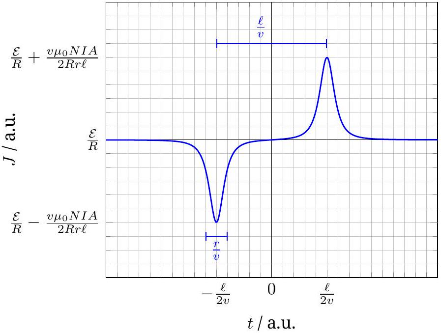
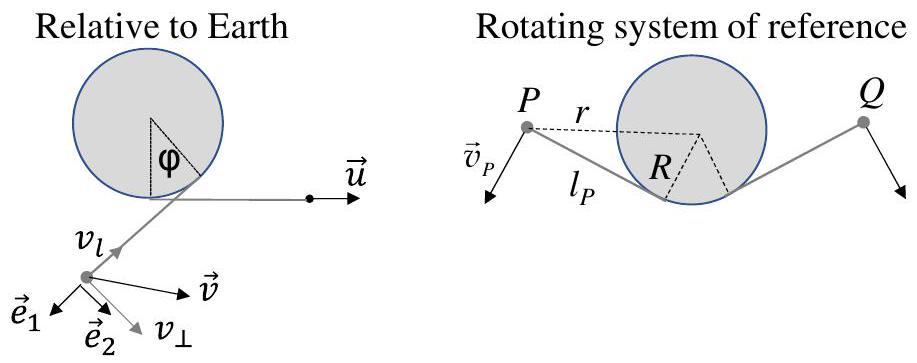
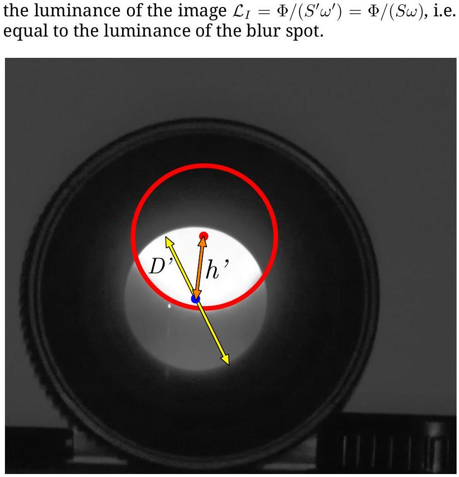
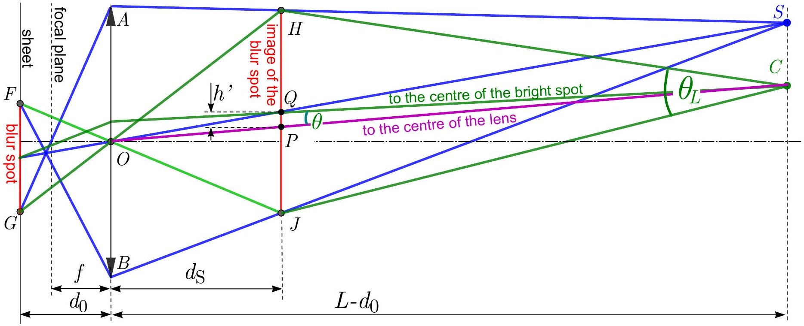

## T1: Solenoid and loop

Part a. Solution I. According to Newton's third law, the force acting on the solenoid is equal in magnitude, but opposite in direction to the force acting on the loop. The latter can be obtained from Lorentz's law by summation of infinitesimal forces $\vec { F } = J \Delta \vec { l } \times \vec { B }$ acting on the individual loop elements $\Delta \vec { l }$, where $J = \mathcal { E } / R$ is the current in the loop.

Since the solenoid is long and thin, the magnetic field lines inside it are directed in $+ z$ direction, and escape only from the immediate vicinity of its ends. The magnetic field outside the solenoid is vortex-free and sourcefree. The same requirements are satisfied by the electric field in empty space. Hence, the magnetic field outside the solenoid can be well approximated by a field created by two magnetic poles: a North pole residing close to point $O _ { 1 }$ and a South pole located near to $O _ { 2 }$. The flux $\Phi$ emerging from the North pole (and the flux entering the South pole) is the same as the flux passing through the solenoid's cross-section:

$$
\Phi = B _ { \text {in } } A = \mu _ { 0 } \frac { N I } { \ell } A .
$$

When the endpoint $O _ { 1 }$ of the solenoid is placed in the loop centre $O$, the magnetic field of the other end $\left( O _ { 2 } \right)$ near the loop is negligible. The field created by the North pole located at $O _ { 1 }$ is pointing radially outwards, and its magnitude at the loop circumference is (from spherical symmetry):

$$
B ( r ) = \frac { \Phi } { 4 \pi r ^ { 2 } } = \frac { \mu _ { 0 } } { 4 \pi } \frac { N I A } { \ell r ^ { 2 } } .
$$

Note. it is also correct to assume that the flux from the $B$-field (which carries a factor of $1 / 2$ compared to the field above at the end of the solenoid is uniformly distributed over hemisphere.

The forces acting on all elements of the loop (and also the net force) point in the $- z$ direction, which can be expected also from the same current directions (i.e. the loop and the solenoid attract each other). Hence, the reaction force acting on the solenoid points in the $+ z$ direction, and its magnitude is given by:

$$
F _ { 1 } = \frac { \mathcal { E } } { R } \cdot 2 \pi r \cdot \frac { \mu _ { 0 } } { 4 \pi } \frac { N I A } { \ell r ^ { 2 } } = \frac { \mu _ { 0 } N I A \mathcal { E } } { 2 \ell R r } .
$$

When the endpoint $O _ { 2 }$ is located at the centre of the loop, the magnetic field produced by the South pole exerts a force on the loop. Since this field is directed radially inward, the force acting on the solenoid is the same in magnitude, but opposite in direction $( - z )$ as the force calculated above:

$$
\vec { F } _ { 2 } = - \vec { F } _ { 1 } .
$$

| Grading scheme: T1 part a., Solution I. |  |
| :--- | :--- |
| using Newton's third law | 0.5 p |
| idea of approximating the outer field with magnetic poles 0.5 p, and justification 0.5 p | 1.0 p |
| calculating the flux $\Phi$ emerging from the magnetic pole (for a wrong factor, 0.3 p) | 1.0 p |
| expressing the field $B ( r )$ of the magnetic pole | 1.0 p |
| finding the magnitude of force acting on the loop from Lorentz's force law | 1.0 p |
| correct direction for $\vec { F } _ { 1 } 0.5 \mathrm { p }$, and $\vec { F } _ { 2 }$ antiparallel to $\vec { F } _ { 1 } 0.5 \mathrm { p }$ | 1.0 p |
| Total for part a.: | 5.5 p |

Solution II. In this solution the force acting on the solenoid is calculated, as the force acting on the magnetic pole placed at the centre of the current-carrying loop. For this we need to find an expression for the magnetic pole strength (or magnetic charge) $Q _ { \mathrm { m } }$, which is defined as the ratio of the force and the magnetic field.

The total dipole moment $m$ of the solenoid is the product of the number of turns and the dipole moment $I A$ of each turn:

$$
m = N I A .
$$

This can be also expressed with the magnetic pole strength and the distance of the poles: $m = Q _ { \mathrm { m } } \ell$. From this we arrive to the expression

$$
Q _ { \mathrm { m } } = \frac { N I A } { \ell } = \frac { \Phi } { \mu _ { 0 } }
$$

where $\Phi$ is the total flux emerging from the pole (see solution I).

Note. The same result can be obtained from the analogy between electrostatic and magnetostatic fields. The Coulomb force between two point charges $\pm Q$ can be derived from the principle of virtual work. The force is the derivative of the interaction part of the field energy with respect to the distance between the charges. The force between two magnetic charges $\pm Q _ { \mathrm { m } }$ can be also calculated this way. From the expressions of electric and magnetic energy densities we can conclude the formula of the magnetic interaction force:

$$
\begin{gathered}
w _ { E } = \frac { 1 } { 2 } \varepsilon _ { 0 } E ^ { 2 } \quad \longleftrightarrow \quad w _ { B } = \frac { 1 } { 2 \mu _ { 0 } } B ^ { 2 } , \\
F _ { E } = \frac { 1 } { 4 \pi \varepsilon _ { 0 } } \frac { Q ^ { 2 } } { r ^ { 2 } } \quad \longleftrightarrow \quad F _ { B } = \frac { \mu _ { 0 } } { 4 \pi } \frac { Q _ { m } ^ { 2 } } { r ^ { 2 } } .
\end{gathered}
$$

As it can be seen, the well-known formulae known in electrostatics can be also used in magnetostatics with the substitutions $\varepsilon _ { 0 } ^ { - 1 } \longleftrightarrow \mu _ { 0 } , E \longleftrightarrow B , Q \longleftrightarrow Q _ { \mathrm { m } }$. Carrying on this analogy the magnetic pole strength can be figured out:

$$
Q = \varepsilon _ { 0 } \Psi \quad \longleftrightarrow \quad Q _ { \mathrm { m } } = \frac { \Phi } { \mu _ { 0 } } = \frac { N } { \ell } I A ,
$$

where $\Psi$ and $\Phi$ are the electric and magnetic flux for a closed surface containing the electric and magnetic charge, respectively.

When endpoint $O _ { 1 }$ of the solenoid is located at point $O$, a North pole resides at the centre of the loop. Here the magnetic field created by the loop can be expressed from Biot-Savart-law:

$$
B _ { \text {loop } } ^ { ( \text {at center } ) } = \frac { \mu _ { 0 } J } { 2 r } = \frac { \mu _ { 0 } \mathcal { E } } { 2 R r } ,
$$

pointing in the $+ z$ direction. So the magnitude of the force acting on this end of the solenoid is:

$$
F _ { 1 } = Q _ { \mathrm { m } } B _ { \text {loop } } ^ { ( \text {at center } ) } = \frac { \mu _ { 0 } \mathcal { E } N I A } { 2 \ell R r } ,
$$

and it is directed to $+ z$. When the endpoint $O _ { 2 }$ is located at the center of the loop, the force acting on the South pole should be calculated, resulting a force of same magnitude, but opposite direction.

| Grading scheme: T1 part a., Solution II. |  |
| :--- | :--- |
| idea of approximating the outer field with magnetic poles 0.5 p, and justification 0.5 p | 1.0 p |
| calculating the magnetic pole strength $Q _ { \mathrm { m } }$ (for dimensionally wrong answer 0 p) | 1.0 p |
| justification for calculation | 1.0 p |
| calculating the field of the current loop at its centre from Biot-Savartlaw | 0.5 p |
| finding the magnitude of force acting on the magnetic pole | 1.0 p |
| correct direction for $\vec { F } _ { 1 } 0.5 \mathrm { p }$, and $\vec { F } _ { 2 }$ antiparallel to $\vec { F } _ { 1 } 0.5 \mathrm { p }$ | 1.0 p |
| Total for part a.: | 5.5 p |

Solution III. Some of the magnetic field lines created by the loop enter into the near end $O _ { 1 }$ of the solenoid; this entering flux is given by

$$
\Phi _ { \text {in } } = B _ { \text {loop } } ^ { ( \text {at center } ) } A = \frac { \mu _ { 0 } J } { 2 r } A = \frac { \mu _ { 0 } \mathcal { E } A } { 2 R r } .
$$

Since the end $O _ { 2 }$ is far from the loop, the flux created by the loop escaping there is negligibly small. This means that almost all the flux $\Phi _ { \text {in } }$ escapes from the solenoid through its side.

Denote the radial component of the magnetic field vector produced by the current-carrying loop at the perimeter of the $i$ th turn of the solenoid by $B _ { i }$. Only this component contributes to the net force acting on the solenoid, as the axial component produces a radial force which is cancelled due to rotational symmetry. The axial force acting on the $i$ th turn of the solenoid is given by

$$
F _ { 1 , i } = 2 \sqrt { A \pi } I B _ { i } ,
$$

where $2 \sqrt { A \pi }$ is the circumference of one turn, and the force points in the $+ z$ direction. Summing up both sides gives the net force:

$$
F _ { 1 } = \sum _ { i } F _ { i } = \sum _ { i } 2 \sqrt { A \pi } I B _ { i }
$$

Take out the factor $I$ from the summation and insert 1 written in the unusual way $( \ell / N ) \cdot ( N / \ell )$ :

$$
F _ { 1 } = I \frac { N } { \ell } \sum _ { i } 2 \sqrt { A \pi } \frac { \ell } { N } B _ { i } .
$$

The sum on the right hand side is the flux escaping through the side of the solenoid, which equals $\Phi _ { \text {in } }$, so the force:

$$
F _ { 1 } = I \frac { N } { \ell } \Phi _ { \mathrm { in } } = \frac { \mu _ { 0 } \mathcal { E } A N I } { 2 R r \ell } ,
$$

which agrees with the previous solutions.

| Grading scheme: T1 part a., Solution III. |  |
| :--- | :--- |
| $B$-field at the center of loop | 0.5 p |
| expressing force on one turn | 1.0 p |
| realizing that all the flux escapes through the sides of the solenoid | 0.5 p |
| relating the force to escaping flux | 1.5 p |
| summation and correct result | 1.0 p |
| correct direction for $\vec { F } _ { 1 } 0.5 \mathrm { p }$, and $\vec { F } _ { 2 }$ antiparallel to $\vec { F } _ { 1 } 0.5 \mathrm { p }$ | 1.0 p |
| Total for part a.: | 5.5 p |

Solution IV. The force acting on a current loop of magnetic moment $\vec { m }$ placed in magnetic field $\vec { B }$ is given by $\vec { \nabla } ( \vec { m } \cdot \vec { B } )$. Divide the solenoid into short circular coils of equal length $\Delta \ell$, then the magnetic moment of each short coil is

$$
\Delta \vec { m } = I A \frac { N \Delta \ell } { \ell } \vec { e } _ { z } ,
$$

where $\vec { e } _ { z }$ denotes the unit vector in $z$-direction. This magnetic moment is parallel to the field $\vec { B } _ { \text {loop } }$ created by the large current-carrying loop, so the force acting on each short segment of the solenoid in $z$-direction can be written as:

$$
\Delta F _ { 1 } = \Delta m \frac { \mathrm {~d} B _ { \text {loop } } } { \mathrm { d } z } = I A \frac { N \Delta \ell } { \ell } \frac { \mathrm {~d} B _ { \text {loop } } } { \mathrm { d } z }
$$

The total force on the solenoid can be determined from integration of the force contributions along the solenoid:

$$
F _ { 1 } = \int _ { - \ell } ^ { 0 } \mathrm {~d} \ell \frac { \Delta F _ { 1 } } { \Delta \ell } = I A \frac { N } { \ell } \left( B _ { \text {loop } } ( 0 ) - B _ { \text {loop } } ( - \ell ) \right) .
$$

Using the Biot-Savart-law we can compute the magnetic field $B _ { \text {loop } } ( z )$ of the current-carrying loop along the $z$-axis to

$$
B _ { \text {loop } } ( z ) = \frac { \mu _ { 0 } \mathcal { E } } { 2 R } \frac { r ^ { 2 } } { \left( z ^ { 2 } + r ^ { 2 } \right) ^ { 3 / 2 } } .
$$

This expression for $B _ { \text {loop } }$ yields

$$
F _ { 1 } = \frac { \mu _ { 0 } \mathcal { E } A N I r ^ { 2 } } { 2 R \ell } \left( \frac { 1 } { r ^ { 3 } } - \frac { 1 } { \left( \ell ^ { 2 } + r ^ { 2 } \right) ^ { 3 / 2 } } \right) \stackrel { \ell \gg r } { \approx } \frac { \mu _ { 0 } \mathcal { E } A N I } { 2 \ell R r } ,
$$

and $F _ { 1 }$ is directed to $+ z$. From a similar calculation we get $\vec { F } _ { 2 } = - \vec { F } _ { 1 }$.

| Grading scheme: T1 part a., Solution IV. |  |
| :--- | :--- |
| idea of dividing the solenoid into short segments of equal lengths | 1.0 p |
| giving the magnetic moment of a segment | 0.5 p |
| expressing the force on a segment by a derivative of the magnetic field | 1.0 p |
| calculating the field of the currentcarrying loop from Biot-Savart-law (alternatively, arguing that only the field at center of loop is important 0.5 p and calculating this field 0.5 p) | 1.0 p |
| integrating force contributions to find total force on solenoid (max. 0.5 if final expression still contains integral) | 1.0 p |
| correct direction for $\vec { F } _ { 1 } 0.5 \mathrm { p }$, and $\vec { F } _ { 2 }$ antiparallel to $\vec { F } _ { 1 } 0.5 \mathrm { p }$ | 1.0 p |
| Total for part a.: | 5.5 p |

Note: Using the idea of dividing the solenoid into small segments other solutions are possible as well (e.g. considering small dipole contributions). In this case the grading scheme of Solution IV should be adapted accordingly. One recurring solution of this type is to divide the solenoid into small segments of length $\mathrm { d } z$, compute the $B$-field in $z$-direction effected by current-loop from Biot-Savart, use Gauss law to relate the radial $B$ flux through the segment to $\mathrm { d } B / \mathrm { d } z$. compute the force on the segment using Lorentz forces and integrate the force over the length of the solenoid. In this case the marking scheme is adapted in the second aspect, awarding 0.5 p for the idea of using Gauss law to find radial $B$-field

Solution V. In this solution we relate the force acting on the solenoid to the change in energy of the system. Investigate the case when point $O _ { 1 }$ is located at $O$ first. Due to the same current directions, the magnetic force $\vec { F } _ { 1 }$ acting on the solenoid points in direction $+ z$. While keeping the solenoid in equilibrium with external force $- \vec { F } _ { 1 }$, let it move by a small displacement $\delta z$ in the positive $z$ direction. The work done by the external force is equal to the change in energy of the system:

$$
- \vec { F } _ { 1 } \cdot \delta \vec { z } = - F _ { 1 } \delta z = \delta E _ { \text {total } } .
$$

We should be aware of the fact that the system is not closed: there is also a battery and a current source included in the circuits. Hence, $\delta E _ { \text {total } }$ contains the change in field energy and the change of energy of the power sources:

$$
\delta E _ { \text {total } } = \delta E _ { \text {field } } + \delta E _ { \text {sources } }
$$

Since the force does not depend on what kind of power supplies we have, let us replace the battery with a current source providing constant current $J = \mathcal { E } / R$.

Now we find a relation between $\delta E _ { \text {field } }$ and $\delta E _ { \text {sources } }$ The energy stored in the field can be expressed as

$$
E _ { \mathrm { field } } = \frac { 1 } { 2 } L _ { 1 } I ^ { 2 } + \frac { 1 } { 2 } L _ { 2 } J ^ { 2 } + L _ { 12 } I J ,
$$

where $L _ { 1 }$ is the inductance of the solenoid, $L _ { 2 }$ is that of the loop and $L _ { 12 }$ is the mutual inductance of the system. Upon small displacement $\delta z$, only the last term changes, so

$$
\delta E _ { \text {field } } = \delta L _ { 12 } \cdot I J
$$

The small displacement results in a change of the flux enclosed by the loop and the solenoid. The flux created by the solenoid on the loop is $L _ { 12 } I$, and the flux created by the loop through the solenoid is $L _ { 21 } J = L _ { 12 } J$ (here we used the symmetry property of mutual inductance). During the short time $\delta t$ of the displacement $\delta z$, the e.m.f. induced in the loop ( $V _ { \text {ind } } ^ { \text {loop } }$ ) and the solenoid ( $V _ { \text {ind } } ^ { \text {solenoid } }$ ) can be expressed with Faraday's law:

$$
V _ { \text {ind } } ^ { \text {loop } } = - \frac { \delta L _ { 12 } } { \delta t } I , \quad V _ { \text {ind } } ^ { \text {solenoid } } = - \frac { \delta L _ { 12 } } { \delta t } J .
$$

In order to keep the current in the circuits constant, the current sources need to provide an additional power, so they give away extra energy (in addition to Joule heat). This energy change of the sources is given by:

$$
\delta E _ { \text {sources } } = \left( V _ { \text {ind } } ^ { \text {loop } } J + V _ { \text {ind } } ^ { \text {solenoid } } I \right) \delta t .
$$

Using the previous results we finally get:

$$
\delta E _ { \text {sources } } = - 2 \delta L _ { 12 } I J = - 2 \delta E _ { \text {field } }
$$

which means $\delta E _ { \text {total } } = - \delta E _ { \text {field } }$, and hence $F _ { 1 } \delta z =$ $\delta E _ { \text {field } } = \delta L _ { 12 } I J$.

Note 1. Naively, one might think that we get the result $\delta E _ { \text {total } } = \delta E _ { \text {field } }$ if we imagine superconducting wires without power supplies. One can show with detailed calculation that in that case the currents in the loop and the coil change, as the total flux enclosed by a superconducting circuit must remain constant. The correct physical justification of the appearing negative sign is an important part of the solution.

Now we calculate the change in mutual inductance $\delta L _ { 12 }$. The small displacement $\delta z$ can be imagined as we take a short segment from the tail $O _ { 2 }$ of the coil (consisting of $N \delta z / \ell$ turns) and move it to the head $O _ { 1 }$. As a result, the flux produced by the loop on the solenoid increases by

$$
\delta \Phi _ { 12 } = \delta L _ { 21 } J = \underbrace { \frac { \mu _ { 0 } J } { 2 r } } _ { B _ { \text {loop } } ^ { \text {(at center) } } } A \frac { N } { \ell } \delta z .
$$

From this we get:

$$
F _ { 1 } = \frac { \delta L _ { 12 } I J } { \delta z } = \frac { \mu _ { 0 } \mathcal { E } N A I } { 2 \ell R r } .
$$

If the tail $O _ { 2 }$ of the solenoid is located at point $O$, the coefficient of mutual inductance decreases upon small displacement, which results in $\vec { F } _ { 2 } = - \vec { F } _ { 1 }$.

Note 2. The field energy can be also calculated from the energy density integrated for the whole space. Instead of calculating the total field energy, it is easier to find its change using the same idea presented above, i.e. take a segment of length $\delta z$ from the tail and move it to the head of the solenoid. Assuming $\ell \gg \delta z \gg \sqrt { A }$, the field created by the solenoid inside that segment is $\mu _ { 0 } N I / \ell$ (because the field differs from this only at distance $\sim \sqrt { A }$ from the ends). At the end we get the same result for the change in field energy using the expression:

$$
\delta E _ { \text {field } } = \frac { 1 } { 2 \mu _ { 0 } } \left[ \left( B _ { \text {loop } } ^ { \text {(at centre) } } + B _ { \text {sol } } \right) ^ { 2 } - \left( B _ { \text {loop } } ^ { \text {(at centre) } } \right) ^ { 2 } - B _ { \text {sol } } ^ { 2 } \right] A \delta z .
$$

Note 3. A third possibility is to calculate the potential energy change of the displaced few turns of the solenoid. The magnetic moment of a segment of length $\delta z$ is $\vec { m } = \vec { e } _ { z } I A N \delta z / \ell$, and its energy in external field is $E _ { \text {pot } } = - \vec { m } \vec { B }$. Important to highlight that this potential energy already contains the factor of -1 discussed at the beginning of the solution, so the force acting on the solenoid can be expressed as

$$
F _ { 1 } = - \frac { \delta E _ { \mathrm { pot } } } { \delta z } .
$$

The external field is the superposition of the field $\vec { B } _ { \text {loop } }$ created by the loop and the field $\vec { B } _ { \text {sol } }$ created by the coil (note that this latter contains a factor of 1/2 compared to the field in the middle of the solenoid). Since $\vec { B } _ { \text {sol } }$ is the same at the two ends $O _ { 1 }$ and $O _ { 2 }$, the energy change is:

$$
\delta E _ { \mathrm { pot } } = - \vec { m } \vec { B } _ { \text {loop } } ^ { \text {(at center) } } - \vec { m } \vec { B } _ { \text {loop } } ( z = \ell ) .
$$

The second term can be neglected, and we get

$$
\delta E _ { \mathrm { pot } } = - \frac { I A N \delta z } { \ell } \frac { \mu _ { 0 } \mathcal { E } } { 2 R r } ,
$$

which gives the same answer for $F _ { 1 }$ as the other ideas.

| Grading scheme: T1 part a., Solution V. |  |
| :--- | :--- |
| Equating force to energy change in system | 0.5 p |
| Formulating energy equation (if sources are missing 0.2 p) | 0.5 p |
| expressing $\delta E _ { \text {field } }$ through contributions from currents and an interaction term | 1.0 p |
| deriving that $\delta E _ { \text {sources } } = - 2 \delta E _ { \text {field } }$ | 1.0 p |
| computing the change in field energy and final result for force. | 1.5 p |
| correct direction for $\vec { F } _ { 1 } 0.5 \mathrm { p }$, and $\vec { F } _ { 2 }$ antiparallel to $\vec { F } _ { 1 } 0.5 \mathrm { p }$ | 1.0 p |
| Total for part a.: | 5.5 p |

Part $b$. In order to plot a graph displaying the important features, it is beneficial to make some calculations. The problem text does not specify the zero point of time, so take $t = 0$ in the moment when the center of the solenoid is located at point $O$. This means that at time $t$ the head $O _ { 1 }$ of the solenoid is located at $z _ { 1 } = \ell / 2 + v t$, while the tail $O _ { 2 }$ is located at $z _ { 2 } = - \ell / 2 + v t$.

The current flowing in the loop at an arbitrary moment of time is given by

$$
J ( t ) = \frac { \mathcal { E } + V _ { \mathrm { ind } } ( t ) } { R } ,
$$

where $V _ { \text {ind } } ( t )$ is the induced electromotive force in the loop as a function of time. Two different approaches can be found below which give an analytical formula for this induced e.m.f.

Solution I. We may again approximate the magnetic field outside the solenoid by a field created by two magnetic poles at $z _ { 1 }$ and $z _ { 2 }$, respectively. The resulting magnetic flux through the loop can be calculated by considering the solid angle the loop extends as seen from either of the poles. Using the total magnetic flux of the poles as calculated in Solution I for part a. we get

$$
\Phi _ { \text {loop } } = \frac { \mu _ { 0 } N I A } { 2 \ell } \left\{ \frac { z _ { 1 } } { \sqrt { z _ { 1 } ^ { 2 } + r ^ { 2 } } } + 1 - \frac { z _ { 2 } } { \sqrt { z _ { 2 } ^ { 2 } + r ^ { 2 } } } - 1 \right\} .
$$

Using this result and $\dot { z _ { 1 } } = \dot { z _ { 2 } } = v$ the induced e.m.f. can be calculated with Faraday's law $V _ { \text {ind } } = - \mathrm { d } \Phi _ { \text {loop } } / \mathrm { d } t$, which gives

$$
V _ { \mathrm { ind } } = - v \frac { \mu _ { 0 } N I A } { 2 \ell } \left\{ \frac { r ^ { 2 } } { \left( z _ { 1 } ^ { 2 } + r ^ { 2 } \right) ^ { 3 / 2 } } - \frac { r ^ { 2 } } { \left( z _ { 2 } ^ { 2 } + r ^ { 2 } \right) ^ { 3 / 2 } } \right\} .
$$

Solution II. The rate of change of flux produced by the solenoid through the loop can be expressed in terms of the mutual inductance $L _ { 12 }$ of the solenoid with respect to the loop:

$$
\frac { \mathrm { d } \Phi _ { 12 } } { \mathrm {~d} t } = \frac { \mathrm { d } } { \mathrm {~d} t } \left( L _ { 12 } I \right) = I \frac { \mathrm {~d} L _ { 12 } } { \mathrm {~d} t } .
$$

Using the symmetry property of mutual inductance $\left( L _ { 12 } = L _ { 21 } \right)$, instead of calculating $\dot { L } _ { 12 }$ let us find the time derivative of $L _ { 21 }$, i.e. the mutual inductance of the loop with respect to the solenoid. For this, imagine that the current in the loop is constant $J _ { 0 }$, and calculate the change of flux produced by the loop through the solenoid during a short amount of time $\mathrm { d } t$ ! The small displacement $v \mathrm {~d} t$ of the solenoid can be considered as moving a short segment of length $v \mathrm {~d} t$ from the tail to the head. The change in flux in this segment is given by

$$
\mathrm { d } \Phi _ { 21 } = \mathrm { d } L _ { 21 } J _ { 0 } = v \mathrm {~d} t \frac { N A } { \ell } \left( B _ { \text {loop } } \left( z _ { 1 } \right) - B _ { \text {loop } } \left( z _ { 2 } \right) \right) .
$$

Using the formula for $B _ { \text {loop } } ( z )$ obtained from BiotSavart-law (see Solution IV for part a.) we get

$$
\frac { \mathrm { d } L _ { 21 } } { \mathrm {~d} t } = v \frac { N A } { \ell } \frac { \mu _ { 0 } } { 2 } \left[ \frac { r ^ { 2 } } { \left( z _ { 1 } ^ { 2 } + r ^ { 2 } \right) ^ { 3 / 2 } } - \frac { r ^ { 2 } } { \left( z _ { 2 } ^ { 2 } + r ^ { 2 } \right) ^ { 3 / 2 } } \right] .
$$

From this the induced e.m.f. $V _ { \text {ind } } = I \dot { L } _ { 12 } = I \dot { L } _ { 21 }$ can be expressed:

$$
V _ { \text {ind } } ( t ) = - \frac { \mathrm { d } \Phi _ { 21 } } { \mathrm {~d} t } = - v \frac { \mu _ { 0 } N I A } { 2 \ell } \left[ \frac { r ^ { 2 } } { \left( z _ { 1 } ^ { 2 } + r ^ { 2 } \right) ^ { 3 / 2 } } - \frac { r ^ { 2 } } { \left( z _ { 2 } ^ { 2 } + r ^ { 2 } \right) ^ { 3 / 2 } } \right]
$$

Although the analytical result gives the correct expression for the current flowing in the loop, the task in part b. was to plot the graph.

The graph should reflect the most important features of the function. First, $V _ { \text {ind } } ( t )$ is an odd function, i.e. $V _ { \text {ind } } ( - t ) = - V _ { \text {ind } } ( t )$. For $t < 0$ the flux through the loop increases meaning that $V _ { \text {ind } } < 0$ and $J < \mathcal { E } / R$, while for $t > 0$ the flux decreases, which results $V _ { \text {ind } } > 0$ and $J > \mathcal { E } / R$.

In different ranges of time, $V _ { \text {ind } } ( t )$ behaves very differently. For times $t \ll - \ell / ( 2 v )$ and $t \gg \ell / ( 2 v )$ the solenoid is very far (approximately at distance $v t$ ) from the current loop, and its field can be approximated by dipole field (proportional to $v ^ { - 3 } t ^ { - 3 }$ ). The time derivative of the field is proportional to the induced e.m.f. in the loop, so in this time range $V _ { \text {ind } } ( t ) \propto t ^ { - 4 }$, and has very small value. The same result can be concluded from the Taylor expansion of the complete analytical formula for $V _ { \text {ind } }$.

When $t \approx \pm \ell / ( 2 v )$ (with the accuracy of $r / v$ ) the effect of one pole of the solenoid can be neglected. The absolute value of the induced e.m.f. is maximal here:

$$
\left| V _ { \mathrm { ind } } \right| = v \frac { \mu _ { 0 } N I A } { 2 \ell r } ,
$$

so the maximal and minimal value of the current are

$$
J _ { \min } = \frac { \mathcal { E } } { R } - v \frac { \mu _ { 0 } N I A } { 2 R r \ell } , \quad J _ { \max } = \frac { \mathcal { E } } { R } + v \frac { \mu _ { 0 } N I A } { 2 R r \ell } .
$$

Around the maximum $V _ { \text {ind } }$ is a quadratic function of time, as it can be proved with expanding the complete analytical formula.

When the centre of the solenoid is close to the centre of the loop, i.e. $| t | \ll \ell / ( 2 v )$, the flux barely changes, so $V _ { \text {ind } } \approx 0$. A more careful analysis gives a very weak linear dependence on time.

The statements above are summarized in the table below.

| time range | $V _ { \text {ind } } ( t )$ | $J ( t )$ |
| :--- | :--- | :--- |
| $t \ll - \ell / ( 2 v )$ | small, $\propto - 1 / t ^ { 4 }$ | $\approx \mathcal { E } / R$ |
| $t \approx - \ell / ( 2 v )$ | large, $\propto - \left( t + \frac { \ell } { 2 v } \right) ^ { 2 }$ | $J _ { \text {min } }$, dip |
| $\| t \| \ll \ell / ( 2 v )$ | negligible $( \propto t )$ | $\approx \mathcal { E } / R$ |
| $t \approx \ell / ( 2 v )$ | large, $\propto \left( t - \frac { \ell } { 2 v } \right) ^ { 2 }$ | $J _ { \text {max } }$, peak |
| $t \gg \ell / ( 2 v )$ | small, $\propto 1 / t ^ { 4 }$ | $\approx \mathcal { E } / R$ |

Figure 1: Qualitative graph of $J$ as a function of time for $\ell = 5 r$.

| Grading scheme: T1 part b. |  |
| :--- | :--- |
| relating $J ( t )$ to $V _ { \text {ind } }$ or other suitable quantity (independent of result in a.) | 0.5 p |
| the $J ( t )$ graph is smooth everywhere (if graph does not capture whole domain including asymptotics, 0 p.) | 0.5 p |
| $J ( t ) \approx \mathcal { E } / R$, except if $t \approx \pm \ell / ( 2 v )$ (if $J ( t ) \approx \mathcal { E } / R$ only asymptotically, 0.2 p) | 0.5 p |
| $J ( t ) - \mathcal { E } / R$ is clearly an odd function (computing analytical expression for $J$ and graph showing odd behavior is considered sufficient, if reasoning is missing, 0.2 p) | 0.5 p |
| $J ( t )$ has a minimum first, then a maximum $\ell / v$ time later (if reversed or the time is incorrect, 0 p) | 1.0 p |
| analytical formula for $J _ { \text {min } }$ and $J _ { \text {max } }$ (either approximate or exact), if analytical expression is given but minmax values are not determined 0.5 p are given for deriving the formula and realizing that min-max exist. | 1.0 p |
| it is indicated that the duration of the peak and dip is in the range of $r / v$ | 0.5 p |
| if $J ( z )$ instead of $J ( t )$ is plotted or labels are missing on the axes 0.5 p are deducted from part b. but only if 0.5 or more marks are given to the actual graph at all | (-0.5 p) |
| Total for part b.: | 4.5 p |

Figure 2: Mechanical accelerator

If no graph is drawn: max. 0.5 p for relating $J ( t )$ to $V _ { \text {ind } }$
and 1.0 p for $J _ { \text {min } }$ and $J _ { \text {max } }$ (for a general formula without evaluation of min and max: 0.5 p) are given.
If $B$-field of the solenoid is assumed constant across loop or area for flux is taken to be $A , 0$ p are awarded for min and max.

Additional general guidelines for grading T1:

- Grading should always follow one of the solutions described. If approaches for solutions are mixed the one resulting in the highest marks is considered.
- Granularity for marks is 0.1 p.
- A simple numerical error resulting from a typo is punished by 0.1 p unless the grading scheme explicitly says otherwise.
- Errors which cause dimensionally wrong results are punished by at least 50 \% of the marks if dimensions can easily be checked. In more complicated cases less marks may be deducted.
- Propagating errors are not punished repeatedly unless they either lead to considerable simplifications or wrong results whose validity can easily be checked.
- No marks are given for the directions of the forces in a. if forces are physically incorrect (e.g. resulting force is calculated to zero) or if no forces are calculated.
- If current $I$ in solenoid is used as current in loop instead of $\mathcal { E } / R$ or vice versa in the calculation of the force 0.5 p are substracted.
- If only $z$-component of $B$-field (either from solenoid or loop) is determined and the force on the solenoid is derived from this using Lorentz-forces, marks are only given for ideas (max. 1.0 p.) and the use of the BiotSavart law (max. 1.0 p)

## T2: Mechanical accelerator

Figure 2: Mechanical accelerator

Solution I. Part 1: Thread in contact with the cylinder. The velocity of the mass $P$ can be decomposed into longitudinal component $v _ { l }$ along the thread, and a transverse component $v _ { \perp }$ perpendicular to the thread:

$$
\vec { v } = v _ { l } \vec { e } _ { 1 } + v _ { \perp } \vec { e } _ { 2 }
$$

where the unit vectors $\vec { e } _ { 1 }$ and $\vec { e } _ { 2 }$ are parallel and perpendicular to the thread, respectively (see Fig. 2). Since the thread is inextensible, the longitudinal component is constant: $v _ { l } = - u$, i.e.

$$
\vec { v } = - u \vec { e } _ { 1 } + v _ { \perp } \vec { e } _ { 2 }
$$

The acceleration of $P$ is, respectively:

$$
\vec { a } = \frac { d \vec { v } } { d t } = - u \frac { d \vec { e } _ { 1 } } { d t } + v _ { \perp } \frac { d \vec { e } _ { 2 } } { d t } + \frac { d v _ { \perp } } { d t } \vec { e } _ { 2 }
$$

Vectors $\vec { e } _ { 1 }$ and $\vec { e } _ { 2 }$ form a coordinate system, which rotates as a rigid object with an angular velocity:

$$
\vec { \omega } = \frac { d \phi } { d t } \vec { e } _ { 3 }
$$

where $\vec { e } _ { 3 } = \vec { e } _ { 1 } \times \vec { e } _ { 2 }$ is a unit vector perpendicular to the plane of motion, i.e. along the cylinder axis, and $\phi$ is the angle between the thread and the X-axis. Therefore, the time derivatives of the basis vectors are:

$$
\frac { d \vec { e } _ { 1 } } { d t } = \vec { \omega } \times \vec { e } _ { 1 } = \frac { d \phi } { d t } \vec { e } _ { 2 }
$$

and

$$
\frac { d \vec { e } _ { 2 } } { d t } = \vec { \omega } \times \vec { e } _ { 2 } = - \frac { d \phi } { d t } \vec { e } _ { 1 }
$$

In this way, the acceleration of $P$ can be represented in terms of the angular velocity:

$$
\vec { a } = - v _ { \perp } \frac { d \phi } { d t } \vec { e } _ { 1 } + \left( - u \frac { d \phi } { d t } + \frac { d v _ { \perp } } { d t } \right) \vec { e } _ { 2 }
$$

The only force, acting on $P$, is the tension of the thread. Therefore, the component of the acceleration perpendicular to the tread, i.e. along $\vec { e } _ { 2 }$, is null:

$$
- u \frac { d \phi } { d t } + \frac { d v _ { \perp } } { d t } = 0
$$

After integration over time, we obtain a relationship between the transverse velocity, acquired by $P$, and the angle of rotation of the thread:

$$
v _ { \perp } = u \phi
$$

The end of the tread turns at a total angle of $2 \pi N$ until the tread detaches from the cylinder completely. Therefore, the transverse component of the velocity of $P$ at the moment of detachment is:

$$
v _ { \perp } = 2 \pi N u
$$

and the magnitude of velocity:

$$
v = \sqrt { v _ { l } ^ { 2 } + v _ { \perp } ^ { 2 } } = u \sqrt { ( 2 \pi N ) ^ { 2 } + 1 }
$$

Part 2: Thread detached fom the cylinder. This expression, however, still does not represent the maximum velocity attained by $P$. In the frame of reference of the free end of the thread, the mass continues to rotate about the end of the thread. The velocity of $P$, relative to Earth, reaches maximum in the moment when the thread reaches right angle with X-axis, i.e. the transverse component of velocity of $P$ aligns with $\vec { u }$ :

$$
v _ { \max } = u ( 2 \pi N + 1 )
$$

Solution II. Part 1: Thread in contact with the cylinder. Consider a point $Q$ on the end of the thread being pulled that coincided with $P$ at the moment when it touched the cylinder. Consider motion of the thread in a system of reference (SR), which rotates at angular speed $\omega = u / R$ around the center of the cylinder. In that SR the part of the thread in contact with the cylinder is at rest and the point $Q$ rotates around the cylinder with the angular velocity $\omega _ { Q } = - \omega$ (see the figure).

Since the middle part of the thread is at rest, energy of the mass $P$ is conserved. For the same reason, the velocity $v _ { P }$ of $P$ is perpendicular to the thread. Therefore the kinetic energy acquired by the mass in the rotating frame is equal to the decrease of its centrifugal potential energy:

$$
\frac { 1 } { 2 } m v _ { P } ^ { 2 } = - \frac { 1 } { 2 } m \omega ^ { 2 } R ^ { 2 } + \frac { 1 } { 2 } m \omega ^ { 2 } r ^ { 2 } = \frac { 1 } { 2 } m \omega ^ { 2 } l _ { P } ^ { 2 }
$$

where $l _ { P }$ is the length of the unwound part of the thread on the side of the mass $P$ (see the figure). Therefore, the mass $P$ rotates around the fixture point of the thread with a velocity:

$$
v _ { P } = \frac { u } { R } l _ { P }
$$

and a constant angular velocity:

$$
\omega _ { P } = \frac { u } { R } = \omega .
$$

Since $\omega _ { P } = - \omega _ { Q }$, in the rotating SR the two ends of the thread will unwind symmetrically and the lengths of the two straight parts of the string will be equal at any moment of time. Therefore, at the moment of detachment:

$$
l _ { P } = \frac { 1 } { 2 } ( 2 \pi R N ) = \pi N R
$$

and the detachment velocity of $P$ is, respectively:

$$
v _ { P } = \pi N u
$$

When transforming the velocity of $P$ to the Earth's SR, the velocity $\vec { v } _ { P }$ should be added to the rotational velocity $\vec { \omega } \times \vec { r }$. It is easy to establish that the result for the transverse component of $P$ is:

$$
v _ { \perp } = 2 v _ { P } = 2 \pi N u
$$

Part 2: Thread detached from the cylinder. In that part we proceed exactly as in Part 2 of the first solution.

Solution III. Part 1: The thread in contact with the cylinder
Like in Solution I we decompose the velocity into longitudinal and transverse components, and come to the conclusion that the longitudinal component is $v _ { l } =$ $- u$. Afterwards, the acceleration of $P$ is expressed. In this case, however, we consider the longitudinal (centripetal) component of the acceleration:

$$
a _ { l } = - v _ { \perp } ^ { 2 } / l \equiv - v _ { \perp } \frac { d \phi } { d t }
$$

From the second Newton's law we obtain the tension $F$ of the thread:

$$
F = - m v _ { \perp } \frac { d \phi } { d t }
$$

The rate of change of the kinetic energy of the mass is equal to the power of the tension force:

$$
\frac { d E _ { k } } { d t } = F v _ { l } = + m v _ { \perp } \frac { d \phi } { d t } u
$$

Taking into account that:

$$
E _ { k } = \frac { 1 } { 2 } m \left( u ^ { 2 } + v _ { \perp } ^ { 2 } \right)
$$

and taking the first derivative from that expression, we obtain: $m v _ { \perp } d v _ { \perp } / d t = m v _ { \perp } d \phi / d t u$, or:

$$
\frac { d v _ { \perp } } { d t } = u \frac { d \phi } { d t }
$$

From that point on we proceed exactly as in the first solution.

| Grading scheme: T2 part 1, Solution I |  |
| :--- | :--- |
| $\vec { v }$ is decomposed into $v _ { l }$ and $v _ { \perp }$ | 1.0 p |
| By condition of inextensibility $v _ { l } = - u$ | 1.0 p |
| Components of acceleration in terms of $d \phi / d t$ | 2.0 p |
| The tension force is along the thread and $a _ { \perp } = 0$ | 1.0 p |
| Finding $d v _ { \perp } / d t = u \cdot d \phi / d t$ | 1.0 p |
| At the moment of detachment $v _ { \perp } = 2 \pi N u$ | 1.0 p |
| Final $v = u \sqrt { 1 + ( 2 \pi N ) ^ { 2 } }$ | 1.0 p |
| Total for part 1: | 8.0 p |

| Grading scheme: T2 part 1, Solution II |  |
| :--- | :--- |
| Introduction of rotational SR with angular velocity $\omega = u / R$ | 0.5 p |
| States that the wound string is at rest | 0.5 p |
| Showing that the energy of $P$ is conserved | 1.0 p |
| Showing that the centrifugal force has potential energy $E _ { P } = - m \omega ^ { 2 } r ^ { 2 } / 2$ | 1.0 p |
| Conservation of energy equation | 1.0 p |
| Proving that $l _ { P } = l _ { Q }$ | 0.5 p |
| Finding length $l _ { P } = \pi N R$ at the moment of release | 0.5 p |
| Finding $v _ { P } = \pi N u$ at the moment of release | 1.0 p |
| Rotational velocity of the non-inertial SR in point $\mathrm { P } \overrightarrow { v _ { \text {rot } } } = \vec { \omega } \times \vec { r }$ | 0.5 p |
| Finding $v _ { r o t \perp } = \pi N u$ | 0.5 p |
| Final velocity relative to Earth $v _ { \perp } = 2 \pi N u$ | 1 p |
| Total for part 1: | 8.0 p |

| Grading scheme: T2 part 1, Solution III |  |
| :--- | :--- |
| $\vec { v }$ is decomposed into $v _ { l }$ and $v _ { \perp }$ | 1.0 p |
| By condition of inextensibility $v _ { l } = - u$ | 1.0 p |
| Deriving $v _ { \perp } = l d \phi / d t$ | 0.5 p |
| Finding longitudinal acceleration $a _ { l } = v _ { \perp } ^ { 2 } / l$ | 0.5 p |
| Using Newton's second law $F = m a _ { l }$ | 0.5 p |
| Writing the kinetic energy $E _ { k } = m \left( u ^ { 2 } + \right. \left. v _ { \perp } ^ { 2 } \right) / 2$ | 0.5 p |
| Using the work-energy theorem $d E _ { k } / d t =$ Fu | 1.0 p |
| Deriving $d v _ { \perp } / d t = u d \phi / d t$ | 1.0 p |
| At the moment of detachment $v _ { \perp } = 2 \pi N u$ | 1.0 p |
| Final $v = u \sqrt { 1 + ( 2 \pi N ) ^ { 2 } }$ | 1.0 p |
| Total for part 1: | 8.0 p |

| Grading scheme: T2 part 2, both solutions |  |
| :--- | :--- |
| Position in which maximum speed is achieved | 1.0 p |
| Value of $v _ { \text {max } }$ | 1.0 p |
| Total for part 2 | 2.0 p |

## T3: Cat eyes

When you look at the photo of the lens and/or the graph provided, four regions with different brightness levels can be distinguished. The brightest region represents the magnified image of the blur spot created by the lamp through the lens. The blur spot is created because the distance from the lens to the white sheet beneath it is slightly larger than the focal distance; as we can see from the graph, the blur spot is of almost constant brightness (a flat plateau at $\log _ { 10 } I = 4.4$ ), so we can say that the entire luminous flux falling from the lamp onto the lens is distributed evenly over the blur spot. Note that the blur spot has no sharp edges, though, as you would expect from in such case. This is because the image of this bright disc is situated between the lens and the camera, and is at a fairly big distance away from the plane which is sharp at the image sensor (as seen from the photo, the camera is focused onto the lens). Because of that, the enlarged image of the blur spot has blurred edges in the photo (at the blurred edges, $\log _ { 10 } I$ varies from 3.4 to 4.4). The second-brightest region (with $\log _ { 10 } I = 3.4$ ) represents the scattered light from the brightest region: in that region, we are still looking through the lens, and see the area next to the bright blur spot on the sheet. Ideally, its should be darker than the sheet seen in those places where it is not obstructed by the lens, because the lens is shading the light from the lamp. However, the glass elements of this big lens are non-ideal (and there are many glass elements inside the lens!), so the light from the lamp and the bright blur spot is scattered towards the camera giving rise to an increased apparent brightness. In the area where we see the blur spot, this light is insignificant (much weaker than the light from the blur spot), but not so in this dark area: here, the scatteredfrom-the-glass-surfaces dominates heavily over the light coming from the paper sheet. As a matter of fact, this fact could be used to improve the accuracy of the calculations: we could subtract the contribution of the scattered light $\left( 10 ^ { 3.4 } \right)$ from the total intensity of the light at the brightest spot $\left( 10 ^ { 4.4 } \right)$ to obtain the contribution coming from the blur spot on the sheet. The darkest regions (with $\log _ { 10 } I < 1.75$ ) represent the interior black painting of the lens seen through the big front glass element of the lens, which absorbs most of the incident light, and the region with $x > 420$ and $\log _ { 10 } I = 1.95$ represents the white sheet illuminated by the lamp. The ratio between the measured light intensity of the brightest region and that of the region with $x > 420$ can be utilized to find the distance of the sheet (the blur spot) from the lens to the paper sheet $d _ { 0 }$, see below.

From the data given in the problem text we know that $L \gg f$; from the photo of the lens, it is also clear that $d _ { 0 }$ is of the same order of magnitude as $f$. Because of that, the illuminance $E$ (luminous flux per unit area) near the lens can be assumed to be the same as at the paper sheet, The luminous flux per solid angle and unit area of a lightscattering (or radiating) surface is called the luminance $\mathscr { L }$; since all these directions under which the scattered light enters the lens aperture are close to the surface normal, we may assume the luminance of the paper sheet to be constant over all these directions. With the small

angle approximation, the light intensity $I$ (illuminance, luminous flux $\Phi$ per unit area) at the camera sensor is proportional to $\mathscr { L }$ (see Explanation 1).

The luminance of the blur spot on the sheet $\mathscr { L } _ { B S }$ is $1 / k$ larger than the luminance $\mathscr { L } _ { s }$ of the paper sheet, where $k$ equals the ratio between the area of the bright dot (the blur spot) on the paper sheet and the area of the lens, because all the light received by the lens is "compressed" into the tiny blur spot.

Small angle approximation is also used to show that luminance of the image of the blur spot $\mathscr { L } _ { I }$ equals to the luminance of the blur spot $\mathscr { L } _ { B S }$ (see Explanation 2). Therefore, the light intensity at the sensor cells corresponding to the brightest area (where we see the image of the blur spot) $I _ { I } = I _ { s } / k$, where $I _ { s }$ stands for the intensity at the cells corresponding to unobscured paper sheet. So, from the graph, we can deduce the value of $k$, and knowing $k$ we can calculate $d _ { 0 }$. Let the distance along the axis between the image of the bright region through the lens and the lens itself be denoted as $d _ { S }$; according to the Newton's lens formula, $\left( d _ { S } - f \right) \left( d _ { 0 } - f \right) =$ $f ^ { 2 }$. Hence,

$$
d _ { S } = f + \frac { f ^ { 2 } } { d _ { 0 } - f } = \frac { d _ { 0 } f } { \left( d _ { 0 } - f \right) }
$$

can be also determined.
Hypothesize that $d _ { 0 } - f \ll f$. Let us calculate the diameter of the image of the blur spot

$$
D _ { I } = \frac { D _ { B S } d _ { S } } { d _ { 0 } } = \frac { D _ { B S } f } { d _ { 0 } - f } ,
$$

where the diameter of the blur spot on the sheet

$$
D _ { B S } = \frac { D \left( d _ { 0 } - f - s \right) } { f + s } \approx \frac { D \left( d _ { 0 } - f - s \right) } { f } ,
$$

and $s$ denotes the distance of the image of the point source from the focal plane. Using Newton's lens formula, $s = f ^ { 2 } / \left( L - f - d _ { 0 } \right) \approx f ^ { 2 } / L$, This leads us to

$$
D _ { B S } \approx D \left( \frac { d _ { 0 } - f } { f } - \frac { f } { L } \right)
$$

and therefore

$$
D _ { I } \approx D \left[ 1 - \frac { f ^ { 2 } } { L \left( d _ { 0 } - f \right) } \right] .
$$

Keeping in mind that $d _ { 0 } - f = \frac { d _ { 0 } f } { d _ { S } } \approx \frac { f ^ { 2 } } { d _ { S } }$, we obtain

$$
D _ { I } \approx D \left( 1 - \frac { d _ { S } } { L } \right) = \frac { D \left( L - d _ { S } \right) } { L } .
$$

This means that as seen from the position of the camera, the angular size of the image of the blur spot $\theta _ { B S } =$ $D _ { I } / \left( L - d _ { S } \right)$ equals to the angular size of the lens aperture $\theta _ { L } = D / L$. This fact is easily confirmed from the photo and is an important observation for two reasons. First, it means that based on the angular diameter of the image of the blur spot on the photo, it is impossible to figure out the distance $d _ { 0 }$ (and hence, $d _ { S }$ ). Second, it allows us to measure instead of the angular distance $\theta$ between the centre of the lens and the centre of the image of the blur spot (as seen from the position of the cameraline), the respective distance between the edges of the respective circles. Equality of these two angular sizes is also easily seen from the geometric construction, see the figure. Ineed, consider blue lines $S A G$ and $S B F$ which arrive from the lamp $S$ to the edges of the blur spot. Image of point $F$, denoted by $J$, is now easily found as the intersection point of the ray $S B F$ with the ray $F O$ (passing through the centre of the lens); image $H$ of the other edge of the blur spot is found in the same way. From this construction, it becomes clear that the angular size of the image of the blur spot and the lens, as seen from the camera, are exactly equal, without any approximation. Due to the smallness of the distance $h$, these angular sizes remain almost constant when the observation point is moved from $S$ to $C$.

Given the images are approximately circular, the area ratio $k$ equals $\left( D _ { B S } / D \right) ^ { 2 }$, or

$$
\pm \sqrt { k } = \frac { 1 } { f } \left( d _ { 0 } - \frac { L f } { L - f } \right) = \frac { d _ { 0 } } { f } - \frac { L } { L - f } .
$$

In the above equation, the ± sign represents the two cases where the paper sheet is behind or in front of the image of the lamp. From the graph, the ratio between the intensity of the brightest region and the dark region with $x > 420$ is $10 ^ { 4.4 - 1.95 } \approx 282$, which equals $1 / k$. Then, $d _ { 0 } / f$ can be found to be $\pm \sqrt { k } + 1 + f / L$, which gives two solutions $d _ { 0 } / f \approx 1.07$ and $d _ { 0 } / f \approx 0.95$. According to the experimental settings given in the problem text, $d _ { 0 }$ is greater than $f$, and thus we obtain $d _ { 0 } / f \approx 1.07$ and $d _ { S } \approx 15.03 f \approx 83 \mathrm {~cm}$. This also verifies the hypothesis that $d _ { 0 } - f \ll f$.

The centre of the image of the blur spot is positioned at the height $h ^ { \prime } = h \frac { d _ { S } } { L }$ above the direction to the centre of the lens (this expression from similarity of the triangles $O Q P$ and $O C S$ ) which means that $\theta = h ^ { \prime } / \left( L - d _ { S } \right)$; meanwhile, the angular diameter of the lens $\theta _ { L } = D / L$. Therefore,

$$
\frac { \theta } { \theta _ { L } } = \frac { h d _ { S } } { D \left( L - d _ { S } \right) } .
$$

The ratio of the angular distances is easily measured from the figure as the ratio of the width $d _ { c r }$ of the crescent-shaped second-brightest region to the diameter of the lense's aperture $D ^ { \prime }$ :

$$
h = \frac { d _ { c r } } { D ^ { \prime } } \frac { D \left( L - d _ { S } \right) } { d _ { S } } .
$$

Based on the graph, $d _ { c r } \approx 90$ pixels (midpoint of the blurry edge is around $x \approx 120 \mathrm { px }$, and the left edge of the aperture (in the graph) is at $x \approx 30 \mathrm { px }$; the right edge of the lens aperture is at $x \approx 240 \mathrm { px }$ corresponding to $D ^ { \prime } = 210 \mathrm { px }$ and yielding $h \approx 80 \mathrm {~mm}$.

Remark 1. In order to obtain the final answer with a reasonably good accuracy, it is not strictly speaking necessary to show that the apparent angular diameters of the lens and of the image of the blur spot are equal. All the other calculations remain the same, just one needs to match a circle with the circular segment of the visible edge of the blur spot, and measure directly $h ^ { \prime }$, the distance between the centre of the lens and the centre of the blur spot, together with the diameter of the lens aperture $D ^ { \prime }$ (see the small figure).

Remark 2. The width of the crescent-shaped secondbrightest area can be also measured from the photo of

the lens with the required accuracy; however, measuring in pixels from the graph is more accurate.

Explanation 1: Consider a small light source of luminance $\mathcal { L }$ and surface area $S$ at a large distance ${ }$ ↓ from the camera. The illuminance (the luminous flux per unit area) at the position of the camera is proportional to $\checkmark ^ { - 2 }$ and so is the total luminous flux received by the whole sensor. Meanwhile, all this light energy is focused onto a small area $S ^ { \prime }$ on the sensor - onto the image of the light source, and this area is also proportional to $\checkmark ^ { - 2 }$. Therefore, the illuminance $I$ at the position of those sensor pixels which are covered by the image is independent of the distance ${ }$ ↓

Explanation 2: Consider a very narrow cone of light of solid angle $\omega$, starting from a very small area $S$ at the blur spot in a direction close to the surface normal, and carrying a total luminous flux $\Phi$. Since the cone is narrow, this light beam is entirely caught by the lens at distance $d _ { 0 }$, and focused onto the image of surface area $S ^ { \prime } = S \left( d _ { S } / d _ { 0 } \right) ^ { 2 }$ at distance $d _ { S }$ from the lens. The light rays of this beam traverse the focus and form another light cone of solid angle $\omega ^ { \prime }$ departing from the image. It is easy to see from similar triangles that $\omega / \omega ^ { \prime } = \left( d _ { S } / d _ { 0 } \right) ^ { 2 }$. Then,

Remark 3: After having derived Explanation 1 and Explanation 2 and calculated $d _ { 0 }$, the geometrical optics aspect can also be tackled by considering the image of the camera through the lens. The region bounded by the darkest ring in the image represents the area on the paper sheet that is observable by the camera through the lens. This area can be approximated by a circular spot with diameter $d$ (represented by $D ^ { \prime }$ in the graph) depending negligibly on the size of the lens of the camera. Given small angles and that the lamp and the camera have equal distances to the lens, the bright spot on the paper sheet also has a diameter of $d$, which means $d = D \sqrt { k }$. The angular distance between the lamp and the camera as seen from the center of the lens is $h / \left( L - d _ { 0 } \right)$, and therefore, the distances between the two spots' centers, and also thus their boundaries (represented by $d _ { c r }$ in the graph), on the paper sheet are $d _ { 0 } h / \left( L - d _ { 0 } \right)$. We then obtain an equivalent equation to that above:

$$
\frac { d _ { 0 } h / \left( L - d _ { 0 } \right) } { D \sqrt { k } } = \frac { d _ { c r } } { D ^ { \prime } } \Leftrightarrow h = \frac { d _ { c r } } { D ^ { \prime } } D \sqrt { k } \frac { L - d _ { 0 } } { d _ { 0 } } \approx 80 \mathrm {~mm} .
$$

It should be noted that, compared to the original analysis, the deviation in this calculation caused by $f / L$ (in finding $d _ { 0 }$ and $d _ { S }$ ) on the final result reduces drastically (from approximately $20 \%$ down to approximately $1 \%$ ). Even if $d _ { 0 } \approx f$ is assumed, the result is only deviated by approximately 7\%.

| Grading scheme: T3 |  |
| :--- | :--- |
| Understanding that the brightest spot is the magnified image of the blur spot through the lens (by explicitly stated or shown in a diagram or implicitly assumed in a correct full solution). Otherwise, a partial score of 1.0 p is given for understanding that the brightest spot is caused by light scattered from the blur spot. A partial score of 2.0 p is given for understanding that the brightest spot is caused by light scattered from the blur spot and that the light passes once more through the lens before reaching the camera. | 2.5 p |
| Understanding that the region on the graph with $x > 420$ represents the unobscured paper sheet (0.2 p). Finding the ratio $1 / k$ of the intensities at the brightest area and at the unobscured paper sheet (or its reciprocal or its logarithm) from the graph (0.8 p). Subtract 0.2 p if the mistake in taking the reading for $\log _ { 10 } \left( I _ { 1 } / I _ { 2 } \right)$ is more than 0.05 but less than 0.1 and subtract 0.4 p if the mistake is bigger than 0.1. | 1.0 p |
| Expressing $k$ correctly in terms of the ratio of the distances (either $d _ { 0 } / f$ or $d _ { S } / f$ or anything equivalent). Partial score of 2 p if initial expressions are correct, but final expression of a ratio of distances is not obtained. These 2 p are distributed in this way: 0.5 p for showing that $I _ { 1 } / I _ { 2 }$ equals the ratio of the luminances of the paper sheet and the image of the blur spot, 0.5 p for showing that the luminance of the image of the blur spot equals the luminance of the blur spot itself; 0.4 p, 0.3 p, and 0.3 p for the thin lens equation, the expression of $k$ in terms of the diameters and the expression of the diameters in terms of the relevant distances, respectively. Subtract 0.5 p if the original direction is used and $f / L$ is neglected as compared to $\sqrt { k }$ (either in the initial set-up or during simplifications). | 2.5 p |
| Relating correctly ratio of distances measurable either on the graph or on the photo to $h$. Partial score of 1.5 p if initial expressions are correct, but the final expression for a ratio of distances is not obtained or is incorrect. These points are distributed as follows: 0.3 p for the thin lens equation for the image of the blur spot (or for the image of the camera if alternative approach is used); 0.4 p for showing that $\theta _ { B S } = \theta _ { L }$; 0.4 p for a single relevant equation that relates $h$ to other distances; 0.4 p for a single relevant equation that relates a ratio of measurable distances to other distances in the system. Partial score of 1.0 p if initial expressions are not correct, but a diagram is drawn which shows the measurable-from-the-figures distances, together with other related distances, in a correct way. | 2.0 p |
| Measuring these distances with a reasonable accuracy (only if the previous subscore is not 0). Partial score of 0.5 p if a relative mistake made in the range of 20\% to 30\%, and 0.8 p if in the range of 10\% to 20\% | 1.0 p |
| Obtaining final answer with a reasonable accuracy. Partial score of 0.5 p if final formula is derived but not calculated numerically. Subtract 0.5 p if calculation mistake is made and subtract 0.2 p for rounding the result more than by 10\% | 1.0 p |
