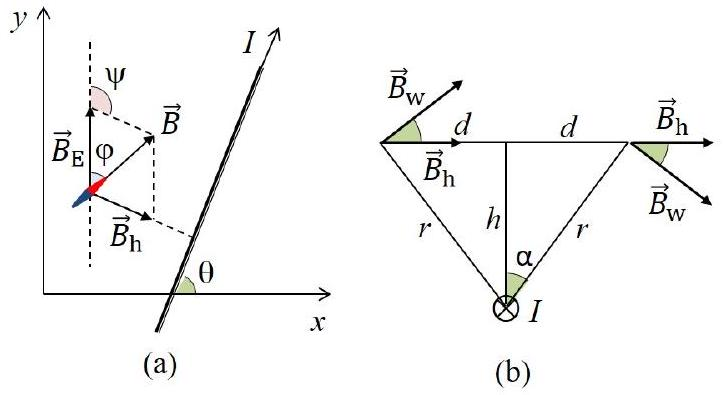
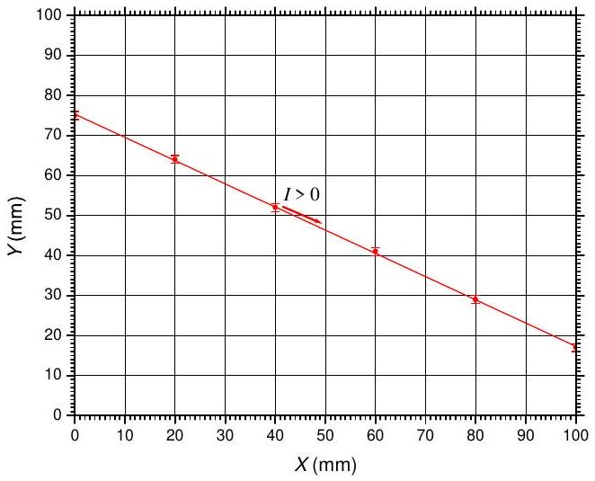
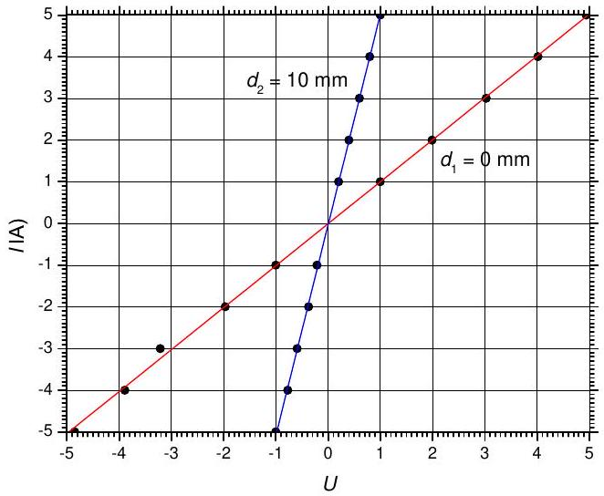
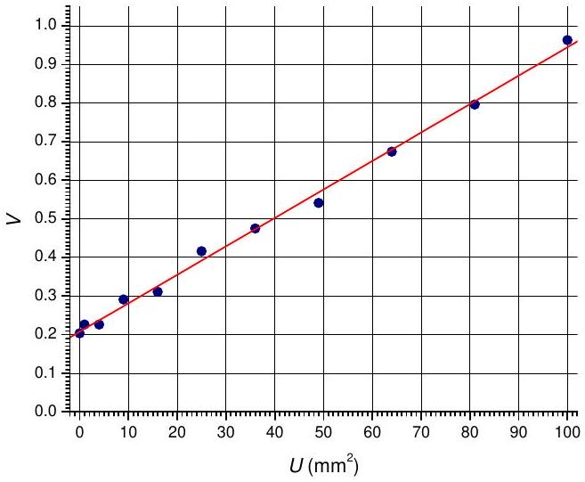

## E1: Hidden wire

## Theoretical background

As shown in Fig. 1, the horizontal projection $\vec { B } _ { \mathrm { h } }$ of the magnetic induction $\vec { B } _ { \mathrm { w } }$ of the wire has the same direction and is perpendicular to the wire in all points of the $x y$ plane. It is clear that $\vec { B } _ { \mathrm { h } }$ makes with North $( y )$ direction an angle $\psi = 180 ^ { \circ } - \theta$, where $\theta$ is the angle between the direction of the current and the positive $x$-direction. The magnetic needle points along the vector $\vec { B } = \vec { B } _ { \mathrm { h } } + \vec { B } _ { \mathrm { E } }$ of the total magnetic induction. As evident from the vector triangle on Fig. 1(a), the deflection angle $\varphi$ can be obtained through the sine-theorem:

$$
\begin{equation*}
\frac { B _ { \mathrm { h } } } { B _ { \mathrm { E } } } = \frac { \sin \varphi } { \sin ( \psi - \varphi ) } = \frac { \sin \varphi } { \sin ( \theta + \varphi ) } \tag{1}
\end{equation*}
$$

Consider a point on the surface at a distance $d$ from the wire projection onto $x y$ plane, and at a distance $r =$ $\sqrt { d ^ { 2 } + h ^ { 2 } }$ from the wire, as shown in Fig. 1(b). It follows from the Ampère's law that the magnitude of magnetic induction of the wire at that point is

$$
\begin{equation*}
B _ { \mathrm { w } } = \frac { \mu _ { 0 } I } { 2 \pi r } \tag{2}
\end{equation*}
$$

and the magnitude of its horizontal projection is

$$
\begin{equation*}
B _ { \mathrm { h } } = B _ { \mathrm { w } } \cos \alpha = \frac { \mu _ { 0 } I h } { 2 \pi \left( d ^ { 2 } + h ^ { 2 } \right) } . \tag{3}
\end{equation*}
$$

Equations (1) and (3) are sufficient to complete all tasks of the problem.

Figure 1: Notations used in the derivation of the basic equations.

## Task (a): Determination of the horizontal position of the wire

As evident from the vector triangle (Fig. 1), the maximum absolute value of the deflection angle at a given current is met at $d = 0$ where $B _ { \mathrm { h } }$ is maximal, i.e. vertically above the wire. Therefore, the wire can be tracked by finding two or more points on the surface where $| \varphi |$ reaches a maximum. First, a coarse scan of the border with a step of, say, 10 mm, can be performed in order to locate intervals, where $| \varphi |$ goes through a maximum. In this way we establish that the wire projection crosses the West side $( x = 0 \mathrm {~mm} )$ at $y \in [ 60 \mathrm {~mm} , 90 \mathrm {~mm} ]$ and the East side $( x = 100 \mathrm {~mm} )$ at $y \in [ 10 \mathrm {~mm} , 30 \mathrm {~mm} ]$. A finer scan of

Table 1: Points, where $| \varphi |$ reaches a maximum of 143° at a current $I = + 5 \mathrm {~A}$.
| $x$ (mm) | $y ( \mathrm {~mm} )$ |
| :--- | :--- |
| 0 | 75 |
| 20 | 64 |
| 40 | 52 |
| 60 | 41 |
| 80 | 29 |
| 100 | 17 |

these intervals with a step of 1 mm allows to determine the approximate coordinates of the two crosspoints as $P _ { 1 } = ( 0.0 \pm 0.5,75 \pm 1 ) \mathrm { mm }$ and $P _ { 2 } = ( 100.0 \pm 0.5,17 \pm 1 ) \mathrm { mm }$. The uncertainty of the $y$ coordinate is 1 mm since near the maximum $| \varphi |$ changes slowly and takes the same rounded value at three consecutive points. Additional scans along vertical (horizontal) lines of intermediate $x$ (y) values could be done in order to find more points along the wire projection, and to determine the equation of the wire more precisely by means of a least-squares fit. A typical set of values is given in Table 1. The fitted equation of the wire is, respectively

$$
\begin{equation*}
y = a x + b = - 0.58 x + 75.3 \mathrm {~mm} \tag{4}
\end{equation*}
$$

with estimated parameter uncertainties of $\delta a \approx 0.01$ and $\delta b \approx 0.4 \mathrm {~mm}$. The parameter uncertainties scale as $1 / \sqrt { N }$, where $N$ is the number of experimental points. A graph of the wire projection in the $x y$-plane is shown in Fig. 2. Since $\varphi < 0$ at $I > 0$, the positive $I$ direction is from the West to the East border, as shown in the graph.

Figure 2: $x y$-projection of the wire with indicated positive $I$ direction.

## Task (b): Determination of $h$ and $B _ { \mathrm { E } }$

As follows from equations (1) and (3), the deflection angle $\varphi$ at a distance $d$ from the horizontal projection of the wire satisfies the equation

$$
\begin{equation*}
\frac { \sin \varphi } { \sin ( \theta + \varphi ) } = \frac { \mu _ { 0 } I h } { 2 \pi B _ { \mathrm { E } } \left( d ^ { 2 } + h ^ { 2 } \right) } . \tag{5}
\end{equation*}
$$

where the angle $\theta$ can be calculated from the slope coefficient $a$ of the wire:

$$
\begin{equation*}
\theta = \arctan ( a ) = - 30.1 ^ { \circ } \pm 0.4 ^ { \circ } \tag{6}
\end{equation*}
$$

Table 2: Experimental data for the deflection angle $\varphi$ vs. current $I$ at two different distances $d$.
| (0 mm,75 mm); |  |  | (20 mm,75 mm); |  |  |
| :--- | :--- | :--- | :--- | :--- | :--- |
| $d _ { 1 } = 0 \mathrm {~mm}$ |  |  | $d _ { 2 } = 10 \mathrm {~mm}$ |  |  |
| $I$ (A) | $\varphi$ (deg) | $U$ | $I$ (A) | $\varphi$ (deg) | $U$ |
| -5.0 | 25 | -4.85 | -5.0 | 15 | -1.00 |
| -4.0 | 24 | -3.89 | -4.0 | 13 | -0.77 |
| -3.0 | 23 | -3.21 | -3.0 | 11 | -0.59 |
| -2.0 | 20 | -1.97 | -2.0 | 8 | -0.37 |
| -1.0 | 15 | -1.00 | -1.0 | 5 | -0.21 |
| 1.0 | -75 | 1.00 | 1.0 | -7 | 0.20 |
| 2.0 | -126 | 1.99 | 2.0 | -17 | 0.40 |
| 3.0 | -137 | 3.03 | 3.0 | -32 | 0.60 |
| 4.0 | -141 | 4.02 | 4.0 | -52 | 0.80 |
| 5.0 | -143 | 4.94 | 5.0 | -75 | 1.00 |
| $k _ { 1 } = 1.01 \pm 0.01 \mathrm {~A}$ |  |  | $k _ { 2 } = 5.04 \pm 0.03 \mathrm {~A}$ |  |  |

The distance $d$ between a point with coordinates $( x , y )$ and the wire projection can either be measured directly on the graph in Fig. 2, or calculated as:

$$
\begin{equation*}
d = | ( a x + b - y ) \cos \theta | \approx 0.865 | a x + b - y | \tag{7}
\end{equation*}
$$

It follows from equations (5)-(7) that the unknown $h$ and $B _ { \mathrm { E } }$ could be determined if the deflection angle $\varphi$ is measured in at least two points situated at different distances from the wire. However, due to the random error, associated with compass positioning and the rounding error of the angle reading, such a minimalist approach is quite inaccurate. Therefore, systematic measurements at several distances $d$ and/or different currents $I$, are necessary to obtain sufficiently precise estimate for $h$ and $B _ { \mathrm { E } }$. Two generic approaches could be followed, as well as a combination between them.

Method I. Varying the current at fixed distances. By defining a new dimensionless variable $U = \sin \varphi / \sin \left( \varphi - 30.1 ^ { \circ } \right)$, equation (5) is linearized as:

$$
\begin{equation*}
I = k U \tag{8}
\end{equation*}
$$

where the slope coefficient is:

$$
\begin{equation*}
k = \frac { 2 \pi B _ { \mathrm { E } } \left( d ^ { 2 } + h ^ { 2 } \right) } { \mu _ { 0 } h } \tag{9}
\end{equation*}
$$

Therefore, the unknown $B _ { \mathrm { E } }$ and $h$ can be estimated after obtaining $k$ for at least two different distances $d$ from the wire. Table 2 summarizes the results of measurements at $d _ { 1 } = 0 \mathrm {~mm}$ (vertically above the wire) and at $d _ { 2 } = 10 \mathrm {~mm}$ in a point with coordinates $x = 20 \mathrm {~mm}$ and $y = 75 \mathrm {~mm}$. Figure 3 shows the corresponding U-I graphs, and the estimated values of the slope coefficients are also listed in the table 2.

It follows from equation (8) that:

$$
\begin{equation*}
\frac { B _ { \mathrm { E } } } { h } = \frac { \mu _ { 0 } \left( k _ { 2 } - k _ { 1 } \right) } { 2 \pi \left( d _ { 2 } ^ { 2 } - d _ { 1 } ^ { 2 } \right) } = 8.06 \times 10 ^ { - 6 } \mathrm {~T} / \mathrm { mm } \tag{10}
\end{equation*}
$$

and

$$
\begin{equation*}
B _ { \mathrm { E } } h = \frac { \mu _ { 0 } \left( d _ { 2 } ^ { 2 } k _ { 1 } - d _ { 1 } ^ { 2 } k _ { 2 } \right) } { 2 \pi \left( d _ { 2 } ^ { 2 } - d _ { 1 } ^ { 2 } \right) } = 1.98 \times 10 ^ { - 4 } \mathrm {~T} \cdot \mathrm {~mm} \tag{11}
\end{equation*}
$$

Figure 3: U-I graphs for two different distances $d$ from the wire, and the corresponding linear fits.

Alternatively, one can also use

$$
\begin{equation*}
h = \sqrt { \frac { d _ { 2 } ^ { 2 } k _ { 1 } - d _ { 1 } ^ { 2 } k _ { 2 } } { k _ { 2 } - k _ { 1 } } } = 5.0 \mathrm {~mm} . \tag{12}
\end{equation*}
$$

Finally, we obtain for the horizontal component of the Earth's magnetic induction:

$$
\begin{equation*}
B _ { \mathrm { E } } = 4.0 \times 10 ^ { - 5 } \mathrm {~T} \tag{13}
\end{equation*}
$$

and for the depth of the wire:

$$
\begin{equation*}
h = 5.0 \mathrm {~mm} \tag{14}
\end{equation*}
$$

These estimates of $h$ and $B _ { \mathrm { E } }$ coincide with accuracy of two significant digits with the values preset in the simulation program.

Method II. Fixed current, varying the distance. Equation (5) can be rewritten in the form:

$$
\begin{equation*}
\frac { \sin ( \theta + \varphi ) } { \sin \varphi } = \frac { 2 \pi B _ { \mathrm { E } } } { \mu _ { 0 } I h } d ^ { 2 } + \frac { 2 \pi B _ { \mathrm { E } } h } { \mu _ { 0 } I } \tag{15}
\end{equation*}
$$

which can be linearized by setting new auxiliary variables: $U = d ^ { 2 }$ and $V = \sin \left( \varphi - 30.1 ^ { \circ } \right) / \sin \varphi$. A typical data set for this method is given in table 3, while the linearized U-V plot is shown in Fig. 4.

Table 3: Experimental data for the deflection angle $\varphi$ vs. distance $d$ at a fixed current $I = 5.0 \mathrm {~A}$.
| $x$ (mm) | $y$ (mm) | $d$ (mm) | $\varphi$ (deg) | $U \left( \mathrm {~mm} ^ { 2 } \right)$ | $V$ |
| :--- | :--- | :--- | :--- | :--- | :--- |
| 0 | 75 | 0 | -143 | 0 | 0.203 |
| 2 | 75 | 1 | -142 | 1 | 0.226 |
| 4 | 75 | 2 | -142 | 4 | 0.226 |
| 6 | 75 | 3 | -139 | 9 | 0.291 |
| 8 | 75 | 4 | -138 | 16 | 0.311 |
| 10 | 75 | 5 | -132 | 25 | 0.416 |
| 12 | 75 | 6 | -128 | 36 | 0.475 |
| 14 | 75 | 7 | -123 | 49 | 0.541 |
| 16 | 75 | 8 | -111 | 64 | 0.674 |
| 18 | 75 | 9 | -98 | 81 | 0.796 |
| 20 | 75 | 10 | -79 | 100 | 0.963 |

Figure 4: U-V graph obtained at a fixed current $I = 5.0 \mathrm {~A}$.

From the fitting line we obtain:

$$
\begin{equation*}
V = 7.37 \times 10 ^ { - 3 } \mathrm {~mm} ^ { - 2 } U + 0.208 \tag{16}
\end{equation*}
$$

which means $2 \pi B _ { \mathrm { E } } h / \left( \mu _ { 0 } I \right) = 0.208$ and $2 \pi B _ { \mathrm { E } } / \left( \mu _ { 0 } I h \right) =$ $7.37 \times 10 ^ { - 3 } \mathrm {~mm} ^ { - 2 }$. Thus, we obtain:

$$
\begin{equation*}
B _ { \mathrm { E } } = 3.9 \times 10 ^ { - 5 } \mathrm {~T} \tag{17}
\end{equation*}
$$

for the horizontal component of Earth's magnetic induction, and

$$
\begin{equation*}
h = 5.3 \mathrm {~mm} \tag{18}
\end{equation*}
$$

for the depth of the wire. These estimates are close to, but less accurate than the values obtained by Method I. The reason is that at small $d$, there is a large relative error associated with wire positioning, i.e. with variable $U$. At large $d$, however, the deflection angle is small, and there is significant relative error, associated with the compass reading, i.e. with $V$ parameter.
