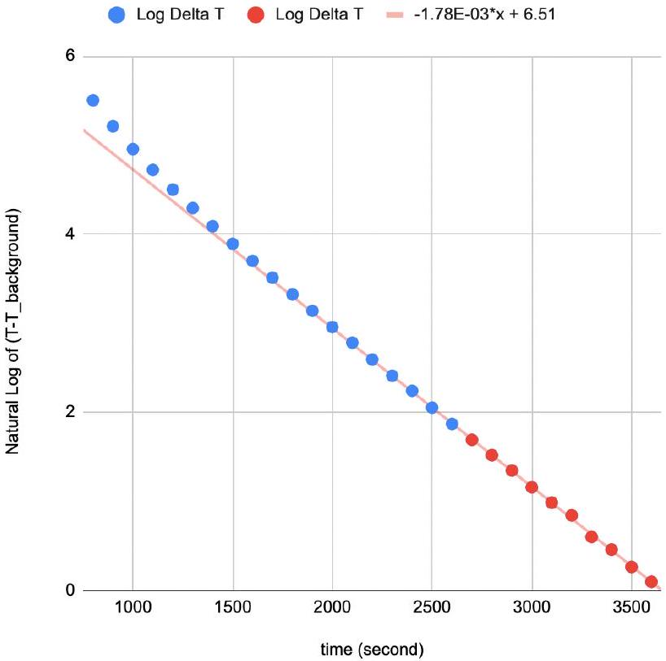

## E2: Hot Cylinder

Start the experiment with the heater on full for 300 Watts and the thermostats located evenly across the length of the rod and display the results every 100 seconds. Then plan out the remainder of the experiment while waiting, or do the other experiment. The rod reaches steady state at about 600 seconds. Find the average temperature at the five thermostats by considering the last five measurements; you will use this later.

The most accessible approach is then to study the steady state behavior, the uniform temperature behavior, the low temperature behavior, and the high temperature behavior. Separating the low and high temperature behaviors is useful because blackbody radiation dominates at higher temperatures while convective loss is most significant at near room temperature.

Finding the heat capacity is done by heating the rod at a low enough rate for a short enough time so that heat loss is as small as possible.

One possibility is to give a total of 1500 J of heat, but at various power settings and various times, while keeping the temperature as low as possible.

The average temperature of the rod is computed from the five equally spaced points by applying Simpson's rule,

$$
T _ { a v g } = \frac { T _ { 1 } + 4 T _ { 2 } + 2 T _ { 3 } + 4 T _ { 4 } + T _ { 5 } } { 12 }
$$

Computing instead a direct average yields a +5\% error.
It is found that the average temperature for heating times less than 50 seconds is $55.4 \pm 0.5 ^ { \circ } \mathrm { C }$, yielding specific heat capacity of $c = 114 \pm 1 \mathrm {~J} / \mathrm { kg }$ K.

Heat the rod full power for 600 seconds, and then allow to cool.

The rod temperature becomes uniform at about 700 seconds. Average the five points to obtain an average rod temperature.

Linear cooling predicts a straight line graph for $\ln \left( T - T _ { 0 } \right)$ versus $t$

The convective heat loss rate is then given by $A \alpha ( T -$ $T _ { 0 }$ ), where $A$ is the surface area of the rod. Do not forget the end caps!

The radiative heat loss rate is $\beta \sigma \left( T ^ { 4 } - T _ { 0 } ^ { 4 } \right)$ where $\sigma =$ $5.67 \times 10 ^ { - 8 } \mathrm {~W} / \left( \mathrm { m } ^ { 2 } \mathrm {~K} ^ { 4 } \right)$. The radiative heat loss rate is then given by $A \beta \sigma \left( T ^ { 4 } - T _ { 0 } ^ { 4 } \right)$.

Note that at temperatures close to $T _ { 0 }$ the radiative expression can be written as

$$
A \beta \sigma \left( T ^ { 4 } - T _ { 0 } ^ { 4 } \right) \approx A \beta \sigma 4 \left( T - T _ { 0 } \right) T _ { 0 } ^ { 3 }
$$

This means that the linear heat loss rate at temperatures close to $T _ { 0 }$ is

$$
A \left( \alpha + \beta \sigma 4 T _ { 0 } ^ { 3 } \right) \left( T - T _ { 0 } \right)
$$

For the uniform, low temperature cooling rod,

$$
m c \frac { \mathrm {~d} T } { \mathrm {~d} t } = - A \left( \alpha + \beta \sigma 4 T _ { 0 } ^ { 3 } \right) \left( T - T _ { 0 } \right)
$$

The solution is of the form

$$
T - T _ { 0 } = C e ^ { - B t }
$$

where

$$
B = A \frac { \alpha + \beta \sigma 4 T _ { 0 } ^ { 3 } } { m c }
$$

On a log plot of $\ln \left( T - T _ { 0 } \right)$ as a function of time $t$, the plot should be linear, with a slope given by

$$
- A \frac { \alpha + \beta \sigma 4 T _ { 0 } ^ { 3 } } { m c }
$$

It is also possible to plot $\mathrm { d } T / \mathrm { d } t$ as a function of $T - T _ { 0 }$, and the plot will be linear, with a slope also given by

$$
- A \frac { \alpha + \beta \sigma 4 T _ { 0 } ^ { 3 } } { m c }
$$

The slope in either case is found to be $- 1.78 \times 10 ^ { - 3 } / \mathrm { s }$.

Uniform Cooling

Note that only the last points (in red) were used to determine the linear cooling line. It is clearly a good fit from $t = 2000 \mathrm {~s}$ on, which corresponds to rod temperatures of $T < 45 \mathrm { C }$.

To find the blackbody behavior we want to heat the rod as much as possible such that the blackbody heating becomes the dominant form of heat loss. Since the hot rod is in steady state, the heat radiated must be equal to 300 W. Use the results from the beginning.

The average temperature of the rod is computed from the five equally spaced points by

$$
T _ { a v g } = \frac { T _ { 1 } + 4 T _ { 2 } + 2 T _ { 3 } + 4 T _ { 4 } + T _ { 5 } } { 12 } = 662 ^ { \circ } \mathrm { C } .
$$

Computing a direct average yields a +1.5\% error.
The average of $T ^ { 4 }$ is found from

$$
T _ { \mathrm { avg } } ^ { 4 } = \frac { T _ { 1 } { } ^ { 4 } + 4 T _ { 2 } { } ^ { 4 } + 2 T _ { 3 } { } ^ { 4 } + 4 T _ { 4 } { } ^ { 4 } + T _ { 5 } { } ^ { 4 } } { 12 } = 7.95 \times 10 ^ { 11 } \mathrm {~K} ^ { 4 }
$$

Computing a direct average yields a +6.3\% error.
The rate of linear temperature heat loss is found from above to be

$$
\left( - 1.78 \times 10 ^ { - 3 } / \mathrm { s } \right) m c \Delta T = 59 \mathrm {~W}
$$

The blackbody remainder term is then

$$
300 - 59 = 241 \mathrm {~W} ,
$$

and necessarily equals

$$
A \beta \sigma \left( T ^ { 4 } - T _ { 0 } ^ { 4 } \right) - A \beta \sigma 4 T _ { 0 } ^ { 3 } \left( T - T _ { 0 } \right) ,
$$

where the second term reflects the fact that we had considered part of the blackbody behavior as being linear.

Solving, $\beta = 0.304 \pm 0.004$.
Failing to subtract the second term would yield $\beta =$ 0.28.

We are now in a position to find $\alpha$, from

$$
- A \frac { \alpha + \beta \sigma 4 T _ { 0 } ^ { 3 } } { m c } = - 1.78 \times 10 ^ { - 3 } / \mathrm { s }
$$

which yields $\alpha = 2.93$
Alternatively, for the uniform, high temperature cooling rod,

$$
m c \frac { \mathrm {~d} T } { \mathrm {~d} t } \approx - A \beta \sigma \left( T ^ { 4 } - T _ { 0 } ^ { 4 } \right)
$$

as the radiative cooling effect will dominate.
On a plot of $\mathrm { d } T / \mathrm { d } t$ as a function of $T ^ { 4 } - T _ { 0 } ^ { 4 }$, the plot should be linear, with a slope given by

$$
- \frac { A \beta \sigma } { m c }
$$

The slope is found to be $- 7.8 \times 10 ^ { - 12 } \mathrm {~K} ^ { 3 } / \mathrm { s }$
This means $\beta / c = 3.25 \times 10 ^ { - 3 } \mathrm {~kg} \mathrm {~K} / \mathrm { J }$; this gives $\beta = 0.36$, which is too high; ignoring the linear loss effects was significant; as was previously seen, almost 20\% of the heat loss is from convection in this temperature range.

We can use the high temperature behavior to find the heat flux through the center of the rod. The average of $T$ and $T ^ { 4 }$ on the non-heated half of the rod is 599 C and $5.8 \times 10 ^ { 4 } \mathrm {~K} ^ { 4 }$, yielding a heat loss at 112 W. That heat necessarily came from the other side of the rod.

The temperature gradient is -898 K/m, so $k =$ 397 W/mK. Don't forget that the formula provided gave the rate of heat flux, which means that we needed to consider the cross sectional area of the wire.
