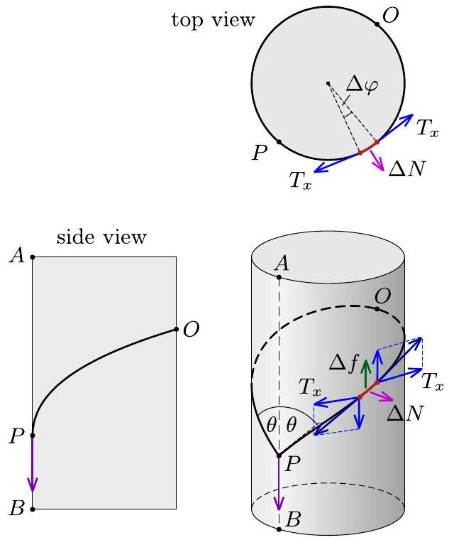
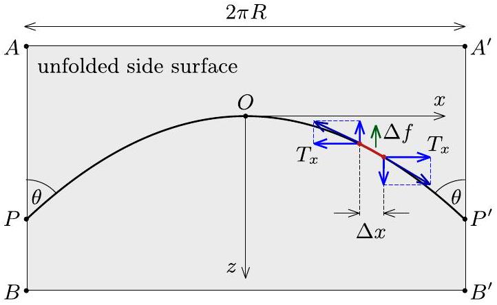
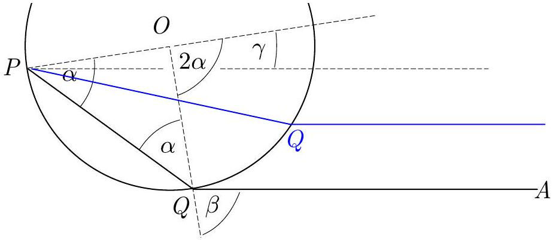
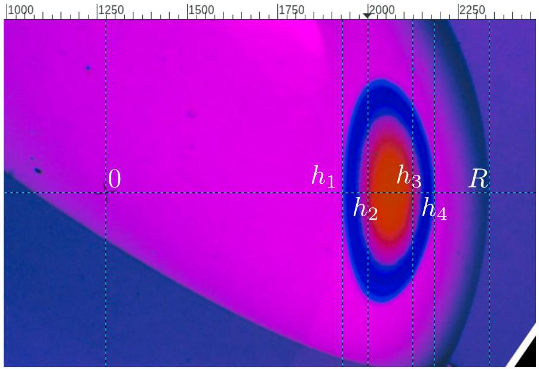

## T1: A Leak

Let $p _ { 1 } , V _ { 1 } , T _ { 1 }$ denote the (time dependent) pressure, volume, and temperature in the upper chamber, and $p _ { 2 } , V _ { 2 }$, $T _ { 2 }$ - those in the lower one. Note that $V _ { 1 } \equiv V$ does not change.

Consider a parcel of volume $v$ below the diaphragm containing $n$ moles of helium. It is convenient to imagine it bounded by two fictitious free thin massless pistons. During slow perturbations the parcel undergoes an adiabatic process. The pressure and the temperature for the parcel are actually the pressure and the temperature for entire lower chamber $p _ { 2 }$ and $T _ { 2 }$. The energy conservation for the parcel is

$$
0 = p _ { 2 } \mathrm {~d} v + \mathrm { d } \left( \frac { 3 } { 2 } n _ { v } R T _ { 2 } \right) = \frac { 5 } { 2 } p _ { 2 } \mathrm {~d} v + \frac { 3 } { 2 } v \mathrm {~d} p _ { 2 } .
$$

This gives

$$
\begin{align*}
v ^ { 5 } p _ { 2 } ^ { 3 } & = \text { const } ,  \tag{1}\\
T _ { 2 } ^ { 5 } p _ { 2 } ^ { - 2 } & = \text { const } . \tag{2}
\end{align*}
$$

The leak begins when the pressure below the diaphragm exceeds that in the upper chamber by $\Delta p \equiv$ $p _ { 0 } - p = m g H / V = p x$, where

$$
\begin{equation*}
x = \frac { m g H } { p V } . \tag{a.,b.,c.}
\end{equation*}
$$

a. We may let $v = V _ { 2 }$ before that.

$$
\begin{gather*}
V ^ { 5 } p ^ { 3 } = V _ { 0 } ^ { 5 } ( p + \Delta p ) ^ { 3 } = V _ { 0 } ^ { 5 } p ^ { 3 } ( 1 + x ) ^ { 3 } \\
V _ { 0 } = V ( 1 + x ) ^ { - 3 / 5 } \tag{a.}
\end{gather*}
$$

b. The energy conservation for the whole system:

$$
\begin{gathered}
0 = p _ { 1 } \mathrm {~d} V _ { 1 } + \mathrm { d } \left( \frac { 3 } { 2 } n _ { 1 } R T _ { 1 } \right) + p _ { 2 } \mathrm {~d} V _ { 2 } + \mathrm { d } \left( \frac { 3 } { 2 } n _ { 2 } R T _ { 2 } \right) = \\
\frac { 5 } { 2 } \left( p _ { 1 } \mathrm {~d} V _ { 1 } + p _ { 2 } \mathrm {~d} V _ { 2 } \right) + \frac { 3 } { 2 } \left( V _ { 1 } \mathrm {~d} p _ { 1 } + V _ { 2 } \mathrm {~d} p _ { 2 } \right) = \\
\frac { 5 } { 2 } p _ { 2 } \mathrm {~d} \left( V + V _ { 2 } \right) + \frac { 3 } { 2 } \left( V + V _ { 2 } \right) \mathrm { d } p _ { 2 }
\end{gathered}
$$

since the pressure above the diaphragm remains lower than that below by the same margin $\Delta p$ during the later process and $\mathrm { d } V _ { 2 } = \mathrm { d } \left( V + V _ { 2 } \right)$. Similarly to (1), we get

$$
\left( V + V _ { 2 } \right) ^ { 5 } p _ { 2 } ^ { 3 } = \text { const } .
$$

The pressure $p _ { 2 } ^ { \prime }$ in the lower chamber when the piston touches the diaphragm is found from the equation

$$
\begin{gather*}
V ^ { 5 } p _ { 2 } ^ { \prime 3 } = \left( V + V _ { 0 } \right) ^ { 5 } p _ { 0 } ^ { 3 } = V ^ { 5 } \left( 1 + \frac { 1 } { ( 1 + x ) ^ { 3 / 5 } } \right) ^ { 5 } p ^ { 3 } ( 1 + x ) ^ { 3 } \\
p _ { 2 } ^ { \prime } = p \left( 1 + ( 1 + x ) ^ { 3 / 5 } \right) ^ { 5 / 3 } \tag{3}
\end{gather*}
$$

The pressure in the upper chamber at this moment is

$$
p _ { 1 } ^ { \prime } = p _ { 2 } ^ { \prime } - \Delta p = p \left( \left( 1 + ( 1 + x ) ^ { 3 / 5 } \right) ^ { 5 / 3 } - x \right) .
$$

The temperature in the upper chamber is found from the equations of state $p V = n R T$ and $p ^ { \prime } V = ( 2 n ) R T ^ { \prime }$

$$
\begin{equation*}
T _ { 1 } ^ { \prime } = \frac { T } { 2 } \left( \left( 1 + ( 1 + x ) ^ { 3 / 5 } \right) ^ { 5 / 3 } - x \right) . \tag{b.}
\end{equation*}
$$

The temperature and the pressure in the lower chamber are related by (2). Substituting (3) we get

$$
\begin{equation*}
T _ { 2 } ^ { \prime } = T \left( \frac { p _ { 2 } ^ { \prime } } { p } \right) ^ { 2 / 5 } = T \left( 1 + ( 1 + x ) ^ { 3 / 5 } \right) ^ { 2 / 3 } . \tag{c.}
\end{equation*}
$$

## Preliminary grading scheme

a1 It's stated (or written as a formula) that the process is adiabatic
a2 Relation between $V$ and $p$ is found in adiabaic process
a3 Condition on when the diaphragm leaks
a4 Answer for $V _ { 0 }$
b1 Energy conservation for the whole system in differential form. If conservation law is written only for one half but heat transfer is taken into account: 0.5 pts.
b2 Internal energy for a mono-atomic gas
b3 Usage of $V _ { 1 } = \mathrm { const }$
b3 Usage of $p _ { 2 } - p _ { 1 } =$ const
b4 Relation between $V _ { 2 }$ and $p _ { 2 }$
b5 Equation to find $p _ { 2 } ^ { \prime }$ (or $T _ { 2 } ^ { \prime }$ ) before the end
b6 Usage of $n ^ { \prime } = 2 n$
b7 Answer for $T _ { 1 } ^ { \prime }$
c1 Relation between $T _ { 1 } ^ { \prime }$ and $T _ { 2 } ^ { \prime }$
c2 Answer for $T _ { 2 } ^ { \prime }$

Arithmetic or typo errors gives half of point (rounded up to 0.1) for the item and is not considered as a mistake afterwards.

## T2: Thread on cylinder

Fig. 1 shows the cylinder and the loop from three different angles; $P$ denotes the pulled point of the loop, while $O$ is the top point of the thread.

Fig. 1

Imagine that the side of the cylinder is cut along the generatrix $A B$ passing through point $P$, and then the side (including the loop) is unfolded as shown in Fig. 2. In this figure points $A$ and $A ^ { \prime } , B$ and $B ^ { \prime } , P$ and $P ^ { \prime }$ are

equivalent, respectively. Let us introduce a Cartesian coordinate system on this unfolded plane so that point $O$ is the origin, axis $z$ is parallel with the axis of cylinder and directed downwards, axis $x$ is perpendicular to $z$ (i.e. horizontal).

Fig. 2

Consider the forces acting on a small piece of the thread (with horizontal projection $\Delta x$ ) indicated with red line in both figures. These are the tensions at both ends of the small piece exerted by neighbouring parts of the thread, the normal force $\Delta N$ and the friction force $\Delta f$ exerted by the cylinder. On the verge of slipping, the direction of $\Delta f$ is parallel to the $z$-axis. Since the small piece of thread is in equilibrium, the $x$-component of the tension is the same everywhere:

$$
T _ { x } = \text { const } .
$$

The normal force $\Delta N$ can be determined by looking at the top view of the loop in Fig. 1. The polar angle corresponding to small piece of thread is $\Delta \varphi = \Delta x / R$, so the force balance in the radial direction can be written as

$$
\begin{equation*}
2 T _ { x } \underbrace { \sin \frac { \Delta \varphi } { 2 } } _ { \approx \Delta \varphi / 2 } - \Delta N = 0 \quad \longrightarrow \quad \Delta N = T _ { x } \frac { \Delta x } { R } . \tag{4}
\end{equation*}
$$

The frictional force on the verge of slipping is given by

$$
\begin{equation*}
\Delta f = \mu \Delta N . \tag{5}
\end{equation*}
$$

Thus, the force balance on the small piece of thread in the $z$ direction (see Fig. 2):

$$
\begin{equation*}
\left. T _ { x } \frac { \mathrm {~d} z } { \mathrm {~d} x } \right| _ { x + \Delta x } - \left. T _ { x } \frac { \mathrm {~d} z } { \mathrm {~d} x } \right| _ { x } - \Delta f = 0 , \tag{6}
\end{equation*}
$$

where we expressed the $z$-component of the tension forces with $T _ { x }$ and the tangent $\mathrm { d } z / \mathrm { d } x$. Using the three equations above and taking the limit $\Delta x \rightarrow 0$, we get the differential equation

$$
\frac { \mathrm { d } ^ { 2 } z } { \mathrm {~d} x ^ { 2 } } = \frac { \mu } { R } ,
$$

where we used the fact that $T _ { x } \neq 0$. By direct integration and taking into account the boundary conditions $z ( 0 ) = 0$ and $z ^ { \prime } ( 0 ) = 0$ we get

$$
z ( x ) = \frac { \mu } { 2 R } x ^ { 2 } ,
$$

so the shape of the thread on the unfolded side surface (Fig. 2) can be described by a parabola.

The thread needs to span over the entire cylinder, so its length can be calculated as

$$
L _ { 0 } = \int _ { - \pi R } ^ { \pi R } \sqrt { \mathrm {~d} x ^ { 2 } + \mathrm { d } z ^ { 2 } } = 2 \int _ { 0 } ^ { \pi R } \sqrt { 1 + \left( \frac { \mathrm { d } z } { \mathrm {~d} x } \right) ^ { 2 } } \mathrm {~d} x .
$$

Substituting the $z ( x )$ function we get:

$$
L _ { 0 } = 2 \int _ { 0 } ^ { \pi R } \sqrt { 1 + \left( \frac { \mu x } { R } \right) ^ { 2 } } \mathrm {~d} x = \left( \frac { R } { \mu } \right) 2 \int _ { 0 } ^ { \pi \mu } \sqrt { 1 + \xi ^ { 2 } } \mathrm {~d} \xi ,
$$

where we introduced the notation $\xi = \mu x / R$. Using the integral given in the text of the problem:

$$
L _ { 0 } = \pi R \sqrt { 1 + ( \pi \mu ) ^ { 2 } } + \frac { R } { \mu } \operatorname { arcsinh } ( \pi \mu ) .
$$

If the length of the thread is shorter than the length calculated here, then there is no solution satisfying the thread length constraint, i.e. the thread cannot slip.

Note. In the limit $\mu \rightarrow 0$ the loop slips even if $L = 2 \pi R$, which should be reproduced by our final formula. Using the relation for the inverse hyperbolic function given in the problem text, then expanding the logarithm in Taylor series in linear order around 0 we get:

$$
\operatorname { arcsinh } x \equiv \ln \left( x + \sqrt { 1 + x ^ { 2 } } \right) \approx \ln ( x + 1 ) \approx x ,
$$

so for small values of $\mu$ we get

$$
L _ { 0 } \approx \pi R + \frac { R } { \mu } ( \pi \mu ) = 2 \pi R .
$$

| Grading scheme: T2 |  |
| :--- | :--- |
| 2-i. A figure or figures reflecting the correct geometry such as: the loop is a non-planar curve in all figures (0.5 p), existence of exactly one cusp (0.5 p, if the „back” is hidden, 0 p). | $0.5 \mathrm { p } + 0.5 \mathrm { p }$ |
| 2-ii. Realizing that on the verge of slipping the frictional force is parallel with the axis of the cylinder for every small piece of the thread and $\Delta f = \mu \Delta N$. (If any of the two is missing, then 0.2 p) | 0.5 p |
| 2-iii. Correct equation for the force balance in $z$ direction involving frictional force or the load (which is pulling down the loop) and the $z$ components of the tension. | 0.5 p |
| 2-iv. $T _ { x } =$ const. + correct explanation based on the balance in $x$ direction. If the physics is incompatible with the geometrical assumptions (e.g. planar curve for the loop and the existence of a frictional force acting on small pieces), no points are given | $0.5 \mathrm { p } + 1.5 \mathrm { p }$ |
| 2-v. Expressing the normal force $\Delta N$ acting on a small segment with $T _ { x }$ and $\mathrm { d } x$ (or $\mathrm { d } \phi$ ). If the relation $x = R \varphi$ or $\mathrm { d } x = R \mathrm {~d} \varphi$ is not used here or anywhere else, 1.5 p is given. If the expression is wrong but $\Delta N$ is proportional to the curvature $( 1 / R )$, 1.0 p is given. | 2.0 p |

| 2-vi. Deriving the correct differential equation for $z ( x )$ (if the diff. equation is wrong due to any reason, 0 p) | 1.5 p |
| :--- | :--- |
| 2-vii. Solving the diff. equation for $z ( x )$ correctly (including boundary conditions). If only one integral is evaluated correctly, 0.3 p are given. For stating only the boundary conditions (both $z ( 0 )$ and $\left. z ^ { \prime } ( 0 ) \right) 0.2$ p. | 1.0 p |
| 2-viii. Writing down the length of the thread in terms of an integral of $z ( x )$, i.e. writing down the length constraint | 0.5 p |
| 2-ix. Evaluating the integral correctly (factor mistake in calculation 0.5 p, wrong units 0.2 p) | 1.0 p |
| Total T2: | 10.0 p |

## General guidelines for marking:

- Granularity for marks is 0.1 p.
- A simple numerical error resulting from a typo is punished by 0.2 p unless the grading scheme explicitly says otherwise.
- Errors which cause dimensionally wrong results are punished by at least 50 \% of the marks unless the grading scheme explicitly says otherwise.
- Propagating errors are not punished repeatedly unless they either lead to considerable simplifications or wrong results whose validity can easily be checked later.

## T3: Glass ball

To begin with, let us notice that if a ray coming from a point $P$ on the stripe is refracted at point $Q$ at the surface of the ball towards a very distant point $A$ (which denotes the aperture of the camera lens), the ray will remain in the plane $P Q O$ where $O$ is the centre of the sphere. This means that those rays which arrive from $P$ to $A$ must lay in the plane $P O A$, and the rays can be conveniently depicted in the $P O A$-plane.

The angle $\gamma = \gamma ( \alpha )$ between vectors $P O$ and $Q A$ is given by

$$
\begin{array} { r }
\gamma \equiv 2 \alpha - \beta \\
n \sin \alpha = \sin \beta \tag{8}
\end{array}
$$

and is a non-monotonous function of $\alpha$ which achieves its maximum $\gamma _ { 0 }$ by a certain $\alpha _ { 0 }$. This means that for a fixed $P$ and $A$, if $\angle O P A < \gamma _ { 0 }$, there are two such angles $\alpha$ and, hence, two such positions $Q _ { 1 }$ and $Q _ { 2 }$ for the point $Q$ that the ray $P Q A$ will reach the point $A$ (here we have assumed that the point $A$ is at a very big distance). So, when viewed from the point $A$, the image of the point $P$ is split into two points $Q _ { 1 }$ and $Q _ { 2 }$. On the other hand, if $\angle O P A > \gamma _ { 0 }$, rays from $P$ cannot reach $A$, and such points on the stripe cannot be seen in the photo. If $\angle O P A =$ $\gamma _ { 0 }$, the two images $Q _ { 1 }$ and $Q _ { 2 }$ merge into a single point bridging the two images of a piece of stripe into a closed loop.

Now it becomes clear that the place where images $Q _ { 1 }$ and $Q _ { 2 }$ merge into a single image $Q _ { 0 }$ is the key to finding the coefficient of refraction. Indeed, the point $Q _ { 0 }$ can be found in the photo as the point where the blue ellipse (the images of a segment of the stripe in red light as the blue shadow is where the red light is missing) is touching a radius of the ball, see the figure below (we need to find tangent point with the radius because we need to consider plane $Q O A$ which projects into a line through the ball's centre). There is no difference between taking the tangent to the outer edge of the elliptical stripe and taking the tangent to the inner edge of it (point $Q _ { 0 } ^ { \prime }$ in the photo below). Then, $\sin \beta _ { 0 } = n \sin \alpha _ { 0 }$ can be determined from the photo as the ratio of the lengths $h$ and $R , h / R \approx 0.765$, where $h$ denotes the distance of the ball's centre $O$ from the line $Q _ { 0 } A$, measurable in the photo as the length $O Q _ { 0 }$ (when looking from the distant point $A$, we can see only the perpendicular-to- $O A$ component of the segment $O Q _ { 0 }$, and $R$ is the ball's radius.

Since we look for an extremum of $\gamma$, upon taking differentials from Eqns. (7,8), we obtain

$$
\begin{array} { r }
2 \mathrm {~d} \alpha = \mathrm { d } \beta \\
n \cos \alpha \mathrm {~d} \alpha = \cos \beta \mathrm { d } \beta
\end{array}
$$

from where

$$
\begin{gathered}
n \cos \alpha = 2 \cos \beta \\
n = \sqrt { \sin ^ { 2 } \beta + 4 \cos ^ { 2 } \beta } = \sqrt { 4 - 3 \sin ^ { 2 } \beta } \approx 1.498 \approx 1.50
\end{gathered}
$$

In order to find $\Delta n$, we could find in a similar way $n _ { V }$ $\left( \left| O Q _ { 0 } ^ { \prime \prime } \right| \approx 0.755 R , n \approx 1.513 \approx 1.51 \right)$, but the result would have a huge relative uncertainty as $\left| O Q _ { 0 } \right|$ and $\left| O Q _ { 0 } ^ { \prime \prime } \right|$ have very similar lengths. A much more precise result will be obtained if we base our calculations on the segment length $| S T |$, see the figure below. $Q _ { 0 } ^ { \prime \prime }$ is where the blue rays have an extremum for $\gamma$ while $Q _ { 0 } ^ { \prime }$ and $Q _ { 0 } ^ { \prime \prime }$ are two red rays originating from the same point on the stripe. From the photo we can measure $| S T | \approx 0.20 R$, hence we can use the small parameter $S Q _ { 0 } ^ { \prime \prime } / R \approx 0.10$.

Rays from $S , T$, and $Q _ { 0 } ^ { \prime \prime }$ arrive to the lens aperture, so all these rays (which originate from the same point $P$ on the stripe) have the same value of $\gamma$. So, we have a set of equations

$$
\begin{array} { r }
\gamma \equiv 2 \alpha _ { R } - \beta _ { R } = 2 \alpha _ { V } - \beta _ { V } \\
n _ { V } \sin \alpha _ { V } = \sin \beta _ { V } \\
\left( n _ { V } - \Delta n \right) \sin \alpha _ { R } = \sin \beta _ { R } \\
n _ { V } \cos \alpha _ { V } = 2 \cos \beta _ { V } , \tag{13}
\end{array}
$$

and we would like to get an expression relating $\Delta n$ to $\sin \beta _ { V 1 } - \sin \beta _ { V 2 }$, where the indices 1 and 2 relate to the two different solutions. Expressing $\alpha _ { R } = \alpha _ { V } + \delta$ we obtain from Eq. (10) that $\beta _ { R } = \beta _ { V } + 2 \delta$. Now, if we expand Eq. (12) into Taylor series, neglect the smallest term with $\Delta n \delta$, and keep in mind Eq. (11), we obtain

$$
n _ { V } \delta \cos \alpha _ { V } - n _ { V } \delta ^ { 2 } \frac { \sin \alpha _ { V } } { 2 } - \Delta n \sin \alpha _ { V } = 2 \delta \cos \beta _ { V } - 2 \delta ^ { 2 } \sin \beta _ { V } .
$$

Here the two linear-in- $\delta$ terms cancel out due to Eq. (13) so that with $\sin \beta _ { V } = n _ { V } \sin \alpha _ { V }$ we obtain

$$
\begin{equation*}
\Delta n = 3 n _ { V } \delta ^ { 2 } / 2 . \tag{14}
\end{equation*}
$$

On the other hand, $| S T | / R = \sin \beta _ { R 1 } - \sin \beta _ { R 2 } \approx \sin \left( \beta _ { V } + \right.$ $2 \delta ) - \sin \left( \beta _ { V } - 2 \delta \right) = 4 \delta \cos \beta _ { V }$, hence

$$
\begin{equation*}
\Delta n = \frac { 3 n _ { V } } { 2 } \left( \frac { | S T | } { 4 R \cos \beta _ { V } } \right) ^ { 2 } = \frac { 3 n _ { V } } { 32 } \frac { | S T | ^ { 2 } } { R ^ { 2 } - h ^ { 2 } } \approx 0.0132 \approx 0.013 . \tag{15}
\end{equation*}
$$

## Grading scheme

A-i

- Proving that we can see a loop because for a range of points on the thread, a single point of thread creates two images: 0.7 pts
- The endpoints of that thread create one image forming thereby a closed loop: 0.3 pts

Else if only the fact that rays coming to A must be in the PQO plane is stated: 0.3 pts

A-ii Drawing a ray diagram where we can see that two rays originating from a single point arrive both to the lens while crossing the ball's surface at different points and following the Snell's law: 1.0 pt Else if such idea is demonstrated by words or by a rough sketch (which does not obey Snell's law): 0.5 pts

B-i Relating angle $\beta$ to the measurable distance $h$ in the photo (any point on the blue or red ellipse will earn the mark): 1pt

B-ii Measuring ratio of $h$ to $R$ : 0.5 pts
B-iii The idea of using point $Q _ { 0 } : 1$ pt (using $Q _ { 0 } ^ { \prime }$ will earn only 0.5 pts as this corresponds to the violet light)

B-iv Obtaining a correct expression of $\gamma$ as a function of $\alpha$ (or equivalent calculations in different parametrisation): 1 pt

B-v Finding extremum and hence, the final expression of $n$ as a function of $\beta$ or $h$ : 1pt. If an incorrect expression is obtained from reasonable physics because of mistakes in algebraic manipulation: 0.5 pts

B-vi If the numerical answer is correct within ±0.03 and is found using reasonable physics: 0.5 pts. Else if the numerical answer is correct within ±0.1 and is found using reasonable physics: 0.3 pts. No point if the answer is guessed or is found using completely wrong or irrelevant physics.

C-i The idea of using the width or length of the blue ellipse: 1 pt (red ellipse cannot be used as we don't know if the center of the red ellipse corresponds to the edge of the thread, or to a point at its middle)

C-ii Obtaining Eq (14) or something equivalent based on considering neighbouring red and violet rays: 1 pt. If an incorrect expression is obtained from reasonable physics because of mistakes in algebraic manipulation: 0.5 pts

C-iii Expressing $\Delta n$ correctly in terms of measurable quantities: 0.5 pts

C-iv Finding numerical answer correct within ±0.003: 0.5 pts. (0 pts if this answer is obtained without considering the width or height of the blue ellipse.)

## Solution 2

One may alternatively prefer to consider a plane, perpendicular to the thread and containing the ball centre $O$ and the camera $A$. This is the plane of symmetry for the system and corresponds to the maximum width of the ovals. The same arguments as in the first Solution lead to

$$
\gamma = \beta - 2 \arcsin \frac { \sin \beta } { n } = \arcsin \frac { h } { R } - 2 \arcsin \frac { h } { n R } .
$$

For $n < 2$ this function is not monotonous and may give the same result for two different values of $h$ (that is why the mapping of an arc is a closed oval).

To get the refraction index for red we solve the equation

$$
\arcsin \frac { h _ { 1 } } { R } - 2 \arcsin \frac { h _ { 1 } } { n _ { R } R } = \arcsin \frac { h _ { 4 } } { R } - 2 \arcsin \frac { h _ { 4 } } { n _ { R } R } ,
$$

which gives $n _ { R } \approx 1.51$.
One could repeat the previous argument to find $n _ { V }$. One could also compare the images of the same thread elements in different colours. This gives 4 equations

$$
\arcsin \frac { h _ { 1,4 } } { R } - 2 \arcsin \frac { h _ { 1,4 } } { n _ { R } R } = \arcsin \frac { h _ { 2,3 } } { R } - 2 \arcsin \frac { h _ { 2,3 } } { n _ { V } R } ,
$$

where $h _ { 1,4 }$ means we can replace it with the value of $h _ { 1 }$ or $h _ { 4 }$. Similar rule applies for $h _ { 2,3 }$. From each equation, we can solve for one value of $n _ { V }$ and then take their average. This results in $n _ { V } - n _ { R } \approx 0.0145$.

## Grading scheme

A-i

- Proving that we can see a loop because for a range of points on the thread, a single point of thread creates two images: 0.7 pts
- The endpoints of that thread create one image forming thereby a closed loop: 0.3 pts

Else if only the fact that rays coming to A must be in the PQO plane is stated: 0.3 pts

A-ii Drawing a ray diagram where we can see that two rays originating from a single point arrive both to the lens while crossing the ball's surface at different points and following the Snell's law: 1.0 pt Else if such idea is demonstrated by words or by a rough sketch (which does not obey Snell's law): 0.5 pts

B-i Relating angle $\beta$ to the measurable distance $h$ in the photo (any point on the blue or red ellipse will earn the mark): 1pt

B-ii Measuring ratio of $h$ to $R$ : 0.5 pts
B-iii The idea of using points on the blue ellipse lying on the same radius of the sphere: 1 pt

B-iv Obtaining the correct equation to solve for $n _ { R }$ numerically: 2 pts. If an incorrect equation is obtained from reasonable physics because of mistakes in algebraic manipulation: 1 pt

B-v If the numerical answer is correct within ±0.03 and is found using reasonable physics: 0.5 pts. Else if the numerical answer is correct within ±0.1 and is found using reasonable physics: 0.3 pts. No point if the answer is guessed or is found using completely wrong or irrelevant physics.

C-i The idea of using points on the red (or both) ellipse(s) lying on the same radius of the sphere: 1 pt

C-ii Obtaining at least one correct equation to solve for $n _ { V }$ numerically: 1.5 pts. If an incorrect equation is obtained from reasonable physics because of mistakes in algebraic manipulation: 1 pt

C-iii Finding numerical answer correct within ±0.003: 0.5 pts.
