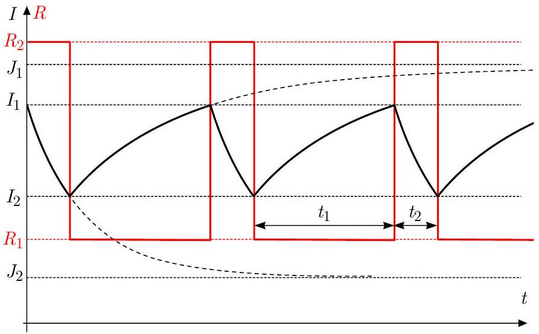
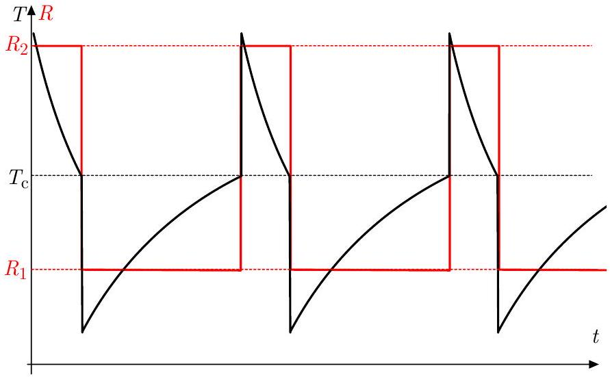
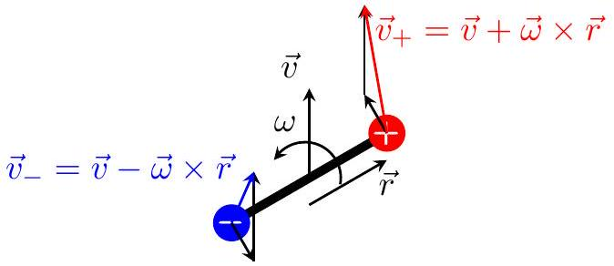
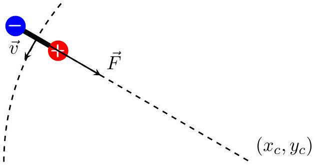
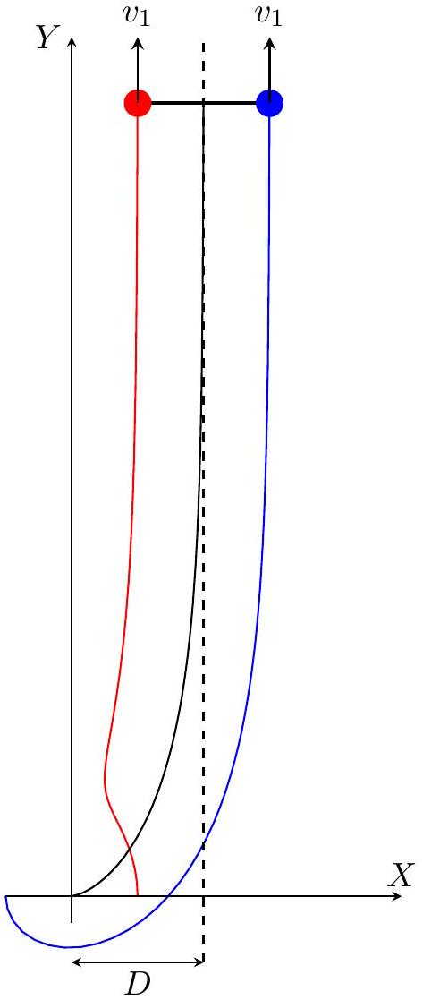

## General guidelines for marking

- Granularity for marks is 0.1 p.
- A simple numerical error resulting from a typo is punished by 0.2 p unless the grading scheme explicitly says otherwise.
- Errors which cause dimensionally wrong results are punished by at least 50 \% of the marks unless the grading scheme explicitly says otherwise.
- Propagating errors are not punished repeatedly unless they either lead to considerable simplifications or wrong results whose validity can easily be checked later.

## T1: Floating cylinder

## Solution I: energetic approach

Denote the density of the liquid by $\varrho$, so the density of the cylinder is $\gamma \varrho$. In equilibrium (i.e. when the net force acting on the cylinder is zero) the immersed part of the cylinder has height $\gamma h$.

Consider the system in a moment when the cylinder is displaced by distance $x _ { 1 }$ downward and moves down with velocity $v _ { 1 }$. As a result of the motion of cylinder the liquid level rises by some height $x _ { 2 }$, and the liquid flows in the gap between the cylinder and beaker with some velocity $v _ { 2 }$ upwards (see Fig. 1).

Fig. 1

The relation between the aforementioned displacements and velocities are given by the continuity law:

$$
x _ { 1 } s = x _ { 2 } ( S - s ) , \quad v _ { 1 } s = v _ { 2 } ( S - s ) .
$$

In the following we express the potential and kinetic energy of the system. Compared to the equilibrium position the cylinder of mass $\gamma \varrho s h$ sunk by $x _ { 1 }$, while the potential energy change caused by the redistribution of liquid can be imagined as the center of mass of liquid with mass $\varrho s x _ { 1 }$ rises by distance $\gamma h +$ $x _ { 1 } / 2 + x _ { 2 } / 2$. Taken the potential energy in the equilibrium state to be zero, the potential energy in the state indicated in the right figure can be written as

$$
E _ { \mathrm { pot } } = - \gamma \varrho \operatorname { shg } x _ { 1 } + \varrho \operatorname { s } x _ { 1 } g \left( \gamma h + \frac { x _ { 1 } + x _ { 2 } } { 2 } \right) .
$$

After opening the bracket the first two terms cancel each other:

$$
E _ { \mathrm { pot } } = \frac { 1 } { 2 } \varrho \operatorname { gg } x _ { 1 } \left( x _ { 1 } + x _ { 2 } \right) .
$$

After expressing $x _ { 2 }$ from continuity law and some simplification we get a quadratic expression for the potential energy:

$$
E _ { \text {pot } } = \frac { 1 } { 2 } \varrho s g x _ { 1 } \left( x _ { 1 } + \frac { s } { S - s } x _ { 1 } \right) = \frac { 1 } { 2 } \varrho \frac { s S } { S - s } g x _ { 1 } ^ { 2 } .
$$

Now let us calculate the kinetic energy of the system. The contribution from the cylinder is straightforward, $\gamma \varrho s h v _ { 1 } ^ { 2 } / 2$, but the motion of the liquid is more complicated.

Note. We may notice that since $s / ( S - s ) = 50$, the speed $v _ { 2 }$ of the liquid in the narrow gap is 50 times larger than the typical speed of the liquid below the cylinder (which can be estimated to be in the range of $v _ { 1 }$ ). And while the mass of the liquid below the cylinder is much larger than the mass of liquid inside the gap (the ratio is ca. 25 if the „few centimeters“ in the problem text is taken to be 3.5 cm), the kinetic energy is proportional to the square of the velocity, so the kinetic energy of the liquid inside the gap is roughly 100 times larger than the kinetic energy of the liquid below the cylinder.

Since the kinetic energy of the liquid below the cylinder is negligible, we can write the total kinetic energy of the system as:

$$
E _ { \text {kin } } = \underbrace { \frac { 1 } { 2 } \gamma \varrho s h v _ { 1 } ^ { 2 } } _ { \text {cylinder } } + \underbrace { \frac { 1 } { 2 } \varrho ( S - s ) \left( \gamma h + x _ { 1 } + x _ { 2 } \right) v _ { 2 } ^ { 2 } } _ { \text {liquid } } .
$$

Here $x _ { 1 } , x _ { 2 } \ll \gamma h$, so we shall keep only the term containing $\gamma h$ in the second bracket:

$$
E _ { \text {kin } } = \frac { 1 } { 2 } \gamma \varrho s h v _ { 1 } ^ { 2 } + \frac { 1 } { 2 } \varrho ( S - s ) \gamma h v _ { 2 } ^ { 2 }
$$

Expressing $v _ { 2 }$ from continuity law gives the following:

$$
E _ { \text {kin } } = \frac { 1 } { 2 } \gamma \varrho s h v _ { 1 } ^ { 2 } + \frac { 1 } { 2 } \varrho \gamma h \frac { s ^ { 2 } } { S - s } v _ { 1 } ^ { 2 } = \frac { 1 } { 2 } \varrho \gamma h \frac { s S } { S - s } v _ { 1 } ^ { 2 } .
$$

The potential and kinetic energies can be written in the form

$$
E _ { \mathrm { pot } } = \frac { 1 } { 2 } k _ { \mathrm { eff } } x _ { 1 } ^ { 2 } , \quad E _ { \mathrm { kin } } = \frac { 1 } { 2 } m _ { \mathrm { eff } } v _ { 1 } ^ { 2 } ,
$$

where the effective spring constant and effective mass are given by

$$
k _ { \mathrm { eff } } = \varrho \frac { s S } { S - s } g , \quad m _ { \mathrm { eff } } = \varrho \gamma h \frac { s S } { S - s } .
$$

So the oscillation is indeed harmonic, thus the angular frequency and the period are:

$$
\omega = \sqrt { \frac { k _ { \mathrm { eff } } } { m _ { \mathrm { eff } } } } = \sqrt { \frac { g } { \gamma h } } , \quad T = 2 \pi \sqrt { \frac { \gamma h } { g } } = 0.53 \mathrm {~s} .
$$

Note. The static restoring force, acting on the cylinder is due to the change (relative to the equilibrium position) of the hydrostatic pressure at its lower base:

$$
F = - s \rho g \left( x _ { 1 } + x _ { 2 } \right) = - \frac { s S } { S - s } \rho g x _ { 1 } .
$$

This immediately gives effective stiffness of the system $k _ { \text {eff } } = \frac { s S } { S - s } \rho g$.
Alternatively, one may wish to integrate $\int F \mathrm {~d} x _ { 1 }$ to get the potential energy

$$
E _ { \mathrm { pot } } = \frac { s S } { S - s } \frac { \rho g } { 2 } x _ { 1 } ^ { 2 } .
$$

## Solution II: dynamical approach

When the cylinder is displaced from its equilibrium position downwards by distance $x _ { 1 }$, the net restoring force (pointing up) can be calculated as the sum of the weight of the cylinder and the force from the difference of pressures at the top $\left( p _ { 0 } \right)$ and bottom $( p )$ of the cylinder. As a result of the net force, the cylinder accelerates upwards with $a _ { 1 }$, and at the same time, the liquid located in the gap between the cylinder and the wall of the beaker accelerates down with $a _ { 2 }$. The relation between the magnitudes of $a _ { 1 }$ and $a _ { 2 }$ is given by the continuity law:

$$
s a _ { 1 } = ( S - s ) a _ { 2 } .
$$

Fig. 2

If the liquid in the gap was not accelerating, the pressure difference $p - p _ { 0 }$ would be equal to the hydrostatic pressure of the liquid column in the gap. Due to the acceleration of the liquid, $p - p _ { 0 }$ can be expressed from Newton's 2nd law applied for the liquid column of unit area located in the gap:

$$
p _ { 0 } - p + \varrho g \left( \gamma h + x _ { 1 } + x _ { 2 } \right) = \varrho \left( \gamma h + x _ { 1 } + x _ { 2 } \right) a _ { 2 } ,
$$

where we used the notations of Solution I, and the downward direction was taken as positive.

Newton's 2nd law for the cylinder reads as

$$
\left( p - p _ { 0 } \right) s - \gamma \varrho s h g = \gamma \varrho s h a _ { 1 } .
$$

After expressing $p - p _ { 0 }$ from the previous equation, and then substituting it here we get:

$$
\varrho g \left( \gamma h + x _ { 1 } + x _ { 2 } \right) s - \varrho \left( \gamma h + x _ { 1 } + x _ { 2 } \right) a _ { 2 } s - \gamma \varrho \operatorname { sh } g = \gamma \varrho s h a _ { 1 } .
$$

Since the amplitude of the liquid level is small, the terms containing $a _ { 2 } x _ { 1 }$ and $a _ { 2 } x _ { 2 }$ can be neglected. After rearranging we get:

$$
\varrho g s \left( x _ { 1 } + x _ { 2 } \right) = \gamma \varrho s h \left( a _ { 1 } + a _ { 2 } \right) .
$$

Using the relations between the displacements and accelerations we finally get:

$$
a _ { 1 } = \frac { g } { \gamma h } x _ { 1 } .
$$

Taking into account the opposite directions of $x _ { 1 }$ and $a _ { 1 }$, this is the dynamical condition of a simple harmonic motion with angular frequency and period

$$
\omega = \sqrt { \frac { g } { \gamma h } } , \quad T = 2 \pi \sqrt { \frac { \gamma h } { g } } = 0.53 \mathrm {~s} .
$$

Note. In this solution we assumed that the pressure $p$ is constant throughout the bottom surface of the cylinder. This assumption is equivalent with saying that the horizontal acceleration of the liquid below the cylinder at every point is much smaller than $a _ { 2 }$, which is reasonable.

## Marking scheme

All solutions should be graded according to only one marking scheme (either energetical or dynamical). If the student used both ideas, that marking scheme should be used which results in a higher score.

| Solution I: energetic solution |  | pts |
| :--- | :--- | :--- |
| i | Height of submerged part of cylinder in equilibrium is $\gamma h$. | 0.5 |
| ii | Realizing that the kinetic energy of water is important | 1.0 |
| iii | Realizing that the kinetic energy of liquid below the cylinder is negligible | 1.5 |
| iv | Expressing the kinetic energy of liquid inside the gap as a function of velocity of cylinder. | 2.5 |
| v | Potential energy change of liquid as a function of the small displacement of cylinder | 1.0 |
| vi | Potential energy change (0.5 p) and kinetic energy change of cylinder (0.5 p) | 1.0 |
| vii | Continuity law either for displacements or velocities (only 0.5 p if the factor is $S / ( S - s )$ ) | 1.0 |
| viii | Expressing $\omega$ from the formulas for $E _ { \text {pot } }$ and $E _ { \text {kin } }$ ( $\omega = \sqrt { k _ { \text {eff } } / m _ { \text {eff } } }$ or equivalent). | 1.0 |
| ix | $T = 2 \pi / \omega$ | 0.3 |
| x | Correct substitution of values, final result | 0.2 |
| Total number of points |  | 10.0 |

Solution II: dynamical solution
| I | Height of submerged part of cylinder in equilibrium is $\gamma h$ | 0.5 |
| :--- | :--- | :--- |
| II | Realizing that the pressure difference between top and bottom of the cylinder is not $\varrho g \times$ height diff. | 1.0 |
| III | Neglecting the motion of water below the cylinder but not on the sides | 1.5 |
| IV | Newton's 2nd law for liquid in the gap with nonzero acceleration. (0 p for $p - p _ { 0 } = \varrho g \times$ height diff.) | 2.5 |
| V | Newton's 2nd law for cylinder (still full mark if II was not realized but $p - p _ { 0 }$ was used properly) | 1.0 |
| VI | Using the change in water level in Newton's 2nd law | 1.0 |
| VII | Continuity law either for displacements or accelerations (only 0.5 p if the factor is $S / ( S - s )$ ) | 1.0 |
| VIII | Concluding a linear relation between acceleration and displacement of cylinder | 0.5 |
| IX | Expressing $\omega$ from the dynamical equations (expressing $\omega = \sqrt { k _ { \text {eff } } / m _ { \text {eff } } }$ correctly or equivalent). | 0.5 |
| X | $T = 2 \pi / \omega$ | 0.3 |
| XI | Correct substitution of values, final result | 0.2 |
| Total number of points |  | 10.0 |

## T2: Thermal oscillations

Part (a): Critical voltages
The power heating the resistor is $P _ { \mathrm { el } } = V ^ { 2 } / R _ { j }$. The thermal equilibrium is reached when $P _ { \mathrm { el } } = P = \alpha \left( T _ { \mathrm { eq } } - T _ { 0 } \right)$. To avoid oscillations, the equilibrium temperature $T _ { \text {eq } }$ must satisfy $T _ { \mathrm { eq } } < T _ { c }$ if $R = R _ { 1 }$ and $T _ { \mathrm { eq } } > T _ { c }$ if $R = R _ { 2 }$. Solving for $V$, we have

$$
\begin{equation*}
V = \sqrt { R _ { j } \alpha \left( T _ { \mathrm { eq } } - T _ { 0 } \right) } . \tag{1}
\end{equation*}
$$

The critical values therefore are

$$
\begin{equation*}
V _ { 1 } = \sqrt { R _ { 1 } \alpha \left( T _ { c } - T _ { 0 } \right) } \quad \text { and } \quad V _ { 2 } = \sqrt { R _ { 2 } \alpha \left( T _ { c } - T _ { 0 } \right) } . \tag{2}
\end{equation*}
$$

Part (b): Temperature behaviour
In the oscillating regime, we have a time-dependent current $I ( t )$. The power dissipated over the resistor is $P _ { \mathrm { el } } ( t ) =$ $R ( t ) I ( t ) ^ { 2 }$. By assumption (ii), we may assume that the thermal equilibrium is reached very fast, i.e. $P _ { \mathrm { el } } ( t ) = P ( t )$. The temperature $T ( t )$ is therefore determined by the current via

$$
\begin{equation*}
T ( t ) = T _ { 0 } + \frac { R ( t ) I ( t ) ^ { 2 } } { \alpha } . \tag{3}
\end{equation*}
$$

If the resistance has value $R _ { 1 }$, the current will increase, trying to reach $J _ { 1 } = V / R _ { 1 }$. The difference $I ( t ) - V / R _ { 1 }$ will decay exponentially, with characteristic time $L / R _ { 1 }$. The phase transition occurs once the critical current

$$
I _ { 1 } = \sqrt { \frac { \alpha \left( T _ { c } - T _ { 0 } \right) } { R _ { 1 } } }
$$

is reached. After the phase transition, the current will decrease, approaching the new equilibrium value $J _ { 2 } = V / R _ { 2 }$. Again, $I ( t ) - V / R _ { 2 }$ will decay exponentially with characteristic time $L / R _ { 2 }$, until the critical current

$$
I _ { 2 } = \sqrt { \frac { \alpha \left( T _ { c } - T _ { 0 } \right) } { R _ { 2 } } }
$$

is reached. This behaviour is shown in Fig. 1.

Fig. 1

Together with (3), we see that the temperature behaves like in Figure 2.

Fig. 2

The maximum and minimum temperatures will be attained just after the phase transitions occur. We obtain that

$$
\begin{equation*}
\frac { T _ { \max } - T _ { 0 } } { T _ { \min } - T _ { 0 } } = \frac { R _ { 2 } I _ { 1 } ^ { 2 } } { R _ { 1 } I _ { 2 } ^ { 2 } } = \frac { R _ { 2 } ^ { 2 } } { R _ { 1 } ^ { 2 } } . \tag{4}
\end{equation*}
$$

Part (c): Period of oscillations

If the phase transition occurs at $t = 0$, with the resistance changing from $R _ { j ^ { \prime } }$ to $R _ { j }$, the current is given by

$$
\begin{equation*}
I ( t ) = \frac { V } { R _ { j } } + \left( I _ { j ^ { \prime } } - \frac { V } { R _ { j } } \right) \mathrm { e } ^ { - R _ { j } t / L } \tag{5}
\end{equation*}
$$

until the next phase transition occurs when $I \left( t _ { j } \right) = I _ { j }$. Hence, the period is

$$
\begin{equation*}
t _ { 1 } + t _ { 2 } = \frac { L } { R _ { 1 } } \ln \left( \frac { I _ { 2 } - V / R _ { 1 } } { I _ { 1 } - V / R _ { 1 } } \right) + \frac { L } { R _ { 2 } } \ln \left( \frac { I _ { 1 } - V / R _ { 2 } } { I _ { 2 } - V / R _ { 2 } } \right) \tag{6}
\end{equation*}
$$

Inserting the relations $R _ { 2 } = \eta R _ { 1 }$ and $V = \sqrt { V _ { 1 } V _ { 2 } } =$ $\eta ^ { 1 / 4 } \sqrt { R _ { 1 } \alpha \left( T _ { c } - T _ { 0 } \right) }$, we obtain the period

$$
\begin{align*}
\frac { L } { R _ { 1 } } \ln \left( \frac { 7 } { 4 } \right) + \frac { L } { R _ { 2 } } \ln ( 7 ) = \frac { L } { R _ { 1 } } \left( \ln \left( \frac { 7 } { 4 } \right) \right. & \left. + \frac { 1 } { 16 } \ln ( 7 ) \right) \\
& \approx 0.68 \frac { L } { R _ { 1 } } . \tag{7}
\end{align*}
$$

| Marking scheme   Task (a): Critical voltages |  |  | b3 | Realising that this exponential behaviour breaks down once the critical temperature is reached. This does not need to be written specifically if the jumps | 1.0 |
| :--- | :--- | :--- | :--- | :--- | :--- |
| a1 a2 | Formula for the power dissipation $P _ { \mathrm { el } } = V ^ { 2 } / R _ { j }$. Relating the power dissipation to the temperature of the resistor in oscillations-free stationary regime, $P _ { \mathrm { el } } = P = \alpha \left( T _ { \mathrm { eq } } - T _ { 0 } \right)$ | 0.5 |  | in $T - t$ graph happen at $T = T _ { c }$. No marks are |  |
|  |  |  |  |  |  |
| a3 | Expressing the voltage in terms of the temperature if the thermal equilibrium were to be reached, $V =$ | 0.5 | b4 | Relating the critical temperature to the corresponding critical current $I _ { j }$ | 0.5 |
|  | $\sqrt { R _ { j } \alpha \left( T _ { \text {eq } } - T _ { 0 } \right) }$. Subtract 0.1 pts if $V$ is not ex-   $\sqrt { R _ { j } \alpha \left( T _ { \mathrm { eq } } - T _ { 0 } \right) }$. Subtract 0.1 pts if $V$ is not expressed explicitly. pressed explicitly. |  |  | Realising that the temperature curve $T ( t )$ is related to $I ( t )$-curve, $T ( t ) = T _ { 0 } + \frac { R ( t ) I ( t ) ^ { 2 } } { \alpha }$ | 0.5 |
| a4 | Realising that oscillations will not happen if $V > \sqrt { R _ { 2 } \alpha \left( T _ { \mathrm { eq } } - T _ { 0 } \right) }$ or $V < \sqrt { R _ { 1 } \alpha \left( T _ { \mathrm { eq } } - T _ { 0 } \right) }$. No marks if only one inequality is obtained (but no subtractions because of that in a3 - in most cases those who got correct expression for one of the voltages but has a wrong or missing expression for the other gets full marks for a1-a3, and 0 pts for a4). | 0.5 | b6 | Drawing a correct final sketch which has the following features: exponential segments showing an exponential relaxation of $T ( t )$ in a right direction both when $R = R _ { 1 }$ and when $R = R _ { 2 }$; jumps in a right direction each time when $T$ reaches $T _ { c }$ (subtract 0.2 for each missing label on the axes and also if the temperature jumps do not occur at the same | 1.0 |
| Total number of points for Task (a)   Task (b): Temperature behavior |  | 2.0 |  | value of $T$ ). No points are given if any of the listed   value of $T$ ). No points are given if any of the listed features is missing. features is missing. |  |
| b1 |  | 1.0 | b7 | Using the feature from the graph that the maximal and minimal temperatures are taken immediately after a phase transition when $I = I _ { 1 }$ and $I = I _ { 2 }$ Correct answer for the ratio of the maximal and minimal temperatures. Only 0.3 pts if the answer is not simplified. | 0.5 |
|  |  |  |  | Total number of points for Task (b) | 6.0 |
|  | Realising that the $I - t$ curve is made of segments of exponents, joined without discontinuities. Partial credit of 0.5 pts if it is made of curved segments for which it is not clear that these are exponents, or if these are growing exponents, but which are connected continuously with a discontinuous derivative $\frac { \mathrm { d } I } { \mathrm {~d} t }$. No points if $I ( t )$ is discontinuous, or if only one segment of an exponent is shown. Full marks can be given if there is no $I - t$ graph, but the $T - t$ graph is made of the segments of vanishing exponents, connected with temperature jumps in a correct direction, and a partial credit of 0.5 pts if the segments of the $T - t$ are either growing exponents or curves of unclear shape, still connected so that it would correspond to a continuous $I ( t )$-curve with a discontinuous derivative. Partial credit of 0.5 pts is given if there is no $I - t$-curve shown, but $V - t$ curve is shown to be made of decaying exponential segments, connected with jumps | c1 |  | Expressing the duration of each of the exponential segments as $t _ { j } = \frac { L } { R _ { j } } \ln \frac { \Delta I _ { j , i } } { \Delta I _ { j , f } }$ where $\Delta I _ { j , i }$ and $\Delta I _ { j , f }$ denote the corresponding initial and final departures of the current from the equilibrium value (full marks to be given if the final answer is correct). Subtract 0.2 for each incorrect $\Delta I _ { j , i }$ and $\Delta I _ { j , f }$, $i = 1,2$ (this means that if none of them is correct, only 0.2 pts are given for c1). 60\% of points if $t _ { j }$ is related to $\Delta I _ { j , i }$ and $\Delta I _ { j , f }$ correctly, but not expressed explicitly. | 0.5+ 0.5 |
|  |  | 0.3+ | c2 | Correct first and second terms in the final answer (40\% of it if the answer is not simplified) | 0.5+ 0.5 |
|  | Realising that (i) one of these exponents is in a form $a _ { 1 } - b _ { 1 } \mathrm { e } ^ { - t / \tau _ { 1 } }$ and (ii) the other one - in a form $a _ { 2 } + b _ { 2 } \mathrm { e } ^ { - t / \tau _ { 2 } }$ where (iii) the $a _ { 1 } > a _ { 2 }$ and (iv) $\tau _ { 1 } > \tau _ { 2 }$. It is not necessary to write down these inequalities mathematically - it is enough it these are clear from a sketch. Inequality $\tau _ { 1 } > \tau _ { 2 }$ does not need to be written if expressions for $\tau _ { 1 }$ and $\tau _ { 2 }$ are given. Full marks can be given if $I - t$ graph is missing, but $T - t$ graph is correct and has all the features as described in b6. Full marks can be also given if the correct exponential forms are documented not here, but in part c. | 0.3+   0.1 |  | Total number of points for Task (c) | 2.0 |

## T3: Dipole in a magnetic field

Part (a): Uniform linear motion

Lorentz forces acting on the charges:

$$
\begin{gathered}
\vec { F } _ { + } = q \vec { v } _ { + } \times \vec { B } = q ( \vec { v } + \vec { \omega } \times \vec { r } ) \times \vec { B } , \\
\vec { F } _ { - } = ( - q ) \vec { v } _ { - } \times \vec { B } = ( - q ) ( \vec { v } - \vec { \omega } \times \vec { r } ) \times \vec { B } ,
\end{gathered}
$$

where $\vec { r }$ is a vector from the center of mass to the position of the positive charge.

According to Newton's first law, the center-of-mass $C$ of the dipole will move with constant velocity provided that the net force:

$$
\begin{equation*}
\vec { F } = \vec { F } _ { + } + \vec { F } _ { - } = q \left( \vec { v } _ { + } - \vec { v } _ { - } \right) \times \vec { B } , \tag{8}
\end{equation*}
$$

acting on the dipole, is zero. Since $\vec { v } _ { + } , \vec { v } _ { - }$and $\vec { B }$ are perpendicular, we require $\vec { v } _ { + } = \vec { v } _ { - }$. It means that dipole does not rotate: $\omega = \omega _ { 0 } = 0$.

The pure translation, however, is possible if the pair of forces $\vec { F } _ { + } , \vec { F } _ { - }$, has zero torque about $C$ :

$$
\begin{align*}
& \vec { \tau } = \vec { r } \times \vec { F } _ { + } - \vec { r } \times \vec { F } _ { - } = 2 q \vec { r } \times ( \vec { v } \times \vec { B } ) = \\
& \quad 2 q ( \vec { v } ( \vec { r } \cdot \vec { B } ) - \vec { B } ( \vec { r } \cdot \vec { v } ) ) = - 2 q \vec { B } ( \vec { r } \cdot \vec { v } ) . \tag{9}
\end{align*}
$$

We conclude that scalar product is zero only when $\vec { v } \perp \vec { r }$, i.e. the initial velocity should be parallel to $Y$ direction.

In summary, the dipole will move uniformly along $Y$ if, and only if, $\vec { v } _ { 0 } \| Y$ and $\omega _ { 0 } = 0$.

Part (b): Circular motion
The net force can be calculated as:

$$
\begin{align*}
\vec { F } = & \vec { F } _ { + } + \vec { F } _ { - } = 2 q ( \vec { \omega } \times \vec { r } ) \times \vec { B } = \\
& - 2 q ( \vec { \omega } ( \vec { B } \cdot \vec { r } ) - \vec { r } ( \vec { B } \cdot \vec { \omega } ) ) = 2 q B \omega \vec { r } = B \omega \vec { p } \tag{10}
\end{align*}
$$

where $\vec { p }$ is a dipole moment ( $| \vec { p } | = q d = 2 q r$ and the direction aligns with $\vec { r }$ ).

When $C$ orbits a circle, $\vec { F }$ acts as a centripetal force, i.e. it points to the center of the circle. Since $\vec { F } \| \vec { p }$, the dipole is always in line with the center of the orbit. Therefore, the orbital angular velocity of $C$ is equal to the angular velocity of rotation of the dipole about $C$.

The magnitude of the orbital velocity is:

$$
v _ { 0 } = \left| \omega _ { 0 } \right| R _ { c }
$$

From Newton's second law, and accounting that the total mass of the dipole is $2 m$ :

$$
\frac { 2 m v _ { 0 } ^ { 2 } } { R _ { c } } = \frac { p B v _ { 0 } } { R _ { c } } ,
$$

i.e. the magnitude of velocity is:

$$
v _ { 0 } = \frac { p B } { 2 m } = \frac { q B d } { 2 m }
$$

and the radius of the orbit is:

$$
R _ { c } = \frac { v _ { 0 } } { \left| \omega _ { 0 } \right| } = \frac { q B d } { 2 m \left| \omega _ { 0 } \right| }
$$

The coordinates of the center of the circle are:

$$
\left( x _ { c } , y _ { c } \right) = \left( \pm R _ { c } , 0 \right)
$$

where the "+" sign corresponds to $\omega _ { 0 } > 0$, i.e. counterclockwise rotation, and the "-" sign -to clockwise rotation. In either case, the initial velocity should point to the negative $Y$ direction:

$$
\vec { v } _ { 0 } = - \frac { q d B } { 2 m } \hat { \jmath } .
$$

Part (c): Reversal of the dipole
In (10) we have shown that the net force:

$$
\vec { F } = 2 q ( \vec { \omega } \times \vec { r } ) \times \vec { B } = ( \vec { \omega } \times \vec { p } ) \times \vec { B } .
$$

Since the dipole moment $\vec { p }$ rotates with angular velocity $\vec { \omega }$, its time derivative:

$$
\frac { d \vec { p } } { d t } = \vec { \omega } \times \vec { p } .
$$

From Newton's second law:

$$
2 m \frac { d \vec { v } } { d t } = \vec { F } = \frac { d \vec { p } } { d t } \times \vec { B } .
$$

By integrating the equation, we arrive at an additional conservation law in the system (conservation of the so called "generalized momentum"):

$$
2 m \vec { v } - \vec { p } \times \vec { B } = \mathrm { const }
$$

Thus, if $\vec { p }$ has reversed its direction from $\vec { p } _ { 0 }$ to $\vec { p } _ { 1 } = - \vec { p } _ { 0 }$, then the velocity:

$$
\begin{equation*}
\vec { v } _ { 1 } = \vec { v } _ { 0 } + \frac { \left( \vec { p } _ { 1 } - \vec { p } _ { 0 } \right) \times \vec { B } } { 2 m } = - \frac { \vec { p } _ { 0 } \times \vec { B } } { m } . \tag{11}
\end{equation*}
$$

Since the magnetic field does not perform work on moving electric charges, the kinetic energy of the dipole is conserved:

$$
\frac { I } { 2 } \omega _ { 0 } ^ { 2 } = \frac { I } { 2 } \omega _ { 1 } ^ { 2 } + \frac { 2 m } { 2 } v _ { 1 } ^ { 2 } ,
$$

Here, $I = 2 \times m ( d / 2 ) ^ { 2 } = m d ^ { 2 } / 2$ is the moment of inertia of the dipole with respect to its center-of-mass. Since $v _ { 1 }$ doesn't depend on angular velocities, $\omega _ { 0 }$ is minimal when $\omega _ { 1 } = 0$. Finally,

$$
\omega _ { \min } = v _ { 1 } \sqrt { \frac { 2 m } { I } } = \frac { p _ { 0 } B } { m } \sqrt { \frac { 4 } { d ^ { 2 } } } = \frac { 2 q B } { m }
$$

Alternatively, we can introduce $\theta$ to be the angle between the dipole moment and the axis $X \left( \theta _ { 0 } = 0 \right)$ and rewrite the equations of translational motion in coordinates using $\omega = \dot { \theta }$ :

$$
\dot { v } _ { x } = \dot { \theta } \frac { q B d } { 2 m } \cos \theta , \quad \dot { v } _ { y } = \dot { \theta } \frac { q B d } { 2 m } \sin \theta .
$$

By integrating these equations, given zero initial velocity, we find how velocity depends on $\theta$ :

$$
v _ { x } = \frac { q B d } { 2 m } \sin \theta , \quad v _ { y } = \frac { q B d } { 2 m } ( 1 - \cos \theta ) .
$$

Using the expression (9) for the torque, we can write the equation of rotational motion as:

$$
\begin{gather*}
I \ddot { \theta } = \tau = - 2 q B \left( r _ { x } v _ { x } + r _ { y } v _ { y } \right) = - \frac { q ^ { 2 } B ^ { 2 } d ^ { 2 } } { 2 m } \sin \theta , \\
\ddot { \theta } + \frac { q ^ { 2 } B ^ { 2 } } { m ^ { 2 } } \sin \theta = 0 , \tag{12}
\end{gather*}
$$

This is the equation of a mathematical pendulum of length $L$ in gravitational field $g = L ( q B / m ) ^ { 2 }$. And the equivalent question becomes what is the minimal push $\dot { \theta } _ { 0 }$ required in the bottom position for the pendulum to reach the top position. Kinetic energy of the pendulum $K = \frac { 1 } { 2 } m L ^ { 2 } \dot { \theta } _ { 0 } ^ { 2 }$ will be transfered to the potential energy $U = 2 m g L$, from which we find:

$$
\omega _ { \min } = \dot { \theta } _ { 0 } = \sqrt { 4 \frac { g } { L } } = 2 \frac { q B } { m } .
$$

Note. Due to symmetry, both clockwise and counterclockwise initial rotation with absolute value of $\left| \omega _ { 0 } \right|$ will work.

## Part (d): Trajectory asymptote

If dipole's trajectory has an asymptote, then its movement along the asymptote is uniform. Indeed, if there is a linear motion with acceleration, the dipole $\vec { p }$ should be always aligned with the direction of motion, thus, not rotating. and as we found in part (a), the absence of rotation can only be maintained if $\vec { v } =$ const and $\vec { v } \perp \vec { p }$.

The uniform linear motion requires $\omega = 0$, and this happens in the limit when the orientation is reversed $\vec { p } _ { 1 } = - \vec { p } _ { 0 }$. According to (11), in the limit, the dipole is travelling with the speed $\vec { v } _ { 1 } = p _ { 0 } B \hat { \jmath } / m$. Thus the asymptote is parallel to Y axis: $x = D$ (for counter-clockwise initial rotation).

If $\vec { R } _ { + }$and $\vec { R } _ { - }$are absolute positions of the charges, we can write equation for the angular momentum around the origin $L _ { O }$ :

$$
\begin{aligned}
& \frac { d \vec { L } _ { O } } { d t } = \vec { R } _ { + } \times \left( q \dot { \vec { R } } _ { + } \times \vec { B } \right) + \vec { R } _ { - } \times \left( - q \dot { \vec { R } } _ { - } \times \vec { B } \right) = \\
& - q \vec { B } \left( \vec { R } _ { + } \cdot \dot { \vec { R } } _ { + } - \vec { R } _ { - } \cdot \dot { \vec { R } } _ { - } \right) = - \frac { q \vec { B } } { 2 } \frac { d } { d t } \left( R _ { + } ^ { 2 } - R _ { - } ^ { 2 } \right)
\end{aligned}
$$

After integration, we find one more conservation law (conservation of the "generalized angular momentum"):

$$
\begin{aligned}
\vec { L } _ { O } + \frac { q \vec { B } } { 2 } \left( R _ { + } ^ { 2 } - R _ { - } ^ { 2 } \right) = \vec { L } _ { O } & + \frac { q \vec { B } } { 2 } \left( \left( \vec { R } _ { + } + \vec { R } _ { - } \right) \cdot \left( \vec { R } _ { + } - \vec { R } _ { - } \right) \right) \\
& = \vec { L } _ { O } + \vec { B } ( \vec { R } \cdot \vec { p } ) = \text { const }
\end{aligned}
$$

where $\vec { R } = \frac { 1 } { 2 } \left( \vec { R } _ { + } + \vec { R } _ { - } \right)$is the position of center of mass. We also used the fact that $q \left( \vec { R } _ { + } - \vec { R } _ { - } \right) = 2 q \vec { r } = \vec { p }$.

Initially, centre of mass coincides with origin ( $\vec { R } _ { 0 } = 0$ ):

$$
\begin{equation*}
L _ { O } ( 0 ) = I \omega _ { 0 } = 2 m \frac { d ^ { 2 } } { 4 } 2 \frac { q B } { m } = q B d ^ { 2 } . \tag{13}
\end{equation*}
$$

At asymptote, the dipole has reversed direction $\overrightarrow { p _ { 1 } } = - \overrightarrow { p _ { 0 } }$ and charges are travelling along parallel lines $x = D \pm r$ with the velocity $\vec { v } _ { 1 }$ :

$$
\begin{align*}
L _ { O } ( \infty ) + & B \left( \vec { R } _ { 1 } \cdot \vec { p } _ { 1 } \right) = m ( D - r ) v _ { 1 } + m ( D + r ) v _ { 1 } - B D p _ { 0 } \\
& = 2 m D \frac { p _ { 0 } B } { m } - B D p _ { 0 } = B D p _ { 0 } = B D q d \tag{14}
\end{align*}
$$

Since (13) equals (14), we conclude that $D = d$.

We can arrive to the same conclusion differently. Notice that we are interested in the $x$ coordinate of $C$ at infinity:

$$
D = x _ { \infty } = \int _ { 0 } ^ { \infty } v _ { x } d t = \frac { q B d } { 2 m } \int _ { 0 } ^ { \infty } \sin \theta d t
$$

From (12), we can express $\sin \theta$ :

$$
\begin{aligned}
\int _ { 0 } ^ { \infty } \sin \theta d t = & - \frac { m ^ { 2 } } { q ^ { 2 } B ^ { 2 } } \int _ { 0 } ^ { \infty } \ddot { \theta } d t = \\
& - \frac { m ^ { 2 } } { q ^ { 2 } B ^ { 2 } } \left( \dot { \theta } _ { 1 } - \dot { \theta } _ { 0 } \right) = \frac { m ^ { 2 } } { q ^ { 2 } B ^ { 2 } } \omega _ { \min } = \frac { 2 m } { q B }
\end{aligned}
$$

Finally,

$$
D = \frac { q B d } { 2 m } \frac { 2 m } { q B } = d .
$$

Note. If initial rotation is clockwise ( $\omega _ { 0 } < 0$ ), the asymptote has an equation $x = - D$, but the distance to the origin remains the same.

## Marking scheme

| Part (a): Uniform linear motion |  | pts |
| :--- | :--- | :--- |
| a1 | Rationalizes that the net force on the dipole is zero if the two poles move with equal velocities; Just argument $v = \operatorname { const } \Rightarrow \sum \vec { F } = 0$ is 0 pts. | 0.7 |
| a2 | Concludes that $\omega _ { 0 } = 0$. | 0.3 |
| a3 | Using the argument of zero torque, concludes that the velocity should be perpendicular to the dipole; Just argument $\omega =$ const $= 0 \Rightarrow \vec { \tau } = 0 : 0.4$ pts | 0.7 |
| a4 | States explicitly that $\vec { v } _ { 0 } \\| Y$ (or ⟂ X). | 0.3 |
| Total number of points for part (a) |  | 2.0 |

| Part (b): Circular motion |  | pts |
| :--- | :--- | :--- |
| b1 | Derives expression for the magnitude of the net force on the dipole in terms of $\omega$ AND states explicitly that it is parallel to the dipole axis OR derives one single vector expression. | 0.9 |
| b2 | Realizes (drawing or explicit statement) that $\vec { F }$ and the dipole axis point to the center of the orbit, and concludes that $\omega _ { 0 }$ is equal to the orbital angular velocity. | 0.5 |
| b3 | Writes down Newton's second law for the circular motion. | 0.5 |
| b4 | Makes use of the relation $v _ { 0 } = \| \omega \| R _ { c }$. | 0.2 |
| b5 | Derives expression for $v _ { 0 }$ and specifies its direction (drawing or statement) OR derives one single vector expression for $\vec { v } _ { 0 }$; if direction is wrong or missing 0.2 pts | 0.3 |
| b6 | Derives explicitly $R _ { c } = q b D / \left( 2 m \left\| \omega _ { 0 } \right\| \right)$. If \| ⋅ \| is omitted, still full points. | 0.3 |
| b7 | Writes down the coordinates of the center of the orbit; 0.2 for correct $x _ { c }$ (including sign), 0.1 for correct $y _ { c } ; x _ { c } = q b D / \left( 2 m \omega _ { 0 } \right)$ is a correct answer | 0.3 |
| Total number of points for part (b) |  | 3.0 |

Only one of the grading tables should be used for part (c), the one which results in a higher score.

| Part (c): Reversal of the dipole |  | pts |
| :--- | :--- | :--- |
| c1 | By integrating the equation(s) of motion derives a "generalized momentum" conservation law - a relationship between the linear momentum $2 m \vec { v }$ and the dipole moment $\vec { p }$ - in vector form OR for the Cartesian components. | 1.5 |
| c2 | States explicitly that the kinetic energy of the dipole conserves. | 0.3 |
| c3 | Writes down explicit expression for the kinetic energy in terms of angular velocity and linear velocity of the center of mass. | 0.5 |
| c4 | Realizes that $\omega _ { 0 }$ is minimal when $\omega _ { 1 } = 0$ in the reversed position. | 0.2 |
| c5 | By using the "generalized momentum" conservation, derives explicit expression for the linear velocity $v _ { 1 }$. | 0.5 |
| c6 | Applies the conservation of energy to find relationship between $v _ { 1 }$ and $\omega _ { \text {min } }$ | 0.8 |
| c7 | Derives the final expression for $\omega _ { \text {min } }$ | 0.2 |
| Total number of points for part (c) |  | 4.0 |

## Alternative approach: pendulum analogy

| Part (c): Reversal of the dipole |  | pts |
| :--- | :--- | :--- |
| c1 | Derives the expression $\tau = - B ( \vec { p } \cdot \vec { v } )$ for the torque. Even if the derivation has been made in parts (a) or (b), the points should be assigned to Task (c); If term $( \vec { B } \cdot \vec { p } )$ is not cancelled, still full points | 0.5 |
| c2 | By integrating the equations of motion, expresses $v _ { x }$ and $v _ { y }$ in terms of $\theta$. | 1.5 |
| c3 | Writes down the equation of rotational motion in terms of $\sin \theta$. | 0.5 |
| c4 | States that the angular dynamics of the dipole is equivalent to a large-amplitude oscillation of a mathematical pendulum. | 0.3 |
| c5 | Realizes that $\omega _ { 0 }$ is minimal when $\omega _ { 1 } = 0$ in the reversed position. | 0.2 |
| c6 | Applies the conservation of energy to the "equivalent pendulum". | 0.8 |
| c7 | Derives the final expression for $\omega _ { \text {min } }$ | 0.2 |
| Total number of points for part (c) |  | 4.0 |

| Part (d): Trajectory asymptote |  | pts |
| :--- | :--- | :--- |
| d1 | Rationalizes that the asymptote is parallel to $Y$, i.e. $x = \pm D$. | 0.1 |
| d2 | Rationalizes that asymptotically the motion is linear uniform | 0.2 |
| d3 | Either finds conservation law $\vec { L } _ { O } + \vec { B } ( \vec { R } \cdot \vec { p } )$ OR writes $x _ { \infty }$ as integral of $v _ { x }$ (with explicit expression for $v _ { x }$ ) as a method to find $D$. | 0.3 |
| d4 | Correctly computes generalized angular momentum at 0 and $\infty$ OR uses $\sin \theta \propto \ddot { \theta }$ in integral. | 0.2 |
| d5 | Concludes that $D = d$. | 0.2 |
