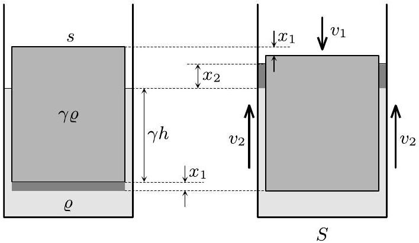
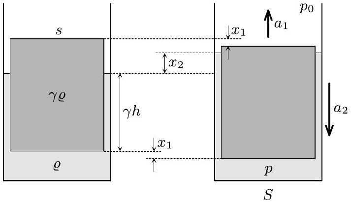

## T1: Floating cylinder

## Solution I: energetic approach

Denote the density of the liquid by $\varrho$, so the density of the cylinder is $\gamma \varrho$. In equilibrium (i.e. when the net force acting on the cylinder is zero) the immersed part of the cylinder has height $\gamma h$.

Consider the system in a moment when the cylinder is displaced by distance $x _ { 1 }$ downward and moves down with velocity $v _ { 1 }$. As a result of the motion of cylinder the liquid level rises by some height $x _ { 2 }$, and the liquid flows in the gap between the cylinder and beaker with some velocity $v _ { 2 }$ upwards (see Fig. 1).

Fig. 1

The relation between the aforementioned displacements and velocities are given by the continuity law:

$$
x _ { 1 } s = x _ { 2 } ( S - s ) , \quad v _ { 1 } s = v _ { 2 } ( S - s ) .
$$

In the following we express the potential and kinetic energy of the system. Compared to the equilibrium position the cylinder of mass $\gamma \varrho s h$ sunk by $x _ { 1 }$, while the potential energy change caused by the redistribution of liquid can be imagined as the center of mass of liquid with mass $\varrho s x _ { 1 }$ rises by distance $\gamma h +$ $x _ { 1 } / 2 + x _ { 2 } / 2$. Taken the potential energy in the equilibrium state to be zero, the potential energy in the state indicated in the right figure can be written as

$$
E _ { \mathrm { pot } } = - \gamma \varrho \operatorname { shg } x _ { 1 } + \varrho \operatorname { s } x _ { 1 } g \left( \gamma h + \frac { x _ { 1 } + x _ { 2 } } { 2 } \right) .
$$

After opening the bracket the first two terms cancel each other:

$$
E _ { \mathrm { pot } } = \frac { 1 } { 2 } \varrho \operatorname { gg } x _ { 1 } \left( x _ { 1 } + x _ { 2 } \right) .
$$

After expressing $x _ { 2 }$ from continuity law and some simplification we get a quadratic expression for the potential energy:

$$
E _ { \text {pot } } = \frac { 1 } { 2 } \varrho s g x _ { 1 } \left( x _ { 1 } + \frac { s } { S - s } x _ { 1 } \right) = \frac { 1 } { 2 } \varrho \frac { s S } { S - s } g x _ { 1 } ^ { 2 } .
$$

Now let us calculate the kinetic energy of the system. The contribution from the cylinder is straightforward, $\gamma \varrho s h v _ { 1 } ^ { 2 } / 2$, but the motion of the liquid is more complicated.

Note. We may notice that since $s / ( S - s ) = 50$, the speed $v _ { 2 }$ of the liquid in the narrow gap is 50 times larger than the typical speed of the liquid below the cylinder (which can be estimated to be in the range of $v _ { 1 }$ ). And while the mass of the liquid below the cylinder is much larger than the mass of liquid inside the gap (the ratio is ca. 25 if the „few centimeters“ in the problem text is taken to be 3.5 cm), the kinetic energy is proportional to the square of the velocity, so the kinetic energy of the liquid inside the gap is roughly 100 times larger than the kinetic energy of the liquid below the cylinder.

Since the kinetic energy of the liquid below the cylinder is negligible, we can write the total kinetic energy of the system as:

$$
E _ { \text {kin } } = \underbrace { \frac { 1 } { 2 } \gamma \varrho s h v _ { 1 } ^ { 2 } } _ { \text {cylinder } } + \underbrace { \frac { 1 } { 2 } \varrho ( S - s ) \left( \gamma h + x _ { 1 } + x _ { 2 } \right) v _ { 2 } ^ { 2 } } _ { \text {liquid } } .
$$

Here $x _ { 1 } , x _ { 2 } \ll \gamma h$, so we shall keep only the term containing $\gamma h$ in the second bracket:

$$
E _ { \text {kin } } = \frac { 1 } { 2 } \gamma \varrho s h v _ { 1 } ^ { 2 } + \frac { 1 } { 2 } \varrho ( S - s ) \gamma h v _ { 2 } ^ { 2 }
$$

Expressing $v _ { 2 }$ from continuity law gives the following:

$$
E _ { \text {kin } } = \frac { 1 } { 2 } \gamma \varrho s h v _ { 1 } ^ { 2 } + \frac { 1 } { 2 } \varrho \gamma h \frac { s ^ { 2 } } { S - s } v _ { 1 } ^ { 2 } = \frac { 1 } { 2 } \varrho \gamma h \frac { s S } { S - s } v _ { 1 } ^ { 2 } .
$$

The potential and kinetic energies can be written in the form

$$
E _ { \mathrm { pot } } = \frac { 1 } { 2 } k _ { \mathrm { eff } } x _ { 1 } ^ { 2 } , \quad E _ { \mathrm { kin } } = \frac { 1 } { 2 } m _ { \mathrm { eff } } v _ { 1 } ^ { 2 } ,
$$

where the effective spring constant and effective mass are given by

$$
k _ { \mathrm { eff } } = \varrho \frac { s S } { S - s } g , \quad m _ { \mathrm { eff } } = \varrho \gamma h \frac { s S } { S - s } .
$$

So the oscillation is indeed harmonic, thus the angular frequency and the period are:

$$
\omega = \sqrt { \frac { k _ { \mathrm { eff } } } { m _ { \mathrm { eff } } } } = \sqrt { \frac { g } { \gamma h } } , \quad T = 2 \pi \sqrt { \frac { \gamma h } { g } } = 0.53 \mathrm {~s} .
$$

Note. The static restoring force, acting on the cylinder is due to the change (relative to the equilibrium position) of the hydrostatic pressure at its lower base:

$$
F = - s \rho g \left( x _ { 1 } + x _ { 2 } \right) = - \frac { s S } { S - s } \rho g x _ { 1 } .
$$

This immediately gives effective stiffness of the system $k _ { \text {eff } } = \frac { s S } { S - s } \rho g$.
Alternatively, one may wish to integrate $\int F \mathrm {~d} x _ { 1 }$ to get the potential energy

$$
E _ { \mathrm { pot } } = \frac { s S } { S - s } \frac { \rho g } { 2 } x _ { 1 } ^ { 2 } .
$$

## Solution II: dynamical approach

When the cylinder is displaced from its equilibrium position downwards by distance $x _ { 1 }$, the net restoring force (pointing up) can be calculated as the sum of the weight of the cylinder and the force from the difference of pressures at the top $\left( p _ { 0 } \right)$ and bottom $( p )$ of the cylinder. As a result of the net force, the cylinder accelerates upwards with $a _ { 1 }$, and at the same time, the liquid located in the gap between the cylinder and the wall of the beaker accelerates down with $a _ { 2 }$. The relation between the magnitudes of $a _ { 1 }$ and $a _ { 2 }$ is given by the continuity law:

$$
s a _ { 1 } = ( S - s ) a _ { 2 } .
$$

Fig. 2

If the liquid in the gap was not accelerating, the pressure difference $p - p _ { 0 }$ would be equal to the hydrostatic pressure of the liquid column in the gap. Due to the acceleration of the liquid, $p - p _ { 0 }$ can be expressed from Newton's 2nd law applied for the liquid column of unit area located in the gap:

$$
p _ { 0 } - p + \varrho g \left( \gamma h + x _ { 1 } + x _ { 2 } \right) = \varrho \left( \gamma h + x _ { 1 } + x _ { 2 } \right) a _ { 2 } ,
$$

where we used the notations of Solution I, and the downward direction was taken as positive.

Newton's 2nd law for the cylinder reads as

$$
\left( p - p _ { 0 } \right) s - \gamma \varrho s h g = \gamma \varrho s h a _ { 1 } .
$$

After expressing $p - p _ { 0 }$ from the previous equation, and then substituting it here we get:

$$
\varrho g \left( \gamma h + x _ { 1 } + x _ { 2 } \right) s - \varrho \left( \gamma h + x _ { 1 } + x _ { 2 } \right) a _ { 2 } s - \gamma \varrho \operatorname { sh } g = \gamma \varrho s h a _ { 1 } .
$$

Since the amplitude of the liquid level is small, the terms containing $a _ { 2 } x _ { 1 }$ and $a _ { 2 } x _ { 2 }$ can be neglected. After rearranging we get:

$$
\varrho g s \left( x _ { 1 } + x _ { 2 } \right) = \gamma \varrho s h \left( a _ { 1 } + a _ { 2 } \right) .
$$

Using the relations between the displacements and accelerations we finally get:

$$
a _ { 1 } = \frac { g } { \gamma h } x _ { 1 } .
$$

Taking into account the opposite directions of $x _ { 1 }$ and $a _ { 1 }$, this is the dynamical condition of a simple harmonic motion with angular frequency and period

$$
\omega = \sqrt { \frac { g } { \gamma h } } , \quad T = 2 \pi \sqrt { \frac { \gamma h } { g } } = 0.53 \mathrm {~s} .
$$

Note. In this solution we assumed that the pressure $p$ is constant throughout the bottom surface of the cylinder. This assumption is equivalent with saying that the horizontal acceleration of the liquid below the cylinder at every point is much smaller than $a _ { 2 }$, which is reasonable.
