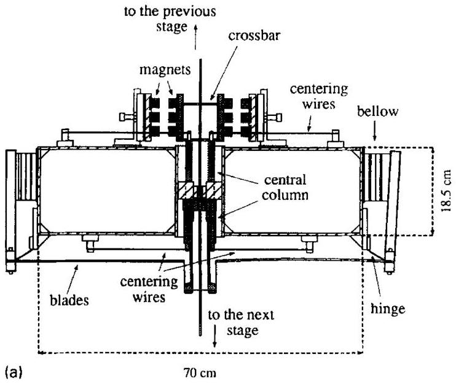
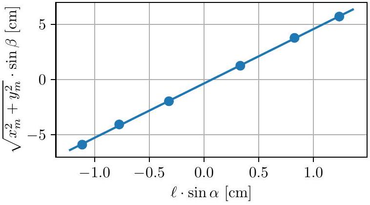
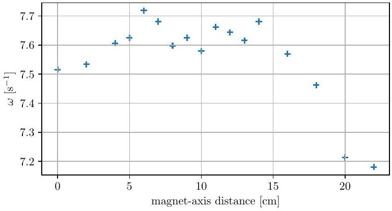
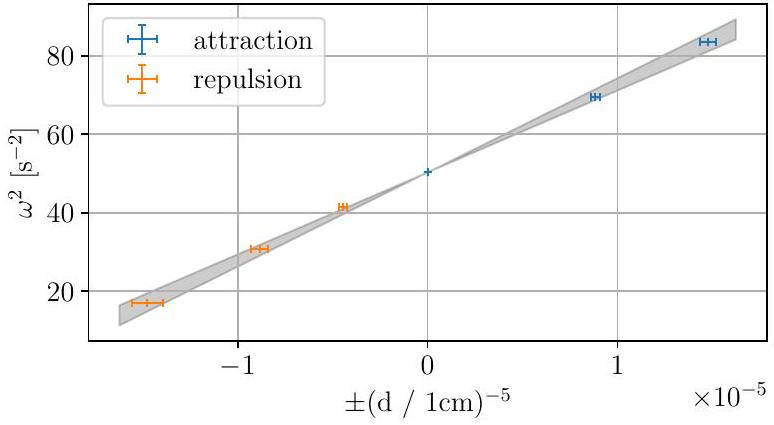
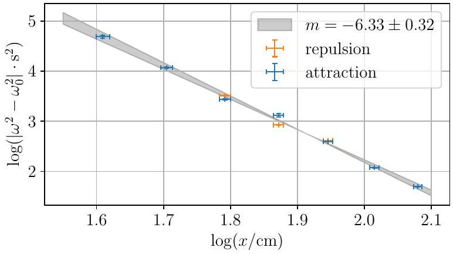
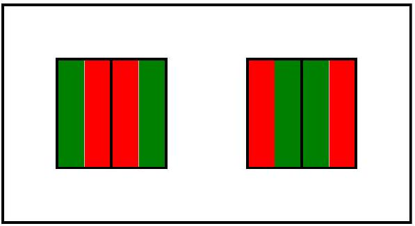
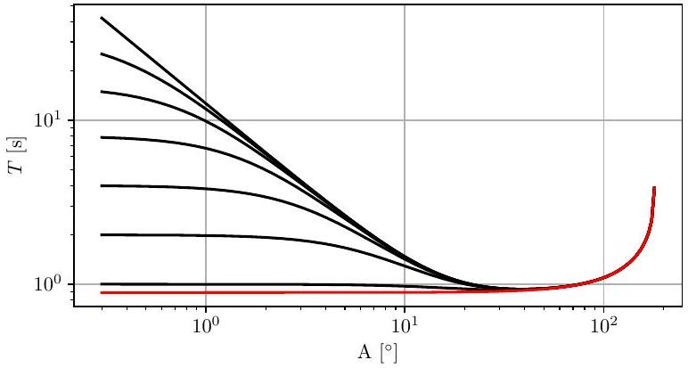
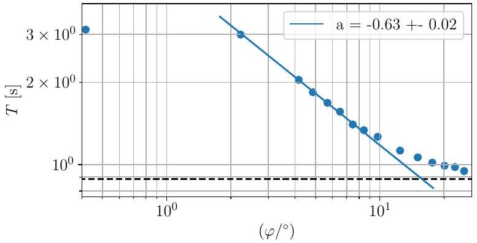
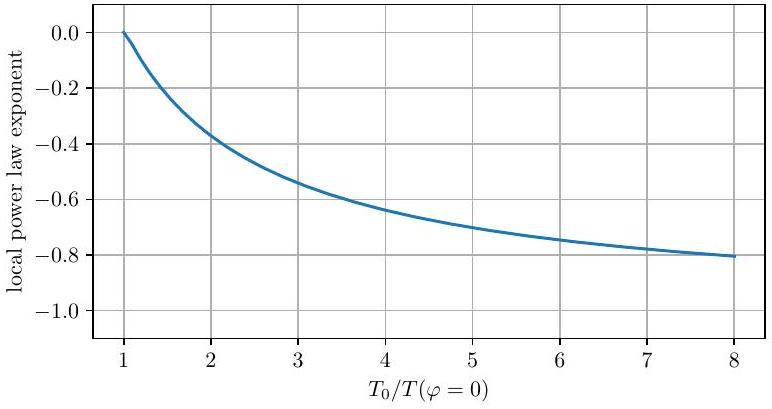

## E1 - Magnetic Pendulum - solution

## Motivation

In the vibration isolation system of the VIRGO gravitational wave detector (see Fig. 1), repulsive magnets are used to shift the vertical oscillation frequency of the suspension from around 1.5 Hz to below 0.5 Hz. This improves the sensitivity of the detector to gravitational waves at a frequency of few Hz.

Figure 1: Magnetic anti-spring as part of the mechanical suspension of the VIRGO gravitational wave interferometer. From NIM A 394 (1997) 397-408.

## Derivation of modified pendulum frequency (given to students)

The motion of a physical pendulum is constrained to the $y = 0$-plane (one degree of freedom). A magnetic dipole (oriented along the $y$-axis) is attached to the pendulum such that it is located at the origin when the pendulum is in equilibrium. Two more $y$-oriented magnetic dipoles are placed on the y-axis at $y = \pm d$. The combined dipole moment of the magnets on the pendulum is $j _ { 1 }$, the dipole moments of the external magnets are both $j _ { 2 }$.
The magnetic field at position $\vec { r }$ generated by a point dipole $\vec { m }$ at the origin, is:

$$
\begin{equation*}
\vec { B } ( \vec { m } , \vec { r } ) = \frac { \mu _ { 0 } } { 4 \pi } \cdot \left( \frac { 3 \vec { r } \cdot ( \vec { m } \cdot \vec { r } ) } { r ^ { 5 } } - \frac { \vec { m } } { r ^ { 3 } } \right) \tag{1}
\end{equation*}
$$

The $y$-component of the magnetic field generated on the $x$-axis by a dipole $\left( 0 , j _ { 2 } , 0 \right)$ located at $( 0 , d , 0 )$ is therefore:

$$
\begin{equation*}
B _ { y } ( d , x ) = \frac { \mu _ { 0 } } { 4 \pi } \cdot j _ { 2 } \cdot \frac { 2 d ^ { 2 } - x ^ { 2 } } { \left( x ^ { 2 } + d ^ { 2 } \right) ^ { 5 / 2 } } \tag{2}
\end{equation*}
$$

The function is symmetric in $d$, so the two external magnets provide equal contributions on the $x$-axis. The first terms of a Taylor series around $x = 0$ are

$$
\begin{equation*}
B _ { y } ( d , x ) = \frac { \mu _ { 0 } } { 4 \pi } \cdot j _ { 2 } \cdot \left( \frac { 2 } { d ^ { 3 } } - \frac { 6 x ^ { 2 } } { d ^ { 5 } } + \frac { 45 } { 4 } \frac { x ^ { 4 } } { d ^ { 7 } } + \mathcal { O } \left( x ^ { 6 } \right) \right) \tag{3}
\end{equation*}
$$

The potential energy of the pendulum as a function of its angle $\varphi$ is:

$$
\begin{equation*}
U ( \varphi ) = \operatorname { Mgs } ( 1 - \cos \varphi ) + j _ { 1 } \cdot 2 B _ { y } ( d , 2 \ell \cdot \sin ( \varphi / 2 ) ) , \tag{4}
\end{equation*}
$$

where $s$ is the distance from the magnetic pendulum COM to the pivot and $\ell$ is the distance from the pendulum magnet to the pivot. Neglecting constants and higher order terms:

$$
\begin{gather*}
U ( \varphi ) \approx M g s \varphi ^ { 2 } / 2 + \frac { \mu _ { 0 } } { 4 \pi } \cdot j _ { 1 } \cdot 2 j _ { 2 } \cdot \left( - \frac { 6 } { d ^ { 5 } } \ell ^ { 2 } \varphi ^ { 2 } \right) ,  \tag{5}\\
U ( \varphi ) \approx \left( M g s - \frac { 6 \mu _ { 0 } } { \pi } \cdot j _ { 1 } \cdot j _ { 2 } \cdot \frac { \ell ^ { 2 } } { d ^ { 5 } } \right) \cdot \varphi ^ { 2 } / 2 , \tag{6}
\end{gather*}
$$

The kinetic energy of the pendulum is $T ( \dot { \varphi } ) = I \dot { \varphi } ^ { 2 } / 2$, from $\partial _ { \varphi } U ( \varphi ) = \frac { \mathrm { d } } { \mathrm { d } t } \partial _ { \dot { \varphi } } T ( \dot { \varphi } )$ we find the natural frequency

$$
\begin{equation*}
\omega ^ { 2 } = \left( M g s - \frac { 6 \mu _ { 0 } } { \pi } \cdot j _ { 1 } \cdot j _ { 2 } \cdot \frac { \ell ^ { 2 } } { d ^ { 5 } } \right) / I \tag{7}
\end{equation*}
$$

We can write

$$
\begin{equation*}
\omega ^ { 2 } = \omega _ { 0 } ^ { 2 } \pm \omega _ { \operatorname { mag } } ^ { 2 } \tag{8}
\end{equation*}
$$

with $\omega _ { 0 } ^ { 2 } = M g s / I$ and $\omega _ { \text {mag } } ^ { 2 } = \frac { 6 \mu _ { 0 } } { I \pi } \cdot j _ { 1 } \cdot j _ { 2 } \cdot \frac { \ell ^ { 2 } } { d ^ { 5 } }$, where the plus sign is for attractive external magnet polarity and the minus sign for repulsive external magnet polarity.

## Task 1 - Mass of magnets and pendulum body (1.0 pts)

Without scales for weight measurements, there are multiple ways to determine the mass ratio between magnets and pendulum:

A) finding the center of mass of the pendulum with and without magnets (or with magnets in different positions)
B) finding the tilt angle of the pendulum with magnets offset horizontally (very precise by laser angle measurement)
C) measuring the pendulum frequency as a function of vertical magnet position, and using e.g. the position of fastest oscillation

The methods allow very different precision (with B best and C worst typically). Full score is achievable with any method if the numerical result is good.
All pendulums were weighed on an analytical balance. We measured a mass distribution for $M _ { \text {pen } } =$ (44.7±1.7) g (mean and standard deviation). The mass of the two pendulum magnets agrees well with the specifications $M _ { \text {mag } } = ( 7.68 \pm 0.01 ) \mathrm { g }$. The nominal mass ratio follows as

$$
\begin{equation*}
M / m = 5.82 \pm 0.22 . \tag{9}
\end{equation*}
$$

Measurements of twelve pendulum magnets are in agreement with the specified mass of 7.68 g for one pair. Separately measuring the six pairs reveals a sample standard deviation of only 0.035 g.

Table 1: Physical parameters of pendulum
| quantity | value |
| :--- | :--- |
| mass of pendulum body | $M _ { \text {pen } } = ( 44.7 \pm 1.7 ) \mathrm { g }$ |
| mass of pendulum magnets | $M _ { \text {mag } } = ( 7.68 \pm 0.03 ) \mathrm { g }$ |
| distance magnets-axis | $\ell = ( 23.0 \pm 0.1 ) \mathrm { cm }$ |
| distance COM-axis (no magnets) | $s _ { 0 } = ( 12.0 \pm 0.1 ) \mathrm { cm }$ |
| distance COM-axis (with magnets) | $s _ { 1 } = ( 13.6 \pm 0.1 ) \mathrm { cm }$ |
| period without magnets | $T _ { 0 } = 2 \pi / \omega _ { 0 } = ( 863 \pm 5 ) \mathrm { ms }$ |
| period with magnets | $T _ { 1 } = 2 \pi / \omega _ { 1 } = ( 885 \pm 3 ) \mathrm { ms }$ |
| moment of inertia (with magnets) | $I = ( 1.38 \pm 0.02 ) \mathrm { g } \cdot \mathrm { m } ^ { 2 }$ |
| dipole moment pendulum magnets | $j _ { 1 } = ( 0.96 \pm 0.01 ) \mathrm { A } \cdot \mathrm { m } ^ { 2 }$ |
| dipole moment external magnet | $j _ { 2 } = ( 2.30 \pm 0.03 ) \mathrm { A } \cdot \mathrm { m } ^ { 2 }$ |

Since the magnet mass is more consistent between setups than the pendulum mass (and both measurements are fully anticorrelated by the given sum), points are awarded only for the determined magnet mass. The accepted range is chosen large enough to cover the spread in determined magnet mass caused by the variation in total mass relative to the given value of 52.3 g.

A: center of mass method By balancing the pendulum e.g. on a ruler, one can first mark the center of mass without magnets on the pendulum (S), then attach the magnets in a position P as far away from S as possible (e.g. bottom center), and measure the new center of mass (S'). Balance of torques around S' gives

$$
\begin{equation*}
M \cdot \overline { S S ^ { \prime } } = m \cdot \overline { S ^ { \prime } P } \tag{10}
\end{equation*}
$$

With measured values of $\overline { S S ^ { \prime } } = ( 1.6 \pm 0.1 ) \mathrm { cm }$ and $\overline { S ^ { \prime } P } =$ (9.4 ± 0.1) cm one finds:

$$
\begin{equation*}
M / m = 5.9 \pm 0.4 . \tag{11}
\end{equation*}
$$

The separate masses can be expressed by the sum and ratio:

$$
\begin{gather*}
m = \frac { M + m } { 1 + M / m } = ( 7.6 \pm 0.5 ) \mathrm { g }  \tag{12}\\
M = ( M + m ) \cdot \frac { M / m } { 1 + M / m } = ( 44.7 \pm 0.6 ) \mathrm { g } . \tag{13}
\end{gather*}
$$

B: tilt angle method (lighter prototype pendulum) With the magnets placed at a position $\left( x _ { m } , y _ { m } \right)$ relative to the pivot (projected onto the pendulum), the pendulum comes to rest at a tilt angle $\alpha$ relative to vertical. This angle can be measured precisely by observing the deflection $\delta y$ of the laser spot at a screen distance $d$ :

$$
\begin{equation*}
\tan \alpha = \delta y / d \tag{14}
\end{equation*}
$$

N.B.: there is no factor two, since the rotation axis of the mirror is parallel to the laser beam.
Calling the angle between vertical and the line through pivot and magnet equilibrium position $\beta$, balance of torques becomes:

$$
\begin{equation*}
M \cdot s _ { 0 } \cdot \sin \alpha = m \cdot \sqrt { x _ { m } ^ { 2 } + y _ { m } ^ { 2 } } \cdot \sin \beta \tag{15}
\end{equation*}
$$

where

$$
\begin{equation*}
\tan ( \alpha + \beta ) = x _ { m } / y _ { m } \tag{16}
\end{equation*}
$$

The COM distance from the pivot is $s _ { 0 } = ( 11.4 \pm$ $0.1 )$ cm. The best magnet position for a single measurement is close to the edge at the widest part of the pendulum. For $x _ { m } = ( 7.7 \pm 0.1 ) \mathrm { cm } , y _ { m } = ( 18.0 \pm 0.1 ) \mathrm { cm }$ and $d = ( 55 \pm 1 ) \mathrm { cm }$, we obtained $\delta y = ( 5.9 \pm 0.1 ) \mathrm { cm }$. From this we calculate $\alpha = 6.12 ^ { \circ } , \beta = 17.0 ^ { \circ }$, and $M / m = 4.7 \pm 0.4$.

Figure 2: Analysis of tilt angle for several magnet positions.

For higher precision the balance of torques should be graphed for several magnet positions, see Fig. 2. The slope yields $M / m = 4.92 \pm 0.03$ (fit error only). The intercept of $( - 0.36 \pm 0.02 )$ cm can be explained by a failure to notice a 1 mm offset of the COM from the symmetry axis of the pendulum, rotating the coordinate system for $\beta$ by 1°.

C: frequency method (lighter prototype pendulum) The pendulum frequency depends on the position of the magnet placed at $( 0 , y )$ relative to the pivot as follows:

$$
\begin{equation*}
\omega ^ { 2 } = \frac { M s _ { 0 } + m y } { I + m y ^ { 2 } } \cdot g . \tag{17}
\end{equation*}
$$

This function has a unique maximum $\omega _ { \text {max } }$ at

$$
\begin{equation*}
y _ { \max } = \sqrt { I / M + \left( \frac { M s _ { 0 } } { m } \right) ^ { 2 } } - \frac { M s _ { 0 } } { m } . \tag{18}
\end{equation*}
$$

Eliminating $y _ { \text {max } }$ from the expression for $\omega _ { \text {max } }$, we can solve for $M / m$ :

$$
\begin{equation*}
m / M = \frac { 4 \omega _ { \max } ^ { 2 } } { \Omega ^ { 2 } } \cdot \left( \frac { \omega _ { \max } ^ { 2 } } { \omega _ { 0 } ^ { 2 } } - 1 \right) \tag{19}
\end{equation*}
$$

with $\Omega ^ { 2 } = g / s _ { 0 }$ and $\omega _ { 1 } ^ { 2 } = M s _ { 0 } g / I$.

Figure 3: Pendulum frequency as a function of vertical magnet position.

After a scan of different $y$-values, we find $y _ { 0 } = ( 10 \pm$ 3) $\mathrm { cm } , \omega _ { \text {max } } = ( 7.65 \pm 0.05 ) \mathrm { s } ^ { - 1 } , \omega _ { 1 } = ( 7.50 \pm 0.06 ) \mathrm { s } ^ { - 1 }$ and $\Omega = ( 9.28 \pm 0.04 ) \mathrm { s } ^ { - 1 }$. We calculate $M / m = 6.7 \ldots 14$.

This method is not precise enough with the relatively high mass ratio of the setup.
variant: frequency with/without magnets There are many ways to extract the mass ratio from pendulum frequencies. A popular method was to compare the frequency with and without magnets, using only the nominal magnet position. The two expressions for the frequencies are

$$
\begin{equation*}
I \cdot \omega _ { 0 } ^ { 2 } = M g s _ { 0 } \tag{20}
\end{equation*}
$$

and

$$
\begin{equation*}
\left( I + m \ell ^ { 2 } \right) \cdot \omega _ { 1 } ^ { 2 } = ( M + m ) g s _ { 1 } \tag{21}
\end{equation*}
$$

The mass ratio can be expressed as

$$
\begin{equation*}
M / m = \frac { \ell ^ { 2 } / g - s _ { 1 } ^ { 2 } / \omega _ { 1 } ^ { 2 } } { s _ { 1 } ^ { 2 } / \omega _ { 1 } ^ { 2 } - s _ { 0 } ^ { 2 } / \omega _ { 0 } ^ { 2 } } = 6.1 \pm 0.3 . \tag{22}
\end{equation*}
$$

| E1.1 - Masses |  | Points |
| :--- | :--- | :--- |
| A | Center of mass method | 0.6 |
|  | Determination of distances $\overline { S S ^ { \prime } }$ | 0.4 |
| B | Tilt angle method |  |
|  | \# of data points. 1:0.1, 2:0.3, $\geq 3$ : 0.4 expression for mass ratio (or equivalent calculations for finding the masses) | 0.4 0.2 |
| C | Frequency method | 0.6 |
|  | measurement of $\omega _ { 1 }$ and $\omega _ { 0 }$ (0.1 per repetition with $\geq 5$ oscillations, or 0.1 per 10 oscillations without repetition) expression for mass ratio | 0.4 0.2 |
|  | Numerical value for $M _ { \text {mag } }$ | 0.4 |
|  | value inside (7.7 ± 1.0) g value inside (7.7 ± 1.5) g reasonable estimate of uncertainty | or 0.2 or 0.1 0.2 |
| Total on Masses |  | 1.0 |

Task 2 - Magnetic dipole moments (4.0 pts)

Figure 4: Determination of magnetic frequency shift by external dipole magnets.

a) Data collection The accessible frequency range is maximized by using both possible external dipole orientations. The closest possible distance in attractive orientation is given by stability of the magnets in the rail against sliding towards the pendulum, and is around $d = 7 \mathrm {~cm}$. In the repulsive mode it is given by the full compensation point near $d = 8.4 \mathrm {~cm}$, distances down to around 9 cm are practical.
For closer magnet spacings in repulsive mode, the pendulum moves in a double-well potential with an ill-defined behavior around zero amplitude. Eqn. ?? suggests a negative $\omega ^ { 2 }$ and is not valid for oscillations around the off-set minimum. These data points are therefore not useful for this problem. This is specified in the hint that the magnets must be collinear when the pendulum is in equilibrium.

Since one needs to plot $\omega ^ { 2 }$ vs $d ^ { - 5 }$, small $d$ need to be sampled much more finely to spread the data points in $d ^ { - 5 }$. Ideally, one can pre-calculate an equal spacing, e.g. $\left( 0 ^ { - 0.2 } , 0.25 ^ { - 0.2 } , 0.5 ^ { - 0.2 } , 0.75 ^ { - 0.2 } , 1 ^ { - 0.2 } \right) \cdot d _ { 0 } =$

$( \infty , 1.32,1.15,1.06,1 ) \cdot d _ { 0 }$. The point at infinity is recorded by removing the magnets.
b) Specific magnetization Both attractive and repulsive datasets can be combined in one plot by counting repulsive magnet spacings as negative, absorbing the sign at $\pm \omega _ { \text {mag } } ^ { 2 }$ :

$$
\begin{equation*}
\omega ^ { 2 } = \omega _ { 1 } ^ { 2 } + \frac { 6 \mu _ { 0 } } { I \pi } \cdot j _ { 1 } \cdot j _ { 2 } \cdot \frac { \ell ^ { 2 } } { d ^ { 5 } } \tag{23}
\end{equation*}
$$

Plotting $\omega ^ { 2 }$ vs $d ^ { - 5 }$, one can fit a linear relation with slope $k = \frac { 6 \mu _ { 0 } \ell ^ { 2 } } { I \pi } \cdot j _ { 1 } \cdot j _ { 2 }$ and intercept $\omega _ { 1 } ^ { 2 }$.
The example data in Fig. 4 yield a slope of $k =$ $( 2.14 \pm 0.05 ) 10 ^ { 6 } \mathrm {~cm} ^ { 5 } / \mathrm { s } ^ { 2 }$. To extract the dipole moment product one must measure the magnet-axis distance $\ell = ( 23.0 \pm 0.1 ) \mathrm { cm }$ and find the moment of inertia $I$. This can be extracted from the undisturbed frequency $\omega _ { 1 } ^ { 2 } = \left( M _ { \text {pend } } + M _ { \text {mag } } \right) g s _ { 1 } / I$, with the given total mass and gravitational acceleration, and the COMaxis distance $s _ { 1 } = ( 13.6 \pm 0.1 ) \mathrm { cm }$ (by balancing). One finds:

$$
\begin{equation*}
I = \frac { \left( M _ { p e n d } + M _ { m a g } \right) g s _ { 1 } } { \omega _ { 1 } ^ { 2 } } = ( 1.38 \pm 0.02 ) \mathrm { g } \cdot \mathrm {~m} ^ { 2 } \tag{24}
\end{equation*}
$$

The dipole moment product follows as

$$
\begin{equation*}
j _ { 1 } \cdot j _ { 2 } = k \cdot \frac { I \pi } { 6 \mu _ { 0 } \ell ^ { 2 } } = ( 2.33 \pm 0.05 ) \left( \mathrm { Am } ^ { 2 } \right) ^ { 2 } . \tag{25}
\end{equation*}
$$

Since the ratio $j _ { 2 } / j _ { 1 } = 2.4$ is given, the dipole moments separately are

$$
\begin{align*}
& j _ { 1 } = \sqrt { j _ { 1 } \cdot j _ { 2 } / 2.4 } = ( 0.98 \pm 0.01 ) \mathrm { Am } ^ { 2 } .  \tag{26}\\
& j _ { 2 } = \sqrt { j _ { 1 } \cdot j _ { 2 } \cdot 2.4 } = ( 2.36 \pm 0.03 ) \mathrm { Am } ^ { 2 } . \tag{27}
\end{align*}
$$

With the true mass of the pendulum magnets $M _ { \text {magnets } } = 7.68 \mathrm {~g}$ we find a specific magnetization of

$$
\begin{equation*}
j _ { 1 } / M _ { \text {magnets } } = ( 0.128 \pm 0.030 ) \mathrm { Am } ^ { 2 } / \mathrm { g } . \tag{28}
\end{equation*}
$$

The expected value can be calculated from manufacturer values of remanence (1.29 T-1.32 T) and density $\left( 7.4 \mathrm {~g} / \mathrm { cm } ^ { 3 } - 7.5 \mathrm {~g} / \mathrm { cm } ^ { 3 } \right)$ of NdFeB-N42:

$$
\begin{equation*}
\frac { B _ { r } } { \mu _ { 0 } \cdot \rho } = 0.137 \mathrm { Am } ^ { 2 } / \mathrm { g } - 0.142 \mathrm { Am } ^ { 2 } / \mathrm { g } . \tag{29}
\end{equation*}
$$

The 10\% reduction of the observed specific magnetization may be explained by edge effects in the small magnets, where magnetization may not be homogeneous. There is a hint for edge effects also from the magnetic moment ratio between external and pendulum dipole moments, 2.4 measured with a magnetometer, higher than the volume ratio, 2.2 measured without the coatings.
The data collection and linear regression was performed for five different setups, the slope was consistent within $\pm 5 \%$ (explained by observed magnetic moment variations) while the offset (squared frequencies) was stable within ±1\%. The accepted numerical ranges cover this variation.

| E1.2 - Magnetic Dipole Moments |  | Points |
| :--- | :--- | :--- |
| a) | Frequency measurements | 2.0 |
|  | Both attraction and repulsion | 0.3 |
|  | Closest $d$ setting $\leq 9 \mathrm {~cm}$ ( 0.1 if $\leq$ 10 cm) | 0.3 |
|  | Denser spacing for small $\| d \|$ | 0.3 |
|  | 0.1 per different $d$-setting (incl. $\infty$ ) | 0.6 |
|  | 0.1 per 10 oscillations per $d$ value | 0.5 |
| b) | Specific magnetization | 2.0 |
|  | Graph of $\omega ^ { 2 }$ vs $d ^ { - 5 }$ or $\omega$ vs $d ^ { - 5 / 2 }$ or $\log \left\| \omega ^ { 2 } - \omega _ { 1 } ^ { 2 } \right\|$ vs $\log d$ | (1.0) |
|  | correctly enter data points (0.1 each) | 0.5 |
|  | correct axis labels and ticks | 0.1 |
|  | data covers $\geq \frac { 1 } { 2 }$ page | 0.1 |
|  | trend line drawn | 0.1 |
|  | slope read | 0.1 |
|  | slope error estimated | 0.1 |
|  | expression for determining $I$ | 0.3 |
|  | expression for determining $j _ { 1 } \cdot j _ { 2 }$ | 0.2 |
|  | expression for determining $j _ { 1 }$ | 0.2 |
|  | Numerical value for $j _ { 1 } / M _ { \text {mag } } =$ | 0.3 |
| Total on Magnetic Dipole Moments |  | 4.0 |

Task 3 - Unknown external magnets (3.0 pts)

If, instead of a graphical analysis, a slope was calculated from two data points, we award 0.2/0.5 points for "entering data", no points for axis, space and trend line (total loss: 0.6 points). For the rest we apply the normal grading scheme.

Figure 5: Determination of unknown magnet power law.

a) Data collection By experimentation one can find that the unknown magnets are symmetric under a 180° rotation, not anti-symmetric as the dipoles. It is still possible to obtain both attraction and repulsion, either by swapping the unknown magnets (which are given to be oppositely magnetized to each other), or by flipping the pendulum magnets. Flipping the pendulum magnets may require a new measurement of $\omega _ { 1 }$ if the magnet position is not exactly the same.
As the overall field strength is weaker, distances

down to $d = 5 \mathrm {~cm}$ are possible in attractive mode, as well as about $d = 5.5 \mathrm {~cm}$ in repulsive mode. For equal spacing in log-scale one can choose $d$ values increasing by roughly the same factor between following measurements.

Attractive and repulsive mode can not be combined to increase precision, but can serve as independent measurements of the absolute value of magnetic frequency shift at a given separation. Only the attractive mode can be selected for its higher accessible $d$-range and overall faster frequencies (higher relative precision).
b) Power law Plotting the absolute value of the squared magnetic frequency shift $\left| \omega ^ { 2 } - \omega _ { 1 } ^ { 2 } \right|$ versus the magnet distance on double-logarithmic axes (Fig. 5), one can fit a linear relation with slope $a = - 6.33 \pm 0.32$, indicating a power law $\omega _ { \text {mag } } ^ { 2 } \propto d ^ { - 6 }$.

Figure 6: Dipole configuration of unknown external (quadrupole) magnets.

c) Dipole configuration Since the exponent of the magnetic frequency shift is one higher than for the dipole magnets, we can conclude that also the exponent of the magnetic field as a function of distance is one higher than for the dipole law, $B \propto r ^ { - 4 }$. (In fact the squared magnetic frequency shift follows the curvature of the magnetic field, the derivatives add two to the power law exponent.)

We are looking for a magnetic quadrupole configuration. This can be created by an arrangement of equal and opposite dipole magnets (canceling the total dipole moment of the arrangement). The simplest solution consistent with the package (see Fig. 6) consists of two coaxial and opposite cylindrical dipole magnets in each unknown external magnet, one with north poles facing out, one with south poles facing out.

Another valid solution is made of cylinders with radial magnetization (i.e. south poles towards the symmetry axis, north poles outwards, and vice versa). This would be harder to build but yields magnets indistinguishable from the actual ones to leading order.

Other possibilities of creating a quadrupole out of opposite dipoles (e.g. with dipole offset not parallel to the magnetic moments) are excluded because of the cylindrical symmetry of the unknown external magnets (this can be tested e.g. by rotation of the unknown magnet in a dipole field).

| E1.3 - Unknown external magnets |  | Points |
| :--- | :--- | :--- |
| a) | Data collection | 1.0 |
|  | Closest $d$ setting $\leq 6 \mathrm {~cm}$ | 0.2 |
|  | Denser spacing for small $\| d \|$ | 0.2 |
|  | 0.1 per 2 different $d$-settings | 0.3 |
|  | 0.1 per 10 oscillations per $d$ value | 0.3 |
| b) | Power Law | 1.5 |
|  | Graph of $\ln \left( \left\| \omega ^ { 2 } - \omega _ { 1 } ^ { 2 } \right\| \right)$ vs $\ln ( d )$ | (1.0) |
|  | correctly enter data points (0.1 each) | 0.5 |
|  | correct axis labels and ticks | 0.1 |
|  | data covers $\geq \frac { 1 } { 2 }$ page | 0.1 |
|  | trend line drawn | 0.1 |
|  | slope read | 0.1 |
|  | slope error estimated | 0.1 |
|  | Exponent value (-6±0.5: 0.5, -6± 1: 0.2 ) | 0.5 |
| c) | Dipole configuration | 0.5 |
|  | Sketch of possible dipole configuration | 0.3 |
| Total on Unknown external magnets |  | 3.0 |

If, instead of a graphical analysis, a slope was calculated from two data points, we apply the grading scheme of 1.2b).

In 1.3c), if no points were awarded for justification, also no points are given for the correct configuration.

## Task 4 - Nonlinear pendulum (2.0 pts)

a) Compensation Distance A precise way of finding the compensation distance is from the analysis of E1.2. We are interested in the x-intercept of the regression line, with slope $k = ( 2.14 \pm 0.05 ) 10 ^ { 6 } \mathrm {~cm} ^ { 5 } / \mathrm { s } ^ { 2 }$ and y-intercept $\omega _ { 1 } ^ { 2 } = ( 50.3 \pm 0.3 ) \mathrm { s } ^ { - 2 }$. We find $d _ { \text {comp } } ^ { 5 } =$ $k / \omega _ { 1 } ^ { 2 }$, or $d _ { \text {comp } } = ( 8.43 \pm 0.05 ) \mathrm { cm }$.

Another possibility is to manually approach the compensation point and carefully check for the absence of two separate minima.
A less useful method is the recording of the angular separation $\Delta \varphi$ of the split minima for $d < d _ { \text {comp } }$ as a function of $d$. This relation is strongly curved and therefore not suited for a precise extrapolation to $\Delta \varphi = 0$.
b) Period Power Law Near the point of full compensation of the quadratic terms of gravitational and magnetic potential, an interesting dependence of pendulum frequency on amplitude can be observed.

Fig. 7 shows numerical calculations of the period for different magnet spacings close to full compensation (black) and without external magnets (red).

For experimentally achievable configurations, three ranges can be distinguished:

Figure 7: Numerical calculation of pendulum period versus amplitude, for different degrees of compensation.

Figure 8: Measured pendulum period versus amplitude.

- for small amplitudes the period is constant, given by the small remaining quadratic potential term from imperfect compensation
- in an intermediate amplitude range, the magnetic quartic potential dominates, leading to a theoretical dependence $T ( \varphi ) \propto \varphi ^ { - 1 }$ with amplitude $\varphi$.
- for large amplitudes, the influence of the localized magnetic potential is small. The period approaches that of the undisturbed pendulum.

The extent of the relevant intermediate amplitude range depends on the quality of compensation, for example quantified by the ratio $T _ { 0 } / T ( \varphi = 0 )$ of the compensated small-amplitude period to the smallamplitude period without magnets.

Typically the theoretical exponent of -1 is not reached in experiment, because the quartic potential does not fully dominate for any amplitude region. The expected maximum slope of the power law can be calculated numerically as a function of $T _ { 0 } / T ( \varphi = 0 )$, see Fig. 9. (The exponent averaged over a factor of 2 in amplitude around the maximum is very close to this maximum value.)

The data shown in Fig. 8 was acquired with a compensation quality corresponding to $T _ { 0 } / T ( \varphi = 0 ) =$ 4.08. This results in an expected maximum exponent of -0.645 (-0.63 when averaged over a factor 2 in amplitude). This agrees well with a linear regression around the steepest part of the amplitude-period relation.

Figure 9: Maximum power law slope as a function of "degree of compensation".

| E1.4 - Nonlinear Pendulum |  | Points |
| :--- | :--- | :--- |
| a) | Cancellation point | 0.5 |
|  | Numerical value for $d _ { \text {comp } } = ( 83.3 \pm$ 2.0) mm (0.2 within 4 mm) | 0.5 |
| b) | Amplitude dependence | 1.5 |
|  | 0.1 per 2 amplitude values | 0.4 |
|  | 0.1 per oscillation at each amplitude value | 0.3 |
|  | double-logarithmic graph | 0.5 |
|  | discussion ( 0.1 each for plateau at small amplitudes, power law at intermediate amplitudes, or plateau at large amplitudes) | 0.3 |
| Total on Nonlinear Pendulum |  | 2.0 |
