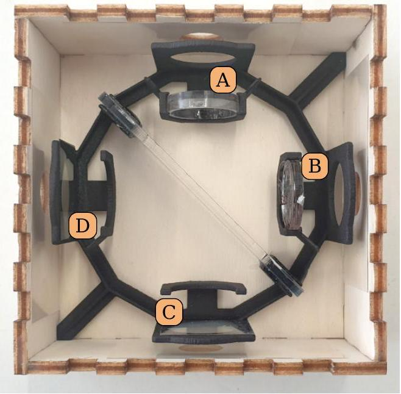
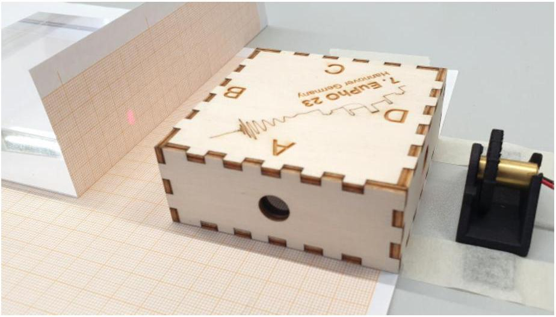
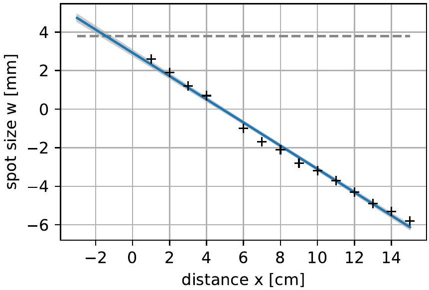
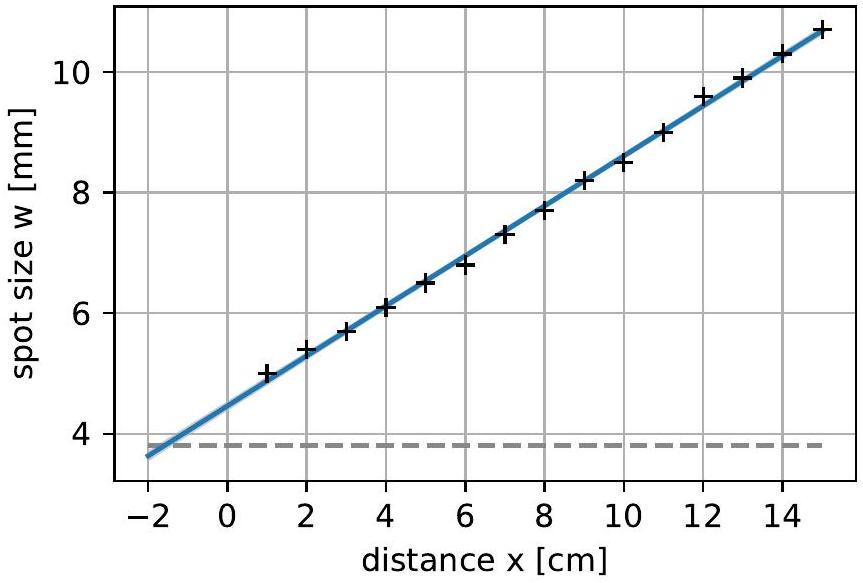
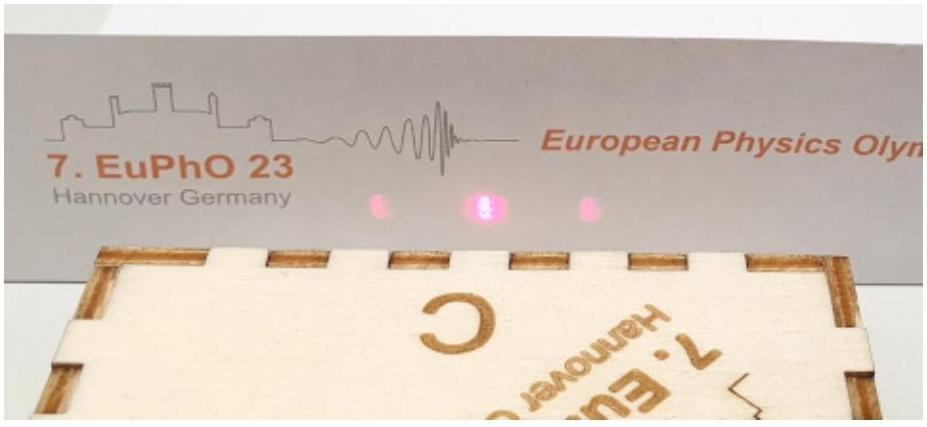
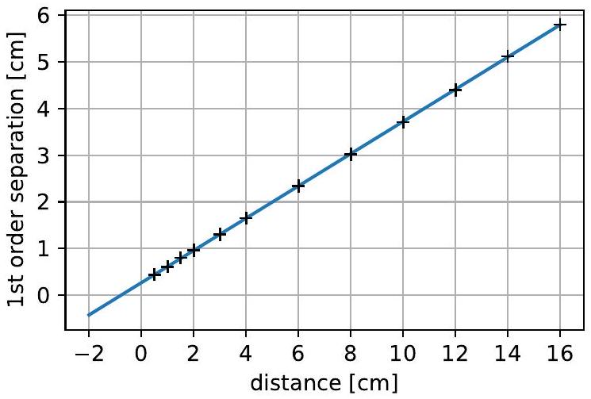
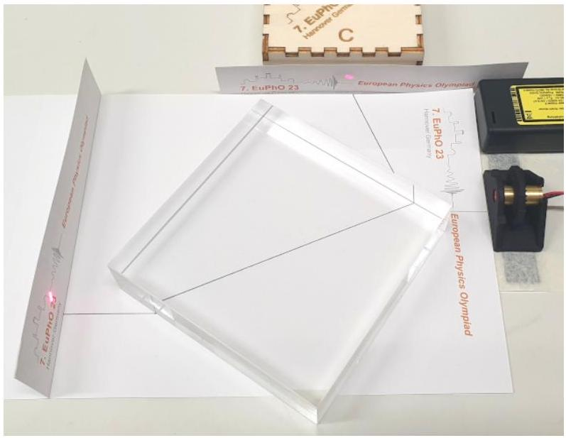

## E2: Optical Black Box - Solution

## Task E2.1 - Central element (~0.3 pts)

To find out what element is located at the center of the box, we systematically beam into the box through all 4 ports (labeled A, B, C, D). We take note of where light exits. We deduce for the four options given:

- no element: Can be excluded because in that case we would only see light exiting from opposite ports but we can clearly see a signal around corners, e.g. exiting port B when beaming in through port A.
- fully reflective mirror (both sides): This option we can also exclude since it would not allow for direct transmission along at least one of the optical axes. However, we can clearly see light passing from A to C and B to D (for some input polarizations).
- regular-triangle-shaped prism: A regulartriangle-shaped prism has a 60° angle between all surfaces. This configuration will always deflect a beam out of the optical axis, but as we clearly see that a central beam remains straight, the prism can be excluded.
- semi-transparent mirror: For every input beam, the box produces two significant output beams. This behaviour is well explained by a semitransparent mirror. In fact we used a 2 mm thin acrylic glass plate with a semi-transparent window foil on one side.

To find out the orientation of the beam splitter (i.e. the orientation of the partially reflective surface), notice:

- To connect the two (perpendicular) optical axes of the black box, it needs to sit under a 45° angle with respect to both.
- Since ports A and B as well as C and D are connected, the partially reflective surface runs diagonally from the corner between D and A to the corner of B and C. (see Fig. 10)

| E2.1 Central Element | Points |
| :--- | :--- |
| Systematic observation of light splitting (automatically given if correct identification) | 0.1 |
| Correct identification of semitransparent mirror | 0.1 |
| Correct deduction: Orientation of the mirror | 0.1 |
| Total on E2.1 | 0.3 |

## Task E2.2 - Port elements (~2.2 pts)

We systematically beam in through all four ports and write down the observed output for the remaining three ports. Also, we pay attention to effects resulting from a varying input polarization (by rotating the laser diode) and divergence and convergence of the beam. This way, we obtain the observation matrix Table 2.
From this, we conclude:

- Polarizer at port D: Whenever port D is involved, there is a strong polarization-dependent behavior

Figure 10: View inside the box

Table 2: Observed Light Properties when beaming in through one port (rows) and exiting through another (columns)
| In ↓ | Exit A | Exit B | Exit C | Exit D |
| :--- | :--- | :--- | :--- | :--- |
| A | - | focused beam, focus close to box | three focused beams, focus close to box | weak reflection, depends on input polarization |
| B | bright, focused beam, focus far away | - | three beams, very weak | diverging beam, depends on input polarization, intensity can be reduced to zero |
| C | focused beam, focus roughly 5cm away from box | very weak, diverging beam | - | collimated beam, depends on input polarization but intensity can not be reduced to zero |
| D | very weak, focused beam | diverging beam, depends on input polarization, intensity can almost be reduced to zero | three, collimated beams, depends on input polarization, intensity can almost be reduced to zero | - |

and there is no polarization effect in all combinations not involving D. Therefore, D is a polarizer.

- Diffraction Grating at port C: There are always three beams coming out of port C. Therefore, there must be a diffraction grating at C. Note: When beaming in through port C, the higher diffraction orders are clipped at the other ports such that there is only one beam exiting.
- Convex lens at port A: Beaming along the axis connecting ports C-A, we can clearly see a focus outside the box - which can only come from the element at port A - and therefore, there must be a convex lens.
- Concave lens at port B: Along the axis B-D, we obtain a diverging beam. This could originate from a concave lens, or from a convex lens with a focus inside the box at B. The beam divergence is appar-

Figure 11: Setup to measure the diverging beam after the concave lens.

ently so flat that it does not converge to a focal spot within the area of B. Thus we conclude that at B, there is a concave lens.

| E2.2 Elements |  | Points |
| :--- | :--- | :--- |
| a) | Recognizing or using the laser diode as a linearly polarized source of light | 0.2 |
| b) | Observations and solution | 2.0 |
|  | A: observation / reasoning (beam focus) | 0.2 |
|  | A: result focussing lens | 0.3 |
|  | B: observation / reasoning (diverging beam) | 0.2 |
|  | B: result concave lens | 0.3 |
|  | C: observation / reasoning (separate spots) | 0.2 |
|  | C: result grating | 0.3 |
|  | D: observation / reasoning (rotation dependence) | 0.2 |
|  | D: result polarizer | 0.3 |
| Total on E2.2 |  | 2.2 |

## Task E2.3 - Properties (~7.5 pts)

Now, we systematically conduct measurements to obtain the desired values of the four elements. Note that each window contains a protective glass plate of thickness 0.13 mm, so the elements appear 0.04 mm closer to the box edge than they actually are. For true positions we use corrected values.
a) Convex lens behind port A (position and focal length) We start by verifying the beam exiting the laser being collimated with a constant spot size $w _ { 0 } \approx$ (3.8±0.2) mm (may differ for each laser between 3 mm and 6 mm ). The possibility of a collimated beam is apparent from the Rayleigh range $z _ { R }$ (not required from students):

$$
\begin{equation*}
z _ { R } = \frac { \pi w _ { 0 } ^ { 2 } } { 4 \lambda } \approx 16 \mathrm {~m} \tag{30}
\end{equation*}
$$

Realistically, the optical paths used in this setup will be below 50 cm, therefore, the widening of the Gaussian beam can be neglected in comparison to our measurement precision of the beam diameter.

Beaming in through port C (where we located the diffraction grating, whose zeroth order has the same beam profile as the incoming beam), we now measure the spot size as a function of distance from port A. We assign negative values to the spot diameters measured after the focus which we can roughly locate by eye to be at around 5 cm away from the box, to use a linear fit function for the beam envelope. The measured values are:

| x [cm] | w [mm] |
| :--- | :--- |
| 1 | 2.6 |
| 2 | 1.9 |
| 3 | 1.2 |
| 4 | 0.7 |
| 6 | -1.0 |
| 7 | -1.7 |
| 8 | -2.1 |
| 9 | -2.8 |
| 10 | -3.2 |
| 11 | -3.7 |
| 12 | -4.3 |
| 13 | -4.9 |
| 14 | -5.3 |
| 15 | -5.8 |

Figure 12: Linear fit of the spot size after the convex lens vs. distance from box edge

The spot size can therefore be described by a linear equation:

$$
\begin{equation*}
w ( x ) = w _ { 0 } - \frac { w _ { 0 } } { f } \left( x - x _ { 0 } \right) = - \frac { w _ { 0 } } { f } x + w _ { 0 } \left( \frac { x _ { 0 } } { f } + 1 \right) . \tag{31}
\end{equation*}
$$

Using the data plotted in Fig. 12, we obtain a focal length of

$$
\begin{equation*}
f = - \frac { w _ { 0 } } { w _ { 0 } / f } = \frac { 3.8 \mathrm {~mm} } { 0.0603 } = ( 6.3 \pm 0.2 ) \mathrm { cm } \tag{32}
\end{equation*}
$$

The true focal length is

$$
\begin{equation*}
f _ { + , \text {true } } = + 6.5 \mathrm {~cm} \tag{33}
\end{equation*}
$$

The position of the lens is found at the spot, where the converging beam diameter is equal to that of the

Figure 13: Linear fit of the spot size after the concave lens vs. distance from box edge

original collimated beam (cutting the dashed line in Fig. 12), which is -1.7cm from the edge at the box (while the edge is 3.8 cm from the center), thus

$$
\begin{equation*}
x _ { + } = 3.8 \mathrm {~cm} + x _ { 0 } = ( 2.1 \pm 0.3 ) \mathrm { cm } \tag{34}
\end{equation*}
$$

The true position is

$$
\begin{equation*}
x _ { + , \text {true } } = 2.2 \mathrm {~cm} \tag{35}
\end{equation*}
$$

from the center of the box.
b) Concave lens behind port B (position and focal length) To determine the position and focal length of the concave lens, we measure the size of the diverging beam at different positions. The position of the lens is located where the beam diameter would coincide with the original collimated beam.

We use the concave lens port B as an output, and insert the beam at port D, where the polarizer will not disturb the beam divergence. To measure the beam size at different positions, we tape a piece of paper with millimeter-scale onto the glass block, and mark the beam edges with a pencil. This allows us to measure the width with sub-mm precision (around 0.2 mm root-mean-squared).

The following recorded beam widths are shown in Fig. 13:

| x [cm] | w [mm] |
| :--- | :--- |
| 1 | 5.0 |
| 2 | 5.4 |
| 3 | 5.7 |
| 4 | 6.1 |
| 5 | 6.5 |
| 6 | 6.8 |
| 7 | 7.3 |
| 8 | 7.7 |
| 9 | 8.2 |
| 10 | 8.5 |
| 11 | 9.0 |
| 12 | 9.6 |
| 13 | 9.9 |
| 14 | 10.3 |
| 15 | 10.7 |

Figure 14: Setup for determining the grating distance and position.

Figure 15: Linear fit of the first order separation over distance

From the fit, we determine the slope

$$
\begin{equation*}
w ^ { \prime } = 0.0415 \pm 0.0005 \tag{36}
\end{equation*}
$$

and the point $x _ { 0 } = ( - 1.6 \pm 0.1 ) \mathrm { cm }$, where the envelope cuts the original beam width $w _ { 0 } = 3.8 \mathrm {~mm}$

$$
\begin{equation*}
x _ { - } = 3.8 \mathrm {~cm} + x _ { 0 } = ( 2.2 \pm 0.1 ) \mathrm { cm } \tag{37}
\end{equation*}
$$

which is our estimate for the position of the concave lens. The true position is actually

$$
\begin{equation*}
x _ { - , \text {true } } = 2.1 \mathrm {~cm} \tag{38}
\end{equation*}
$$

from the center of the box.
The focal length is determined by

$$
\begin{equation*}
f _ { - } = - \frac { w _ { 0 } } { w ^ { \prime } } = ( - 9.2 \pm 0.3 ) \mathrm { cm } \tag{39}
\end{equation*}
$$

The true focal length of the concave lens has been measured to be:

$$
\begin{equation*}
f _ { - , \text {true } } = ( - 9.2 \pm 0.15 ) , \mathrm { cm } \tag{40}
\end{equation*}
$$

Alternative method: For the measurement of the concave lens, it is also possible to move the box strictly sideways (e.g. along a fixed ruler) and measure the displacement of the beam at large distances. The possible displacement is around 7 mm, and precisions around 5\% can be expected.

c) Diffraction grating behind port C (position, rotation and pitch) The grating produces two sharp side-beams of 1st and -1st order in horizontal direction. Therefore it is a linear grating with vertical lines (orientation). The line separation (pitch) can be determined by measuring the angle of the created beams relative to the 0th order transmission.
To avoid distraction from the lenses, we choose to enter through the polarizer (D) and exit through the grating at port C, and turn the laser to maximum transmission through the polarizer. By measuring the transversal beam separation at several distances from the box, we can fit the progression linearly, and obtain both the diverging angle and the offset position of the grating.
The diffraction angles $\alpha$ for each order $n$ fulfill the relation

$$
\begin{equation*}
d \cdot \sin \alpha = n \cdot \lambda \tag{41}
\end{equation*}
$$

where $\lambda$ is the laser wavelength of 650 nm.
We measured the following position values, where we have a higher point density near the box for a precise determination of the position, and a wide range of distances for a precise determination of the beam angle

| x [cm] | y [cm] |
| :--- | :--- |
| 0.5 | 0.44 |
| 1 | 0.61 |
| 1.5 | 0.80 |
| 2 | 0.96 |
| 3 | 1.3 |
| 4 | 1.65 |
| 6 | 2.34 |
| 8 | 3.02 |
| 10 | 3.71 |
| 12 | 4.4 |
| 14 | 5.12 |
| 16 | 5.8 |

which are plotted in Figure 15.
A linear fit yields the slope $y ^ { \prime } = 0.3454 \pm 0.0005$ and a value of $y = 0$ at $x _ { 0 } = ( - 0.77 \pm 0.01 ) \mathrm { cm }$ and $\alpha =$ $\arctan y ^ { \prime } = 19.1 ^ { \circ }$. Therefore we determine the pitch as

$$
\begin{equation*}
d = \lambda / \sin \alpha = ( 1.99 \pm 0.02 ) \mu \mathrm { m } \tag{42}
\end{equation*}
$$

The error of this is dominated by the uncertainty of the laser wavelength ( $5 \mathrm {~nm} / 650 \mathrm {~nm} = 0.8 \%$ ), while the measured slope only has an uncertainty of $0.0005 / 0.3454 = 0.14 \%$.

$$
\begin{equation*}
\text { (true value } 2 \mu \mathrm {~m} \text { ) } \tag{43}
\end{equation*}
$$

The position of the grating inside the box is where the fitted line cuts the $x$-axis. The main uncertainty for this stems from the placement accuracy of box and screen with roughly 1 mm,

$$
\begin{equation*}
x _ { g } = 3.8 \mathrm {~cm} + x _ { 0 } = ( 3.0 \pm 0.1 ) \mathrm { cm } \tag{44}
\end{equation*}
$$

from the outer edge of the box. The true value is $x _ { g , \text { true } } = 3.12 \mathrm {~cm}$.

Figure 16: Determination of the laser polarization using Brewster reflection. The reflected beam will vanish at horizontal polarization.

d) Polarizer behind port D (rotation angle) To characterize the polarizer, we need to know the precise polarization of the laser beam. The laser can be characterized with the available acrylic glass block, using reflection from the surface under an angle. In particular, there is the Brewster angle, at which the incident light will be fully separated into two orthogonally polarized components. This Brewster angle can be computed from the given optical density, but more easily it can be probed by minimizing the intensity of a reflected beam.
The students may set the incident angle on a vertical glass surface to the Brewster angle, and simultaneously turn the laser around its optical axis to yield zero reflection (Fig. 16). This is the point where the laser is purely horizontally polarized, and may be marked on the turning wheel.
Now, to probe the polarizer, the laser is sent into the polarizer port (D) as an input. It should not be used as an output, because the central beam splitter might be partially polarizing and thereby disturb the measurement.

Subsequently, the angle of the polarizer is found by turning the laser around its optical axis until the transmission is minimized near zero (The minimum can be found more precisely than the maximum, because the relative intensity change remains large). This angle is noted relative to the angle of vertical laser polarization, and marks the direction of maximum suppression. Thus, the transmitting direction of the polarizer is 90° from the measured angle.
The polarization angle is found to be 65° from the vertical axis. we do not consider the orientation with respect to mirroring, only the angle from the horizontal axis.
As the measurement of the point of minimal transmission is quick, but not very precise, a good strategy is to take two measurements 180° apart and average their results.

| E2.3 Properties |  | Points |
| :--- | :--- | :--- |
| a) | Convex lens at A | 1.9 |
|  | Measurement idea and linearization: beam diameter as function of distance Data collection, at least 10 data points over 15 cm, in case of less: min(0.05 pts × number of measurements, $s$ [cm]/30 pts for data range $s$, 0.5 pts total). (Alternatively located the focal spot quantitatively: 0.2 pts) | 0.2 |
|  | Diagram and fit, alternatively analytic | 0.6 |
|  | Result for $f = 6.5 \mathrm {~cm}$ (±0.5 cm, half for ±2 cm) | 0.2 |
|  | Result for $x _ { + } = 2.2 \mathrm {~cm} ( \pm 0.3 \mathrm {~cm}$, half for ±0.6 cm) | 0.2 |
|  | Error propagation and estimation | 0.2 |
| b) | Concave lens at B | 1.9 |
|  | Measurement idea and linearization: beam diameter as function of distance Data collection, at least 10 data points over 15 cm, in case of less: min(0.05 pts × number of measurements, $s$ [cm]/30 pts for data range $s$, 0.5 pts total). | 0.2 |
|  | Diagram and fit, alternatively analytic | 0.6 |
|  | Result for $f = - 9.2 \mathrm {~cm}$ (±1 cm, half for ±2 cm) | 0.2 |
|  | Result for $x _ { - } = 2.2 \mathrm {~cm} ( \pm 0.3 \mathrm {~cm}$, half for ±0.6 cm) | 0.2 |
|  | Error propagation and estimation | 0.2 |
| c) | Diffraction grating at C | 1.9 |
|  | Correct pattern orientation (vertical lines) | 0.2 |
|  | Measurement idea and linearization: diffraction order separation as function of distance | 0.2 |
|  | Data collection, at least 3 data points over 15 cm. In case of less: $\min ( 0.2 \mathrm { pts } \times$ number of measurements, $s$ [cm]/30 pts for data range $s$, 0.5 pts total). | 0.5 |
|  | Diagram and fit, alternatively analytic | 0.4 |
|  | Result for $d = 2 \mu \mathrm {~m}$ ( $\pm 0.05 \mu \mathrm {~m}$, half for $\pm 0.1 \mu \mathrm {~m}$ ) | 0.2 |
|  | Result for $x _ { g } = 3.12 \mathrm {~cm} ( \pm 0.2 \mathrm {~cm}$, half for ±0.4 cm) | 0.2 |
|  | Error propagation and estimation | 0.2 |
| d) | Polarizer at D | 1.8 |
|  | Use Brewster angle configuration to determine laser polarization (0.1 for idea to use reflections from a dielectric to investigate polarization) | 0.4 |
|  | When reflected beam intensity is (close to) zero, then horizontally polarized | 0.2 |
|  | Noticing that the behavior is different when D is used as an out- vs. input. | 0.2 |
|  | Use port D as input, not as output (and mention that) | 0.2 |
|  | Use min, not max transmission | 0.2 |
|  | Result $\| \alpha \| = 65 ^ { \circ }$ 0.3pts for ± 5° (0.2pts for $\pm 9 ^ { \circ }$ ) and 0.1pts for orientation closer to horizontal axis. (0pts if there was no plausible way to calibrate the polarization) | 0.4 |
|  |  | 0.2 |
| Total on E2.2 |  | 7.5 |
