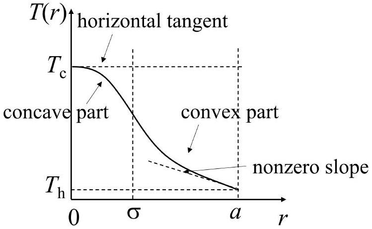
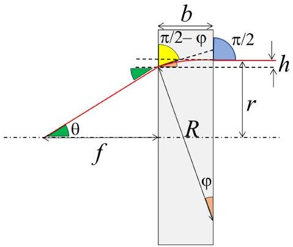
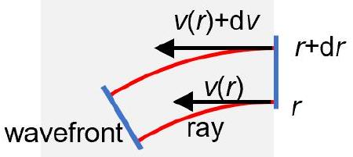

## T1: Thermal lens - Solution

## (a) Drawing a $T ( r )$ graph

The graph should present or clearly infer for the four elements shown in the figure.

| Element of the graph | Pts |
| :--- | :--- |
| Horizontal tangent at $r = 0$ | 0.5 |
| Graph is concave and decreasing in $0 \leq r \leq \sigma$ | 0.5 |
| Graph is convex and decreasing in $\sigma \leq r \leq a$ | 0.5 |
| Nonzero negative slope at $r = a$ | 0.5 |
| Totally on (a) | 2.0 |

## (b) Finding $T _ { \mathrm { c } }$

Approach with a direct solution of the heattransport equation.

Consider a cylindrical cut of the disk with radius $r$. Let $P _ { \text {abs } } ( r )$ be the portion of laser power absorbed within the cylinder. The absorbed power is being transferred as heat towards the outer holder through the circumvent surface $2 \pi b r$ of the cylinder. The heat-transport equation reads:

$$
\begin{equation*}
- k ( 2 \pi r b ) \frac { \mathrm { d } T ( r ) } { \mathrm { d } r } = P _ { \mathrm { abs } } ( r ) \tag{1}
\end{equation*}
$$

Depending on $r$, the absorbed power is given by two different expressions. Within the illuminated area $0 \leq r \leq \sigma$, the incident light intensity $I = P _ { \mathrm { L } } / \left( \pi \sigma ^ { 2 } \right)$ is constant, so the absorbed power is:

$$
\begin{equation*}
P _ { \mathrm { abs } } ( r ) = I \pi r ^ { 2 } = A P _ { \mathrm { L } } \frac { r ^ { 2 } } { \sigma ^ { 2 } } \tag{2}
\end{equation*}
$$

and the solution for $T ( r )$ is quadratic in $r$ :

$$
\begin{equation*}
T ( r ) = T _ { \mathrm { C } } - \frac { A P _ { \mathrm { L } } r ^ { 2 } } { 4 \pi k b \sigma ^ { 2 } } \tag{3}
\end{equation*}
$$

where $T _ { \mathrm { C } } = T ( 0 )$ is the temperature at the center. It is clear from that expression that the parameter $m$ is:

$$
\begin{equation*}
m = - \frac { A P _ { \mathrm { L } } } { 4 \pi k b \sigma ^ { 2 } } = - 1.1 \cdot 10 ^ { 7 } \mathrm { Km } ^ { - 2 } \tag{4}
\end{equation*}
$$

Outside the illuminated area, i.e. for $\sigma \leq r \leq a$, $P _ { \text {abs } } ( r ) = A P _ { \mathrm { L } }$, which does not depend on $r$. The solution for $T ( r )$ is logarithmic in $r$ :

$$
\begin{equation*}
T ( r ) = T _ { \mathrm { h } } + \frac { A P _ { \mathrm { L } } } { 2 \pi k b } \ln \left( \frac { a } { r } \right) \tag{5}
\end{equation*}
$$

where $T _ { \mathrm { h } } = T ( a )$ is the temperature of the holder, which is equal to the temperature along the outer rim of the disk. After matching the two solutions at $r = \sigma$ we obtain:

$$
\begin{equation*}
T _ { \mathrm { C } } = T _ { \mathrm { h } } + \frac { A P _ { \mathrm { L } } } { 4 \pi k b } \left[ 1 + 2 \ln \left( \frac { a } { \sigma } \right) \right] = 41 ^ { \circ } \mathrm { C } \tag{6}
\end{equation*}
$$

| Task | Pts. |
| :--- | :--- |
| Writes down the heat-transport equation in radial coordinates | 0.7 |
| Derives an expression for $P _ { \text {abs } }$ at $0 \leq r \leq \sigma$ | 0.5 |
| Finds a quadratic solution for $T ( r )$ in the region $0 \leq r \leq \sigma$ (Subtract 0.2 pts. if he boundary condition $T ( 0 ) = T _ { \mathrm { C } }$ has not been accounted for) | 0.5 |
| Identifies the expression for $m$ (Subtract 0.1 pts. if the minus sign is missing) | 0.2 |
| Calculates $m$ numerically (Subtract 0.1 pts. if the minus sign is missing) | 0.2 |
| Derives an expression for $P _ { \text {abs } }$ at $\sigma \leq r \leq a$ | 0.3 |
| Finds a logarithmic solution for $T ( r )$ in the region $\sigma \leq r < a$ (Subtract 0.2 pts. if he boundary condition $T ( a ) = T _ { \mathrm { h } }$ has not been accounted for) | 0.5 |
| Sets up an equation by matching the two solutions at $r = a$ | 0.6 |
| Writes down the final expression for $T _ { \mathrm { c } }$ | 0.2 |
| Calculates $T _ { \mathrm { C } }$ numerically | 0.3 |
| Totally on (b) | 4.0 |

## Alternative approach - direct piece-wise integration of the heat-transport equation.

After realizing that $P _ { \text {abs } } ( r )$ is given by a piece-wise function:

$$
P _ { \mathrm { abs } } = \begin{cases} A P _ { \mathrm { L } } r ^ { 2 } / \sigma ^ { 2 } & \text { if } 0 \leq r \leq \sigma  \tag{7}\\ A P _ { \mathrm { L } } = \mathrm { const } & \text { if } \sigma \leq r \leq a \end{cases}
$$

the student may substitute the given solution $T ( r ) =$ $T _ { \mathrm { c } } + m r ^ { 2 }$ into heat-transport equation (1) for $0 \leq r \leq \sigma$. This gives directly the expression (4) for the parameter $m$. The parameter $T _ { \mathrm { c } }$ could be easily identified with the temperature $T ( 0 )$ at the center of the disk. On the other hand, $T _ { \mathrm { h } } = T ( a )$ due to the thermal contact between the rim of the disk and the holder. It follows from the heat-transport equation that:

$$
\begin{equation*}
- \frac { \mathrm { d } T ( r ) } { \mathrm { d } r } = \frac { P _ { \mathrm { abs } } ( r ) } { 2 \pi k b r } \tag{8}
\end{equation*}
$$

The piece-wise integration of the two sides of the equation in the interval $0 \leq r \leq a$ gives:

$$
\begin{align*}
T ( 0 ) - T ( a ) & = T _ { \mathrm { c } } - T _ { \mathrm { h } } = \int _ { 0 } ^ { a } \frac { P _ { \mathrm { abs } } ( r ) } { 2 \pi k b r } \mathrm {~d} r \\
& = \int _ { 0 } ^ { \sigma } \frac { P _ { \mathrm { abs } } ( r ) } { 2 \pi k b r } \mathrm {~d} r + \int _ { \sigma } ^ { a } \frac { P _ { \mathrm { abs } } ( r ) } { 2 \pi k b r } \mathrm {~d} r  \tag{9}\\
& = \frac { A P _ { \mathrm { L } } } { 4 \pi k b } \left[ 1 + 2 \ln \left( \frac { a } { \sigma } \right) \right]
\end{align*}
$$

which is equivalent to the expression (6) for $T _ { \mathrm { c } }$.

| Task | Pts |
| :--- | :--- |
| Writes down the heat-transport equation in radial coordinates | 0.7 |
| Derives an expression for $P _ { \text {abs } }$ at $0 \leq r \leq \sigma$ | 0.5 |
| Derives an expression for $P _ { \text {abs } }$ at $\sigma \leq r \leq a$ | 0.3 |
| Substitutes the given form of $T ( r )$ into heattransport equation for the region $0 \leq r \leq \sigma$ | 0.3 |
| Obtains the expression for $m$ (Subtract 0.1 pts. if the minus sign is missing) | 0.2 |
| Calculates $m$ numerically (Subtract 0.1 pts. if the minus sign is missing) | 0.2 |
| States that $T _ { \mathrm { c } } = T ( 0 )$ | 0.2 |
| States that $T _ { \mathrm { h } } = T ( a )$ | 0.2 |
| Expresses $T _ { \mathrm { c } } - T _ { \mathrm { h } }$ through integral of $\mathrm { d } T / \mathrm { d } r$ in the $0 \leq r \leq a$ interval | 0.3 |
| Calculates the integral in the $0 \leq r \leq \sigma$ interval | 0.3 |
| Calculates the integral in the $\sigma \leq r \leq a$ interval | 0.3 |
| Writes down the final expression for $T _ { \mathrm { c } }$ | 0.2 |
| Calculates $T _ { \mathrm { C } }$ numerically | 0.3 |
| Totally on (b) | 4.0 |

(c) Finding the focal length

Approach based on the Fermat's principle
We consider only the illuminated area of the disk $( 0 \leq r \leq \sigma )$. Due to the nonuniform temperature distribution, the index of refraction is also $r$-dependent, which leads to a bending of the light rays incident at nonzero radii $r$, as shown schematically in the figure. As a result, the light rays exiting the disk, converge toward the optical axis, and, eventually, cross it in a certain point at a distance $f$ from the disk.

Since the ray bending is relatively small, one may assume that: (i) all the rays travel approximately the same distance $b$ inside the disk; (ii) any given ray enters and exits the disk at approximately the same height $r$; (iii) $f \gg r$. Thus, the optical pathway $s ( r )$ of a ray, incident at a height $r$ above the optical axis, is:

$$
\begin{equation*}
s ( r ) \approx n ( r ) b + \sqrt { f ^ { 2 } + r ^ { 2 } } \approx n ( r ) b + f + \frac { r ^ { 2 } } { 2 f } \tag{10}
\end{equation*}
$$

According to Fermat's principle, in order that all the rays focus at the same point, it is necessary that $s ( r )$ is constant within $0 \leq r < \sigma$. In particular, $s ( r ) \equiv s ( 0 )$ for any $r$, which leads to the condition:

$$
\begin{equation*}
b ( n ( 0 ) - n ( r ) ) \equiv \frac { r ^ { 2 } } { 2 f } \tag{11}
\end{equation*}
$$

Since:

$$
\begin{equation*}
n ( 0 ) - n ( r ) = \gamma ( T ( 0 ) - T ( r ) ) = - \gamma m r ^ { 2 } = \gamma | m | r ^ { 2 } \tag{12}
\end{equation*}
$$

condition (11) is satisfied if

$$
\begin{equation*}
\gamma b | m | r ^ { 2 } \equiv \frac { r ^ { 2 } } { 2 f } \tag{13}
\end{equation*}
$$

The beam hence focuses at

$$
\begin{equation*}
f = \frac { 1 } { 2 \gamma b | m | } \tag{14}
\end{equation*}
$$

Taking into account the expression for $m$ derived in part (b), we represent the answer in terms of the known parameters and calculate its numerical value:

$$
\begin{equation*}
f = \frac { 2 \pi k \sigma ^ { 2 } } { \gamma A P } \approx 0.94 \mathrm {~m} \tag{15}
\end{equation*}
$$

Alternatively, the student may state that the optical pathway $s ( r )$ does not depend on $r$ and use the condition $\mathrm { d } s / \mathrm { d } r \equiv 0$, which gives:

$$
\begin{equation*}
\frac { \mathrm { d } n ( r ) } { \mathrm { d } r } b + \frac { r } { f } \equiv 0 \tag{16}
\end{equation*}
$$

Since:

$$
\begin{equation*}
\frac { \mathrm { d } n ( r ) } { \mathrm { d } r } = \frac { \mathrm { d } n } { \mathrm {~d} T } \frac { \mathrm {~d} T } { \mathrm {~d} r } = \gamma 2 m r \tag{17}
\end{equation*}
$$

we obtain:

$$
\begin{equation*}
\frac { r } { f } + 2 b \gamma m r \equiv 0 \tag{18}
\end{equation*}
$$

The beam thus focuses at:

$$
\begin{equation*}
f = \frac { 1 } { 2 \gamma b | m | } = \frac { 2 \pi k \sigma ^ { 2 } } { \gamma A P } \approx 0.94 \mathrm {~m} \tag{19}
\end{equation*}
$$

| Task | Pts |
| :--- | :--- |
| Formulates assumptions (i) and (ii) or equivalent statements | 0.2 |
| Derives a general expression for the optical pathway $s$ as a function of $r$ | 0.8 |
| Uses that $f \gg r$ and derives approximate quadratic expression for $s ( r )$ | 0.5 |
| States that focusing takes place when $s ( r )$ is the same for all rays converging in the focus | 0.5 |
| Writes explicitly equation in the form $s ( r ) \equiv s ( 0 )$ OR $\mathrm { d } s / \mathrm { d } r \equiv 0$ | 0.5 |
| Uses the $T ( r )$ dependence to derive the $n ( r )$ dependence OR to find $\mathrm { d } n / \mathrm { d } r$ | 0.5 |
| Derives an expression for the focal length $f$ in terms of $m$ or of the parameters given in the problem statement | 0.8 |
| Calculates $f$ numerically | 0.2 |
| Totally on (c) | 4.0 |

Approach based on a direct ray/wavefront tracing
As a next approximation, the light ray inside the disk can be modeled as a circular arc of a radius $R ( R \gg b$, see the figure). As a result, the ray exits the disk at a smaller height $r - h$ above the optical axis $( h \ll r )$. The angle of bending $\varphi$ of the ray inside the material is related to $h$ by:

$$
\begin{equation*}
\cos \varphi = 1 - \frac { h } { R } \tag{20}
\end{equation*}
$$

From the Snell's law it follows that:

$$
\begin{equation*}
n ( r ) \sin ( \pi / 2 ) = n ( r - h ) \sin ( \pi / 2 - \varphi ) = n ( r - h ) \cos \varphi \tag{21}
\end{equation*}
$$

Up to terms, linear in $h$, one may write that:

$$
\begin{equation*}
\cos \varphi = \frac { n ( r ) } { n ( r - h ) } \approx 1 + \frac { n ^ { \prime } ( r ) } { n ( r ) } h \tag{22}
\end{equation*}
$$

Thus, the radius of the ray inside the material, is:

$$
\begin{equation*}
R = - \frac { n ( r ) } { n ^ { \prime } ( r ) } \tag{23}
\end{equation*}
$$

and the bending angle is approximately:

$$
\begin{equation*}
\varphi = \frac { b } { R } = - \frac { n ^ { \prime } ( r ) b } { n ( r ) } \tag{24}
\end{equation*}
$$

Alternatively, the students may trace a small part of the wavefront, associated with two rays, incident at close distances $r$ and $r + \mathrm { d } r$ from the optical axis. By noticing that the wavefront is perpendicular to the rays, the angle $\varphi$ of deviation of the rays is equal to the angle of rotation of the wavefront. Let $v ( r ) =$ $c / n ( r )$ be the speed of light in the material at a distance $r$ from the axis. The time-rate $\dot { \varphi }$, i.e. the angular speed of the wavefront is:

$$
\begin{equation*}
\dot { \varphi } = \mathrm { d } v ( r ) / \mathrm { d } r = - c n ^ { \prime } ( r ) / n ( r ) ^ { 2 } \tag{25}
\end{equation*}
$$

The rays reach the opposite surface of the disk in approximately the same time $t = b n ( r ) / c$, so the total deflection angle of the wavefront, and of the rays, thereof, is $\varphi = \dot { \varphi } t = - n ^ { \prime } ( r ) b / n ( r )$

Upon exiting the disk, the ray undergoes additional refraction, and inclines at a new angle $\theta$ relative to the optical axis. The Snell's law in the small-angle approximation ( $\sin \theta \approx \theta , \sin \varphi \approx \varphi$ ) states that:

$$
\begin{equation*}
\theta = n ( r - h ) \varphi \approx n ( r ) \varphi = - n ^ { \prime } ( r ) b \tag{26}
\end{equation*}
$$

Since $n ^ { \prime } ( r ) = \gamma T ^ { \prime } ( r ) = 2 m r$, one obtains the following expression for the angle of inclination:

$$
\begin{equation*}
\theta = 2 \gamma | m | r \tag{27}
\end{equation*}
$$

It is clear from the figure that:

$$
\begin{equation*}
f = \frac { r - h } { \tan \theta } \approx \frac { r } { \theta } = \frac { 1 } { 2 \gamma | m | b } \tag{28}
\end{equation*}
$$

which reproduces the result obtained by the Fermat's principle.

| Task | Pts. |
| :--- | :--- |
| States or shows on a graph that the light ray inside the material can be approximated by an arc OR illustrates on a graph that the wavefront is perpendicular to the light rays | 0.2 |
| Derives the relation $\cos \varphi = 1 - h / R$ or equivalent OR expresses the time of travel of the ray across the disk | 0.5 |
| Applies the Snell's law to the ray path inside the material OR derives a formula for the time-rate $\dot { \varphi }$ by considering the wavefront passing through two closely separated rays | 0.8 |
| Finds expression for the bending angle $\varphi$ inside the material | 0.5 |
| Applies the Snell's law for the refraction of rays exiting the disk | 0.5 |
| Uses the $T ( r )$ dependence to find $n ^ { \prime } ( r )$ | 0.5 |
| Derives an expression for the focal length $f$ in terms of $m$ or of the parameters given in the problem statement | 0.8 |
| Calculates $f$ numerically | 0.2 |
| Totally on (c) | 4.0 |

Alternatively:
Consider a ray incident at a specific height $r _ { 0 }$. Let $x \in [ 0 , b ]$ be the horizontal coordinate of the ray inside the material. Our goal is to find approximately the profile $r ( x )$ of the light ray inside the material. From Snell's law:

$$
n ( r ) \cos \varphi = n \left( r _ { 0 } \right)
$$

Since:

$$
\tan \varphi = - \frac { \mathrm { d } r ( x ) } { \mathrm { d } x } = - \frac { \sqrt { \left( 1 - \cos ^ { 2 } \varphi \right) } } { \cos \varphi }
$$

we obtain:

$$
- \frac { \mathrm { d } r ( x ) } { \mathrm { d } x } = \frac { \sqrt { \left( n ( r ) - n \left( r _ { 0 } \right) \right) \left( n ( r ) + n \left( r _ { 0 } \right) \right) } } { n ( r ) }
$$

Since $n ( r ) \approx n \left( r _ { 0 } \right) + n ^ { \prime } \left( r _ { 0 } \right) \left( r - r _ { 0 } \right) = n \left( r _ { 0 } \right) + 2 \gamma | m | r _ { 0 } \left( r _ { 0 } - r \right)$, the differential equation approximates to:

$$
- \frac { \mathrm { d } r ( x ) } { \mathrm { d } x } = \sqrt { \frac { 4 \gamma | m | r _ { 0 } } { n \left( r _ { 0 } \right) } } \sqrt { r 0 - r }
$$

which is solvable by separation of variables and gives an approximate parabolic path:

$$
r ( x ) = r _ { 0 } - \frac { \gamma | m | r _ { 0 } } { n \left( r _ { 0 } \right) } x ^ { 2 }
$$

Finally, for the angle, just before exiting the disk, we obtain:

$$
\varphi \approx \tan \varphi = - r ^ { \prime } ( x = b ) = \frac { 2 \gamma | m | r _ { 0 } b } { n \left( r _ { 0 } \right) }
$$

| Task | Pts |
| :--- | :--- |
| Applies the Snell's law to express the angle $\varphi$ dependence on $r$ for one ray | 0.8 |
| Expresses $\tan \varphi = d r / d x$ | 0.2 |
| Applies approximation to derive a separable differential equation for $r ( x )$ | 0.8 |
| Integrates to obtain parabolic path | 0.5 |
| Finds expression for the angle $\varphi$, before exiting the disk | 0.2 |
| Applies the Snell's law for the refraction of rays exiting the disk | 0.5 |
| Derives an expression for the focal length $f$ in terms of $m$ or of the parameters given in the problem statement | 0.8 |
| Calculates $f$ numerically | 0.2 |
| Totally on (c) | 4.0 |
